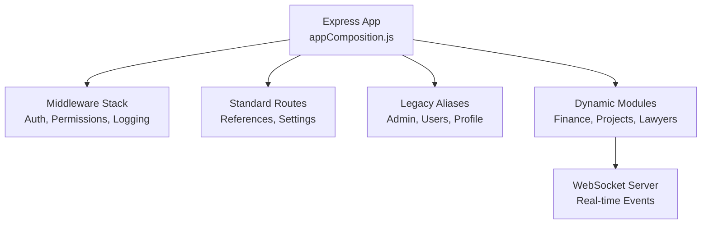
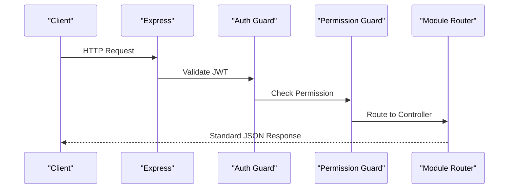
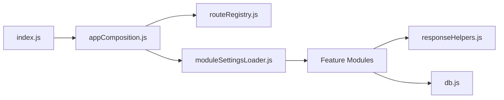

# API Reference

<cite>
**Referenced Files in This Document**
- [backend/index.js](file://backend/index.js)
- [backend/utils/appComposition.js](file://backend/utils/appComposition.js)
- [backend/utils/routeRegistry.js](file://backend/utils/routeRegistry.js)
- [backend/utils/moduleSettingsLoader.js](file://backend/utils/moduleSettingsLoader.js)
- [backend/middleware/auth.js](file://backend/middleware/auth.js)
- [backend/middleware/checkPermission.js](file://backend/middleware/checkPermission.js)
- [backend/utils/responseHelpers.js](file://backend/utils/responseHelpers.js)
- [backend/utils/errorHandler.js](file://backend/utils/errorHandler.js)
- [backend/services/websocketServer.js](file://backend/modules/notifications/services/websocketServer.js)
</cite>

## Table of Contents
1. [Introduction](#introduction)
2. [Project Structure](#project-structure)
3. [Core Components](#core-components)
4. [Architecture Overview](#architecture-overview)
5. [Detailed Component Analysis](#detailed-component-analysis)
6. [Dependency Analysis](#dependency-analysis)
7. [Performance Considerations](#performance-considerations)
8. [Troubleshooting Guide](#troubleshooting-guide)
9. [Conclusion](#conclusion)

## Introduction
This document provides a comprehensive API reference for Titan CRM’s RESTful backend. It covers the modular routing architecture, authentication and authorization flows, standardized response formats, and the dynamic registration of feature-specific endpoints.

## Project Structure
The backend API is designed for high modularity. Endpoints are registered through a decoupled startup sequence:
- **Entry point**: `backend/index.js` (Orchestrates startup).
- **Setup**: `backend/utils/appComposition.js` (Configures global middleware and static routes).
- **Registries**: `backend/utils/routeRegistry.js` (Core utilities and legacy aliases).
- **Modules**: `backend/utils/moduleSettingsLoader.js` (Dynamic feature module mounting).

**Section sources**
- [backend/index.js:1-40](file://backend/index.js#L1-L39)
- [backend/utils/appComposition.js:1-125](file://backend/utils/appComposition.js#L1-L125)
- [backend/utils/routeRegistry.js:1-45](file://backend/utils/routeRegistry.js#L1-L45)
- [backend/utils/moduleSettingsLoader.js:296-345](file://backend/utils/moduleSettingsLoader.js#L296-L345)

## Core Components
- **Authentication**: JWT-based validation in `auth.js`.
- **Authorization**: RBAC with wildcard matching in `checkPermission.js`.
- **Standardized Responses**: Consistent HTTP semantics in `responseHelpers.js`.
- **Dynamic Routing**: Automated discovery of modules in `backend/modules/`.
- **Real-time**: Event-driven communication via `websocketServer.js`.

**Section sources**
- [backend/middleware/auth.js:1-82](file://backend/middleware/auth.js#L1-L81)
- [backend/middleware/checkPermission.js:1-130](file://backend/middleware/checkPermission.js#L1-L129)
- [backend/utils/responseHelpers.js:1-136](file://backend/utils/responseHelpers.js#L1-L136)
- [backend/utils/moduleSettingsLoader.js:1-360](file://backend/utils/moduleSettingsLoader.js#L1-L360)

## Architecture Overview
The API employs a "Layered Modular" architecture. Requests pass through global middleware (Logging, Activity Tracking), then through Auth/Permission guards, and finally reach either static registries or dynamic module routers.

**Section sources**
- [backend/utils/appComposition.js:1-125](file://backend/utils/appComposition.js#L1-L125)
- [backend/middleware/checkPermission.js:1-130](file://backend/middleware/checkPermission.js#L1-L129)

## Detailed Component Analysis

### Authentication & Authorization
- **Headers**: Mandatory `Authorization: Bearer <token>` for protected routes.
- **Permissions**: String-based (e.g., `finance.read`) with wildcard support (`*`).
- **Modes**: `any` (at least one) or `all` (strict requirement).

**Section sources**
- [backend/middleware/auth.js:24-53](file://backend/middleware/auth.js#L24-L53)
- [backend/middleware/checkPermission.js:69-116](file://backend/middleware/checkPermission.js#L69-L116)

### Route Registry & Legacy Support
The system maintains backward compatibility for the frontend during module refactors via `routeRegistry.js`:
- `/api/users` -> `/api/administration/users`
- `/api/profile` -> `/api/profile/me`
- `/api/admin` -> `/api/administration`

**Section sources**
- [backend/utils/routeRegistry.js:1-45](file://backend/utils/routeRegistry.js#L1-L45)

### Dynamic Module Mounting
Modules are automatically mounted at their designated prefixes (e.g., `/api/projects`) if they are registered in the `modules` database table.

**Section sources**
- [backend/utils/moduleSettingsLoader.js:296-345](file://backend/utils/moduleSettingsLoader.js#L296-L345)

## Dependency Analysis
The API infrastructure is heavily decoupled.

**Section sources**
- [backend/index.js:1-40](file://backend/index.js#L1-L39)
- [backend/utils/appComposition.js:1-125](file://backend/utils/appComposition.js#L1-L125)

## Performance Considerations
- **Body Limits**: Request bodies are capped at 10MB to protect memory.
- **Setting Cache**: Module configuration is cached to prevent DB thrashing during request routing.
- **Row Normalization**: `snake_case` to `camelCase` conversion is performed once at the DB layer.

**Section sources**
- [backend/utils/appComposition.js:25-30](file://backend/utils/appComposition.js#L25-L30)
- [backend/db.js:1-68](file://backend/db.js#L1-L68)

## Troubleshooting Guide
- **401 Unauthorized**: JWT secret mismatch or expired token.
- **403 Forbidden**: Missing specific permission string or user is blocked.
- **404 Not Found**: Endpoint does not exist or module is not active in the database.

**Section sources**
- [backend/middleware/auth.js:24-53](file://backend/middleware/auth.js#L24-L53)
- [backend/middleware/checkPermission.js:69-116](file://backend/middleware/checkPermission.js#L69-L116)

## Conclusion
Titan CRM's API Reference documents a scalable, permission-guarded backend. By utilizing modular discovery and standardized utilities, the system ensures consistent behavior and high operational visibility across all domains.