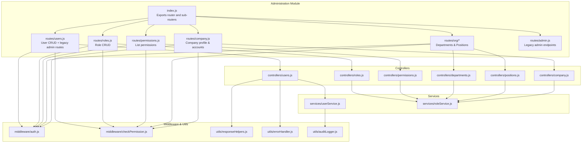
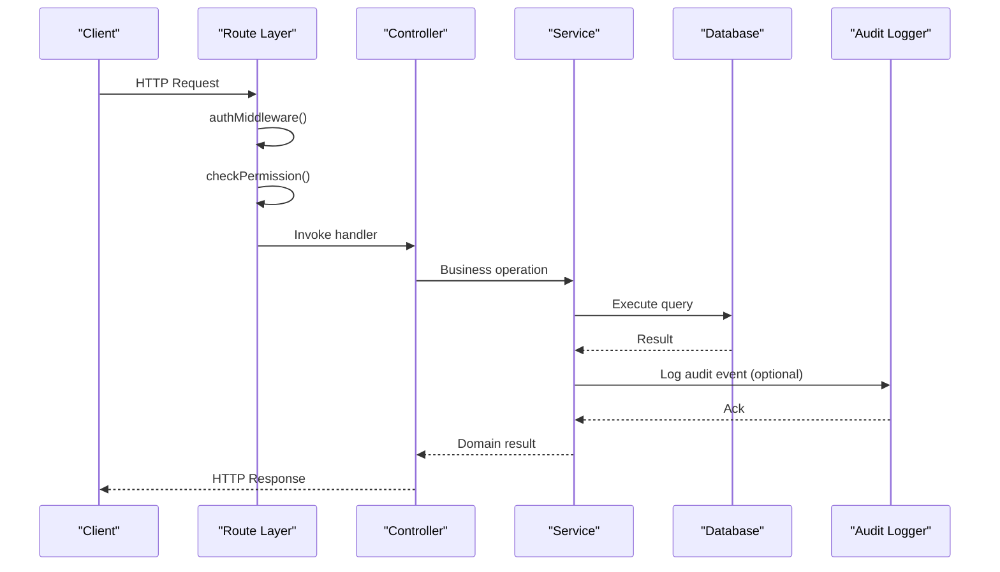
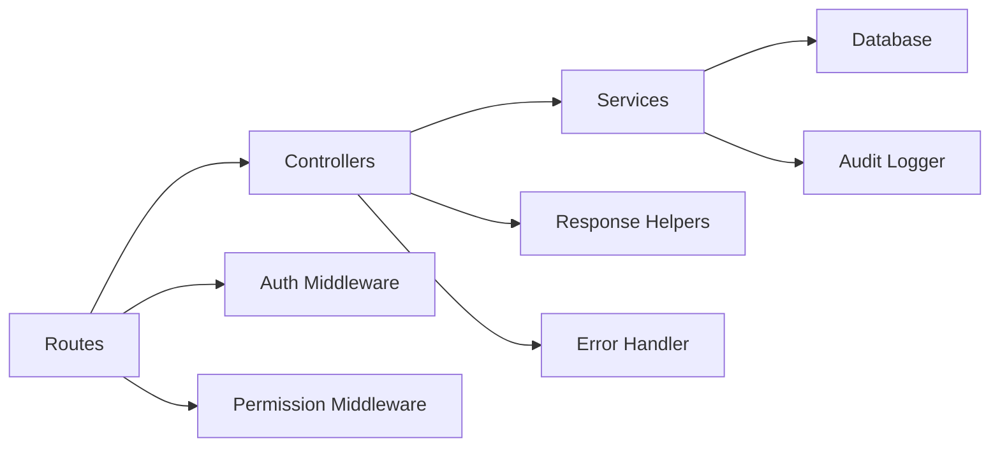

# Administration API

<cite>
**Referenced Files in This Document**
- [index.js](file://backend/modules/administration/index.js)
- [admin.js](file://backend/modules/administration/routes/admin.js)
- [users.js](file://backend/modules/administration/routes/users.js)
- [roles.js](file://backend/modules/administration/routes/roles.js)
- [permissions.js](file://backend/modules/administration/routes/permissions.js)
- [company.js](file://backend/modules/administration/routes/company.js)
- [users.js](file://backend/modules/administration/controllers/users.js)
- [roles.js](file://backend/modules/administration/controllers/roles.js)
- [permissions.js](file://backend/modules/administration/controllers/permissions.js)
- [departments.js](file://backend/modules/administration/controllers/departments.js)
- [positions.js](file://backend/modules/administration/controllers/positions.js)
- [company.js](file://backend/modules/administration/controllers/company.js)
- [userService.js](file://backend/modules/administration/services/userService.js)
- [roleService.js](file://backend/modules/administration/services/roleService.js)
- [auditLogger.js](file://backend/utils/auditLogger.js)
- [auth.js](file://backend/middleware/auth.js)
- [checkPermission.js](file://backend/middleware/checkPermission.js)
- [responseHelpers.js](file://backend/utils/responseHelpers.js)
- [errorHandler.js](file://backend/utils/errorHandler.js)
</cite>

## Table of Contents
1. [Introduction](#introduction)
2. [Project Structure](#project-structure)
3. [Core Components](#core-components)
4. [Architecture Overview](#architecture-overview)
5. [Detailed Component Analysis](#detailed-component-analysis)
6. [Dependency Analysis](#dependency-analysis)
7. [Performance Considerations](#performance-considerations)
8. [Troubleshooting Guide](#troubleshooting-guide)
9. [Conclusion](#conclusion)

## Introduction
This document provides comprehensive API documentation for the Titan CRM Administration module. It covers user management, role assignments, permissions, organizational structure (departments and positions), and company settings. For each endpoint, you will find HTTP methods, URL patterns, request/response schemas, required permissions, parameter validation rules, cascading operations, and bulk operation capabilities. It also documents the hierarchical relationships among users, roles, and permissions, including inheritance patterns and access control enforcement, along with security considerations and audit logging for administrative actions.

## Project Structure
The Administration module is organized by domain resources under a single router prefix. Controllers delegate to services, which interact with the database and enforce validation and audit logging. Middleware enforces authentication and permission checks.

**Diagram sources**
- [index.js:1-34](file://backend/modules/administration/index.js#L1-L33)
- [users.js:1-45](file://backend/modules/administration/routes/users.js#L1-L45)
- [roles.js:1-20](file://backend/modules/administration/routes/roles.js#L1-L19)
- [permissions.js:1-17](file://backend/modules/administration/routes/permissions.js#L1-L16)
- [company.js:1-29](file://backend/modules/administration/routes/company.js#L1-L28)
- [users.js:1-132](file://backend/modules/administration/controllers/users.js#L1-L131)
- [roles.js:1-56](file://backend/modules/administration/controllers/roles.js#L1-L55)
- [permissions.js:1-21](file://backend/modules/administration/controllers/permissions.js#L1-L20)
- [departments.js:1-56](file://backend/modules/administration/controllers/departments.js#L1-L55)
- [positions.js:1-56](file://backend/modules/administration/controllers/positions.js#L1-L55)
- [company.js:1-67](file://backend/modules/administration/controllers/company.js#L1-L66)
- [userService.js:1-554](file://backend/modules/administration/services/userService.js#L1-L553)
- [roleService.js:1-109](file://backend/modules/administration/services/roleService.js#L1-L108)
- [auth.js:1-200](file://backend/middleware/auth.js#L1-L81)
- [checkPermission.js:1-200](file://backend/middleware/checkPermission.js#L1-L129)
- [responseHelpers.js:1-200](file://backend/utils/responseHelpers.js#L1-L136)
- [errorHandler.js:1-200](file://backend/utils/errorHandler.js#L1-L80)
- [auditLogger.js:1-200](file://backend/utils/auditLogger.js#L1-L51)

**Section sources**
- [index.js:1-34](file://backend/modules/administration/index.js#L1-L33)

## Core Components
- Authentication and Authorization
  - All routes in the Administration module are protected by authentication middleware.
  - Permission checks are enforced via a dedicated permission middleware that validates required permissions per route.
- Controllers
  - Each resource has a dedicated controller exposing CRUD endpoints and administrative actions.
- Services
  - Services encapsulate business logic, validation, and database operations, including audit logging.
- Utilities
  - Response helpers standardize success, error, pagination, and deletion responses.
  - Error handler wraps async operations to ensure consistent error propagation.

**Section sources**
- [users.js:1-45](file://backend/modules/administration/routes/users.js#L1-L45)
- [roles.js:1-20](file://backend/modules/administration/routes/roles.js#L1-L19)
- [permissions.js:1-17](file://backend/modules/administration/routes/permissions.js#L1-L16)
- [users.js:1-132](file://backend/modules/administration/controllers/users.js#L1-L131)
- [roles.js:1-56](file://backend/modules/administration/controllers/roles.js#L1-L55)
- [permissions.js:1-21](file://backend/modules/administration/controllers/permissions.js#L1-L20)
- [responseHelpers.js:1-200](file://backend/utils/responseHelpers.js#L1-L136)
- [errorHandler.js:1-200](file://backend/utils/errorHandler.js#L1-L80)

## Architecture Overview
The Administration API follows a layered architecture:
- Routes define HTTP endpoints and apply middleware.
- Controllers handle request parsing, validation, and response formatting.
- Services implement domain logic, enforce constraints, and manage audit trails.
- Middleware enforces authentication and authorization.
- Database queries are executed through a shared connection abstraction.

**Diagram sources**
- [users.js:1-45](file://backend/modules/administration/routes/users.js#L1-L45)
- [roles.js:1-20](file://backend/modules/administration/routes/roles.js#L1-L19)
- [permissions.js:1-17](file://backend/modules/administration/routes/permissions.js#L1-L16)
- [users.js:1-132](file://backend/modules/administration/controllers/users.js#L1-L131)
- [roles.js:1-56](file://backend/modules/administration/controllers/roles.js#L1-L55)
- [permissions.js:1-21](file://backend/modules/administration/controllers/permissions.js#L1-L20)
- [userService.js:1-554](file://backend/modules/administration/services/userService.js#L1-L553)
- [roleService.js:1-109](file://backend/modules/administration/services/roleService.js#L1-L108)
- [auth.js:1-200](file://backend/middleware/auth.js#L1-L81)
- [checkPermission.js:1-200](file://backend/middleware/checkPermission.js#L1-L129)
- [auditLogger.js:1-200](file://backend/utils/auditLogger.js#L1-L51)

## Detailed Component Analysis

### User Management API
- Base Path: `/api/administration/users`
- Prefix: `/api/administration`
- Authentication: Required
- Permissions:
  - List users: `users.read`
  - Paginated list: `users.read`
  - Create user: `users.write`
  - Get user by ID: `users.read`
  - Update user: `users.write`
  - Delete user: `users.delete`
  - Change password: `users.write` or `users.read:self` (any mode)
  - Block/Unblock user: `users.write`

Endpoints
- GET `/api/administration/users`
  - Description: List all users (legacy compatibility).
  - Permissions: `users.read`
  - Response: Array of user objects (flat structure).
- GET `/api/administration/users/paginated`
  - Description: Paginated list of users with filters.
  - Query Parameters:
    - `page`: integer, default 1
    - `limit`: integer, default 20
    - `role_id`: string (filter by role)
    - `is_active`: boolean string (`true`/`false`)
  - Permissions: `users.read`
  - Response: Paginated result with `users`, `total`, `page`, `limit`, `pages`.
- POST `/api/administration/users`
  - Description: Create a new user.
  - Permissions: `users.write`
  - Request Body:
    - `email`: string (required, unique)
    - `password`: string (required, minimum 8 chars, mixed case, digit, special char)
    - `first_name`: string
    - `last_name`: string
    - `role_id`: string (must exist)
    - `phone`: string
  - Response: Created user object.
  - Validation Rules:
    - Email format validation.
    - Unique email constraint.
    - Role existence check.
    - Password strength validation.
  - Cascading Operations:
    - On successful creation, an audit log entry is recorded.
- GET `/api/administration/users/:id`
  - Description: Retrieve a user by ID.
  - Permissions: `users.read`
  - Response: User object.
- PATCH `/api/administration/users/:id`
  - Description: Partially update a user.
  - Permissions: `users.write`
  - Request Body: Same as create plus optional `is_active` and `role_id`.
  - Validation Rules:
    - Email uniqueness when updated.
    - Role existence when updated.
    - Password strength when updating password.
  - Cascading Operations:
    - On successful update, an audit log entry is recorded.
- PUT `/api/administration/users/:id`
  - Description: Full update alias for PATCH.
  - Permissions: `users.write`
- DELETE `/api/administration/users/:id`
  - Description: Soft-delete a user (mark as inactive).
  - Permissions: `users.delete`
  - Response: Deletion confirmation.
  - Cascading Operations:
    - Marks user as inactive; no hard deletion occurs.
- POST `/api/administration/users/:id/change-password`
  - Description: Change user password.
  - Permissions: `users.write` or `users.read:self` (any mode)
  - Request Body:
    - `current_password`: string (required)
    - `new_password`: string (required, validated)
  - Response: Success message.
- POST `/api/administration/users/:id/block`
  - Description: Block a user.
  - Permissions: `users.write`
  - Request Body:
    - `reason`: string (optional)
  - Response: Blocked user object.
- POST `/api/administration/users/:id/unblock`
  - Description: Unblock a user.
  - Permissions: `users.write`
  - Response: Unblocked user object.

Security and Audit
- Authentication enforced via middleware.
- Permission checks per endpoint.
- Audit logging for create/update/delete/password_change actions.

**Section sources**
- [users.js:1-45](file://backend/modules/administration/routes/users.js#L1-L45)
- [users.js:1-132](file://backend/modules/administration/controllers/users.js#L1-L131)
- [userService.js:1-554](file://backend/modules/administration/services/userService.js#L1-L553)
- [auth.js:1-200](file://backend/middleware/auth.js#L1-L81)
- [checkPermission.js:1-200](file://backend/middleware/checkPermission.js#L1-L129)
- [responseHelpers.js:1-200](file://backend/utils/responseHelpers.js#L1-L136)
- [errorHandler.js:1-200](file://backend/utils/errorHandler.js#L1-L80)

### Role Management API
- Base Path: `/api/administration/roles`
- Authentication: Required
- Permissions:
  - List roles: `roles.read`
  - Create role: `roles.write`
  - Update role: `roles.write`
  - Delete role: `roles.delete`

Endpoints
- GET `/api/administration/roles`
  - Description: List all roles with user counts and parsed permissions.
  - Permissions: `roles.read`
  - Response: Array of roles with `userCount` and normalized `permissions`.
- POST `/api/administration/roles`
  - Description: Create a new role.
  - Permissions: `roles.write`
  - Request Body:
    - `name`: string
    - `description`: string
    - `permissions`: array (JSON-serializable)
  - Response: Created role with `userCount: 0`.
- PUT `/api/administration/roles/:id`
  - Description: Update a role.
  - Permissions: `roles.write`
  - Response: Updated role with recalculated `userCount`.
- DELETE `/api/administration/roles/:id`
  - Description: Delete a role.
  - Permissions: `roles.delete`
  - Constraints:
    - Cannot delete roles assigned to users.
  - Response: Deletion confirmation.

Access Control and Inheritance
- Roles encapsulate permissions; users inherit permissions via their assigned role.
- Permission checks are enforced at route level.

**Section sources**
- [roles.js:1-20](file://backend/modules/administration/routes/roles.js#L1-L19)
- [roles.js:1-56](file://backend/modules/administration/controllers/roles.js#L1-L55)
- [roleService.js:1-109](file://backend/modules/administration/services/roleService.js#L1-L108)
- [checkPermission.js:1-200](file://backend/middleware/checkPermission.js#L1-L129)

### Permissions API
- Base Path: `/api/administration/permissions`
- Authentication: Required
- Permissions:
  - List permissions: `roles.read`

Endpoints
- GET `/api/administration/permissions`
  - Description: Retrieve all available permissions, grouped by category.
  - Permissions: `roles.read`
  - Response: Array of permissions.

**Section sources**
- [permissions.js:1-17](file://backend/modules/administration/routes/permissions.js#L1-L16)
- [permissions.js:1-21](file://backend/modules/administration/controllers/permissions.js#L1-L20)
- [roleService.js:1-109](file://backend/modules/administration/services/roleService.js#L1-L108)
- [checkPermission.js:1-200](file://backend/middleware/checkPermission.js#L1-L129)

### Organizational Structure API
- Base Path: `/api/administration/org`
- Authentication: Required
- Permissions:
  - Departments: `org.read` (list), `org.write` (CRUD)
  - Positions: `org.read` (list), `org.write` (CRUD)

Endpoints
- Departments
  - GET `/api/administration/org/departments`
    - Permissions: `org.read`
    - Response: Array of departments.
  - POST `/api/administration/org/departments`
    - Permissions: `org.write`
    - Response: Created department.
  - PUT `/api/administration/org/departments/:id`
    - Permissions: `org.write`
    - Response: Updated department.
  - DELETE `/api/administration/org/departments/:id`
    - Permissions: `org.write`
    - Response: Deletion confirmation.
- Positions
  - GET `/api/administration/org/positions`
    - Permissions: `org.read`
    - Response: Array of positions.
  - POST `/api/administration/org/positions`
    - Permissions: `org.write`
    - Response: Created position.
  - PUT `/api/administration/org/positions/:id`
    - Permissions: `org.write`
    - Response: Updated position.
  - DELETE `/api/administration/org/positions/:id`
    - Permissions: `org.write`
    - Response: Deletion confirmation.

Notes
- These endpoints are implemented via the organization service and controllers.
- No explicit cascading operations are documented for department/position deletions.

**Section sources**
- [departments.js:1-56](file://backend/modules/administration/controllers/departments.js#L1-L55)
- [positions.js:1-56](file://backend/modules/administration/controllers/positions.js#L1-L55)
- [roleService.js:1-109](file://backend/modules/administration/services/roleService.js#L1-L108)
- [checkPermission.js:1-200](file://backend/middleware/checkPermission.js#L1-L129)

### Company Settings API
- Base Path: `/api/administration/company`
- Authentication: Required
- Permissions:
  - Profile: `company.read` (GET), `company.write` (PUT)
  - Accounts: `company.read` (GET), `company.write` (POST/PUT/DELETE)

Endpoints
- GET `/api/administration/company`
  - Description: Retrieve company profile.
  - Permissions: `company.read`
  - Response: Company profile object.
- GET `/api/administration/company/profile`
  - Permissions: `company.read`
  - Response: Company profile.
- PUT `/api/administration/company/profile`
  - Permissions: `company.write`
  - Response: Updated profile.
- GET `/api/administration/company/accounts`
  - Permissions: `company.read`
  - Response: Array of company accounts.
- POST `/api/administration/company/accounts`
  - Permissions: `company.write`
  - Response: Created account.
- PUT `/api/administration/company/accounts/:id`
  - Permissions: `company.write`
  - Response: Updated account.
- DELETE `/api/administration/company/accounts/:id`
  - Permissions: `company.write`
  - Response: Deletion confirmation.

**Section sources**
- [company.js:1-29](file://backend/modules/administration/routes/company.js#L1-L28)
- [company.js:1-67](file://backend/modules/administration/controllers/company.js#L1-L66)

### Legacy Admin API (Delegation)
The legacy admin endpoints under `/api/admin` are delegated to the Administration module and include:
- Health checks, log management, system logs, database stats, maintenance tasks, environment info, and user blocking/unblocking.
- These endpoints are implemented in the legacy admin routes and use helper functions.

Note: While these endpoints are part of the broader Administration module, they are maintained separately from the new modular endpoints documented above.

**Section sources**
- [admin.js:1-403](file://backend/modules/administration/routes/admin.js#L1-L11)

## Dependency Analysis
Key dependencies and relationships:
- Route layer depends on controllers.
- Controllers depend on services.
- Services depend on the database and audit logger.
- Middleware enforces authentication and permission checks.
- Response helpers and error handler standardize responses and error propagation.

**Diagram sources**
- [index.js:1-34](file://backend/modules/administration/index.js#L1-L33)
- [users.js:1-45](file://backend/modules/administration/routes/users.js#L1-L45)
- [roles.js:1-20](file://backend/modules/administration/routes/roles.js#L1-L19)
- [permissions.js:1-17](file://backend/modules/administration/routes/permissions.js#L1-L16)
- [company.js:1-29](file://backend/modules/administration/routes/company.js#L1-L28)
- [users.js:1-132](file://backend/modules/administration/controllers/users.js#L1-L131)
- [roles.js:1-56](file://backend/modules/administration/controllers/roles.js#L1-L55)
- [permissions.js:1-21](file://backend/modules/administration/controllers/permissions.js#L1-L20)
- [departments.js:1-56](file://backend/modules/administration/controllers/departments.js#L1-L55)
- [positions.js:1-56](file://backend/modules/administration/controllers/positions.js#L1-L55)
- [company.js:1-67](file://backend/modules/administration/controllers/company.js#L1-L66)
- [userService.js:1-554](file://backend/modules/administration/services/userService.js#L1-L553)
- [roleService.js:1-109](file://backend/modules/administration/services/roleService.js#L1-L108)
- [auth.js:1-200](file://backend/middleware/auth.js#L1-L81)
- [checkPermission.js:1-200](file://backend/middleware/checkPermission.js#L1-L129)
- [responseHelpers.js:1-200](file://backend/utils/responseHelpers.js#L1-L136)
- [errorHandler.js:1-200](file://backend/utils/errorHandler.js#L1-L80)
- [auditLogger.js:1-200](file://backend/utils/auditLogger.js#L1-L51)

**Section sources**
- [index.js:1-34](file://backend/modules/administration/index.js#L1-L33)

## Performance Considerations
- Pagination: Use paginated user listing to avoid large payloads.
- Indexes: Ensure database indexes exist on frequently filtered columns (e.g., role_id, is_active).
- Audit logging: Minimal overhead; failures are logged but do not block primary operations.
- Middleware: Authentication and permission checks add negligible overhead compared to database calls.

## Troubleshooting Guide
Common issues and resolutions:
- Authentication failures
  - Symptom: 401 Unauthorized on protected endpoints.
  - Cause: Missing or invalid authentication token.
  - Resolution: Ensure proper authentication header is sent.
- Permission denied
  - Symptom: 403 Forbidden.
  - Cause: Missing required permission for the endpoint.
  - Resolution: Assign appropriate role(s) with required permissions.
- Validation errors
  - Symptom: 400 Bad Request with validation message.
  - Causes:
    - Invalid email format.
    - Duplicate email.
    - Role not found.
    - Password too weak.
  - Resolution: Fix input according to validation rules.
- Resource not found
  - Symptom: 404 Not Found.
  - Causes: Non-existent user/role/department/position.
  - Resolution: Verify IDs and existence.
- Role deletion blocked
  - Symptom: 400 Bad Request.
  - Cause: Role assigned to users.
  - Resolution: Reassign or remove users before deleting role.
- Audit logging failures
  - Symptom: Operation succeeds despite audit log errors.
  - Cause: Audit log write failure.
  - Resolution: Check audit log table and permissions; operation continues unaffected.

**Section sources**
- [users.js:1-132](file://backend/modules/administration/controllers/users.js#L1-L131)
- [userService.js:1-554](file://backend/modules/administration/services/userService.js#L1-L553)
- [roles.js:1-56](file://backend/modules/administration/controllers/roles.js#L1-L55)
- [roleService.js:1-109](file://backend/modules/administration/services/roleService.js#L1-L108)
- [checkPermission.js:1-200](file://backend/middleware/checkPermission.js#L1-L129)
- [auth.js:1-200](file://backend/middleware/auth.js#L1-L81)

## Conclusion
The Administration API provides a comprehensive, permission-enforced interface for managing users, roles, permissions, organizational structure, and company settings. It emphasizes strong validation, audit logging, and layered middleware for security. The modular design ensures maintainability and scalability, while standardized response helpers simplify client integration.