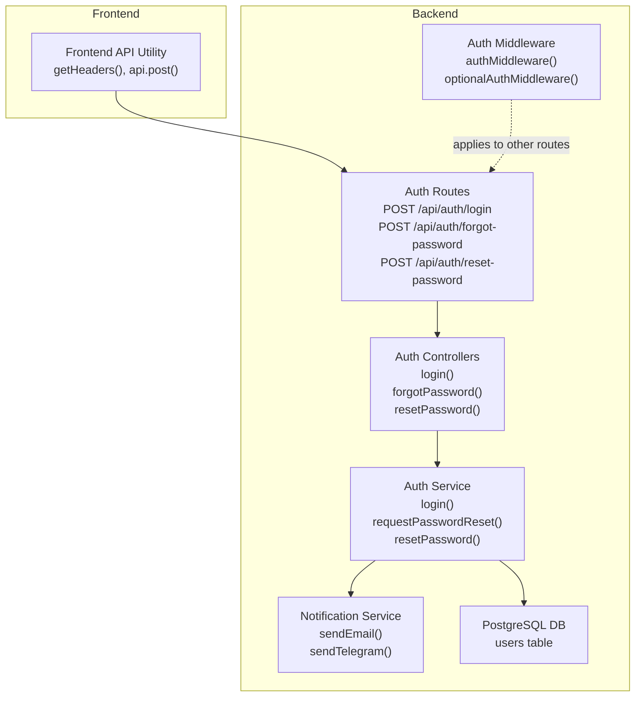
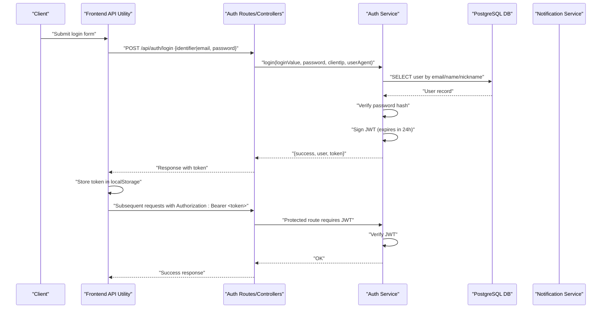
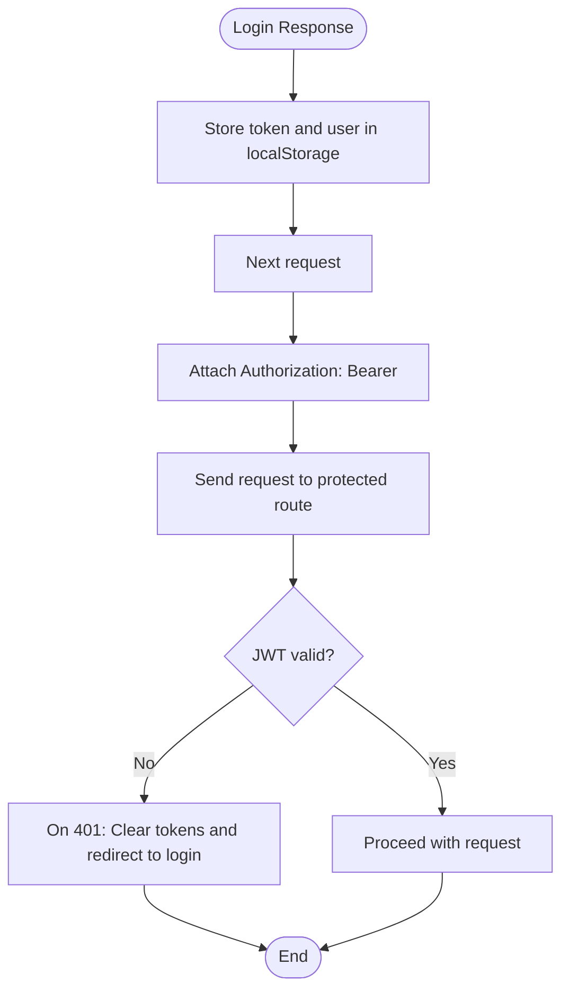
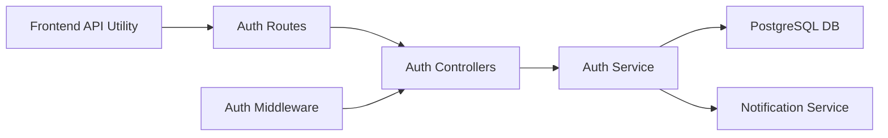

# Authentication API

<cite>
**Referenced Files in This Document**
- [backend/modules/auth/routes.js](file://backend/modules/auth/routes.js)
- [backend/modules/auth/controllers.js](file://backend/modules/auth/controllers.js)
- [backend/modules/auth/services/authService.js](file://backend/modules/auth/services/authService.js)
- [backend/modules/auth/index.js](file://backend/modules/auth/index.js)
- [backend/middleware/auth.js](file://backend/middleware/auth.js)
- [backend/utils/notificationService.js](file://backend/utils/notificationService.js)
- [backend/db.js](file://backend/db.js)
- [backend/migrations/35_add_auth_columns_to_users.md](file://backend/migrations/35_add_auth_columns_to_users.md)
- [frontend/src/lib/api.ts](file://frontend/src/lib/api.ts)
- [docs/backend/AUTH_SETUP.md](file://docs/backend/AUTH_SETUP.md)
</cite>

## Table of Contents
1. [Introduction](#introduction)
2. [Project Structure](#project-structure)
3. [Core Components](#core-components)
4. [Architecture Overview](#architecture-overview)
5. [Detailed Component Analysis](#detailed-component-analysis)
6. [Dependency Analysis](#dependency-analysis)
7. [Performance Considerations](#performance-considerations)
8. [Troubleshooting Guide](#troubleshooting-guide)
9. [Conclusion](#conclusion)
10. [Appendices](#appendices)

## Introduction
This document provides comprehensive API documentation for Titan CRM’s authentication endpoints. It covers login, password reset initiation, and password reset completion. It also documents JWT token handling, session management via local storage, and password validation rules. The authentication flow is explained end-to-end, including error responses for invalid credentials, expired tokens, and locked accounts. Client implementation examples show proper token storage, header configuration, and automatic token refresh mechanisms. Security considerations such as CSRF protection, rate limiting, and secure token transmission are addressed.

## Project Structure
The authentication system is implemented as a dedicated Express module with routes, controllers, and a service layer. Middleware enforces JWT-based authorization on protected routes. Frontend utilities centralize API calls and token handling.

**Diagram sources**
- [backend/modules/auth/routes.js:15-31](file://backend/modules/auth/routes.js#L15-L31)
- [backend/modules/auth/controllers.js:10-62](file://backend/modules/auth/controllers.js#L10-L62)
- [backend/modules/auth/services/authService.js:15-226](file://backend/modules/auth/services/authService.js#L15-L226)
- [backend/middleware/auth.js:6-78](file://backend/middleware/auth.js#L6-L78)
- [backend/utils/notificationService.js:24-80](file://backend/utils/notificationService.js#L24-L80)
- [frontend/src/lib/api.ts:16-138](file://frontend/src/lib/api.ts#L16-L138)

**Section sources**
- [backend/modules/auth/routes.js:15-31](file://backend/modules/auth/routes.js#L15-L31)
- [backend/modules/auth/controllers.js:10-62](file://backend/modules/auth/controllers.js#L10-L62)
- [backend/modules/auth/services/authService.js:15-226](file://backend/modules/auth/services/authService.js#L15-L226)
- [backend/middleware/auth.js:6-78](file://backend/middleware/auth.js#L6-L78)
- [frontend/src/lib/api.ts:16-138](file://frontend/src/lib/api.ts#L16-L138)

## Core Components
- Auth Routes: Define HTTP endpoints for authentication.
- Auth Controllers: Validate request bodies and delegate to the service layer.
- Auth Service: Implements business logic for login, password reset initiation, and reset completion.
- Auth Middleware: Enforces JWT-based authorization on protected routes.
- Notification Service: Sends password reset links via email or Telegram.
- Frontend API Utility: Centralizes request headers, token retrieval, and 401 handling.

**Section sources**
- [backend/modules/auth/routes.js:15-31](file://backend/modules/auth/routes.js#L15-L31)
- [backend/modules/auth/controllers.js:10-62](file://backend/modules/auth/controllers.js#L10-L62)
- [backend/modules/auth/services/authService.js:15-226](file://backend/modules/auth/services/authService.js#L15-L226)
- [backend/middleware/auth.js:6-78](file://backend/middleware/auth.js#L6-L78)
- [backend/utils/notificationService.js:24-80](file://backend/utils/notificationService.js#L24-L80)
- [frontend/src/lib/api.ts:16-138](file://frontend/src/lib/api.ts#L16-L138)

## Architecture Overview
The authentication flow spans frontend and backend:
- Frontend sends credentials to the login endpoint.
- Backend validates credentials against the users table and issues a signed JWT.
- Frontend stores the token and attaches it to subsequent requests.
- Protected routes enforce JWT verification via middleware.
- Password reset uses a one-time token stored in the users table and sent via email or Telegram.

**Diagram sources**
- [backend/modules/auth/routes.js:15-31](file://backend/modules/auth/routes.js#L15-L31)
- [backend/modules/auth/controllers.js:10-25](file://backend/modules/auth/controllers.js#L10-L25)
- [backend/modules/auth/services/authService.js:15-74](file://backend/modules/auth/services/authService.js#L15-L74)
- [backend/middleware/auth.js:41-53](file://backend/middleware/auth.js#L41-L53)
- [frontend/src/lib/api.ts:16-38](file://frontend/src/lib/api.ts#L16-L38)

## Detailed Component Analysis

### Endpoints

#### POST /api/auth/login
- Purpose: Authenticate user and issue JWT.
- Authentication: None.
- Request body:
  - Required: One of the following:
    - identifier: string (email or username/nickname)
    - email: string (alternative to identifier)
  - Required: password: string
- Response:
  - success: boolean
  - user: object containing id, name, email, nickname, role, initials, avatar
  - token: string (JWT, expires in 24 hours)
- Error responses:
  - 400: Missing credentials or invalid payload.
  - 401: User not found or wrong password.
  - 500: Internal server error during login.

**Section sources**
- [backend/modules/auth/routes.js:16-19](file://backend/modules/auth/routes.js#L16-L19)
- [backend/modules/auth/controllers.js:10-25](file://backend/modules/auth/controllers.js#L10-L25)
- [backend/modules/auth/services/authService.js:15-74](file://backend/modules/auth/services/authService.js#L15-L74)

#### POST /api/auth/forgot-password
- Purpose: Initiate password reset by sending a reset link via email or Telegram.
- Authentication: None.
- Request body:
  - Required: identifier: string (email or nickname)
  - Optional: method: "email" | "telegram"
- Behavior:
  - If method is omitted and both channels are available, responds with requireSelection: true and options.
  - Generates a reset token and expiration timestamp, then sends a link to the chosen channel.
- Response:
  - requireSelection: boolean (when method is omitted)
  - options: object (when requireSelection is true)
  - success: boolean
  - message: string
  - error: string (on failure)
- Error responses:
  - 400: Missing identifier or unavailable method.
  - 400/500: Channel-specific errors (e.g., email/Telegram not configured).

**Section sources**
- [backend/modules/auth/routes.js:21-25](file://backend/modules/auth/routes.js#L21-L25)
- [backend/modules/auth/controllers.js:30-45](file://backend/modules/auth/controllers.js#L30-L45)
- [backend/modules/auth/services/authService.js:79-192](file://backend/modules/auth/services/authService.js#L79-L192)
- [backend/utils/notificationService.js:24-80](file://backend/utils/notificationService.js#L24-L80)

#### POST /api/auth/reset-password
- Purpose: Complete password reset using the reset token.
- Authentication: None.
- Request body:
  - Required: token: string
  - Required: newPassword: string (minimum length 6)
- Response:
  - success: boolean
  - message: string
- Error responses:
  - 400: Missing token/newPassword or invalid/expired token.
  - 500: Internal server error.

**Section sources**
- [backend/modules/auth/routes.js:27-31](file://backend/modules/auth/routes.js#L27-L31)
- [backend/modules/auth/controllers.js:47-62](file://backend/modules/auth/controllers.js#L47-L62)
- [backend/modules/auth/services/authService.js:197-226](file://backend/modules/auth/services/authService.js#L197-L226)

### JWT Token Handling and Session Management
- Token issuance: Signed JWT with a 24-hour expiry.
- Storage: Frontend stores token and user info in localStorage.
- Header configuration: Authorization header with Bearer scheme.
- Automatic token refresh: The current implementation does not include a built-in refresh mechanism; upon 401, the frontend clears tokens and redirects to login.

**Diagram sources**
- [frontend/src/lib/api.ts:16-38](file://frontend/src/lib/api.ts#L16-L38)
- [frontend/src/lib/api.ts:66-77](file://frontend/src/lib/api.ts#L66-L77)
- [backend/middleware/auth.js:41-53](file://backend/middleware/auth.js#L41-L53)

**Section sources**
- [frontend/src/lib/api.ts:16-38](file://frontend/src/lib/api.ts#L16-L38)
- [frontend/src/lib/api.ts:66-77](file://frontend/src/lib/api.ts#L66-L77)
- [backend/middleware/auth.js:41-53](file://backend/middleware/auth.js#L41-L53)

### Password Validation Rules
- Minimum password length: 6 characters.
- Reset token validity: Tokens expire after 1 hour.

**Section sources**
- [backend/modules/auth/services/authService.js:202-204](file://backend/modules/auth/services/authService.js#L202-L204)
- [backend/modules/auth/services/authService.js:158-159](file://backend/modules/auth/services/authService.js#L158-L159)

### Complete Authentication Flow
- Login:
  - Submit credentials to /api/auth/login.
  - Receive token and user profile.
  - Store token in localStorage and attach to future requests.
- Protected routes:
  - Include Authorization: Bearer <token>.
  - Middleware verifies the token; 401 on failure.
- Logout:
  - Not implemented as a dedicated endpoint. Typical pattern is to clear localStorage on the client and rely on token expiry.

**Section sources**
- [backend/modules/auth/routes.js:16-19](file://backend/modules/auth/routes.js#L16-L19)
- [backend/middleware/auth.js:41-53](file://backend/middleware/auth.js#L41-L53)
- [frontend/src/lib/api.ts:16-38](file://frontend/src/lib/api.ts#L16-L38)

### Client Implementation Examples
- Token storage:
  - Store token and user info in localStorage after successful login.
- Header configuration:
  - Always include x-user-id and Authorization: Bearer <token> when available.
- Automatic token refresh:
  - The current implementation does not support refresh; handle 401 by clearing tokens and redirecting to login.

**Section sources**
- [frontend/src/lib/api.ts:16-38](file://frontend/src/lib/api.ts#L16-L38)
- [frontend/src/lib/api.ts:66-77](file://frontend/src/lib/api.ts#L66-L77)

## Dependency Analysis

**Diagram sources**
- [backend/modules/auth/routes.js:15-31](file://backend/modules/auth/routes.js#L15-L31)
- [backend/modules/auth/controllers.js:10-62](file://backend/modules/auth/controllers.js#L10-L62)
- [backend/modules/auth/services/authService.js:15-226](file://backend/modules/auth/services/authService.js#L15-L226)
- [backend/utils/notificationService.js:24-80](file://backend/utils/notificationService.js#L24-L80)
- [backend/middleware/auth.js:6-78](file://backend/middleware/auth.js#L6-L78)
- [frontend/src/lib/api.ts:16-138](file://frontend/src/lib/api.ts#L16-L138)

**Section sources**
- [backend/modules/auth/routes.js:15-31](file://backend/modules/auth/routes.js#L15-L31)
- [backend/modules/auth/controllers.js:10-62](file://backend/modules/auth/controllers.js#L10-L62)
- [backend/modules/auth/services/authService.js:15-226](file://backend/modules/auth/services/authService.js#L15-L226)
- [backend/middleware/auth.js:6-78](file://backend/middleware/auth.js#L6-L78)
- [frontend/src/lib/api.ts:16-138](file://frontend/src/lib/api.ts#L16-L138)

## Performance Considerations
- Token verification occurs on each protected request; keep middleware lightweight and avoid unnecessary logging in production.
- Password hashing uses bcrypt; ensure appropriate work factor for your environment.
- Reset token generation is simple; consider cryptographic randomness if scaling.

## Troubleshooting Guide
- Invalid credentials:
  - Symptoms: 401 Unauthorized on login.
  - Resolution: Verify identifier and password; ensure user exists and password hash is present.
- Expired or invalid JWT:
  - Symptoms: 401 Unauthorized on protected routes.
  - Resolution: Clear stored tokens and re-authenticate; ensure clock synchronization.
- Password reset token invalid or expired:
  - Symptoms: 400 Bad Request on reset-password.
  - Resolution: Re-initiate forgot-password; ensure token not older than 1 hour.
- Email/Telegram delivery failures:
  - Symptoms: Errors indicating notification send failures.
  - Resolution: Check system settings for email/Telegram configuration and availability.

**Section sources**
- [backend/modules/auth/controllers.js:20-24](file://backend/modules/auth/controllers.js#L20-L24)
- [backend/modules/auth/controllers.js:57-61](file://backend/modules/auth/controllers.js#L57-L61)
- [backend/modules/auth/services/authService.js:211-213](file://backend/modules/auth/services/authService.js#L211-L213)
- [backend/utils/notificationService.js:24-80](file://backend/utils/notificationService.js#L24-L80)

## Conclusion
Titan CRM’s authentication API provides secure login, password reset initiation, and completion via JWT. The frontend integrates seamlessly with the backend using standardized headers and token storage. While logout is not exposed as a dedicated endpoint, typical client-side token clearing suffices. Enhancements such as CSRF protection, rate limiting, and a token refresh endpoint are recommended for production hardening.

## Appendices

### Data Model: Users Table (Authentication Columns)
- password_hash: string (bcrypt hash)
- nickname: string
- telegram_token: string
- reset_token: string
- reset_token_expires: timestamp

**Section sources**
- [backend/migrations/35_add_auth_columns_to_users.md:5-58](file://backend/migrations/35_add_auth_columns_to_users.md#L5-L58)

### Security Considerations
- CSRF protection: Not implemented. Use anti-CSRF tokens or SameSite cookies for web clients.
- Rate limiting: Not implemented. Apply per-endpoint limits to prevent brute force attacks.
- Secure token transmission: Use HTTPS/TLS; store tokens securely (avoid sessionStorage for sensitive apps).
- Environment configuration: Disable auth only for development; ensure JWT secret is strong and managed securely.

**Section sources**
- [docs/backend/AUTH_SETUP.md:1-39](file://docs/backend/AUTH_SETUP.md#L1-L39)