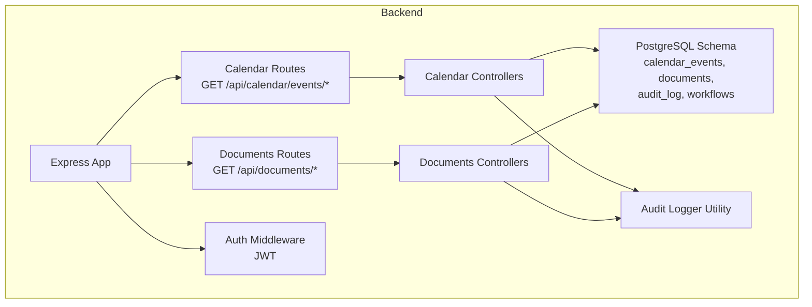
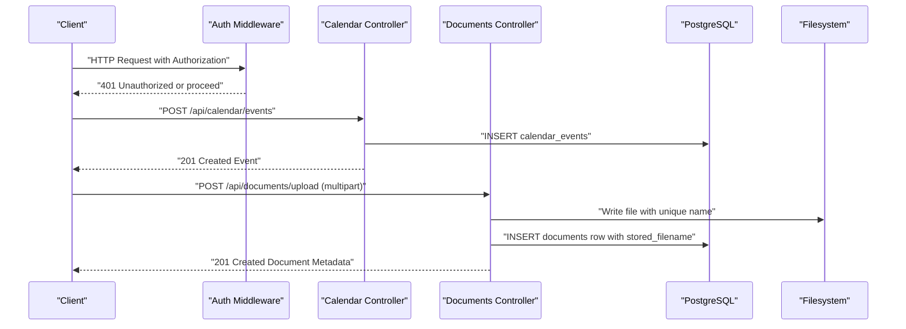
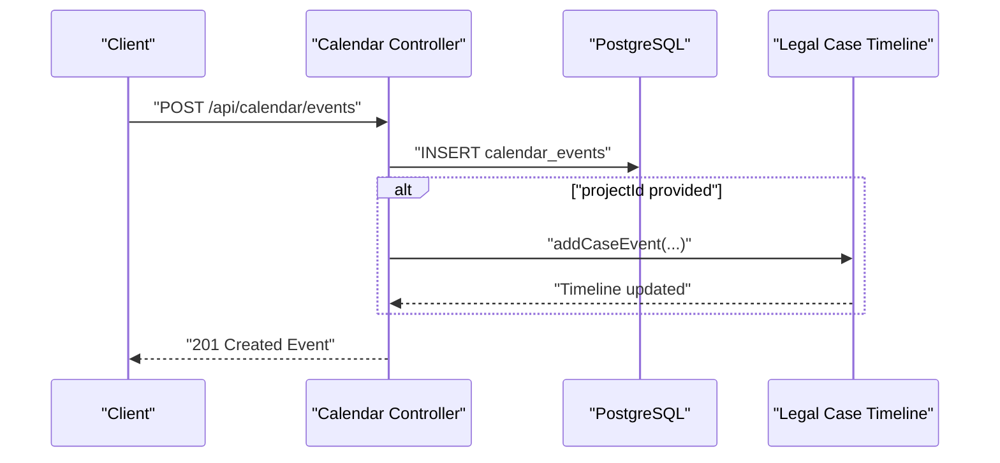
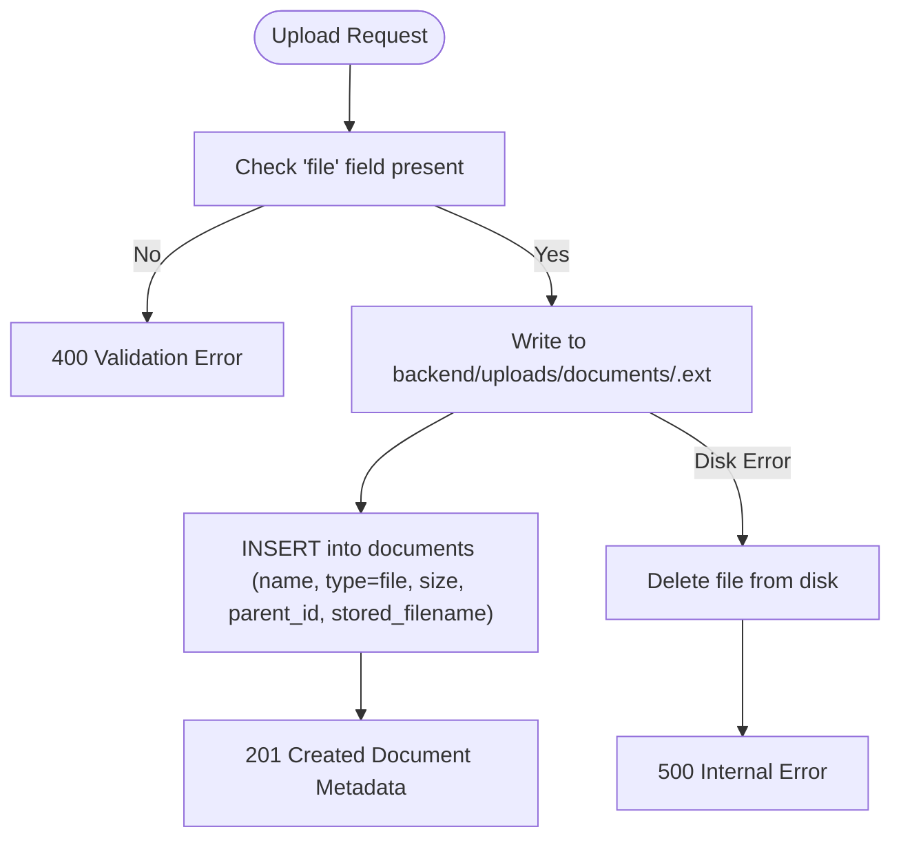
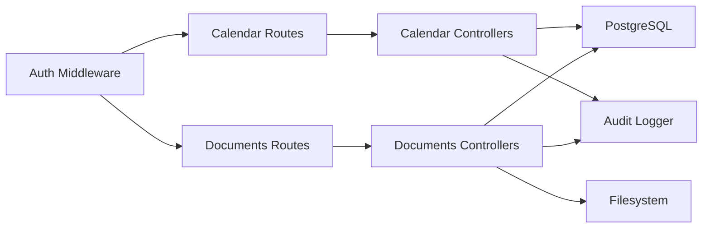
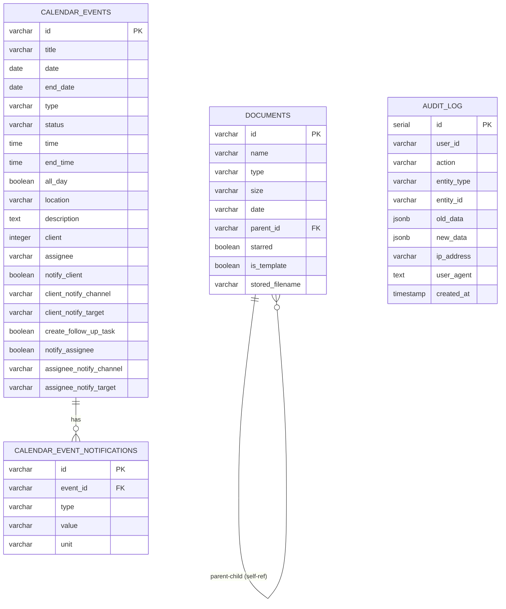

# Calendar & Documents API

<cite>
**Referenced Files in This Document**
- [controllers.js](file://backend/modules/calendar/controllers.js)
- [routes.js](file://backend/modules/calendar/routes.js)
- [CALENDAR.md](file://docs/api/CALENDAR.md)
- [controllers.js](file://backend/modules/documents/controllers/documents.js)
- [routes.js](file://backend/modules/documents/routes.js)
- [DOCUMENTS.md](file://docs/api/DOCUMENTS.md)
- [10_create_calendar_events_table.md](file://backend/migrations/10_create_calendar_events_table.md)
- [03_create_documents_table.md](file://backend/migrations/03_create_documents_table.md)
- [39_add_stored_filename_to_documents.md](file://backend/migrations/39_add_stored_filename_to_documents.md)
- [104_add_template_flag_to_documents.sql](file://backend/migrations/104_add_template_flag_to_documents.sql)
- [auth.js](file://backend/middleware/auth.js)
- [auditLogger.js](file://backend/utils/auditLogger.js)
- [101_create_workflow_tables.sql](file://backend/migrations/101_create_workflow_tables.sql)
- [102_create_audit_log_table.sql](file://backend/migrations/102_create_audit_log_table.sql)
</cite>

## Table of Contents
1. [Introduction](#introduction)
2. [Project Structure](#project-structure)
3. [Core Components](#core-components)
4. [Architecture Overview](#architecture-overview)
5. [Detailed Component Analysis](#detailed-component-analysis)
6. [Dependency Analysis](#dependency-analysis)
7. [Performance Considerations](#performance-considerations)
8. [Troubleshooting Guide](#troubleshooting-guide)
9. [Conclusion](#conclusion)
10. [Appendices](#appendices)

## Introduction
This document provides comprehensive API documentation for Titan CRM’s Calendar and Documents modules. It covers event lifecycle management (creation, scheduling, updates, deletion), document upload and file management, and integration patterns with external systems. It also documents the document template flagging mechanism, audit logging, and access control via JWT. Examples of calendar-event-document integration, automated document tagging, and workflow triggers are included to guide integrators building end-to-end solutions.

## Project Structure
The Calendar and Documents APIs are implemented as Express routers backed by PostgreSQL tables. Controllers handle HTTP requests, while migrations define the persistent schema. Middleware enforces authentication, and utilities support auditing and file storage.

**Diagram sources**
- [routes.js:1-25](file://backend/modules/calendar/routes.js#L1-L24)
- [routes.js:1-15](file://backend/modules/documents/routes.js#L1-L14)
- [controllers.js:1-312](file://backend/modules/calendar/controllers.js#L1-L311)
- [controllers.js:1-275](file://backend/modules/documents/controllers/documents.js#L1-L275)
- [10_create_calendar_events_table.md:1-83](file://backend/migrations/10_create_calendar_events_table.md#L1-L83)
- [03_create_documents_table.md:1-38](file://backend/migrations/03_create_documents_table.md#L1-L38)
- [102_create_audit_log_table.sql:1-21](file://backend/migrations/102_create_audit_log_table.sql#L1-L20)
- [101_create_workflow_tables.sql:1-54](file://backend/migrations/101_create_workflow_tables.sql#L1-L53)
- [auth.js:1-82](file://backend/middleware/auth.js#L1-L81)
- [auditLogger.js:1-52](file://backend/utils/auditLogger.js#L1-L51)

**Section sources**
- [routes.js:1-25](file://backend/modules/calendar/routes.js#L1-L24)
- [routes.js:1-15](file://backend/modules/documents/routes.js#L1-L14)
- [controllers.js:1-312](file://backend/modules/calendar/controllers.js#L1-L311)
- [controllers.js:1-275](file://backend/modules/documents/controllers/documents.js#L1-L275)

## Core Components
- Calendar API: CRUD for calendar events, including notification metadata and optional integration with legal case timelines.
- Documents API: Folder and file management, upload with size limits, download, sharing, starring, and template flagging.
- Access Control: JWT-based authentication enforced globally via middleware.
- Audit Logging: Centralized audit trail for user actions.
- Workflows: Engine for scheduled and event-driven automations that can integrate calendar and document operations.

**Section sources**
- [controllers.js:1-312](file://backend/modules/calendar/controllers.js#L1-L311)
- [controllers.js:1-275](file://backend/modules/documents/controllers/documents.js#L1-L275)
- [auth.js:1-82](file://backend/middleware/auth.js#L1-L81)
- [auditLogger.js:1-52](file://backend/utils/auditLogger.js#L1-L51)
- [101_create_workflow_tables.sql:1-54](file://backend/migrations/101_create_workflow_tables.sql#L1-L53)

## Architecture Overview
The Calendar and Documents modules expose REST endpoints under dedicated base URLs. Requests pass through authentication middleware, then reach controllers that interact with PostgreSQL via database queries. Documents are stored on disk with unique filenames, while metadata is persisted in the database. Audit logs capture user actions, and workflows enable automated integrations.

**Diagram sources**
- [auth.js:1-82](file://backend/middleware/auth.js#L1-L81)
- [controllers.js:112-186](file://backend/modules/calendar/controllers.js#L112-L186)
- [controllers.js:93-139](file://backend/modules/documents/controllers/documents.js#L93-L139)
- [10_create_calendar_events_table.md:1-83](file://backend/migrations/10_create_calendar_events_table.md#L1-L83)
- [03_create_documents_table.md:1-38](file://backend/migrations/03_create_documents_table.md#L1-L38)
- [39_add_stored_filename_to_documents.md:1-21](file://backend/migrations/39_add_stored_filename_to_documents.md#L1-L20)

## Detailed Component Analysis

### Calendar API
Endpoints manage calendar events with optional notifications and integration hooks.

- Base URL: /api/calendar
- Authentication: Required for protected endpoints (via global middleware)
- Persistence: calendar_events and calendar_event_notifications tables

Key endpoints:
- GET /events
  - Returns all events, mapping legacy fields for frontend compatibility.
  - Response: Array of events.
  - Behavior: If the calendar_events table does not exist, returns empty array.

- GET /events/:id
  - Returns a single event with associated notifications loaded.
  - Response: Event object.

- POST /events
  - Creates a new event with optional notification metadata.
  - Request body fields:
    - title (required), date (required), endDate, time, endTime, allDay, location, description
    - type, status, priority (defaults applied)
    - contractorId, projectId, assignee
    - notifyClient, clientNotifyChannel, clientNotifyTarget
    - createFollowUpTask
    - notifyAssignee, assigneeNotifyChannel, assigneeNotifyTarget
    - notifications (array of notification descriptors)
  - Response: 201 Created event object.
  - Integration: On successful creation, if projectId is present, a timeline event is added to the legal case module.

- PUT /events/:id
  - Partially updates an existing event. Fields not provided remain unchanged.
  - Request body: Same as POST, with selective overrides.
  - Response: Updated event object.
  - Behavior: Replaces notifications if an explicit array is provided; otherwise preserves existing notifications.

- DELETE /events/:id
  - Removes an event by ID.
  - Response: Success object.

Data model highlights (schema):
- calendar_events: id, title, date, end_date, type, status, time, end_time, all_day, location, description, client, assignee, notify_client, client_notify_channel, client_notify_target, create_follow_up_task, notify_assignee, assignee_notify_channel, assignee_notify_target.
- calendar_event_notifications: id, event_id, type, value, unit.

Notes:
- Frontend compatibility mapping occurs in controllers (e.g., date -> startDate, end_date -> endDate, client -> contractorId, project_id -> projectId).
- If the calendar_events table does not exist, endpoints gracefully return empty results or validation errors.

**Section sources**
- [routes.js:1-25](file://backend/modules/calendar/routes.js#L1-L24)
- [controllers.js:56-303](file://backend/modules/calendar/controllers.js#L56-L303)
- [10_create_calendar_events_table.md:1-83](file://backend/migrations/10_create_calendar_events_table.md#L1-L83)
- [CALENDAR.md:1-201](file://docs/api/CALENDAR.md#L1-L200)

#### Calendar Event Creation Flow

**Diagram sources**
- [controllers.js:112-186](file://backend/modules/calendar/controllers.js#L112-L186)
- [10_create_calendar_events_table.md:1-83](file://backend/migrations/10_create_calendar_events_table.md#L1-L83)

### Documents API
Endpoints manage folders and files, including upload, download, deletion, starring, and template flagging.

- Base URL: /api/documents
- Authentication: Optional for downloads/share; required for write operations (enforced by middleware)
- Persistence: documents table; files stored on disk under backend/uploads/documents

Key endpoints:
- GET /
  - Returns all documents and folders ordered by date.
  - Response: Array of items.

- POST /folder
  - Creates a new folder.
  - Request body: name (required), parentId (optional).
  - Response: 201 Created folder item.

- POST /upload
  - Uploads a file via multipart/form-data.
  - Form fields:
    - file (required)
    - folderId (optional)
  - Limits: Max file size 100 MB.
  - Response: 201 Created document metadata with stored_filename.
  - Storage: Unique filename generated; original name preserved in name field.

- PATCH /:id/star
  - Toggles starred flag.
  - Request body: starred (boolean).
  - Response: Updated document item.

- PATCH /:id/template
  - Sets is_template flag for workflow automation.
  - Request body: is_template (boolean).
  - Response: Updated document item.

- POST /delete
  - Deletes multiple documents/folders by IDs.
  - Request body: ids (array).
  - Response: Success message.

- GET /download/:id
  - Downloads a file by ID.
  - Response: File stream or 400/404 errors if item is folder/not found.
  - Encoding: Proper handling for non-ASCII filenames.

- GET /share/:id
  - Generates a shareable URL using API_URL environment variable.
  - Response: shareUrl.

Data model highlights (schema):
- documents: id, name, type, size, date, parent_id, starred, is_template, stored_filename.
- Parent-child hierarchy supported via parent_id; foreign key constraint recommended.

Notes:
- stored_filename stores the actual disk filename; name stores the original filename for display.
- Template flagging supports workflow automation triggers.

**Section sources**
- [routes.js:1-15](file://backend/modules/documents/routes.js#L1-L14)
- [controllers.js:56-275](file://backend/modules/documents/controllers/documents.js#L56-L275)
- [03_create_documents_table.md:1-38](file://backend/migrations/03_create_documents_table.md#L1-L38)
- [39_add_stored_filename_to_documents.md:1-21](file://backend/migrations/39_add_stored_filename_to_documents.md#L1-L20)
- [104_add_template_flag_to_documents.sql:1-6](file://backend/migrations/104_add_template_flag_to_documents.sql#L1-L6)
- [DOCUMENTS.md:1-237](file://docs/api/DOCUMENTS.md#L1-L156)

#### Document Upload Flow

**Diagram sources**
- [controllers.js:93-139](file://backend/modules/documents/controllers/documents.js#L93-L139)
- [39_add_stored_filename_to_documents.md:1-21](file://backend/migrations/39_add_stored_filename_to_documents.md#L1-L20)

### Calendar-Event-Document Integration
- When creating a calendar event with a projectId, the controller attempts to add a timeline event to the legal case module, linking the calendar event to case history.
- This enables cross-module visibility: calendar events can surface as timeline entries for legal cases.

Best practices:
- Ensure projectId is set when integrating with legal case workflows.
- Use notifications to coordinate follow-up tasks and reminders.

**Section sources**
- [controllers.js:169-183](file://backend/modules/calendar/controllers.js#L169-L183)

### Automated Document Tagging and Workflow Triggers
- Templates: The is_template flag can be used to mark documents intended for reuse in workflows.
- Workflows: The workflows engine supports scheduled and event-driven actions across modules. While Calendar and Documents are not hard-coded triggers, workflows can be configured to:
  - Create documents from templates upon calendar event completion.
  - Attach generated documents to legal cases or projects.
  - Trigger notifications or follow-up tasks based on calendar events.

Schema highlights:
- workflows: id, name, description, trigger_type, trigger_config, status, created_by, timestamps.
- workflow_steps: workflow_id, step_order, module, action, action_config, delay_seconds, on_fail.
- workflow_executions and workflow_execution_logs track execution state and outcomes.

**Section sources**
- [104_add_template_flag_to_documents.sql:1-6](file://backend/migrations/104_add_template_flag_to_documents.sql#L1-L6)
- [101_create_workflow_tables.sql:1-54](file://backend/migrations/101_create_workflow_tables.sql#L1-L53)

## Dependency Analysis
- Controllers depend on:
  - Database access via centralized connection.
  - Response helpers for standardized HTTP responses.
  - Optional integration with legal case timeline service.
- Documents controller additionally depends on:
  - Multer for file handling.
  - Disk filesystem for storing files.
  - Helpers for encoding normalization.
- Authentication middleware is applied globally to enforce JWT-based access control.
- Audit logging utility writes structured records to audit_log.

**Diagram sources**
- [routes.js:1-25](file://backend/modules/calendar/routes.js#L1-L24)
- [routes.js:1-15](file://backend/modules/documents/routes.js#L1-L14)
- [controllers.js:1-312](file://backend/modules/calendar/controllers.js#L1-L311)
- [controllers.js:1-275](file://backend/modules/documents/controllers/documents.js#L1-L275)
- [auth.js:1-82](file://backend/middleware/auth.js#L1-L81)
- [auditLogger.js:1-52](file://backend/utils/auditLogger.js#L1-L51)

**Section sources**
- [auth.js:1-82](file://backend/middleware/auth.js#L1-L81)
- [auditLogger.js:1-52](file://backend/utils/auditLogger.js#L1-L51)

## Performance Considerations
- Calendar events listing sorts by date/time; ensure appropriate indexing on date and time columns for large datasets.
- Documents listing orders by date; consider adding indexes on parent_id and date for hierarchical browsing and filtering.
- File uploads: 100 MB limit reduces risk of oversized payloads; ensure network buffers and server timeouts accommodate large files.
- Audit logging: Dedicated indexes on user_id, entity_type/entity_id, and created_at improve query performance for reporting.

[No sources needed since this section provides general guidance]

## Troubleshooting Guide
Common issues and resolutions:
- Missing or invalid Authorization header:
  - Symptom: 401 Unauthorized.
  - Resolution: Provide a valid Bearer token or configure DISABLE_AUTH for development.
- Calendar events table missing:
  - Symptom: Empty array returned for GET /events; validation errors for write operations.
  - Resolution: Run calendar migrations to create calendar_events and related tables.
- File upload failures:
  - Symptom: 500 Internal Error after partial write.
  - Resolution: Check disk permissions and available space; verify API_URL for share links.
- Download errors:
  - Symptom: 404 Not Found for file or missing file on disk.
  - Resolution: Confirm stored_filename exists and matches filesystem; verify download route parameters.
- Template flag not persisting:
  - Symptom: PATCH /:id/template returns old value.
  - Resolution: Ensure migration 104_add_template_flag_to_documents.sql has been applied.

**Section sources**
- [auth.js:1-82](file://backend/middleware/auth.js#L1-L81)
- [controllers.js:47-54](file://backend/modules/calendar/controllers.js#L47-L54)
- [controllers.js:115-139](file://backend/modules/documents/controllers/documents.js#L115-L139)
- [104_add_template_flag_to_documents.sql:1-6](file://backend/migrations/104_add_template_flag_to_documents.sql#L1-L6)

## Conclusion
The Calendar and Documents APIs provide robust foundations for managing events and files within Titan CRM. With JWT-based access control, comprehensive audit logging, and a flexible workflow engine, integrators can build powerful automation around calendar events and document lifecycles. Adhering to documented schemas, limits, and integration patterns ensures reliable operation across internal and external systems.

[No sources needed since this section summarizes without analyzing specific files]

## Appendices

### API Reference Summary

- Calendar API
  - GET /api/calendar/events → List all events
  - GET /api/calendar/events/:id → Retrieve event by ID
  - POST /api/calendar/events → Create event
  - PUT /api/calendar/events/:id → Update event
  - DELETE /api/calendar/events/:id → Delete event

- Documents API
  - GET /api/documents/ → List all documents
  - POST /api/documents/folder → Create folder
  - POST /api/documents/upload → Upload file (multipart)
  - PATCH /api/documents/:id/star → Toggle starred
  - PATCH /api/documents/:id/template → Set template flag
  - POST /api/documents/delete → Delete multiple items
  - GET /api/documents/download/:id → Download file
  - GET /api/documents/share/:id → Shareable URL

**Section sources**
- [routes.js:1-25](file://backend/modules/calendar/routes.js#L1-L24)
- [routes.js:1-15](file://backend/modules/documents/routes.js#L1-L14)
- [CALENDAR.md:1-201](file://docs/api/CALENDAR.md#L1-L200)
- [DOCUMENTS.md:1-237](file://docs/api/DOCUMENTS.md#L1-L156)

### Data Model References

**Diagram sources**
- [10_create_calendar_events_table.md:1-83](file://backend/migrations/10_create_calendar_events_table.md#L1-L83)
- [03_create_documents_table.md:1-38](file://backend/migrations/03_create_documents_table.md#L1-L38)
- [102_create_audit_log_table.sql:1-21](file://backend/migrations/102_create_audit_log_table.sql#L1-L20)