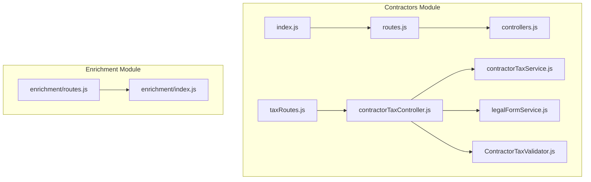
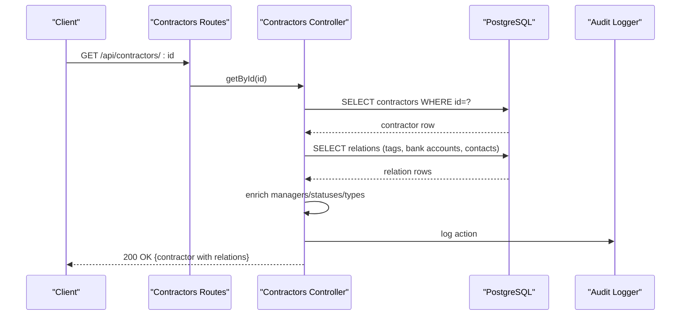
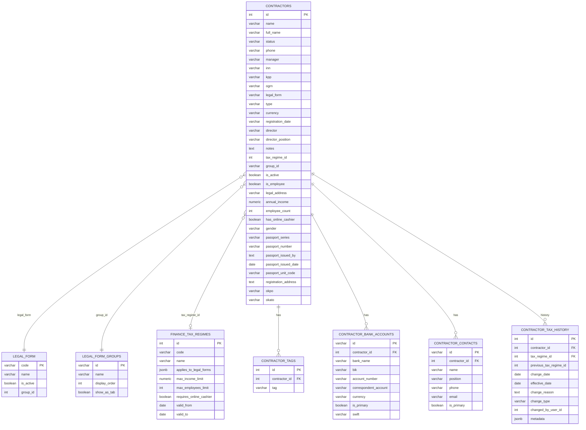
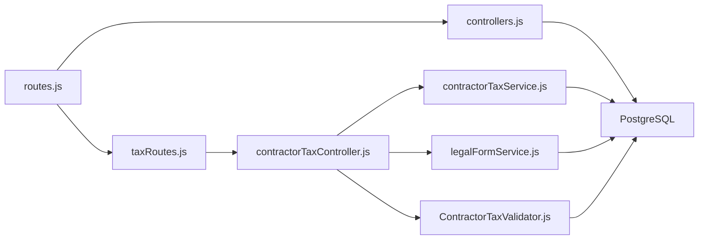

# Contractors API

<cite>
**Referenced Files in This Document**
- [routes.js](file://backend/modules/contractors/routes.js)
- [controllers.js](file://backend/modules/contractors/controllers.js)
- [taxRoutes.js](file://backend/modules/contractors/taxRoutes.js)
- [contractorTaxController.js](file://backend/modules/contractors/controllers/contractorTaxController.js)
- [contractorTaxService.js](file://backend/modules/contractors/services/contractorTaxService.js)
- [legalFormService.js](file://backend/modules/contractors/services/legalFormService.js)
- [ContractorTaxValidator.js](file://backend/modules/contractors/validators/ContractorTaxValidator.js)
- [index.js](file://backend/modules/contractors/index.js)
- [02_create_contractors_table.md](file://backend/migrations/02_create_contractors_table.md)
- [111_contractor_tax_history.sql](file://backend/migrations/111_contractor_tax_history.sql)
- [117_add_group_id_to_contractors.sql](file://backend/migrations/117_add_group_id_to_contractors.sql)
- [119_extend_contractors_for_individuals_and_foreign.sql](file://backend/migrations/119_extend_contractors_for_individuals_and_foreign.sql)
- [enrichment/index.js](file://backend/modules/enrichment/index.js)
- [enrichment/routes.js](file://backend/modules/enrichment/routes.js)
</cite>

## Table of Contents
1. [Introduction](#introduction)
2. [Project Structure](#project-structure)
3. [Core Components](#core-components)
4. [Architecture Overview](#architecture-overview)
5. [Detailed Component Analysis](#detailed-component-analysis)
6. [Dependency Analysis](#dependency-analysis)
7. [Performance Considerations](#performance-considerations)
8. [Troubleshooting Guide](#troubleshooting-guide)
9. [Conclusion](#conclusion)
10. [Appendices](#appendices)

## Introduction
This document provides comprehensive API documentation for Titan CRM’s contractor and client management endpoints. It covers contractor lifecycle operations (CRUD), tax compliance and regime management, relationship tracking, and integration with the enrichment system for automated data lookup and synchronization. The documentation specifies HTTP methods, URL patterns, request/response schemas, contractor classification rules, and operational workflows for onboarding, multi-entity relationships, and tax regime management.

## Project Structure
The contractor module is organized under the backend modules system with dedicated controllers, services, validators, and routes. Tax-related endpoints are mounted as subroutes under the main contractors router. The enrichment module provides batch and single contractor enrichment capabilities integrated with external data sources.

**Diagram sources**
- [routes.js:1-25](file://backend/modules/contractors/routes.js#L1-L25)
- [controllers.js:1-563](file://backend/modules/contractors/controllers.js#L1-L563)
- [taxRoutes.js:1-22](file://backend/modules/contractors/taxRoutes.js#L1-L22)
- [contractorTaxController.js:1-254](file://backend/modules/contractors/controllers/contractorTaxController.js#L1-L254)
- [contractorTaxService.js:1-311](file://backend/modules/contractors/services/contractorTaxService.js#L1-L311)
- [legalFormService.js:1-157](file://backend/modules/contractors/services/legalFormService.js#L1-L157)
- [ContractorTaxValidator.js:1-172](file://backend/modules/contractors/validators/ContractorTaxValidator.js#L1-L172)
- [index.js:1-14](file://backend/modules/contractors/index.js#L1-L13)
- [enrichment/routes.js:1-387](file://backend/modules/enrichment/routes.js#L1-L386)
- [enrichment/index.js:1-32](file://backend/modules/enrichment/index.js#L1-L31)

**Section sources**
- [index.js:1-14](file://backend/modules/contractors/index.js#L1-L13)
- [routes.js:1-25](file://backend/modules/contractors/routes.js#L1-L25)

## Core Components
- Contractors CRUD endpoints: list, retrieve, create, update, delete, and bulk update.
- Tax compliance endpoints: tax info, tax system change, tax calculation, history, limits check, and optimization suggestions.
- Legal form and tax regime mapping endpoints.
- Enrichment endpoints: single lookup, batch lookup, apply changes, and job management.

**Section sources**
- [controllers.js:142-563](file://backend/modules/contractors/controllers.js#L142-L563)
- [contractorTaxController.js:12-254](file://backend/modules/contractors/controllers/contractorTaxController.js#L12-L254)
- [taxRoutes.js:1-22](file://backend/modules/contractors/taxRoutes.js#L1-L22)

## Architecture Overview
The Contractors API follows a layered architecture:
- Routes define HTTP endpoints and delegate to controllers.
- Controllers orchestrate data retrieval, validation, and persistence.
- Services encapsulate business logic for tax regimes, legal forms, and validations.
- Validators enforce business rules for tax regime changes and contractor data.
- Enrichment routes integrate external data sources for contractor enrichment and batch synchronization.

**Diagram sources**
- [routes.js:12-18](file://backend/modules/contractors/routes.js#L12-L18)
- [controllers.js:177-193](file://backend/modules/contractors/controllers.js#L177-L193)
- [controllers.js:17-27](file://backend/modules/contractors/controllers.js#L17-L27)

## Detailed Component Analysis

### Contractors CRUD Endpoints
- Base URL: `/api/contractors`
- Authentication: Requires permission middleware for delete operations.
- Supported operations:
  - GET `/` – List contractors with optional search and pagination.
  - GET `/:id` – Retrieve a contractor by ID with related data.
  - GET `/:id/activity` – Retrieve audit log entries for contractor actions.
  - DELETE `/:id/activity/:activityId` – Remove a specific audit log entry (permission required).
  - POST `/` – Create a new contractor with embedded tags, bank accounts, and contacts.
  - PUT `/:id` – Update contractor and synchronize related data.
  - DELETE `/:id` – Delete contractor and log deletion.
  - POST `/bulk-update` – Bulk update contractor attributes and tags.

Request/response schemas:
- Request body for create/update includes:
  - Personal/Corporate identifiers: name, fullName, inn, kpp, ogrn, okpo, okato.
  - Legal info: legalForm, legalEntityType, registrationDate, legalAddress, authorizedCapital.
  - Leadership: director, directorPosition.
  - Contact: email, phone, website.
  - Classification: status, type, manager, currency, isActive.
  - Grouping: groupId.
  - Tax: taxRegimeId.
  - Demographics (for individuals): gender, passportSeries, passportNumber, passportIssuedBy, passportIssuedDate, passportUnitCode, registrationAddress.
  - Relations: tags (array of tag identifiers), bankAccounts (array), contacts (array).
- Response includes enriched fields: statusName, typeName, manager name, plus relations arrays.

Contractor classification rules:
- Employee detection: type ID checked against relationship_type table for “employee” keywords.
- Group assignment: optional group_id linked to legal_form_groups.

Bulk operations:
- Allowed update keys: status, type, legal_form, manager, tax_regime_id, group_id.
- Tag updates supported via bulk; values normalized and upserted.

**Section sources**
- [routes.js:12-22](file://backend/modules/contractors/routes.js#L12-L22)
- [controllers.js:142-563](file://backend/modules/contractors/controllers.js#L142-L563)
- [02_create_contractors_table.md:9-27](file://backend/migrations/02_create_contractors_table.md#L9-L27)
- [117_add_group_id_to_contractors.sql:1-22](file://backend/migrations/117_add_group_id_to_contractors.sql#L1-L21)
- [119_extend_contractors_for_individuals_and_foreign.sql:7-25](file://backend/migrations/119_extend_contractors_for_individuals_and_foreign.sql#L7-L25)

### Tax Compliance Endpoints
- Base URL: `/api/contractors/:id/taxes*`
- Subroutes:
  - GET `/taxes?include=history,limits,calculations` – Get tax info with optional expansions.
  - PATCH `/tax-system` – Change tax system with optional validation and limits check.
  - GET `/taxes/calculate?year&quarter|month&estimatedIncome` – Calculate tax burden for a period.
  - GET `/taxes/history` – View historical tax regime changes.
  - GET `/taxes/limits-check` – Verify regime limits compliance.
  - GET `/taxes/optimization-suggestions` – Get optimization recommendations.
  - GET `/legal-forms` – List legal forms (active only by default).
  - GET `/legal-forms/:code/tax-regimes?date` – Get available tax regimes for a legal form.

Request/response schemas:
- PATCH `/tax-system` body:
  - Required: regimeId.
  - Optional: reason, effectiveFrom, validateLimits (boolean).
- GET `/taxes/calculate` query:
  - year, quarter or year, month, estimatedIncome.
- GET `/legal-forms/:code/tax-regimes` query:
  - date (effective date for mapping).

Validation and limits:
- Validator checks legal form applicability and regime-specific thresholds (income, employees, online cash register).
- Limits check aggregates contractor data with regime constraints.

Tax history:
- Stores regime changes with effective dates, reasons, and changed_by metadata.

**Section sources**
- [taxRoutes.js:10-21](file://backend/modules/contractors/taxRoutes.js#L10-L21)
- [contractorTaxController.js:12-254](file://backend/modules/contractors/controllers/contractorTaxController.js#L12-L254)
- [contractorTaxService.js:141-311](file://backend/modules/contractors/services/contractorTaxService.js#L141-L311)
- [legalFormService.js:69-109](file://backend/modules/contractors/services/legalFormService.js#L69-L109)
- [ContractorTaxValidator.js:16-122](file://backend/modules/contractors/validators/ContractorTaxValidator.js#L16-L122)
- [111_contractor_tax_history.sql:10-23](file://backend/migrations/111_contractor_tax_history.sql#L10-L23)

### Enrichment System Integration
- Base URL: `/api/enrichment`
- Single contractor enrichment:
  - GET `/lookup/:contractorId` – Fetch and diff enrichment data for a contractor by ID.
  - POST `/apply/:contractorId` – Apply selected fields from enrichment data to contractor.
- Batch enrichment:
  - POST `/batch-lookup/start` – Start a batch enrichment job for contractors with INN.
  - POST `/batch-lookup/stop|finish|continue` – Control job lifecycle.
  - GET `/batch-lookup/status/:jobId` – Monitor progress.
  - GET `/batch-lookup/active` – Get latest job status.
  - POST `/batch-apply` – Apply batch results to contractors.
  - GET `/log/:contractorId` – View enrichment log entries.

Integration details:
- External data sources: configured via enrichment settings (e.g., Dadata, API FNS).
- Field mapping: standardized labels for enrichment fields.
- Job scheduling: background jobs manage large-scale enrichment with pause/resume support.

**Section sources**
- [enrichment/routes.js:15-387](file://backend/modules/enrichment/routes.js#L15-L386)
- [enrichment/index.js:1-32](file://backend/modules/enrichment/index.js#L1-L31)

### Data Model and Relationships
- Contractors table stores personal/corporate identifiers, legal info, leadership, contact details, classification, grouping, tax regime, and demographic fields for individuals.
- Related entities:
  - contractor_tags: tags per contractor.
  - contractor_bank_accounts: bank account records with SWIFT codes.
  - contractor_contacts: contact persons with primary flag.
- Tax history:
  - contractor_tax_history: tracks regime changes with metadata and timestamps.

**Diagram sources**
- [02_create_contractors_table.md:9-85](file://backend/migrations/02_create_contractors_table.md#L9-L85)
- [111_contractor_tax_history.sql:10-23](file://backend/migrations/111_contractor_tax_history.sql#L10-L23)
- [117_add_group_id_to_contractors.sql:5-15](file://backend/migrations/117_add_group_id_to_contractors.sql#L5-L15)
- [119_extend_contractors_for_individuals_and_foreign.sql:7-25](file://backend/migrations/119_extend_contractors_for_individuals_and_foreign.sql#L7-L25)

## Dependency Analysis
- Controllers depend on:
  - Database queries for contractor and relation data.
  - Audit logging for all write operations.
  - Enrichment services for enrichment workflows.
- Tax controller depends on:
  - contractorTaxService for regime changes and tax info.
  - legalFormService for legal form and regime mappings.
  - ContractorTaxValidator for regime change validation.
- Routes depend on:
  - Permission middleware for sensitive operations.
  - Controllers for request handling.

**Diagram sources**
- [routes.js:1-25](file://backend/modules/contractors/routes.js#L1-L25)
- [controllers.js:1-563](file://backend/modules/contractors/controllers.js#L1-L563)
- [taxRoutes.js:1-22](file://backend/modules/contractors/taxRoutes.js#L1-L22)
- [contractorTaxController.js:1-254](file://backend/modules/contractors/controllers/contractorTaxController.js#L1-L254)
- [contractorTaxService.js:1-311](file://backend/modules/contractors/services/contractorTaxService.js#L1-L311)
- [legalFormService.js:1-157](file://backend/modules/contractors/services/legalFormService.js#L1-L157)
- [ContractorTaxValidator.js:1-172](file://backend/modules/contractors/validators/ContractorTaxValidator.js#L1-L172)

**Section sources**
- [routes.js:1-25](file://backend/modules/contractors/routes.js#L1-L25)
- [controllers.js:1-563](file://backend/modules/contractors/controllers.js#L1-L563)
- [contractorTaxController.js:1-254](file://backend/modules/contractors/controllers/contractorTaxController.js#L1-L254)

## Performance Considerations
- Pagination and search: default page size configurable via module settings; search is capped at 200 results.
- Bulk updates: transactional batch processing with allowed keys and tag normalization.
- Enrichment jobs: background processing with pause/resume and progress tracking; batch size controlled by job parameters.
- Indexes: contractor_tax_history includes composite indexes for contractor and date lookups.

[No sources needed since this section provides general guidance]

## Troubleshooting Guide
Common issues and resolutions:
- Not found responses: ensure contractor exists before update/delete; verify IDs and INN presence for enrichment.
- Validation errors: review tax regime applicability and limits; check legal form and regime constraints.
- Audit log: use activity endpoints to inspect changes and troubleshoot discrepancies.
- Enrichment failures: confirm INN validity and external service availability; monitor job status and logs.

**Section sources**
- [controllers.js:181-183](file://backend/modules/contractors/controllers.js#L181-L183)
- [contractorTaxController.js:52-59](file://backend/modules/contractors/controllers/contractorTaxController.js#L52-L59)
- [enrichment/routes.js:158-209](file://backend/modules/enrichment/routes.js#L158-L209)

## Conclusion
The Contractors API provides a robust foundation for managing contractor and client data, enforcing tax compliance, and integrating with enrichment systems. Its modular design supports scalable onboarding workflows, multi-entity relationships, and automated data synchronization while maintaining auditability and extensibility.

[No sources needed since this section summarizes without analyzing specific files]

## Appendices

### API Reference Summary

- Contractors
  - GET `/api/contractors` – List contractors with optional search and pagination.
  - GET `/api/contractors/:id` – Retrieve contractor with relations and enrichments.
  - GET `/api/contractors/:id/activity` – Retrieve audit log entries.
  - DELETE `/api/contractors/:id/activity/:activityId` – Remove audit log entry (permission required).
  - POST `/api/contractors` – Create contractor with tags, bank accounts, and contacts.
  - PUT `/api/contractors/:id` – Update contractor and relations.
  - DELETE `/api/contractors/:id` – Delete contractor.
  - POST `/api/contractors/bulk-update` – Bulk update attributes and tags.

- Tax Compliance
  - GET `/api/contractors/:id/taxes?include=...` – Get tax info with optional history/limits/calculations.
  - PATCH `/api/contractors/:id/tax-system` – Change tax system with validation.
  - GET `/api/contractors/:id/taxes/calculate?year&quarter|month&estimatedIncome` – Calculate tax burden.
  - GET `/api/contractors/:id/taxes/history` – View tax regime history.
  - GET `/api/contractors/:id/taxes/limits-check` – Check regime limits.
  - GET `/api/contractors/:id/taxes/optimization-suggestions` – Get optimization suggestions.
  - GET `/api/contractors/legal-forms?activeOnly=true` – List legal forms.
  - GET `/api/contractors/legal-forms/:code/tax-regimes?date` – Available regimes for legal form.

- Enrichment
  - GET `/api/enrichment/fields` – Enrichment field labels.
  - GET `/api/enrichment/lookup-by-inn/:inn` – Lookup by INN.
  - GET `/api/enrichment/lookup/:contractorId` – Diff contractor vs. enrichment data.
  - POST `/api/enrichment/apply/:contractorId` – Apply enrichment fields.
  - POST `/api/enrichment/search` – Search enrichment provider.
  - POST `/api/enrichment/batch-lookup/start` – Start batch enrichment job.
  - POST `/api/enrichment/batch-lookup/stop|finish|continue` – Control job lifecycle.
  - GET `/api/enrichment/batch-lookup/status/:jobId` – Job progress.
  - GET `/api/enrichment/batch-lookup/active` – Latest job status.
  - POST `/api/enrichment/batch-apply` – Apply batch results.
  - GET `/api/enrichment/log/:contractorId` – Enrichment log.

**Section sources**
- [routes.js:12-22](file://backend/modules/contractors/routes.js#L12-L22)
- [taxRoutes.js:10-21](file://backend/modules/contractors/taxRoutes.js#L10-L21)
- [enrichment/routes.js:15-387](file://backend/modules/enrichment/routes.js#L15-L386)

### Contractor Classification Rules
- Employee classification: type ID mapped to relationship_type; if name contains “employee,” contractor marked as employee.
- Legal entity types: managed via legal_form and legal_form_groups; tax regimes mapped accordingly.
- Grouping: optional group_id links contractor to a display group/tab.

**Section sources**
- [controllers.js:66-71](file://backend/modules/contractors/controllers.js#L66-L71)
- [117_add_group_id_to_contractors.sql:5-15](file://backend/migrations/117_add_group_id_to_contractors.sql#L5-L15)

### Example Workflows

- Contractor Onboarding
  - Create contractor with legal info, contact, and initial tags.
  - Assign tax regime via PATCH `/tax-system`; validate limits.
  - Enrich contractor data via `/lookup/:contractorId` and `/apply/:contractorId`.

- Multi-Entity Relationships
  - Use type and status fields to represent relationships; group_id for display grouping.
  - Track changes via `/activity` endpoints.

- Tax Regime Management
  - Use `/legal-forms/:code/tax-regimes` to discover applicable regimes.
  - Calculate tax burden with `/taxes/calculate` and review history with `/taxes/history`.

**Section sources**
- [controllers.js:199-307](file://backend/modules/contractors/controllers.js#L199-L307)
- [contractorTaxController.js:66-110](file://backend/modules/contractors/controllers/contractorTaxController.js#L66-L110)
- [legalFormService.js:69-109](file://backend/modules/contractors/services/legalFormService.js#L69-L109)