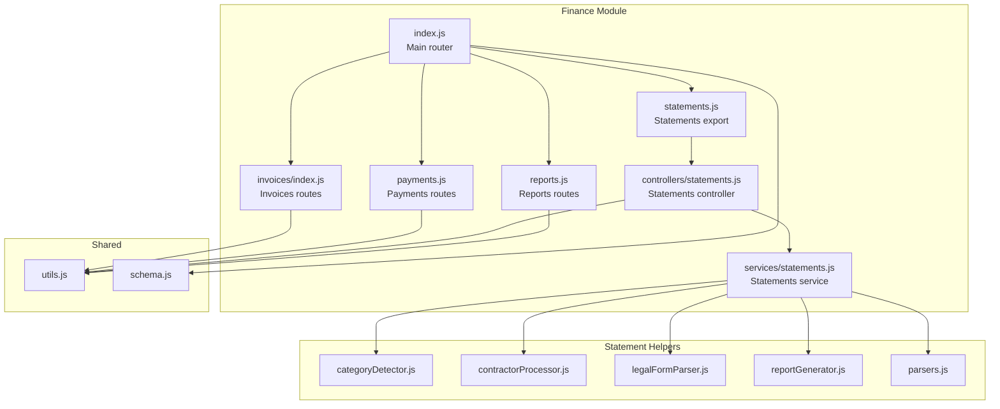
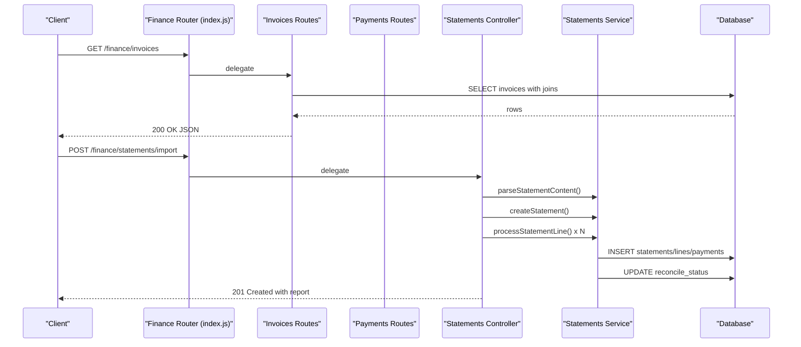
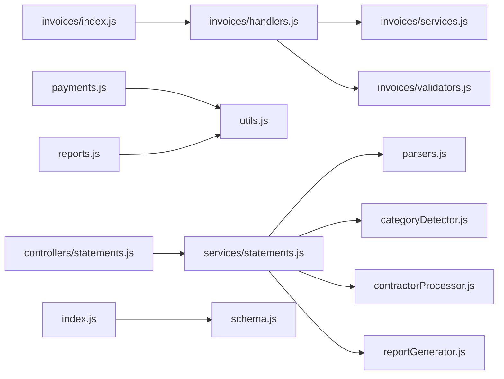
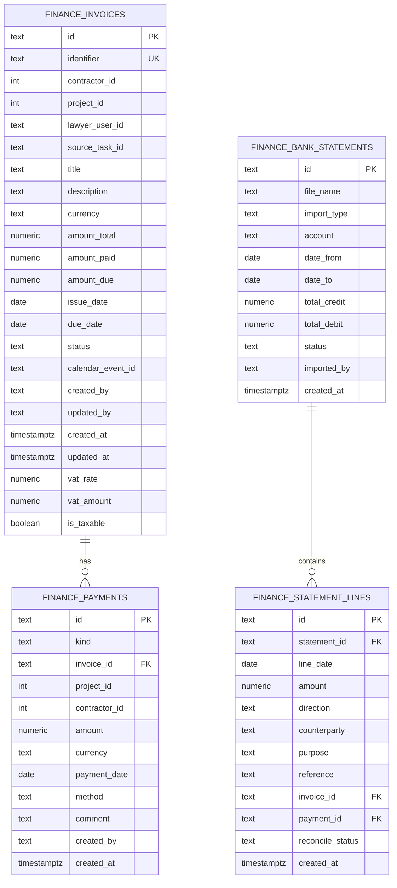

# Finance API

<cite>
**Referenced Files in This Document**
- [index.js](file://backend/modules/finance/index.js)
- [schema.js](file://backend/modules/finance/schema.js)
- [invoices/index.js](file://backend/modules/finance/invoices/index.js)
- [invoices/handlers.js](file://backend/modules/finance/invoices/handlers.js)
- [invoices/services.js](file://backend/modules/finance/invoices/services.js)
- [invoices/validators.js](file://backend/modules/finance/invoices/validators.js)
- [payments.js](file://backend/modules/finance/payments.js)
- [statements.js](file://backend/modules/finance/statements.js)
- [controllers/statements.js](file://backend/modules/finance/controllers/statements/index.js)
- [services/statements.js](file://backend/modules/finance/services/statements.js)
- [parsers.js](file://backend/modules/finance/parsers.js)
- [statementHelpers/categoryDetector.js](file://backend/modules/finance/statementHelpers/categoryDetector.js)
- [statementHelpers/contractorProcessor.js](file://backend/modules/finance/statementHelpers/contractorProcessor.js)
- [statementHelpers/legalFormParser.js](file://backend/modules/finance/statementHelpers/legalFormParser.js)
- [statementHelpers/reportGenerator.js](file://backend/modules/finance/statementHelpers/reportGenerator.js)
- [reports.js](file://backend/modules/finance/reports.js)
- [utils.js](file://backend/modules/finance/utils.js)
</cite>

## Table of Contents
1. [Introduction](#introduction)
2. [Project Structure](#project-structure)
3. [Core Components](#core-components)
4. [Architecture Overview](#architecture-overview)
5. [Detailed Component Analysis](#detailed-component-analysis)
6. [Dependency Analysis](#dependency-analysis)
7. [Performance Considerations](#performance-considerations)
8. [Troubleshooting Guide](#troubleshooting-guide)
9. [Conclusion](#conclusion)
10. [Appendices](#appendices)

## Introduction
This document provides comprehensive API documentation for Titan CRM’s Finance module, focusing on invoicing, payments, bank statement import, and financial reporting. It covers HTTP endpoints, request/response schemas, validation rules, and financial processing workflows. It also explains tax compliance features, multi-currency handling, payment allocation, invoice splitting, and integration patterns with accounting systems and payment gateways.

## Project Structure
The Finance module is organized around domain-focused routers and services:
- Invoices: CRUD, status recalculation, document generation, and bulk operations
- Payments: creation, updates, unlinking, and bulk updates
- Statements: import (CSV/1C), reconciliation, manual assignment, and deletion
- Reports: receivables, P&L, cash flow (DDS), and payment register
- Statement helpers: category detection, contractor processing, legal form parsing, and import reporting
- Shared utilities: date parsing, numeric conversion, and invoice status computation

**Diagram sources**
- [index.js:1-55](file://backend/modules/finance/index.js#L1-L55)
- [invoices/index.js:1-40](file://backend/modules/finance/invoices/index.js#L1-L39)
- [payments.js:1-340](file://backend/modules/finance/payments.js#L1-L7)
- [controllers/statements.js:1-207](file://backend/modules/finance/controllers/statements/index.js#L1-L22)
- [services/statements.js:1-342](file://backend/modules/finance/services/statements.js#L1-L92)
- [statements.js:1-17](file://backend/modules/finance/statements.js#L1-L16)
- [reports.js:1-221](file://backend/modules/finance/reports.js#L1-L221)
- [parsers.js:1-251](file://backend/modules/finance/parsers.js#L1-L207)
- [statementHelpers/categoryDetector.js:1-69](file://backend/modules/finance/statementHelpers/categoryDetector.js#L1-L68)
- [statementHelpers/contractorProcessor.js:1-193](file://backend/modules/finance/statementHelpers/contractorProcessor.js#L1-L192)
- [statementHelpers/legalFormParser.js:1-84](file://backend/modules/finance/statementHelpers/legalFormParser.js#L1-L83)
- [statementHelpers/reportGenerator.js:1-121](file://backend/modules/finance/statementHelpers/reportGenerator.js#L1-L120)
- [utils.js:1-102](file://backend/modules/finance/utils.js#L1-L102)
- [schema.js:1-201](file://backend/modules/finance/schema.js#L1-L200)

**Section sources**
- [index.js:1-55](file://backend/modules/finance/index.js#L1-L55)

## Core Components
- Invoices: Create, update, send, recalculate status, generate documents, bulk update, and delete
- Payments: Create, update, delete, unlink from invoice, bulk update
- Statements: Import CSV/1C, preview, reconcile, manual line assignment, delete
- Reports: Receivables, Profit & Loss, Cash Flow (DDS), Payment Register
- Statement Helpers: Category detection, contractor upsert, legal form parsing, import report generation
- Utilities: Date parsing, numeric conversion, invoice status computation

**Section sources**
- [invoices/index.js:1-40](file://backend/modules/finance/invoices/index.js#L1-L39)
- [payments.js:1-340](file://backend/modules/finance/payments.js#L1-L7)
- [controllers/statements.js:1-207](file://backend/modules/finance/controllers/statements/index.js#L1-L22)
- [services/statements.js:1-342](file://backend/modules/finance/services/statements.js#L1-L92)
- [reports.js:1-221](file://backend/modules/finance/reports.js#L1-L221)
- [parsers.js:1-251](file://backend/modules/finance/parsers.js#L1-L207)
- [statementHelpers/categoryDetector.js:1-69](file://backend/modules/finance/statementHelpers/categoryDetector.js#L1-L68)
- [statementHelpers/contractorProcessor.js:1-193](file://backend/modules/finance/statementHelpers/contractorProcessor.js#L1-L192)
- [statementHelpers/legalFormParser.js:1-84](file://backend/modules/finance/statementHelpers/legalFormParser.js#L1-L83)
- [statementHelpers/reportGenerator.js:1-121](file://backend/modules/finance/statementHelpers/reportGenerator.js#L1-L120)
- [utils.js:1-102](file://backend/modules/finance/utils.js#L1-L102)

## Architecture Overview
The Finance module exposes REST endpoints grouped under /api/finance. Each domain area (invoices, payments, statements, reports) has dedicated routers and services. Shared utilities and database schema initialization ensure consistent data handling and validation.

**Diagram sources**
- [index.js:1-55](file://backend/modules/finance/index.js#L1-L55)
- [invoices/index.js:1-40](file://backend/modules/finance/invoices/index.js#L1-L39)
- [payments.js:1-340](file://backend/modules/finance/payments.js#L1-L7)
- [controllers/statements.js:1-207](file://backend/modules/finance/controllers/statements/index.js#L1-L22)
- [services/statements.js:1-342](file://backend/modules/finance/services/statements.js#L1-L92)

## Detailed Component Analysis

### Invoices API
Endpoints:
- GET /finance/invoices
- GET /finance/invoices/:id
- POST /finance/invoices
- PUT /finance/invoices/:id
- POST /finance/invoices/:id/send
- POST /finance/invoices/:id/recalculate-status
- POST /finance/invoices/:id/generate-document
- DELETE /finance/invoices/:id
- POST /finance/invoices/bulk-update

Request/Response schemas:
- Create/Update payload includes: title, amount_total, issue_date, due_date, currency, description, contractor_id, project_id, lawyer_user_id, source_task_id, invoice_type, status, createCalendarReminder, vat_rate, vat_amount, is_taxable
- Response includes derived fields: amount_total, amount_paid, amount_due, status, invoice_type

Validation rules:
- Required fields: title, amount_total, issue_date, due_date
- Numeric fields sanitized via numeric converter
- Date parsing supports ISO and DD.MM.YYYY formats
- Status computed automatically except when manually overridden

Financial validation:
- Amounts are non-negative numbers
- Status transitions based on amount_paid vs amount_total and due_date
- Overdue date tracked when applicable

Audit and calendar:
- Calendar event created/updated on send or status change
- Sync to revenue when project-linked

Examples:
- Invoice creation with VAT fields and tax compliance flag
- Bulk update of statuses and due dates
- Document generation for paid invoices (Act/Invoice Factura)

**Section sources**
- [invoices/index.js:1-40](file://backend/modules/finance/invoices/index.js#L1-L39)
- [invoices/handlers.js:1-571](file://backend/modules/finance/invoices/handlers.js#L1-L481)
- [invoices/services.js:1-239](file://backend/modules/finance/invoices/services.js#L1-L239)
- [invoices/validators.js:1-119](file://backend/modules/finance/invoices/validators.js#L1-L119)
- [utils.js:42-93](file://backend/modules/finance/utils.js#L42-L93)

### Payments API
Endpoints:
- GET /finance/payments
- POST /finance/payments
- PUT /finance/payments/:id
- DELETE /finance/payments/:id
- POST /finance/payments/:id/unlink-from-invoice
- POST /finance/payments/bulk-update

Request/Response schemas:
- Create/update payload: kind, invoiceId, projectId, taskId, contractorId, amount, currency, paymentDate, method, comment, categoryId
- Response includes joined data: invoice_identifier, project_name, contractor_name, task_title

Validation rules:
- Required fields for create: kind, amount, paymentDate
- Optional fields support soft-nulling (empty string to null)
- Date parsing and numeric conversion applied

Financial processing:
- Unlink resets invoice_id and clears reconcile_status on statement lines
- Bulk update supports selective field updates with allowed fields list
- Recalculation triggers on invoice linkage changes

Examples:
- Payment allocation against invoices
- Multi-currency handling via currency field (defaults to RUB)
- Bulk categorization and method updates

**Section sources**
- [payments.js:1-340](file://backend/modules/finance/payments.js#L1-L7)

### Statements Import API
Endpoints:
- GET /finance/statements
- GET /finance/statements/:id/lines
- POST /finance/statements/import
- POST /finance/statements/:id/reconcile
- PUT /finance/statements/lines/:lineId
- DELETE /finance/statements/:id

Import workflow:
- Draft preview mode returns parsed summary
- Full import parses CSV/1C, creates statement header, processes lines
- Line processing:
  - Upsert contractor (including bank accounts)
  - Detect category
  - Auto-create payment if category and amount valid
  - Link to invoice if purpose matches invoice identifier
- Auto-reconciliation runs after import
- Manual assignment allows overriding invoice/payment/category per line

CSV/1C parsing:
- CSV: flexible column detection by localized names
- 1C: structured parsing with field mapping and VAT extraction from purpose

Reconciliation:
- Automatic matching by amount/date/contractor/kind
- Manual override via line assignment endpoint

Examples:
- CSV import with mixed directions and descriptions
- 1C import with payer/recipients and VAT extraction
- Reconciliation of partial matches and manual assignments

**Section sources**
- [controllers/statements.js:1-207](file://backend/modules/finance/controllers/statements/index.js#L1-L22)
- [services/statements.js:1-342](file://backend/modules/finance/services/statements.js#L1-L92)
- [statements.js:1-17](file://backend/modules/finance/statements.js#L1-L16)
- [parsers.js:1-251](file://backend/modules/finance/parsers.js#L1-L207)
- [statementHelpers/categoryDetector.js:1-69](file://backend/modules/finance/statementHelpers/categoryDetector.js#L1-L68)
- [statementHelpers/contractorProcessor.js:1-193](file://backend/modules/finance/statementHelpers/contractorProcessor.js#L1-L192)
- [statementHelpers/legalFormParser.js:1-84](file://backend/modules/finance/statementHelpers/legalFormParser.js#L1-L83)
- [statementHelpers/reportGenerator.js:1-121](file://backend/modules/finance/statementHelpers/reportGenerator.js#L1-L120)

### Financial Reporting API
Endpoints:
- GET /finance/reports/receivables?groupBy=contractor|project|contractor_project
- GET /finance/reports/pl?projectId&dateFrom&dateTo
- GET /finance/reports/dds?dateFrom&dateTo
- GET /finance/reports/register?dateFrom&dateTo&kind&projectId&contractorId

Report details:
- Receivables: grouped totals, overdue counts, overdue days
- P&L: income, expense, profit, categorized totals
- DDS: cash movement by category and kind
- Register: payment register with joins to invoices/projects/contractors

Filters:
- Date range filtering
- Project and contractor filters
- Kind filter for income/expense

**Section sources**
- [reports.js:1-221](file://backend/modules/finance/reports.js#L1-L221)

### Tax Compliance and Validation
- VAT fields: vat_rate, vat_amount, is_taxable on invoices
- Purpose parsing extracts VAT rate and amount for 1C imports
- Legal form detection and contractor type classification
- Tax regime join for contractor-based reporting

**Section sources**
- [invoices/handlers.js:69-104](file://backend/modules/finance/invoices/handlers.js#L69-L104)
- [parsers.js:49-77](file://backend/modules/finance/parsers.js#L49-L77)
- [statementHelpers/legalFormParser.js:11-83](file://backend/modules/finance/statementHelpers/legalFormParser.js#L11-L83)
- [invoices/services.js:140-161](file://backend/modules/finance/invoices/services.js#L140-L161)

### Multi-Currency Transactions
- Currency field present on payments and invoices
- Defaults to RUB when unspecified
- Amounts stored with two decimals
- Consider adding exchange rate and converted amounts for advanced multi-currency scenarios

**Section sources**
- [payments.js:114](file://backend/modules/finance/payments.js#L7)
- [schema.js:31](file://backend/modules/finance/schema.js#L31)
- [schema.js:54](file://backend/modules/finance/schema.js#L54)

### Audit Trail and Integrations
- Audit-ready fields: created_by, updated_by, timestamps
- Calendar reminders synchronized with invoice lifecycle
- Revenue sync on invoice/project linkage
- Integration hooks for external accounting systems via report exports

**Section sources**
- [invoices/handlers.js:110-119](file://backend/modules/finance/invoices/handlers.js#L110-L119)
- [invoices/services.js:15-76](file://backend/modules/finance/invoices/services.js#L15-L76)
- [reports.js:178-218](file://backend/modules/finance/reports.js#L178-L218)

## Dependency Analysis
The Finance module exhibits clear separation of concerns:
- Routers depend on handlers/services
- Services encapsulate business logic and database operations
- Statement helpers isolate parsing, categorization, and contractor processing
- Shared utilities provide cross-cutting concerns (date/number parsing, status computation)

**Diagram sources**
- [invoices/index.js:1-40](file://backend/modules/finance/invoices/index.js#L1-L39)
- [invoices/handlers.js:1-571](file://backend/modules/finance/invoices/handlers.js#L1-L481)
- [invoices/services.js:1-239](file://backend/modules/finance/invoices/services.js#L1-L239)
- [invoices/validators.js:1-119](file://backend/modules/finance/invoices/validators.js#L1-L119)
- [payments.js:1-340](file://backend/modules/finance/payments.js#L1-L7)
- [controllers/statements.js:1-207](file://backend/modules/finance/controllers/statements/index.js#L1-L22)
- [services/statements.js:1-342](file://backend/modules/finance/services/statements.js#L1-L92)
- [parsers.js:1-251](file://backend/modules/finance/parsers.js#L1-L207)
- [statementHelpers/categoryDetector.js:1-69](file://backend/modules/finance/statementHelpers/categoryDetector.js#L1-L68)
- [statementHelpers/contractorProcessor.js:1-193](file://backend/modules/finance/statementHelpers/contractorProcessor.js#L1-L192)
- [statementHelpers/reportGenerator.js:1-121](file://backend/modules/finance/statementHelpers/reportGenerator.js#L1-L120)
- [reports.js:1-221](file://backend/modules/finance/reports.js#L1-L221)
- [utils.js:1-102](file://backend/modules/finance/utils.js#L1-L102)
- [index.js:1-55](file://backend/modules/finance/index.js#L1-L55)
- [schema.js:1-201](file://backend/modules/finance/schema.js#L1-L200)

**Section sources**
- [index.js:1-55](file://backend/modules/finance/index.js#L1-L55)

## Performance Considerations
- Prefer batch operations for bulk updates to reduce round-trips
- Use pagination and filters for large datasets (invoices, payments, statements)
- Indexes on frequently filtered columns (project_id, contractor_id, payment_date, invoice_id) recommended
- Avoid unnecessary recalculations; trigger only when linking/unlinking or payment changes occur

## Troubleshooting Guide
Common issues and resolutions:
- Validation failures on invoice creation/update: ensure required fields and valid numeric/date formats
- Payment unlink errors: verify invoice linkage and reconcile status reset
- Statement import warnings: review contractor name/INN mismatches and duplicate detection
- Reconciliation not matching: adjust filters or manually assign invoice/payment per line

**Section sources**
- [invoices/validators.js:13-104](file://backend/modules/finance/invoices/validators.js#L13-L104)
- [payments.js:229-266](file://backend/modules/finance/payments.js#L7)
- [controllers/statements.js:168-187](file://backend/modules/finance/controllers/statements/index.js#L1-L22)
- [services/statements.js:204-319](file://backend/modules/finance/services/statements.js#L92)

## Conclusion
Titan CRM’s Finance module provides robust APIs for invoicing, payments, statement import, and financial reporting. It includes built-in tax compliance features, contractor processing, and reconciliation workflows. The modular design and shared utilities facilitate maintainability and extensibility for future integrations with accounting software and payment gateways.

## Appendices

### Endpoint Reference Summary
- Invoices
  - GET /finance/invoices
  - GET /finance/invoices/:id
  - POST /finance/invoices
  - PUT /finance/invoices/:id
  - POST /finance/invoices/:id/send
  - POST /finance/invoices/:id/recalculate-status
  - POST /finance/invoices/:id/generate-document
  - DELETE /finance/invoices/:id
  - POST /finance/invoices/bulk-update
- Payments
  - GET /finance/payments
  - POST /finance/payments
  - PUT /finance/payments/:id
  - DELETE /finance/payments/:id
  - POST /finance/payments/:id/unlink-from-invoice
  - POST /finance/payments/bulk-update
- Statements
  - GET /finance/statements
  - GET /finance/statements/:id/lines
  - POST /finance/statements/import
  - POST /finance/statements/:id/reconcile
  - PUT /finance/statements/lines/:lineId
  - DELETE /finance/statements/:id
- Reports
  - GET /finance/reports/receivables
  - GET /finance/reports/pl
  - GET /finance/reports/dds
  - GET /finance/reports/register

### Data Model Overview

**Diagram sources**
- [schema.js:22-196](file://backend/modules/finance/schema.js#L22-L196)