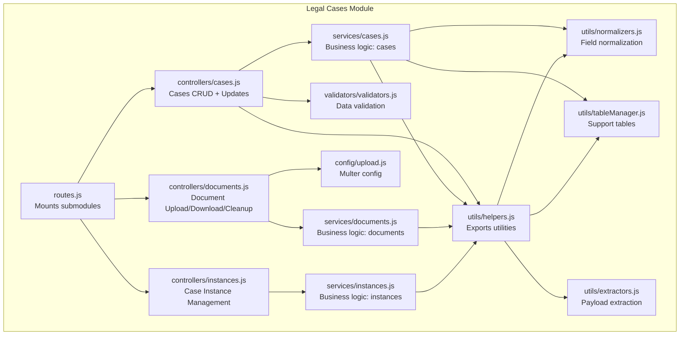
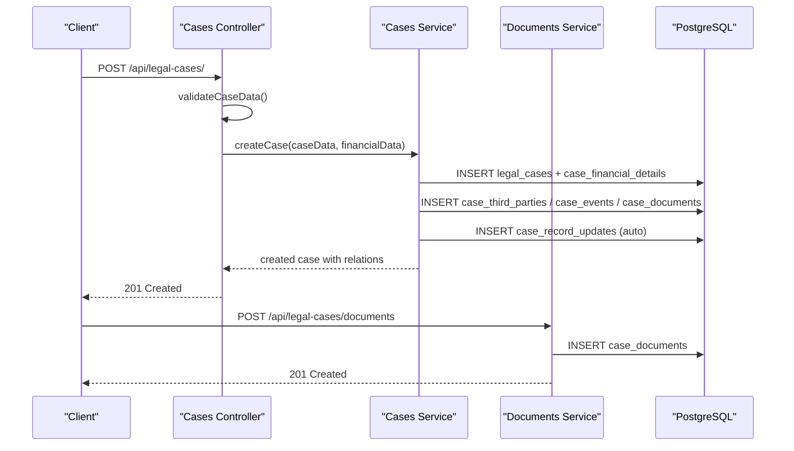
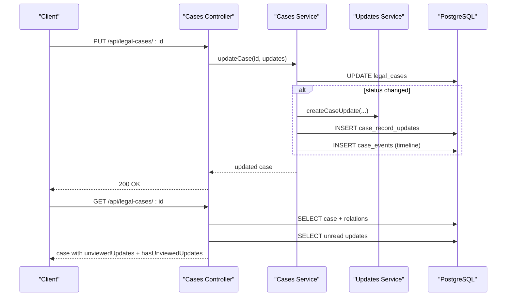
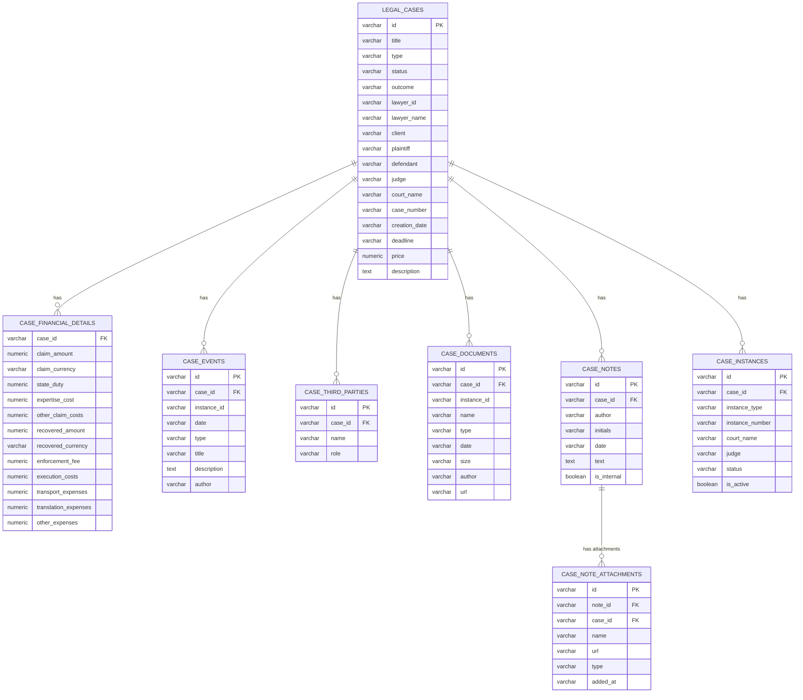
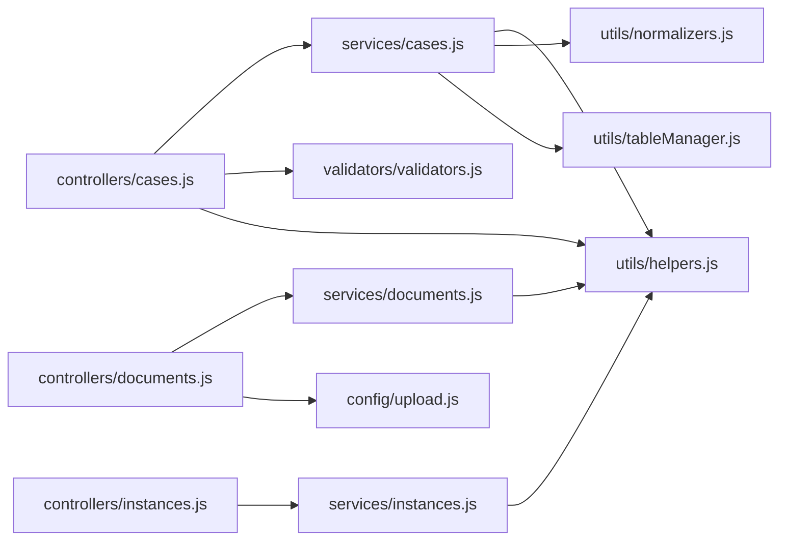

# Legal Cases API

<cite>
**Referenced Files in This Document**
- [LEGAL_CASES.md](file://docs/api/LEGAL_CASES.md)
- [CASE_UPDATES_API.md](file://docs/CASE_UPDATES_API.md)
- [CASE_UPDATES_SYSTEM.md](file://docs/CASE_UPDATES_SYSTEM.md)
- [index.js](file://backend/modules/legal_cases/index.js)
- [routes.js](file://backend/modules/legal_cases/routes.js)
- [cases.js](file://backend/modules/legal_cases/controllers/cases.js)
- [documents.js](file://backend/modules/legal_cases/controllers/documents.js)
- [instances.js](file://backend/modules/legal_cases/controllers/instances.js)
- [cases.js](file://backend/modules/legal_cases/services/cases.js)
- [documents.js](file://backend/modules/legal_cases/services/documents.js)
- [instances.js](file://backend/modules/legal_cases/services/instances.js)
- [validators.js](file://backend/modules/legal_cases/validators/validators.js)
- [upload.js](file://backend/modules/legal_cases/config/upload.js)
- [helpers.js](file://backend/modules/legal_cases/utils/helpers.js)
- [extractors.js](file://backend/modules/legal_cases/utils/extractors.js)
- [normalizers.js](file://backend/modules/legal_cases/utils/normalizers.js)
- [tableManager.js](file://backend/modules/legal_cases/utils/tableManager.js)
</cite>

## Table of Contents
1. [Introduction](#introduction)
2. [Project Structure](#project-structure)
3. [Core Components](#core-components)
4. [Architecture Overview](#architecture-overview)
5. [Detailed Component Analysis](#detailed-component-analysis)
6. [Dependency Analysis](#dependency-analysis)
7. [Performance Considerations](#performance-considerations)
8. [Troubleshooting Guide](#troubleshooting-guide)
9. [Conclusion](#conclusion)
10. [Appendices](#appendices)

## Introduction
This document provides comprehensive API documentation for Titan CRM’s Legal Cases module. It covers endpoints for case lifecycle management (creation, retrieval, updates, deletion), document attachments, automated case updates, and case instance management (multi-instance tracking). It also documents request/response schemas, parameter semantics, case lifecycle states, and integration patterns with external legal systems and court filing processes.

## Project Structure
The Legal Cases module is organized around a clear separation of concerns:
- Controllers handle HTTP requests and responses
- Services encapsulate business logic
- Validators enforce data correctness
- Utilities provide extraction, normalization, and table management
- Routes compose submodules under a single base path

**Diagram sources**
- [routes.js:1-20](file://backend/modules/legal_cases/routes.js#L1-L20)
- [cases.js:1-299](file://backend/modules/legal_cases/controllers/cases.js#L1-L299)
- [documents.js:1-180](file://backend/modules/legal_cases/controllers/documents.js#L1-L179)
- [instances.js:1-123](file://backend/modules/legal_cases/controllers/instances.js#L1-L122)
- [cases.js:1-686](file://backend/modules/legal_cases/services/cases.js#L1-L686)
- [documents.js:1-182](file://backend/modules/legal_cases/services/documents.js#L1-L181)
- [instances.js:1-160](file://backend/modules/legal_cases/services/instances.js#L1-L159)
- [validators.js:1-160](file://backend/modules/legal_cases/validators/validators.js#L1-L159)
- [upload.js:1-54](file://backend/modules/legal_cases/config/upload.js#L1-L53)
- [helpers.js:1-56](file://backend/modules/legal_cases/utils/helpers.js#L1-L55)
- [extractors.js:1-61](file://backend/modules/legal_cases/utils/extractors.js#L1-L61)
- [normalizers.js:1-49](file://backend/modules/legal_cases/utils/normalizers.js#L1-L49)
- [tableManager.js:1-69](file://backend/modules/legal_cases/utils/tableManager.js#L1-L68)

**Section sources**
- [index.js:1-14](file://backend/modules/legal_cases/index.js#L1-L13)
- [routes.js:1-20](file://backend/modules/legal_cases/routes.js#L1-L20)

## Core Components
- Base URL: `/api/legal-cases`
- Submodules:
  - Cases: `/api/legal-cases/`
  - Documents: `/api/legal-cases/documents/`
  - Instances: `/api/legal-cases/:id/instances` and `/api/legal-cases/instances/:instanceId`

Endpoints summary:
- Cases: GET `/`, GET `/:id`, POST `/`, PUT `/:id`, DELETE `/:id`
- Documents: GET `/documents/case/:caseId`, POST `/documents`, GET `/documents/files/:filename`, DELETE `/documents/:id`, POST `/documents/cleanup`
- Instances: GET `/:id/instances`, POST `/:id/instances`, PATCH `/instances/:instanceId`, DELETE `/instances/:instanceId`
- Updates: GET `/:id/updates/unviewed`, POST `/:id/updates/mark-viewed`, DELETE `/:id/updates/:updateId`, DELETE `/:id/updates`

**Section sources**
- [LEGAL_CASES.md:9-221](file://docs/api/LEGAL_CASES.md#L9-L221)
- [CASE_UPDATES_API.md:1-160](file://docs/CASE_UPDATES_API.md#L1-L159)
- [routes.js:9-17](file://backend/modules/legal_cases/routes.js#L9-L17)

## Architecture Overview
The Legal Cases API follows a layered architecture:
- HTTP Layer: Express routers and controllers
- Business Logic Layer: Services implementing CRUD and orchestration
- Persistence Layer: PostgreSQL tables for cases, documents, timelines, and financials
- Utility Layer: Extraction, normalization, and support table management

**Diagram sources**
- [cases.js:57-106](file://backend/modules/legal_cases/controllers/cases.js#L57-L106)
- [cases.js:164-266](file://backend/modules/legal_cases/services/cases.js#L164-L266)
- [documents.js:47-113](file://backend/modules/legal_cases/controllers/documents.js#L47-L113)
- [documents.js:37-56](file://backend/modules/legal_cases/services/documents.js#L37-L56)

## Detailed Component Analysis

### Cases API
- Base path: `/api/legal-cases`
- Purpose: Full CRUD lifecycle for legal cases, including associated timeline events, third parties, notes, documents, and financials.

Endpoints:
- GET `/` – List all cases with hydrated relations and unviewed updates indicator
- GET `/:id` – Retrieve a specific case with unviewed updates appended
- POST `/` – Create a new case; validates core and financial data; auto-generates ID
- PUT `/:id` – Update a case; replaces associated arrays (events, thirdParties, notes, documents)
- DELETE `/:id` – Delete a case and cascade-delete all related records

Request/Response schemas:
- Request body for POST/PUT includes top-level fields, nested arrays (events, thirdParties, notes, documents), and financials object
- Response includes hydrated relations and computed flags (e.g., hasUnviewedUpdates)

Validation:
- Core fields validated via `validateCaseData`
- Financials validated via `validateCaseFinancials`

Lifecycle states and types:
- Statuses: new, preparation, active, court, completed, closed
- Types: court, claim, arbitration, administrative
- Event types: document, court, meeting, call, email, deadline, other

Notes and privacy:
- Notes support an internal flag; private notes require an `x-user-id` header for authorization

Automated updates:
- On status change, creates a case update notification and adds a timeline event
- On creation, adds a “Case Created” timeline event

**Section sources**
- [LEGAL_CASES.md:11-221](file://docs/api/LEGAL_CASES.md#L11-L221)
- [cases.js:18-179](file://backend/modules/legal_cases/controllers/cases.js#L18-L179)
- [cases.js:274-593](file://backend/modules/legal_cases/services/cases.js#L274-L593)
- [validators.js:12-144](file://backend/modules/legal_cases/validators/validators.js#L12-L144)

#### Cases Update Notifications API
- Base path: `/api/legal-cases/:id/updates`
- Purpose: Manage unread case record updates (notifications) and mark them as viewed

Endpoints:
- GET `/:id/updates/unviewed` – Get unread updates for a case
- POST `/:id/updates/mark-viewed` – Mark all updates as viewed (requires `x-user-id`)
- DELETE `/:id/updates/:updateId` – Delete a specific update (requires `x-user-id`)
- DELETE `/:id/updates` – Delete all updates for a case (requires `x-user-id`)

Behavior:
- Automatic marking occurs when retrieving a case with `x-user-id` header
- Manual marking endpoint available for explicit control
- Deletion endpoints enable noise reduction and data hygiene

**Section sources**
- [CASE_UPDATES_API.md:1-160](file://docs/CASE_UPDATES_API.md#L1-L159)
- [CASE_UPDATES_SYSTEM.md:1-165](file://docs/CASE_UPDATES_SYSTEM.md#L1-L164)
- [cases.js:182-285](file://backend/modules/legal_cases/controllers/cases.js#L182-L285)
- [cases.js:112-139](file://backend/modules/legal_cases/services/cases.js#L112-L139)

### Documents API
- Base path: `/api/legal-cases/documents`
- Purpose: Attach and manage documents per case or instance

Endpoints:
- GET `/documents/case/:caseId?instance_id=:instanceId` – List documents for a case (optionally filtered by instance)
- POST `/documents` – Upload a file (multipart/form-data), create a document record, and optionally add a timeline event
- GET `/documents/files/:filename` – Download a file by server-side filename
- DELETE `/documents/:id` – Remove a document record and its physical file
- POST `/documents/cleanup` – Remove unused documents (no case_id) by IDs

Upload configuration:
- Allowed types: pdf, doc, docx, xls, xlsx, png, jpg, jpeg, txt, zip, rar
- Size limit: 50 MB
- Storage: unique filenames under a dedicated directory

Metadata and versioning:
- Documents include name, type, date, size, author, and URL
- Versioning is implicit via new records; previous versions are removed on replacement

**Section sources**
- [LEGAL_CASES.md:71-80](file://docs/api/LEGAL_CASES.md#L71-L80)
- [documents.js:27-180](file://backend/modules/legal_cases/controllers/documents.js#L27-L179)
- [documents.js:17-182](file://backend/modules/legal_cases/services/documents.js#L17-L181)
- [upload.js:9-54](file://backend/modules/legal_cases/config/upload.js#L9-L53)

### Instances API
- Base path: `/api/legal-cases/:id/instances` and `/api/legal-cases/instances/:instanceId`
- Purpose: Track multi-instance cases (first instance, appeal, cassation, supervisory review)

Endpoints:
- GET `/:id/instances` – List all instances for a case
- POST `/:id/instances` – Create a new instance; if newly active, deactivates others
- PATCH `/instances/:instanceId` – Update an instance; activating sets others inactive
- DELETE `/instances/:instanceId` – Remove an instance

Instance fields:
- instance_type: first, appeal, cassation, supervisory
- instance_number: case number at that instance
- court_name, judge, status, is_active

Timeline integration:
- Creating or updating instances emits a timeline event

**Section sources**
- [instances.js:19-123](file://backend/modules/legal_cases/controllers/instances.js#L19-L122)
- [instances.js:14-160](file://backend/modules/legal_cases/services/instances.js#L14-L159)

### Automated Case Update System
Highlights:
- Automatic creation of case update notifications on status changes
- Automatic timeline events for case and financial updates
- Unviewed updates tracked per case and user
- Automatic marking when opening a case with `x-user-id` header
- Manual marking endpoint for explicit control

**Diagram sources**
- [cases.js:112-162](file://backend/modules/legal_cases/controllers/cases.js#L112-L162)
- [cases.js:322-362](file://backend/modules/legal_cases/services/cases.js#L322-L362)
- [cases.js:32-51](file://backend/modules/legal_cases/controllers/cases.js#L32-L51)

**Section sources**
- [CASE_UPDATES_SYSTEM.md:74-91](file://docs/CASE_UPDATES_SYSTEM.md#L74-L91)
- [cases.js:322-362](file://backend/modules/legal_cases/services/cases.js#L322-L362)

### Data Models and Schemas
Core entities and relationships:
- legal_cases: primary case record
- case_financial_details: aggregated financials
- case_events: timeline entries
- case_third_parties: third-party roles
- case_documents: uploaded files
- case_notes + case_note_attachments: notes and attachments
- case_recovered_items, case_expenses: recovery and cost items
- case_record_updates: unread notifications

**Diagram sources**
- [cases.js:168-266](file://backend/modules/legal_cases/services/cases.js#L168-L266)
- [documents.js:37-56](file://backend/modules/legal_cases/services/documents.js#L37-L56)
- [instances.js:37-67](file://backend/modules/legal_cases/services/instances.js#L37-L67)

**Section sources**
- [LEGAL_CASES.md:223-348](file://docs/api/LEGAL_CASES.md#L223-L347)
- [tableManager.js:17-64](file://backend/modules/legal_cases/utils/tableManager.js#L17-L64)

### Parameter Reference and Examples

- Case creation (POST /api/legal-cases/)
  - Required: title, type, status, lawyerId/lawyer_id, caseNumber/case_number, creationDate/creation_date
  - Optional: deadline, client, plaintiff, defendant, judge, courtName/court_name, price, description, outcome
  - Arrays: events, thirdParties, notes, documents, recoveredItems, expenses
  - Financials: claimAmount (amount, currency), stateDuty, expertiseCost, otherClaimCosts, recoveredAmount (amount, currency), enforcementFee, executionCosts, transportExpenses, translationExpenses, otherExpenses

- Case update (PUT /api/legal-cases/:id)
  - Replaces associated arrays; supports partial updates via COALESCE mapping

- Document upload (POST /api/legal-cases/documents)
  - Form fields: file (required), case_id, instance_id, name, type
  - Headers: optional x-user-name for author attribution

- Instance creation (POST /api/legal-cases/:id/instances)
  - Required: instance_number or instanceNumber, instance_type or instanceType
  - Optional: court_name or courtName, judge, status, is_active or isActive

- Update notifications
  - GET /api/legal-cases/:id/updates/unviewed
  - POST /api/legal-cases/:id/updates/mark-viewed (requires x-user-id)
  - DELETE /api/legal-cases/:id/updates/:updateId (requires x-user-id)
  - DELETE /api/legal-cases/:id/updates (requires x-user-id)

**Section sources**
- [LEGAL_CASES.md:103-221](file://docs/api/LEGAL_CASES.md#L103-L221)
- [validators.js:12-144](file://backend/modules/legal_cases/validators/validators.js#L12-L144)
- [documents.js:47-113](file://backend/modules/legal_cases/controllers/documents.js#L47-L113)
- [instances.js:33-67](file://backend/modules/legal_cases/controllers/instances.js#L33-L67)
- [CASE_UPDATES_API.md:1-160](file://docs/CASE_UPDATES_API.md#L1-L159)

## Dependency Analysis
- Controllers depend on:
  - Services for business logic
  - Validators for input sanitization
  - Helpers for extraction and normalization
- Services depend on:
  - Database client for persistence
  - Logger for auditing
  - Utilities for robustness
- Utilities depend on:
  - Shared helpers and configuration

**Diagram sources**
- [cases.js:10-16](file://backend/modules/legal_cases/controllers/cases.js#L10-L16)
- [cases.js:10-15](file://backend/modules/legal_cases/services/cases.js#L10-L15)
- [documents.js:10-25](file://backend/modules/legal_cases/controllers/documents.js#L10-L25)
- [instances.js:7-16](file://backend/modules/legal_cases/controllers/instances.js#L7-L16)
- [validators.js:1-5](file://backend/modules/legal_cases/validators/validators.js#L1-L5)
- [helpers.js:1-56](file://backend/modules/legal_cases/utils/helpers.js#L1-L55)
- [upload.js:1-54](file://backend/modules/legal_cases/config/upload.js#L1-L53)
- [normalizers.js:1-49](file://backend/modules/legal_cases/utils/normalizers.js#L1-L49)
- [tableManager.js:1-69](file://backend/modules/legal_cases/utils/tableManager.js#L1-L68)

**Section sources**
- [routes.js:9-17](file://backend/modules/legal_cases/routes.js#L9-L17)
- [helpers.js:1-56](file://backend/modules/legal_cases/utils/helpers.js#L1-L55)

## Performance Considerations
- Batch operations: Updating notes and documents replaces entire arrays; consider minimizing frequency of large replacements
- File handling: 50 MB limit and disk I/O; schedule cleanup via cleanup endpoint for unused documents
- Indexing: Ensure foreign keys and frequently queried columns (case_id, instance_id) are indexed in production
- Hydration: Relation hydration adds overhead; avoid unnecessary hydration in read-heavy lists

## Troubleshooting Guide
Common issues and resolutions:
- Validation failures on case creation/update
  - Ensure required fields are present and sanitized
  - Check financial amounts and currencies conform to expectations
- Private notes require authorization
  - Provide `x-user-id` header when updating notes with internal flag
- Document upload errors
  - Verify file type and size limits
  - Confirm upload directory exists and is writable
- Cleanup unused documents
  - Use POST `/api/legal-cases/documents/cleanup` with array of IDs to remove orphaned records and files
- Update notifications not appearing
  - Ensure case updates are created on status changes
  - Use manual mark-viewed endpoint if automatic marking does not occur

**Section sources**
- [validators.js:12-144](file://backend/modules/legal_cases/validators/validators.js#L12-L144)
- [cases.js:142-150](file://backend/modules/legal_cases/controllers/cases.js#L142-L150)
- [upload.js:29-51](file://backend/modules/legal_cases/config/upload.js#L29-L51)
- [documents.js:161-170](file://backend/modules/legal_cases/controllers/documents.js#L161-L170)
- [CASE_UPDATES_SYSTEM.md:74-91](file://docs/CASE_UPDATES_SYSTEM.md#L74-L91)

## Conclusion
The Legal Cases API provides a robust foundation for managing legal matters, including multi-instance tracking, comprehensive document handling, and automated update notifications. Its modular design enables maintainability and scalability while ensuring data integrity through validation and normalization.

## Appendices

### API Reference Summary

- Cases
  - GET `/api/legal-cases/` – List cases
  - GET `/api/legal-cases/:id` – Retrieve case with unviewed updates
  - POST `/api/legal-cases/` – Create case
  - PUT `/api/legal-cases/:id` – Update case
  - DELETE `/api/legal-cases/:id` – Delete case

- Documents
  - GET `/api/legal-cases/documents/case/:caseId?instance_id=:instanceId` – List documents
  - POST `/api/legal-cases/documents` – Upload document
  - GET `/api/legal-cases/documents/files/:filename` – Download file
  - DELETE `/api/legal-cases/documents/:id` – Delete document
  - POST `/api/legal-cases/documents/cleanup` – Cleanup unused documents

- Instances
  - GET `/api/legal-cases/:id/instances` – List instances
  - POST `/api/legal-cases/:id/instances` – Create instance
  - PATCH `/api/legal-cases/instances/:instanceId` – Update instance
  - DELETE `/api/legal-cases/instances/:instanceId` – Delete instance

- Updates
  - GET `/api/legal-cases/:id/updates/unviewed` – Get unread updates
  - POST `/api/legal-cases/:id/updates/mark-viewed` – Mark as viewed
  - DELETE `/api/legal-cases/:id/updates/:updateId` – Delete update
  - DELETE `/api/legal-cases/:id/updates` – Delete all updates

**Section sources**
- [LEGAL_CASES.md:9-221](file://docs/api/LEGAL_CASES.md#L9-L221)
- [CASE_UPDATES_API.md:1-160](file://docs/CASE_UPDATES_API.md#L1-L159)
- [routes.js:9-17](file://backend/modules/legal_cases/routes.js#L9-L17)