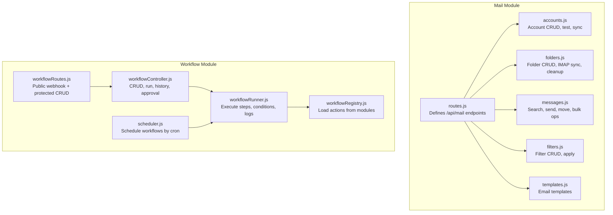
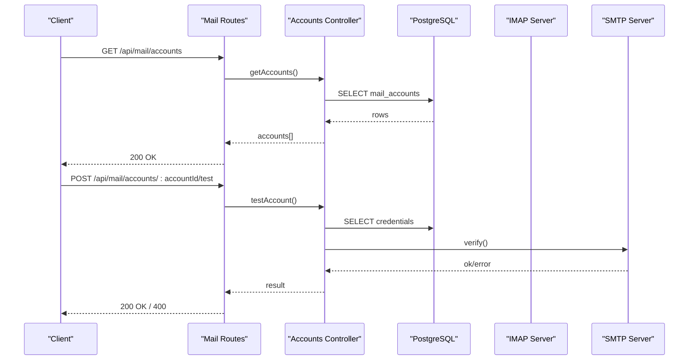
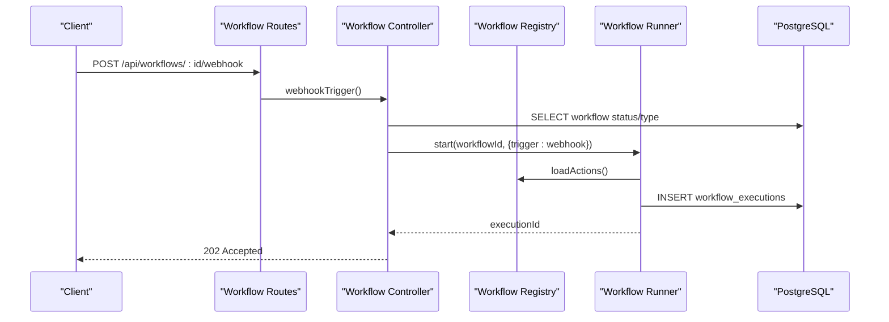
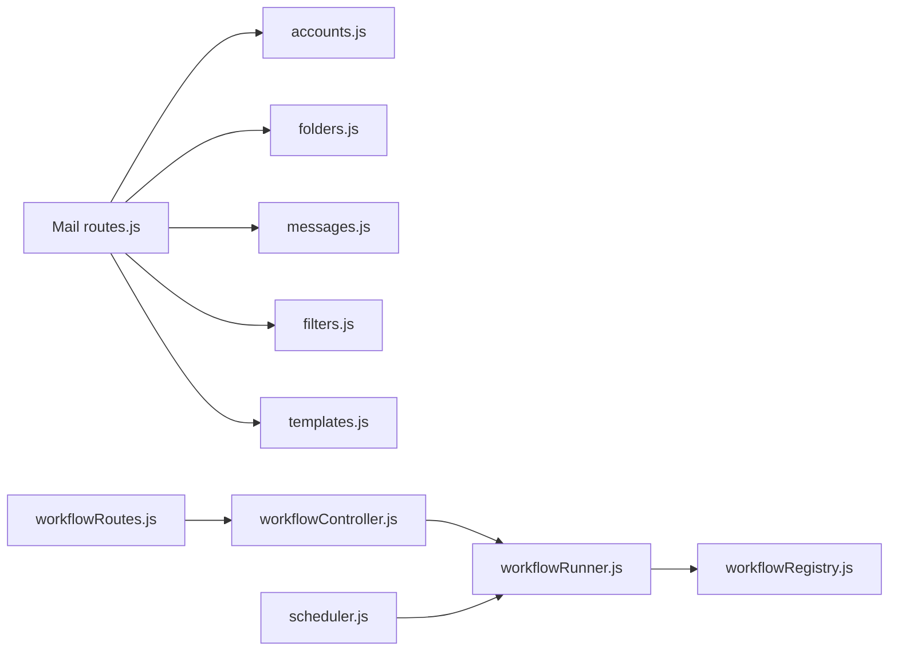

# Mail & Workflow API

<cite>
**Referenced Files in This Document**
- [routes.js](file://backend/modules/mail/routes.js)
- [accounts.js](file://backend/modules/mail/controllers/accounts.js)
- [folders.js](file://backend/modules/mail/controllers/folders.js)
- [messages.js](file://backend/modules/mail/controllers/messages.js)
- [filters.js](file://backend/modules/mail/controllers/filters.js)
- [templates.js](file://backend/modules/mail/controllers/templates.js)
- [index.js](file://backend/modules/mail/index.js)
- [workflowRoutes.js](file://backend/modules/workflow/workflowRoutes.js)
- [workflowController.js](file://backend/modules/workflow/workflowController.js)
- [workflowRegistry.js](file://backend/modules/workflow/engine/workflowRegistry.js)
- [workflowRunner.js](file://backend/modules/workflow/engine/workflowRunner.js)
- [scheduler.js](file://backend/modules/workflow/triggers/scheduler.js)
</cite>

## Table of Contents
1. [Introduction](#introduction)
2. [Project Structure](#project-structure)
3. [Core Components](#core-components)
4. [Architecture Overview](#architecture-overview)
5. [Detailed Component Analysis](#detailed-component-analysis)
6. [Dependency Analysis](#dependency-analysis)
7. [Performance Considerations](#performance-considerations)
8. [Troubleshooting Guide](#troubleshooting-guide)
9. [Conclusion](#conclusion)
10. [Appendices](#appendices)

## Introduction
This document describes the Titan CRM Mail & Workflow API, focusing on email integration and workflow automation. It covers:
- Email account management and IMAP connectivity
- Message synchronization and folder management
- Email filtering and template support
- Workflow engine configuration, conditional logic, and execution monitoring
- Security, encryption, and compliance considerations
- Integration patterns with external email clients and workflow orchestration systems

## Project Structure
The Mail module exposes REST endpoints under the prefix /api/mail and integrates with IMAP/SMTP servers. The Workflow module provides a declarative workflow engine with scheduling, human approvals, and execution history.

**Diagram sources**
- [routes.js:1-114](file://backend/modules/mail/routes.js#L1-L113)
- [accounts.js:1-491](file://backend/modules/mail/controllers/accounts.js#L1-L488)
- [folders.js:1-707](file://backend/modules/mail/controllers/folders.js#L1-L707)
- [messages.js:1-860](file://backend/modules/mail/controllers/messages.js#L1-L109)
- [filters.js:1-195](file://backend/modules/mail/controllers/filters.js#L1-L195)
- [templates.js:1-74](file://backend/modules/mail/controllers/templates.js#L1-L73)
- [workflowRoutes.js:1-32](file://backend/modules/workflow/workflowRoutes.js#L1-L31)
- [workflowController.js:1-539](file://backend/modules/workflow/workflowController.js#L1-L538)
- [workflowRegistry.js:1-137](file://backend/modules/workflow/engine/workflowRegistry.js#L1-L136)
- [workflowRunner.js:1-399](file://backend/modules/workflow/engine/workflowRunner.js#L1-L399)
- [scheduler.js:1-106](file://backend/modules/workflow/triggers/scheduler.js#L1-L105)

**Section sources**
- [index.js:1-30](file://backend/modules/mail/index.js#L1-L29)
- [workflowRoutes.js:1-32](file://backend/modules/workflow/workflowRoutes.js#L1-L31)

## Core Components
- Mail Accounts: Create, update, test, sync, and delete email accounts with IMAP/SMTP credentials. Supports encryption and password management.
- Folders: Manage local CRM folders and synchronize with IMAP hierarchy. Includes duplicate cleanup and IMAP folder discovery.
- Messages: Search, fetch, send, move, delete, and bulk operations with full-text search and threading support.
- Filters: Define match rules and actions to automatically process existing or incoming emails.
- Templates: Store reusable email templates for quick composition.
- Workflow Engine: Declarative workflows with steps, conditions, delays, human approvals, and execution history.

**Section sources**
- [accounts.js:16-491](file://backend/modules/mail/controllers/accounts.js#L16-L488)
- [folders.js:17-707](file://backend/modules/mail/controllers/folders.js#L17-L707)
- [messages.js:15-860](file://backend/modules/mail/controllers/messages.js#L15-L109)
- [filters.js:12-195](file://backend/modules/mail/controllers/filters.js#L12-L195)
- [templates.js:5-74](file://backend/modules/mail/controllers/templates.js#L5-L73)
- [workflowRegistry.js:15-137](file://backend/modules/workflow/engine/workflowRegistry.js#L15-L136)
- [workflowRunner.js:23-399](file://backend/modules/workflow/engine/workflowRunner.js#L23-L399)

## Architecture Overview
The Mail module orchestrates IMAP/SMTP interactions, persistence, and message processing. The Workflow module provides a scheduler and executor that can be triggered by schedules or webhooks and can call actions exposed by other modules.

**Diagram sources**
- [routes.js:21-31](file://backend/modules/mail/routes.js#L21-L31)
- [accounts.js:189-240](file://backend/modules/mail/controllers/accounts.js#L189-L240)

**Diagram sources**
- [workflowRoutes.js:7-8](file://backend/modules/workflow/workflowRoutes.js#L7-L8)
- [workflowController.js:352-375](file://backend/modules/workflow/workflowController.js#L352-L375)
- [workflowRunner.js:23-62](file://backend/modules/workflow/engine/workflowRunner.js#L23-L62)
- [workflowRegistry.js:15-118](file://backend/modules/workflow/engine/workflowRegistry.js#L15-L118)

## Detailed Component Analysis

### Mail Accounts API
- Purpose: Manage email accounts per user, test connectivity, and initiate synchronization.
- Authentication: Requires header x-user-id on all endpoints.
- Endpoints:
  - GET /api/mail/accounts
  - GET /api/mail/accounts/:accountId
  - POST /api/mail/accounts
  - PUT /api/mail/accounts/:accountId
  - POST /api/mail/accounts/:accountId/test
  - POST /api/mail/test-connection
  - POST /api/mail/accounts/:accountId/sync
  - DELETE /api/mail/accounts/:accountId
  - POST /api/mail/accounts/:accountId/imap-folders
  - POST /api/mail/accounts/:accountId/sync-folders

- Request/Response
  - Create/Update include fields for email, display_name, account_type, IMAP/SMTP host/port, TLS, sync preferences, and optional password.
  - Test endpoints return success/failure with details; temporary test validates IMAP/SMTP without persisting credentials.
  - Sync supports background mode and folder-scoped runs.

- IMAP/SMTP Integration
  - Uses nodemailer for SMTP verification and native IMAP library for IMAP connectivity.
  - Decrypts stored passwords when needed for verification.

- Security and Compliance
  - Passwords are encrypted at rest using module-specific crypto utilities.
  - Temporary connection test avoids storing credentials.

**Section sources**
- [routes.js:21-33](file://backend/modules/mail/routes.js#L21-L33)
- [accounts.js:16-491](file://backend/modules/mail/controllers/accounts.js#L16-L488)

### Folders API
- Purpose: Manage CRM folders and synchronize with IMAP hierarchy.
- Endpoints:
  - GET /api/mail/folders/:accountId
  - GET /api/mail/folders/:accountId/stats
  - POST /api/mail/folders/:accountId/cleanup-duplicates
  - POST /api/mail/folders
  - POST /api/mail/folders/:folderId/clear
  - POST /api/mail/folders/:folderId/clear-local
  - PATCH /api/mail/folders/:folderId/read-all
  - PUT /api/mail/folders/:folderId
  - DELETE /api/mail/folders/:folderId
  - POST /api/mail/accounts/:accountId/imap-folders
  - POST /api/mail/accounts/:accountId/sync-folders

- IMAP Synchronization
  - Discover IMAP folders and build local hierarchy.
  - Resolve canonical folder types and handle nested paths.
  - Rename and move folders on IMAP respecting hierarchy and avoiding cycles.

- Bulk Operations
  - Clear folder contents locally and/or on IMAP.
  - Mark all messages as read locally and on IMAP.

**Section sources**
- [routes.js:35-45](file://backend/modules/mail/routes.js#L35-L45)
- [folders.js:17-707](file://backend/modules/mail/controllers/folders.js#L17-L707)

### Messages API
- Purpose: Retrieve, send, move, delete, and bulk-manage messages with full-text search and threading.
- Endpoints:
  - GET /api/mail
  - GET /api/mail/:id
  - POST /api/mail
  - PATCH /api/mail/:id/read
  - PATCH /api/mail/:id/star
  - PATCH /api/mail/:id/move
  - DELETE /api/mail/:id
  - POST /api/mail/bulk/read
  - POST /api/mail/bulk/move
  - POST /api/mail/bulk/delete
  - GET /api/mail/:id/thread

- Search and Filtering
  - Full-text search across subjects, content, and senders.
  - Query parameters: accountId, folderId, includeSubfolders, search, searchQuery, limit, offset, isRead, isStarred.

- Send Email
  - Queue outgoing messages; optionally save to Sent/Drafts and attach existing attachments.

- IMAP Flags and Sync
  - Update read/star flags on IMAP and move/delete messages across accounts/folders.

**Section sources**
- [routes.js:56-92](file://backend/modules/mail/routes.js#L56-L92)
- [messages.js:15-860](file://backend/modules/mail/controllers/messages.js#L15-L109)

### Filters API
- Purpose: Define rules to automatically apply actions to matching messages.
- Endpoints:
  - GET /api/mail/filters/:accountId
  - POST /api/mail/filters
  - PUT /api/mail/filters/:filterId
  - DELETE /api/mail/filters/:filterId
  - POST /api/mail/filters/:filterId/apply
  - POST /api/mail/filters/apply-all

- Filter Actions
  - Apply to target folder, mark read/star, delete, forward, or apply label.
  - Dry-run option to preview actions.

**Section sources**
- [routes.js:47-54](file://backend/modules/mail/routes.js#L47-L54)
- [filters.js:12-195](file://backend/modules/mail/controllers/filters.js#L12-L195)

### Templates API
- Purpose: Store and manage reusable email templates.
- Endpoints:
  - GET /api/mail/templates
  - POST /api/mail/templates
  - PUT /api/mail/templates/:id
  - DELETE /api/mail/templates/:id

**Section sources**
- [routes.js:100-104](file://backend/modules/mail/routes.js#L100-L104)
- [templates.js:5-74](file://backend/modules/mail/controllers/templates.js#L5-L73)

### Workflow Engine API
- Purpose: Configure, run, monitor, and approve automated workflows.
- Public Endpoint:
  - POST /api/workflows/:id/webhook (no auth)
- Protected Endpoints:
  - GET /api/workflows
  - POST /api/workflows
  - GET /api/workflows/:id
  - PUT /api/workflows/:id
  - DELETE /api/workflows/:id
  - POST /api/workflows/:id/run
  - POST /api/workflows/:id/validate
  - GET /api/workflows/:id/history
  - GET /api/workflows/:id/history/:execId
  - POST /api/workflows/:id/history/:execId/retry
  - POST /api/workflows/:id/history/:execId/approve
  - DELETE /api/workflows/:id/history
  - DELETE /api/workflows/:id/history/:execId

- Workflow Definition
  - Steps: module, action, action_config, condition, delay_seconds, on_fail
  - Conditions: existence, equality, containment, regex, numeric comparisons
  - Validation: checks cross-step references and output schemas

- Execution Monitoring
  - Execution logs per step with status and output data
  - Summary aggregation for case/document updates
  - Approvals: human-in-the-loop with comments and approver identity

- Scheduling
  - Cron-based scheduling with automatic wakeup of delayed executions

**Section sources**
- [workflowRoutes.js:1-32](file://backend/modules/workflow/workflowRoutes.js#L1-L31)
- [workflowController.js:146-539](file://backend/modules/workflow/workflowController.js#L146-L538)
- [workflowRegistry.js:15-137](file://backend/modules/workflow/engine/workflowRegistry.js#L15-L136)
- [workflowRunner.js:23-399](file://backend/modules/workflow/engine/workflowRunner.js#L23-L399)
- [scheduler.js:11-106](file://backend/modules/workflow/triggers/scheduler.js#L11-L105)

## Dependency Analysis
- Mail module depends on:
  - PostgreSQL for persistence
  - IMAP/SMTP libraries for server communication
  - Encryption utilities for credential storage
- Workflow module depends on:
  - PostgreSQL for workflow definitions and execution logs
  - node-cron for scheduling
  - Registry to discover actions from other modules

**Diagram sources**
- [routes.js:1-114](file://backend/modules/mail/routes.js#L1-L113)
- [accounts.js:1-491](file://backend/modules/mail/controllers/accounts.js#L1-L488)
- [folders.js:1-707](file://backend/modules/mail/controllers/folders.js#L1-L707)
- [messages.js:1-860](file://backend/modules/mail/controllers/messages.js#L1-L109)
- [filters.js:1-195](file://backend/modules/mail/controllers/filters.js#L1-L195)
- [templates.js:1-74](file://backend/modules/mail/controllers/templates.js#L1-L73)
- [workflowRoutes.js:1-32](file://backend/modules/workflow/workflowRoutes.js#L1-L31)
- [workflowController.js:1-539](file://backend/modules/workflow/workflowController.js#L1-L538)
- [workflowRunner.js:1-399](file://backend/modules/workflow/engine/workflowRunner.js#L1-L399)
- [workflowRegistry.js:1-137](file://backend/modules/workflow/engine/workflowRegistry.js#L1-L136)
- [scheduler.js:1-106](file://backend/modules/workflow/triggers/scheduler.js#L1-L105)

**Section sources**
- [index.js:17-29](file://backend/modules/mail/index.js#L17-L29)

## Performance Considerations
- Full-text search leverages PostgreSQL full-text indexing; use appropriate indices and limit result sets.
- Bulk operations batch updates and minimize round-trips; prefer server-side pagination.
- IMAP operations can be slow; use background sync and avoid blocking requests.
- Scheduler runs periodic wakeups; ensure cron expressions are efficient and avoid overlapping executions.

## Troubleshooting Guide
- Authentication failures
  - Ensure x-user-id header is present on Mail endpoints.
  - Verify SMTP credentials and TLS settings when testing connections.
- IMAP connectivity issues
  - Confirm host, port, and TLS configuration; some providers require app-specific passwords.
  - Use temporary connection test to isolate IMAP vs SMTP problems.
- Workflow execution stuck
  - Check execution logs for step-level errors.
  - Resume paused executions or approve human-in-the-loop steps.
  - Validate workflow definition and cross-step references.

**Section sources**
- [accounts.js:244-391](file://backend/modules/mail/controllers/accounts.js#L244-L391)
- [workflowController.js:425-535](file://backend/modules/workflow/workflowController.js#L425-L535)

## Conclusion
The Titan CRM Mail & Workflow APIs provide a robust foundation for email integration and automation. The Mail module handles secure account management, IMAP/SMTP connectivity, and message/folder operations. The Workflow module enables flexible, auditable automation with scheduling, approvals, and execution monitoring. Together, they support complex business scenarios such as case updates, financial processing, and automated notifications.

## Appendices

### API Reference: Mail Accounts
- GET /api/mail/accounts
  - Headers: x-user-id
  - Response: Array of accounts
- GET /api/mail/accounts/:accountId
  - Headers: x-user-id
  - Response: Account details (excluding sensitive fields)
- POST /api/mail/accounts
  - Headers: x-user-id
  - Body: email, displayName, accountType, imapHost, imapPort, smtpHost, smtpPort, login, password, useTls, includeSubfolders, syncFolders, syncMode
  - Response: Created account
- PUT /api/mail/accounts/:accountId
  - Headers: x-user-id
  - Body: Same as create; optional password to update
  - Response: Updated account
- POST /api/mail/accounts/:accountId/test
  - Headers: x-user-id
  - Response: Connection result
- POST /api/mail/test-connection
  - Headers: x-user-id
  - Body: login, password, smtpHost, smtpPort, useTls, imapHost, imapPort
  - Response: Combined IMAP/SMTP test result
- POST /api/mail/accounts/:accountId/sync
  - Headers: x-user-id
  - Body: background (boolean), folderName (optional), syncFolders (optional)
  - Response: Sync status
- DELETE /api/mail/accounts/:accountId
  - Headers: x-user-id
  - Response: Deletion confirmation
- POST /api/mail/accounts/:accountId/imap-folders
  - Headers: x-user-id
  - Response: IMAP folder list
- POST /api/mail/accounts/:accountId/sync-folders
  - Headers: x-user-id
  - Body: Array of {name, path, delimiter}
  - Response: Count of synced folders

**Section sources**
- [routes.js:21-33](file://backend/modules/mail/routes.js#L21-L33)
- [accounts.js:16-491](file://backend/modules/mail/controllers/accounts.js#L16-L488)
- [folders.js:96-260](file://backend/modules/mail/controllers/folders.js#L96-L260)

### API Reference: Folders
- GET /api/mail/folders/:accountId
  - Headers: x-user-id
  - Response: Folder list
- GET /api/mail/folders/:accountId/stats
  - Headers: x-user-id
  - Response: Per-folder counts
- POST /api/mail/folders/:accountId/cleanup-duplicates
  - Headers: x-user-id
  - Response: Cleanup metrics
- POST /api/mail/folders
  - Headers: x-user-id
  - Body: accountId, folderName, parentFolderId, folderType, imapFolderPath
  - Response: Created folder
- POST /api/mail/folders/:folderId/clear
  - Headers: x-user-id
  - Response: Deletion metrics (local + IMAP)
- POST /api/mail/folders/:folderId/clear-local
  - Headers: x-user-id
  - Response: Local deletion metrics
- PATCH /api/mail/folders/:folderId/read-all
  - Headers: x-user-id
  - Response: Read update metrics
- PUT /api/mail/folders/:folderId
  - Headers: x-user-id
  - Body: Updates to folder attributes
  - Response: Updated folder
- DELETE /api/mail/folders/:folderId
  - Headers: x-user-id
  - Response: Deletion confirmation

**Section sources**
- [routes.js:35-45](file://backend/modules/mail/routes.js#L35-L45)
- [folders.js:17-707](file://backend/modules/mail/controllers/folders.js#L17-L707)

### API Reference: Messages
- GET /api/mail
  - Headers: x-user-id
  - Query: accountId, folderId, includeSubfolders, searchQuery, search, limit, offset, isRead, isStarred
  - Response: Paginated messages with counts
- GET /api/mail/:id
  - Headers: x-user-id
  - Response: Message with attachments and flags
- POST /api/mail
  - Headers: x-user-id
  - Body: accountId, to, subject, htmlContent, content, cc, bcc, attachmentIds, saveToSent
  - Response: Queue result
- PATCH /api/mail/:id/read
  - Headers: x-user-id
  - Body: isRead
  - Response: Updated message
- PATCH /api/mail/:id/star
  - Headers: x-user-id
  - Body: isStarred
  - Response: Updated message
- PATCH /api/mail/:id/move
  - Headers: x-user-id
  - Body: folderId
  - Response: Moved message
- DELETE /api/mail/:id
  - Headers: x-user-id
  - Response: Deletion confirmation
- POST /api/mail/bulk/read
  - Headers: x-user-id
  - Body: mailIds, isRead
  - Response: Bulk update result
- POST /api/mail/bulk/move
  - Headers: x-user-id
  - Body: mailIds, folderId
  - Response: Bulk move result
- POST /api/mail/bulk/delete
  - Headers: x-user-id
  - Body: mailIds
  - Response: Bulk delete result
- GET /api/mail/:id/thread
  - Headers: x-user-id
  - Response: Thread messages

**Section sources**
- [routes.js:56-92](file://backend/modules/mail/routes.js#L56-L92)
- [messages.js:15-860](file://backend/modules/mail/controllers/messages.js#L15-L109)

### API Reference: Filters
- GET /api/mail/filters/:accountId
  - Headers: x-user-id
  - Response: Filter list
- POST /api/mail/filters
  - Headers: x-user-id
  - Body: accountId, filterName, description, matchType, targetFolderId, applyStar, applyRead, deleteMail, forwardTo, applyLabelId
  - Response: Created filter
- PUT /api/mail/filters/:filterId
  - Headers: x-user-id
  - Body: Updates to filter attributes
  - Response: Updated filter
- DELETE /api/mail/filters/:filterId
  - Headers: x-user-id
  - Response: Deletion confirmation
- POST /api/mail/filters/:filterId/apply
  - Headers: x-user-id
  - Body: limit, dryRun
  - Response: Application result
- POST /api/mail/filters/apply-all
  - Headers: x-user-id
  - Body: accountId, limit, dryRun
  - Response: Application result

**Section sources**
- [routes.js:47-54](file://backend/modules/mail/routes.js#L47-L54)
- [filters.js:12-195](file://backend/modules/mail/controllers/filters.js#L12-L195)

### API Reference: Templates
- GET /api/mail/templates
  - Headers: x-user-id
  - Response: Template list
- POST /api/mail/templates
  - Headers: x-user-id
  - Body: name, subject, content, isHtml
  - Response: Created template
- PUT /api/mail/templates/:id
  - Headers: x-user-id
  - Body: name, subject, content, isHtml
  - Response: Updated template
- DELETE /api/mail/templates/:id
  - Headers: x-user-id
  - Response: Deletion confirmation

**Section sources**
- [routes.js:100-104](file://backend/modules/mail/routes.js#L100-L104)
- [templates.js:5-74](file://backend/modules/mail/controllers/templates.js#L5-L73)

### API Reference: Workflow Engine
- GET /api/workflows
  - Response: Workflows with steps
- POST /api/workflows
  - Body: name, description, trigger_type, trigger_config, status, steps
  - Response: Created workflow
- GET /api/workflows/:id
  - Response: Workflow with steps
- PUT /api/workflows/:id
  - Body: Updates to workflow and steps
  - Response: Updated workflow
- DELETE /api/workflows/:id
  - Response: Deletion confirmation
- POST /api/workflows/:id/run
  - Body: dryRun (optional)
  - Response: Execution started
- POST /api/workflows/:id/validate
  - Response: Validation result
- GET /api/workflows/:id/history
  - Response: Recent executions
- GET /api/workflows/:id/history/:execId
  - Response: Execution details and summary
- POST /api/workflows/:id/history/:execId/retry
  - Response: Retry started
- POST /api/workflows/:id/history/:execId/approve
  - Body: approved, comment
  - Response: Approved and resumed
- DELETE /api/workflows/:id/history
  - Response: History cleared
- DELETE /api/workflows/:id/history/:execId
  - Response: Execution deleted

**Section sources**
- [workflowRoutes.js:1-32](file://backend/modules/workflow/workflowRoutes.js#L1-L31)
- [workflowController.js:146-539](file://backend/modules/workflow/workflowController.js#L146-L538)

### Workflow Engine Internals
- Registry
  - Loads actions from modules and provides built-in actions (human approval, delay).
- Runner
  - Executes steps, evaluates conditions, handles delays and approvals, persists logs and context.
- Scheduler
  - Manages cron-based triggers and wakes paused executions on schedule.

**Section sources**
- [workflowRegistry.js:15-137](file://backend/modules/workflow/engine/workflowRegistry.js#L15-L136)
- [workflowRunner.js:23-399](file://backend/modules/workflow/engine/workflowRunner.js#L23-L399)
- [scheduler.js:11-106](file://backend/modules/workflow/triggers/scheduler.js#L11-L105)