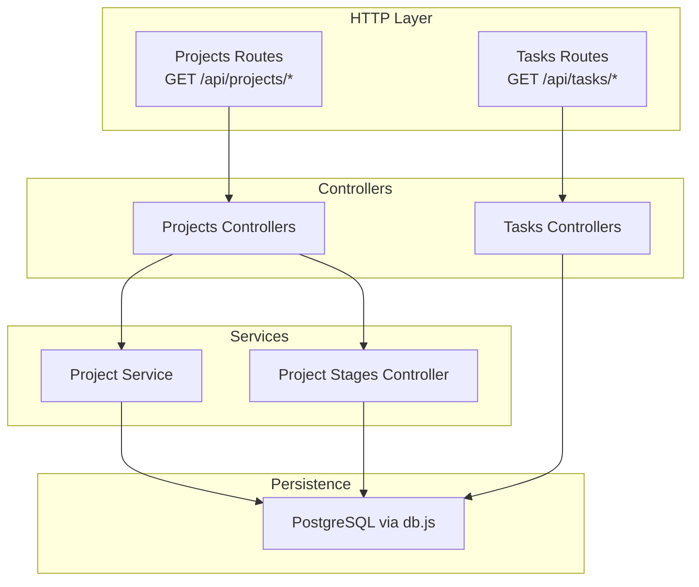
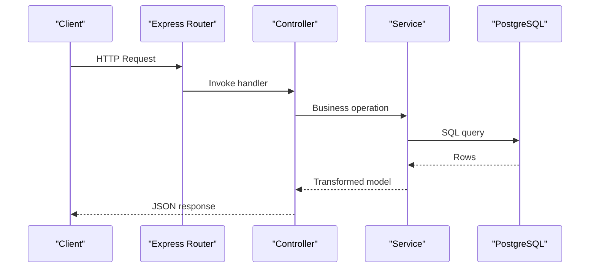
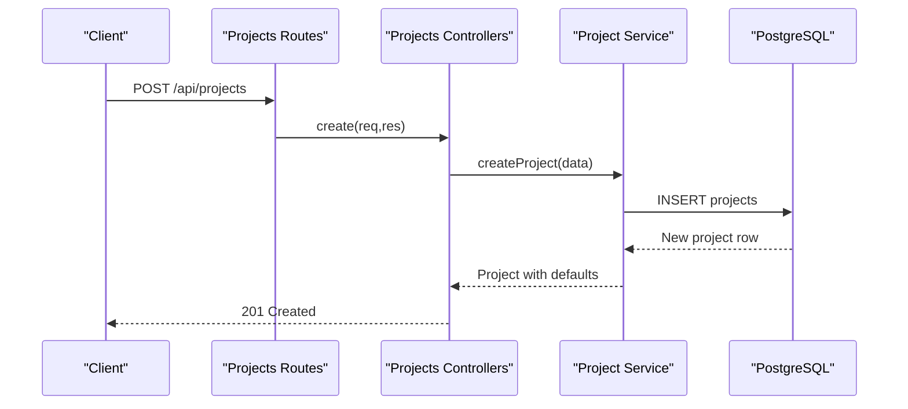
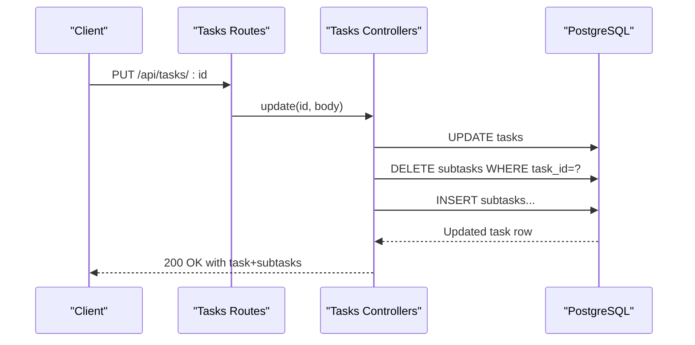
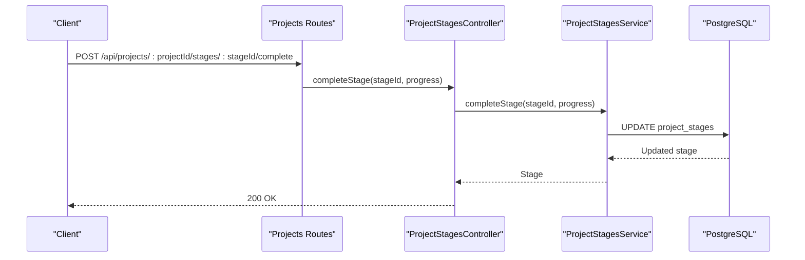
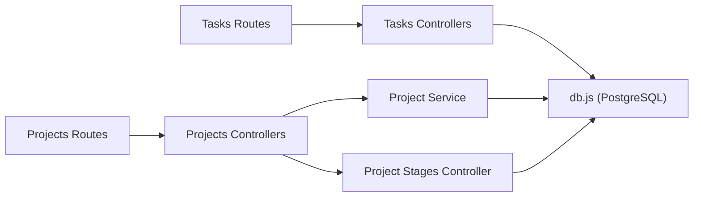

# Projects & Tasks API

<cite>
**Referenced Files in This Document**
- [PROJECTS.md](file://docs/api/PROJECTS.md)
- [TASKS.md](file://docs/api/TASKS.md)
- [routes.js (Projects)](file://backend/modules/projects/routes.js)
- [routes.js (Tasks)](file://backend/modules/tasks/routes.js)
- [controllers.js (Projects)](file://backend/modules/projects/controllers.js)
- [controllers.js (Tasks)](file://backend/modules/tasks/controllers.js)
- [projectService.js](file://backend/modules/projects/services/projectService.js)
- [projectStagesController.js](file://backend/modules/projects/controllers/projectStagesController.js)
- [db.js](file://backend/db.js)
</cite>

## Table of Contents
1. [Introduction](#introduction)
2. [Project Structure](#project-structure)
3. [Core Components](#core-components)
4. [Architecture Overview](#architecture-overview)
5. [Detailed Component Analysis](#detailed-component-analysis)
6. [Dependency Analysis](#dependency-analysis)
7. [Performance Considerations](#performance-considerations)
8. [Troubleshooting Guide](#troubleshooting-guide)
9. [Conclusion](#conclusion)
10. [Appendices](#appendices)

## Introduction
This document provides comprehensive API documentation for the Projects and Tasks modules in Titan CRM. It covers endpoints for project lifecycle management, task assignment, timeline and stage management, financial analytics, and integration patterns. It also explains the relationship between projects and tasks, including cascading updates, dependency resolution via stages, and timeline synchronization.

## Project Structure
The Projects and Tasks modules follow a layered architecture:
- Routes define HTTP endpoints under /api/projects and /api/tasks.
- Controllers handle request parsing, validation, and orchestration.
- Services encapsulate business logic and data transformations.
- Database access is performed via a shared PostgreSQL connection pool abstraction.

**Diagram sources**
- [routes.js (Projects):1-168](file://backend/modules/projects/routes.js#L1-L168)
- [routes.js (Tasks):1-28](file://backend/modules/tasks/routes.js#L1-L28)
- [controllers.js (Projects):1-201](file://backend/modules/projects/controllers.js#L1-L201)
- [controllers.js (Tasks):1-207](file://backend/modules/tasks/controllers.js#L1-L207)
- [projectService.js:1-334](file://backend/modules/projects/services/projectService.js#L1-L334)
- [projectStagesController.js:1-204](file://backend/modules/projects/controllers/projectStagesController.js#L1-L203)
- [db.js:1-68](file://backend/db.js#L1-L68)

**Section sources**
- [routes.js (Projects):1-168](file://backend/modules/projects/routes.js#L1-L168)
- [routes.js (Tasks):1-28](file://backend/modules/tasks/routes.js#L1-L28)
- [controllers.js (Projects):1-201](file://backend/modules/projects/controllers.js#L1-L201)
- [controllers.js (Tasks):1-207](file://backend/modules/tasks/controllers.js#L1-L207)
- [projectService.js:1-334](file://backend/modules/projects/services/projectService.js#L1-L334)
- [projectStagesController.js:1-204](file://backend/modules/projects/controllers/projectStagesController.js#L1-L203)
- [db.js:1-68](file://backend/db.js#L1-L68)

## Core Components
- Projects API: CRUD, bulk updates, completion/archive actions, statistics, and financial analytics.
- Tasks API: CRUD, subtasks replacement on update, statistics, and assignment tracking.
- Stage Management: Per-project stages with ordering, completion, and summaries.
- Financial Analytics: Revenue, expense, payment schedule, taxes, and P&L reporting endpoints.

**Section sources**
- [PROJECTS.md:1-225](file://docs/api/PROJECTS.md#L1-L224)
- [TASKS.md:1-207](file://docs/api/TASKS.md#L1-L206)
- [routes.js (Projects):1-168](file://backend/modules/projects/routes.js#L1-L168)
- [routes.js (Tasks):1-28](file://backend/modules/tasks/routes.js#L1-L28)

## Architecture Overview
The Projects and Tasks modules share a consistent pattern:
- Route registration defines endpoint groups.
- Controllers delegate to services for business logic.
- Services query the database and apply transformations.
- Responses are standardized via helper utilities.

**Diagram sources**
- [routes.js (Projects):18-44](file://backend/modules/projects/routes.js#L18-L44)
- [controllers.js (Projects):15-23](file://backend/modules/projects/controllers.js#L15-L23)
- [projectService.js:48-71](file://backend/modules/projects/services/projectService.js#L48-L71)
- [db.js:58-67](file://backend/db.js#L58-L67)

## Detailed Component Analysis

### Projects API

#### Endpoints
- List projects: GET /api/projects
- Project statistics: GET /api/projects/stats
- Get project by ID: GET /api/projects/:id
- Create project: POST /api/projects
- Update project: PUT /api/projects/:id
- Delete project: DELETE /api/projects/:id
- Bulk update: POST /api/projects/bulk-update
- Complete project: POST /api/projects/:id/complete
- Archive project: POST /api/projects/:id/archive

**Diagram sources**
- [routes.js (Projects):27-29](file://backend/modules/projects/routes.js#L27-L29)
- [controllers.js (Projects):80-89](file://backend/modules/projects/controllers.js#L80-L89)
- [projectService.js:140-184](file://backend/modules/projects/services/projectService.js#L140-L184)
- [db.js:58-67](file://backend/db.js#L58-L67)

**Section sources**
- [routes.js (Projects):18-44](file://backend/modules/projects/routes.js#L18-L44)
- [controllers.js (Projects):15-136](file://backend/modules/projects/controllers.js#L15-L136)
- [projectService.js:48-184](file://backend/modules/projects/services/projectService.js#L48-L184)
- [PROJECTS.md:11-123](file://docs/api/PROJECTS.md#L11-L123)

#### Project Model and Fields
- Core fields include identifiers, client, manager, status, stage, priority, budget, deadlines, counts, and financial indicators.
- Statuses, stages, priorities, and financial statuses are enumerated.

**Section sources**
- [PROJECTS.md:165-225](file://docs/api/PROJECTS.md#L165-L224)

#### Bulk Updates
- Supported fields: status, priority, manager, stage.
- Validation ensures only allowed fields are updated.

**Section sources**
- [controllers.js (Projects):146-156](file://backend/modules/projects/controllers.js#L146-L156)
- [projectService.js:267-286](file://backend/modules/projects/services/projectService.js#L267-L286)
- [PROJECTS.md:125-162](file://docs/api/PROJECTS.md#L125-L162)

#### Completion and Archiving
- Complete transitions status to completed and stage to done.
- Archive sets status to archived.

**Section sources**
- [controllers.js (Projects):162-188](file://backend/modules/projects/controllers.js#L162-L188)
- [projectService.js:293-320](file://backend/modules/projects/services/projectService.js#L293-L320)
- [PROJECTS.md:108-123](file://docs/api/PROJECTS.md#L108-L123)

#### Financial Analytics Endpoints
- Payment schedule: list, summary, get by ID, create, update, delete, mark paid.
- Revenues: list, summary, get by ID, create, update, delete, mark received.
- Expenses: categories, list, summary, get by ID, create, update, delete, approve, mark paid.
- P&L report, finance summary, taxes.

**Section sources**
- [routes.js (Projects):77-166](file://backend/modules/projects/routes.js#L77-L166)

### Tasks API

#### Endpoints
- List tasks: GET /api/tasks
- Task statistics: GET /api/tasks/stats
- Get task by ID: GET /api/tasks/:id
- Create task: POST /api/tasks
- Update task: PUT /api/tasks/:id
- Delete task: DELETE /api/tasks/:id

**Diagram sources**
- [routes.js (Tasks):21-23](file://backend/modules/tasks/routes.js#L21-L23)
- [controllers.js (Tasks):117-151](file://backend/modules/tasks/controllers.js#L117-L151)
- [db.js:58-67](file://backend/db.js#L58-L67)

**Section sources**
- [routes.js (Tasks):9-26](file://backend/modules/tasks/routes.js#L9-L26)
- [controllers.js (Tasks):26-162](file://backend/modules/tasks/controllers.js#L26-L162)
- [TASKS.md:11-150](file://docs/api/TASKS.md#L11-L150)

#### Task Model and Subtasks
- Task includes identifier, title, project, assignee, priority, status, due date, and subtasks array.
- On update, subtasks are fully replaced.

**Section sources**
- [TASKS.md:153-178](file://docs/api/TASKS.md#L153-L178)
- [controllers.js (Tasks):137-147](file://backend/modules/tasks/controllers.js#L137-L147)

#### Statistics
- Provides totals, completion, in-progress, todo, priority breakdown, and overdue counts.

**Section sources**
- [controllers.js (Tasks):169-197](file://backend/modules/tasks/controllers.js#L169-L197)
- [TASKS.md:169-199](file://docs/api/TASKS.md#L169-L199)

### Stage Management (Projects)

#### Endpoints
- List stages: GET /api/projects/:id/stages
- Stages summary: GET /api/projects/:id/stages/summary
- Get stage by ID: GET /api/projects/:projectId/stages/:stageId
- Create stage: POST /api/projects/:id/stages
- Update stage: PUT /api/projects/:projectId/stages/:stageId
- Delete stage: DELETE /api/projects/:projectId/stages/:stageId
- Complete stage: POST /api/projects/:projectId/stages/:stageId/complete
- Reorder stage: POST /api/projects/:projectId/stages/:stageId/reorder

**Diagram sources**
- [routes.js (Projects):67-68](file://backend/modules/projects/routes.js#L67-L68)
- [projectStagesController.js:146-162](file://backend/modules/projects/controllers/projectStagesController.js#L146-L162)

**Section sources**
- [routes.js (Projects):49-72](file://backend/modules/projects/routes.js#L49-L72)
- [projectStagesController.js:15-192](file://backend/modules/projects/controllers/projectStagesController.js#L15-L192)

### Integrated Workflows: Projects, Stages, and Tasks

#### Timeline and Stage Synchronization
- Tasks can be associated with a project stage via stageId during creation/update.
- Stages support ordering and completion with progress, enabling timeline synchronization.

**Section sources**
- [controllers.js (Tasks):64-89](file://backend/modules/tasks/controllers.js#L64-L89)
- [controllers.js (Tasks):124-130](file://backend/modules/tasks/controllers.js#L124-L130)
- [projectStagesController.js:172-192](file://backend/modules/projects/controllers/projectStagesController.js#L172-L192)

#### Cascading Updates and Dependencies
- Updating a project’s stage may influence task progression when stageId is set on tasks.
- Deleting a project removes related records per service logic; ensure dependent tasks are handled accordingly.

**Section sources**
- [projectService.js:293-320](file://backend/modules/projects/services/projectService.js#L293-L320)
- [controllers.js (Projects):121-136](file://backend/modules/projects/controllers.js#L121-L136)

#### Progress Tracking
- Projects expose completion rate derived from task counts.
- Tasks provide statistics for overall progress and overdue items.

**Section sources**
- [projectService.js:100-133](file://backend/modules/projects/services/projectService.js#L100-L133)
- [controllers.js (Tasks):169-197](file://backend/modules/tasks/controllers.js#L169-L197)

### Complex Scenarios and Examples

#### Portfolio Management
- Use bulk updates to change status, priority, or manager across multiple projects.
- Combine with stage summaries to assess portfolio health.

**Section sources**
- [controllers.js (Projects):146-156](file://backend/modules/projects/controllers.js#L146-L156)
- [routes.js (Projects):52-53](file://backend/modules/projects/routes.js#L52-L53)

#### Resource Conflicts and Workload Balancing
- Assign tasks to specific assignees and filter by overdue and priority.
- Use task statistics to balance workload and identify bottlenecks.

**Section sources**
- [controllers.js (Tasks):169-197](file://backend/modules/tasks/controllers.js#L169-L197)
- [TASKS.md:169-199](file://docs/api/TASKS.md#L169-L199)

#### Milestone Planning
- Define project stages and reorder them to reflect milestones.
- Mark stages complete with progress to synchronize timelines.

**Section sources**
- [projectStagesController.js:172-192](file://backend/modules/projects/controllers/projectStagesController.js#L172-L192)
- [routes.js (Projects):70-71](file://backend/modules/projects/routes.js#L70-L71)

#### Progress Reporting
- Retrieve project stats and task stats for dashboards.
- Use financial analytics endpoints for revenue/expense tracking.

**Section sources**
- [controllers.js (Projects):30-49](file://backend/modules/projects/controllers.js#L30-L49)
- [controllers.js (Tasks):169-197](file://backend/modules/tasks/controllers.js#L169-L197)
- [routes.js (Projects):158-166](file://backend/modules/projects/routes.js#L158-L166)

### Integration Patterns
- Calendar Systems: Use due dates and deadlines to integrate with calendar events.
- External Tools: Export project/task lists and financial summaries for third-party reporting.

[No sources needed since this section provides general guidance]

## Dependency Analysis
- Controllers depend on services for business logic.
- Services depend on the database abstraction for queries.
- Routes register endpoints and bind to controllers.

**Diagram sources**
- [routes.js (Projects):1-168](file://backend/modules/projects/routes.js#L1-L168)
- [routes.js (Tasks):1-28](file://backend/modules/tasks/routes.js#L1-L28)
- [controllers.js (Projects):1-201](file://backend/modules/projects/controllers.js#L1-L201)
- [controllers.js (Tasks):1-207](file://backend/modules/tasks/controllers.js#L1-L207)
- [projectService.js:1-334](file://backend/modules/projects/services/projectService.js#L1-L334)
- [projectStagesController.js:1-204](file://backend/modules/projects/controllers/projectStagesController.js#L1-L203)
- [db.js:1-68](file://backend/db.js#L1-L68)

**Section sources**
- [routes.js (Projects):1-168](file://backend/modules/projects/routes.js#L1-L168)
- [routes.js (Tasks):1-28](file://backend/modules/tasks/routes.js#L1-L28)
- [controllers.js (Projects):1-201](file://backend/modules/projects/controllers.js#L1-L201)
- [controllers.js (Tasks):1-207](file://backend/modules/tasks/controllers.js#L1-L207)
- [projectService.js:1-334](file://backend/modules/projects/services/projectService.js#L1-L334)
- [projectStagesController.js:1-204](file://backend/modules/projects/controllers/projectStagesController.js#L1-L203)
- [db.js:1-68](file://backend/db.js#L1-L68)

## Performance Considerations
- Prefer bulk operations for mass updates to reduce round-trips.
- Use statistics endpoints to avoid heavy aggregations in client code.
- Keep subtasks minimal; replacing subtasks on updates incurs deletions and inserts.

[No sources needed since this section provides general guidance]

## Troubleshooting Guide
- Validation errors: Ensure required fields are present (e.g., task title).
- Not found errors: Verify IDs exist for GET, PUT, DELETE operations.
- Bulk update failures: Confirm field is in the allowed list.

**Section sources**
- [controllers.js (Tasks):67-69](file://backend/modules/tasks/controllers.js#L67-L69)
- [controllers.js (Projects):63-71](file://backend/modules/projects/controllers.js#L63-L71)
- [controllers.js (Projects):152-155](file://backend/modules/projects/controllers.js#L152-L155)

## Conclusion
The Projects and Tasks APIs provide a robust foundation for managing project lifecycles, task assignments, stage-based timelines, and financial analytics. By leveraging stages, bulk operations, and statistics, teams can achieve effective portfolio oversight, workload balancing, and progress tracking while integrating with external systems.

## Appendices

### Endpoint Reference Summary

- Projects
  - GET /api/projects
  - GET /api/projects/stats
  - GET /api/projects/:id
  - POST /api/projects
  - PUT /api/projects/:id
  - DELETE /api/projects/:id
  - POST /api/projects/bulk-update
  - POST /api/projects/:id/complete
  - POST /api/projects/:id/archive
  - GET /api/projects/:id/stages
  - GET /api/projects/:id/stages/summary
  - GET /api/projects/:projectId/stages/:stageId
  - POST /api/projects/:id/stages
  - PUT /api/projects/:projectId/stages/:stageId
  - DELETE /api/projects/:projectId/stages/:stageId
  - POST /api/projects/:projectId/stages/:stageId/complete
  - POST /api/projects/:projectId/stages/:stageId/reorder
  - GET /api/projects/:id/payment-schedule
  - GET /api/projects/:id/payment-schedule/summary
  - GET /api/projects/:projectId/payment-schedule/:paymentId
  - POST /api/projects/:id/payment-schedule
  - PUT /api/projects/:projectId/payment-schedule/:paymentId
  - DELETE /api/projects/:projectId/payment-schedule/:paymentId
  - POST /api/projects/:projectId/payment-schedule/:paymentId/pay
  - GET /api/projects/:id/revenues
  - GET /api/projects/:id/revenues/summary
  - GET /api/projects/:projectId/revenues/:revenueId
  - POST /api/projects/:id/revenues
  - PUT /api/projects/:projectId/revenues/:revenueId
  - DELETE /api/projects/:projectId/revenues/:revenueId
  - POST /api/projects/:projectId/revenues/:revenueId/receive
  - GET /api/projects/expenses/categories
  - GET /api/projects/:id/expenses
  - GET /api/projects/:id/expenses/summary
  - GET /api/projects/:projectId/expenses/:expenseId
  - POST /api/projects/:id/expenses
  - PUT /api/projects/:projectId/expenses/:expenseId
  - DELETE /api/projects/:projectId/expenses/:expenseId
  - POST /api/projects/:projectId/expenses/:expenseId/approve
  - POST /api/projects/:projectId/expenses/:expenseId/pay
  - GET /api/projects/:id/pnl
  - GET /api/projects/:id/finance/summary
  - GET /api/projects/:id/finance/taxes

- Tasks
  - GET /api/tasks
  - GET /api/tasks/stats
  - GET /api/tasks/:id
  - POST /api/tasks
  - PUT /api/tasks/:id
  - DELETE /api/tasks/:id

**Section sources**
- [routes.js (Projects):1-168](file://backend/modules/projects/routes.js#L1-L168)
- [routes.js (Tasks):1-28](file://backend/modules/tasks/routes.js#L1-L28)