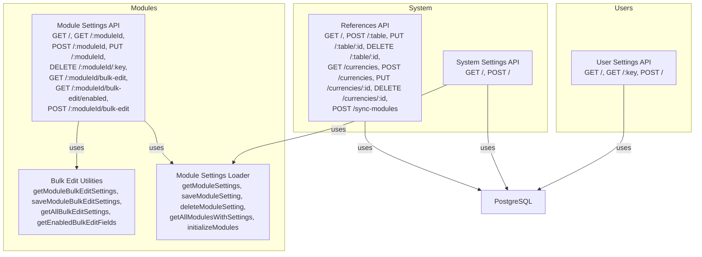
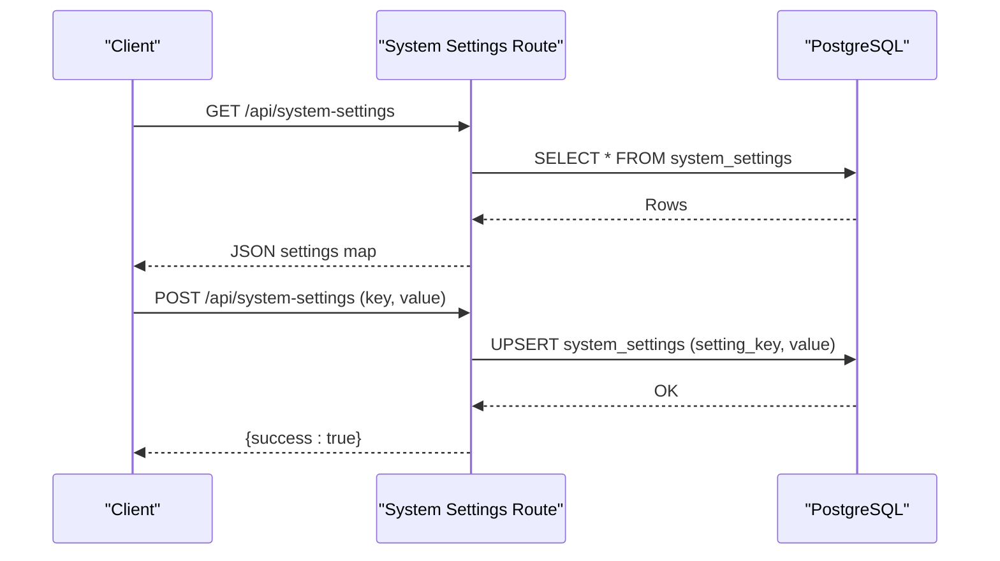
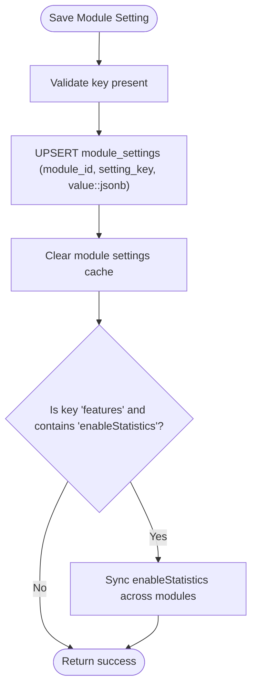
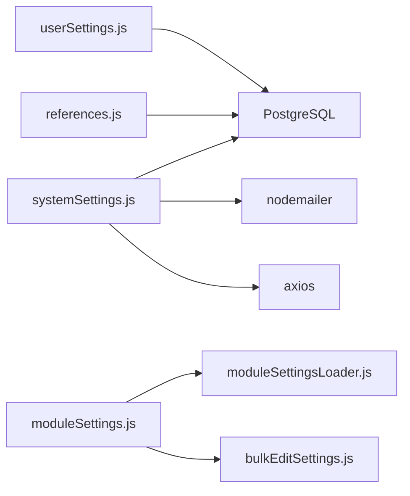

# Settings & System API

<cite>
**Referenced Files in This Document**
- [backend/routes/systemSettings.js](file://backend/modules/settings/routes/systemSettings.js)
- [backend/routes/moduleSettings.js](file://backend/modules/settings/routes/moduleSettings.js)
- [backend/routes/userSettings.js](file://backend/modules/settings/routes/userSettings.js)
- [backend/routes/references.js](file://backend/modules/references/routes.js)
- [backend/utils/moduleSettingsLoader.js](file://backend/utils/moduleSettingsLoader.js)
- [backend/utils/bulkEditSettings.js](file://backend/utils/bulkEditSettings.js)
- [backend/modules/settings/settings.js](file://backend/modules/settings/settings.js)
- [backend/modules/administration/settings.json](file://backend/modules/administration/settings.json)
- [backend/modules/users/settings.json](file://backend/modules/users/settings.json)
- [backend/migrations/96_add_log_to_db_setting.sql](file://backend/migrations/96_add_log_to_db_setting.sql)
- [docs/api/SYSTEM_SETTINGS.md](file://docs/api/SYSTEM_SETTINGS.md)
</cite>

## Table of Contents
1. [Introduction](#introduction)
2. [Project Structure](#project-structure)
3. [Core Components](#core-components)
4. [Architecture Overview](#architecture-overview)
5. [Detailed Component Analysis](#detailed-component-analysis)
6. [Dependency Analysis](#dependency-analysis)
7. [Performance Considerations](#performance-considerations)
8. [Security and Audit](#security-and-audit)
9. [Integration Patterns](#integration-patterns)
10. [Examples and Workflows](#examples-and-workflows)
11. [Troubleshooting Guide](#troubleshooting-guide)
12. [Conclusion](#conclusion)

## Introduction
This document provides comprehensive API documentation for the Titan CRM system’s configuration and settings management. It covers:
- System-wide settings (global toggles and behaviors)
- Module-specific configurations (dynamic per-module settings)
- User preferences (per-user settings)
- Reference data management (statuses, priorities, currencies, legal forms, etc.)
- Dynamic settings system (runtime changes, defaults, inheritance)
- Security and audit considerations
- Integration patterns with external systems

## Project Structure
The settings APIs are implemented as Express routes grouped under:
- System settings: global configuration and integrations
- Module settings: dynamic module configuration and bulk edit settings
- User settings: per-user preferences
- References: unified CRUD for reference data and synchronization utilities

**Diagram sources**
- [backend/routes/systemSettings.js:1-221](file://backend/modules/settings/routes/systemSettings.js#L1-L8)
- [backend/routes/moduleSettings.js:1-261](file://backend/modules/settings/routes/moduleSettings.js#L1-L190)
- [backend/utils/moduleSettingsLoader.js:1-360](file://backend/utils/moduleSettingsLoader.js#L1-L360)
- [backend/utils/bulkEditSettings.js:1-122](file://backend/utils/bulkEditSettings.js#L1-L122)
- [backend/routes/references.js:1-379](file://backend/modules/references/routes.js#L1-L30)
- [backend/routes/userSettings.js:1-82](file://backend/modules/settings/routes/userSettings.js#L1-L74)

**Section sources**
- [backend/routes/systemSettings.js:1-221](file://backend/modules/settings/routes/systemSettings.js#L1-L8)
- [backend/routes/moduleSettings.js:1-261](file://backend/modules/settings/routes/moduleSettings.js#L1-L190)
- [backend/routes/userSettings.js:1-82](file://backend/modules/settings/routes/userSettings.js#L1-L74)
- [backend/routes/references.js:1-379](file://backend/modules/references/routes.js#L1-L30)
- [backend/utils/moduleSettingsLoader.js:1-360](file://backend/utils/moduleSettingsLoader.js#L1-L360)
- [backend/utils/bulkEditSettings.js:1-122](file://backend/utils/bulkEditSettings.js#L1-L122)

## Core Components
- System Settings API: retrieves and persists global system configuration, validates email/Telegram integrations, proxies enrichment stats.
- Module Settings API: manages dynamic module settings, supports single and batch updates, bulk edit configuration, and cross-module visibility sync.
- User Settings API: stores per-user preferences in a JSONB column with upsert semantics.
- References API: unified CRUD for reference tables, bulk synchronization of modules, and specialized endpoints for currencies and legal forms.

**Section sources**
- [backend/routes/systemSettings.js:10-221](file://backend/modules/settings/routes/systemSettings.js#L1-L8)
- [backend/routes/moduleSettings.js:22-261](file://backend/modules/settings/routes/moduleSettings.js#L1-L190)
- [backend/routes/userSettings.js:7-82](file://backend/modules/settings/routes/userSettings.js#L1-L74)
- [backend/routes/references.js:14-379](file://backend/modules/references/routes.js#L1-L30)

## Architecture Overview
The system separates concerns:
- Route handlers orchestrate requests and delegate to utilities/services.
- Utilities encapsulate data access and caching for module settings.
- Bulk edit utilities manage mass-edit configuration per module.
- PostgreSQL stores system, module, and user settings with JSON/JSONB columns.

**Diagram sources**
- [backend/routes/systemSettings.js:11-65](file://backend/modules/settings/routes/systemSettings.js#L1-L8)

**Section sources**
- [backend/routes/systemSettings.js:11-65](file://backend/modules/settings/routes/systemSettings.js#L1-L8)

## Detailed Component Analysis

### System Settings API
- Purpose: Global system configuration, integration testing, and proxy access to external services.
- Endpoints:
  - GET /api/system-settings
    - Returns all system settings as a flat key-value map.
    - Values are parsed from JSON if stored as strings.
  - POST /api/system-settings
    - Upserts a single setting by key.
    - Value is serialized to JSON before storage.
  - POST /api/system-settings/test/email
    - Validates SMTP connection using provided credentials.
  - GET /api/system-settings/apifns/stat
    - Proxies to api-fns.ru using module enrichment keys; handles 403 with IP hint.
  - GET /api/system-settings/dadata/stat
    - Aggregates local enrichment usage stats (daily totals and successes).
  - POST /api/system-settings/test/telegram
    - Verifies bot token and optionally sends a test message to a chat.

- Request/Response Schemas:
  - Request body for POST /api/system-settings: { key: string, value: any }
  - Response body for GET: { [key: string]: any }
  - Response body for POST: { success: boolean }
  - Test endpoints return success flags and messages; errors include structured error fields.

- Validation Rules:
  - POST requires key and value.
  - SMTP test validates host/port/secure/auth.
  - Telegram test validates token via getMe; optional chat message delivery.

- Notes:
  - Settings are stored in system_settings with JSON serialization and updated_at timestamp.
  - A migration adds a default toggle for writing logs to the database.

**Section sources**
- [backend/routes/systemSettings.js:11-221](file://backend/modules/settings/routes/systemSettings.js#L1-L8)
- [docs/api/SYSTEM_SETTINGS.md:168-173](file://docs/api/SYSTEM_SETTINGS.md#L168-L172)
- [backend/migrations/96_add_log_to_db_setting.sql:1-7](file://backend/migrations/96_add_log_to_db_setting.sql#L1-L7)

### Module Settings API
- Purpose: Dynamic configuration per module with file-backed defaults and database overrides.
- Endpoints:
  - GET /api/module-settings
    - Lists all modules with computed settings (file + DB overrides).
  - GET /api/module-settings/:moduleId
    - Returns settings for a specific module.
  - POST /api/module-settings/:moduleId
    - Saves a single setting key/value; triggers cross-module statistics visibility sync when features.enableStatistics changes.
  - PUT /api/module-settings/:moduleId
    - Updates multiple settings atomically; applies the same visibility sync rule.
  - DELETE /api/module-settings/:moduleId/:key
    - Removes a module setting; refreshes cached settings.
  - GET /api/module-settings/:moduleId/bulk-edit
    - Retrieves bulk edit configuration for a module.
  - GET /api/module-settings/:moduleId/bulk-edit/enabled
    - Returns enabled and ordered fields for bulk edit.
  - POST /api/module-settings/:moduleId/bulk-edit
    - Saves bulk edit configuration (fields array and enabled flag).

- Request/Response Schemas:
  - POST/PUT accept { key: string, value: any } or { settings: Record<string, any> }.
  - Bulk edit endpoints accept { fields: Array, enabled?: boolean }.
  - Responses include success flags and refreshed settings.

- Validation Rules:
  - POST/PUT require a settings object; missing key triggers 400.
  - Bulk edit requires a non-empty fields array.
  - Feature flag changes propagate to other modules’ statistics visibility.

- Dynamic Settings Mechanics:
  - Settings are loaded from module settings.js or index.js settings property, then overridden by database entries.
  - Deep merge applies for nested objects; scalar values override file-backed values.
  - Cache is invalidated after saves/deletes to ensure fresh reads.

**Diagram sources**
- [backend/routes/moduleSettings.js:95-126](file://backend/modules/settings/routes/moduleSettings.js#L95-L126)
- [backend/utils/moduleSettingsLoader.js:175-206](file://backend/utils/moduleSettingsLoader.js#L175-L206)

**Section sources**
- [backend/routes/moduleSettings.js:22-261](file://backend/modules/settings/routes/moduleSettings.js#L1-L190)
- [backend/utils/moduleSettingsLoader.js:89-137](file://backend/utils/moduleSettingsLoader.js#L89-L137)
- [backend/utils/moduleSettingsLoader.js:175-206](file://backend/utils/moduleSettingsLoader.js#L175-L206)
- [backend/utils/bulkEditSettings.js:13-121](file://backend/utils/bulkEditSettings.js#L13-L121)

### User Settings API
- Purpose: Per-user preferences persisted in JSONB.
- Endpoints:
  - GET /api/user-settings
    - Returns all settings for the authenticated user (requires x-user-id header).
  - GET /api/user-settings/:key
    - Returns a specific user setting or null if not found.
  - POST /api/user-settings
    - Upserts a user setting for the authenticated user.

- Request/Response Schemas:
  - POST body: { key: string, value: any }
  - GET /:key returns the raw stored value.

- Validation Rules:
  - Requires x-user-id header; otherwise returns unauthorized.

- Storage:
  - Uses JSONB column; values are stringified before insertion/upsert.

**Section sources**
- [backend/routes/userSettings.js:7-82](file://backend/modules/settings/routes/userSettings.js#L1-L74)

### References API
- Purpose: Unified CRUD for reference data and module synchronization.
- Endpoints:
  - GET /api/references
    - Returns consolidated reference collections (statuses, priorities, currencies, etc.).
  - GET /api/references/currencies (+ POST/PUT/DELETE)
    - Currency CRUD with base currency enforcement.
  - GET /api/references/legal_form_groups (+ POST/PUT/DELETE)
    - Legal form groups CRUD.
  - GET /api/references/legal_forms (+ POST/DELETE)
    - Legal forms CRUD with grouping and keyword support.
  - POST /api/references/sync-modules
    - Bulk synchronization of modules and quick actions with transaction support and dry-run mode.
  - Generic endpoints: POST /api/references/:table, PUT /api/references/:table/:id, DELETE /api/references/:table/:id
    - Insert/update/delete with conflict handling and optional columns (display order, color, module, show_as_tab, is_active).

- Validation Rules:
  - Generic write endpoints validate table names against a whitelist.
  - Currency base currency cannot be deleted.
  - Legal form code normalized to uppercase; keywords stored as text.

- Data Model Notes:
  - Many reference tables support color, module association, tab visibility, and active flags.
  - Statuses and priorities are unified across modules for consistent UI behavior.

**Section sources**
- [backend/routes/references.js:14-379](file://backend/modules/references/routes.js#L1-L30)

### Module Settings Loader and Bulk Edit Utilities
- Module Settings Loader:
  - Loads static settings from module settings.js or index.js settings property.
  - Loads dynamic overrides from module_settings table and merges them with file-backed settings.
  - Provides cache management and initialization routines.
- Bulk Edit Utilities:
  - Manages bulk_edit_fields key in module_settings.
  - Computes enabled and ordered fields for UI consumption.

**Section sources**
- [backend/utils/moduleSettingsLoader.js:23-137](file://backend/utils/moduleSettingsLoader.js#L23-L137)
- [backend/utils/moduleSettingsLoader.js:175-229](file://backend/utils/moduleSettingsLoader.js#L175-L229)
- [backend/utils/bulkEditSettings.js:13-121](file://backend/utils/bulkEditSettings.js#L13-L121)

### Module Metadata and Defaults
- Module metadata files define identifiers, names, icons, and route prefixes used by the system.
- Settings module defines supported modules for statuses/tags, default color/display order, and UI pagination defaults.

**Section sources**
- [backend/modules/administration/settings.json:1-7](file://backend/modules/administration/settings.json#L1-L6)
- [backend/modules/users/settings.json:1-7](file://backend/modules/users/settings.json#L1-L6)
- [backend/modules/settings/settings.js:1-30](file://backend/modules/settings/settings.js#L1-L30)

## Dependency Analysis
- Route dependencies:
  - System settings depends on database and external services (SMTP, Telegram, enrichment).
  - Module settings depends on moduleSettingsLoader and bulkEditSettings.
  - User settings depends on database.
  - References depends on database and helper utilities for unified status/priority building and module sync transactions.
- Internal coupling:
  - moduleSettingsLoader centralizes settings retrieval and caching.
  - bulkEditSettings encapsulates bulk-edit persistence and filtering.
- External integrations:
  - SMTP verification via nodemailer.
  - Telegram bot verification and optional message sending.
  - Proxy calls to api-fns.ru and local enrichment stats aggregation.

**Diagram sources**
- [backend/routes/systemSettings.js:6-8](file://backend/modules/settings/routes/systemSettings.js#L6-L8)
- [backend/routes/moduleSettings.js:8-20](file://backend/modules/settings/routes/moduleSettings.js#L8-L20)
- [backend/utils/moduleSettingsLoader.js:8-9](file://backend/utils/moduleSettingsLoader.js#L8-L9)
- [backend/utils/bulkEditSettings.js:5-6](file://backend/utils/bulkEditSettings.js#L5-L6)
- [backend/routes/references.js:5-12](file://backend/modules/references/routes.js#L5-L12)

**Section sources**
- [backend/routes/systemSettings.js:6-8](file://backend/modules/settings/routes/systemSettings.js#L6-L8)
- [backend/routes/moduleSettings.js:8-20](file://backend/modules/settings/routes/moduleSettings.js#L8-L20)
- [backend/utils/moduleSettingsLoader.js:8-9](file://backend/utils/moduleSettingsLoader.js#L8-L9)
- [backend/utils/bulkEditSettings.js:5-6](file://backend/utils/bulkEditSettings.js#L5-L6)
- [backend/routes/references.js:5-12](file://backend/modules/references/routes.js#L5-L12)

## Performance Considerations
- Caching:
  - Module settings are cached by module ID; cache is cleared on save/delete to avoid stale reads.
- Batch operations:
  - Bulk edit settings are stored as a single JSON object per module to minimize round-trips.
- Database:
  - JSON/JSONB columns enable flexible schemas while maintaining efficient indexing where applicable.
- Transactions:
  - Module sync uses explicit transactions to ensure atomicity and rollback safety.

[No sources needed since this section provides general guidance]

## Security and Audit
- Authentication:
  - User settings require x-user-id header for all endpoints.
- Authorization:
  - Route handlers do not enforce role-based checks; ensure upstream middleware secures endpoints.
- Sensitive data:
  - System settings may include secrets (e.g., API keys). Store only minimal required data and avoid exposing raw secrets in responses.
- Logging and auditing:
  - Consider adding audit logs for critical setting changes (e.g., toggles, integrations).
  - The system includes a migration for enabling database logs; integrate with audit logging for compliance.

**Section sources**
- [backend/routes/userSettings.js:10-11](file://backend/modules/settings/routes/userSettings.js#L10-L11)
- [backend/migrations/96_add_log_to_db_setting.sql:1-7](file://backend/migrations/96_add_log_to_db_setting.sql#L1-L7)

## Integration Patterns
- External configuration management:
  - Use module settings to persist integration credentials and toggles.
  - Expose read-only endpoints for UI to surface current configuration state.
- Health checks:
  - Use test endpoints (SMTP, Telegram) to validate connectivity before enabling features.
- Proxy integrations:
  - System settings proxy endpoints protect secret exposure by keeping keys server-side.

[No sources needed since this section provides general guidance]

## Examples and Workflows

### System Initialization
- Load module settings during startup to pre-warm caches and register module routers.
- Seed default system settings (e.g., log_to_db) via migrations.

**Section sources**
- [backend/utils/moduleSettingsLoader.js:250-258](file://backend/utils/moduleSettingsLoader.js#L250-L258)
- [backend/migrations/96_add_log_to_db_setting.sql:1-7](file://backend/migrations/96_add_log_to_db_setting.sql#L1-L7)

### Module Activation Workflow
- Define module metadata (id, name, icon, prefix).
- Provide default settings in settings.js or index.js settings.
- Allow administrators to override via POST /api/module-settings/:moduleId with features.enableStatistics or other flags.
- Verify changes propagate to related modules via automatic visibility sync.

**Section sources**
- [backend/modules/administration/settings.json:1-7](file://backend/modules/administration/settings.json#L1-L6)
- [backend/modules/users/settings.json:1-7](file://backend/modules/users/settings.json#L1-L6)
- [backend/modules/settings/settings.js:1-30](file://backend/modules/settings/settings.js#L1-L30)
- [backend/routes/moduleSettings.js:110-112](file://backend/modules/settings/routes/moduleSettings.js#L110-L112)

### Bulk Settings Updates
- Use PUT /api/module-settings/:moduleId to apply multiple settings in a single request.
- For bulk edit, POST /api/module-settings/:moduleId/bulk-edit with fields array and enabled flag.
- Retrieve enabled fields via GET /api/module-settings/:moduleId/bulk-edit/enabled.

**Section sources**
- [backend/routes/moduleSettings.js:133-168](file://backend/modules/settings/routes/moduleSettings.js#L133-L168)
- [backend/utils/bulkEditSettings.js:13-121](file://backend/utils/bulkEditSettings.js#L13-L121)

### Reference Data Management
- Use generic endpoints to create/update/delete reference items with conflict handling.
- Synchronize modules and quick actions via POST /api/references/sync-modules with dry-run support.

**Section sources**
- [backend/routes/references.js:274-379](file://backend/modules/references/routes.js#L1-L30)

## Troubleshooting Guide
- System settings
  - If SMTP test fails, verify host/port/secure/auth fields and network access.
  - For Telegram test, ensure bot token is valid and optional chat ID is reachable.
  - Proxy endpoints may return 403 with IP hints; follow returned guidance to whitelist IPs.
- Module settings
  - If settings appear stale, clear module cache or trigger re-initialization.
  - When changing features.enableStatistics, confirm propagation across modules.
- User settings
  - Ensure x-user-id header is present; otherwise requests are rejected.
- References
  - Generic write endpoints validate table names; confirm table is whitelisted.
  - Currency base currency cannot be deleted; remove base flag from another currency first.

**Section sources**
- [backend/routes/systemSettings.js:67-218](file://backend/modules/settings/routes/systemSettings.js#L1-L8)
- [backend/routes/moduleSettings.js:74-88](file://backend/modules/settings/routes/moduleSettings.js#L74-L88)
- [backend/routes/userSettings.js:10-11](file://backend/modules/settings/routes/userSettings.js#L10-L11)
- [backend/routes/references.js:274-379](file://backend/modules/references/routes.js#L1-L30)

## Conclusion
The Titan CRM settings and system APIs provide a robust foundation for managing system-wide, module-specific, and user preferences, along with comprehensive reference data operations. The dynamic settings loader and bulk edit utilities enable flexible runtime configuration with strong caching and transactional guarantees. Integrators should leverage test endpoints, adhere to validation rules, and consider audit logging for sensitive changes.