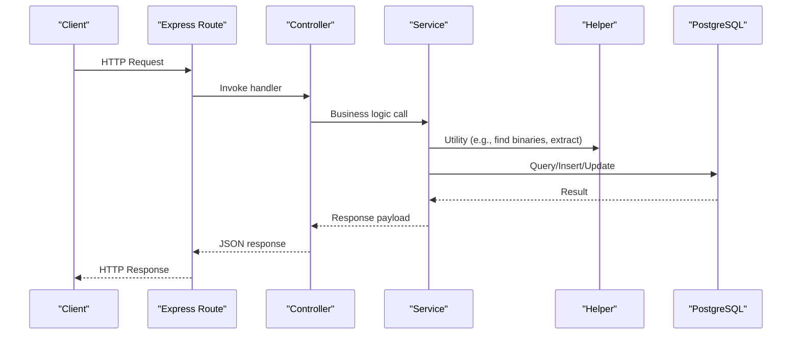
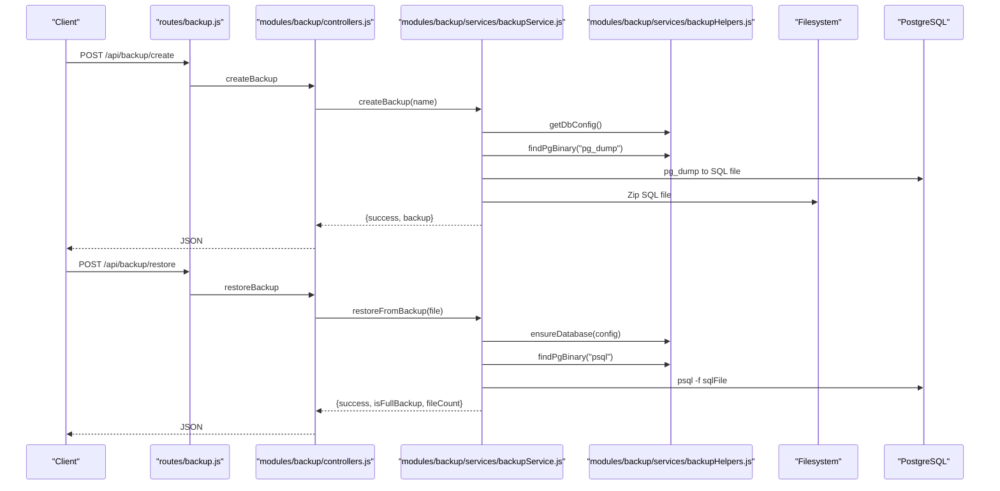
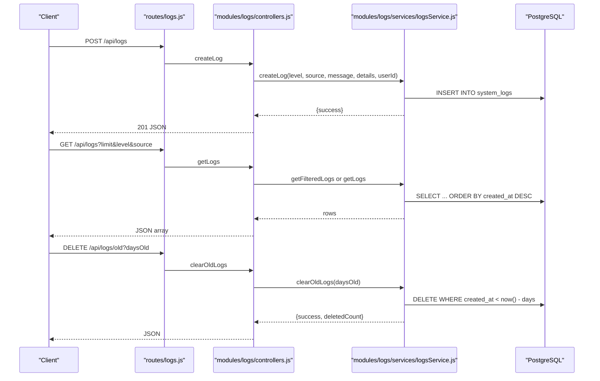
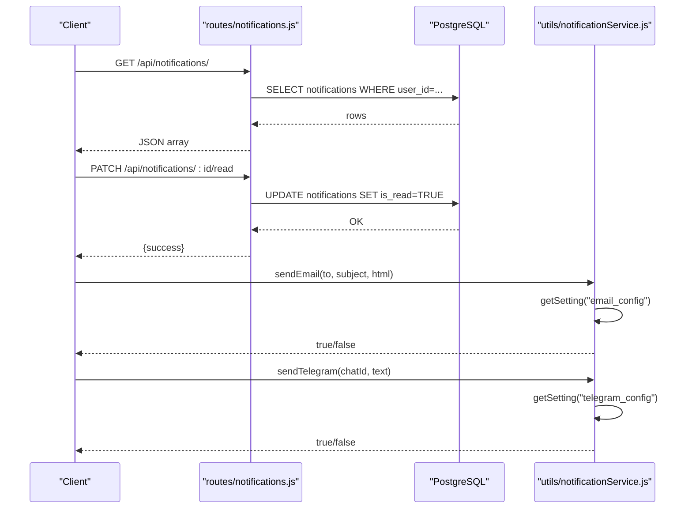
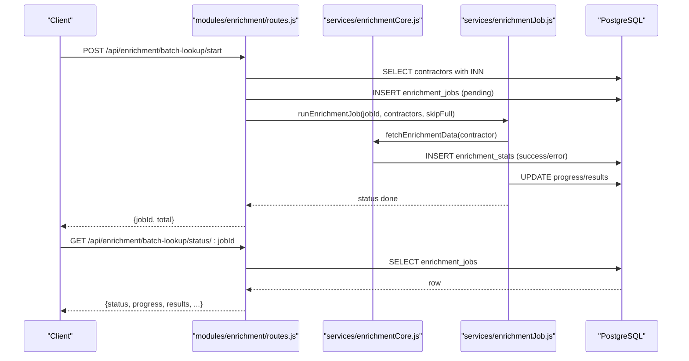
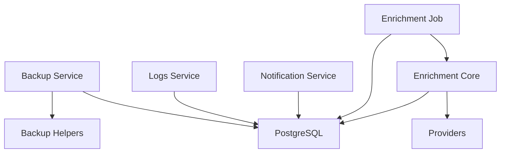

# Utility & Helper API

<cite>
**Referenced Files in This Document**
- [backup.js](file://backend/modules/backup/routes.js)
- [controllers.js](file://backend/modules/backup/controllers.js)
- [backupService.js](file://backend/modules/backup/services/backupService.js)
- [backupHelpers.js](file://backend/modules/backup/services/backupHelpers.js)
- [logs.js](file://backend/modules/logs/routes.js)
- [controllers.js](file://backend/modules/logs/controllers.js)
- [logsService.js](file://backend/modules/logs/services/logsService.js)
- [notifications.js](file://backend/modules/notifications/routes.js)
- [notificationService.js](file://backend/utils/notificationService.js)
- [enrichment.js](file://backend/modules/enrichment/routes.js)
- [routes.js](file://backend/modules/enrichment/routes.js)
- [enrichmentCore.js](file://backend/modules/enrichment/services/enrichmentCore.js)
- [enrichmentJob.js](file://backend/modules/enrichment/services/enrichmentJob.js)
- [create-backup.js](file://backend/scripts/create-backup.js)
</cite>

## Table of Contents
1. [Introduction](#introduction)
2. [Project Structure](#project-structure)
3. [Core Components](#core-components)
4. [Architecture Overview](#architecture-overview)
5. [Detailed Component Analysis](#detailed-component-analysis)
6. [Dependency Analysis](#dependency-analysis)
7. [Performance Considerations](#performance-considerations)
8. [Troubleshooting Guide](#troubleshooting-guide)
9. [Conclusion](#conclusion)
10. [Appendices](#appendices)

## Introduction
This document provides comprehensive API documentation for Titan CRM’s utility and helper endpoints focused on:
- Backup operations: creation, restoration, listing, deletion, and downloading
- Logging: ingestion, retrieval, filtering, and archival
- Notifications: user-centric notification management and delivery via email and Telegram
- Data enrichment: external provider integration for contractor data enrichment, batch jobs, and status tracking

It covers HTTP methods, URL patterns, request/response schemas, operational parameters, and integration patterns with external systems. It also includes guidance for backup and restore processes, log analysis workflows, notification templates, enrichment pipelines, monitoring, maintenance scheduling, and system health checks.

## Project Structure
The utility APIs are organized under dedicated modules and routes:
- Backup: routes and controllers under modules backup; helpers and service orchestration under services
- Logs: routes and controllers under modules logs; service layer for persistence and filtering
- Notifications: routes under notifications; delivery utilities under utils
- Enrichment: routes under modules enrichment; core orchestration and job runner under services

```mermaid
graph TB
subgraph "Backup Module"
BR["routes/backup.js"]
BC["modules/backup/controllers.js"]
BS["modules/backup/services/backupService.js"]
BH["modules/backup/services/backupHelpers.js"]
end
subgraph "Logs Module"
LR["routes/logs.js"]
LC["modules/logs/controllers.js"]
LS["modules/logs/services/logsService.js"]
end
subgraph "Notifications"
NR["routes/notifications.js"]
NS["utils/notificationService.js"]
end
subgraph "Enrichment Module"
ER["routes/enrichment.js"]
R["modules/enrichment/routes.js"]
EC["modules/enrichment/services/enrichmentCore.js"]
EJ["modules/enrichment/services/enrichmentJob.js"]
end
BR --> BC --> BS --> BH
LR --> LC --> LS
NR --> NS
ER --> R --> EC
R --> EJ
```

**Diagram sources**
- [backup.js:1-335](file://backend/modules/backup/routes.js#L1-L48)
- [controllers.js:1-105](file://backend/modules/backup/controllers.js#L1-L104)
- [backupService.js:1-362](file://backend/modules/backup/services/backupService.js#L1-L361)
- [backupHelpers.js:1-307](file://backend/modules/backup/services/backupHelpers.js#L1-L306)
- [logs.js:1-51](file://backend/modules/logs/routes.js#L1-L26)
- [controllers.js:1-70](file://backend/modules/logs/controllers.js#L1-L69)
- [logsService.js:1-107](file://backend/modules/logs/services/logsService.js#L1-L106)
- [notifications.js:1-81](file://backend/modules/notifications/routes.js#L1-L80)
- [notificationService.js:1-83](file://backend/utils/notificationService.js#L1-L82)
- [enrichment.js:1-3](file://backend/modules/enrichment/routes.js#L1-L3)
- [routes.js:1-387](file://backend/modules/enrichment/routes.js#L1-L386)
- [enrichmentCore.js:1-441](file://backend/modules/enrichment/services/enrichmentCore.js#L1-L428)
- [enrichmentJob.js:1-154](file://backend/modules/enrichment/services/enrichmentJob.js#L1-L153)

**Section sources**
- [backup.js:1-335](file://backend/modules/backup/routes.js#L1-L48)
- [controllers.js:1-105](file://backend/modules/backup/controllers.js#L1-L104)
- [backupService.js:1-362](file://backend/modules/backup/services/backupService.js#L1-L361)
- [backupHelpers.js:1-307](file://backend/modules/backup/services/backupHelpers.js#L1-L306)
- [logs.js:1-51](file://backend/modules/logs/routes.js#L1-L26)
- [controllers.js:1-70](file://backend/modules/logs/controllers.js#L1-L69)
- [logsService.js:1-107](file://backend/modules/logs/services/logsService.js#L1-L106)
- [notifications.js:1-81](file://backend/modules/notifications/routes.js#L1-L80)
- [notificationService.js:1-83](file://backend/utils/notificationService.js#L1-L82)
- [enrichment.js:1-3](file://backend/modules/enrichment/routes.js#L1-L3)
- [routes.js:1-387](file://backend/modules/enrichment/routes.js#L1-L386)
- [enrichmentCore.js:1-441](file://backend/modules/enrichment/services/enrichmentCore.js#L1-L428)
- [enrichmentJob.js:1-154](file://backend/modules/enrichment/services/enrichmentJob.js#L1-L153)

## Core Components
- Backup API: Creates database-only or full backups (database + project files), lists, deletes, downloads, and restores backups. Supports retries and database creation on demand.
- Logs API: Accepts structured log entries, retrieves recent logs, and clears old logs based on retention policy.
- Notifications API: Manages user notifications (fetch, mark read, mark all read, delete) and delivers via email and Telegram using system settings.
- Enrichment API: Provides contractor enrichment via external providers, supports single lookup, batch jobs, pause/resume/finish/reset, and maintains logs and statistics.

**Section sources**
- [backup.js:16-335](file://backend/modules/backup/routes.js#L1-L48)
- [controllers.js:10-104](file://backend/modules/backup/controllers.js#L10-L104)
- [backupService.js:57-361](file://backend/modules/backup/services/backupService.js#L57-L361)
- [backupHelpers.js:21-307](file://backend/modules/backup/services/backupHelpers.js#L21-L306)
- [logs.js:8-48](file://backend/modules/logs/routes.js#L1-L26)
- [controllers.js:10-63](file://backend/modules/logs/controllers.js#L10-L63)
- [logsService.js:10-99](file://backend/modules/logs/services/logsService.js#L10-L99)
- [notifications.js:7-81](file://backend/modules/notifications/routes.js#L7-L80)
- [notificationService.js:24-83](file://backend/utils/notificationService.js#L24-L82)
- [enrichment.js:1-3](file://backend/modules/enrichment/routes.js#L1-L3)
- [routes.js:20-387](file://backend/modules/enrichment/routes.js#L20-L386)
- [enrichmentCore.js:216-441](file://backend/modules/enrichment/services/enrichmentCore.js#L216-L428)
- [enrichmentJob.js:46-154](file://backend/modules/enrichment/services/enrichmentJob.js#L46-L153)

## Architecture Overview
The APIs follow a layered pattern:
- Routes define HTTP endpoints and bind to controller handlers
- Controllers validate inputs and delegate to services
- Services encapsulate business logic and interact with helpers and persistence
- Helpers provide cross-cutting utilities (binary discovery, extraction, database creation)
- Persistence uses PostgreSQL tables for logs, enrichment logs/statistics/jobs, and notifications

**Diagram sources**
- [backup.js:54-160](file://backend/modules/backup/routes.js#L1-L48)
- [controllers.js:10-56](file://backend/modules/backup/controllers.js#L10-L56)
- [backupService.js:57-297](file://backend/modules/backup/services/backupService.js#L57-L297)
- [backupHelpers.js:21-297](file://backend/modules/backup/services/backupHelpers.js#L21-L297)
- [logs.js:8-48](file://backend/modules/logs/routes.js#L1-L26)
- [controllers.js:10-47](file://backend/modules/logs/controllers.js#L10-L47)
- [logsService.js:10-99](file://backend/modules/logs/services/logsService.js#L10-L99)
- [notifications.js:7-81](file://backend/modules/notifications/routes.js#L7-L80)
- [notificationService.js:24-83](file://backend/utils/notificationService.js#L24-L82)
- [routes.js:20-387](file://backend/modules/enrichment/routes.js#L20-L386)
- [enrichmentCore.js:216-441](file://backend/modules/enrichment/services/enrichmentCore.js#L216-L428)
- [enrichmentJob.js:46-154](file://backend/modules/enrichment/services/enrichmentJob.js#L46-L153)

## Detailed Component Analysis

### Backup API
Endpoints:
- POST /api/backup/create
  - Purpose: Create a database-only backup as a compressed ZIP
  - Request: Optional name (string)
  - Response: success, message, backup (name, file, size, created)
  - Notes: Uses pg_dump with clean/idempotent flags; archives SQL and returns ZIP path
- POST /api/backup/full
  - Purpose: Create a full backup including database and project files
  - Request: Optional name (string)
  - Response: success, message, backup (name, file, size, created, type)
  - Notes: Archives database.sql at root and project files excluding configured ignore patterns
- POST /api/backup/restore
  - Purpose: Restore database from backup; optionally restores project files for full backups
  - Request: file (string, required)
  - Response: success, message, isFullBackup, fileCount
  - Notes: Supports retries on access denial; ensures database exists before restore
- GET /api/backup/list
  - Purpose: List available backups
  - Response: array of objects (name, file, size, created)
- DELETE /api/backup/:file
  - Purpose: Delete a backup file
  - Response: success, message
- GET /api/backup/download/:file
  - Purpose: Download a backup file
  - Response: file stream

Operational parameters and behaviors:
- Compression: ZIP with maximum compression level
- Encryption: Not implemented in code; consider external encryption before upload
- Verification: Restore process validates database existence and runs pg_restore via psql
- Retention: No built-in retention policy; manage via external automation or file system policies
- Binary resolution: Searches environment variables, PATH, and standard directories for pg_dump/psql

**Diagram sources**
- [backup.js:54-160](file://backend/modules/backup/routes.js#L1-L48)
- [controllers.js:10-56](file://backend/modules/backup/controllers.js#L10-L56)
- [backupService.js:57-297](file://backend/modules/backup/services/backupService.js#L57-L297)
- [backupHelpers.js:21-297](file://backend/modules/backup/services/backupHelpers.js#L21-L297)

**Section sources**
- [backup.js:54-160](file://backend/modules/backup/routes.js#L1-L48)
- [controllers.js:10-56](file://backend/modules/backup/controllers.js#L10-L56)
- [backupService.js:57-297](file://backend/modules/backup/services/backupService.js#L57-L297)
- [backupHelpers.js:21-297](file://backend/modules/backup/services/backupHelpers.js#L21-L297)

### Logs API
Endpoints:
- POST /api/logs
  - Purpose: Submit a log entry
  - Request: level (string, default info), source (string, default frontend), message (required), details (JSON), userId (optional)
  - Response: success (201 on acceptance)
  - Notes: Writes to system_logs; also logs to console; avoids infinite loops by returning 200 on internal failures
- GET /api/logs
  - Purpose: Retrieve recent logs
  - Query: limit (default 100), level (optional), source (optional)
  - Response: array of log records ordered by created_at desc
- DELETE /api/logs/old
  - Purpose: Clear logs older than N days
  - Query: daysOld (default 30)
  - Response: success, deletedCount

Retention and filtering:
- Retention: Controlled via daysOld parameter; default 30 days
- Filtering: level and source filters supported

**Diagram sources**
- [logs.js:8-48](file://backend/modules/logs/routes.js#L1-L26)
- [controllers.js:10-63](file://backend/modules/logs/controllers.js#L10-L63)
- [logsService.js:10-99](file://backend/modules/logs/services/logsService.js#L10-L99)

**Section sources**
- [logs.js:8-48](file://backend/modules/logs/routes.js#L1-L26)
- [controllers.js:10-63](file://backend/modules/logs/controllers.js#L10-L63)
- [logsService.js:10-99](file://backend/modules/logs/services/logsService.js#L10-L99)

### Notifications API
Endpoints:
- GET /api/notifications/
  - Purpose: Fetch user notifications
  - Headers: x-user-id (required)
  - Response: array of notifications ordered by created_at desc (limit 50)
- PATCH /api/notifications/:id/read
  - Purpose: Mark a notification as read
  - Headers: x-user-id (required)
  - Response: success
- PATCH /api/notifications/read-all
  - Purpose: Mark all unread notifications as read
  - Headers: x-user-id (required)
  - Response: success
- DELETE /api/notifications/:id
  - Purpose: Delete a notification
  - Headers: x-user-id (required)
  - Response: success

Delivery channels:
- Email: Uses system_settings email_config (host, port, secure, user, password, from)
- Telegram: Uses system_settings telegram_config (botToken, enabled) and Telegram Bot API

**Diagram sources**
- [notifications.js:7-81](file://backend/modules/notifications/routes.js#L7-L80)
- [notificationService.js:24-83](file://backend/utils/notificationService.js#L24-L82)

**Section sources**
- [notifications.js:7-81](file://backend/modules/notifications/routes.js#L7-L80)
- [notificationService.js:24-83](file://backend/utils/notificationService.js#L24-L82)

### Enrichment API
Endpoints:
- GET /api/enrichment
  - Purpose: API info
  - Response: message
- POST /api/enrichment/search
  - Purpose: Search via provider(s) by query string
  - Request: query (required)
  - Response: provider result or error
- GET /api/enrichment/fields
  - Purpose: List enrichable fields with labels
  - Response: array of {key, label}
- GET /api/enrichment/lookup-by-inn/:inn
  - Purpose: Lookup contractor by INN
  - Path param: inn (10 or 12 digits)
  - Response: {source, data} or error
- GET /api/enrichment/lookup/:contractorId
  - Purpose: Compare fetched vs current values for a contractor
  - Path param: contractorId
  - Response: {source, diff, raw}
- POST /api/enrichment/apply/:contractorId
  - Purpose: Apply selected fields to contractor
  - Path param: contractorId
  - Request: fields (array), data (object), source (optional)
  - Response: {success, updated, fields}
- POST /api/enrichment/batch-lookup/start
  - Purpose: Start batch enrichment job
  - Request: ids (optional array), skipFull (boolean, default true)
  - Response: {jobId, total}
- POST /api/enrichment/batch-lookup/stop
  - Purpose: Pause current batch job
  - Response: {ok}
- POST /api/enrichment/batch-lookup/finish
  - Purpose: Mark current batch job as finished
  - Response: {ok, jobId}
- POST /api/enrichment/batch-lookup/continue
  - Purpose: Resume paused batch job
  - Request: skipFull (boolean)
  - Response: {jobId, total, progress}
- POST /api/enrichment/batch-lookup/reset
  - Purpose: Force reset running/pending/paused jobs
  - Response: {ok}
- GET /api/enrichment/batch-lookup/status/:jobId
  - Purpose: Get batch job status
  - Response: {status, progress, total, skipCount, currentName, results, error, startedAt, finishedAt}
- GET /api/enrichment/batch-lookup/active
  - Purpose: Get latest active job
  - Response: latest job summary or null
- POST /api/enrichment/batch-apply
  - Purpose: Apply batch results to contractors
  - Request: items (array of {contractorId, data, fields, source})
  - Response: {applied, errors}
- GET /api/enrichment/log/:contractorId
  - Purpose: View enrichment log for contractor
  - Response: array of log entries

Provider integration and caching:
- Providers: Priority configurable via module settings; fallback to egrul.nalog.ru
- Caching: TTL-based cache for INN lookups; cache invalidation handled automatically
- Derived fields: Status, legal entity type/form, tax regime resolved from enriched data
- Batch job controls: Start, pause, resume, finish, reset; progress tracked per contractor

**Diagram sources**
- [routes.js:157-323](file://backend/modules/enrichment/routes.js#L157-L323)
- [enrichmentCore.js:216-309](file://backend/modules/enrichment/services/enrichmentCore.js#L216-L309)
- [enrichmentJob.js:46-151](file://backend/modules/enrichment/services/enrichmentJob.js#L46-L151)

**Section sources**
- [routes.js:20-387](file://backend/modules/enrichment/routes.js#L20-L386)
- [enrichmentCore.js:216-441](file://backend/modules/enrichment/services/enrichmentCore.js#L216-L428)
- [enrichmentJob.js:46-154](file://backend/modules/enrichment/services/enrichmentJob.js#L46-L153)

## Dependency Analysis
- Backup depends on:
  - PostgreSQL binaries discovered via helpers
  - Filesystem for ZIP creation and extraction
  - Database creation helper for new server restores
- Logs depends on:
  - PostgreSQL system_logs table
  - Console logger for immediate visibility
- Notifications depends on:
  - System settings for channel credentials
  - External services (SMTP, Telegram Bot API)
- Enrichment depends on:
  - Provider modules (DaData, api-fns.ru, egrul.nalog.ru)
  - Module settings for API keys and priorities
  - PostgreSQL for cache, logs, stats, and jobs

**Diagram sources**
- [backupService.js:1-362](file://backend/modules/backup/services/backupService.js#L1-L361)
- [backupHelpers.js:1-307](file://backend/modules/backup/services/backupHelpers.js#L1-L306)
- [logsService.js:1-107](file://backend/modules/logs/services/logsService.js#L1-L106)
- [notificationService.js:1-83](file://backend/utils/notificationService.js#L1-L82)
- [enrichmentCore.js:1-441](file://backend/modules/enrichment/services/enrichmentCore.js#L1-L428)
- [enrichmentJob.js:1-154](file://backend/modules/enrichment/services/enrichmentJob.js#L1-L153)

**Section sources**
- [backupService.js:1-362](file://backend/modules/backup/services/backupService.js#L1-L361)
- [backupHelpers.js:1-307](file://backend/modules/backup/services/backupHelpers.js#L1-L306)
- [logsService.js:1-107](file://backend/modules/logs/services/logsService.js#L1-L106)
- [notificationService.js:1-83](file://backend/utils/notificationService.js#L1-L82)
- [enrichmentCore.js:1-441](file://backend/modules/enrichment/services/enrichmentCore.js#L1-L428)
- [enrichmentJob.js:1-154](file://backend/modules/enrichment/services/enrichmentJob.js#L1-L153)

## Performance Considerations
- Backup:
  - Full backups are I/O intensive; schedule during off-hours
  - Compression level is maximum; consider balancing speed vs size
  - Extraction streams files; monitor disk throughput
- Logs:
  - Use filtering (level/source) and pagination (limit) to reduce load
  - Schedule periodic cleanup (DELETE /api/logs/old) to maintain manageable sizes
- Enrichment:
  - Batch jobs include throttling; adjust delays if providers throttle
  - Use skipFull to avoid redundant lookups for already-enriched or complete records
  - Cache reduces repeated provider calls; tune TTL via module settings

[No sources needed since this section provides general guidance]

## Troubleshooting Guide
- Backup creation fails:
  - Verify PostgreSQL binary paths and environment variables
  - Ensure sufficient disk space and permissions
  - Check pg_dump/pg_restore availability and connectivity
- Restore fails or “Access is denied”:
  - Retry mechanism is built-in; ensure database is reachable and credentials are correct
  - Confirm database exists or allow automatic creation
- Logs not appearing:
  - Ensure message is present; empty message leads to client-side rejection
  - Check system_logs table schema and permissions
- Notifications not delivered:
  - Validate email_config and telegram_config in system_settings
  - Check SMTP credentials and network access; verify Telegram bot token and chatId
- Enrichment returns no data:
  - Confirm INN validity and provider API keys
  - Check cache TTL and provider quotas
  - Inspect enrichment_stats and enrichment_log for errors

**Section sources**
- [backupHelpers.js:21-65](file://backend/modules/backup/services/backupHelpers.js#L21-L65)
- [backupService.js:214-297](file://backend/modules/backup/services/backupService.js#L214-L297)
- [logs.js:14-37](file://backend/modules/logs/routes.js#L1-L26)
- [notificationService.js:24-83](file://backend/utils/notificationService.js#L24-L82)
- [enrichmentCore.js:216-309](file://backend/modules/enrichment/services/enrichmentCore.js#L216-L309)

## Conclusion
Titan CRM’s utility and helper APIs provide robust capabilities for backup, logging, notifications, and contractor data enrichment. The APIs are designed with operational safety (idempotent database dumps, retries, cache), scalability (batch enrichment, throttling), and extensibility (provider integrations, channel delivery). Proper configuration of system settings, retention policies, and monitoring will ensure reliable operations across environments.

[No sources needed since this section summarizes without analyzing specific files]

## Appendices

### API Reference Tables

- Backup API
  - POST /api/backup/create
    - Request: name (string)
    - Response: success, message, backup (name, file, size, created)
  - POST /api/backup/full
    - Request: name (string)
    - Response: success, message, backup (name, file, size, created, type)
  - POST /api/backup/restore
    - Request: file (string)
    - Response: success, message, isFullBackup, fileCount
  - GET /api/backup/list
    - Response: array of {name, file, size, created}
  - DELETE /api/backup/:file
    - Response: success, message
  - GET /api/backup/download/:file
    - Response: file stream

- Logs API
  - POST /api/logs
    - Request: level, source, message (required), details, userId
    - Response: success
  - GET /api/logs
    - Query: limit, level, source
    - Response: array of logs
  - DELETE /api/logs/old
    - Query: daysOld
    - Response: success, deletedCount

- Notifications API
  - GET /api/notifications/
    - Header: x-user-id
    - Response: array of notifications
  - PATCH /api/notifications/:id/read
    - Header: x-user-id
    - Response: success
  - PATCH /api/notifications/read-all
    - Header: x-user-id
    - Response: success
  - DELETE /api/notifications/:id
    - Header: x-user-id
    - Response: success

- Enrichment API
  - GET /api/enrichment
    - Response: message
  - POST /api/enrichment/search
    - Request: query
    - Response: provider result or error
  - GET /api/enrichment/fields
    - Response: array of {key, label}
  - GET /api/enrichment/lookup-by-inn/:inn
    - Response: {source, data} or error
  - GET /api/enrichment/lookup/:contractorId
    - Response: {source, diff, raw}
  - POST /api/enrichment/apply/:contractorId
    - Request: fields, data, source
    - Response: {success, updated, fields}
  - POST /api/enrichment/batch-lookup/start
    - Request: ids, skipFull
    - Response: {jobId, total}
  - POST /api/enrichment/batch-lookup/stop
    - Response: {ok}
  - POST /api/enrichment/batch-lookup/finish
    - Response: {ok, jobId}
  - POST /api/enrichment/batch-lookup/continue
    - Request: skipFull
    - Response: {jobId, total, progress}
  - POST /api/enrichment/batch-lookup/reset
    - Response: {ok}
  - GET /api/enrichment/batch-lookup/status/:jobId
    - Response: {status, progress, total, skipCount, currentName, results, error, startedAt, finishedAt}
  - GET /api/enrichment/batch-lookup/active
    - Response: latest job summary or null
  - POST /api/enrichment/batch-apply
    - Request: items
    - Response: {applied, errors}
  - GET /api/enrichment/log/:contractorId
    - Response: array of log entries

### Operational Workflows

- Backup and Restore
  - Creation: Use POST /api/backup/create for database-only or POST /api/backup/full for full backups
  - Restoration: Use POST /api/backup/restore with the chosen file; supports retries and automatic database creation
  - Maintenance: Periodically list and delete old backups; schedule full backups during low activity

- Log Management
  - Ingestion: POST /api/logs with structured entries
  - Analysis: Filter by level/source and paginate via limit
  - Cleanup: DELETE /api/logs/old with daysOld to enforce retention

- Notification Delivery
  - Templates: Compose HTML for email and plain text for Telegram
  - Channels: Configure email_config and telegram_config; delivery handled by notificationService

- Enrichment Pipeline
  - Single lookup: GET /api/enrichment/lookup/:contractorId or GET /api/enrichment/lookup-by-inn/:inn
  - Batch job: POST /api/enrichment/batch-lookup/start; monitor with status endpoints; apply results via POST /api/enrichment/batch-apply

- Monitoring and Health Checks
  - Monitor provider quotas and cache effectiveness
  - Track enrichment_jobs progress and errors
  - Observe system_logs for anomalies and errors

**Section sources**
- [backup.js:54-160](file://backend/modules/backup/routes.js#L1-L48)
- [controllers.js:10-104](file://backend/modules/backup/controllers.js#L10-L104)
- [backupService.js:57-361](file://backend/modules/backup/services/backupService.js#L57-L361)
- [logs.js:8-48](file://backend/modules/logs/routes.js#L1-L26)
- [controllers.js:10-63](file://backend/modules/logs/controllers.js#L10-L63)
- [logsService.js:10-99](file://backend/modules/logs/services/logsService.js#L10-L99)
- [notifications.js:7-81](file://backend/modules/notifications/routes.js#L7-L80)
- [notificationService.js:24-83](file://backend/utils/notificationService.js#L24-L82)
- [routes.js:20-387](file://backend/modules/enrichment/routes.js#L20-L386)
- [enrichmentCore.js:216-441](file://backend/modules/enrichment/services/enrichmentCore.js#L216-L428)
- [enrichmentJob.js:46-154](file://backend/modules/enrichment/services/enrichmentJob.js#L46-L153)