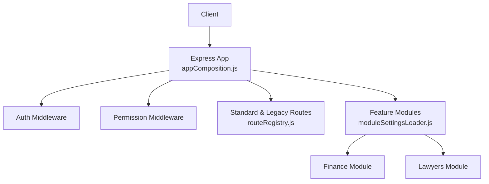
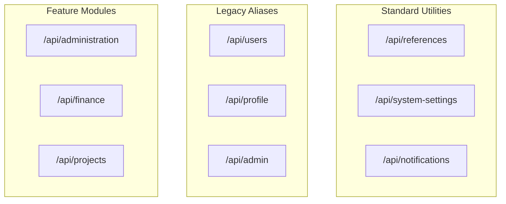
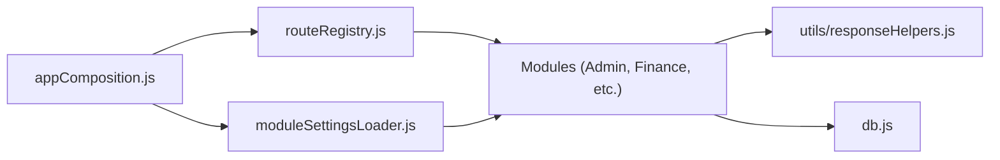

# API Endpoints

<cite>
**Referenced Files in This Document**
- [backend/index.js](file://backend/index.js)
- [backend/utils/appComposition.js](file://backend/utils/appComposition.js)
- [backend/utils/routeRegistry.js](file://backend/utils/routeRegistry.js)
- [backend/utils/moduleSettingsLoader.js](file://backend/utils/moduleSettingsLoader.js)
- [backend/db.js](file://backend/db.js)
- [backend/middleware/auth.js](file://backend/middleware/auth.js)
- [backend/middleware/checkPermission.js](file://backend/middleware/checkPermission.js)
- [backend/utils/responseHelpers.js](file://backend/utils/responseHelpers.js)
- [backend/modules/administration/index.js](file://backend/modules/administration/index.js)
- [backend/modules/projects/index.js](file://backend/modules/projects/index.js)
- [backend/modules/finance/index.js](file://backend/modules/finance/index.js)
</cite>

## Table of Contents
1. [Introduction](#introduction)
2. [Project Structure](#project-structure)
3. [Core Components](#core-components)
4. [Architecture Overview](#architecture-overview)
5. [Detailed Component Analysis](#detailed-component-analysis)
6. [Dependency Analysis](#dependency-analysis)
7. [Performance Considerations](#performance-considerations)
8. [Troubleshooting Guide](#troubleshooting-guide)
9. [Conclusion](#conclusion)

## Introduction
This document provides comprehensive API documentation for the Titan CRM backend. It covers the modular routing strategy, authentication and authorization mechanisms, standardized response formatting, and the dynamic registration of feature-specific endpoints.

## Project Structure
The API is built using Express.js with a highly modularized structure. Routes are registered through a combination of static registries for core/legacy endpoints and a dynamic loader for feature modules.
- **Entry Point**: `backend/index.js` (Orchestration).
- **Composition**: `backend/utils/appComposition.js` (Middleware and Route Mounting).
- **Static Registry**: `backend/utils/routeRegistry.js` (Standard and Legacy routes).
- **Dynamic Loader**: `backend/utils/moduleSettingsLoader.js` (Feature modules from `backend/modules/`).

**Section sources**
- [backend/index.js:1-40](file://backend/index.js#L1-L39)
- [backend/utils/appComposition.js:1-125](file://backend/utils/appComposition.js#L1-L125)
- [backend/utils/routeRegistry.js:1-45](file://backend/utils/routeRegistry.js#L1-L45)
- [backend/utils/moduleSettingsLoader.js:296-345](file://backend/utils/moduleSettingsLoader.js#L296-L345)

## Core Components
- **Authentication**: JWT-based bearer tokens with optional mock support for dev/test.
- **Authorization**: RBAC with wildcard support (e.g., `administration.*`) and logic modes (any/all).
- **Standardized Responses**: Centralized helpers for consistent HTTP status codes and JSON payloads.
- **Route Aliasing**: Legacy aliases ensure frontend stability during module refactoring.
- **File Serving**: Dedicated endpoint for legal cases with backward compatibility fallbacks.

**Section sources**
- [backend/middleware/auth.js:1-82](file://backend/middleware/auth.js#L1-L81)
- [backend/middleware/checkPermission.js:1-130](file://backend/middleware/checkPermission.js#L1-L129)
- [backend/utils/responseHelpers.js:1-136](file://backend/utils/responseHelpers.js#L1-L136)
- [backend/utils/routeRegistry.js:1-45](file://backend/utils/routeRegistry.js#L1-L45)
- [backend/utils/appComposition.js:31-50](file://backend/utils/appComposition.js#L31-L50)

## Architecture Overview
All API endpoints are prefixed with `/api`. The system distinguishes between:
1. **Standard Routes**: Common utilities (references, settings, notifications).
2. **Legacy Aliases**: Direct mapping for backward compatibility (e.g., `/api/users` -> `/api/administration/users`).
3. **Modular Routes**: Domain-specific endpoints mounted dynamically based on module configuration (e.g., `/api/finance`, `/api/projects`).

**Section sources**
- [backend/utils/routeRegistry.js:1-45](file://backend/utils/routeRegistry.js#L1-L45)
- [backend/utils/moduleSettingsLoader.js:296-345](file://backend/utils/moduleSettingsLoader.js#L296-L345)

## Detailed Component Analysis

### Authentication & Authorization
- **Auth Header**: `Authorization: Bearer <token>`
- **Logic**:
  - `auth.js` verifies the JWT signature and injects `req.user`.
  - `checkPermission.js` queries the database for user/role permissions and evaluates wildcard matches.

**Section sources**
- [backend/middleware/auth.js:1-82](file://backend/middleware/auth.js#L1-L81)
- [backend/middleware/checkPermission.js:1-130](file://backend/middleware/checkPermission.js#L1-L129)

### File Access Strategy
Endpoints under `/api/files/legal-cases/:filename`:
- Tries `uploads/legal-cases/`.
- Fallback to `uploads/documents/`.
- Resolves issues with renamed folders during refactoring.

**Section sources**
- [backend/utils/appComposition.js:31-50](file://backend/utils/appComposition.js#L31-L50)

### Administration Module
Prefix: `/api/administration`
- Sub-routers for Users, Roles, Permissions, Employees, Org Structure, and Company settings.
- Legacy Alias: `/api/users` redirects to `/api/administration/users`.

**Section sources**
- [backend/modules/administration/index.js:1-33](file://backend/modules/administration/index.js#L1-L33)
- [backend/utils/routeRegistry.js:5-13](file://backend/utils/routeRegistry.js#L5-L13)

### Projects & Finance Modules
Prefixes: `/api/projects`, `/api/finance`
- Both are registered via `moduleSettingsLoader`.
- Feature domain isolation ensures that schema and logic changes in one module don't break others.

**Section sources**
- [backend/modules/projects/index.js:1-14](file://backend/modules/projects/index.js#L1-L13)
- [backend/modules/finance/index.js:1-55](file://backend/modules/finance/index.js#L1-L55)

## Dependency Analysis
The API depends on the composition layer for mounting and the utility layer for helpers and persistence.

**Section sources**
- [backend/utils/appComposition.js:1-125](file://backend/utils/appComposition.js#L1-L125)

## Performance Considerations
- **Body Parsing**: Limited to 10MB to prevent memory exhaustion.
- **Dynamic Mounting**: Module settings are cached by the loader to avoid repeated database lookups.
- **DB Normalization**: Automatic transformation to `camelCase` in `db.js` ensures JS-friendly payloads without extra overhead in controllers.

**Section sources**
- [backend/utils/appComposition.js:25-30](file://backend/utils/appComposition.js#L25-L30)
- [backend/db.js:1-68](file://backend/db.js#L1-L68)

## Troubleshooting Guide
- **401 Unauthorized**: Missing or invalid `Authorization` header.
- **403 Forbidden**: User lacks required permission string or wildcard match.
- **404 Not Found on New Route**: Ensure the module is registered in the `modules` table and the router is correctly exported.

**Section sources**
- [backend/middleware/auth.js:24-53](file://backend/middleware/auth.js#L24-L53)
- [backend/middleware/checkPermission.js:69-116](file://backend/middleware/checkPermission.js#L69-L116)

## Conclusion
The Titan CRM API architecture provides a secure and flexible foundation for feature expansion. By leveraging both static and dynamic routing, it maintains backward compatibility while allowing for granular domain isolation. Standardized responses and robust middleware ensure a consistent and predictable interface for the frontend.