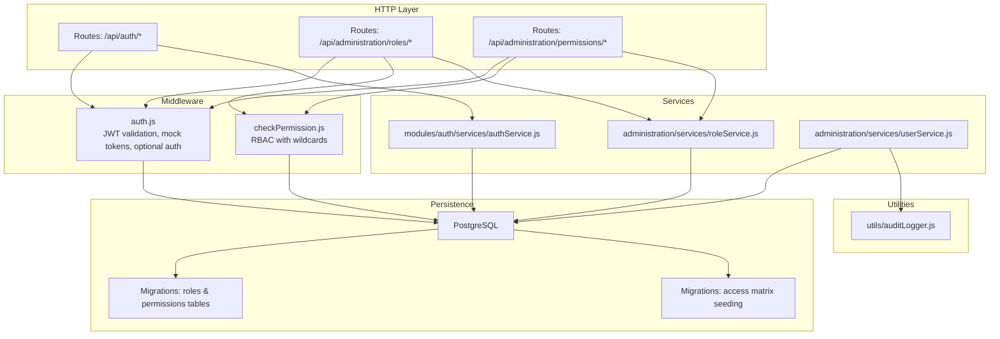
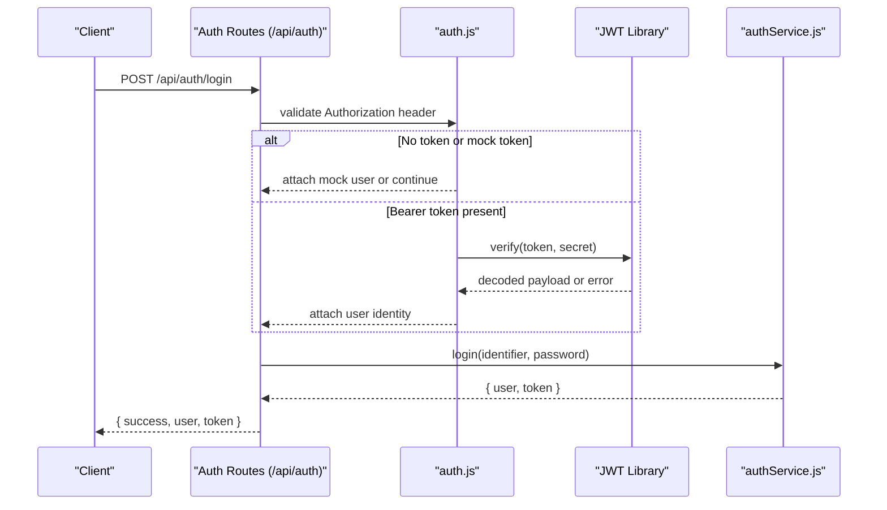
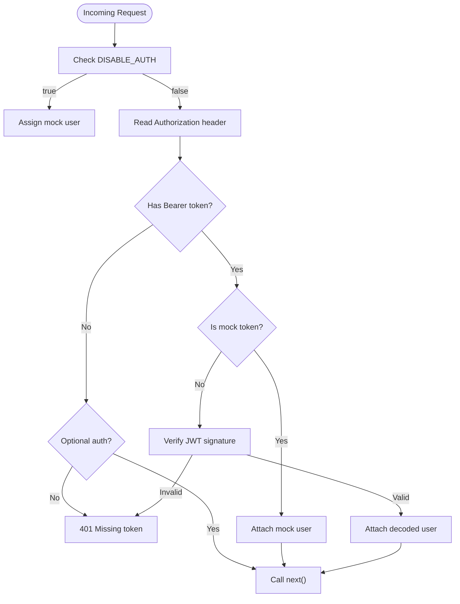
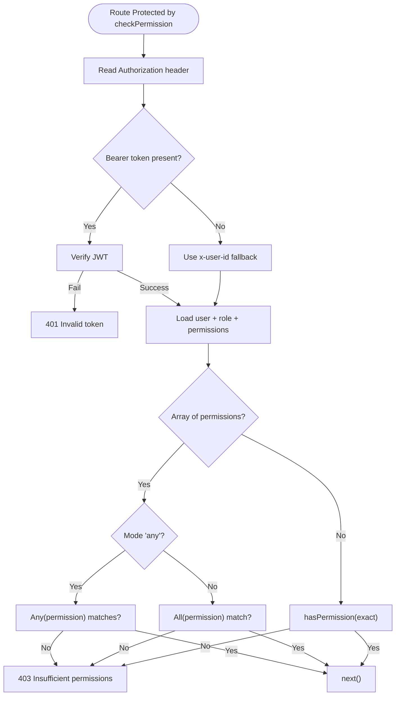
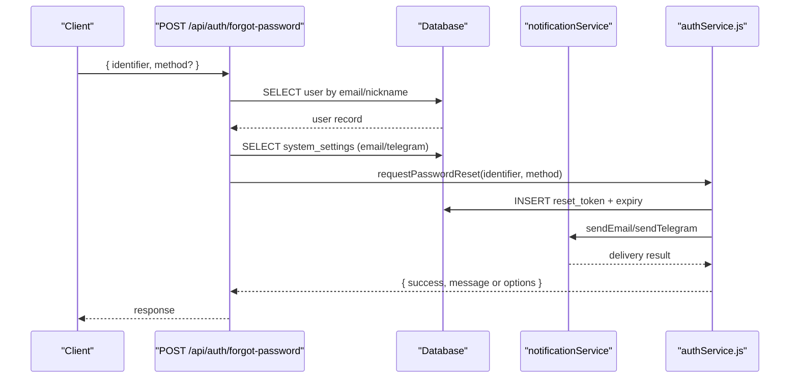
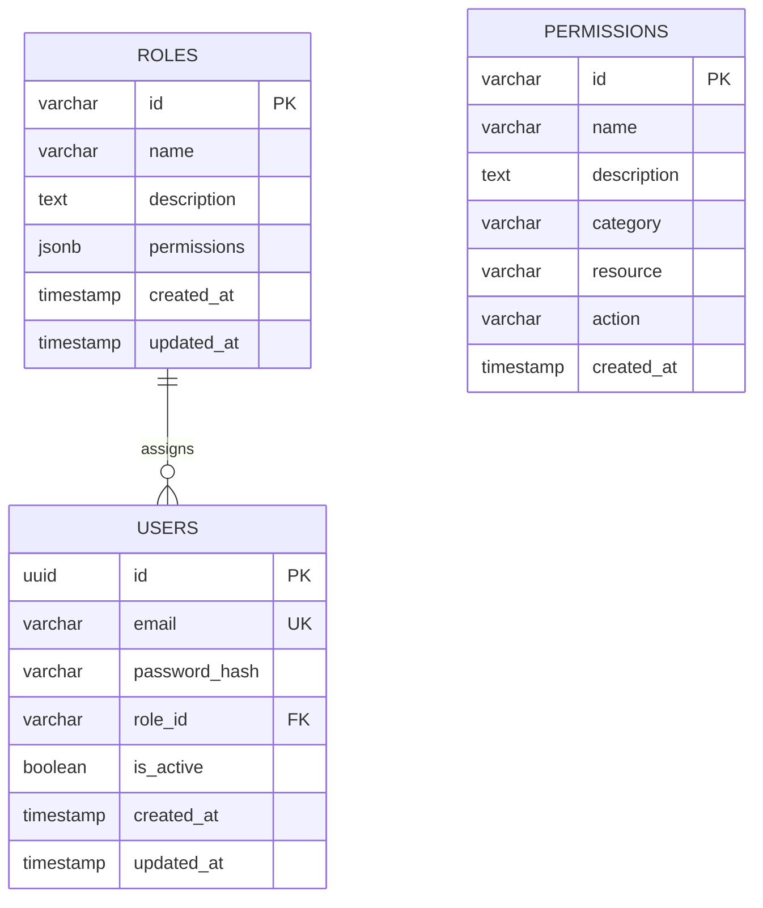
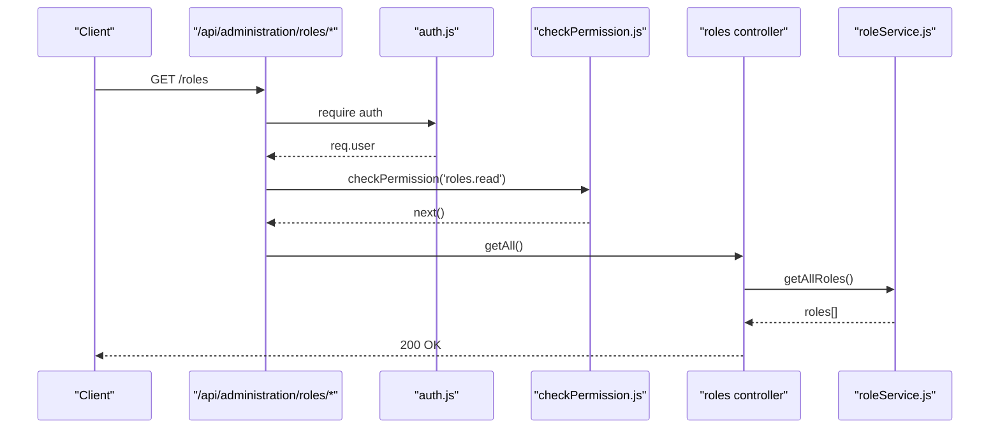
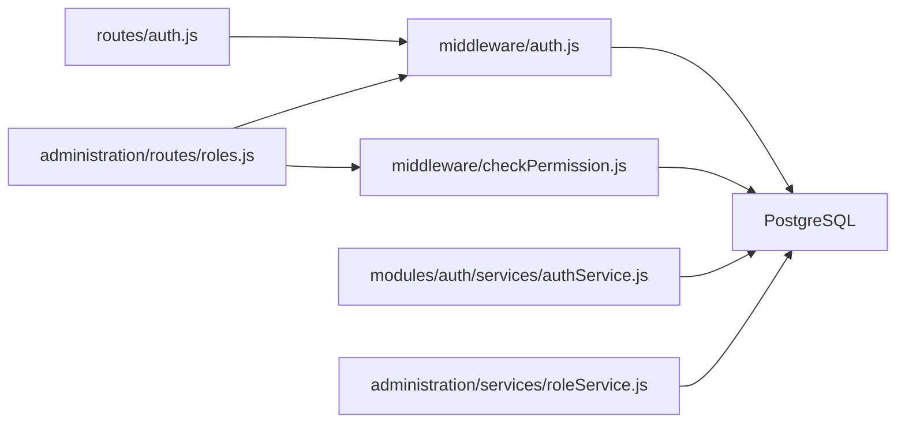

# Authentication & Authorization

<cite>
**Referenced Files in This Document**
- [backend/middleware/auth.js](file://backend/middleware/auth.js)
- [backend/middleware/checkPermission.js](file://backend/middleware/checkPermission.js)
- [backend/modules/auth/services/authService.js](file://backend/modules/auth/services/authService.js)
- [backend/routes/auth.js](file://backend/modules/auth/routes.js)
- [backend/modules/administration/services/roleService.js](file://backend/modules/administration/services/roleService.js)
- [backend/modules/administration/routes/roles.js](file://backend/modules/administration/routes/roles.js)
- [backend/modules/administration/routes/permissions.js](file://backend/modules/administration/routes/permissions.js)
- [backend/modules/administration/controllers/roles.js](file://backend/modules/administration/controllers/roles.js)
- [backend/modules/administration/controllers/permissions.js](file://backend/modules/administration/controllers/permissions.js)
- [backend/modules/administration/services/userService.js](file://backend/modules/administration/services/userService.js)
- [backend/migrations/26_create_roles_and_permissions_tables.md](file://backend/migrations/26_create_roles_and_permissions_tables.md)
- [backend/migrations/29_seed_access_matrix.md](file://backend/migrations/29_seed_access_matrix.md)
- [backend/utils/auditLogger.js](file://backend/utils/auditLogger.js)
</cite>

## Table of Contents
1. [Introduction](#introduction)
2. [Project Structure](#project-structure)
3. [Core Components](#core-components)
4. [Architecture Overview](#architecture-overview)
5. [Detailed Component Analysis](#detailed-component-analysis)
6. [Dependency Analysis](#dependency-analysis)
7. [Performance Considerations](#performance-considerations)
8. [Troubleshooting Guide](#troubleshooting-guide)
9. [Conclusion](#conclusion)
10. [Appendices](#appendices)

## Introduction
This document explains the authentication and authorization system for the Titan CRM backend. It covers JWT-based authentication, token generation and validation, sessionless user identity propagation, role-based access control (RBAC), permission matrix implementation, security middleware, and audit logging. It also provides practical guidance for extending the permission system, implementing custom authentication strategies, and handling security exceptions.

## Project Structure
The authentication and authorization features are implemented across middleware, routes, services, and database migrations. Key areas:
- Authentication middleware validates JWT tokens and injects user identity into requests.
- Permission middleware checks user permissions against a flexible matrix supporting exact matches and wildcards.
- Auth routes and services handle login, password reset, and token issuance.
- Administration module manages roles and permissions via dedicated routes and services.
- Audit logging captures user actions for compliance and monitoring.

**Diagram sources**
- [backend/routes/auth.js:1-246](file://backend/modules/auth/routes.js#L1-L33)
- [backend/middleware/auth.js:1-82](file://backend/middleware/auth.js#L1-L81)
- [backend/middleware/checkPermission.js:1-130](file://backend/middleware/checkPermission.js#L1-L129)
- [backend/modules/auth/services/authService.js:1-233](file://backend/modules/auth/services/authService.js#L1-L232)
- [backend/modules/administration/routes/roles.js:1-20](file://backend/modules/administration/routes/roles.js#L1-L19)
- [backend/modules/administration/routes/permissions.js:1-17](file://backend/modules/administration/routes/permissions.js#L1-L16)
- [backend/modules/administration/services/roleService.js:1-109](file://backend/modules/administration/services/roleService.js#L1-L108)
- [backend/modules/administration/services/userService.js:1-554](file://backend/modules/administration/services/userService.js#L1-L553)
- [backend/migrations/26_create_roles_and_permissions_tables.md:1-61](file://backend/migrations/26_create_roles_and_permissions_tables.md#L1-L60)
- [backend/migrations/29_seed_access_matrix.md:1-207](file://backend/migrations/29_seed_access_matrix.md#L1-L207)
- [backend/utils/auditLogger.js:1-52](file://backend/utils/auditLogger.js#L1-L51)

**Section sources**
- [backend/middleware/auth.js:1-82](file://backend/middleware/auth.js#L1-L81)
- [backend/middleware/checkPermission.js:1-130](file://backend/middleware/checkPermission.js#L1-L129)
- [backend/modules/auth/services/authService.js:1-233](file://backend/modules/auth/services/authService.js#L1-L232)
- [backend/routes/auth.js:1-246](file://backend/modules/auth/routes.js#L1-L33)
- [backend/modules/administration/services/roleService.js:1-109](file://backend/modules/administration/services/roleService.js#L1-L108)
- [backend/modules/administration/routes/roles.js:1-20](file://backend/modules/administration/routes/roles.js#L1-L19)
- [backend/modules/administration/routes/permissions.js:1-17](file://backend/modules/administration/routes/permissions.js#L1-L16)
- [backend/modules/administration/controllers/roles.js:1-56](file://backend/modules/administration/controllers/roles.js#L1-L55)
- [backend/modules/administration/controllers/permissions.js:1-21](file://backend/modules/administration/controllers/permissions.js#L1-L20)
- [backend/modules/administration/services/userService.js:1-554](file://backend/modules/administration/services/userService.js#L1-L553)
- [backend/migrations/26_create_roles_and_permissions_tables.md:1-61](file://backend/migrations/26_create_roles_and_permissions_tables.md#L1-L60)
- [backend/migrations/29_seed_access_matrix.md:1-207](file://backend/migrations/29_seed_access_matrix.md#L1-L207)
- [backend/utils/auditLogger.js:1-52](file://backend/utils/auditLogger.js#L1-L51)

## Core Components
- JWT Authentication Middleware
  - Extracts Bearer token from Authorization header.
  - Supports development-time mock tokens prefixed with a special marker.
  - Optional auth mode allows requests without tokens (useful for public endpoints).
  - On success, attaches user identity to the request object.
- Permission Middleware
  - Resolves user permissions by joining user and role records.
  - Implements wildcard matching for permissions: exact match, global wildcard, and resource-level wildcard.
  - Supports “any” or “all” modes for arrays of required permissions.
- Auth Routes and Service
  - Login endpoint validates credentials and issues JWT with 24-hour expiry.
  - Password reset flow generates a time-bound token and sends reset instructions via configured channels.
- RBAC Model
  - Roles table stores role definitions and a JSONB permissions array.
  - Permissions table defines granular permission entries with category/resource/action.
  - Access matrix seeded with default roles and permissions across modules.
- Audit Logging
  - Centralized logging of user actions for compliance and monitoring.

**Section sources**
- [backend/middleware/auth.js:1-82](file://backend/middleware/auth.js#L1-L81)
- [backend/middleware/checkPermission.js:1-130](file://backend/middleware/checkPermission.js#L1-L129)
- [backend/modules/auth/services/authService.js:1-233](file://backend/modules/auth/services/authService.js#L1-L232)
- [backend/routes/auth.js:1-246](file://backend/modules/auth/routes.js#L1-L33)
- [backend/migrations/26_create_roles_and_permissions_tables.md:1-61](file://backend/migrations/26_create_roles_and_permissions_tables.md#L1-L60)
- [backend/migrations/29_seed_access_matrix.md:1-207](file://backend/migrations/29_seed_access_matrix.md#L1-L207)
- [backend/utils/auditLogger.js:1-52](file://backend/utils/auditLogger.js#L1-L51)

## Architecture Overview
The system enforces authentication at the middleware level and authorization at the route level. Requests pass through:
- Optional authentication middleware for endpoints that accept anonymous access.
- Required authentication middleware for protected endpoints.
- Permission middleware to enforce fine-grained access control.
- Services and controllers operate on validated identities.

**Diagram sources**
- [backend/routes/auth.js:17-86](file://backend/modules/auth/routes.js#L1-L33)
- [backend/middleware/auth.js:6-54](file://backend/middleware/auth.js#L6-L54)
- [backend/modules/auth/services/authService.js:15-74](file://backend/modules/auth/services/authService.js#L15-L74)

**Section sources**
- [backend/routes/auth.js:1-246](file://backend/modules/auth/routes.js#L1-L33)
- [backend/middleware/auth.js:1-82](file://backend/middleware/auth.js#L1-L81)
- [backend/modules/auth/services/authService.js:1-233](file://backend/modules/auth/services/authService.js#L1-L232)

## Detailed Component Analysis

### JWT Authentication Middleware
- Purpose: Validate incoming tokens and inject user identity into the request.
- Features:
  - Environment flag to disable auth for testing.
  - Support for legacy mock tokens for development.
  - Optional auth mode that tolerates missing tokens.
  - Logs warnings and errors with contextual metadata (IP, UA, token preview).
- Behavior:
  - On success, sets req.user with id, role, and email.
  - Returns 401 on missing or invalid tokens.

**Diagram sources**
- [backend/middleware/auth.js:6-78](file://backend/middleware/auth.js#L6-L78)

**Section sources**
- [backend/middleware/auth.js:1-82](file://backend/middleware/auth.js#L1-L81)

### Permission Middleware (RBAC)
- Purpose: Enforce authorization using a permission matrix with wildcard support.
- Features:
  - Wildcard matching: exact match, global wildcard, and resource-level wildcard.
  - Modes: “any” (at least one permission) or “all” (all permissions).
  - Fetches user and role permissions from the database.
  - Attaches req.user with permissions for downstream use.
- Error handling:
  - Returns 401 for invalid/expired tokens.
  - Returns 403 with details when insufficient permissions.

**Diagram sources**
- [backend/middleware/checkPermission.js:34-126](file://backend/middleware/checkPermission.js#L34-L126)

**Section sources**
- [backend/middleware/checkPermission.js:1-130](file://backend/middleware/checkPermission.js#L1-L129)

### Authentication Routes and Service
- Routes:
  - GET /api/auth: Basic info endpoint.
  - POST /api/auth/login: Validates credentials and issues JWT.
  - POST /api/auth/forgot-password: Initiates password reset via email or Telegram.
  - POST /api/auth/reset-password: Resets password using a time-bound token.
- Service:
  - Uses bcrypt for password comparison and hashing.
  - Issues JWT with id, role, and email claims, 24-hour expiry.
  - Password reset tokens expire after one hour.

**Diagram sources**
- [backend/routes/auth.js:88-205](file://backend/modules/auth/routes.js#L1-L33)
- [backend/modules/auth/services/authService.js:79-192](file://backend/modules/auth/services/authService.js#L79-L192)

**Section sources**
- [backend/routes/auth.js:1-246](file://backend/modules/auth/routes.js#L1-L33)
- [backend/modules/auth/services/authService.js:1-233](file://backend/modules/auth/services/authService.js#L1-L232)

### RBAC Model and Access Matrix
- Roles table:
  - Stores id, name, description, and permissions (JSONB array).
- Permissions table:
  - Defines permission entries with category, resource, and action.
- Seeding:
  - Default roles: admin, manager, lawyer, accountant, user, viewer.
  - Comprehensive permissions across modules (users, roles, permissions, settings, contractors, projects, tasks, documents, cases, calendar, mail, reports).
- Role-service:
  - Retrieves roles with user counts and parses permissions.
  - Provides CRUD for roles and lists all permissions.

**Diagram sources**
- [backend/migrations/26_create_roles_and_permissions_tables.md:8-28](file://backend/migrations/26_create_roles_and_permissions_tables.md#L8-L28)
- [backend/migrations/29_seed_access_matrix.md:17-80](file://backend/migrations/29_seed_access_matrix.md#L17-L80)
- [backend/modules/administration/services/roleService.js:11-28](file://backend/modules/administration/services/roleService.js#L11-L28)

**Section sources**
- [backend/migrations/26_create_roles_and_permissions_tables.md:1-61](file://backend/migrations/26_create_roles_and_permissions_tables.md#L1-L60)
- [backend/migrations/29_seed_access_matrix.md:1-207](file://backend/migrations/29_seed_access_matrix.md#L1-L207)
- [backend/modules/administration/services/roleService.js:1-109](file://backend/modules/administration/services/roleService.js#L1-L108)

### Administration Module: Roles and Permissions
- Roles routes:
  - Require authentication globally.
  - Apply permission checks per action: read, write, delete.
- Permissions routes:
  - Require authentication and read permission to list permissions.
- Controllers:
  - Provide endpoints to manage roles and fetch permissions.

**Diagram sources**
- [backend/modules/administration/routes/roles.js:14-17](file://backend/modules/administration/routes/roles.js#L14-L17)
- [backend/modules/administration/controllers/roles.js:13-16](file://backend/modules/administration/controllers/roles.js#L13-L16)
- [backend/modules/administration/services/roleService.js:11-28](file://backend/modules/administration/services/roleService.js#L11-L28)

**Section sources**
- [backend/modules/administration/routes/roles.js:1-20](file://backend/modules/administration/routes/roles.js#L1-L19)
- [backend/modules/administration/routes/permissions.js:1-17](file://backend/modules/administration/routes/permissions.js#L1-L16)
- [backend/modules/administration/controllers/roles.js:1-56](file://backend/modules/administration/controllers/roles.js#L1-L55)
- [backend/modules/administration/controllers/permissions.js:1-21](file://backend/modules/administration/controllers/permissions.js#L1-L20)
- [backend/modules/administration/services/roleService.js:1-109](file://backend/modules/administration/services/roleService.js#L1-L108)

### User Management and Security Best Practices
- Password hashing:
  - bcrypt is used for password hashing and comparison.
  - Password validation enforces minimum length and character variety.
- User lifecycle:
  - Creation validates email uniqueness and role existence, hashes password, and inserts user.
  - Updates validate email uniqueness and role existence.
  - Deletion marks user as inactive.
- Audit logging:
  - Centralized audit logging for user actions (create/update/delete/password change).
  - Additional audit log table for administration changes.

**Section sources**
- [backend/modules/administration/services/userService.js:1-554](file://backend/modules/administration/services/userService.js#L1-L553)
- [backend/utils/auditLogger.js:1-52](file://backend/utils/auditLogger.js#L1-L51)

## Dependency Analysis
- Middleware-to-Middleware:
  - Roles routes depend on both auth and permission middleware.
- Middleware-to-Service:
  - Permission middleware queries roles and users to resolve permissions.
- Service-to-Database:
  - Auth service and role service query the database for users, roles, and permissions.
- Routes-to-Middleware:
  - Auth routes bypass auth middleware to allow login; subsequent protected routes apply auth and permission checks.

**Diagram sources**
- [backend/routes/auth.js:1-246](file://backend/modules/auth/routes.js#L1-L33)
- [backend/middleware/auth.js:1-82](file://backend/middleware/auth.js#L1-L81)
- [backend/middleware/checkPermission.js:1-130](file://backend/middleware/checkPermission.js#L1-L129)
- [backend/modules/administration/routes/roles.js:1-20](file://backend/modules/administration/routes/roles.js#L1-L19)
- [backend/modules/auth/services/authService.js:1-233](file://backend/modules/auth/services/authService.js#L1-L232)
- [backend/modules/administration/services/roleService.js:1-109](file://backend/modules/administration/services/roleService.js#L1-L108)

**Section sources**
- [backend/modules/administration/routes/roles.js:1-20](file://backend/modules/administration/routes/roles.js#L1-L19)
- [backend/middleware/checkPermission.js:1-130](file://backend/middleware/checkPermission.js#L1-L129)
- [backend/modules/auth/services/authService.js:1-233](file://backend/modules/auth/services/authService.js#L1-L232)
- [backend/modules/administration/services/roleService.js:1-109](file://backend/modules/administration/services/roleService.js#L1-L108)

## Performance Considerations
- Token verification is lightweight; keep JWT_SECRET secure and rotate periodically.
- Permission checks involve a single DB query per protected route; ensure proper indexing on roles and permissions tables.
- Password hashing uses a moderate cost factor; adjust salt rounds based on hardware capacity.
- Consider caching frequently accessed role permissions for high-throughput endpoints.

## Troubleshooting Guide
Common issues and resolutions:
- Missing or invalid Authorization header:
  - Ensure clients send Bearer token for protected endpoints.
  - Verify JWT_SECRET is set consistently across environments.
- Invalid or expired JWT:
  - Re-authenticate the user; tokens expire after 24 hours.
- Insufficient permissions:
  - Confirm the user’s role includes the required permission or wildcard.
  - Use “any” or “all” modes appropriately when passing arrays of permissions.
- Password reset failures:
  - Verify system settings for email/Telegram integration.
  - Ensure reset token is valid and not expired.
- Audit logging failures:
  - Audit writes do not interrupt operations; check server logs for errors.

**Section sources**
- [backend/middleware/auth.js:24-53](file://backend/middleware/auth.js#L24-L53)
- [backend/middleware/checkPermission.js:44-53](file://backend/middleware/checkPermission.js#L44-L53)
- [backend/modules/auth/services/authService.js:197-226](file://backend/modules/auth/services/authService.js#L197-L226)
- [backend/utils/auditLogger.js:43-46](file://backend/utils/auditLogger.js#L43-L46)

## Conclusion
Titan CRM implements a robust, sessionless authentication and authorization system centered on JWT and RBAC. The design emphasizes flexibility (wildcards), security (bcrypt, token expiry, environment-based auth disabling), and observability (audit logging). Administrators can manage roles and permissions through dedicated routes, while developers can protect endpoints using the provided middleware.

## Appendices

### Practical Examples

- Protect a route with exact permission:
  - Wrap the route handler with checkPermission('module.action').
- Protect with wildcard:
  - Use checkPermission('module.*') to allow all actions under a module.
- Require multiple permissions:
  - Pass an array and choose mode: any or all.
- Extend the permission system:
  - Add new permission entries to the permissions table.
  - Assign permissions to roles via roleService or admin UI.
- Implement custom authentication strategy:
  - Add a new middleware similar to auth.js that extracts credentials from a custom header or cookie.
  - Issue a JWT with the same claims structure for downstream compatibility.
- Handle security exceptions:
  - Use centralized error handling to return consistent 401/403 responses.
  - Log unauthorized attempts with IP and user agent for monitoring.

### Security Considerations and Best Practices
- Secret management:
  - Store JWT_SECRET in environment variables; rotate regularly.
- Transport security:
  - Enforce HTTPS to prevent token interception.
- Token lifecycle:
  - Keep token expiry short; implement refresh token strategy if needed.
- Input validation:
  - Validate and sanitize all inputs; avoid exposing sensitive details in error messages.
- Least privilege:
  - Assign minimal required permissions to roles; prefer wildcards only where appropriate.
- Monitoring:
  - Monitor repeated 401/403 responses and failed login attempts.
- Auditability:
  - Use auditLogger for critical actions; retain logs per policy.