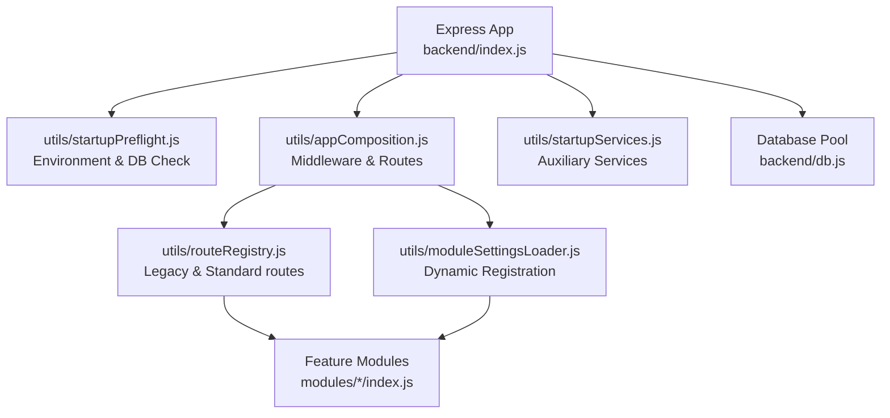
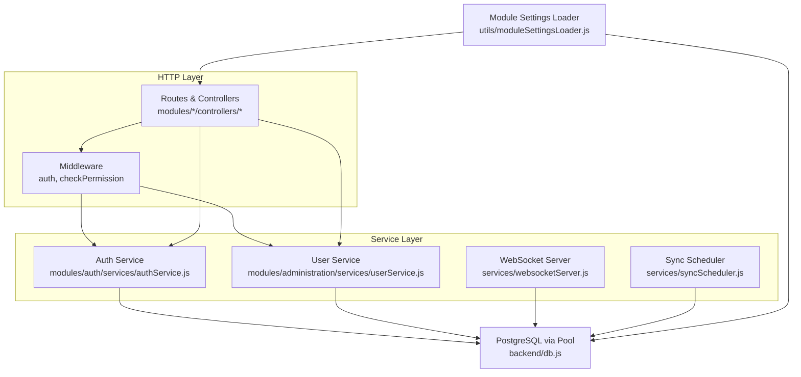
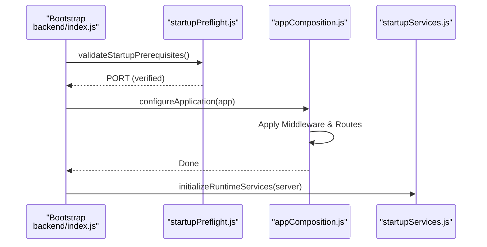

# Backend System

<cite>
**Referenced Files in This Document**
- [backend/index.js](file://backend/index.js)
- [backend/utils/appComposition.js](file://backend/utils/appComposition.js)
- [backend/utils/startupPreflight.js](file://backend/utils/startupPreflight.js)
- [backend/utils/startupServices.js](file://backend/utils/startupServices.js)
- [backend/utils/routeRegistry.js](file://backend/utils/routeRegistry.js)
- [backend/db.js](file://backend/db.js)
- [backend/package.json](file://backend/package.json)
- [backend/env.example](file://backend/env.example)
- [backend/utils/errorHandler.js](file://backend/utils/errorHandler.js)
- [backend/utils/logger.js](file://backend/utils/logger.js)
- [backend/middleware/auth.js](file://backend/middleware/auth.js)
- [backend/middleware/checkPermission.js](file://backend/middleware/checkPermission.js)
- [backend/modules/auth/index.js](file://backend/modules/auth/index.js)
- [backend/modules/administration/index.js](file://backend/modules/administration/index.js)
- [backend/utils/moduleSettingsLoader.js](file://backend/utils/moduleSettingsLoader.js)
- [backend/services/websocketServer.js](file://backend/modules/notifications/services/websocketServer.js)
- [backend/modules/auth/services/authService.js](file://backend/modules/auth/services/authService.js)
- [backend/modules/administration/services/userService.js](file://backend/modules/administration/services/userService.js)
- [backend/services/syncScheduler.js](file://backend/modules/settings/services/syncScheduler.js)
- [backend/migrations/README.md](file://backend/migrations/README.md)
- [backend/config/README.md](file://backend/config/README.md)
</cite>

## Table of Contents
1. [Introduction](#introduction)
2. [Project Structure](#project-structure)
3. [Core Components](#core-components)
4. [Architecture Overview](#architecture-overview)
5. [Detailed Component Analysis](#detailed-component-analysis)
6. [Dependency Analysis](#dependency-analysis)
7. [Performance Considerations](#performance-considerations)
8. [Troubleshooting Guide](#troubleshooting-guide)
9. [Conclusion](#conclusion)
10. [Appendices](#appendices)

## Introduction
This document describes the backend system of Titan CRM, focusing on the refactored Express.js application setup, modular architecture, database connectivity, security measures, and real-time capabilities. The backend is designed for high maintainability through a decoupled startup sequence and dynamic feature module registration.

## Project Structure
The backend is organized into functional layers, with logic separated into specialized utilities and domain-specific modules:
- **Core Entry**: `index.js` (Startup orchestration).
- **Utilities**: `utils/` (Preflight, App Composition, Route Registry, Logging, Error Handling).
- **Modules**: `modules/` (Feature-specific APIs like Auth, Administration, Finance).
- **Services**: `services/` (Cross-cutting systems like WebSocket and Schedulers).
- **Persistence**: `db.js` and `migrations/`.

**Diagram sources**
- [backend/index.js:1-40](file://backend/index.js#L1-L39)
- [backend/utils/appComposition.js:1-125](file://backend/utils/appComposition.js#L1-L125)
- [backend/utils/moduleSettingsLoader.js:296-345](file://backend/utils/moduleSettingsLoader.js#L296-L345)
- [backend/db.js:1-68](file://backend/db.js#L1-L68)

**Section sources**
- [backend/index.js:1-40](file://backend/index.js#L1-L39)
- [backend/utils/appComposition.js:1-125](file://backend/utils/appComposition.js#L1-L125)

## Core Components
- **Application Bootstrap**: Refactored to separate environment validation (`startupPreflight.js`), app configuration (`appComposition.js`), and service startup (`startupServices.js`).
- **Database Connectivity**: PostgreSQL connection pool with automated camelCase transformation and duration logging.
- **Logging & Error Handling**: Multi-transport logger (file/DB) and centralized `asyncHandler` with typed error classes.
- **Security**: JWT-based authentication and granular permission middleware with wildcard support.
- **Modular System**: Dynamic discovery and registration of modules using a hybrid filesystem/database configuration.
- **Real-time & Background Tasks**: WebSocket server and cron-based scheduler.

**Section sources**
- [backend/index.js:1-40](file://backend/index.js#L1-L39)
- [backend/db.js:1-68](file://backend/db.js#L1-L68)
- [backend/utils/logger.js:1-319](file://backend/utils/logger.js#L1-L318)
- [backend/utils/errorHandler.js:1-81](file://backend/utils/errorHandler.js#L1-L80)
- [backend/middleware/auth.js:1-82](file://backend/middleware/auth.js#L1-L81)
- [backend/middleware/checkPermission.js:1-130](file://backend/middleware/checkPermission.js#L1-L129)
- [backend/utils/moduleSettingsLoader.js:1-360](file://backend/utils/moduleSettingsLoader.js#L1-L360)
- [backend/services/websocketServer.js:1-311](file://backend/modules/notifications/services/websocketServer.js#L1-L241)
- [backend/services/syncScheduler.js:1-150](file://backend/modules/settings/services/syncScheduler.js#L1-L135)

## Architecture Overview
The backend follows a layered and modular Express architecture:
- **HTTP Layer**: Orchestrated via `appComposition.js`, handling global middleware and route mounting.
- **Module Layer**: Independent feature modules containing their own routes, controllers, and services.
- **Service Layer**: Business logic encapsulated in services, used by controllers.
- **Persistence Layer**: Pooled PostgreSQL access with result normalization.

**Diagram sources**
- [backend/utils/appComposition.js:1-125](file://backend/utils/appComposition.js#L1-L125)
- [backend/modules/auth/services/authService.js:1-233](file://backend/modules/auth/services/authService.js#L1-L232)
- [backend/modules/administration/services/userService.js:1-554](file://backend/modules/administration/services/userService.js#L1-L553)
- [backend/db.js:1-68](file://backend/db.js#L1-L68)

## Detailed Component Analysis

### Decoupled Application Bootstrap
The `index.js` file acts as a clean orchestrator for the startup sequence:
1. **Preflight**: Validates `.env` and DB connectivity.
2. **Composition**: Configures middleware, static files, and registers routes.
3. **Services**: Starts WebSockets and Schedulers after the server is listening.

**Section sources**
- [backend/index.js:1-40](file://backend/index.js#L1-L39)
- [backend/utils/startupPreflight.js:1-50](file://backend/utils/startupPreflight.js#L1-L24)
- [backend/utils/appComposition.js:1-125](file://backend/utils/appComposition.js#L1-L125)
- [backend/utils/startupServices.js:1-50](file://backend/utils/startupServices.js#L1-L50)

### Database Query Abstraction
- **Connection Pool**: Centralized management of DB connections.
- **Normalization**: Automatically converts `snake_case` column names to `camelCase`.
- **Instrumentation**: Logs query duration for performance monitoring.

**Section sources**
- [backend/db.js:1-68](file://backend/db.js#L1-L68)

### Logging & Error Handling
- **Structured Logger**: Daily rotating files and optional DB logging with sensitive data masking.
- **Error Middleware**: Centralized catch-all in `appComposition.js` for unhandled exceptions, paired with a global `asyncHandler`.

**Section sources**
- [backend/utils/logger.js:1-319](file://backend/utils/logger.js#L1-L318)
- [backend/utils/errorHandler.js:1-81](file://backend/utils/errorHandler.js#L1-L80)

### Authentication & Permissions
- **Auth Middleware**: Verifies JWTs or provides mock users for dev/test environments.
- **Permission Middleware**: Supports fine-grained access control with wildcard logic (e.g., `finance.*`).
- **Admin Bypass**: Wildcard `*` for administrators.

**Section sources**
- [backend/middleware/auth.js:1-82](file://backend/middleware/auth.js#L1-L81)
- [backend/middleware/checkPermission.js:1-130](file://backend/middleware/checkPermission.js#L1-L129)

### Modular Feature System
- **Discovery**: Modules are listed in the `modules` table.
- **Registration**: Routers are dynamically loaded and mounted with configurable prefixes.
- **Settings**: Merges static `settings.js` from the module folder with DB-based overrides.

**Section sources**
- [backend/utils/moduleSettingsLoader.js:1-360](file://backend/utils/moduleSettingsLoader.js#L1-L360)

### Real-Time & Scheduled Jobs
- **WebSocket**: Heartbeat-protected real-time channel on `/ws`.
- **Sync Scheduler**: Cron-based orchestration for backups, data enrichment, and synchronization.

**Section sources**
- [backend/services/websocketServer.js:1-311](file://backend/modules/notifications/services/websocketServer.js#L1-L241)
- [backend/services/syncScheduler.js:1-150](file://backend/modules/settings/services/syncScheduler.js#L1-L135)

## Dependency Analysis
- **Framework**: Express, CORS.
- **Database**: PostgreSQL (`pg`), node-cron (Scheduler), jsonwebtoken (Auth).
- **Communication**: `ws` (WebSocket), nodemailer (Mail).

**Section sources**
- [backend/package.json:1-81](file://backend/package.json#L1-L81)

## Performance Considerations
- Database connection pooling to handle concurrent requests.
- Caching of module settings to avoid redundant database reads.
- Payload limits (10MB) for JSON/URL-encoded bodies.
- Lightweight activity tracking with threshold-based updates.

## Troubleshooting Guide
- **Startup Errors**: Check `startupPreflight.js` output for missing `.env` keys or DB connection issues.
- **Module Registration Issues**: Review `moduleSettingsLoader.js` logs for failed router imports.
- **Auth Failures**: Verify `JWT_SECRET` and check for malformed `Authorization` headers.

**Section sources**
- [backend/index.js:1-40](file://backend/index.js#L1-L39)
- [backend/utils/appComposition.js:111-125](file://backend/utils/appComposition.js#L111-L125)

## Conclusion
Titan CRM's backend provides a robust, modular, and secure foundation. By decoupling its startup sequence and standardizing cross-cutting concerns, the system ensures high scalability and ease of extension for new feature modules.

## Appendices

### Practical Examples: Extending the Backend
- Add a folder in `modules/`.
- Export an Express router from `index.js`.
- Add the module ID and folder name to the `modules` table in the database.
- The `moduleSettingsLoader` will automatically mount the new API.

**Section sources**
- [backend/utils/moduleSettingsLoader.js:1-360](file://backend/utils/moduleSettingsLoader.js#L1-L360)