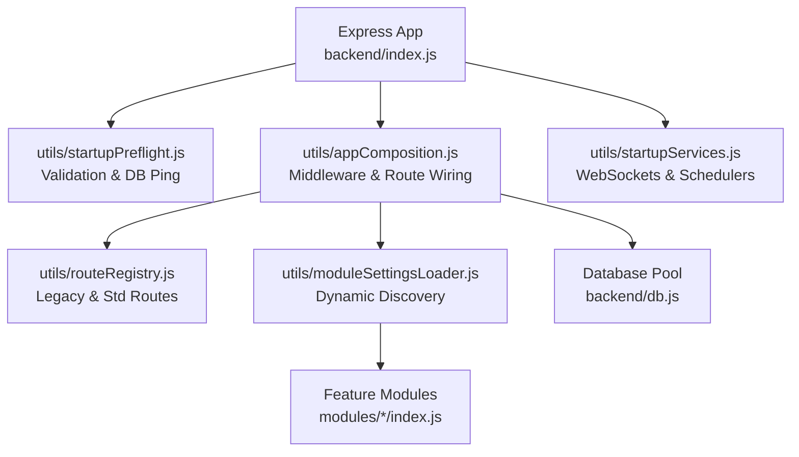
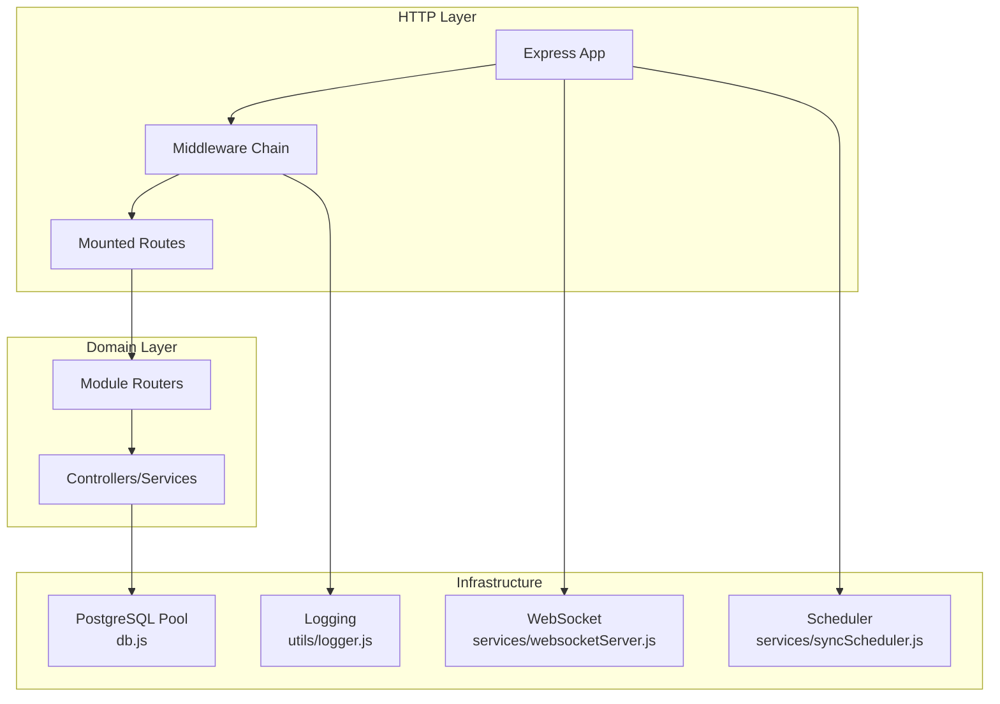
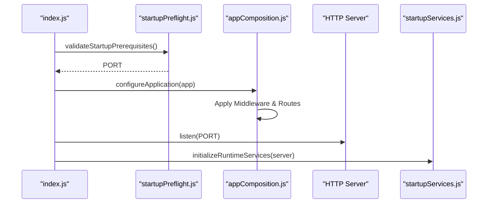

# Core Architecture

<cite>
**Referenced Files in This Document**
- [backend/index.js](file://backend/index.js)
- [backend/utils/appComposition.js](file://backend/utils/appComposition.js)
- [backend/utils/startupPreflight.js](file://backend/utils/startupPreflight.js)
- [backend/utils/startupServices.js](file://backend/utils/startupServices.js)
- [backend/utils/routeRegistry.js](file://backend/utils/routeRegistry.js)
- [backend/db.js](file://backend/db.js)
- [backend/utils/logger.js](file://backend/utils/logger.js)
- [backend/utils/errorHandler.js](file://backend/utils/errorHandler.js)
- [backend/utils/responseHelpers.js](file://backend/utils/responseHelpers.js)
- [backend/utils/moduleSettingsLoader.js](file://backend/utils/moduleSettingsLoader.js)
- [backend/middleware/auth.js](file://backend/middleware/auth.js)
- [backend/middleware/checkPermission.js](file://backend/middleware/checkPermission.js)
- [backend/services/websocketServer.js](file://backend/modules/notifications/services/websocketServer.js)
- [backend/services/syncScheduler.js](file://backend/modules/settings/services/syncScheduler.js)
</cite>

## Table of Contents
1. [Introduction](#introduction)
2. [Project Structure](#project-structure)
3. [Core Components](#core-components)
4. [Architecture Overview](#architecture-overview)
5. [Detailed Component Analysis](#detailed-component-analysis)
6. [Dependency Analysis](#dependency-analysis)
7. [Performance Considerations](#performance-considerations)
8. [Troubleshooting Guide](#troubleshooting-guide)
9. [Conclusion](#conclusion)
10. [Appendices](#appendices)

## Introduction
This document describes the core architecture of the Titan CRM backend. It covers the refactored Express.js application initialization, modular routing, database abstraction, and integrated auxiliary services. The architecture emphasizes separation of concerns through a decoupled startup sequence and dynamic feature module management.

## Project Structure
The backend is organized into specialized layers to ensure scalability and clarity:
- **Startup Sequence**: `index.js` orchestrates `startupPreflight`, `appComposition`, and `startupServices`.
- **Infrastructure**: `db.js` (persistence) and `utils/logger.js` (observability).
- **Application Logic**: Feature modules in `modules/` with dynamic loading via `moduleSettingsLoader.js`.
- **Routing**: Static routes in `routeRegistry.js` and dynamic modular routes.
- **Cross-cutting**: Middleware in `middleware/` and shared utilities in `utils/`.

**Diagram sources**
- [backend/index.js:1-40](file://backend/index.js#L1-L39)
- [backend/utils/appComposition.js:1-125](file://backend/utils/appComposition.js#L1-L125)
- [backend/utils/moduleSettingsLoader.js:296-345](file://backend/utils/moduleSettingsLoader.js#L296-L345)

**Section sources**
- [backend/index.js:1-40](file://backend/index.js#L1-L39)
- [backend/utils/appComposition.js:1-125](file://backend/utils/appComposition.js#L1-L125)

## Core Components
- **Bootstrap Lifecycle**: Separated into Preflight (Validation), Composition (Setup), and Services (Runtime).
- **Database Wrapper**: Pooled connections with automatic `camelCase` transformation and duration tracing.
- **Dynamic Module Loader**: Hybrid system merging static `settings.js` with database-driven overrides.
- **Security Middleware**: JWT authentication and RBAC with wildcard support.
- **Observability**: Structured multi-transport logging and centralized error handling.
- **Real-time Engine**: WebSocket server with heartbeat and connection tracking.

**Section sources**
- [backend/index.js:1-40](file://backend/index.js#L1-L39)
- [backend/db.js:1-68](file://backend/db.js#L1-L68)
- [backend/utils/moduleSettingsLoader.js:1-360](file://backend/utils/moduleSettingsLoader.js#L1-L360)
- [backend/middleware/auth.js:1-82](file://backend/middleware/auth.js#L1-L81)
- [backend/middleware/checkPermission.js:1-130](file://backend/middleware/checkPermission.js#L1-L129)

## Architecture Overview
The backend follows a strictly ordered initialization pattern:
1. **Validation**: Ensure the environment is safe and the database is reachable.
2. **Composition**: Build the Express application, applying global middleware and mounting routes.
3. **Execution**: Start the server and initialize non-blocking background services.

**Section sources**
- [backend/index.js:1-40](file://backend/index.js#L1-L39)
- [backend/utils/appComposition.js:1-125](file://backend/utils/appComposition.js#L1-L125)

## Detailed Component Analysis

### Decoupled Startup Sequence
The startup logic is extracted from `index.js` into specialized utilities:
- **startupPreflight**: Loads `.env`, checks mandatory keys, and pings DB.
- **appComposition**: Configures CORS, body limits (10MB), static paths, and global logging.
- **startupServices**: Spawns WebSockets and Cron schedulers once the server is listening.

**Section sources**
- [backend/index.js:1-40](file://backend/index.js#L1-L39)
- [backend/utils/startupPreflight.js:1-50](file://backend/utils/startupPreflight.js#L1-L24)
- [backend/utils/appComposition.js:1-125](file://backend/utils/appComposition.js#L1-L125)
- [backend/utils/startupServices.js:1-50](file://backend/utils/startupServices.js#L1-L50)

### Middleware & Route Management
- **Static Routes**: `routeRegistry.js` defines core APIs and legacy aliases for compatibility.
- **Dynamic Routes**: `moduleSettingsLoader.js` Discoverable modules from the `modules` table are automatically mounted.
- **Activity Tracking**: Inline middleware in `appComposition.js` updates `last_active_at` for users.

**Section sources**
- [backend/utils/routeRegistry.js:1-45](file://backend/utils/routeRegistry.js#L1-L45)
- [backend/utils/moduleSettingsLoader.js:296-345](file://backend/utils/moduleSettingsLoader.js#L296-L345)
- [backend/utils/appComposition.js:58-99](file://backend/utils/appComposition.js#L58-L99)

### Security: Auth & Permissions
- **Auth**: `middleware/auth.js` handles JWT verification with optional bypass for local development.
- **Permissions**: `middleware/checkPermission.js` enables granular control with wildcard support (e.g., `projects.*`).

**Section sources**
- [backend/middleware/auth.js:1-82](file://backend/middleware/auth.js#L1-L81)
- [backend/middleware/checkPermission.js:1-130](file://backend/middleware/checkPermission.js#L1-L129)

### Database Layer
- **Utility**: `db.js` provides a `query` wrapper.
- **Behavior**: Measure query time, transform keys to `camelCase`, and handle pool management.

**Section sources**
- [backend/db.js:1-68](file://backend/db.js#L1-L68)

### Observability: Logging & Errors
- **Logger**: `utils/logger.js` supports File and DB outputs with recursive sanitization.
- **Errors**: `utils/errorHandler.js` provides typed exceptions and a global `asyncHandler` to prevent unhandled promise rejections.

**Section sources**
- [backend/utils/logger.js:1-319](file://backend/utils/logger.js#L1-L318)
- [backend/utils/errorHandler.js:1-81](file://backend/utils/errorHandler.js#L1-L80)

### Auxiliary Services
- **WebSocket**: Real-time events on `/ws` with heartbeat protection.
- **Scheduler**: Cron-based background jobs for backups and data sync.

**Section sources**
- [backend/services/websocketServer.js:1-311](file://backend/modules/notifications/services/websocketServer.js#L1-L241)
- [backend/services/syncScheduler.js:1-150](file://backend/modules/settings/services/syncScheduler.js#L1-L135)

## Dependency Analysis
- **Framework**: `express`, `cors`.
- **Database**: `pg`, `node-cron`.
- **Security**: `jsonwebtoken`, `bcrypt`.
- **Startup**: `dotenv`.

**Section sources**
- [backend/package.json:1-81](file://backend/package.json#L1-L81)

## Performance Considerations
- Database connection pooling.
- Caching of module metadata and settings.
- Memory-efficient request body limits (10MB).
- Throttled user activity tracking (30s threshold).

## Troubleshooting Guide
- **Startup Failure**: Inspect `startupPreflight` output for missing `.env` variables or DB host issues.
- **Missing Module**: Verify the module exists in `backend/modules/` and is active in the `modules` database table.
- **Permission Denied**: Check the user's role and permission mapping in the database.

**Section sources**
- [backend/index.js:1-40](file://backend/index.js#L1-L39)
- [backend/utils/appComposition.js:111-125](file://backend/utils/appComposition.js#L111-L125)

## Conclusion
Titan CRM's core architecture is built for modularity and resilience. By separating startup prerequisites, application composition, and runtime services into discrete utilities, the backend maintains a high degree of maintainability while supporting dynamic feature growth through its modular registration system.

## Appendices

### Startup Dependency Map
1. `index.js` (Entry)
2. `utils/startupPreflight.js` (Validates)
3. `utils/appComposition.js` (Builds)
4. `utils/moduleSettingsLoader.js` (Loads Modules)
5. `utils/startupServices.js` (Starts Services)

**Section sources**
- [backend/index.js:1-40](file://backend/index.js#L1-L39)