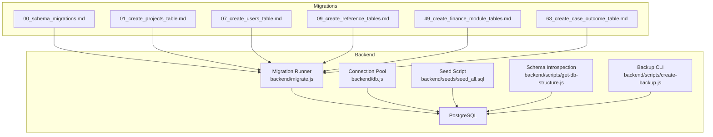
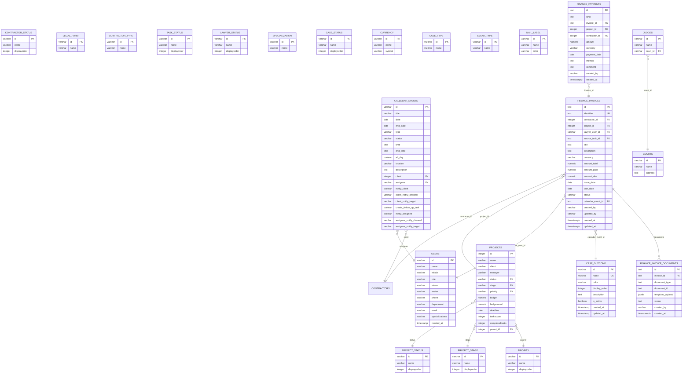
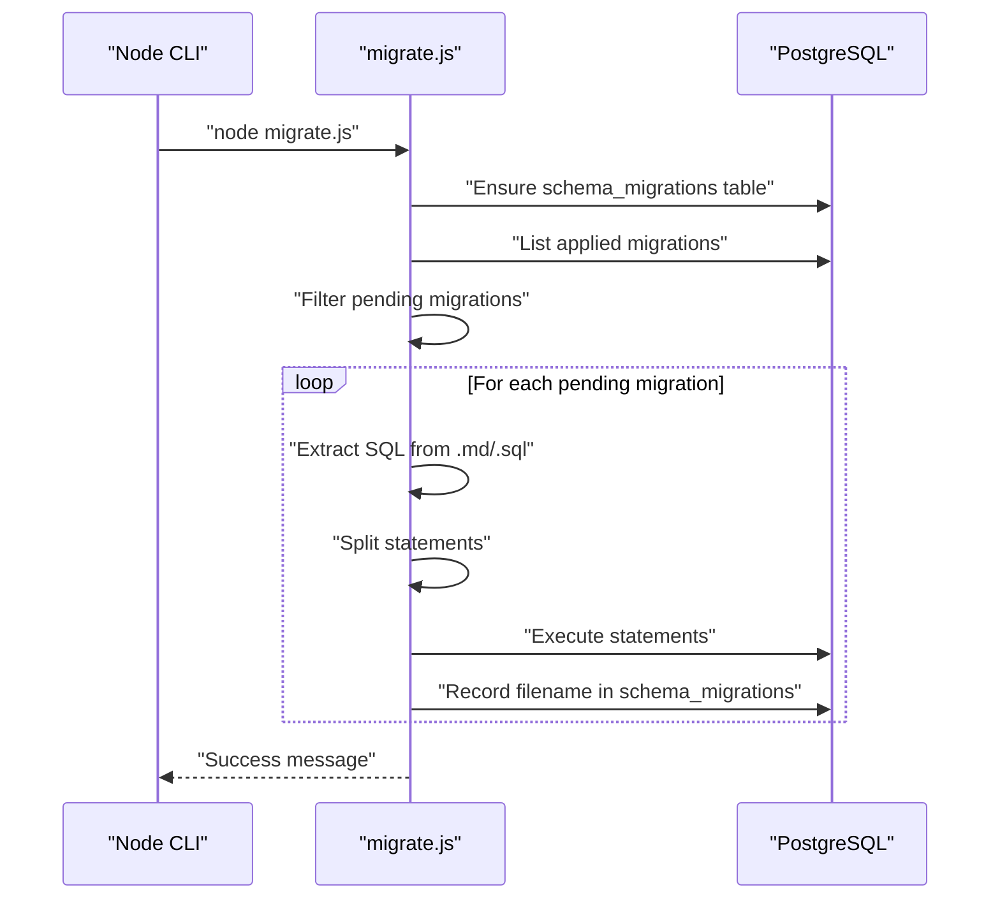
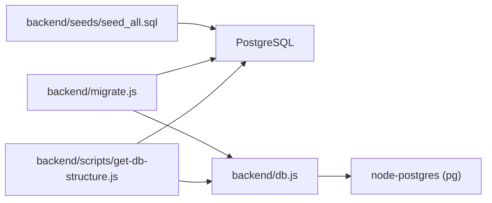

# Database Design

<cite>
**Referenced Files in This Document**
- [db.js](file://backend/db.js)
- [migrate.js](file://backend/migrate.js)
- [db-structure.json](file://backend/config/db-structure.json)
- [seed_all.sql](file://backend/seeds/seed_all.sql)
- [00_schema_migrations.md](file://backend/migrations/00_schema_migrations.md)
- [01_create_projects_table.md](file://backend/migrations/01_create_projects_table.md)
- [07_create_users_table.md](file://backend/migrations/07_create_users_table.md)
- [09_create_reference_tables.md](file://backend/migrations/09_create_reference_tables.md)
- [49_create_finance_module_tables.md](file://backend/migrations/49_create_finance_module_tables.md)
- [63_create_case_outcome_table.md](file://backend/migrations/63_create_case_outcome_table.md)
- [get-db-structure.js](file://backend/scripts/get-db-structure.js)
- [create-backup.js](file://backend/scripts/create-backup.js)
- [backup-system.sh](file://scripts/backup-system.sh)
</cite>

## Table of Contents
1. [Introduction](#introduction)
2. [Project Structure](#project-structure)
3. [Core Components](#core-components)
4. [Architecture Overview](#architecture-overview)
5. [Detailed Component Analysis](#detailed-component-analysis)
6. [Dependency Analysis](#dependency-analysis)
7. [Performance Considerations](#performance-considerations)
8. [Troubleshooting Guide](#troubleshooting-guide)
9. [Conclusion](#conclusion)
10. [Appendices](#appendices)

## Introduction
This document describes the Titan CRM backend database design, focusing on the PostgreSQL schema, entity relationships, and data modeling patterns. It explains the migration system and schema evolution, connection management, query optimization, data seeding and reference data management, integrity constraints, and operational practices such as backup and recovery. Practical examples illustrate indexing strategies and query optimization techniques, and guidance is provided for maintenance and disaster recovery planning.

## Project Structure
The database layer is implemented in the backend with:
- A connection pool abstraction for PostgreSQL
- A migration runner that applies SQL and Markdown-based migrations and tracks applied migrations
- A seed script that initializes reference data and system defaults
- Scripts to introspect the live schema and produce structured reports
- Backup utilities for system-level snapshots and API-triggered database backups

**Diagram sources**
- [db.js:1-68](file://backend/db.js#L1-L68)
- [migrate.js:1-220](file://backend/migrate.js#L1-L220)
- [seed_all.sql:1-513](file://backend/seeds/seed_all.sql#L1-L490)
- [00_schema_migrations.md:1-25](file://backend/migrations/00_schema_migrations.md#L1-L24)
- [01_create_projects_table.md:1-38](file://backend/migrations/01_create_projects_table.md#L1-L38)
- [07_create_users_table.md:1-45](file://backend/migrations/07_create_users_table.md#L1-L45)
- [09_create_reference_tables.md:1-224](file://backend/migrations/09_create_reference_tables.md#L1-L223)
- [49_create_finance_module_tables.md:1-118](file://backend/migrations/49_create_finance_module_tables.md#L1-L117)
- [63_create_case_outcome_table.md:1-33](file://backend/migrations/63_create_case_outcome_table.md#L1-L32)
- [get-db-structure.js:1-272](file://backend/scripts/get-db-structure.js#L1-L271)
- [create-backup.js:1-92](file://backend/scripts/create-backup.js#L1-L91)

**Section sources**
- [db.js:1-68](file://backend/db.js#L1-L68)
- [migrate.js:1-220](file://backend/migrate.js#L1-L220)
- [seed_all.sql:1-513](file://backend/seeds/seed_all.sql#L1-L490)
- [get-db-structure.js:1-272](file://backend/scripts/get-db-structure.js#L1-L271)
- [create-backup.js:1-92](file://backend/scripts/create-backup.js#L1-L91)

## Core Components
- Connection Management
  - A PostgreSQL connection pool is configured from environment variables and exposes a query wrapper that converts snake_case column names to camelCase for JavaScript consumption.
  - The pool is used by the migration runner and introspection utilities.

- Migration System
  - Migrations are stored as .sql and .md files. Markdown files embed SQL blocks that are extracted and executed.
  - The runner maintains a schema_migrations table to track applied migrations and ensures idempotent execution.
  - SQL splitting supports DO blocks, dollar-quoted blocks, and semicolon-delimited statements.

- Seeding and Reference Data
  - A comprehensive seed script inserts reference data (statuses, stages, currencies, legal forms, roles, permissions, quick actions, system settings, courts/judges).
  - Seeds use UPSERT semantics to avoid breaking repeated runs.

- Schema Introspection
  - A script queries information_schema and pg_catalog to produce a structured report of tables, columns, foreign keys, indexes, counts, and optional comments.

**Section sources**
- [db.js:1-68](file://backend/db.js#L1-L68)
- [migrate.js:1-220](file://backend/migrate.js#L1-L220)
- [00_schema_migrations.md:1-25](file://backend/migrations/00_schema_migrations.md#L1-L24)
- [seed_all.sql:1-513](file://backend/seeds/seed_all.sql#L1-L490)
- [get-db-structure.js:1-272](file://backend/scripts/get-db-structure.js#L1-L271)

## Architecture Overview
The database architecture follows a modular, reference-driven design:
- Reference tables define controlled vocabularies for statuses, stages, priorities, currencies, legal forms, and more.
- Domain tables (projects, tasks, contractors, users, calendar events) reference these codes to enforce consistency.
- Finance module tables encapsulate invoicing, payments, and invoice documents with appropriate constraints and indexes.
- Case outcomes and related case tables support legal case lifecycle management.
- A dedicated schema_migrations table underpins safe, repeatable schema evolution.

**Diagram sources**
- [01_create_projects_table.md:8-22](file://backend/migrations/01_create_projects_table.md#L8-L22)
- [07_create_users_table.md:8-20](file://backend/migrations/07_create_users_table.md#L8-L20)
- [09_create_reference_tables.md:8-224](file://backend/migrations/09_create_reference_tables.md#L8-L223)
- [49_create_finance_module_tables.md:29-96](file://backend/migrations/49_create_finance_module_tables.md#L29-L96)
- [63_create_case_outcome_table.md:9-18](file://backend/migrations/63_create_case_outcome_table.md#L9-L18)
- [db-structure.json:1-2399](file://backend/config/db-structure.json#L1-L2399)

## Detailed Component Analysis

### Connection Management
- Environment-driven configuration reads DB_USER, DB_HOST, DB_NAME, DB_PASSWORD, DB_PORT from a local env file.
- A connection pool is created and exposed with a query wrapper that:
  - Executes queries through the pool
  - Converts column names from snake_case to camelCase for JS consumers
  - Logs timing for diagnostics

Operational notes:
- Ensure the env file exists and contains all required variables.
- The pool is suitable for concurrent requests; tune pool size according to workload.

**Section sources**
- [db.js:1-68](file://backend/db.js#L1-L68)

### Migration System and Schema Evolution
- Migration runner:
  - Scans migrations directory for .sql and .md files (excluding README and MANUAL_).
  - Extracts SQL from Markdown blocks and splits statements safely, handling DO blocks and dollar-quoted sections.
  - Maintains schema_migrations table with filename and applied_at timestamp.
  - Applies only pending migrations and records successful completion.

- Migration patterns observed:
  - Idempotent creation guarded by IF NOT EXISTS for forward/backward compatibility.
  - Controlled vocabulary tables seeded during early migrations.
  - Finance module introduced with indexes and constraints.
  - Case outcome table added with default entries and color coding.

**Diagram sources**
- [migrate.js:134-215](file://backend/migrate.js#L134-L215)
- [00_schema_migrations.md:9-18](file://backend/migrations/00_schema_migrations.md#L9-L18)

**Section sources**
- [migrate.js:1-220](file://backend/migrate.js#L1-L220)
- [00_schema_migrations.md:1-25](file://backend/migrations/00_schema_migrations.md#L1-L24)
- [01_create_projects_table.md:1-38](file://backend/migrations/01_create_projects_table.md#L1-L38)
- [07_create_users_table.md:1-45](file://backend/migrations/07_create_users_table.md#L1-L45)
- [09_create_reference_tables.md:1-224](file://backend/migrations/09_create_reference_tables.md#L1-L223)
- [49_create_finance_module_tables.md:1-118](file://backend/migrations/49_create_finance_module_tables.md#L1-L117)
- [63_create_case_outcome_table.md:1-33](file://backend/migrations/63_create_case_outcome_table.md#L1-L32)

### Data Seeding and Reference Data Management
- The seed_all.sql script:
  - Inserts reference data for priorities, project stages/statuses, contractor statuses, task statuses, lawyer statuses, case outcomes, legal forms, contractor types, relationship types, currencies, event types, mail labels, modules, tags, roles, permissions, quick actions, system settings, courts, and judges.
  - Uses ON CONFLICT clauses to update existing rows, ensuring idempotency.

- Patterns:
  - Controlled vocabularies use short codes as primary keys.
  - Colors and displayorder fields support UI rendering and ordering.
  - Roles and permissions are seeded with JSONB arrays for flexible access matrices.

**Section sources**
- [seed_all.sql:1-513](file://backend/seeds/seed_all.sql#L1-L490)

### Schema Introspection and Reporting
- The get-db-structure.js script:
  - Queries information_schema for columns, pg-catalog for foreign keys and indexes.
  - Optionally writes a human-readable report or JSON.
  - Filters tables by patterns (e.g., finance_%, projects, tasks, contractors, users, calendar_events, references_%).

- Output includes:
  - Column metadata (name, type, nullability, default, comment)
  - Foreign key definitions
  - Index definitions (including uniqueness and primary keys)
  - Row counts and sample rows

**Section sources**
- [get-db-structure.js:1-272](file://backend/scripts/get-db-structure.js#L1-L271)
- [db-structure.json:1-2399](file://backend/config/db-structure.json#L1-L2399)

### Backup and Recovery
- System-level backup:
  - backup-system.sh creates a snapshot of the repository excluding unnecessary files and archives it.
  - Supports toggling inclusion of node_modules and retaining the unpacked folder.

- Application-level backup:
  - create-backup.js calls the backend API endpoint to trigger a backup via HTTP request.
  - Requires API_URL configured in the backend env file.

- Disaster recovery planning:
  - Use schema_migrations to verify applied migrations after restoration.
  - Re-run seeds if reference data is missing post-restore.
  - Validate indexes and constraints using the introspection script.

**Section sources**
- [backup-system.sh:1-99](file://scripts/backup-system.sh#L1-L98)
- [create-backup.js:1-92](file://backend/scripts/create-backup.js#L1-L91)

## Dependency Analysis
- Internal dependencies:
  - db.js is consumed by migrate.js, get-db-structure.js, and potentially other services.
  - migrate.js depends on the presence of migration files and the schema_migrations table.
  - get-db-structure.js depends on information_schema and pg-catalog metadata.
  - seed_all.sql is independent of runtime code and can be executed directly.

- External dependencies:
  - PostgreSQL server and pg-native driver via node-postgres.
  - Node.js environment with access to filesystem and HTTP.

**Diagram sources**
- [db.js:1-68](file://backend/db.js#L1-L68)
- [migrate.js:1-220](file://backend/migrate.js#L1-L220)
- [get-db-structure.js:1-272](file://backend/scripts/get-db-structure.js#L1-L271)
- [seed_all.sql:1-513](file://backend/seeds/seed_all.sql#L1-L490)

**Section sources**
- [db.js:1-68](file://backend/db.js#L1-L68)
- [migrate.js:1-220](file://backend/migrate.js#L1-L220)
- [get-db-structure.js:1-272](file://backend/scripts/get-db-structure.js#L1-L271)
- [seed_all.sql:1-513](file://backend/seeds/seed_all.sql#L1-L490)

## Performance Considerations
Indexing strategies evidenced by migrations:
- Finance invoices: indexes on status, due_date, project_id, contractor_id to accelerate filtering and reporting.
- Finance payments: indexes on invoice_id, project_id to optimize joins and lookup performance.
- Schema migrations: index on applied_at to speed up migration history scans.

Query optimization techniques:
- Prefer equality predicates on indexed columns (e.g., status, contractor_id).
- Use range scans on dates (e.g., due_date) with appropriate indexes.
- Leverage foreign keys to enable efficient joins; ensure join columns are indexed where not implied by FK constraints.
- Use LIMIT and pagination for large result sets; avoid SELECT * in hot paths.

Data modeling patterns:
- Reference tables decouple domain tables from hardcoded values, improving consistency and reducing storage.
- Numeric precision and scale are set appropriately for financial data (e.g., 14,2).
- JSONB fields (template_payload) store semi-structured data for dynamic document generation.

[No sources needed since this section provides general guidance]

## Troubleshooting Guide
Common issues and resolutions:
- Missing environment variables:
  - Symptom: Migration runner exits early with a list of missing variables.
  - Resolution: Populate DB_USER, DB_HOST, DB_NAME, DB_PASSWORD, DB_PORT in the env file.

- Migration failures:
  - Symptom: Specific migration fails and is not recorded.
  - Resolution: Fix the SQL, rerun the migration; the runner will not record partial successes.

- Stuck or partially applied migrations:
  - Symptom: Some migrations appear applied while others are not.
  - Resolution: Inspect schema_migrations; correct discrepancies manually if necessary.

- Schema drift:
  - Symptom: Live schema differs from expectations.
  - Resolution: Use get-db-structure.js to capture current schema and compare against db-structure.json.

- Backup failures:
  - Symptom: Backup CLI errors or API calls fail.
  - Resolution: Verify API_URL in env; ensure backend service is running; check network connectivity.

**Section sources**
- [migrate.js:134-215](file://backend/migrate.js#L134-L215)
- [db.js:20-29](file://backend/db.js#L20-L29)
- [get-db-structure.js:267-271](file://backend/scripts/get-db-structure.js#L267-L271)
- [create-backup.js:4-10](file://backend/scripts/create-backup.js#L4-L10)

## Conclusion
Titan CRM employs a robust, reference-driven PostgreSQL schema with a reliable migration system and comprehensive seeding strategy. The design emphasizes data integrity, scalability, and operability through controlled vocabularies, deliberate indexing, and clear operational tooling. By following the documented patterns and using the provided scripts, teams can evolve the schema safely, maintain high query performance, and execute effective backups and recoveries.

## Appendices

### Appendix A: Representative Migration Examples
- Initial migrations establish schema_migrations and core domain tables.
- Later migrations introduce modules (finance, legal cases) with indexes and constraints.
- Example references:
  - [00_schema_migrations.md:9-18](file://backend/migrations/00_schema_migrations.md#L9-L18)
  - [01_create_projects_table.md:8-22](file://backend/migrations/01_create_projects_table.md#L8-L22)
  - [49_create_finance_module_tables.md:99-105](file://backend/migrations/49_create_finance_module_tables.md#L99-L105)
  - [63_create_case_outcome_table.md:9-18](file://backend/migrations/63_create_case_outcome_table.md#L9-L18)

**Section sources**
- [00_schema_migrations.md:1-25](file://backend/migrations/00_schema_migrations.md#L1-L24)
- [01_create_projects_table.md:1-38](file://backend/migrations/01_create_projects_table.md#L1-L38)
- [49_create_finance_module_tables.md:1-118](file://backend/migrations/49_create_finance_module_tables.md#L1-L117)
- [63_create_case_outcome_table.md:1-33](file://backend/migrations/63_create_case_outcome_table.md#L1-L32)