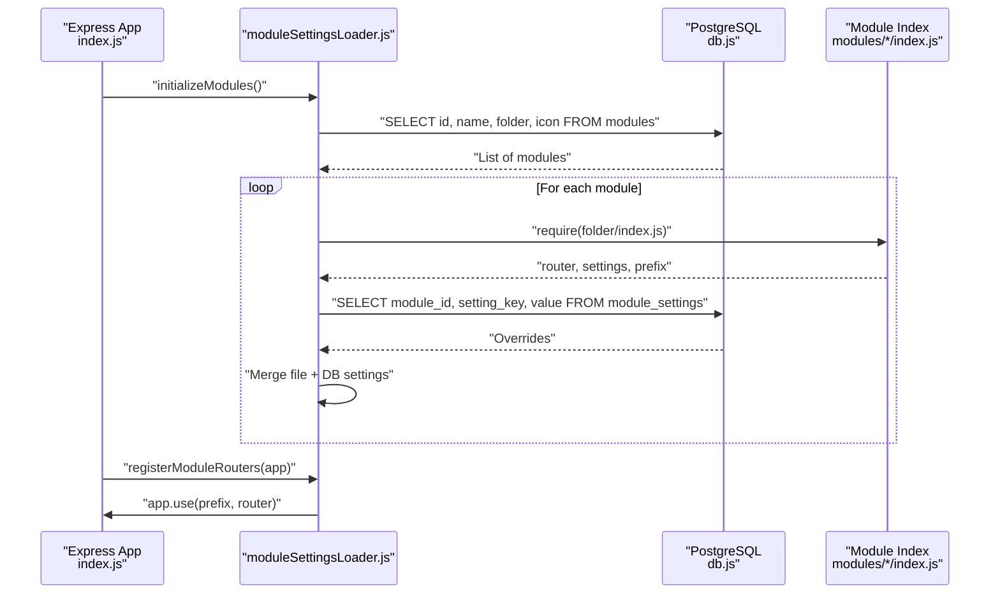
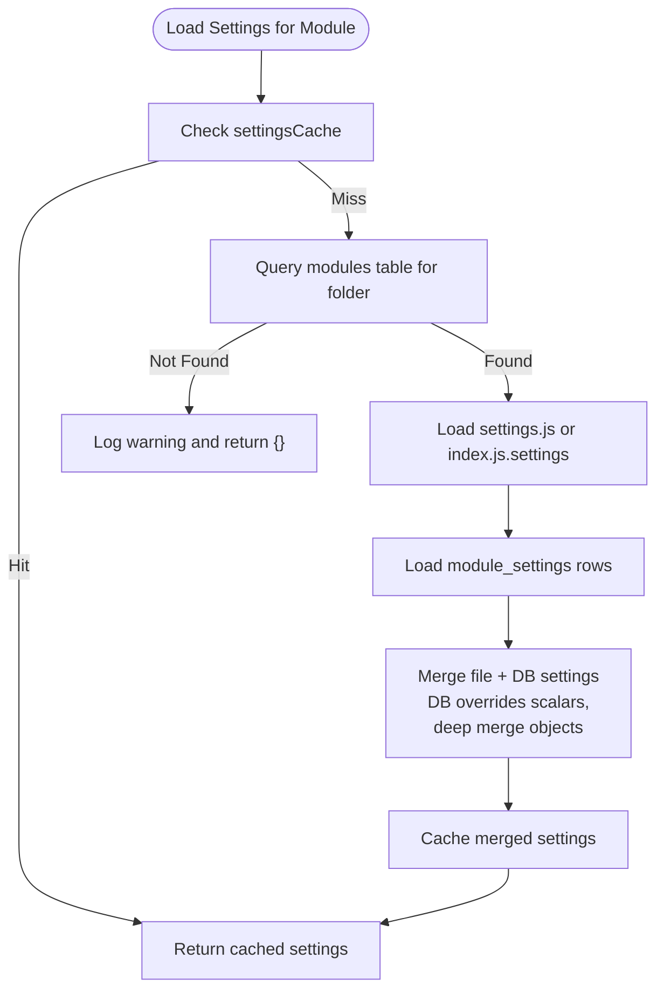
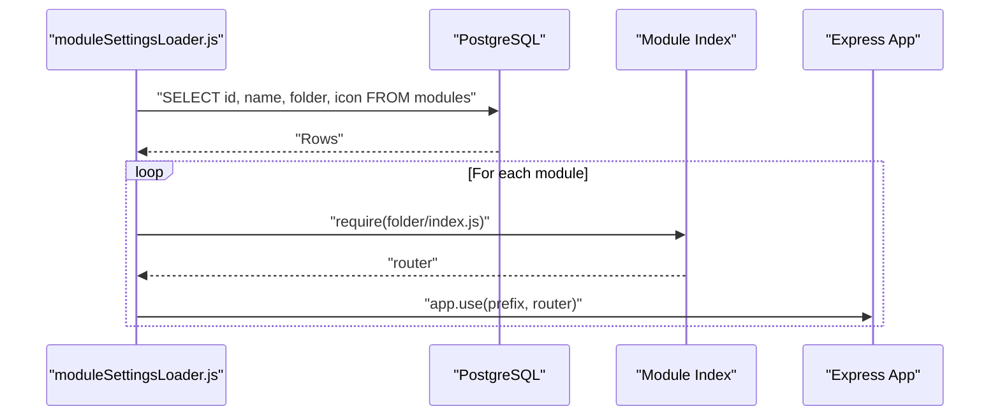
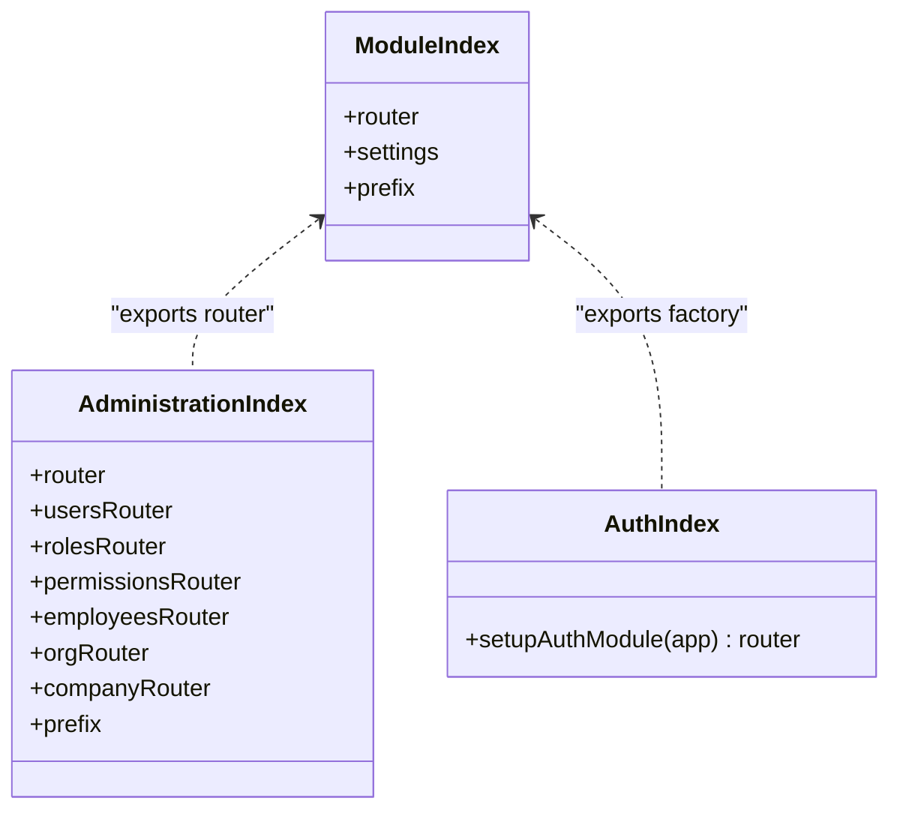
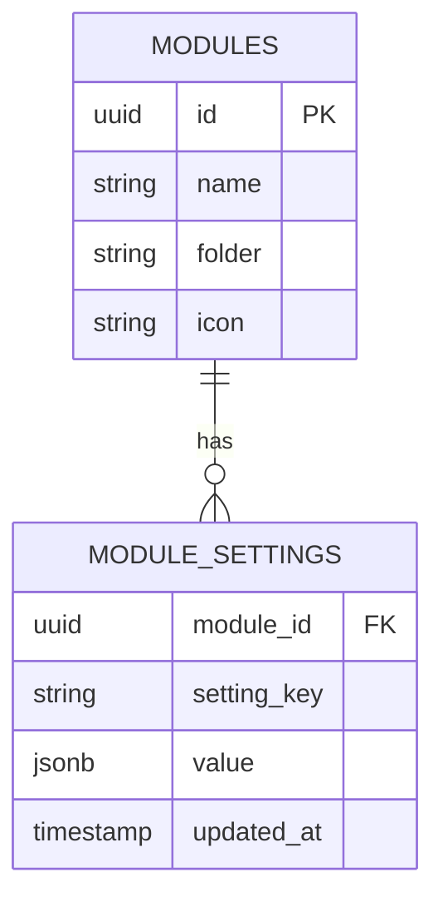
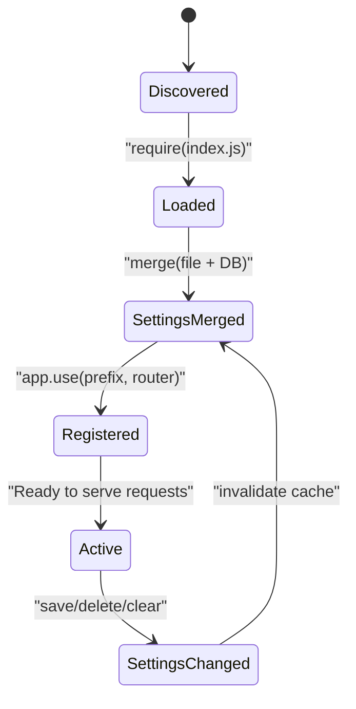
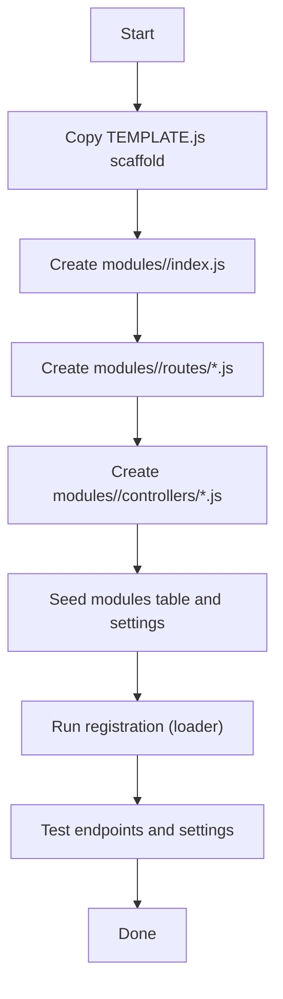
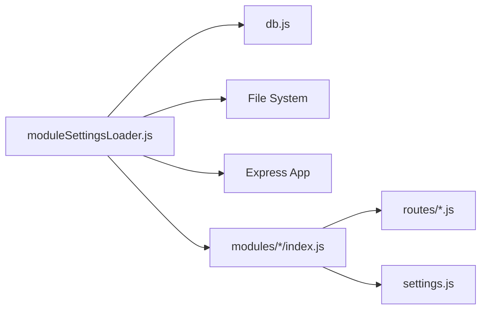

# Module System

<cite>
**Referenced Files in This Document**
- [moduleSettingsLoader.js](file://backend/utils/moduleSettingsLoader.js)
- [sync-modules.js](file://backend/scripts/sync-modules.js)
- [check_modules.js](file://backend/modules/references/services/referencesService.js)
- [TEMPLATE.js](file://backend/modules/TEMPLATE.js)
- [administration/index.js](file://backend/modules/administration/index.js)
- [auth/index.js](file://backend/modules/auth/index.js)
- [finance/index.js](file://backend/modules/finance/index.js)
- [projects/index.js](file://backend/modules/projects/index.js)
- [tasks/index.js](file://backend/modules/tasks/index.js)
- [administration/settings.js](file://backend/modules/administration/settings.js)
- [finance/settings.js](file://backend/modules/finance/settings.js)
- [projects/settings.js](file://backend/modules/projects/settings.js)
- [tasks/settings.js](file://backend/modules/tasks/settings.js)
- [auth/routes.js](file://backend/modules/auth/routes.js)
- [db.js](file://backend/db.js)
- [index.js](file://backend/index.js)
</cite>

## Table of Contents
1. [Introduction](#introduction)
2. [Project Structure](#project-structure)
3. [Core Components](#core-components)
4. [Architecture Overview](#architecture-overview)
5. [Detailed Component Analysis](#detailed-component-analysis)
6. [Dependency Analysis](#dependency-analysis)
7. [Performance Considerations](#performance-considerations)
8. [Troubleshooting Guide](#troubleshooting-guide)
9. [Conclusion](#conclusion)
10. [Appendices](#appendices)

## Introduction
This document describes the Titan CRM backend module system. It explains the modular architecture pattern, independent feature module organization, dynamic module loading mechanisms, and the lifecycle of modules from discovery to router registration. It also covers module registration, router integration, inter-module communication patterns, settings management, service-layer patterns, and data access abstractions. Practical examples demonstrate how to create new modules, extend existing functionality, and maintain module isolation. Finally, it addresses module configuration, dependency management, and testing strategies.

## Project Structure
The backend organizes features as independent modules under a central modules directory. Each module encapsulates its own routes, controllers, services, and settings. A dedicated loader dynamically discovers modules, loads their settings (both static and database-backed), and registers their routers into the main Express application.

```mermaid
graph TB
subgraph "Main Application"
APP["Express App<br/>index.js"]
end
subgraph "Module Loader"
MS["moduleSettingsLoader.js<br/>Dynamic discovery & registration"]
end
subgraph "Modules"
ADM["Administration<br/>index.js"]
AUTH["Auth<br/>index.js"]
FIN["Finance<br/>index.js"]
PRJ["Projects<br/>index.js"]
TSK["Tasks<br/>index.js"]
end
subgraph "Settings"
ADMSET["Administration<br/>settings.js"]
FINSET["Finance<br/>settings.js"]
PRJSET["Projects<br/>settings.js"]
TSKSET["Tasks<br/>settings.js"]
end
DB["PostgreSQL<br/>db.js"]
APP <- --> MS
MS --> ADM
MS --> AUTH
MS --> FIN
MS --> PRJ
MS --> TSK
ADM --> ADMSET
FIN --> FINSET
PRJ --> PRJSET
TSK --> TSKSET
MS --> DB
```

**Diagram sources**
- [moduleSettingsLoader.js:250-345](file://backend/utils/moduleSettingsLoader.js#L250-L345)
- [administration/index.js:1-34](file://backend/modules/administration/index.js#L1-L33)
- [auth/index.js:1-18](file://backend/modules/auth/index.js#L1-L17)
- [finance/index.js:1-55](file://backend/modules/finance/index.js#L1-L55)
- [projects/index.js:1-14](file://backend/modules/projects/index.js#L1-L13)
- [tasks/index.js:1-14](file://backend/modules/tasks/index.js#L1-L13)
- [administration/settings.js:1-93](file://backend/modules/administration/settings.js#L1-L92)
- [finance/settings.js:1-55](file://backend/modules/finance/settings.js#L1-L54)
- [projects/settings.js:1-26](file://backend/modules/projects/settings.js#L1-L25)
- [tasks/settings.js:1-23](file://backend/modules/tasks/settings.js#L1-L22)
- [db.js](file://backend/db.js)

**Section sources**
- [moduleSettingsLoader.js:250-345](file://backend/utils/moduleSettingsLoader.js#L250-L345)
- [administration/index.js:1-34](file://backend/modules/administration/index.js#L1-L33)
- [auth/index.js:1-18](file://backend/modules/auth/index.js#L1-L17)
- [finance/index.js:1-55](file://backend/modules/finance/index.js#L1-L55)
- [projects/index.js:1-14](file://backend/modules/projects/index.js#L1-L13)
- [tasks/index.js:1-14](file://backend/modules/tasks/index.js#L1-L13)

## Core Components
- Dynamic module settings loader: Loads static settings from module files and merges database-backed overrides, with caching and persistence.
- Router discovery and registration: Scans modules, loads their routers, and mounts them under configurable prefixes.
- Module registry: Maintains module metadata (id, name, folder, icon) in the database for runtime discovery.
- Module scaffolding template: Provides a blueprint for creating new modules consistently.

Key responsibilities:
- Discovery: Query modules table and resolve module folder paths.
- Loading: Require module index files and extract router exports.
- Settings: Merge file-based and database-backed settings with precedence rules.
- Registration: Mount routers onto the main Express app with computed prefixes.
- Persistence: Save/delete module settings to the database with JSONB support.

**Section sources**
- [moduleSettingsLoader.js:23-137](file://backend/utils/moduleSettingsLoader.js#L23-L137)
- [moduleSettingsLoader.js:266-345](file://backend/utils/moduleSettingsLoader.js#L266-L345)
- [moduleSettingsLoader.js:175-229](file://backend/utils/moduleSettingsLoader.js#L175-L229)
- [check_modules.js:1-15](file://backend/modules/references/services/referencesService.js#L73-L73)

## Architecture Overview
The module system follows a layered pattern:
- Layer 1: Module definition (index.js exporting router and settings).
- Layer 2: Settings management (static via settings.js; dynamic via module_settings table).
- Layer 3: Loader orchestration (discovery, caching, merging, registration).
- Layer 4: Database integration (modules table and module_settings table).
- Layer 5: Main application integration (router mounting).



**Diagram sources**
- [moduleSettingsLoader.js:250-345](file://backend/utils/moduleSettingsLoader.js#L250-L345)
- [db.js](file://backend/db.js)
- [administration/index.js:1-34](file://backend/modules/administration/index.js#L1-L33)
- [finance/index.js:1-55](file://backend/modules/finance/index.js#L1-L55)

## Detailed Component Analysis

### Module Settings Loader
Responsibilities:
- Load static settings from settings.js or index.js.settings.
- Load dynamic settings from module_settings table and override file-based values.
- Cache merged settings per module id.
- Persist, delete, and clear settings.
- Discover and register routers for all modules.

Behavior highlights:
- File vs DB precedence: DB overrides file-based keys; nested objects are deep-merged where appropriate.
- Router resolution supports multiple export styles (default, named router).
- Prefix resolution prefers module settings.prefix; otherwise defaults to /api/{module_id}.
- Initialization preloads settings for all modules.



**Diagram sources**
- [moduleSettingsLoader.js:89-137](file://backend/utils/moduleSettingsLoader.js#L89-L137)
- [moduleSettingsLoader.js:175-229](file://backend/utils/moduleSettingsLoader.js#L175-L229)

**Section sources**
- [moduleSettingsLoader.js:23-137](file://backend/utils/moduleSettingsLoader.js#L23-L137)
- [moduleSettingsLoader.js:175-229](file://backend/utils/moduleSettingsLoader.js#L175-L229)
- [moduleSettingsLoader.js:266-345](file://backend/utils/moduleSettingsLoader.js#L266-L345)

### Router Discovery and Registration
Mechanics:
- Enumerate modules from the database.
- Resolve router from module index file.
- Compute mount prefix from settings or fallback.
- Register router on the main Express app.



**Diagram sources**
- [moduleSettingsLoader.js:296-345](file://backend/utils/moduleSettingsLoader.js#L296-L345)
- [finance/index.js:1-55](file://backend/modules/finance/index.js#L1-L55)
- [administration/index.js:1-34](file://backend/modules/administration/index.js#L1-L33)

**Section sources**
- [moduleSettingsLoader.js:296-345](file://backend/utils/moduleSettingsLoader.js#L296-L345)

### Module Definition Patterns
- Single-router modules export an object with router and settings, plus optional prefix.
- Composite modules (e.g., Administration) compose multiple sub-routers and export a parent router.
- Auth module exports a factory function that mounts routes and returns a router.



**Diagram sources**
- [projects/index.js:1-14](file://backend/modules/projects/index.js#L1-L13)
- [tasks/index.js:1-14](file://backend/modules/tasks/index.js#L1-L13)
- [administration/index.js:1-34](file://backend/modules/administration/index.js#L1-L33)
- [auth/index.js:1-18](file://backend/modules/auth/index.js#L1-L17)

**Section sources**
- [projects/index.js:1-14](file://backend/modules/projects/index.js#L1-L13)
- [tasks/index.js:1-14](file://backend/modules/tasks/index.js#L1-L13)
- [administration/index.js:1-34](file://backend/modules/administration/index.js#L1-L33)
- [auth/index.js:1-18](file://backend/modules/auth/index.js#L1-L17)

### Settings Management
- Static settings: Provided by settings.js or index.js.settings within each module.
- Dynamic settings: Stored in module_settings table with JSONB values; loaded and merged at runtime.
- Persistence APIs: Save and delete individual settings; clear caches after changes.
- Example modules:
  - Administration: Defines default roles and permissions.
  - Finance: Exposes a settings router for tax regimes, rates, allocation methods, overhead articles, and defaults.
  - Projects/Tasks: Define display, features, and defaults.



**Diagram sources**
- [moduleSettingsLoader.js:62-81](file://backend/utils/moduleSettingsLoader.js#L62-L81)
- [moduleSettingsLoader.js:175-229](file://backend/utils/moduleSettingsLoader.js#L175-L229)

**Section sources**
- [administration/settings.js:1-93](file://backend/modules/administration/settings.js#L1-L92)
- [finance/settings.js:1-55](file://backend/modules/finance/settings.js#L1-L54)
- [projects/settings.js:1-26](file://backend/modules/projects/settings.js#L1-L25)
- [tasks/settings.js:1-23](file://backend/modules/tasks/settings.js#L1-L22)

### Inter-Module Communication Patterns
- Direct imports: Modules can import services/controllers from other modules when needed.
- Shared services: Some modules expose reusable services (e.g., mail services) that other modules can consume.
- Event-driven workflows: Workflow engine and triggers enable decoupled cross-module automation.

Note: The current module index files primarily export routers and settings. Inter-module calls are typically implemented within module services or controllers and are not exposed at the module boundary.

**Section sources**
- [finance/index.js:19-27](file://backend/modules/finance/index.js#L19-L27)

### Module Lifecycle and Initialization
- Discovery: Query modules table to enumerate active modules.
- Loading: Require module index files to obtain router and settings.
- Settings merge: Combine static and dynamic settings with DB overrides.
- Registration: Mount routers under computed prefixes.
- Persistence: Provide APIs to save/delete settings and clear caches.



**Diagram sources**
- [moduleSettingsLoader.js:250-345](file://backend/utils/moduleSettingsLoader.js#L250-L345)

**Section sources**
- [moduleSettingsLoader.js:250-345](file://backend/utils/moduleSettingsLoader.js#L250-L345)

### Creating New Modules (Practical Examples)
- Use the template to scaffold a new module directory and files.
- Implement index.js exporting router and settings, and optionally a prefix.
- Add routes and controllers under the module’s routes and controllers directories.
- Seed module metadata into the modules table and module settings as needed.
- Verify module registration by checking router availability and settings.



**Diagram sources**
- [TEMPLATE.js:1-117](file://backend/modules/TEMPLATE.js#L1-L116)
- [moduleSettingsLoader.js:296-345](file://backend/utils/moduleSettingsLoader.js#L296-L345)

**Section sources**
- [TEMPLATE.js:1-117](file://backend/modules/TEMPLATE.js#L1-L116)

### Extending Existing Functionality
- Add new routes to an existing module’s routes directory and wire them in the module’s index.js.
- Introduce new controllers and services as needed.
- Extend settings by adding new keys to settings.js or exposing a settings router.
- Persist new settings via loader APIs and invalidate caches if necessary.

**Section sources**
- [finance/settings.js:1-55](file://backend/modules/finance/settings.js#L1-L54)
- [moduleSettingsLoader.js:175-229](file://backend/utils/moduleSettingsLoader.js#L175-L229)

### Maintaining Module Isolation
- Keep module boundaries: avoid importing internal services across modules unless necessary.
- Prefer explicit APIs (routers/services) over direct internal dependencies.
- Centralize shared concerns (e.g., mail services) in dedicated modules and import them as needed.
- Use settings to configure behavior without hardcoding module internals.

**Section sources**
- [finance/index.js:19-27](file://backend/modules/finance/index.js#L19-L27)

### Module Configuration and Dependencies
- Module metadata: id, name, folder, icon stored in modules table.
- Settings: static via settings.js; dynamic via module_settings table.
- Router dependencies: modules/*/index.js must export a router compatible with Express.
- Database dependencies: loader queries modules and module_settings tables.

**Section sources**
- [moduleSettingsLoader.js:96-105](file://backend/utils/moduleSettingsLoader.js#L96-L105)
- [moduleSettingsLoader.js:62-81](file://backend/utils/moduleSettingsLoader.js#L62-L81)

### Testing Strategies
- Unit tests: Test module controllers and services in isolation.
- Integration tests: Verify router registration and endpoint behavior.
- Settings tests: Validate merging of file and DB settings.
- Module sync tests: Validate synchronization scripts and dry-run modes.

**Section sources**
- [sync-modules.js:53-89](file://backend/scripts/sync-modules.js#L53-L89)
- [check_modules.js:1-15](file://backend/modules/references/services/referencesService.js#L73-L73)

## Dependency Analysis
The loader depends on:
- Database connectivity for module metadata and settings.
- File system access to load module index files.
- Express app instance for router registration.

Modules depend on:
- Their own routes and controllers.
- Optional shared services or utilities.
- Settings for configuration and behavior toggles.



**Diagram sources**
- [moduleSettingsLoader.js:250-345](file://backend/utils/moduleSettingsLoader.js#L250-L345)
- [db.js](file://backend/db.js)
- [finance/index.js:1-55](file://backend/modules/finance/index.js#L1-L55)

**Section sources**
- [moduleSettingsLoader.js:250-345](file://backend/utils/moduleSettingsLoader.js#L250-L345)

## Performance Considerations
- Caching: Settings are cached per module id to reduce repeated disk and DB reads.
- Lazy loading: Routers are re-required on demand to reflect changes without restarting.
- Batch operations: Initialization preloads settings for all modules to minimize latency during first access.
- Database indexing: Ensure proper indexing on modules and module_settings tables for fast lookups.

## Troubleshooting Guide
Common issues and resolutions:
- Module not found: Verify module id exists in modules table and folder is correct.
- Router not mounted: Confirm module index.js exports a router and settings.prefix is valid.
- Settings not applied: Check module_settings entries and ensure DB overrides are intended.
- Registration errors: Review loader logs for require errors or missing router exports.
- Module sync failures: Use dry-run mode and check backend API reachability.

**Section sources**
- [moduleSettingsLoader.js:250-345](file://backend/utils/moduleSettingsLoader.js#L250-L345)
- [sync-modules.js:91-110](file://backend/scripts/sync-modules.js#L91-L110)

## Conclusion
Titan CRM’s module system provides a robust, dynamic, and scalable architecture for organizing backend features. Modules are independently defined, discoverable, and registrable, with flexible settings management supporting both static and dynamic configurations. The loader ensures clean separation of concerns, predictable initialization, and straightforward extension pathways. By following the established patterns and using the provided utilities, teams can safely add new modules, evolve existing ones, and maintain strong isolation across the system.

## Appendices

### Appendix A: Module Metadata and Settings Schema
- modules table: id, name, folder, icon.
- module_settings table: module_id, setting_key, value (JSONB), updated_at.

**Section sources**
- [moduleSettingsLoader.js:62-81](file://backend/utils/moduleSettingsLoader.js#L62-L81)

### Appendix B: Router Export Variants
- Standard: module exports router and settings.
- Factory: module exports a function that mounts routes and returns a router.
- Composite: module composes multiple sub-routers and exports a parent router.

**Section sources**
- [projects/index.js:1-14](file://backend/modules/projects/index.js#L1-L13)
- [auth/index.js:1-18](file://backend/modules/auth/index.js#L1-L17)
- [administration/index.js:1-34](file://backend/modules/administration/index.js#L1-L33)