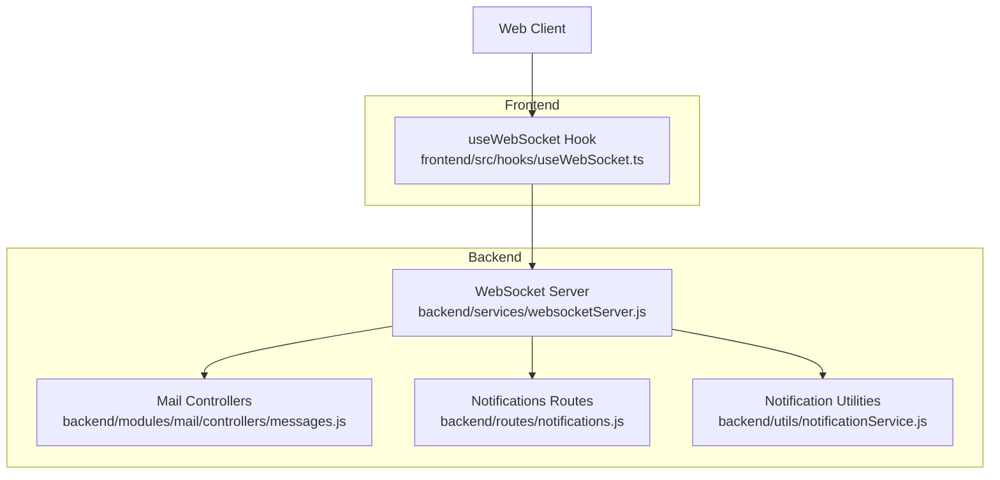
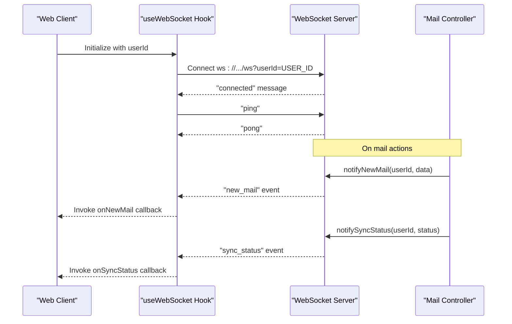
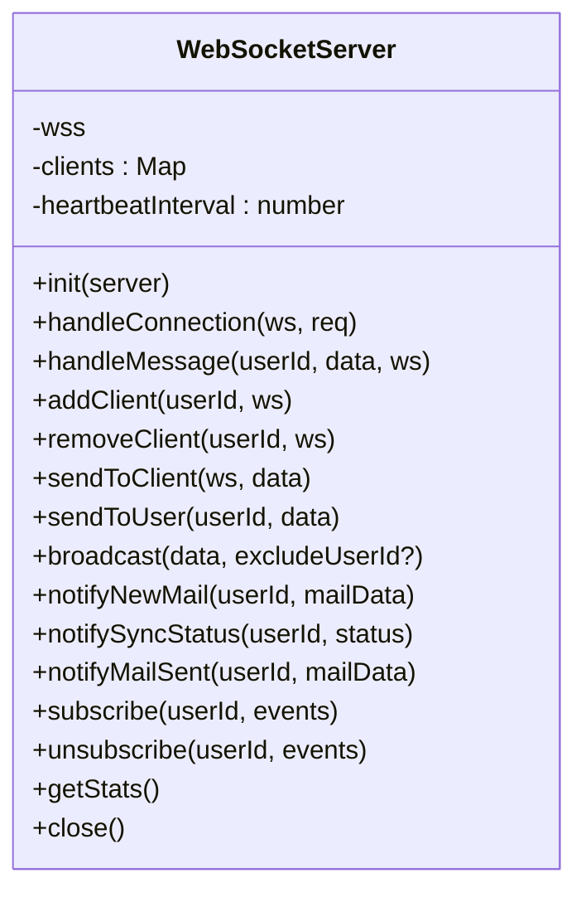
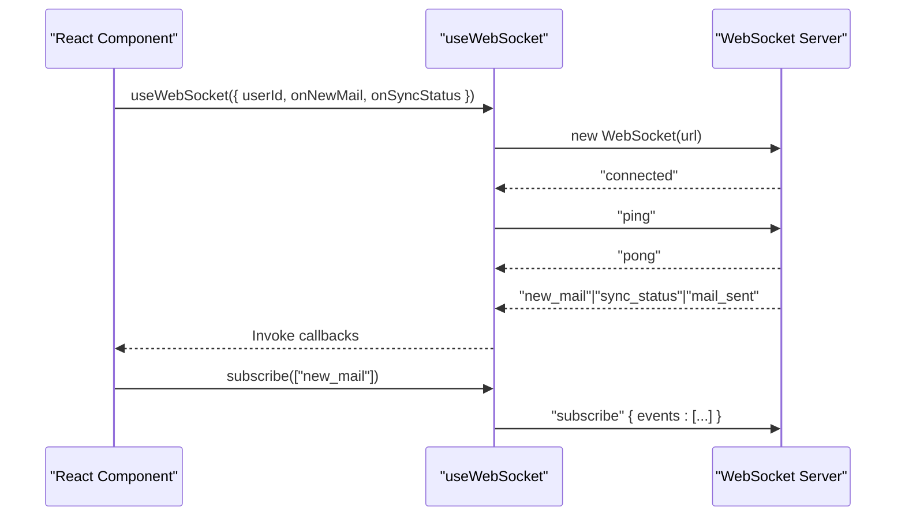
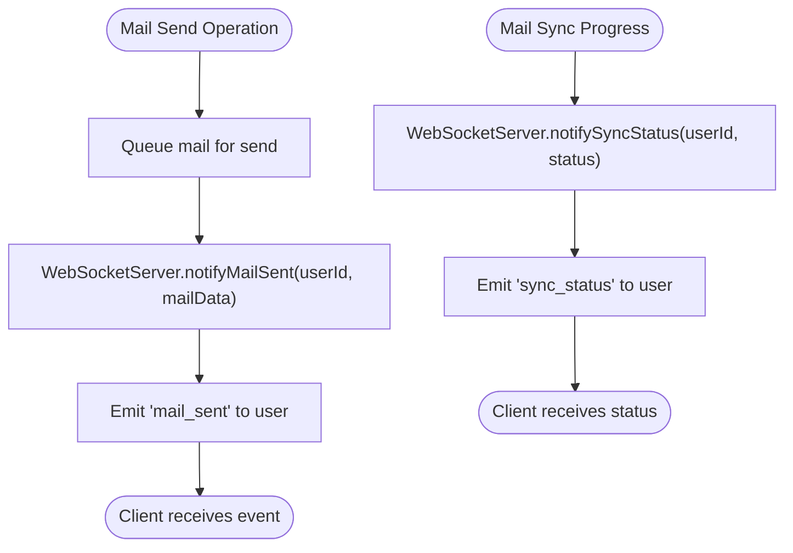
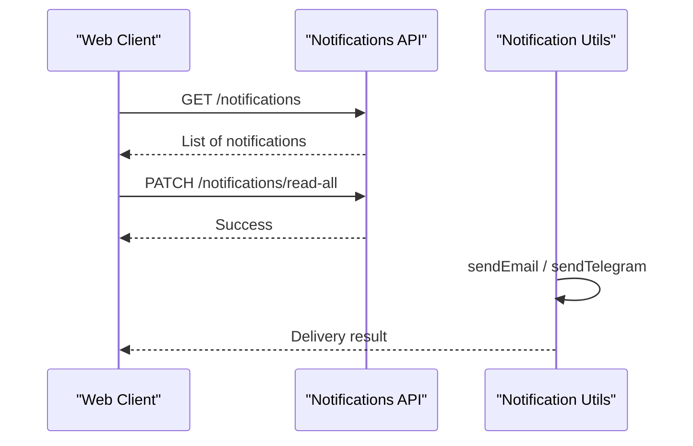
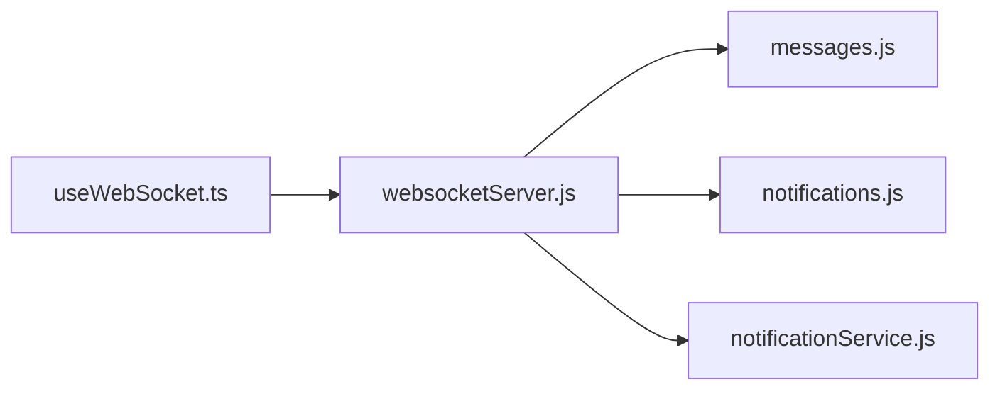

# Real-time Communication

<cite>
**Referenced Files in This Document**
- [websocketServer.js](file://backend/modules/notifications/services/websocketServer.js)
- [WEBSOCKET_REALTIME.md](file://docs/WEBSOCKET_REALTIME.md)
- [useWebSocket.ts](file://frontend/src/hooks/useWebSocket.ts)
- [notifications.js](file://backend/modules/notifications/routes.js)
- [notificationService.js](file://backend/utils/notificationService.js)
- [messages.js](file://backend/modules/mail/controllers/messages.js)
</cite>

## Table of Contents
1. [Introduction](#introduction)
2. [Project Structure](#project-structure)
3. [Core Components](#core-components)
4. [Architecture Overview](#architecture-overview)
5. [Detailed Component Analysis](#detailed-component-analysis)
6. [Dependency Analysis](#dependency-analysis)
7. [Performance Considerations](#performance-considerations)
8. [Troubleshooting Guide](#troubleshooting-guide)
9. [Conclusion](#conclusion)

## Introduction
This document describes the real-time communication implementation for Titan CRM, focusing on the WebSocket server, connection management, event broadcasting, and notification delivery mechanisms. It explains how the backend WebSocket server integrates with the frontend React hook, how real-time updates propagate for mail-related events, and how notification delivery is structured. Practical guidance is included for implementing custom real-time features, handling connection failures, and optimizing performance.

## Project Structure
The real-time system spans backend and frontend:
- Backend: WebSocket server, mail module, notification routes, and supporting utilities
- Frontend: React hook that manages WebSocket lifecycle and event handling

**Diagram sources**
- [websocketServer.js:15-310](file://backend/modules/notifications/services/websocketServer.js#L1-L241)
- [messages.js:247-307](file://backend/modules/mail/controllers/messages.js#L109)
- [notifications.js:6-22](file://backend/modules/notifications/routes.js#L6-L22)
- [notificationService.js:24-80](file://backend/utils/notificationService.js#L24-L80)
- [useWebSocket.ts:140-236](file://frontend/src/hooks/useWebSocket.ts#L140-L236)

**Section sources**
- [websocketServer.js:15-310](file://backend/modules/notifications/services/websocketServer.js#L1-L241)
- [WEBSOCKET_REALTIME.md:13-38](file://docs/WEBSOCKET_REALTIME.md#L13-L38)

## Core Components
- WebSocket Server: Manages connections, tracks users, handles messages, and broadcasts events
- Frontend Hook: Establishes and maintains WebSocket connections, parses messages, and exposes subscription controls
- Mail Module: Integrates with WebSocket server to emit mail-related real-time events
- Notifications: Provides REST endpoints and utilities for notification delivery

Key responsibilities:
- Connection lifecycle and heartbeat
- User-to-connection mapping and targeted messaging
- Event-driven broadcasting for mail and sync status
- Frontend subscription model for selective event reception

**Section sources**
- [websocketServer.js:15-310](file://backend/modules/notifications/services/websocketServer.js#L1-L241)
- [useWebSocket.ts:140-236](file://frontend/src/hooks/useWebSocket.ts#L140-L236)
- [messages.js:247-307](file://backend/modules/mail/controllers/messages.js#L109)
- [notifications.js:6-22](file://backend/modules/notifications/routes.js#L6-L22)

## Architecture Overview
The real-time pipeline connects the frontend React hook to the backend WebSocket server and mail module. The server maintains per-user connections and dispatches events to subscribed clients.

**Diagram sources**
- [websocketServer.js:229-265](file://backend/modules/notifications/services/websocketServer.js#L1-L241)
- [useWebSocket.ts:582-606](file://frontend/src/hooks/useWebSocket.ts#L253)
- [messages.js:247-307](file://backend/modules/mail/controllers/messages.js#L109)

## Detailed Component Analysis

### WebSocket Server
The backend WebSocket server provides:
- Connection initialization with user identification
- Heartbeat mechanism to detect dead connections
- User-to-connection mapping for targeted messaging
- Broadcast capabilities for global updates
- Dedicated notification methods for mail events

Implementation highlights:
- Tracks connections in a Map keyed by userId
- Handles "ping" and "pong" for liveness checks
- Supports "subscribe" and "unsubscribe" message types (placeholder for future event filtering)
- Emits typed events: "connected", "pong", "new_mail", "sync_status", "mail_sent"

**Diagram sources**
- [websocketServer.js:15-310](file://backend/modules/notifications/services/websocketServer.js#L1-L241)

**Section sources**
- [websocketServer.js:15-310](file://backend/modules/notifications/services/websocketServer.js#L1-L241)

### Frontend WebSocket Hook
The React hook encapsulates:
- Connection establishment with userId query parameter
- Automatic reconnection with configurable intervals
- Message parsing and dispatch to registered listeners
- Subscription management ("subscribe", "unsubscribe")
- Exposes connection state and last message

Behavior:
- Connects to ws://HOST/ws?userId=USER_ID
- Sends "ping" immediately upon open
- Dispatches "new_mail", "sync_status", "mail_sent" to callbacks
- Maintains a global connection instance across hook consumers

**Diagram sources**
- [useWebSocket.ts:79-124](file://frontend/src/hooks/useWebSocket.ts#L79-L124)
- [useWebSocket.ts:582-606](file://frontend/src/hooks/useWebSocket.ts#L253)
- [useWebSocket.ts:207-213](file://frontend/src/hooks/useWebSocket.ts#L207-L213)

**Section sources**
- [useWebSocket.ts:140-236](file://frontend/src/hooks/useWebSocket.ts#L140-L236)
- [useWebSocket.ts:79-124](file://frontend/src/hooks/useWebSocket.ts#L79-L124)
- [useWebSocket.ts:582-606](file://frontend/src/hooks/useWebSocket.ts#L253)

### Mail Module Integration
The mail controller coordinates real-time updates:
- On send operations, emits "mail_sent" notifications to the originating user
- On sync operations, emits "sync_status" updates to the user
- The WebSocket server provides dedicated methods to deliver these events

**Diagram sources**
- [messages.js:290-302](file://backend/modules/mail/controllers/messages.js#L109)
- [websocketServer.js:257-265](file://backend/modules/notifications/services/websocketServer.js#L1-L241)

**Section sources**
- [messages.js:247-307](file://backend/modules/mail/controllers/messages.js#L109)
- [websocketServer.js:229-265](file://backend/modules/notifications/services/websocketServer.js#L1-L241)

### Notifications System
While the WebSocket server focuses on real-time events, the notifications system provides persistent notification delivery via REST endpoints and utilities:
- REST endpoints for listing, marking as read, and deleting notifications
- Notification utilities for email and Telegram delivery

**Diagram sources**
- [notifications.js:6-22](file://backend/modules/notifications/routes.js#L6-L22)
- [notificationService.js:24-80](file://backend/utils/notificationService.js#L24-L80)

**Section sources**
- [notifications.js:6-22](file://backend/modules/notifications/routes.js#L6-L22)
- [notificationService.js:24-80](file://backend/utils/notificationService.js#L24-L80)

## Dependency Analysis
The real-time system exhibits clear separation of concerns:
- Frontend hook depends on WebSocket protocol and backend endpoints
- Backend WebSocket server depends on the mail module for emitting events
- Notifications are decoupled from WebSocket and exposed via REST

**Diagram sources**
- [useWebSocket.ts:140-236](file://frontend/src/hooks/useWebSocket.ts#L140-L236)
- [websocketServer.js:15-310](file://backend/modules/notifications/services/websocketServer.js#L1-L241)
- [messages.js:247-307](file://backend/modules/mail/controllers/messages.js#L109)
- [notifications.js:6-22](file://backend/modules/notifications/routes.js#L6-L22)
- [notificationService.js:24-80](file://backend/utils/notificationService.js#L24-L80)

**Section sources**
- [useWebSocket.ts:140-236](file://frontend/src/hooks/useWebSocket.ts#L140-L236)
- [websocketServer.js:15-310](file://backend/modules/notifications/services/websocketServer.js#L1-L241)
- [messages.js:247-307](file://backend/modules/mail/controllers/messages.js#L109)
- [notifications.js:6-22](file://backend/modules/notifications/routes.js#L6-L22)
- [notificationService.js:24-80](file://backend/utils/notificationService.js#L24-L80)

## Performance Considerations
- Connection pooling and reuse: The frontend maintains a single global WebSocket instance per userId to minimize overhead
- Targeted messaging: Use sendToUser to avoid broadcasting to all connections
- Heartbeat tuning: Adjust heartbeat interval to balance responsiveness and network usage
- Backpressure: Limit event frequency for high-volume scenarios (e.g., sync progress updates)
- Scalability: For horizontal scaling, use a shared pub/sub or Redis-backed session store to coordinate connections across nodes

## Troubleshooting Guide
Common issues and resolutions:
- Connection failures
  - Verify userId query parameter and server availability
  - Check protocol (ws vs wss) and host resolution
- Frequent reconnections
  - Increase reconnectInterval in the hook
  - Inspect server-side heartbeat and client ping behavior
- Events not received
  - Confirm subscription to relevant events
  - Review server logs for message handling and user mapping

**Section sources**
- [WEBSOCKET_REALTIME.md:272-318](file://docs/WEBSOCKET_REALTIME.md#L272-L318)
- [useWebSocket.ts:79-124](file://frontend/src/hooks/useWebSocket.ts#L79-L124)

## Conclusion
Titan CRM’s real-time communication combines a robust WebSocket server with a flexible frontend hook to deliver timely updates for mail operations and sync status. The system supports targeted messaging, heartbeat-based liveness detection, and a subscription model for selective event reception. By leveraging REST-based notifications alongside WebSocket events, the platform achieves both immediate real-time feedback and persistent notification delivery. For production deployments, consider implementing scalable connection management and rate-limiting strategies to optimize performance under load.