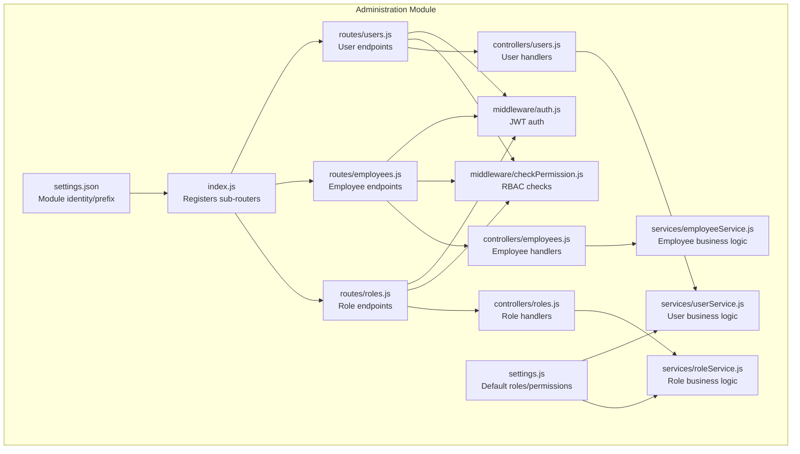
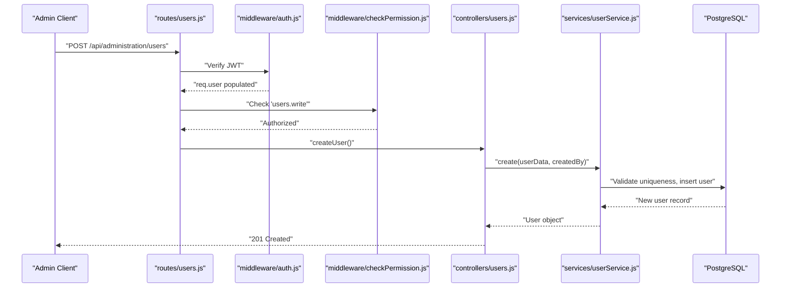
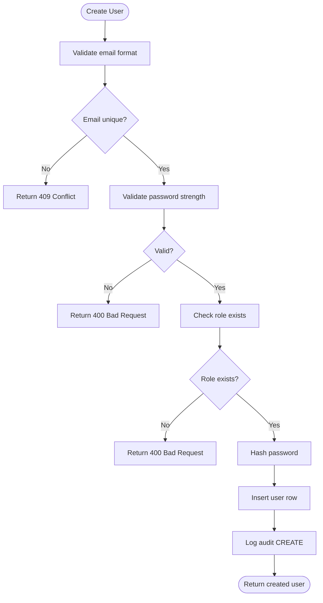
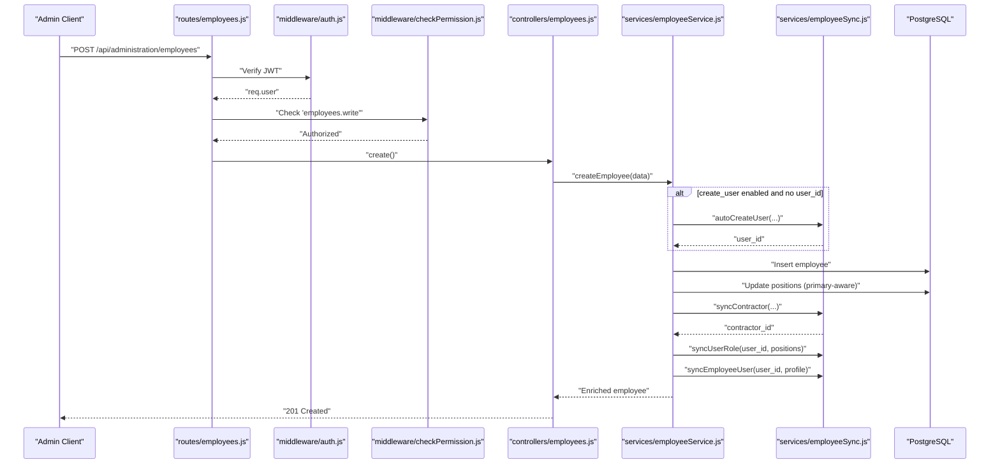
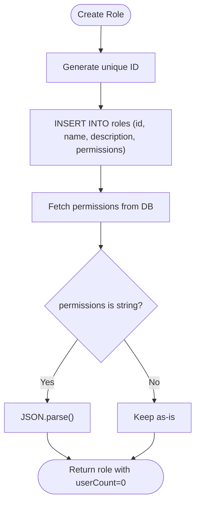
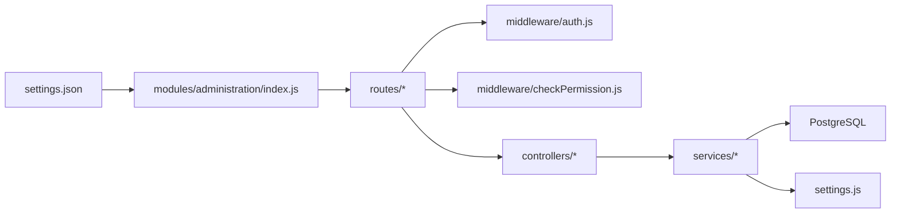

# Administration Module

> 📄 **Синхронизировано** с [docs/modules/administration.md](../../../docs/modules/administration.md) — актуальная компактная спецификация модуля (рус.). Ниже — подробный англоязычный разбор с исходниками и диаграммами.

<cite>
**Referenced Files in This Document**
- [index.js](file://backend/modules/administration/index.js)
- [README.md](file://backend/modules/administration/README.md)
- [settings.js](file://backend/modules/administration/settings.js)
- [settings.json](file://backend/modules/administration/settings.json)
- [users.js](file://backend/modules/administration/controllers/users.js)
- [userService.js](file://backend/modules/administration/services/userService.js)
- [users.js](file://backend/modules/administration/routes/users.js)
- [employees.js](file://backend/modules/administration/controllers/employees.js)
- [employeeService.js](file://backend/modules/administration/services/employeeService.js)
- [employees.js](file://backend/modules/administration/routes/employees.js)
- [roles.js](file://backend/modules/administration/controllers/roles.js)
- [roleService.js](file://backend/modules/administration/services/roleService.js)
- [auth.js](file://backend/middleware/auth.js)
- [checkPermission.js](file://backend/middleware/checkPermission.js)
</cite>

## Table of Contents
1. [Introduction](#introduction)
2. [Project Structure](#project-structure)
3. [Core Components](#core-components)
4. [Architecture Overview](#architecture-overview)
5. [Detailed Component Analysis](#detailed-component-analysis)
6. [Dependency Analysis](#dependency-analysis)
7. [Performance Considerations](#performance-considerations)
8. [Troubleshooting Guide](#troubleshooting-guide)
9. [Conclusion](#conclusion)

## Introduction
The Administration module provides centralized capabilities for managing users, employees, roles, permissions, organizational structure, and company settings. It exposes REST endpoints under a dedicated prefix and integrates tightly with authentication and authorization middleware to enforce access control. The module consolidates:
- User management: CRUD, password changes, blocking/unblocking, and audit logging
- Employee management: HR records, department/position associations, and user-employee synchronization
- Role and permission management: role CRUD and permission enumeration
- Company settings: module configuration and visibility defaults

## Project Structure
The module follows a layered structure with routes, controllers, services, and settings. It registers sub-routers for users, employees, roles, permissions, organizational units, and company endpoints.

**Diagram sources**
- [index.js:1-34](file://backend/modules/administration/index.js#L1-L33)
- [users.js:1-45](file://backend/modules/administration/routes/users.js#L1-L45)
- [employees.js:1-21](file://backend/modules/administration/routes/employees.js#L1-L20)
- [users.js:1-132](file://backend/modules/administration/controllers/users.js#L1-L131)
- [employees.js:1-64](file://backend/modules/administration/controllers/employees.js#L1-L63)
- [roles.js:1-56](file://backend/modules/administration/controllers/roles.js#L1-L55)
- [userService.js:1-554](file://backend/modules/administration/services/userService.js#L1-L553)
- [employeeService.js:1-306](file://backend/modules/administration/services/employeeService.js#L1-L305)
- [roleService.js:1-109](file://backend/modules/administration/services/roleService.js#L1-L108)
- [auth.js](file://backend/middleware/auth.js)
- [checkPermission.js](file://backend/middleware/checkPermission.js)
- [settings.js:1-93](file://backend/modules/administration/settings.js#L1-L92)
- [settings.json:1-7](file://backend/modules/administration/settings.json#L1-L6)

**Section sources**
- [index.js:1-34](file://backend/modules/administration/index.js#L1-L33)
- [README.md:1-103](file://backend/modules/administration/README.md#L1-L102)
- [settings.json:1-7](file://backend/modules/administration/settings.json#L1-L6)

## Core Components
- Module entry and routing: Registers sub-routers for users, employees, roles, permissions, org, and company under a shared prefix.
- Settings: Defines default roles and permissions, plus visibility defaults for listing resources.
- Controllers: Expose HTTP endpoints for user CRUD, listing, password changes, blocking/unblocking, and employee/role operations.
- Services: Implement business logic, validations, database operations, and cross-entity synchronization (e.g., user-employee).
- Middleware: Authentication via JWT and RBAC enforcement via permission checks.

Key responsibilities:
- User management: creation, retrieval, listing with filters, updates, soft deletion, password changes, blocking/unblocking, and audit logging.
- Employee management: listing/enriched queries, creation/update with position associations, contractor/user synchronization, and cleanup on delete.
- Role management: listing roles with user counts, CRUD operations, and permission enumeration.

**Section sources**
- [index.js:16-22](file://backend/modules/administration/index.js#L16-L22)
- [settings.js:6-47](file://backend/modules/administration/settings.js#L6-L47)
- [users.js:1-132](file://backend/modules/administration/controllers/users.js#L1-L131)
- [userService.js:51-554](file://backend/modules/administration/services/userService.js#L51-L553)
- [employees.js:1-64](file://backend/modules/administration/controllers/employees.js#L1-L63)
- [employeeService.js:1-306](file://backend/modules/administration/services/employeeService.js#L1-L305)
- [roles.js:1-56](file://backend/modules/administration/controllers/roles.js#L1-L55)
- [roleService.js:1-109](file://backend/modules/administration/services/roleService.js#L1-L108)

## Architecture Overview
The module enforces authentication and authorization at the route level, delegates to controllers, and executes business logic in services. Audit logs capture significant administrative actions.

**Diagram sources**
- [users.js:18-19](file://backend/modules/administration/routes/users.js#L18-L19)
- [auth.js](file://backend/middleware/auth.js)
- [checkPermission.js](file://backend/middleware/checkPermission.js)
- [users.js:9-13](file://backend/modules/administration/controllers/users.js#L9-L13)
- [userService.js:76-155](file://backend/modules/administration/services/userService.js#L76-L155)

## Detailed Component Analysis

### User Management
- Endpoints:
  - List users (paginated) and legacy flat list
  - Get user by ID
  - Create, update, soft-delete
  - Change password (supports self-change and admin override)
  - Block/unblock users
- Permissions enforced:
  - Read: users.read
  - Write: users.write
  - Delete: users.delete
  - Self-read override for password changes
- Validation and safety:
  - Email uniqueness and format
  - Password strength and hashing
  - Role existence checks
  - Audit logging for create/update/delete/password_change
- Blocking:
  - Adds block-related columns if missing
  - Tracks admin who performed action, reason, timestamps

**Diagram sources**
- [userService.js:76-155](file://backend/modules/administration/services/userService.js#L76-L155)

**Section sources**
- [users.js:12-42](file://backend/modules/administration/routes/users.js#L12-L42)
- [users.js:9-132](file://backend/modules/administration/controllers/users.js#L9-L131)
- [userService.js:24-49](file://backend/modules/administration/services/userService.js#L24-L49)
- [userService.js:110-122](file://backend/modules/administration/services/userService.js#L110-L122)
- [userService.js:124-131](file://backend/modules/administration/services/userService.js#L124-L131)
- [userService.js:144-147](file://backend/modules/administration/services/userService.js#L144-L147)
- [users.js:38-42](file://backend/modules/administration/routes/users.js#L38-L42)

### Employee Management
- Endpoints:
  - List employees with optional filters (status, department, position)
  - Get employee by ID (enriched with position, department, user, currency info)
  - Create employee (auto-create linked user based on primary position role)
  - Update employee (supports updating positions and syncing user/contractor)
  - Delete employee (cleans up department head reference and contractor status)
- Position associations:
  - Supports many-to-many via junction table
  - Can set primary position; otherwise first provided position becomes primary
- Synchronization:
  - Auto-creates user when requested and infers role from primary position
  - Syncs user profile and role to match employee data
  - Syncs contractor association and status

**Diagram sources**
- [employees.js:16-20](file://backend/modules/administration/routes/employees.js#L16-L20)
- [employeeService.js:143-205](file://backend/modules/administration/services/employeeService.js#L143-L205)

**Section sources**
- [employees.js:14-18](file://backend/modules/administration/routes/employees.js#L14-L18)
- [employees.js:13-55](file://backend/modules/administration/controllers/employees.js#L13-L55)
- [employeeService.js:12-47](file://backend/modules/administration/services/employeeService.js#L12-L47)
- [employeeService.js:52-66](file://backend/modules/administration/services/employeeService.js#L52-L66)
- [employeeService.js:143-205](file://backend/modules/administration/services/employeeService.js#L143-L205)
- [employeeService.js:209-282](file://backend/modules/administration/services/employeeService.js#L209-L282)
- [employeeService.js:287-297](file://backend/modules/administration/services/employeeService.js#L287-L297)

### Role and Permission Management
- Endpoints:
  - List roles (with user counts)
  - Create role (auto-generate ID, store permissions as JSON)
  - Update role (update name/description/permissions)
  - Delete role (prevent deletion if assigned to users)
  - Enumerate all permissions
- Defaults:
  - Default roles and permissions defined centrally
  - Visibility settings for listing users/employees

**Diagram sources**
- [roleService.js:35-51](file://backend/modules/administration/services/roleService.js#L35-L51)

**Section sources**
- [roles.js:13-48](file://backend/modules/administration/controllers/roles.js#L13-L48)
- [roleService.js:11-28](file://backend/modules/administration/services/roleService.js#L11-L28)
- [roleService.js:35-78](file://backend/modules/administration/services/roleService.js#L35-L78)
- [roleService.js:84-91](file://backend/modules/administration/services/roleService.js#L84-L91)
- [roleService.js:97-100](file://backend/modules/administration/services/roleService.js#L97-L100)
- [settings.js:6-47](file://backend/modules/administration/settings.js#L6-L47)

### Organization and Company Settings
- The module registers routes for organizational units and company endpoints via sub-routers.
- Company settings are configured via module settings JSON and default visibility settings in settings.js.
- Organizational structure is managed through departments and positions, with employees linked to departments and positions.

**Section sources**
- [index.js:12-14](file://backend/modules/administration/index.js#L12-L14)
- [settings.json:1-7](file://backend/modules/administration/settings.json#L1-L6)
- [settings.js:77-86](file://backend/modules/administration/settings.js#L77-L86)

## Dependency Analysis
- Routing depends on authentication and permission middleware.
- Controllers depend on services for business logic.
- Services depend on the database client and may coordinate with synchronization utilities.
- Settings define default roles/permissions consumed by services.

**Diagram sources**
- [users.js:4-5](file://backend/modules/administration/routes/users.js#L4-L5)
- [employees.js:8-9](file://backend/modules/administration/routes/employees.js#L8-L9)
- [users.js:1-132](file://backend/modules/administration/controllers/users.js#L1-L131)
- [employees.js:1-64](file://backend/modules/administration/controllers/employees.js#L1-L63)
- [userService.js:1-13](file://backend/modules/administration/services/userService.js#L1-L13)
- [employeeService.js:5-7](file://backend/modules/administration/services/employeeService.js#L5-L7)
- [settings.js:13](file://backend/modules/administration/settings.js#L13)
- [index.js:9-14](file://backend/modules/administration/index.js#L9-L14)
- [settings.json:5](file://backend/modules/administration/settings.json#L5)

**Section sources**
- [users.js:4-5](file://backend/modules/administration/routes/users.js#L4-L5)
- [employees.js:8-9](file://backend/modules/administration/routes/employees.js#L8-L9)
- [index.js:9-14](file://backend/modules/administration/index.js#L9-L14)
- [settings.js:13](file://backend/modules/administration/settings.js#L13)

## Performance Considerations
- Pagination and filtering: User listing supports pagination and active-status filtering to reduce payload sizes.
- Enriched queries: Employee listing joins positions/departments/users/currency; ensure appropriate indexes exist on join keys.
- Audit logging: Logging occurs after successful operations; consider batching or async logging for high-throughput scenarios.
- Password hashing: Uses a moderate salt round count; adjust based on security and performance requirements.

[No sources needed since this section provides general guidance]

## Troubleshooting Guide
Common issues and resolutions:
- Authentication failures:
  - Ensure requests include a valid JWT via the expected header/path used by the auth middleware.
- Permission denied:
  - Verify the requesting user has the required permission(s) for the endpoint. Some endpoints support multiple modes (e.g., self-read override).
- Duplicate email during user creation:
  - The service validates uniqueness and returns a conflict error if the email already exists.
- Invalid role during user creation/update:
  - Ensure the role ID exists in the roles table.
- Password change failures:
  - Current password must match; new password must satisfy strength requirements.
- Employee creation requiring user:
  - If auto-creating a user, the primary position’s role is used to set the user’s role.

Operational tips:
- Use the audit log to track administrative actions.
- For employee deletion, the system clears department head references and contractor status.

**Section sources**
- [auth.js](file://backend/middleware/auth.js)
- [checkPermission.js](file://backend/middleware/checkPermission.js)
- [users.js:81-83](file://backend/modules/administration/controllers/users.js#L81-L83)
- [userService.js:96-108](file://backend/modules/administration/services/userService.js#L96-L108)
- [userService.js:110-122](file://backend/modules/administration/services/userService.js#L110-L122)
- [userService.js:426-432](file://backend/modules/administration/services/userService.js#L426-L432)
- [userService.js:434-440](file://backend/modules/administration/services/userService.js#L434-L440)
- [employeeService.js:156-164](file://backend/modules/administration/services/employeeService.js#L156-L164)
- [employeeService.js:287-297](file://backend/modules/administration/services/employeeService.js#L287-L297)

## Conclusion
The Administration module provides a cohesive foundation for user, employee, role, and organizational management with strong RBAC enforcement and auditability. Its modular design enables clear separation of concerns, while default configurations and permission matrices simplify initial setup. Integrating frontend authentication components with the backend’s auth and permission middleware ensures secure and auditable administrative workflows.