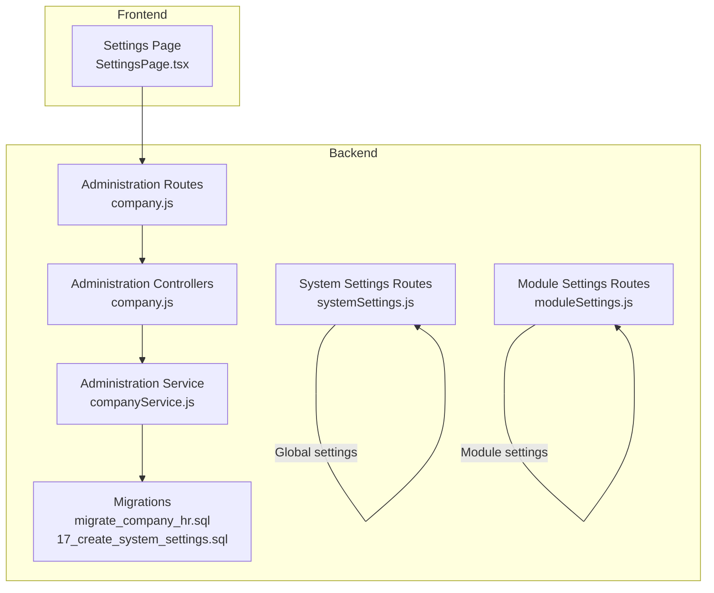
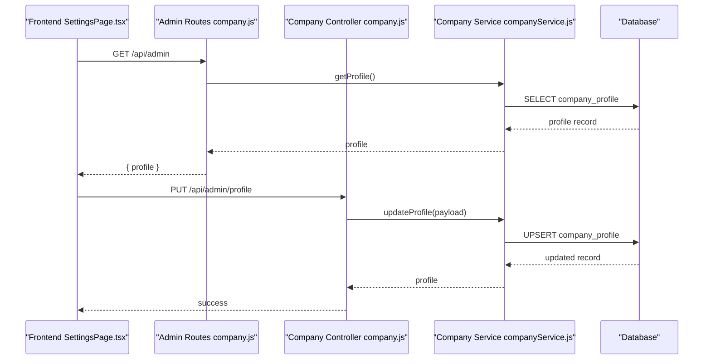
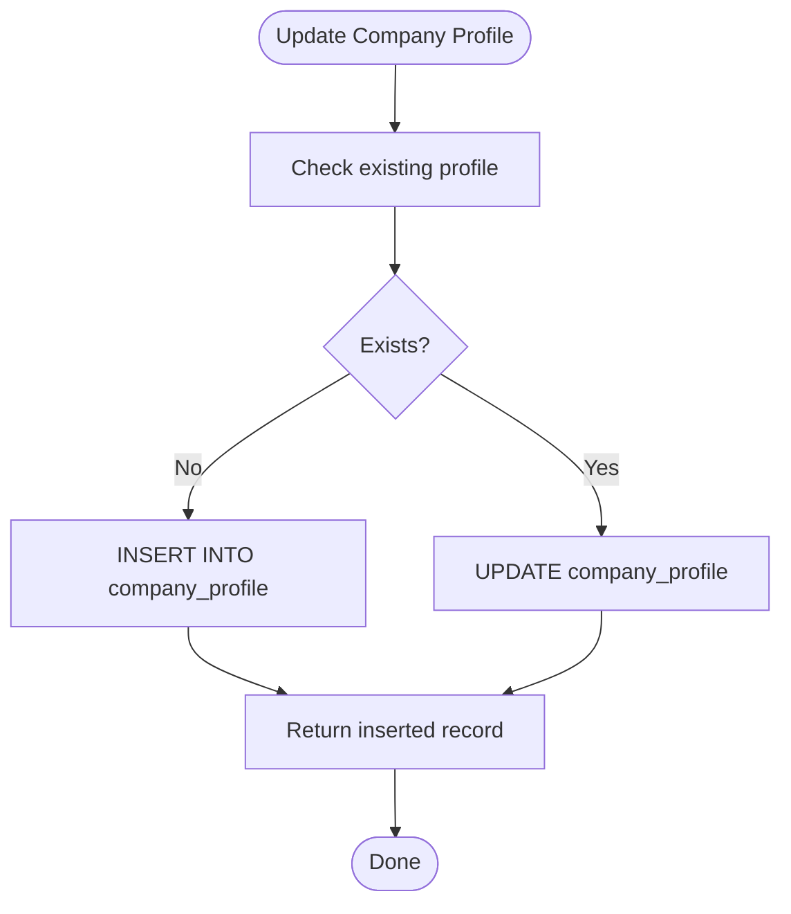
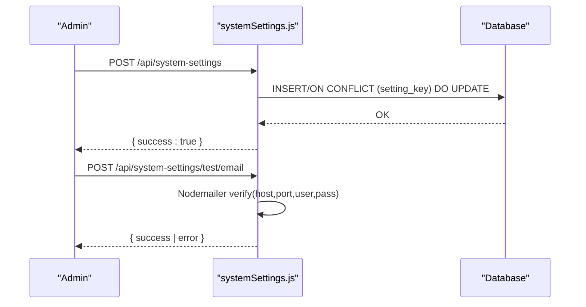
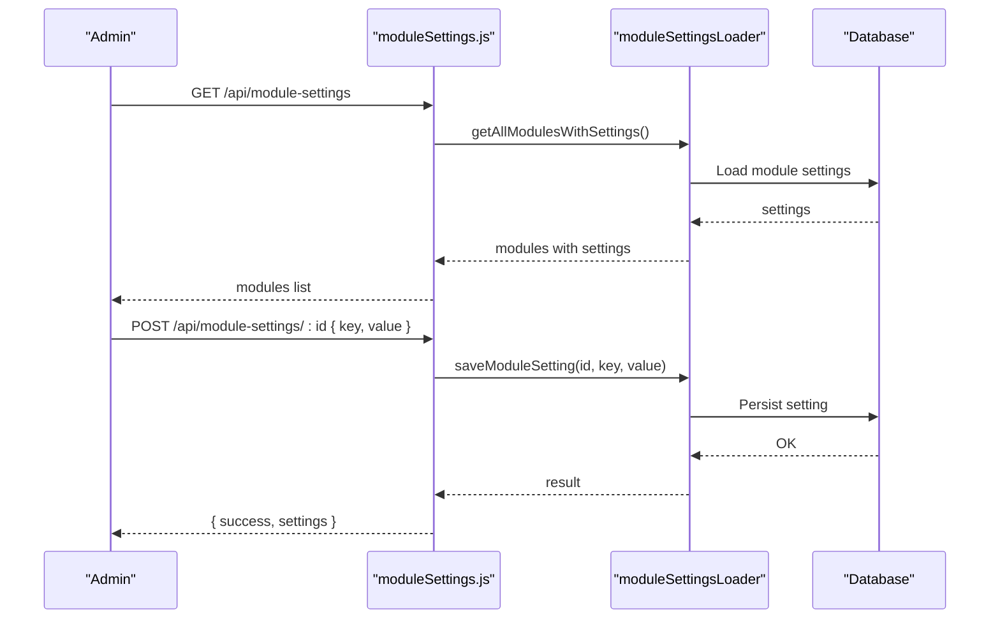
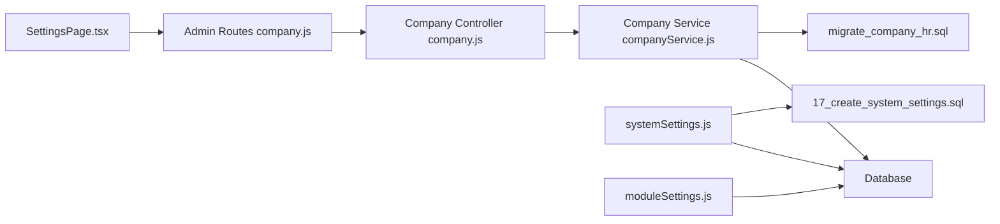

# Company Settings

<cite>
**Referenced Files in This Document**
- [company.js](file://backend/modules/administration/controllers/company.js)
- [company.js](file://backend/modules/administration/routes/company.js)
- [companyService.js](file://backend/modules/administration/services/companyService.js)
- [systemSettings.js](file://backend/modules/settings/routes/systemSettings.js)
- [moduleSettings.js](file://backend/modules/settings/routes/moduleSettings.js)
- [migrate_company_hr.sql](file://backend/migrations/migrate_company_hr.sql)
- [17_create_system_settings.sql](file://backend/migrations/17_create_system_settings.sql)
- [settings.js](file://backend/modules/administration/settings.js)
- [settings.json](file://backend/modules/administration/settings.json)
- [SettingsPage.tsx](file://frontend/src/modules/settings/pages/SettingsPage.tsx)
</cite>

## Table of Contents
1. [Introduction](#introduction)
2. [Project Structure](#project-structure)
3. [Core Components](#core-components)
4. [Architecture Overview](#architecture-overview)
5. [Detailed Component Analysis](#detailed-component-analysis)
6. [Dependency Analysis](#dependency-analysis)
7. [Performance Considerations](#performance-considerations)
8. [Troubleshooting Guide](#troubleshooting-guide)
9. [Conclusion](#conclusion)

## Introduction
This document describes the Company Settings system in Titan CRM. It covers company profile management (company information and branding), financial account management, system-wide settings, module configuration management, and administrative controls. It also explains how company settings relate to module configurations, provides practical examples, and documents persistence and validation mechanisms.

## Project Structure
The Company Settings system spans backend controllers, services, routes, migrations, and frontend settings pages:

- Backend
  - Administration module: company profile and accounts management
  - System settings: global configuration storage and validation
  - Module settings: per-module configuration management
- Frontend
  - Settings page with navigation for company profile and accounts

**Diagram sources**
- [company.js:1-67](file://backend/modules/administration/controllers/company.js#L1-L66)
- [company.js:1-29](file://backend/modules/administration/routes/company.js#L1-L28)
- [companyService.js:1-134](file://backend/modules/administration/services/companyService.js#L1-L133)
- [systemSettings.js:1-221](file://backend/modules/settings/routes/systemSettings.js#L1-L8)
- [moduleSettings.js:1-261](file://backend/modules/settings/routes/moduleSettings.js#L1-L190)
- [migrate_company_hr.sql:1-72](file://backend/migrations/migrate_company_hr.sql#L1-L72)
- [17_create_system_settings.sql:1-15](file://backend/migrations/17_create_system_settings.sql#L1-L14)
- [SettingsPage.tsx:181-430](file://frontend/src/modules/settings/pages/SettingsPage.tsx#L181-L430)

**Section sources**
- [company.js:1-67](file://backend/modules/administration/controllers/company.js#L1-L66)
- [company.js:1-29](file://backend/modules/administration/routes/company.js#L1-L28)
- [companyService.js:1-134](file://backend/modules/administration/services/companyService.js#L1-L133)
- [systemSettings.js:1-221](file://backend/modules/settings/routes/systemSettings.js#L1-L8)
- [moduleSettings.js:1-261](file://backend/modules/settings/routes/moduleSettings.js#L1-L190)
- [migrate_company_hr.sql:1-72](file://backend/migrations/migrate_company_hr.sql#L1-L72)
- [17_create_system_settings.sql:1-15](file://backend/migrations/17_create_system_settings.sql#L1-L14)
- [SettingsPage.tsx:181-430](file://frontend/src/modules/settings/pages/SettingsPage.tsx#L181-L430)

## Core Components
- Company Profile Management
  - Retrieve and update company profile (legal/business info, contact details, branding)
  - CRUD operations for company financial accounts
- System Settings
  - Global configuration storage and retrieval
  - Validation helpers for integrations (email, Telegram)
- Module Settings
  - Dynamic per-module configuration management
  - Bulk edit settings and cross-module synchronization
- Administration Defaults and Visibility
  - Default roles, permissions, and visibility settings for administration

**Section sources**
- [companyService.js:10-124](file://backend/modules/administration/services/companyService.js#L10-L124)
- [systemSettings.js:11-65](file://backend/modules/settings/routes/systemSettings.js#L1-L8)
- [moduleSettings.js:26-196](file://backend/modules/settings/routes/moduleSettings.js#L1-L190)
- [settings.js:6-92](file://backend/modules/administration/settings.js#L6-L92)

## Architecture Overview
The system follows a layered architecture:
- Frontend presents settings sections and navigates to company profile/accounts
- Backend routes handle requests and delegate to services
- Services encapsulate persistence logic and business rules
- Migrations define schema for company profile, accounts, and system settings
- Module settings loader integrates with per-module configuration

**Diagram sources**
- [SettingsPage.tsx:181-430](file://frontend/src/modules/settings/pages/SettingsPage.tsx#L181-L430)
- [company.js:13-16](file://backend/modules/administration/routes/company.js#L13-L16)
- [company.js:12-23](file://backend/modules/administration/controllers/company.js#L12-L23)
- [companyService.js:10-53](file://backend/modules/administration/services/companyService.js#L10-L53)
- [migrate_company_hr.sql:17-35](file://backend/migrations/migrate_company_hr.sql#L17-L35)

## Detailed Component Analysis

### Company Profile and Accounts
- Company Profile
  - Fields include legal/full name, addresses, tax IDs, banking info, contact details, and logo URL
  - Upsert logic ensures a single profile record exists
- Company Accounts
  - Supports multiple accounts with currency, type, bank details, default flag, and activity status
  - Enforces single default account via update logic

**Diagram sources**
- [companyService.js:18-53](file://backend/modules/administration/services/companyService.js#L18-L53)

**Section sources**
- [companyService.js:10-124](file://backend/modules/administration/services/companyService.js#L10-L124)
- [company.js:12-57](file://backend/modules/administration/controllers/company.js#L12-L57)
- [company.js:13-26](file://backend/modules/administration/routes/company.js#L13-L26)
- [migrate_company_hr.sql:17-53](file://backend/migrations/migrate_company_hr.sql#L17-L53)

### System Settings Management
- Storage
  - Global settings persisted in a JSONB table keyed by setting keys
  - Safe upsert pattern prevents conflicts
- Validation and Testing
  - SMTP connection testing
  - Telegram bot token and optional chat message testing
  - Module-specific stats retrieval (e.g., enrichment service usage)

**Diagram sources**
- [systemSettings.js:43-88](file://backend/modules/settings/routes/systemSettings.js#L1-L8)
- [17_create_system_settings.sql:4-14](file://backend/migrations/17_create_system_settings.sql#L4-L14)

**Section sources**
- [systemSettings.js:11-65](file://backend/modules/settings/routes/systemSettings.js#L1-L8)
- [systemSettings.js:67-88](file://backend/modules/settings/routes/systemSettings.js#L1-L8)
- [systemSettings.js:169-218](file://backend/modules/settings/routes/systemSettings.js#L1-L8)
- [17_create_system_settings.sql:1-15](file://backend/migrations/17_create_system_settings.sql#L1-L14)

### Module Settings Management
- Retrieval
  - Combine static module settings with dynamic database-backed overrides
- Updates
  - Single key updates and batch updates with validation
  - Optional cross-module synchronization (e.g., statistics visibility)
- Bulk Edit Settings
  - Per-module bulk edit configuration and enabled fields

**Diagram sources**
- [moduleSettings.js:26-72](file://backend/modules/settings/routes/moduleSettings.js#L26-L72)
- [moduleSettings.js:95-126](file://backend/modules/settings/routes/moduleSettings.js#L95-L126)
- [moduleSettings.js:133-168](file://backend/modules/settings/routes/moduleSettings.js#L133-L168)

**Section sources**
- [moduleSettings.js:26-196](file://backend/modules/settings/routes/moduleSettings.js#L1-L190)
- [moduleSettings.js:198-258](file://backend/modules/settings/routes/moduleSettings.js#L1-L190)

### Administration Defaults and Visibility
- Default roles and permissions for core resources
- Visibility preferences for inactive/deleted records in administration

**Section sources**
- [settings.js:6-92](file://backend/modules/administration/settings.js#L6-L92)
- [settings.json:1-7](file://backend/modules/administration/settings.json#L1-L6)

### Frontend Integration
- Settings page organizes company settings under a dedicated category
- Navigation items for company profile, accounts, and currencies

**Section sources**
- [SettingsPage.tsx:181-430](file://frontend/src/modules/settings/pages/SettingsPage.tsx#L181-L430)

## Dependency Analysis
- Controllers depend on services for business logic
- Services depend on the database client for persistence
- Routes expose endpoints for company, system, and module settings
- Migrations define schema for company profile, accounts, and system settings
- Module settings loader bridges static module definitions with dynamic database-backed settings

**Diagram sources**
- [SettingsPage.tsx:181-430](file://frontend/src/modules/settings/pages/SettingsPage.tsx#L181-L430)
- [company.js:1-29](file://backend/modules/administration/routes/company.js#L1-L28)
- [company.js:1-67](file://backend/modules/administration/controllers/company.js#L1-L66)
- [companyService.js:1-134](file://backend/modules/administration/services/companyService.js#L1-L133)
- [systemSettings.js:1-221](file://backend/modules/settings/routes/systemSettings.js#L1-L8)
- [moduleSettings.js:1-261](file://backend/modules/settings/routes/moduleSettings.js#L1-L190)
- [migrate_company_hr.sql:1-72](file://backend/migrations/migrate_company_hr.sql#L1-L72)
- [17_create_system_settings.sql:1-15](file://backend/migrations/17_create_system_settings.sql#L1-L14)

**Section sources**
- [company.js:5-6](file://backend/modules/administration/controllers/company.js#L5-L6)
- [companyService.js](file://backend/modules/administration/services/companyService.js#L5)
- [systemSettings.js](file://backend/modules/settings/routes/systemSettings.js#L4)
- [moduleSettings.js](file://backend/modules/settings/routes/moduleSettings.js#L8)

## Performance Considerations
- Company profile and accounts queries use targeted selects and minimal joins; ensure appropriate indexing on frequently filtered columns.
- System settings retrieval aggregates rows into a single object; keep the number of settings manageable.
- Module settings updates apply batch writes; consider throttling or batching large updates to avoid contention.
- Currency and enrichment statistics rely on daily aggregation; ensure scheduled jobs maintain performance.

## Troubleshooting Guide
- Company Profile Not Found
  - Verify a profile record exists; the service performs an upsert ensuring one record.
- Account Default Conflicts
  - Updating an account to default automatically clears other defaults; confirm intended default selection.
- SMTP/Telegram Tests Fail
  - Validate credentials and network connectivity; the system routes return explicit errors for invalid tokens or connection failures.
- Module Settings Not Persisting
  - Confirm the setting key is provided and the module exists; check for loader errors and database write results.

**Section sources**
- [companyService.js:26-53](file://backend/modules/administration/services/companyService.js#L26-L53)
- [companyService.js:78-104](file://backend/modules/administration/services/companyService.js#L78-L104)
- [systemSettings.js:67-88](file://backend/modules/settings/routes/systemSettings.js#L1-L8)
- [systemSettings.js:169-218](file://backend/modules/settings/routes/systemSettings.js#L1-L8)
- [moduleSettings.js:95-126](file://backend/modules/settings/routes/moduleSettings.js#L95-L126)

## Conclusion
The Company Settings system provides a cohesive foundation for managing company profile and accounts, system-wide configuration, and module-specific settings. Its layered design separates concerns, while migrations and loaders ensure robust persistence and extensibility. Administrators can configure branding, financial accounts, integrations, and module behaviors through well-defined APIs and a structured frontend interface.