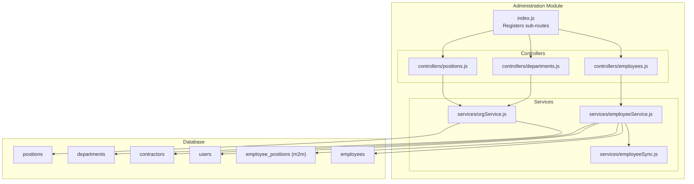
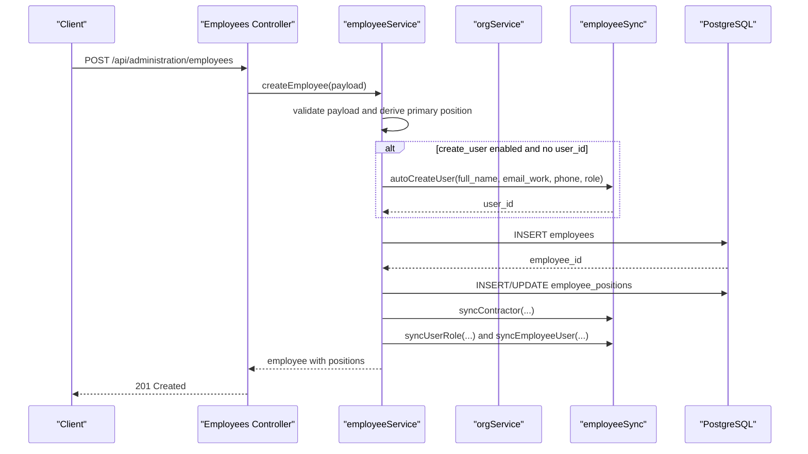
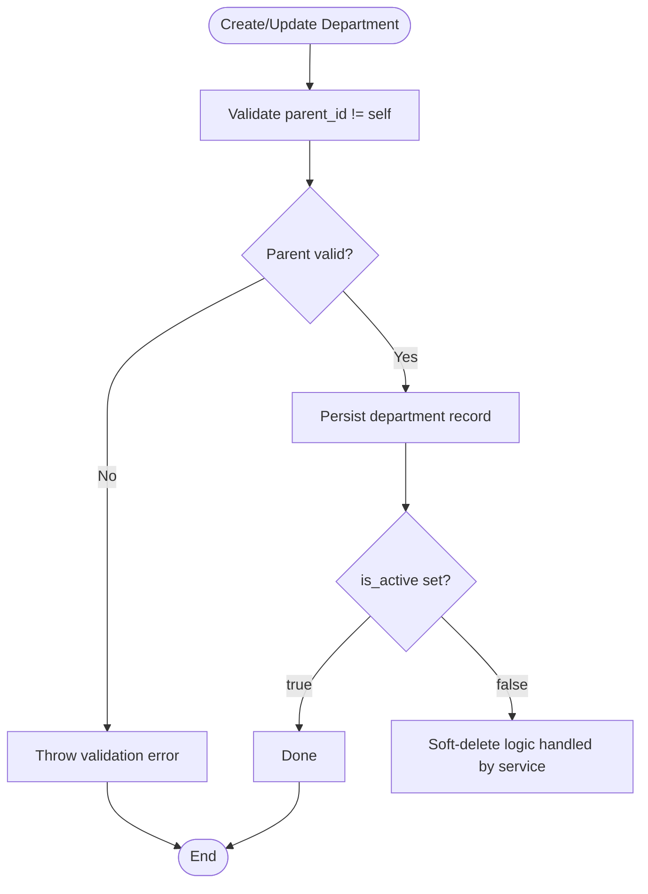
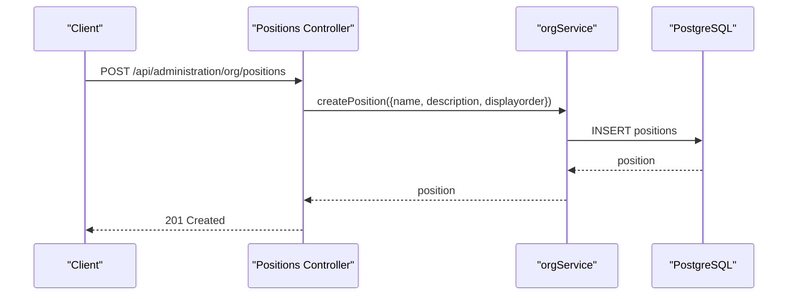
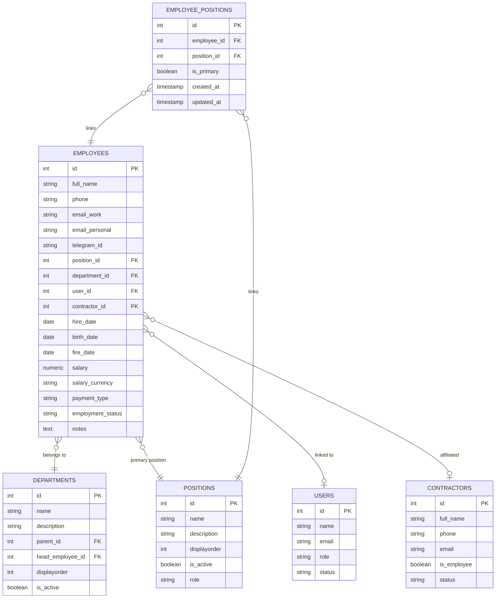
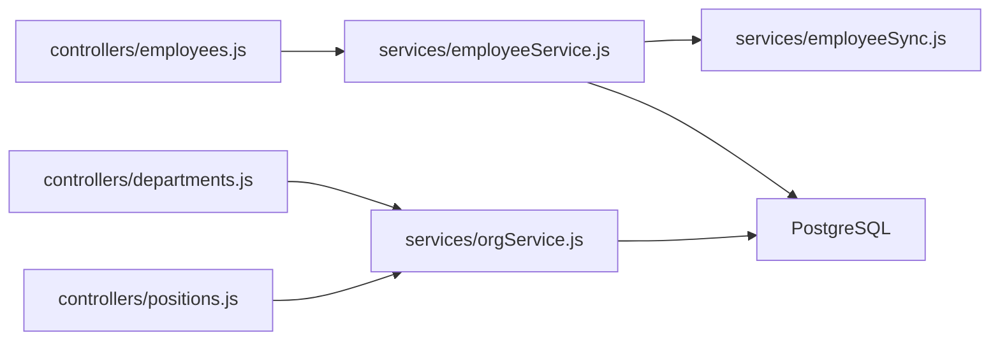

# Employee Management

<cite>
**Referenced Files in This Document**
- [index.js](file://backend/modules/administration/index.js)
- [settings.js](file://backend/modules/administration/settings.js)
- [employees.js](file://backend/modules/administration/controllers/employees.js)
- [departments.js](file://backend/modules/administration/controllers/departments.js)
- [positions.js](file://backend/modules/administration/controllers/positions.js)
- [employeeService.js](file://backend/modules/administration/services/employeeService.js)
- [orgService.js](file://backend/modules/administration/services/orgService.js)
- [employeeSync.js](file://backend/modules/administration/services/employeeSync.js)
- [007_add_position_role.sql](file://backend/migrations/007_add_position_role.sql)
- [008_employee_positions_many_to_many.sql](file://backend/migrations/008_employee_positions_many_to_many.sql)
- [57_add_contractor_id_to_employees.sql](file://backend/migrations/57_add_contractor_id_to_employees.sql)
- [009_add_employee_birth_date.sql](file://backend/migrations/009_add_employee_birth_date.sql)
</cite>

## Table of Contents
1. [Introduction](#introduction)
2. [Project Structure](#project-structure)
3. [Core Components](#core-components)
4. [Architecture Overview](#architecture-overview)
5. [Detailed Component Analysis](#detailed-component-analysis)
6. [Dependency Analysis](#dependency-analysis)
7. [Performance Considerations](#performance-considerations)
8. [Troubleshooting Guide](#troubleshooting-guide)
9. [Conclusion](#conclusion)
10. [Appendices](#appendices)

## Introduction
This document provides comprehensive documentation for the Employee Management system within the backend administration module. It covers employee CRUD operations, organizational structure management (departments and positions), employment history tracking, and the integration between employee data and user accounts. Practical workflows such as employee onboarding, department transfers, and position changes are explained, along with organizational data modeling, reporting structures, and HR-related processes.

## Project Structure
The Employee Management system is implemented as part of the Administration module. It exposes REST endpoints via controllers, orchestrates business logic through services, and persists data using PostgreSQL with carefully designed migrations.



**Diagram sources**
- [index.js:16-22](file://backend/modules/administration/index.js#L16-L22)
- [employees.js:1-64](file://backend/modules/administration/controllers/employees.js#L1-L63)
- [departments.js:1-56](file://backend/modules/administration/controllers/departments.js#L1-L55)
- [positions.js:1-56](file://backend/modules/administration/controllers/positions.js#L1-L55)
- [employeeService.js:1-306](file://backend/modules/administration/services/employeeService.js#L1-L305)
- [orgService.js:1-145](file://backend/modules/administration/services/orgService.js#L1-L144)
- [employeeSync.js](file://backend/modules/administration/services/employeeSync.js)

**Section sources**
- [index.js:16-22](file://backend/modules/administration/index.js#L16-L22)

## Core Components
- Controllers: Expose HTTP endpoints for employees, departments, and positions. They delegate to services and return standardized responses.
- Services:
  - employeeService: Implements employee CRUD, enrichment with positions, synchronization with users and contractors, and position assignment logic.
  - orgService: Manages departments and positions, including hierarchical department structures and position lifecycle.
  - employeeSync: Handles automatic user creation and synchronization of user roles and profile data based on employee and position data.
- Database: Relational schema with normalized tables and a many-to-many relationship between employees and positions.

Key capabilities:
- Employee CRUD with optional auto-user creation and synchronization.
- Multi-position support per employee with a primary position designation.
- Department hierarchy with parent-child relationships and head-of-department linkage.
- Position role mapping to automatically assign user roles during onboarding.
- Employment status tracking and contractor affiliation.

**Section sources**
- [employees.js:1-64](file://backend/modules/administration/controllers/employees.js#L1-L63)
- [departments.js:1-56](file://backend/modules/administration/controllers/departments.js#L1-L55)
- [positions.js:1-56](file://backend/modules/administration/controllers/positions.js#L1-L55)
- [employeeService.js:12-47](file://backend/modules/administration/services/employeeService.js#L12-L47)
- [employeeService.js:52-66](file://backend/modules/administration/services/employeeService.js#L52-L66)
- [orgService.js:73-84](file://backend/modules/administration/services/orgService.js#L73-L84)
- [orgService.js:103-118](file://backend/modules/administration/services/orgService.js#L103-L118)

## Architecture Overview
The system follows a layered architecture:
- HTTP Layer: Controllers handle requests and responses.
- Application Layer: Services encapsulate business rules.
- Persistence Layer: Services query the database and maintain referential integrity.



**Diagram sources**
- [employees.js:28-35](file://backend/modules/administration/controllers/employees.js#L28-L35)
- [employeeService.js:143-205](file://backend/modules/administration/services/employeeService.js#L143-L205)
- [employeeSync.js](file://backend/modules/administration/services/employeeSync.js)

## Detailed Component Analysis

### Employee Management
Employee management encompasses CRUD operations, position enrichment, and integration with users and contractors.

```mermaid
classDiagram
class EmployeeController {
+getAll(req,res)
+getById(req,res)
+create(req,res)
+update(req,res)
+remove(req,res)
}
class EmployeeService {
+getAllEmployees(filters)
+getEmployeeById(id)
+createEmployee(data)
+updateEmployee(id,data)
+deleteEmployee(id)
-enrichWithPositions(employees)
-updateEmployeePositions(employeeId, positionIds, primaryPositionId)
}
class EmployeeSync {
+autoCreateUser(full_name,email,phone,role)
+syncUserRole({user_id, position_ids})
+syncEmployeeUser({user_id, full_name, phone, email_work})
+syncContractor({contractor_id, full_name, phone, email_work, employment_status})
}
EmployeeController --> EmployeeService : "calls"
EmployeeService --> EmployeeSync : "uses"
EmployeeService --> DB : "queries"
```

**Diagram sources**
- [employees.js:1-64](file://backend/modules/administration/controllers/employees.js#L1-L63)
- [employeeService.js:12-47](file://backend/modules/administration/services/employeeService.js#L12-L47)
- [employeeService.js:52-66](file://backend/modules/administration/services/employeeService.js#L52-L66)
- [employeeSync.js](file://backend/modules/administration/services/employeeSync.js)

Key behaviors:
- Auto-user creation: When requested and no user_id exists, a user is created with a role derived from the primary position.
- Position assignment: Supports assigning multiple positions with a designated primary position; existing links are cleared and re-inserted.
- Contractor synchronization: Employee contractor affiliation is synchronized and updated accordingly.
- User synchronization: Employee profile updates propagate to the associated user account.

Practical examples:
- Employee onboarding: Create employee with create_user enabled to auto-generate a user account and assign roles based on primary position.
- Department transfer: Update employee with a new department_id; user synchronization ensures access remains intact.
- Position change: Update employee with new position_ids array; primary position is determined and user role is adjusted.

**Section sources**
- [employeeService.js:143-205](file://backend/modules/administration/services/employeeService.js#L143-L205)
- [employeeService.js:210-282](file://backend/modules/administration/services/employeeService.js#L210-L282)
- [employeeService.js:287-297](file://backend/modules/administration/services/employeeService.js#L287-L297)

### Department Management
Department management supports hierarchical structures, head-of-department assignments, and department lifecycle operations.



**Diagram sources**
- [orgService.js:103-118](file://backend/modules/administration/services/orgService.js#L103-L118)

Capabilities:
- Hierarchical departments: parent_id establishes tree-like structure; prevents self-parenting.
- Head-of-department: head_employee_id links to an employee who leads the department.
- Safety checks: deletion prevents orphaning employees or violating parent-child constraints.

**Section sources**
- [orgService.js:73-84](file://backend/modules/administration/services/orgService.js#L73-L84)
- [orgService.js:103-118](file://backend/modules/administration/services/orgService.js#L103-L118)
- [orgService.js:123-132](file://backend/modules/administration/services/orgService.js#L123-L132)

### Position Management
Position management defines job titles, role mappings, and multi-position assignments.



**Diagram sources**
- [positions.js:18-25](file://backend/modules/administration/controllers/positions.js#L18-L25)
- [orgService.js:31-40](file://backend/modules/administration/services/orgService.js#L31-L40)

Key points:
- Role mapping: Positions carry a role that influences user role assignment during onboarding.
- Multi-position per employee: Many-to-many mapping via employee_positions table with is_primary flag.
- Aggregation: Views and service logic aggregate position arrays for efficient querying.

**Section sources**
- [orgService.js:23-26](file://backend/modules/administration/services/orgService.js#L23-L26)
- [orgService.js:45-55](file://backend/modules/administration/services/orgService.js#L45-L55)
- [007_add_position_role.sql:1-14](file://backend/migrations/007_add_position_role.sql#L1-L13)
- [008_employee_positions_many_to_many.sql:5-58](file://backend/migrations/008_employee_positions_many_to_many.sql#L5-L58)

### Organizational Data Modeling
The relational model supports:
- employees: Core employee records with employment metadata and foreign keys to departments, positions, users, and contractors.
- departments: Hierarchical structure with parent_id and head_employee_id.
- positions: Job titles with role mapping and display ordering.
- employee_positions: Many-to-many bridge with is_primary designation.
- users and contractors: Integration for user accounts and contractor affiliations.



**Diagram sources**
- [employeeService.js:89-110](file://backend/modules/administration/services/employeeService.js#L89-L110)
- [employeeService.js:166-181](file://backend/modules/administration/services/employeeService.js#L166-L181)
- [orgService.js:73-84](file://backend/modules/administration/services/orgService.js#L73-L84)
- [orgService.js:103-118](file://backend/modules/administration/services/orgService.js#L103-L118)
- [008_employee_positions_many_to_many.sql:6-16](file://backend/migrations/008_employee_positions_many_to_many.sql#L6-L16)
- [57_add_contractor_id_to_employees.sql](file://backend/migrations/57_add_contractor_id_to_employees.sql)
- [009_add_employee_birth_date.sql](file://backend/migrations/009_add_employee_birth_date.sql)

## Dependency Analysis
- Controllers depend on services for business logic.
- Services depend on the database client and on employeeSync for cross-entity operations.
- employeeService depends on orgService indirectly via position and department queries.
- Migrations define the canonical schema and constraints.



**Diagram sources**
- [employees.js:5](file://backend/modules/administration/controllers/employees.js#L5)
- [departments.js:5](file://backend/modules/administration/controllers/departments.js#L5)
- [positions.js:5](file://backend/modules/administration/controllers/positions.js#L5)
- [employeeService.js:5-7](file://backend/modules/administration/services/employeeService.js#L5-L7)
- [orgService.js:5](file://backend/modules/administration/services/orgService.js#L5)

**Section sources**
- [employeeService.js:5-7](file://backend/modules/administration/services/employeeService.js#L5-L7)
- [orgService.js:5](file://backend/modules/administration/services/orgService.js#L5)

## Performance Considerations
- Indexes: employee_positions table includes indices on employee_id and position_id to optimize joins and updates.
- Aggregation: Position enrichment aggregates JSONB arrays for efficient retrieval of multiple positions per employee.
- Batch operations: Updating positions clears existing links and re-inserts new ones; batching reduces redundant writes.
- Query selectivity: Filtering by employment_status, department_id, and position_id leverages indexed columns.

Recommendations:
- Monitor query plans for large datasets; consider adding composite indexes if filtering by multiple criteria becomes frequent.
- Use pagination for listing endpoints to avoid large result sets.
- Cache frequently accessed reference data like positions and departments.

**Section sources**
- [008_employee_positions_many_to_many.sql:15-16](file://backend/migrations/008_employee_positions_many_to_many.sql#L15-L16)
- [employeeService.js:12-47](file://backend/modules/administration/services/employeeService.js#L12-L47)
- [employeeService.js:71-110](file://backend/modules/administration/services/employeeService.js#L71-L110)

## Troubleshooting Guide
Common issues and resolutions:
- Department deletion fails: Occurs when employees are still assigned to the department. Remove or reassign employees before deleting.
- Position deletion fails: Occurs when employees are still assigned to the position. Reassign employees to another position before deleting.
- Self-parenting prevention: Attempting to set a department's parent_id equal to itself throws a validation error; correct the parent_id value.
- User role mismatch after position change: Ensure position_ids are provided during update so user role can be recalculated and synced.

Operational tips:
- Use the getAll endpoints with filters to locate affected records before bulk operations.
- Verify contractor synchronization after employment status changes.
- Confirm primary position selection logic when multiple positions are assigned.

**Section sources**
- [orgService.js:123-132](file://backend/modules/administration/services/orgService.js#L123-L132)
- [orgService.js:60-68](file://backend/modules/administration/services/orgService.js#L60-L68)
- [orgService.js:106-108](file://backend/modules/administration/services/orgService.js#L106-L108)
- [employeeService.js:255-279](file://backend/modules/administration/services/employeeService.js#L255-L279)

## Conclusion
The Employee Management system provides a robust foundation for HR operations with strong separation of concerns, clear data modeling, and seamless integration between employees, departments, positions, users, and contractors. Its modular design enables straightforward extension and maintenance while supporting complex workflows such as multi-position assignments and automated user provisioning.

## Appendices

### API Endpoints Overview
- Employees
  - GET /api/administration/employees
  - GET /api/administration/employees/:id
  - POST /api/administration/employees
  - PUT /api/administration/employees/:id
  - DELETE /api/administration/employees/:id
- Departments
  - GET /api/administration/org/departments
  - POST /api/administration/org/departments
  - PUT /api/administration/org/departments/:id
  - DELETE /api/administration/org/departments/:id
- Positions
  - GET /api/administration/org/positions
  - POST /api/administration/org/positions
  - PUT /api/administration/org/positions/:id
  - DELETE /api/administration/org/positions/:id

**Section sources**
- [employees.js:13-55](file://backend/modules/administration/controllers/employees.js#L13-L55)
- [departments.js:13-48](file://backend/modules/administration/controllers/departments.js#L13-L48)
- [positions.js:13-48](file://backend/modules/administration/controllers/positions.js#L13-L48)

### Practical Workflows

#### Employee Onboarding
- Create employee with create_user enabled to auto-generate a user account.
- Assign primary position; role is inferred from position.role and applied to the user.
- Contractor affiliation is synchronized; employee is linked to the contractor if applicable.

**Section sources**
- [employeeService.js:156-164](file://backend/modules/administration/services/employeeService.js#L156-L164)
- [employeeService.js:196-202](file://backend/modules/administration/services/employeeService.js#L196-L202)
- [007_add_position_role.sql:4-13](file://backend/migrations/007_add_position_role.sql#L4-L13)

#### Department Transfer
- Update employee with a new department_id.
- User access remains consistent; ensure contractor and user sync steps are executed.

**Section sources**
- [employeeService.js:236-253](file://backend/modules/administration/services/employeeService.js#L236-L253)
- [employeeService.js:268-279](file://backend/modules/administration/services/employeeService.js#L268-L279)

#### Position Change
- Update employee with new position_ids array; primary position is selected automatically if not specified.
- User role is recalculated and synced based on the new positions.

**Section sources**
- [employeeService.js:255-279](file://backend/modules/administration/services/employeeService.js#L255-L279)
- [employeeService.js:52-66](file://backend/modules/administration/services/employeeService.js#L52-L66)

### Permissions and Visibility
- Default roles and permissions are defined centrally and include read/write scopes for users, employees, roles, tasks, projects, and documents.
- Visibility settings control whether inactive or deleted records are shown in lists.

**Section sources**
- [settings.js:6-47](file://backend/modules/administration/settings.js#L6-L47)
- [settings.js:77-86](file://backend/modules/administration/settings.js#L77-L86)