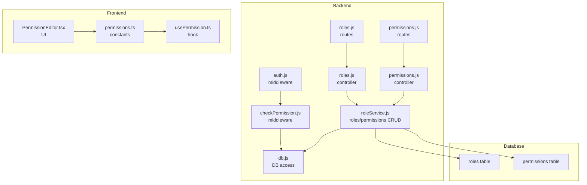
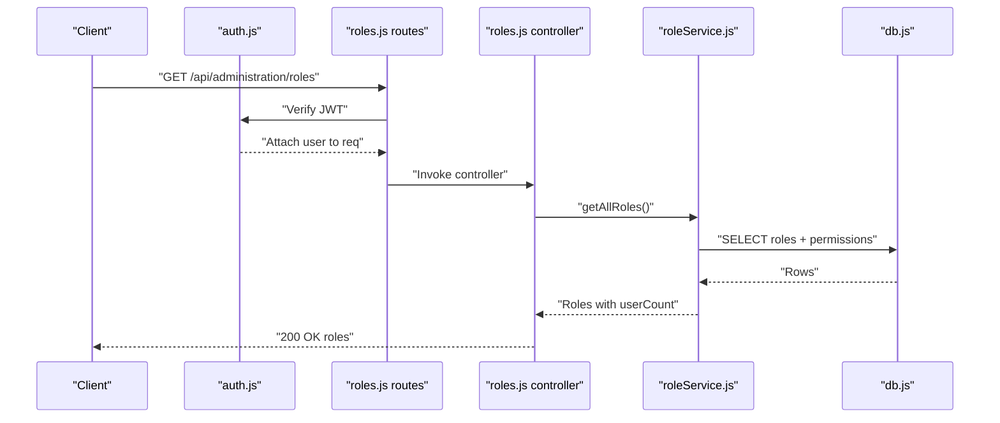
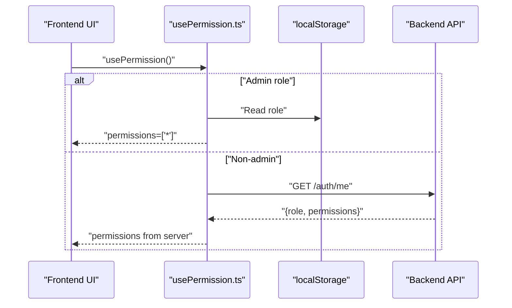
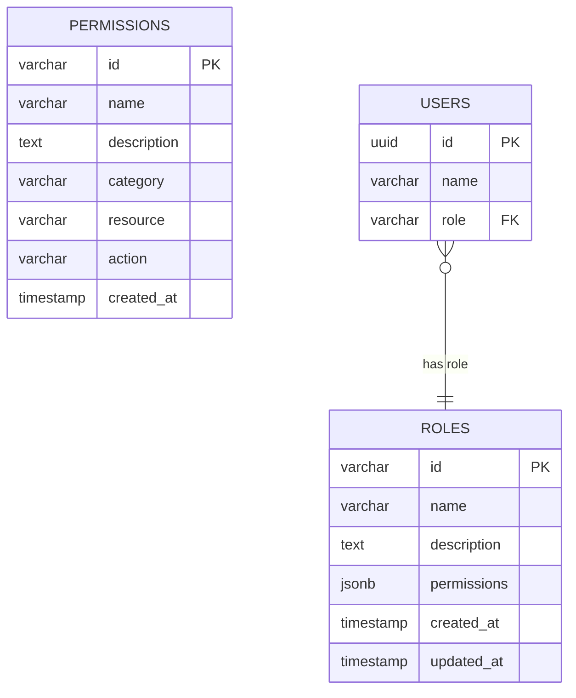
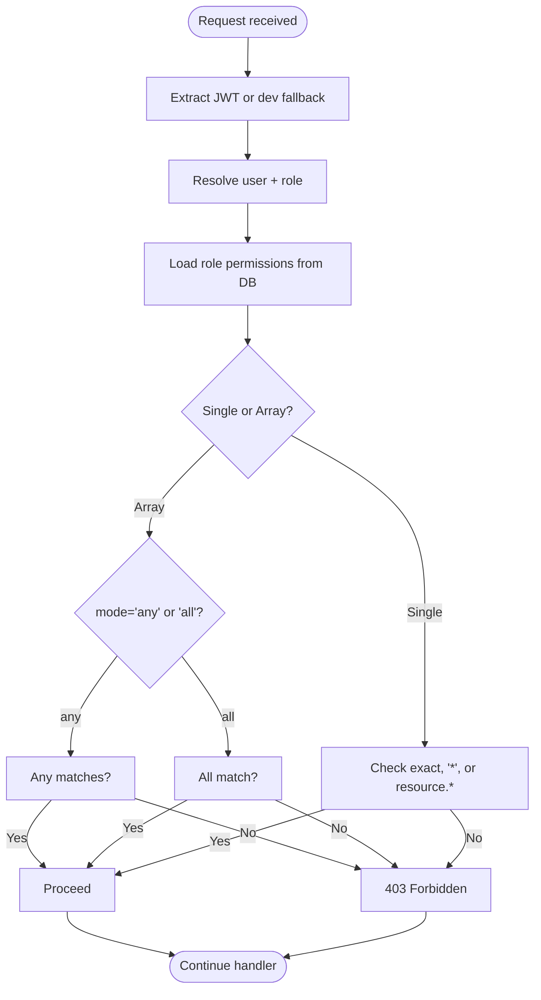
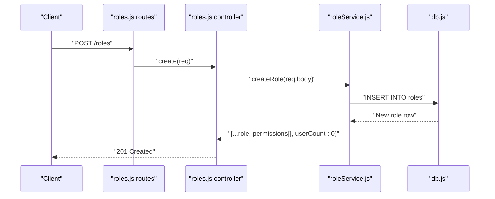
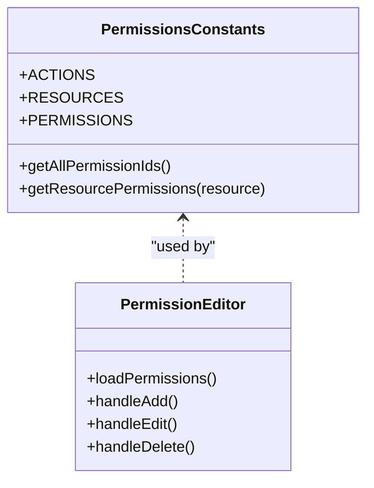
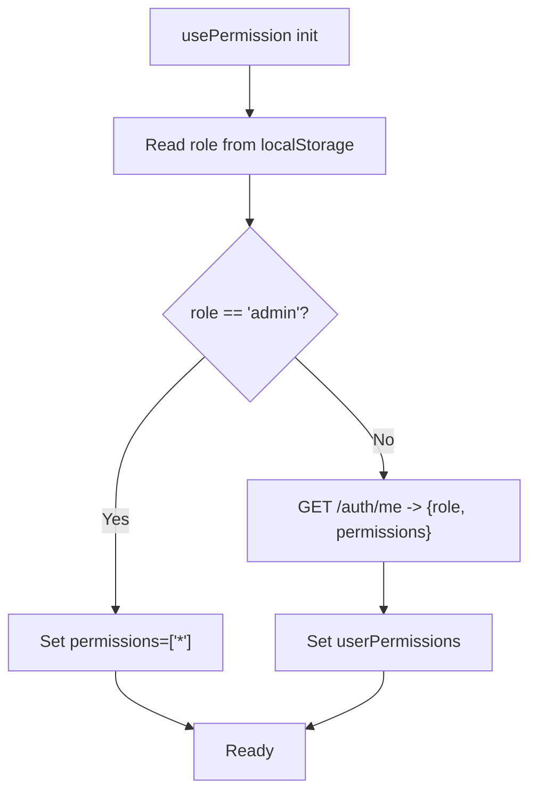
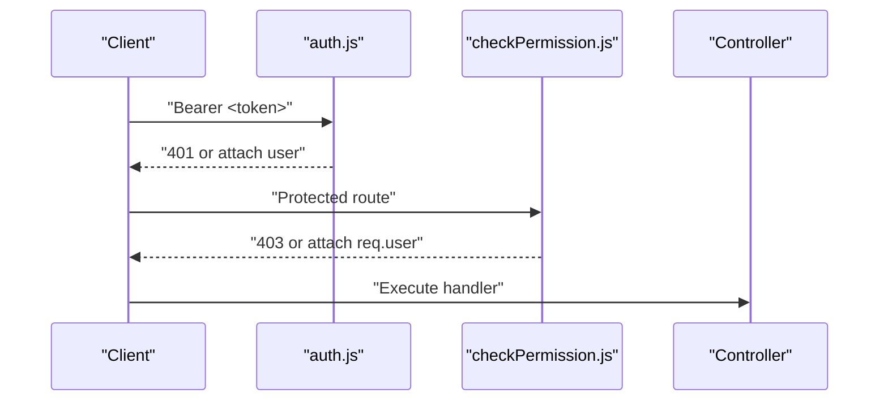
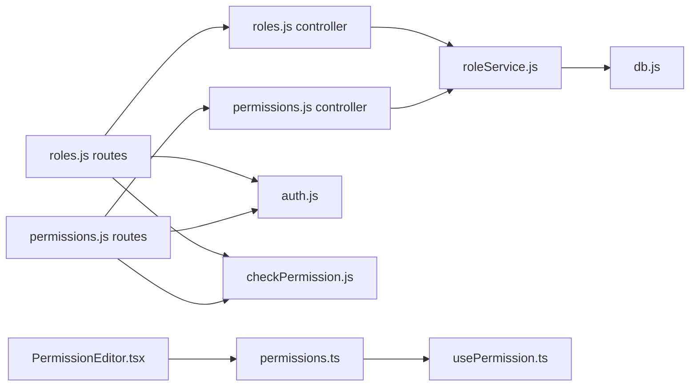

# Roles and Permissions

<cite>
**Referenced Files in This Document**
- [roleService.js](file://backend/modules/administration/services/roleService.js)
- [roles.js](file://backend/modules/administration/controllers/roles.js)
- [permissions.js](file://backend/modules/administration/controllers/permissions.js)
- [roles.js](file://backend/modules/administration/routes/roles.js)
- [permissions.js](file://backend/modules/administration/routes/permissions.js)
- [checkPermission.js](file://backend/middleware/checkPermission.js)
- [auth.js](file://backend/middleware/auth.js)
- [db.js](file://backend/db.js)
- [26_create_roles_and_permissions_tables.md](file://backend/migrations/26_create_roles_and_permissions_tables.md)
- [29_seed_access_matrix.md](file://backend/migrations/29_seed_access_matrix.md)
- [permissions.ts](file://frontend/src/constants/permissions.ts)
- [usePermission.ts](file://frontend/src/hooks/usePermission.ts)
- [PermissionEditor.tsx](file://frontend/src/modules/settings/components/PermissionEditor.tsx)
- [PERMISSIONS_SYSTEM.md](file://docs/PERMISSIONS_SYSTEM.md)
</cite>

## Table of Contents
1. [Introduction](#introduction)
2. [Project Structure](#project-structure)
3. [Core Components](#core-components)
4. [Architecture Overview](#architecture-overview)
5. [Detailed Component Analysis](#detailed-component-analysis)
6. [Dependency Analysis](#dependency-analysis)
7. [Performance Considerations](#performance-considerations)
8. [Troubleshooting Guide](#troubleshooting-guide)
9. [Conclusion](#conclusion)
10. [Appendices](#appendices)

## Introduction
This document explains the Role-Based Access Control (RBAC) system used by the application. It covers how roles and permissions are modeled, how access is validated on both server and client, how the permission matrix is structured and seeded, and how to configure, modify, and troubleshoot access control. Practical examples demonstrate role creation, permission assignment, and enforcement across modules.

## Project Structure
The RBAC system spans backend services and middleware, database migrations and seed data, and frontend permission constants and UI hooks. Key areas:
- Backend: role management APIs, permission middleware, authentication middleware, and database access
- Frontend: centralized permission constants, runtime permission checks, and permission editor UI
- Docs: system overview and operational guidance

**Diagram sources**
- [roleService.js:1-109](file://backend/modules/administration/services/roleService.js#L1-L108)
- [roles.js:1-56](file://backend/modules/administration/controllers/roles.js#L1-L55)
- [permissions.js:1-21](file://backend/modules/administration/controllers/permissions.js#L1-L20)
- [roles.js:1-20](file://backend/modules/administration/routes/roles.js#L1-L19)
- [permissions.js:1-17](file://backend/modules/administration/routes/permissions.js#L1-L16)
- [checkPermission.js:1-130](file://backend/middleware/checkPermission.js#L1-L129)
- [auth.js:1-82](file://backend/middleware/auth.js#L1-L81)
- [db.js:1-68](file://backend/db.js#L1-L68)
- [permissions.ts:1-245](file://frontend/src/constants/permissions.ts#L1-L245)
- [usePermission.ts:1-113](file://frontend/src/hooks/usePermission.ts#L1-L112)
- [PermissionEditor.tsx:1-412](file://frontend/src/modules/settings/components/PermissionEditor.tsx#L1-L411)

**Section sources**
- [roleService.js:1-109](file://backend/modules/administration/services/roleService.js#L1-L108)
- [roles.js:1-56](file://backend/modules/administration/controllers/roles.js#L1-L55)
- [permissions.js:1-21](file://backend/modules/administration/controllers/permissions.js#L1-L20)
- [roles.js:1-20](file://backend/modules/administration/routes/roles.js#L1-L19)
- [permissions.js:1-17](file://backend/modules/administration/routes/permissions.js#L1-L16)
- [checkPermission.js:1-130](file://backend/middleware/checkPermission.js#L1-L129)
- [auth.js:1-82](file://backend/middleware/auth.js#L1-L81)
- [db.js:1-68](file://backend/db.js#L1-L68)
- [permissions.ts:1-245](file://frontend/src/constants/permissions.ts#L1-L245)
- [usePermission.ts:1-113](file://frontend/src/hooks/usePermission.ts#L1-L112)
- [PermissionEditor.tsx:1-412](file://frontend/src/modules/settings/components/PermissionEditor.tsx#L1-L411)

## Core Components
- Role service: fetches roles with user counts, creates/updates/deletes roles, and lists available permissions.
- Controllers: expose endpoints for listing, creating, updating, and deleting roles; listing permissions.
- Routes: attach authentication and permission middleware to protect endpoints.
- Permission middleware: validates permissions per request, supports wildcard matching and “any/all” modes.
- Authentication middleware: extracts user identity from JWT or development fallback.
- Database access: shared Postgres pool with snake_case to camelCase conversion.
- Frontend constants: centralized permission IDs and actions/resources taxonomy.
- Frontend hook: loads current user’s role and permissions, exposes helper checks.
- Permission editor UI: manages permission records and categorization.

**Section sources**
- [roleService.js:1-109](file://backend/modules/administration/services/roleService.js#L1-L108)
- [roles.js:1-56](file://backend/modules/administration/controllers/roles.js#L1-L55)
- [permissions.js:1-21](file://backend/modules/administration/controllers/permissions.js#L1-L20)
- [roles.js:1-20](file://backend/modules/administration/routes/roles.js#L1-L19)
- [permissions.js:1-17](file://backend/modules/administration/routes/permissions.js#L1-L16)
- [checkPermission.js:1-130](file://backend/middleware/checkPermission.js#L1-L129)
- [auth.js:1-82](file://backend/middleware/auth.js#L1-L81)
- [db.js:1-68](file://backend/db.js#L1-L68)
- [permissions.ts:1-245](file://frontend/src/constants/permissions.ts#L1-L245)
- [usePermission.ts:1-113](file://frontend/src/hooks/usePermission.ts#L1-L112)
- [PermissionEditor.tsx:1-412](file://frontend/src/modules/settings/components/PermissionEditor.tsx#L1-L411)

## Architecture Overview
The RBAC architecture enforces access control at two layers:
- Server-side: route handlers are protected by a middleware that resolves the user’s permissions from the database and evaluates them against the requested permission(s).
- Client-side: UI components conditionally render based on the current user’s permissions loaded from local storage or server.

**Diagram sources**
- [roles.js:1-20](file://backend/modules/administration/routes/roles.js#L1-L19)
- [roles.js:1-56](file://backend/modules/administration/controllers/roles.js#L1-L55)
- [roleService.js:1-109](file://backend/modules/administration/services/roleService.js#L1-L108)
- [db.js:1-68](file://backend/db.js#L1-L68)
- [auth.js:1-82](file://backend/middleware/auth.js#L1-L81)

**Diagram sources**
- [usePermission.ts:1-113](file://frontend/src/hooks/usePermission.ts#L1-L112)
- [PERMISSIONS_SYSTEM.md:63-114](file://docs/PERMISSIONS_SYSTEM.md#L63-L114)

## Detailed Component Analysis

### Database Schema and Seed Data
- Roles table stores role metadata and a JSONB array of permission IDs.
- Permissions table defines granular permission entries with category/resource/action structure.
- Seed migrations define baseline roles and permissions and map existing users to roles.

**Diagram sources**
- [26_create_roles_and_permissions_tables.md:9-28](file://backend/migrations/26_create_roles_and_permissions_tables.md#L9-L28)
- [29_seed_access_matrix.md:17-61](file://backend/migrations/29_seed_access_matrix.md#L17-L61)

**Section sources**
- [26_create_roles_and_permissions_tables.md:1-61](file://backend/migrations/26_create_roles_and_permissions_tables.md#L1-L60)
- [29_seed_access_matrix.md:1-207](file://backend/migrations/29_seed_access_matrix.md#L1-L207)

### Permission Evaluation and Wildcards
The permission middleware supports:
- Exact permission matches
- Global wildcard (“*”)
- Resource-level wildcard (e.g., “roles.*” matches “roles.read”, “roles.write”)

**Diagram sources**
- [checkPermission.js:13-26](file://backend/middleware/checkPermission.js#L13-L26)
- [checkPermission.js:34-126](file://backend/middleware/checkPermission.js#L34-L126)

**Section sources**
- [checkPermission.js:1-130](file://backend/middleware/checkPermission.js#L1-L129)

### Role Management Workflows
- Listing roles: service queries roles and enriches each with a user count and parsed permissions.
- Creating roles: generates a stable ID, persists role with initial permissions, returns enriched record.
- Updating roles: updates metadata and permissions, recalculates user count.
- Deleting roles: prevents deletion if any user is assigned the role.

**Diagram sources**
- [roles.js:14-17](file://backend/modules/administration/routes/roles.js#L14-L17)
- [roles.js:22-25](file://backend/modules/administration/controllers/roles.js#L22-L25)
- [roleService.js:35-51](file://backend/modules/administration/services/roleService.js#L35-L51)
- [db.js:58-67](file://backend/db.js#L58-L67)

**Section sources**
- [roleService.js:11-109](file://backend/modules/administration/services/roleService.js#L11-L108)
- [roles.js:9-48](file://backend/modules/administration/controllers/roles.js#L9-L48)
- [roles.js:14-17](file://backend/modules/administration/routes/roles.js#L14-L17)

### Permission Definition and Categorization
- Frontend defines all permission IDs via a typed constant map with resources and actions.
- UI components and editors rely on these constants to present and manage permissions.
- The permission editor allows adding, editing, and deleting permission records with category/resource/action metadata.

**Diagram sources**
- [permissions.ts:1-245](file://frontend/src/constants/permissions.ts#L1-L245)
- [PermissionEditor.tsx:1-412](file://frontend/src/modules/settings/components/PermissionEditor.tsx#L1-L411)

**Section sources**
- [permissions.ts:1-245](file://frontend/src/constants/permissions.ts#L1-L245)
- [PermissionEditor.tsx:1-412](file://frontend/src/modules/settings/components/PermissionEditor.tsx#L1-L411)

### Client-Side Permission Checks
- The hook loads the current user’s role and permissions, with special handling for admin (wildcard grant).
- Provides helpers for single, any-of, and all-of permission checks.
- UI components use these helpers to conditionally render content.

**Diagram sources**
- [usePermission.ts:21-49](file://frontend/src/hooks/usePermission.ts#L21-L49)
- [usePermission.ts:55-86](file://frontend/src/hooks/usePermission.ts#L55-L86)

**Section sources**
- [usePermission.ts:1-113](file://frontend/src/hooks/usePermission.ts#L1-L112)

### Module-Level Access Controls
- Routes are decorated with authentication and permission middleware to enforce access per endpoint.
- Examples include listing roles, creating/updating roles, and listing permissions.

**Diagram sources**
- [roles.js:8-17](file://backend/modules/administration/routes/roles.js#L8-L17)
- [permissions.js:8-14](file://backend/modules/administration/routes/permissions.js#L8-L14)
- [auth.js:6-54](file://backend/middleware/auth.js#L6-L54)
- [checkPermission.js:34-126](file://backend/middleware/checkPermission.js#L34-L126)

**Section sources**
- [roles.js:1-20](file://backend/modules/administration/routes/roles.js#L1-L19)
- [permissions.js:1-17](file://backend/modules/administration/routes/permissions.js#L1-L16)
- [auth.js:1-82](file://backend/middleware/auth.js#L1-L81)
- [checkPermission.js:1-130](file://backend/middleware/checkPermission.js#L1-L129)

## Dependency Analysis
- Controllers depend on the role service for data access.
- Routes depend on authentication and permission middleware.
- Middleware depends on the database for user/role resolution.
- Frontend depends on constants and hooks for runtime checks.
- Database migrations define the schema and seed baseline data.

**Diagram sources**
- [roles.js:1-56](file://backend/modules/administration/controllers/roles.js#L1-L55)
- [permissions.js:1-21](file://backend/modules/administration/controllers/permissions.js#L1-L20)
- [roles.js:1-20](file://backend/modules/administration/routes/roles.js#L1-L19)
- [permissions.js:1-17](file://backend/modules/administration/routes/permissions.js#L1-L16)
- [auth.js:1-82](file://backend/middleware/auth.js#L1-L81)
- [checkPermission.js:1-130](file://backend/middleware/checkPermission.js#L1-L129)
- [roleService.js:1-109](file://backend/modules/administration/services/roleService.js#L1-L108)
- [db.js:1-68](file://backend/db.js#L1-L68)
- [permissions.ts:1-245](file://frontend/src/constants/permissions.ts#L1-L245)
- [usePermission.ts:1-113](file://frontend/src/hooks/usePermission.ts#L1-L112)
- [PermissionEditor.tsx:1-412](file://frontend/src/modules/settings/components/PermissionEditor.tsx#L1-L411)

**Section sources**
- [roles.js:1-56](file://backend/modules/administration/controllers/roles.js#L1-L55)
- [permissions.js:1-21](file://backend/modules/administration/controllers/permissions.js#L1-L20)
- [roles.js:1-20](file://backend/modules/administration/routes/roles.js#L1-L19)
- [permissions.js:1-17](file://backend/modules/administration/routes/permissions.js#L1-L16)
- [roleService.js:1-109](file://backend/modules/administration/services/roleService.js#L1-L108)
- [db.js:1-68](file://backend/db.js#L1-L68)
- [permissions.ts:1-245](file://frontend/src/constants/permissions.ts#L1-L245)
- [usePermission.ts:1-113](file://frontend/src/hooks/usePermission.ts#L1-L112)
- [PermissionEditor.tsx:1-412](file://frontend/src/modules/settings/components/PermissionEditor.tsx#L1-L411)

## Performance Considerations
- Database queries: role listing joins users to compute user counts; consider caching counts or precomputing aggregates if scale grows.
- Middleware evaluation: permission checks are O(n) over the user’s permission set; keep the number of stored permissions reasonable.
- Indexes: migrations create indexes on role name and permission category/resource; maintain them as data grows.
- Frontend: permission checks are in-memory; avoid frequent re-fetching by leveraging the hook’s cached state.

[No sources needed since this section provides general guidance]

## Troubleshooting Guide
Common issues and resolutions:
- Button does not appear in UI
  - Verify the user’s role and permissions are correctly loaded and include the required permission ID.
  - Confirm translations exist for the permission name if relying on localized labels.
- Middleware denies access unexpectedly
  - Ensure the route is decorated with the appropriate permission middleware.
  - Confirm the Authorization header is present and valid; for development, ensure the fallback header is set.
  - Verify the user’s permissions are persisted in the database.
- Admin role appears ineffective
  - Confirm the user’s role is “admin” and that the permissions array includes the global wildcard.
- Permission editor fails to save or delete
  - Check network requests and error messages; confirm the backend endpoints are reachable and protected by required permissions.

**Section sources**
- [PERMISSIONS_SYSTEM.md:349-378](file://docs/PERMISSIONS_SYSTEM.md#L349-L377)
- [usePermission.ts:21-49](file://frontend/src/hooks/usePermission.ts#L21-L49)
- [checkPermission.js:34-126](file://backend/middleware/checkPermission.js#L34-L126)
- [roles.js:14-17](file://backend/modules/administration/routes/roles.js#L14-L17)
- [permissions.js:14-14](file://backend/modules/administration/routes/permissions.js#L14)

## Conclusion
The RBAC system combines a centralized permission model, strict middleware enforcement, and a robust frontend permission API. Roles and permissions are defined consistently across the stack, enabling predictable access control across modules. By following the documented workflows and best practices, administrators can safely configure roles, manage permissions, and troubleshoot access issues.

[No sources needed since this section summarizes without analyzing specific files]

## Appendices

### Permission Matrix Reference
- Roles and permissions are seeded with comprehensive sets covering users, roles, permissions, settings, contractors, projects, tasks, documents, cases, lawyers, finance, calendar, mail, reports, and backups.
- Administrators can adjust role permissions to fit organizational needs.

**Section sources**
- [29_seed_access_matrix.md:17-61](file://backend/migrations/29_seed_access_matrix.md#L17-L61)

### Practical Examples
- Role configuration
  - Create a role with a curated set of permission IDs.
  - Assign the role to users via the user management interface.
- Permission assignment
  - Use the permission editor to add, update, or remove permission records.
  - Ensure category/resource/action align with frontend constants.
- Access control enforcement
  - Protect routes with the permission middleware using either single or array-based checks with “any” or “all” modes.

**Section sources**
- [roles.js:22-34](file://backend/modules/administration/controllers/roles.js#L22-L34)
- [PermissionEditor.tsx:134-164](file://frontend/src/modules/settings/components/PermissionEditor.tsx#L134-L164)
- [roles.js:14-17](file://backend/modules/administration/routes/roles.js#L14-L17)