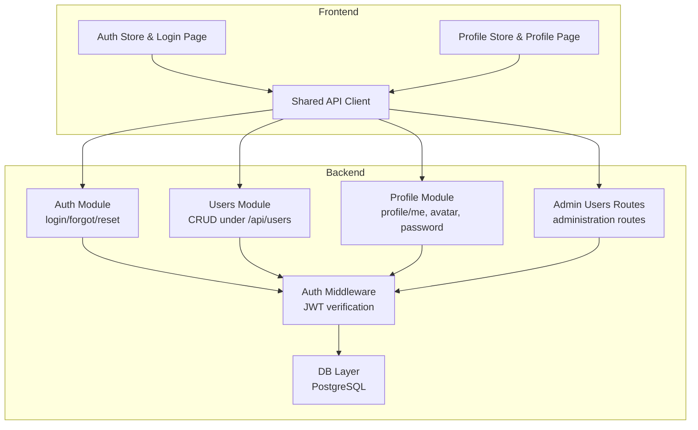
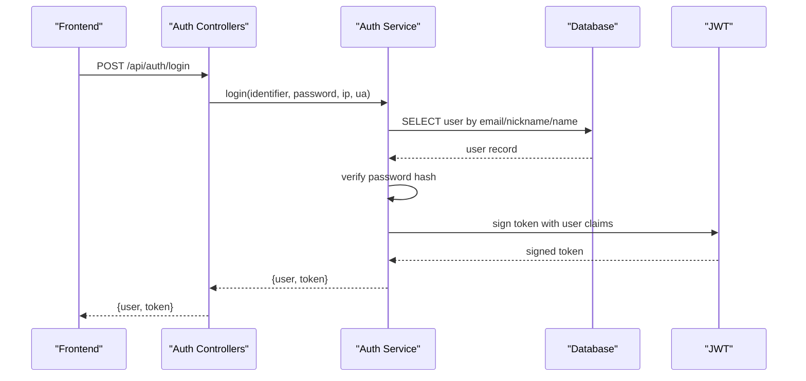
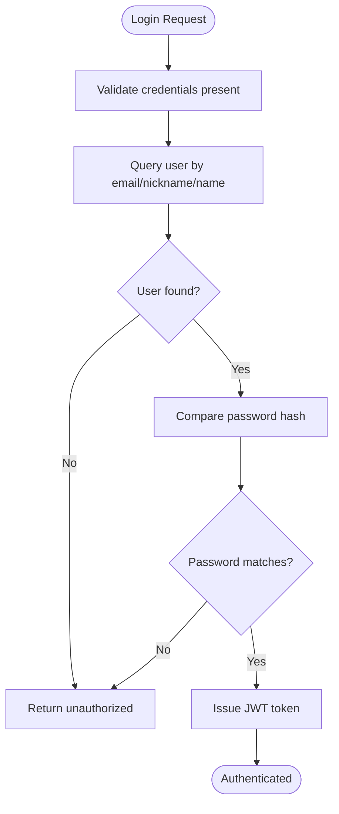
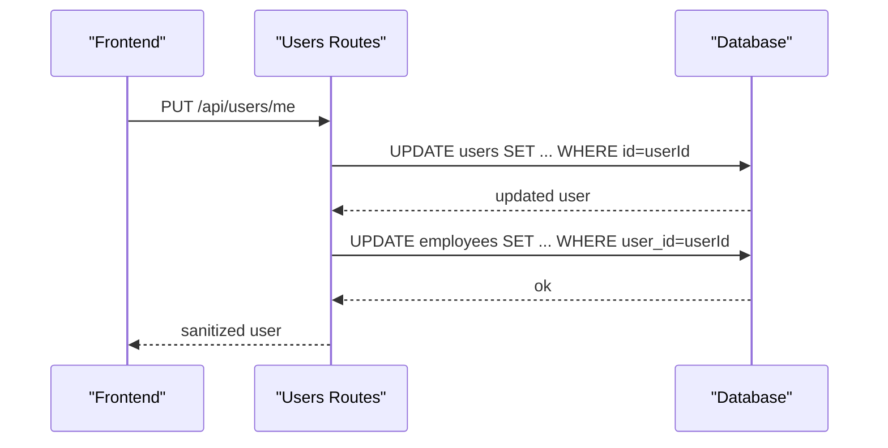
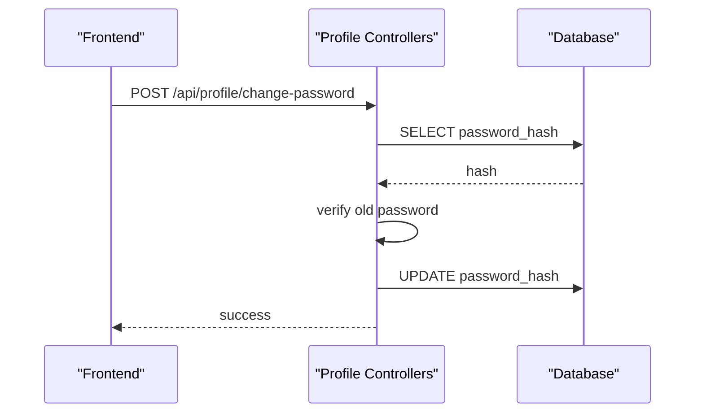
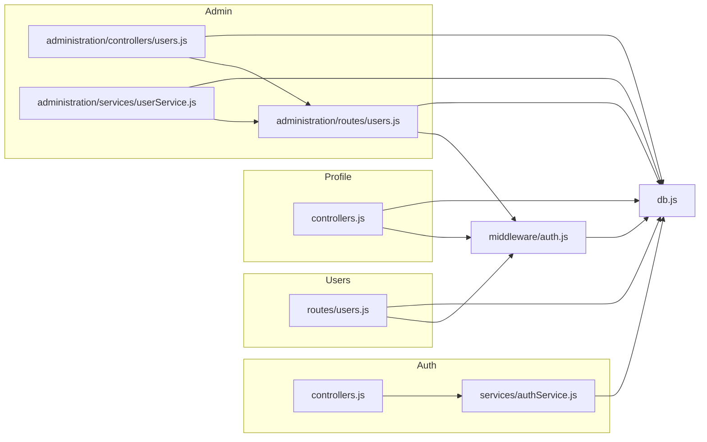

# User Management

<cite>
**Referenced Files in This Document**
- [backend/modules/users/index.js](file://backend/modules/users/index.js)
- [backend/modules/users/settings.json](file://backend/modules/users/settings.json)
- [backend/modules/users/routes/users.js](file://backend/modules/users/routes/users.js)
- [backend/modules/profile/controllers.js](file://backend/modules/profile/controllers.js)
- [backend/migrations/07_create_users_table.md](file://backend/migrations/07_create_users_table.md)
- [backend/migrations/35_add_auth_columns_to_users.md](file://backend/migrations/35_add_auth_columns_to_users.md)
- [backend/modules/auth/services/authService.js](file://backend/modules/auth/services/authService.js)
- [backend/modules/auth/controllers.js](file://backend/modules/auth/controllers.js)
- [backend/middleware/auth.js](file://backend/middleware/auth.js)
- [backend/db.js](file://backend/db.js)
- [backend/utils/logger.js](file://backend/utils/logger.js)
- [backend/utils/responseHelpers.js](file://backend/utils/responseHelpers.js)
- [backend/utils/errorHandler.js](file://backend/utils/errorHandler.js)
- [backend/modules/administration/routes/users.js](file://backend/modules/administration/routes/users.js)
- [backend/modules/administration/controllers/users.js](file://backend/modules/administration/controllers/users.js)
- [backend/modules/administration/services/userService.js](file://backend/modules/administration/services/userService.js)
- [backend/routes/userSettings.js](file://backend/routes/userSettings.js)
- [backend/modules/auth/routes.js](file://backend/modules/auth/routes.js)
- [backend/routes/auth.js](file://backend/routes/auth.js)
- [backend/routes/admin.js](file://backend/routes/admin.js)
- [backend/index.js](file://backend/index.js)
- [frontend/src/modules/auth/useAuthStore.ts](file://frontend/src/modules/auth/api/authService.ts)
- [frontend/src/modules/profile/useProfileStore.ts](file://frontend/src/modules/profile/api/profileService.ts)
- [frontend/src/lib/api.ts](file://frontend/src/lib/api.ts)
- [frontend/src/modules/profile/ProfilePage.tsx](file://frontend/src/modules/profile/pages/Profile.tsx)
- [frontend/src/modules/auth/LoginPage.tsx](file://frontend/src/modules/auth/pages/Login.tsx)
- [docs/frontend/API.md](file://docs/frontend/API.md)
- [docs/api/USERS.md](file://docs/api/USERS.md)
- [docs/api/AUTH.md](file://docs/api/AUTH.md)
- [docs/api/USER_SETTINGS.md](file://docs/api/USER_SETTINGS.md)
- [docs/frontend/USER_MANAGEMENT_IMPLEMENTATION.md](file://docs/frontend/USER_MANAGEMENT_IMPLEMENTATION.md)
</cite>

## Table of Contents
1. [Introduction](#introduction)
2. [Project Structure](#project-structure)
3. [Core Components](#core-components)
4. [Architecture Overview](#architecture-overview)
5. [Detailed Component Analysis](#detailed-component-analysis)
6. [Dependency Analysis](#dependency-analysis)
7. [Performance Considerations](#performance-considerations)
8. [Troubleshooting Guide](#troubleshooting-guide)
9. [Conclusion](#conclusion)
10. [Appendices](#appendices)

## Introduction
This document provides comprehensive documentation for the User Management system in Titan CRM. It covers user CRUD operations, authentication flows, password management, session handling, profile management, onboarding workflows, invitations, and email verification. It also explains the integration between frontend UI components and backend APIs, along with data validation, security considerations, and access control mechanisms.

## Project Structure
The User Management system spans backend modules and frontend modules:
- Backend:
  - Authentication module with login, forgot password, and reset password flows
  - Users module with user CRUD endpoints under /api/users
  - Profile module with profile retrieval, updates, avatar upload, and password change
  - Administration module with administrative user management routes and services
  - Middleware for JWT-based authentication
  - Database connectivity and migrations for user schema and auth columns
- Frontend:
  - Authentication store and pages for login
  - Profile store and page for profile management
  - Shared API client and documentation

**Diagram sources**
- [backend/modules/auth/services/authService.js:15-74](file://backend/modules/auth/services/authService.js#L15-L74)
- [backend/modules/users/routes/users.js:140-164](file://backend/modules/users/routes/users.js#L140-L164)
- [backend/modules/profile/controllers.js:53-65](file://backend/modules/profile/controllers.js#L53-L65)
- [backend/middleware/auth.js:6-54](file://backend/middleware/auth.js#L6-L54)
- [backend/db.js](file://backend/db.js)

**Section sources**
- [backend/modules/users/index.js:1-11](file://backend/modules/users/index.js#L1-L10)
- [backend/modules/users/settings.json:1-7](file://backend/modules/users/settings.json#L1-L6)

## Core Components
- Authentication Service and Controllers:
  - Handles login with email/nickname/name and password
  - Manages password reset request and reset flows
  - Returns JWT tokens upon successful login
- Users Module:
  - Provides endpoints for retrieving current user profile (/me), updating profile (/me), changing password (/me/change-password)
  - Supports admin-level CRUD: list all users, create, update, delete
- Profile Module:
  - Retrieves and updates user profiles
  - Uploads avatars and manages share links
- Administration Module:
  - Administrative routes and services for managing users
- Middleware:
  - Enforces JWT-based authentication and optional auth for specific routes
- Database:
  - Users table schema and auth-related columns managed via migrations

**Section sources**
- [backend/modules/auth/services/authService.js:15-74](file://backend/modules/auth/services/authService.js#L15-L74)
- [backend/modules/auth/controllers.js:10-25](file://backend/modules/auth/controllers.js#L10-L25)
- [backend/modules/users/routes/users.js:8-215](file://backend/modules/users/routes/users.js#L8-L215)
- [backend/modules/profile/controllers.js:53-240](file://backend/modules/profile/controllers.js#L53-L240)
- [backend/middleware/auth.js:6-54](file://backend/middleware/auth.js#L6-L54)
- [backend/migrations/07_create_users_table.md:8-21](file://backend/migrations/07_create_users_table.md#L8-L21)
- [backend/migrations/35_add_auth_columns_to_users.md:5-67](file://backend/migrations/35_add_auth_columns_to_users.md#L5-L67)

## Architecture Overview
The system follows a layered architecture:
- Presentation Layer: Frontend pages and stores
- API Layer: Express routers and controllers
- Service Layer: Business logic for auth and user operations
- Persistence Layer: PostgreSQL via database connection

**Diagram sources**
- [backend/modules/auth/controllers.js:10-25](file://backend/modules/auth/controllers.js#L10-L25)
- [backend/modules/auth/services/authService.js:15-74](file://backend/modules/auth/services/authService.js#L15-L74)

## Detailed Component Analysis

### Authentication and Session Handling
- Login:
  - Accepts identifier (email, nickname, or name) and password
  - Validates credentials against stored hash
  - Issues JWT with user claims and expiration
- Password Reset Request:
  - Respects configured channels (email/Telegram)
  - Generates temporary reset token with expiry
  - Sends reset link via selected channel
- Password Reset:
  - Verifies token and expiry
  - Updates password hash and clears reset fields

**Diagram sources**
- [backend/modules/auth/services/authService.js:15-74](file://backend/modules/auth/services/authService.js#L15-L74)

**Section sources**
- [backend/modules/auth/services/authService.js:15-74](file://backend/modules/auth/services/authService.js#L15-L74)
- [backend/modules/auth/controllers.js:10-25](file://backend/modules/auth/controllers.js#L10-L25)
- [backend/middleware/auth.js:6-54](file://backend/middleware/auth.js#L6-L54)

### User CRUD Operations
- Current User Profile:
  - GET /api/users/me retrieves profile with joined employee details
  - Sensitive fields are stripped from response
- Update Current User:
  - PUT /api/users/me updates name, email, phone, department, nickname, telegram_token
  - Also synchronizes employee phone and telegram_id
- Admin CRUD:
  - GET /api/users lists users with position/department names
  - POST /api/users creates user with defaults and hashed password
  - PUT /api/users/:id updates user and returns enriched record
  - DELETE /api/users/:id removes user

**Diagram sources**
- [backend/modules/users/routes/users.js:44-90](file://backend/modules/users/routes/users.js#L44-L90)

**Section sources**
- [backend/modules/users/routes/users.js:8-215](file://backend/modules/users/routes/users.js#L8-L215)

### Profile Management and Personal Information
- Retrieve Profile:
  - GET /api/profile/me via profile controller
- Update Profile:
  - PUT /api/profile/:id updates personal info and initials
- Avatar Upload:
  - POST /api/profile/:id/avatar uploads image and stores URL
- Password Change:
  - POST /api/profile/change-password validates old password and sets new hash

**Diagram sources**
- [backend/modules/profile/controllers.js:71-96](file://backend/modules/profile/controllers.js#L71-L96)

**Section sources**
- [backend/modules/profile/controllers.js:53-240](file://backend/modules/profile/controllers.js#L53-L240)

### Password Management
- Hashing:
  - bcrypt is used for hashing and verifying passwords
- Change Password:
  - Requires current password and enforces minimum length
- Reset Password:
  - Uses time-bound reset token and clears fields after use

**Section sources**
- [backend/modules/auth/services/authService.js:102-226](file://backend/modules/auth/services/authService.js#L102-L226)
- [backend/modules/profile/controllers.js:71-96](file://backend/modules/profile/controllers.js#L71-L96)

### Access Control and Middleware
- Auth Middleware:
  - Extracts Bearer token and verifies JWT
  - Supports optional auth for specific routes
  - Mock tokens for development/testing
- Optional Auth:
  - Allows unauthenticated requests while still parsing token if present

**Section sources**
- [backend/middleware/auth.js:6-82](file://backend/middleware/auth.js#L6-L81)

### Database Schema and Migrations
- Users Table:
  - Primary key id, name, initials, role, status, avatar, phone, department, email, specializations, created_at
- Auth Columns:
  - Adds password_hash, nickname, telegram_token, reset_token, reset_token_expires
  - Seeds default nicknames, emails, and default password hashes

**Section sources**
- [backend/migrations/07_create_users_table.md:8-21](file://backend/migrations/07_create_users_table.md#L8-L21)
- [backend/migrations/35_add_auth_columns_to_users.md:5-67](file://backend/migrations/35_add_auth_columns_to_users.md#L5-L67)

### Frontend Integration
- Authentication:
  - Auth store and login page integrate with backend auth endpoints
- Profile:
  - Profile store and page handle profile retrieval, updates, and avatar upload
- API Client:
  - Shared API client encapsulates HTTP calls to backend

**Section sources**
- [frontend/src/modules/auth/useAuthStore.ts](file://frontend/src/modules/auth/api/authService.ts)
- [frontend/src/modules/profile/useProfileStore.ts](file://frontend/src/modules/profile/api/profileService.ts)
- [frontend/src/lib/api.ts](file://frontend/src/lib/api.ts)
- [frontend/src/modules/profile/ProfilePage.tsx](file://frontend/src/modules/profile/pages/Profile.tsx)
- [frontend/src/modules/auth/LoginPage.tsx](file://frontend/src/modules/auth/pages/Login.tsx)

### Practical Examples
- User Registration:
  - POST /api/users with name, email, phone, role, status, department, nickname, telegramToken, password
- Profile Update:
  - PUT /api/users/me with name, email, phone, department, nickname, telegramToken
- Account Administration:
  - PUT /api/users/:id to modify role/status
  - DELETE /api/users/:id to deactivate
- Authentication:
  - POST /api/auth/login with identifier and password
- Password Change:
  - PUT /api/users/me/change-password with currentPassword and newPassword

**Section sources**
- [backend/modules/users/routes/users.js:140-164](file://backend/modules/users/routes/users.js#L140-L164)
- [backend/modules/users/routes/users.js:44-90](file://backend/modules/users/routes/users.js#L44-L90)
- [backend/modules/auth/controllers.js:10-25](file://backend/modules/auth/controllers.js#L10-L25)
- [backend/modules/users/routes/users.js:92-115](file://backend/modules/users/routes/users.js#L92-L115)

## Dependency Analysis

**Diagram sources**
- [backend/modules/auth/controllers.js:1-69](file://backend/modules/auth/controllers.js#L1-L68)
- [backend/modules/auth/services/authService.js:1-233](file://backend/modules/auth/services/authService.js#L1-L232)
- [backend/modules/users/routes/users.js:1-218](file://backend/modules/users/routes/users.js#L1-L217)
- [backend/modules/profile/controllers.js:1-241](file://backend/modules/profile/controllers.js#L1-L240)
- [backend/modules/administration/routes/users.js](file://backend/modules/administration/routes/users.js)
- [backend/modules/administration/controllers/users.js](file://backend/modules/administration/controllers/users.js)
- [backend/modules/administration/services/userService.js](file://backend/modules/administration/services/userService.js)
- [backend/middleware/auth.js:1-82](file://backend/middleware/auth.js#L1-L81)
- [backend/db.js](file://backend/db.js)

**Section sources**
- [backend/modules/auth/controllers.js:1-69](file://backend/modules/auth/controllers.js#L1-L68)
- [backend/modules/auth/services/authService.js:1-233](file://backend/modules/auth/services/authService.js#L1-L232)
- [backend/modules/users/routes/users.js:1-218](file://backend/modules/users/routes/users.js#L1-L217)
- [backend/modules/profile/controllers.js:1-241](file://backend/modules/profile/controllers.js#L1-L240)
- [backend/modules/administration/routes/users.js](file://backend/modules/administration/routes/users.js)
- [backend/modules/administration/controllers/users.js](file://backend/modules/administration/controllers/users.js)
- [backend/modules/administration/services/userService.js](file://backend/modules/administration/services/userService.js)
- [backend/middleware/auth.js:1-82](file://backend/middleware/auth.js#L1-L81)
- [backend/db.js](file://backend/db.js)

## Performance Considerations
- Password hashing uses bcrypt with a cost factor; adjust according to hardware capacity.
- Use pagination for listing users when scaling.
- Indexes on frequently queried columns (email, nickname) improve login and lookup performance.
- Minimize payload sizes by returning only necessary fields and stripping sensitive data server-side.

## Troubleshooting Guide
- Authentication failures:
  - Missing or invalid JWT token leads to 401 Unauthorized
  - Incorrect credentials trigger specific error messages
- Password reset issues:
  - Ensure system settings for email/Telegram are configured
  - Verify reset token validity and expiry
- Profile updates:
  - Validate presence of x-user-id header for protected endpoints
  - Check avatar upload middleware and file permissions
- Database errors:
  - Review logs for SQL exceptions and migration inconsistencies

**Section sources**
- [backend/middleware/auth.js:24-53](file://backend/middleware/auth.js#L24-L53)
- [backend/modules/auth/services/authService.js:26-46](file://backend/modules/auth/services/authService.js#L26-L46)
- [backend/modules/auth/services/authService.js:197-226](file://backend/modules/auth/services/authService.js#L197-L226)
- [backend/modules/profile/controllers.js:202-217](file://backend/modules/profile/controllers.js#L202-L217)
- [backend/utils/logger.js](file://backend/utils/logger.js)

## Conclusion
The User Management system integrates robust authentication, secure password handling, and flexible user CRUD capabilities. It supports both self-service profile management and administrative controls, with clear separation of concerns across backend modules and frontend components. Security is enforced via JWT middleware, bcrypt hashing, and careful sanitization of responses.

## Appendices

### API Reference Highlights
- Authentication:
  - POST /api/auth/login
  - POST /api/auth/forgot-password
  - POST /api/auth/reset-password
- Users:
  - GET /api/users/me
  - PUT /api/users/me
  - PUT /api/users/me/change-password
  - GET /api/users
  - POST /api/users
  - PUT /api/users/:id
  - DELETE /api/users/:id
- Profile:
  - GET /api/profile/me
  - PUT /api/profile/:id
  - POST /api/profile/:id/avatar
  - POST /api/profile/change-password

**Section sources**
- [docs/api/AUTH.md](file://docs/api/AUTH.md)
- [docs/api/USERS.md](file://docs/api/USERS.md)
- [docs/api/USER_SETTINGS.md](file://docs/api/USER_SETTINGS.md)
- [docs/frontend/API.md](file://docs/frontend/API.md)