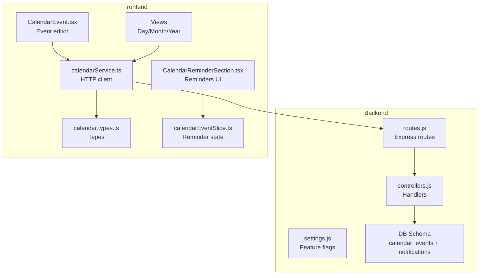
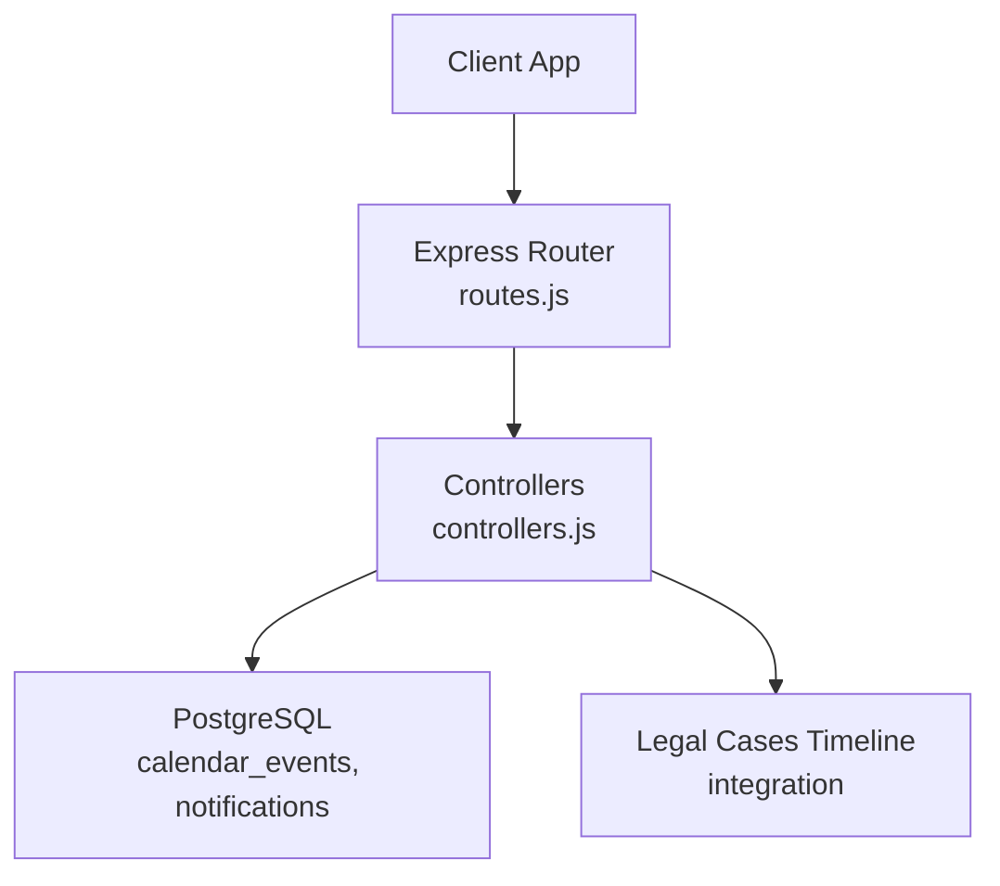
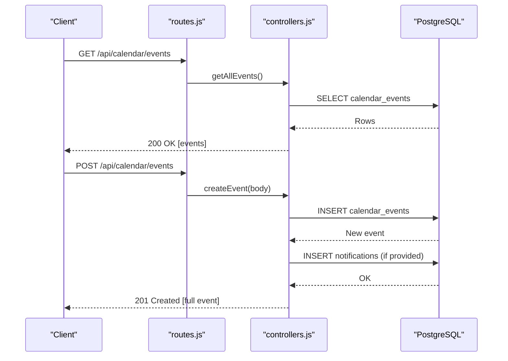
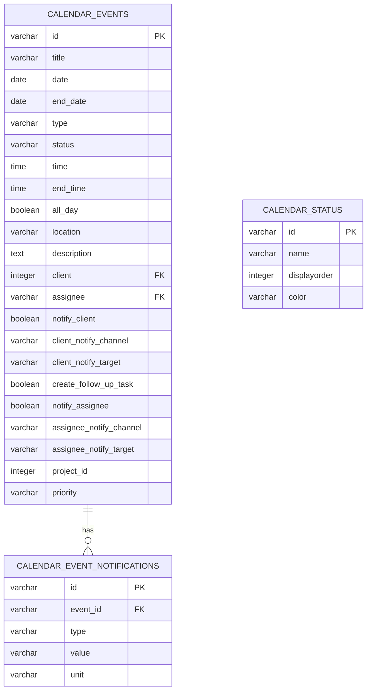
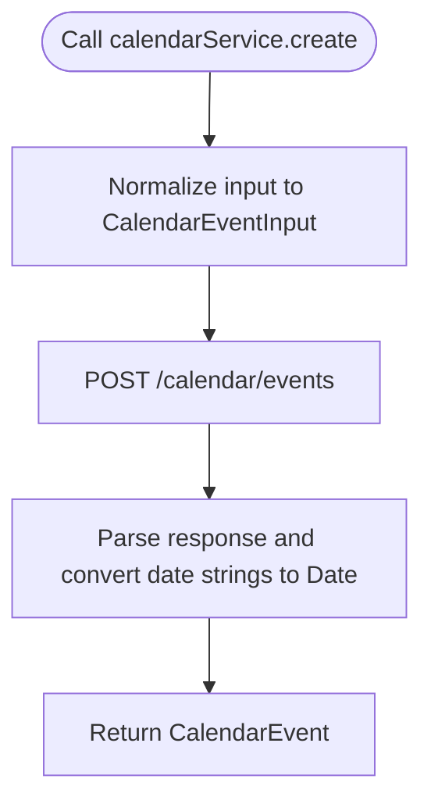
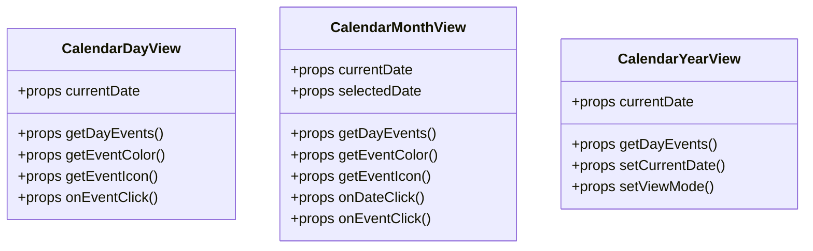
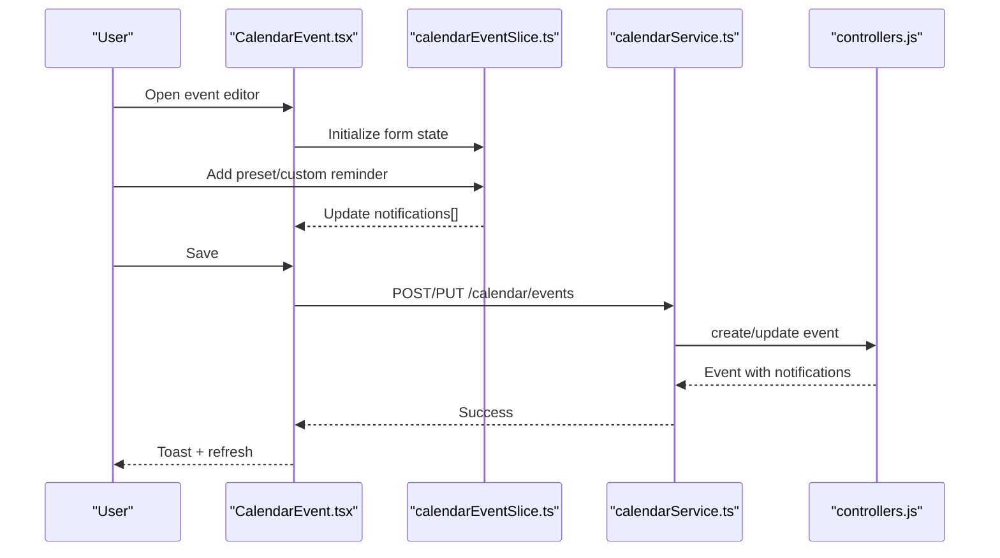
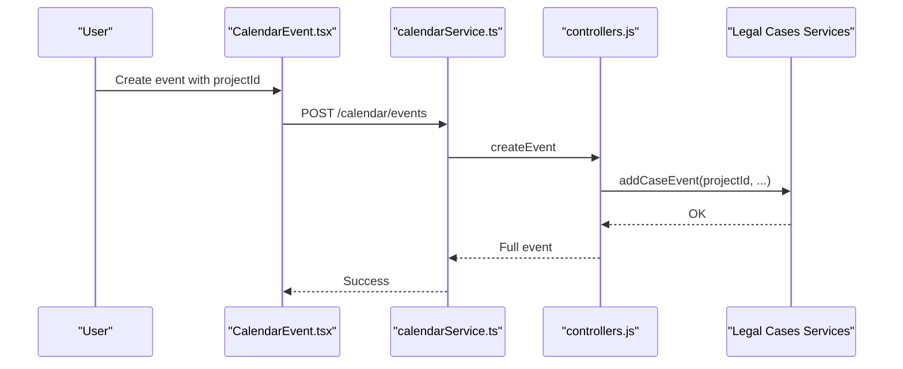
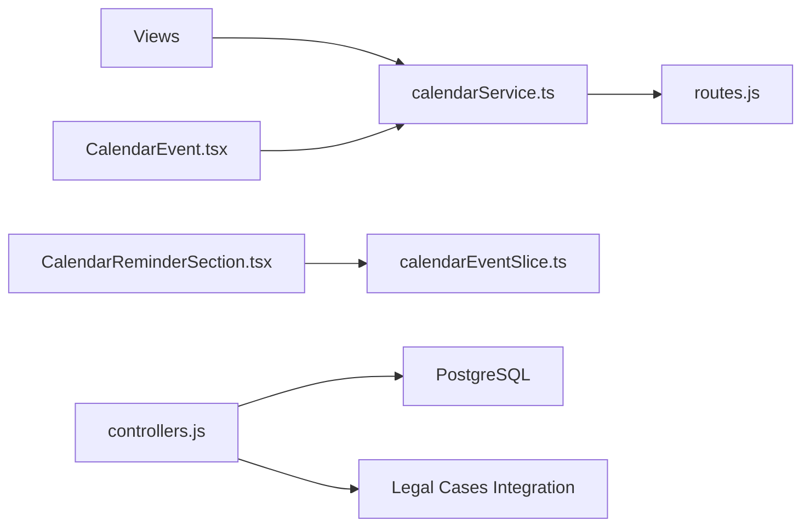

# Calendar Module

> 📄 **Синхронизировано** с [docs/modules/calendar.md](../../docs/modules/calendar.md) — актуальная компактная спецификация модуля (рус.). Ниже — подробный англоязычный разбор с исходниками и диаграммами.

<cite>
**Referenced Files in This Document**
- [backend/modules/calendar/index.js](file://backend/modules/calendar/index.js)
- [backend/modules/calendar/routes.js](file://backend/modules/calendar/routes.js)
- [backend/modules/calendar/controllers.js](file://backend/modules/calendar/controllers.js)
- [backend/modules/calendar/settings.js](file://backend/modules/calendar/settings.js)
- [backend/migrations/10_create_calendar_events_table.md](file://backend/migrations/10_create_calendar_events_table.md)
- [backend/migrations/11_fix_calendar_module.md](file://backend/migrations/11_fix_calendar_module.md)
- [backend/migrations/105_create_notifications_table.sql](file://backend/migrations/105_create_notifications_table.sql)
- [frontend/src/modules/calendar/api/calendarService.ts](file://frontend/src/modules/calendar/api/calendarService.ts)
- [frontend/src/modules/calendar/types/calendar.types.ts](file://frontend/src/modules/calendar/types/calendar.types.ts)
- [frontend/src/modules/calendar/components/CalendarEvent.tsx](file://frontend/src/modules/calendar/components/CalendarEvent.tsx)
- [frontend/src/modules/calendar/components/CalendarDayView.tsx](file://frontend/src/modules/calendar/components/CalendarDayView.tsx)
- [frontend/src/modules/calendar/components/CalendarMonthView.tsx](file://frontend/src/modules/calendar/components/CalendarMonthView.tsx)
- [frontend/src/modules/calendar/components/CalendarYearView.tsx](file://frontend/src/modules/calendar/components/CalendarYearView.tsx)
- [frontend/src/modules/calendar/components/CalendarReminderSection.tsx](file://frontend/src/modules/calendar/components/CalendarReminderSection.tsx)
- [frontend/src/modules/calendar/store/calendarEventSlice.ts](file://frontend/src/modules/calendar/store/calendarEventSlice.ts)
</cite>

## Table of Contents
1. [Introduction](#introduction)
2. [Project Structure](#project-structure)
3. [Core Components](#core-components)
4. [Architecture Overview](#architecture-overview)
5. [Detailed Component Analysis](#detailed-component-analysis)
6. [Dependency Analysis](#dependency-analysis)
7. [Performance Considerations](#performance-considerations)
8. [Troubleshooting Guide](#troubleshooting-guide)
9. [Conclusion](#conclusion)
10. [Appendices](#appendices)

## Introduction
The Calendar module provides a unified system for managing events, reminders, and integrations across the Titan CRM. It supports:
- Event lifecycle: creation, retrieval, updates, and deletion
- Reminder configuration with relative and absolute timing
- Calendar views: day, month, and year
- Integrations with other modules (projects, contractors, legal cases)
- Optional follow-up task creation and notification routing to clients and assignees

## Project Structure
The Calendar module is split into backend and frontend parts:
- Backend: Express routes, controllers, and settings; database schema via migrations
- Frontend: API service, typed models, UI components for views and forms, and Redux-style state management for reminders

**Diagram sources**
- [backend/modules/calendar/routes.js:1-25](file://backend/modules/calendar/routes.js#L1-L24)
- [backend/modules/calendar/controllers.js:1-312](file://backend/modules/calendar/controllers.js#L1-L311)
- [backend/modules/calendar/settings.js:1-25](file://backend/modules/calendar/settings.js#L1-L24)
- [backend/migrations/10_create_calendar_events_table.md:1-83](file://backend/migrations/10_create_calendar_events_table.md#L1-L83)
- [frontend/src/modules/calendar/api/calendarService.ts:1-75](file://frontend/src/modules/calendar/api/calendarService.ts#L1-L74)
- [frontend/src/modules/calendar/types/calendar.types.ts:1-66](file://frontend/src/modules/calendar/types/calendar.types.ts#L1-L65)
- [frontend/src/modules/calendar/components/CalendarEvent.tsx:1-462](file://frontend/src/modules/calendar/components/CalendarEvent.tsx#L1-L462)
- [frontend/src/modules/calendar/components/CalendarDayView.tsx:1-76](file://frontend/src/modules/calendar/components/CalendarDayView.tsx#L1-L75)
- [frontend/src/modules/calendar/components/CalendarMonthView.tsx:1-108](file://frontend/src/modules/calendar/components/CalendarMonthView.tsx#L1-L107)
- [frontend/src/modules/calendar/components/CalendarYearView.tsx:1-84](file://frontend/src/modules/calendar/components/CalendarYearView.tsx#L1-L83)
- [frontend/src/modules/calendar/components/CalendarReminderSection.tsx:1-136](file://frontend/src/modules/calendar/components/CalendarReminderSection.tsx#L1-L135)
- [frontend/src/modules/calendar/store/calendarEventSlice.ts:1-140](file://frontend/src/modules/calendar/store/calendarEventSlice.ts#L1-L139)

**Section sources**
- [backend/modules/calendar/index.js:1-14](file://backend/modules/calendar/index.js#L1-L13)
- [backend/modules/calendar/routes.js:1-25](file://backend/modules/calendar/routes.js#L1-L24)
- [backend/modules/calendar/controllers.js:1-312](file://backend/modules/calendar/controllers.js#L1-L311)
- [backend/modules/calendar/settings.js:1-25](file://backend/modules/calendar/settings.js#L1-L24)
- [backend/migrations/10_create_calendar_events_table.md:1-83](file://backend/migrations/10_create_calendar_events_table.md#L1-L83)
- [backend/migrations/11_fix_calendar_module.md:1-35](file://backend/migrations/11_fix_calendar_module.md#L1-L34)
- [frontend/src/modules/calendar/api/calendarService.ts:1-75](file://frontend/src/modules/calendar/api/calendarService.ts#L1-L74)
- [frontend/src/modules/calendar/types/calendar.types.ts:1-66](file://frontend/src/modules/calendar/types/calendar.types.ts#L1-L65)
- [frontend/src/modules/calendar/components/CalendarEvent.tsx:1-462](file://frontend/src/modules/calendar/components/CalendarEvent.tsx#L1-L462)
- [frontend/src/modules/calendar/components/CalendarDayView.tsx:1-76](file://frontend/src/modules/calendar/components/CalendarDayView.tsx#L1-L75)
- [frontend/src/modules/calendar/components/CalendarMonthView.tsx:1-108](file://frontend/src/modules/calendar/components/CalendarMonthView.tsx#L1-L107)
- [frontend/src/modules/calendar/components/CalendarYearView.tsx:1-84](file://frontend/src/modules/calendar/components/CalendarYearView.tsx#L1-L83)
- [frontend/src/modules/calendar/components/CalendarReminderSection.tsx:1-136](file://frontend/src/modules/calendar/components/CalendarReminderSection.tsx#L1-L135)
- [frontend/src/modules/calendar/store/calendarEventSlice.ts:1-140](file://frontend/src/modules/calendar/store/calendarEventSlice.ts#L1-L139)

## Core Components
- Backend module exports router and settings under a common prefix
- Routes expose CRUD endpoints for calendar events
- Controllers implement event CRUD, notification loading, and optional integration with legal case timelines
- Settings define UI defaults and feature flags (e.g., recurring events disabled)
- Frontend API service wraps HTTP requests and normalizes dates
- Types define event and notification models
- Views implement day/month/year calendars
- Reminder UI composes presets and custom reminders into a Redux-style slice

**Section sources**
- [backend/modules/calendar/index.js:1-14](file://backend/modules/calendar/index.js#L1-L13)
- [backend/modules/calendar/routes.js:1-25](file://backend/modules/calendar/routes.js#L1-L24)
- [backend/modules/calendar/controllers.js:1-312](file://backend/modules/calendar/controllers.js#L1-L311)
- [backend/modules/calendar/settings.js:1-25](file://backend/modules/calendar/settings.js#L1-L24)
- [frontend/src/modules/calendar/api/calendarService.ts:1-75](file://frontend/src/modules/calendar/api/calendarService.ts#L1-L74)
- [frontend/src/modules/calendar/types/calendar.types.ts:1-66](file://frontend/src/modules/calendar/types/calendar.types.ts#L1-L65)
- [frontend/src/modules/calendar/components/CalendarDayView.tsx:1-76](file://frontend/src/modules/calendar/components/CalendarDayView.tsx#L1-L75)
- [frontend/src/modules/calendar/components/CalendarMonthView.tsx:1-108](file://frontend/src/modules/calendar/components/CalendarMonthView.tsx#L1-L107)
- [frontend/src/modules/calendar/components/CalendarYearView.tsx:1-84](file://frontend/src/modules/calendar/components/CalendarYearView.tsx#L1-L83)
- [frontend/src/modules/calendar/components/CalendarReminderSection.tsx:1-136](file://frontend/src/modules/calendar/components/CalendarReminderSection.tsx#L1-L135)
- [frontend/src/modules/calendar/store/calendarEventSlice.ts:1-140](file://frontend/src/modules/calendar/store/calendarEventSlice.ts#L1-L139)

## Architecture Overview
The Calendar module follows a layered architecture:
- HTTP layer: Express routes
- Application layer: Controllers implementing business logic
- Persistence layer: PostgreSQL tables for events and notifications
- Presentation layer: React components and typed models
- Integration layer: Optional linkage to legal case timelines

**Diagram sources**
- [backend/modules/calendar/routes.js:1-25](file://backend/modules/calendar/routes.js#L1-L24)
- [backend/modules/calendar/controllers.js:1-312](file://backend/modules/calendar/controllers.js#L1-L311)
- [backend/migrations/10_create_calendar_events_table.md:1-83](file://backend/migrations/10_create_calendar_events_table.md#L1-L83)
- [backend/migrations/11_fix_calendar_module.md:1-35](file://backend/migrations/11_fix_calendar_module.md#L1-L34)

## Detailed Component Analysis

### Backend: Routes and Controllers
- Routes define endpoints for listing, retrieving, creating, updating, and deleting events
- Controllers:
  - Load events with notifications and map fields for frontend compatibility
  - Validate presence of the calendar events table (graceful degradation)
  - Create events with optional notifications and integration with legal case timelines
  - Update events with partial field merging and notification replacement
  - Delete events and return success status

**Diagram sources**
- [backend/modules/calendar/routes.js:1-25](file://backend/modules/calendar/routes.js#L1-L24)
- [backend/modules/calendar/controllers.js:1-312](file://backend/modules/calendar/controllers.js#L1-L311)
- [backend/migrations/10_create_calendar_events_table.md:1-83](file://backend/migrations/10_create_calendar_events_table.md#L1-L83)

**Section sources**
- [backend/modules/calendar/routes.js:1-25](file://backend/modules/calendar/routes.js#L1-L24)
- [backend/modules/calendar/controllers.js:56-303](file://backend/modules/calendar/controllers.js#L56-L303)

### Database Schema
- calendar_events: stores event metadata, status, assignee, client, project, and notification flags
- calendar_event_notifications: stores per-event reminders (relative or absolute)
- calendar_status: seeded statuses for event state management

**Diagram sources**
- [backend/migrations/10_create_calendar_events_table.md:1-83](file://backend/migrations/10_create_calendar_events_table.md#L1-L83)
- [backend/migrations/11_fix_calendar_module.md:1-35](file://backend/migrations/11_fix_calendar_module.md#L1-L34)
- [backend/migrations/105_create_notifications_table.sql:1-15](file://backend/migrations/105_create_notifications_table.sql#L1-L14)

**Section sources**
- [backend/migrations/10_create_calendar_events_table.md:1-83](file://backend/migrations/10_create_calendar_events_table.md#L1-L83)
- [backend/migrations/11_fix_calendar_module.md:1-35](file://backend/migrations/11_fix_calendar_module.md#L1-L34)
- [backend/migrations/105_create_notifications_table.sql:1-15](file://backend/migrations/105_create_notifications_table.sql#L1-L14)

### Frontend: API Service and Types
- calendarService: wraps HTTP calls, maps date strings to Date objects, and guards local-only events
- Types: define event and notification shapes, including extended UI fields and filter options

**Diagram sources**
- [frontend/src/modules/calendar/api/calendarService.ts:1-75](file://frontend/src/modules/calendar/api/calendarService.ts#L1-L74)
- [frontend/src/modules/calendar/types/calendar.types.ts:1-66](file://frontend/src/modules/calendar/types/calendar.types.ts#L1-L65)

**Section sources**
- [frontend/src/modules/calendar/api/calendarService.ts:1-75](file://frontend/src/modules/calendar/api/calendarService.ts#L1-L74)
- [frontend/src/modules/calendar/types/calendar.types.ts:1-66](file://frontend/src/modules/calendar/types/calendar.types.ts#L1-L65)

### Frontend: Calendar Views
- Day view: renders hourly slots and event blocks for a given day
- Month view: renders a weekly grid with weekday headers and hover actions to add events
- Year view: renders monthly tiles with event indicators

**Diagram sources**
- [frontend/src/modules/calendar/components/CalendarDayView.tsx:1-76](file://frontend/src/modules/calendar/components/CalendarDayView.tsx#L1-L75)
- [frontend/src/modules/calendar/components/CalendarMonthView.tsx:1-108](file://frontend/src/modules/calendar/components/CalendarMonthView.tsx#L1-L107)
- [frontend/src/modules/calendar/components/CalendarYearView.tsx:1-84](file://frontend/src/modules/calendar/components/CalendarYearView.tsx#L1-L83)

**Section sources**
- [frontend/src/modules/calendar/components/CalendarDayView.tsx:1-76](file://frontend/src/modules/calendar/components/CalendarDayView.tsx#L1-L75)
- [frontend/src/modules/calendar/components/CalendarMonthView.tsx:1-108](file://frontend/src/modules/calendar/components/CalendarMonthView.tsx#L1-L107)
- [frontend/src/modules/calendar/components/CalendarYearView.tsx:1-84](file://frontend/src/modules/calendar/components/CalendarYearView.tsx#L1-L83)

### Frontend: Event Editor and Reminders
- CalendarEvent: form for creating/updating events with contractor/project associations, assignee selection, and status/priority
- CalendarReminderSection: UI for adding preset and custom reminders (relative or absolute)
- calendarEventSlice: reducer and actions to manage reminder state in the form

**Diagram sources**
- [frontend/src/modules/calendar/components/CalendarEvent.tsx:1-462](file://frontend/src/modules/calendar/components/CalendarEvent.tsx#L1-L462)
- [frontend/src/modules/calendar/components/CalendarReminderSection.tsx:1-136](file://frontend/src/modules/calendar/components/CalendarReminderSection.tsx#L1-L135)
- [frontend/src/modules/calendar/store/calendarEventSlice.ts:1-140](file://frontend/src/modules/calendar/store/calendarEventSlice.ts#L1-L139)
- [frontend/src/modules/calendar/api/calendarService.ts:1-75](file://frontend/src/modules/calendar/api/calendarService.ts#L1-L74)
- [backend/modules/calendar/controllers.js:106-278](file://backend/modules/calendar/controllers.js#L106-L278)

**Section sources**
- [frontend/src/modules/calendar/components/CalendarEvent.tsx:1-462](file://frontend/src/modules/calendar/components/CalendarEvent.tsx#L1-L462)
- [frontend/src/modules/calendar/components/CalendarReminderSection.tsx:1-136](file://frontend/src/modules/calendar/components/CalendarReminderSection.tsx#L1-L135)
- [frontend/src/modules/calendar/store/calendarEventSlice.ts:1-140](file://frontend/src/modules/calendar/store/calendarEventSlice.ts#L1-L139)
- [frontend/src/modules/calendar/api/calendarService.ts:1-75](file://frontend/src/modules/calendar/api/calendarService.ts#L1-L74)
- [backend/modules/calendar/controllers.js:106-278](file://backend/modules/calendar/controllers.js#L106-L278)

### Calendar Integration with Other Modules
- Legal cases: When creating an event linked to a project, a timeline entry is added to the legal case module
- Contractors and projects: Event editor allows associating a contractor and project, and auto-filling location from contractor data

**Diagram sources**
- [backend/modules/calendar/controllers.js:169-183](file://backend/modules/calendar/controllers.js#L169-L183)
- [frontend/src/modules/calendar/components/CalendarEvent.tsx:280-308](file://frontend/src/modules/calendar/components/CalendarEvent.tsx#L280-L308)

**Section sources**
- [backend/modules/calendar/controllers.js:169-183](file://backend/modules/calendar/controllers.js#L169-L183)
- [frontend/src/modules/calendar/components/CalendarEvent.tsx:280-308](file://frontend/src/modules/calendar/components/CalendarEvent.tsx#L280-L308)

## Dependency Analysis
- Backend depends on:
  - Express router and controllers
  - Database access via a shared connection
  - Optional integration with legal cases services
- Frontend depends on:
  - Typed models for events and notifications
  - API service for HTTP communication
  - UI components for views and reminders
  - Redux-style state management for reminders

**Diagram sources**
- [frontend/src/modules/calendar/api/calendarService.ts:1-75](file://frontend/src/modules/calendar/api/calendarService.ts#L1-L74)
- [frontend/src/modules/calendar/components/CalendarEvent.tsx:1-462](file://frontend/src/modules/calendar/components/CalendarEvent.tsx#L1-L462)
- [frontend/src/modules/calendar/components/CalendarReminderSection.tsx:1-136](file://frontend/src/modules/calendar/components/CalendarReminderSection.tsx#L1-L135)
- [frontend/src/modules/calendar/store/calendarEventSlice.ts:1-140](file://frontend/src/modules/calendar/store/calendarEventSlice.ts#L1-L139)
- [backend/modules/calendar/routes.js:1-25](file://backend/modules/calendar/routes.js#L1-L24)
- [backend/modules/calendar/controllers.js:1-312](file://backend/modules/calendar/controllers.js#L1-L311)

**Section sources**
- [frontend/src/modules/calendar/api/calendarService.ts:1-75](file://frontend/src/modules/calendar/api/calendarService.ts#L1-L74)
- [frontend/src/modules/calendar/components/CalendarEvent.tsx:1-462](file://frontend/src/modules/calendar/components/CalendarEvent.tsx#L1-L462)
- [frontend/src/modules/calendar/components/CalendarReminderSection.tsx:1-136](file://frontend/src/modules/calendar/components/CalendarReminderSection.tsx#L1-L135)
- [frontend/src/modules/calendar/store/calendarEventSlice.ts:1-140](file://frontend/src/modules/calendar/store/calendarEventSlice.ts#L1-L139)
- [backend/modules/calendar/routes.js:1-25](file://backend/modules/calendar/routes.js#L1-L24)
- [backend/modules/calendar/controllers.js:1-312](file://backend/modules/calendar/controllers.js#L1-L311)

## Performance Considerations
- Database queries:
  - Events listing sorts by date/time; consider indexing on date and time for large datasets
  - Notification loading is per-event; batch loading could reduce round-trips
- Frontend:
  - Views render fixed grids; virtualization may improve large month/year rendering
  - Date parsing occurs on the client; ensure efficient re-renders via memoization
- Integrations:
  - Legal case timeline writes occur synchronously during event creation; consider queueing for scalability

[No sources needed since this section provides general guidance]

## Troubleshooting Guide
- Calendar events table not found:
  - Backend responds with validation errors or empty lists depending on operation
  - Ensure migrations are applied and the table exists
- Event not found:
  - GET/PUT/DELETE on non-existent ID returns not found
- Validation errors:
  - Missing title or date on creation triggers validation error
- Local-only events:
  - Attempting to load server-side IDs for locally generated events is blocked by the API service

**Section sources**
- [backend/modules/calendar/controllers.js:47-54](file://backend/modules/calendar/controllers.js#L47-L54)
- [backend/modules/calendar/controllers.js:91-101](file://backend/modules/calendar/controllers.js#L91-L101)
- [backend/modules/calendar/controllers.js:112-131](file://backend/modules/calendar/controllers.js#L112-L131)
- [frontend/src/modules/calendar/api/calendarService.ts:19-35](file://frontend/src/modules/calendar/api/calendarService.ts#L19-L35)

## Conclusion
The Calendar module offers a robust foundation for event management with reminders, flexible views, and integrations. Its backend provides a clean CRUD surface with graceful handling for missing schema, while the frontend delivers an intuitive editing experience and configurable reminder system. Extending features like recurring events and real-time updates would build upon the current architecture.

[No sources needed since this section summarizes without analyzing specific files]

## Appendices

### Practical Examples

- Event scheduling
  - Use the event editor to set title, dates, time, location, and associate a contractor/project
  - Save the event; the API returns a normalized event object with notifications
  - Example path: [frontend/src/modules/calendar/components/CalendarEvent.tsx:201-236](file://frontend/src/modules/calendar/components/CalendarEvent.tsx#L201-L236)

- Reminder configuration
  - Add preset reminders (e.g., 15 minutes, 1 hour, 1 day) or define custom relative/absolute reminders
  - Reminders are stored per event and included in the saved event payload
  - Example path: [frontend/src/modules/calendar/components/CalendarReminderSection.tsx:69-127](file://frontend/src/modules/calendar/components/CalendarReminderSection.tsx#L69-L127), [frontend/src/modules/calendar/store/calendarEventSlice.ts:84-116](file://frontend/src/modules/calendar/store/calendarEventSlice.ts#L84-L116)

- Calendar integration workflows
  - Creating an event linked to a project adds a timeline entry to the legal case module
  - Example path: [backend/modules/calendar/controllers.js:169-183](file://backend/modules/calendar/controllers.js#L169-L183)

- Calendar view usage
  - Switch between day, month, and year views; click cells to add events or select events to edit
  - Example paths: [frontend/src/modules/calendar/components/CalendarDayView.tsx:15-75](file://frontend/src/modules/calendar/components/CalendarDayView.tsx#L15-L75), [frontend/src/modules/calendar/components/CalendarMonthView.tsx:20-107](file://frontend/src/modules/calendar/components/CalendarMonthView.tsx#L20-L107), [frontend/src/modules/calendar/components/CalendarYearView.tsx:21-83](file://frontend/src/modules/calendar/components/CalendarYearView.tsx#L21-L83)

### Technical Implementation Notes

- Data synchronization and real-time updates
  - Current implementation relies on polling via the API service
  - To enable real-time updates, integrate a WebSocket layer and invalidate queries on server-side changes
  - Example path for query invalidation: [frontend/src/modules/calendar/components/CalendarEvent.tsx](file://frontend/src/modules/calendar/components/CalendarEvent.tsx#L230)

- Reminder delivery and escalation
  - Reminder records are stored in calendar_event_notifications
  - Delivery channels (email, SMS, WhatsApp, app) are configured per event
  - Escalation workflows are not implemented in the current codebase; consider adding scheduled jobs to trigger notifications and escalations

**Section sources**
- [frontend/src/modules/calendar/components/CalendarEvent.tsx:201-236](file://frontend/src/modules/calendar/components/CalendarEvent.tsx#L201-L236)
- [frontend/src/modules/calendar/components/CalendarReminderSection.tsx:69-127](file://frontend/src/modules/calendar/components/CalendarReminderSection.tsx#L69-L127)
- [frontend/src/modules/calendar/store/calendarEventSlice.ts:84-116](file://frontend/src/modules/calendar/store/calendarEventSlice.ts#L84-L116)
- [backend/modules/calendar/controllers.js:169-183](file://backend/modules/calendar/controllers.js#L169-L183)
- [frontend/src/modules/calendar/components/CalendarDayView.tsx:15-75](file://frontend/src/modules/calendar/components/CalendarDayView.tsx#L15-L75)
- [frontend/src/modules/calendar/components/CalendarMonthView.tsx:20-107](file://frontend/src/modules/calendar/components/CalendarMonthView.tsx#L20-L107)
- [frontend/src/modules/calendar/components/CalendarYearView.tsx:21-83](file://frontend/src/modules/calendar/components/CalendarYearView.tsx#L21-L83)
- [frontend/src/modules/calendar/components/CalendarEvent.tsx:230](file://frontend/src/modules/calendar/components/CalendarEvent.tsx#L230)