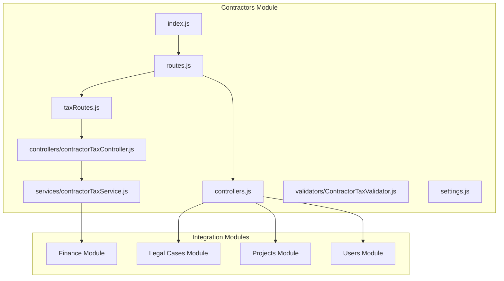
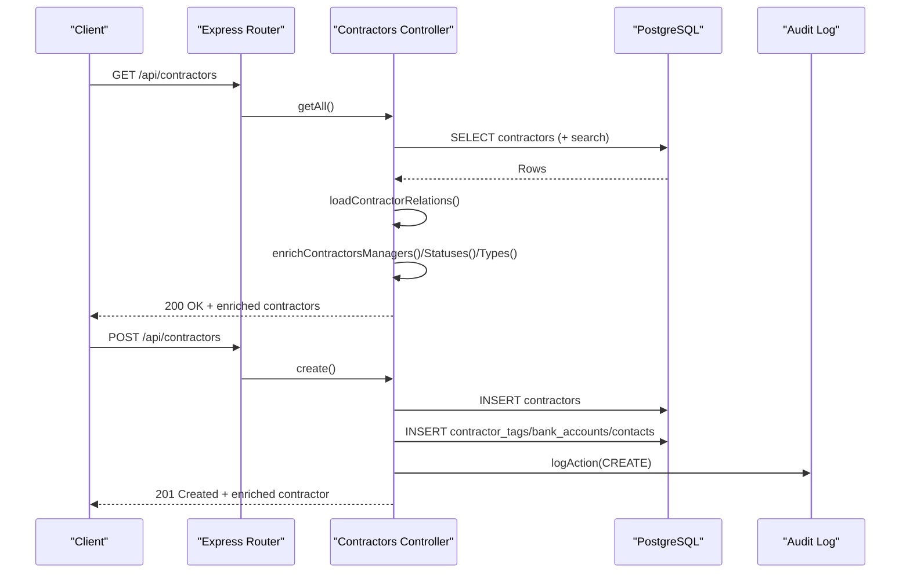
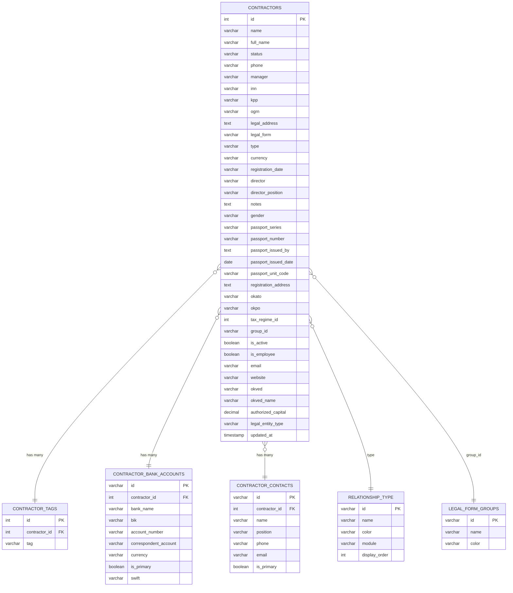
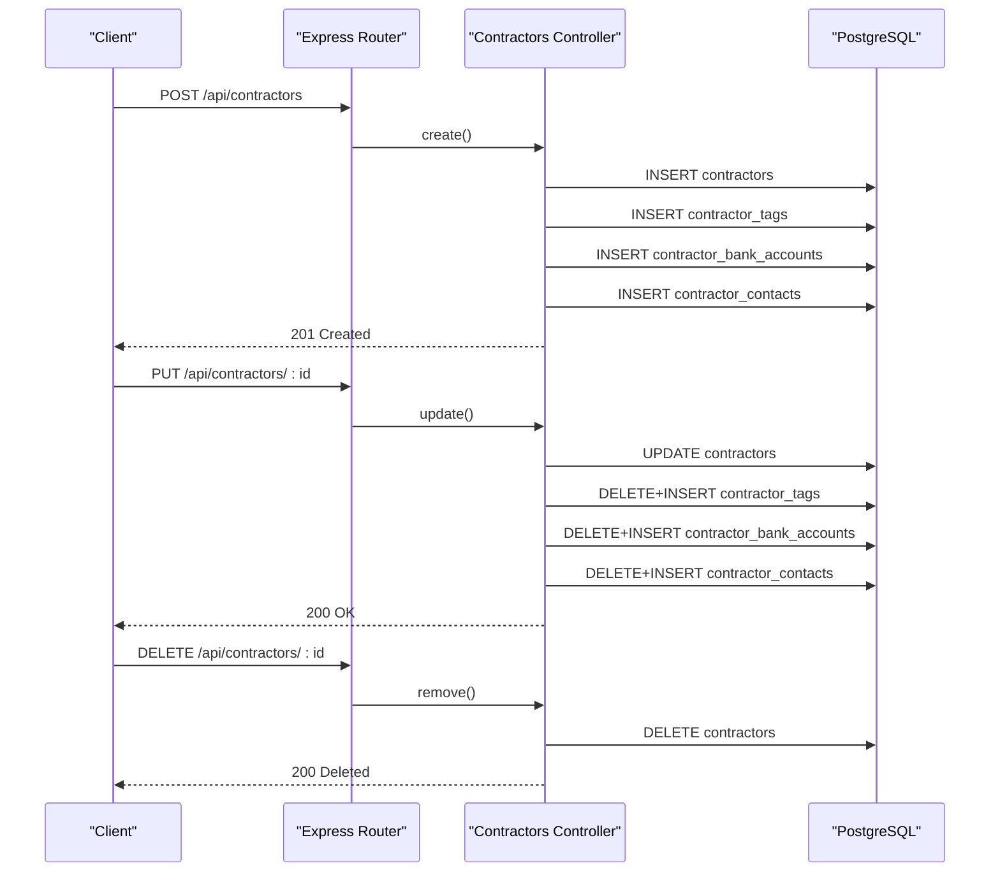
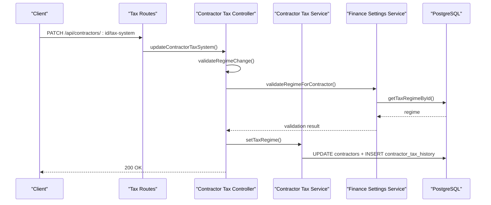
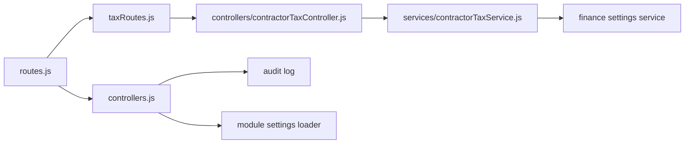

# Contractor/Client Management

<cite>
**Referenced Files in This Document**
- [index.js](file://backend/modules/contractors/index.js)
- [routes.js](file://backend/modules/contractors/routes.js)
- [controllers.js](file://backend/modules/contractors/controllers.js)
- [controllers/contractorTaxController.js](file://backend/modules/contractors/controllers/contractorTaxController.js)
- [services/contractorTaxService.js](file://backend/modules/contractors/services/contractorTaxService.js)
- [validators/ContractorTaxValidator.js](file://backend/modules/contractors/validators/ContractorTaxValidator.js)
- [taxRoutes.js](file://backend/modules/contractors/taxRoutes.js)
- [settings.js](file://backend/modules/contractors/settings.js)
- [02_create_contractors_table.md](file://backend/migrations/02_create_contractors_table.md)
- [119_extend_contractors_for_individuals_and_foreign.sql](file://backend/migrations/119_extend_contractors_for_individuals_and_foreign.sql)
- [18_create_relationship_types_table.md](file://backend/migrations/18_create_relationship_types_table.md)
- [117_add_group_id_to_contractors.sql](file://backend/migrations/117_add_group_id_to_contractors.sql)
- [111_contractor_tax_history.sql](file://backend/migrations/111_contractor_tax_history.sql)
- [104_add_tax_regime_to_contractors.sql](file://backend/migrations/104_add_tax_regime_to_contractors.sql)
- [65_add_legal_entity_type.sql](file://backend/migrations/65_add_legal_entity_type.sql)
- [56_add_user_activity_tracking.md](file://backend/migrations/56_add_user_activity_tracking.md)
- [69_projects_finance_phase1.sql](file://backend/migrations/69_projects_finance_phase1.sql)
- [71_project_expenses_table.sql](file://backend/migrations/71_project_expenses_table.sql)
- [49_create_finance_module_tables.md](file://backend/migrations/49_create_finance_module_tables.md)
- [200_case_instances_and_relations.sql](file://backend/migrations/200_case_instances_and_relations.sql)
- [05_create_legal_cases_table.md](file://backend/migrations/05_create_legal_cases_table.md)
- [01_create_projects_table.md](file://backend/migrations/01_create_projects_table.md)
- [007_add_position_role.sql](file://backend/migrations/007_add_position_role.sql)
- [008_employee_positions_many_to_many.sql](file://backend/migrations/008_employee_positions_many_to_many.sql)
- [57_add_contractor_id_to_employees.sql](file://backend/migrations/57_add_contractor_id_to_employees.sql)
- [58_add_color_to_priority_table.md](file://backend/migrations/58_add_color_to_priority_table.md)
- [58_add_color_to_priority_table.sql](file://backend/migrations/58_add_color_to_priority_table.sql)
- [116_expand_legal_forms_code.sql](file://backend/migrations/116_expand_legal_forms_code.sql)
- [66_fix_legal_form_columns.sql](file://backend/migrations/66_fix_legal_form_columns.sql)
- [67_create_legal_form_groups.sql](file://backend/migrations/67_create_legal_form_groups.sql)
- [67b_insert_legal_forms.sql](file://backend/migrations/67b_insert_legal_forms.sql)
- [115_add_color_to_legal_forms.sql](file://backend/migrations/115_add_color_to_legal_forms.sql)
- [113_add_legal_forms_keywords.sql](file://backend/migrations/113_add_legal_forms_keywords.sql)
- [114_fix_legal_forms_schema.sql](file://backend/migrations/114_fix_legal_forms_schema.sql)
- [112_add_vat_to_invoices.sql](file://backend/migrations/112_add_vat_to_invoices.sql)
- [118_add_is_active_to_relationship_type.sql](file://backend/migrations/118_add_is_active_to_relationship_type.sql)
- [112_add_vat_to_invoices.sql](file://backend/migrations/112_add_vat_to_invoices.sql)
- [104_add_template_flag_to_documents.sql](file://backend/migrations/104_add_template_flag_to_documents.sql)
- [104_add_missing_mail_filter_columns.sql](file://backend/migrations/104_add_missing_mail_filter_columns.sql)
- [100_add_project_stage_id_to_tasks.sql](file://backend/migrations/100_add_project_stage_id_to_tasks.sql)
- [101_create_workflow_tables.sql](file://backend/migrations/101_create_workflow_tables.sql)
- [102_add_workflow_step_condition.sql](file://backend/migrations/102_add_workflow_step_condition.sql)
- [103_create_audit_log_table.sql](file://backend/migrations/102_create_audit_log_table.sql)
- [105_create_notifications_table.sql](file://backend/migrations/105_create_notifications_table.sql)
- [107_fix_workflow_jsonb.sql](file://backend/migrations/107_fix_workflow_jsonb.sql)
- [108_add_updated_at_to_legal_cases.sql](file://backend/migrations/108_add_updated_at_to_legal_cases.sql)
- [109_create_reference_tables.md](file://backend/migrations/09_create_reference_tables.md)
- [10_create_calendar_events_table.md](file://backend/migrations/10_create_calendar_events_table.md)
- [12_enhance_calendar_status_styling.md](file://backend/migrations/12_enhance_calendar_status_styling.md)
- [13_create_system_logs_table.md](file://backend/migrations/13_create_system_logs_table.md)
- [14_create_modules_and_tags.md](file://backend/migrations/14_create_modules_and_tags.md)
- [15_add_color_to_status_tables.md](file://backend/migrations/15_add_color_to_status_tables.md)
- [16_add_user_details.md](file://backend/migrations/16_add_user_details.md)
- [17_create_system_settings.md](file://backend/migrations/17_create_system_settings.md)
- [17_create_system_settings.sql](file://backend/migrations/17_create_system_settings.sql)
- [19_create_quick_actions_table.md](file://backend/migrations/19_create_quick_actions_table.md)
- [203_workflow_pause_resume.sql](file://backend/migrations/203_workflow_pause_resume.sql)
- [20_seed_migrated_data.md](file://backend/migrations/20_seed_migrated_data.md)
- [25_update_tags_to_css_variants.md](file://backend/migrations/25_update_tags_to_css_variants.md)
- [26_create_roles_and_permissions_tables.md](file://backend/migrations/26_create_roles_and_permissions_tables.md)
- [27_fix_display_order_columns.md](file://backend/migrations/27_fix_display_order_columns.md)
- [28_standardize_displayorder_columns.md](file://backend/migrations/28_standardize_displayorder_columns.md)
- [29_seed_access_matrix.md](file://backend/migrations/29_seed_access_matrix.md)
- [30_fix_contractor_tags_unique_constraint.md](file://backend/migrations/30_fix_contractor_tags_unique_constraint.md)
- [31_fix_legal_cases_comprehensive.md](file://backend/migrations/31_fix_legal_cases_comprehensive.md)
- [34_add_missing_quick_actions.md](file://backend/migrations/34_add_missing_quick_actions.md)
- [35_add_auth_columns_to_users.md](file://backend/migrations/35_add_auth_columns_to_users.md)
- [36_fix_password_hashes.md](file://backend/migrations/36_fix_password_hashes.md)
- [37_force_update_all_password_hashes.md](file://backend/migrations/37_force_update_all_password_hashes.md)
- [38_seed_documents_data.md](file://backend/migrations/38_seed_documents_data.md)
- [39_add_stored_filename_to_documents.md](file://backend/migrations/39_add_stored_filename_to_documents.md)
- [40_create_subtasks_table.md](file://backend/migrations/40_create_subtasks_table.md)
- [41_fix_tasks_due_date_column.md](file://backend/migrations/41_fix_tasks_due_date_column.md)
- [42_add_lawyers_quick_actions.md](file://backend/migrations/42_add_lawyers_quick_actions.md)
- [43_add_parent_id_column_to_projects.md](file://backend/migrations/43_add_parent_id_column_to_projects.md)
- [44_add_description_to_legal_cases.md](file://backend/migrations/44_add_description_to_legal_cases.md)
- [45_ensure_legal_cases_columns.md](file://backend/migrations/45_ensure_legal_cases_columns.md)
- [46_add_missing_case_tables.md](file://backend/migrations/46_add_missing_case_tables.md)
- [47_add_lawyer_columns_to_users.md](file://backend/migrations/47_add_lawyer_columns_to_users.md)
- [48_fix_legal_cases_column_names.md](file://backend/migrations/48_fix_legal_cases_column_names.md)
- [50_seed_finance_quick_actions.md](file://backend/migrations/50_seed_finance_quick_actions.md)
- [51_extend_finance_module.md](file://backend/migrations/51_extend_finance_module.md)
- [52_add_uploaded_by_to_documents.md](file://backend/migrations/52_add_uploaded_by_to_documents.md)
- [53_create_share_links_table.md](file://backend/migrations/53_create_share_links_table.md)
- [54_create_enrichment_jobs_table.md](file://backend/migrations/54_create_enrichment_jobs_table.md)
- [55_add_processed_contractor_ids_to_enrichment_jobs.md](file://backend/migrations/55_add_processed_contractor_ids_to_enrichment_jobs.md)
- [59_add_enriched_at_to_contractors.md](file://backend/migrations/59_add_enriched_at_to_contractors.md)
- [60_create_courts_and_judges_tables.md](file://backend/migrations/60_create_courts_and_judges_tables.md)
- [61_add_missing_legal_cases_columns.md](file://backend/migrations/61_add_missing_legal_cases_columns.md)
- [62_create_case_note_attachments_table.md](file://backend/migrations/62_create_case_note_attachments_table.md)
- [63_INSTALL_INSTRUCTIONS.md.txt](file://backend/migrations/63_INSTALL_INSTRUCTIONS.md.txt)
- [63_create_case_outcome_table.md](file://backend/migrations/63_create_case_outcome_table.md)
- [63_create_case_outcome_table.sql](file://backend/migrations/63_create_case_outcome_table.sql)
- [64_create_enrichment_stats_table.sql](file://backend/migrations/64_create_enrichment_stats_table.sql)
- [68_create_module_settings_table.sql](file://backend/migrations/68_create_module_settings_table.sql)
- [69_add_finance_payments_unique_constraint.sql](file://backend/migrations/69_add_finance_payments_unique_constraint.sql)
- [70_add_import_rollback_support.sql](file://backend/migrations/70_add_import_rollback_support.sql)
- [70_add_updated_at_to_finance_payments.sql](file://backend/migrations/70_add_updated_at_to_finance_payments.sql)
- [70_finance_tax_settings.sql](file://backend/migrations/70_finance_tax_settings.sql)
- [72_tax_rates_effective_dates.sql](file://backend/migrations/72_tax_rates_effective_dates.sql)
- [73_project_expenses_revenues_categories.sql](file://backend/migrations/73_project_expenses_revenues_categories.sql)
- [74_add_stage_id_to_revenues_expenses.sql](file://backend/migrations/74_add_stage_id_to_revenues_expenses.sql)
- [76_mail_comprehensive_schema.sql](file://backend/migrations/76_mail_comprehensive_schema.sql)
- [77_mail_sync_improvements.sql](file://backend/migrations/77_mail_sync_improvements.sql)
- [78_mail_fulltext_search.sql](file://backend/migrations/78_mail_fulltext_search.sql)
- [78_mail_include_subfolders.sql](file://backend/migrations/78_mail_include_subfolders.sql)
- [79_add_sync_mode_to_mail_accounts.sql](file://backend/migrations/79_add_sync_mode_to_mail_accounts.sql)
- [96_add_log_to_db_setting.sql](file://backend/migrations/96_add_log_to_db_setting.sql)
- [97_create_quick_actions_and_seed.sql](file://backend/migrations/97_create_quick_actions_and_seed.sql)
- [98_add_quick_actions_all_modules.sql](file://backend/migrations/98_add_quick_actions_all_modules.sql)
- [99_fix_quick_actions_working_only.sql](file://backend/migrations/99_fix_quick_actions_working_only.sql)
- [MIGRATION_GUIDE.md](file://docs/MIGRATION_GUIDE.md)
- [CONTRACTORS_BADGES.md](file://docs/modules/CONTRACTORS_BADGES.md)
- [TESTING_GUIDE.md](file://docs/guides/TESTING_GUIDE.md)
- [WORKFLOW_TABLES_REFERENCE.md](file://docs/WORKFLOW_TABLES_REFERENCE.md)
- [ARCHITECTURE.md](file://docs/ARCHITECTURE.md)
- [API_USAGE.md](file://docs/api/API_USAGE.md)
- [CONTRACTORS.md](file://docs/api/CONTRACTORS.md)
- [FINANCE.md](file://docs/api/FINANCE.md)
- [LEGAL_CASES.md](file://docs/api/LEGAL_CASES.md)
- [PROJECTS.md](file://docs/api/PROJECTS.md)
- [USERS.md](file://docs/api/USERS.md)
- [USER_SETTINGS.md](file://docs/api/USER_SETTINGS.md)
- [PERMISSIONS.md](file://docs/api/PERMISSIONS.md)
- [SYSTEM_SETTINGS.md](file://docs/api/SYSTEM_SETTINGS.md)
- [AUTH.md](file://docs/api/AUTH.md)
- [BACKUP.md](file://docs/api/BACKUP.md)
- [LOGS.md](file://docs/api/LOGS.md)
- [REFERENCES.md](file://docs/api/REFERENCES.md)
- [TASKS.md](file://docs/api/TASKS.md)
- [DOCUMENTS.md](file://docs/api/DOCUMENTS.md)
- [CALENDAR.md](file://docs/api/CALENDAR.md)
- [LAWYERS.md](file://docs/api/LAWYERS.md)
- [CASE_OUTCOMES.md](file://docs/INSTALL_INSTRUCTIONS_CASE_OUTCOMES.md)
- [USER_MANAGEMENT.md](file://docs/modules/USER_MANAGEMENT.md)
- [SETTINGS_STRUCTURE.md](file://docs/modules/SETTINGS_STRUCTURE.md)
- [NOTIFICATIONS.md](file://docs/modules/NOTIFICATIONS.md)
- [READY_TO_TEST.md](file://docs/modules/READY_TO_TEST.md)
- [MODULE_SETTINGS_QUICK_REFERENCE.md](file://docs/MODULE_SETTINGS_QUICK_REFERENCE.md)
- [MODULE_SETTINGS_REFACTORING.md](file://docs/MODULE_SETTINGS_REFACTORING.md)
- [PAYMENT_NUMBER_COLUMN.md](file://docs/PAYMENT_NUMBER_COLUMN.md)
- [PAYMENT_UNLINK_CONFIRMATION.md](file://docs/PAYMENT_UNLINK_CONFIRMATION.md)
- [PERMISSIONS_SYSTEM.md](file://docs/PERMISSIONS_SYSTEM.md)
- [README.md](file://docs/README.md)
- [SEED.md](file://docs/backend/SEED.md)
- [STATEMENTS_IMPORT_GUIDE.md](file://docs/backend/STATEMENTS_IMPORT_GUIDE.md)
- [CONTRACTORS.spec.ts](file://e2e/contractors.spec.ts)
- [contractors_crud.spec.ts](file://e2e/contractors_crud.spec.ts)
- [contractors_full_cycle.spec.ts](file://e2e/contractors_full_cycle.spec.ts)
</cite>

## Table of Contents
1. [Introduction](#introduction)
2. [Project Structure](#project-structure)
3. [Core Components](#core-components)
4. [Architecture Overview](#architecture-overview)
5. [Detailed Component Analysis](#detailed-component-analysis)
6. [Dependency Analysis](#dependency-analysis)
7. [Performance Considerations](#performance-considerations)
8. [Troubleshooting Guide](#troubleshooting-guide)
9. [Conclusion](#conclusion)
10. [Appendices](#appendices)

## Introduction
This document describes the Contractor/Client Management module of the CRM system. It covers the contractor data model, CRUD operations, search and filtering, bulk editing, creation workflow, validation and normalization, and integrations with legal cases, projects, and finance. It also explains contractor types, statuses, and activity tracking.

## Project Structure
The Contractor module is implemented as a backend Express module with dedicated controllers, services, validators, and routes. It exposes REST endpoints under /api/contractors and integrates with the Finance and Legal Cases modules for tax and case-related functionality.

**Diagram sources**
- [index.js:1-14](file://backend/modules/contractors/index.js#L1-L13)
- [routes.js:1-25](file://backend/modules/contractors/routes.js#L1-L25)
- [controllers.js:1-563](file://backend/modules/contractors/controllers.js#L1-L563)
- [controllers/contractorTaxController.js:1-254](file://backend/modules/contractors/controllers/contractorTaxController.js#L1-L254)
- [services/contractorTaxService.js:1-311](file://backend/modules/contractors/services/contractorTaxService.js#L1-L311)
- [validators/ContractorTaxValidator.js:1-172](file://backend/modules/contractors/validators/ContractorTaxValidator.js#L1-L172)
- [taxRoutes.js:1-22](file://backend/modules/contractors/taxRoutes.js#L1-L22)

**Section sources**
- [index.js:1-14](file://backend/modules/contractors/index.js#L1-L13)
- [routes.js:1-25](file://backend/modules/contractors/routes.js#L1-L25)
- [settings.js:1-28](file://backend/modules/contractors/settings.js#L1-L27)

## Core Components
- Controllers: Implement HTTP endpoints for CRUD, search, bulk updates, and activity tracking. They orchestrate data loading, enrichment, and audit logging.
- Services: Provide domain logic for contractor tax info, regime changes, limits checking, and optimization suggestions.
- Validators: Enforce regime change validation against legal forms and regime constraints.
- Routes: Define endpoint paths and attach middleware for permissions.
- Settings: Configure display defaults, features, and enrichment behavior.

**Section sources**
- [controllers.js:1-563](file://backend/modules/contractors/controllers.js#L1-L563)
- [services/contractorTaxService.js:1-311](file://backend/modules/contractors/services/contractorTaxService.js#L1-L311)
- [validators/ContractorTaxValidator.js:1-172](file://backend/modules/contractors/validators/ContractorTaxValidator.js#L1-L172)
- [routes.js:1-25](file://backend/modules/contractors/routes.js#L1-L25)
- [settings.js:1-28](file://backend/modules/contractors/settings.js#L1-L27)

## Architecture Overview
The module follows a layered architecture:
- HTTP Layer: Routes define endpoints.
- Application Layer: Controllers handle requests, call services, and manage relations.
- Domain Layer: Services encapsulate business rules (tax regimes, limits).
- Persistence Layer: Database queries and migrations define schema and relationships.

**Diagram sources**
- [routes.js:11-19](file://backend/modules/contractors/routes.js#L11-L19)
- [controllers.js:138-307](file://backend/modules/contractors/controllers.js#L138-L307)
- [103_create_audit_log_table.sql](file://backend/migrations/102_create_audit_log_table.sql)

## Detailed Component Analysis

### Data Model and Schema
The contractor entity and related tables are defined via migrations. The core table stores personal and business identifiers, contact details, and relationship metadata. Supporting tables capture tags, bank accounts, and contacts.

**Diagram sources**
- [02_create_contractors_table.md:8-86](file://backend/migrations/02_create_contractors_table.md#L8-L85)
- [119_extend_contractors_for_individuals_and_foreign.sql:6-25](file://backend/migrations/119_extend_contractors_for_individuals_and_foreign.sql#L6-L25)
- [18_create_relationship_types_table.md:6-29](file://backend/migrations/18_create_relationship_types_table.md#L6-L29)
- [117_add_group_id_to_contractors.sql:1-22](file://backend/migrations/117_add_group_id_to_contractors.sql#L1-L21)

**Section sources**
- [02_create_contractors_table.md:1-86](file://backend/migrations/02_create_contractors_table.md#L1-L85)
- [119_extend_contractors_for_individuals_and_foreign.sql:1-28](file://backend/migrations/119_extend_contractors_for_individuals_and_foreign.sql#L1-L27)
- [18_create_relationship_types_table.md:1-29](file://backend/migrations/18_create_relationship_types_table.md#L1-L29)
- [117_add_group_id_to_contractors.sql:1-22](file://backend/migrations/117_add_group_id_to_contractors.sql#L1-L21)

### CRUD Operations
- List contractors with optional search and pagination.
- Retrieve a single contractor with related tags, bank accounts, and contacts.
- Create a contractor with automatic enrichment of managers, statuses, and types.
- Update a contractor with relation replacement and audit logging.
- Delete a contractor with audit logging.
- Bulk update selected fields across multiple contractors.

**Diagram sources**
- [routes.js:11-19](file://backend/modules/contractors/routes.js#L11-L19)
- [controllers.js:195-459](file://backend/modules/contractors/controllers.js#L195-L459)

**Section sources**
- [controllers.js:138-459](file://backend/modules/contractors/controllers.js#L138-L459)
- [routes.js:11-19](file://backend/modules/contractors/routes.js#L11-L19)

### Search and Filtering
- Search supports name, full_name, INN, and OGRN with ILIKE matching and capped limit.
- Pagination uses module settings with a default item per page and optional limit override.

**Section sources**
- [controllers.js:138-171](file://backend/modules/contractors/controllers.js#L138-L171)
- [settings.js:6-10](file://backend/modules/contractors/settings.js#L6-L10)

### Bulk Editing
- Bulk update allows changing status, type, legal_form, manager, tax_regime_id, and group_id across multiple contractors.
- Tag updates are supported by replacing existing tags per contractor.
- Transactions ensure atomicity across updates.

**Section sources**
- [controllers.js:461-538](file://backend/modules/contractors/controllers.js#L461-L538)

### Creation Workflow, Validation, and Normalization
- Request payload includes personal/business fields, contact details, and related arrays (tags, bank accounts, contacts).
- Automatic normalization:
  - Employee flag derived from relationship type.
  - Manager/status/type enrichment via lookup tables.
  - Tags normalized to module-scoped defined tags with auto-creation.
  - Bank accounts and contacts inserted with generated IDs when missing.
- Audit logging captures create actions with user agent and IP.

**Section sources**
- [controllers.js:195-307](file://backend/modules/contractors/controllers.js#L195-L307)

### Activity Tracking
- Endpoint retrieves contractor activity from audit log with user name join.
- Optional deletion of specific activity entries with permission enforcement.

**Section sources**
- [controllers.js:540-560](file://backend/modules/contractors/controllers.js#L540-L560)
- [routes.js:14-15](file://backend/modules/contractors/routes.js#L14-L15)
- [103_create_audit_log_table.sql](file://backend/migrations/102_create_audit_log_table.sql)

### Tax Information and Legal Forms Integration
- Tax endpoints provide tax info, regime change, calculations, history, limits check, and optimization suggestions.
- Legal forms and tax regimes are managed in the Finance module and mapped by legal form code.
- Validator ensures regime changes are allowed for the contractor’s legal form and within limits.

**Diagram sources**
- [taxRoutes.js:10-21](file://backend/modules/contractors/taxRoutes.js#L10-L21)
- [controllers/contractorTaxController.js:62-110](file://backend/modules/contractors/controllers/contractorTaxController.js#L62-L110)
- [services/contractorTaxService.js:77-134](file://backend/modules/contractors/services/contractorTaxService.js#L77-L134)
- [validators/ContractorTaxValidator.js:16-55](file://backend/modules/contractors/validators/ContractorTaxValidator.js#L16-L55)

**Section sources**
- [controllers/contractorTaxController.js:1-254](file://backend/modules/contractors/controllers/contractorTaxController.js#L1-L254)
- [services/contractorTaxService.js:1-311](file://backend/modules/contractors/services/contractorTaxService.js#L1-L311)
- [validators/ContractorTaxValidator.js:1-172](file://backend/modules/contractors/validators/ContractorTaxValidator.js#L1-L172)
- [taxRoutes.js:1-22](file://backend/modules/contractors/taxRoutes.js#L1-L22)

### Practical Examples

- Onboarding a new contractor:
  - POST /api/contractors with name, full_name, type, legal_form, tax_regime_id, and related arrays.
  - System enriches manager/status/type and persists tags/bank accounts/contacts.

- Managing contractor profile:
  - GET /api/contractors/:id returns contractor plus relations.
  - PUT /api/contractors/:id updates fields and replaces relations atomically.

- Relationship tracking:
  - Use relationship_type records to classify contractor types (client, partner, supplier, our).
  - group_id links contractor to a legal form group for categorization.

- Tax regime management:
  - PATCH /api/contractors/:id/tax-system updates regime with validation.
  - GET /api/contractors/:id/taxes/history retrieves historical changes.

**Section sources**
- [controllers.js:173-459](file://backend/modules/contractors/controllers.js#L173-L459)
- [18_create_relationship_types_table.md:6-29](file://backend/migrations/18_create_relationship_types_table.md#L6-L29)
- [117_add_group_id_to_contractors.sql:1-22](file://backend/migrations/117_add_group_id_to_contractors.sql#L1-L21)
- [controllers/contractorTaxController.js:62-110](file://backend/modules/contractors/controllers/contractorTaxController.js#L62-L110)

### Integrations with Other Modules
- Legal Cases: Contractors can be linked to case instances and roles; see legal cases schema and case instances migration.
- Projects: Contractors participate in project contexts; project schema defines project structure.
- Finance: Tax regimes, obligations, and statements integrate with contractor profiles; finance module migrations define tables and settings.
- Users: Managers are resolved from users with roles; activity logging ties actions to user identity.

**Section sources**
- [200_case_instances_and_relations.sql](file://backend/migrations/200_case_instances_and_relations.sql)
- [05_create_legal_cases_table.md](file://backend/migrations/05_create_legal_cases_table.md)
- [01_create_projects_table.md](file://backend/migrations/01_create_projects_table.md)
- [49_create_finance_module_tables.md](file://backend/migrations/49_create_finance_module_tables.md)
- [104_add_tax_regime_to_contractors.sql](file://backend/migrations/104_add_tax_regime_to_contractors.sql)
- [111_contractor_tax_history.sql](file://backend/migrations/111_contractor_tax_history.sql)
- [56_add_user_activity_tracking.md](file://backend/migrations/56_add_user_activity_tracking.md)

## Dependency Analysis
- Controllers depend on database access, module settings loader, and audit logger.
- Tax controller depends on contractor tax service and validator.
- Tax service depends on finance settings service and validates regimes.
- Routes depend on controllers and enforce permissions for sensitive actions.

**Diagram sources**
- [routes.js:1-25](file://backend/modules/contractors/routes.js#L1-L25)
- [controllers.js:1-11](file://backend/modules/contractors/controllers.js#L1-L11)
- [controllers/contractorTaxController.js:1-11](file://backend/modules/contractors/controllers/contractorTaxController.js#L1-L11)
- [services/contractorTaxService.js:1-9](file://backend/modules/contractors/services/contractorTaxService.js#L1-L9)

**Section sources**
- [routes.js:1-25](file://backend/modules/contractors/routes.js#L1-L25)
- [controllers.js:1-11](file://backend/modules/contractors/controllers.js#L1-L11)
- [controllers/contractorTaxController.js:1-11](file://backend/modules/contractors/controllers/contractorTaxController.js#L1-L11)
- [services/contractorTaxService.js:1-9](file://backend/modules/contractors/services/contractorTaxService.js#L1-L9)

## Performance Considerations
- Search queries use ILIKE with a capped limit to prevent heavy scans.
- Bulk updates use a transaction and dynamic SET clauses to minimize round-trips.
- Enrichment functions (managers, statuses, types) use single-pass lookups and mapping objects.

[No sources needed since this section provides general guidance]

## Troubleshooting Guide
- Not found responses occur when contractor IDs are invalid during update/delete/get-by-id.
- Validation errors surface from tax regime validator when legal form or limits are incompatible.
- Activity deletion requires appropriate permissions; otherwise rejected by middleware.

**Section sources**
- [controllers.js:173-193](file://backend/modules/contractors/controllers.js#L173-L193)
- [controllers.js:313-359](file://backend/modules/contractors/controllers.js#L313-L359)
- [controllers/contractorTaxController.js:70-81](file://backend/modules/contractors/controllers/contractorTaxController.js#L70-L81)
- [routes.js](file://backend/modules/contractors/routes.js#L15)

## Conclusion
The Contractor/Client Management module provides a robust foundation for managing contractor data, relationships, and tax regimes. Its layered design enables clear separation of concerns, while integrations with Legal Cases, Projects, and Finance deliver comprehensive business coverage. The module supports efficient search, bulk operations, and activity tracking, ensuring operational transparency and scalability.

## Appendices

### API Reference Highlights
- List: GET /api/contractors (supports search and limit)
- Get: GET /api/contractors/:id
- Create: POST /api/contractors
- Update: PUT /api/contractors/:id
- Delete: DELETE /api/contractors/:id
- Bulk Update: POST /api/contractors/bulk-update
- Activity: GET /api/contractors/:id/activity, DELETE /api/contractors/:id/activity/:activityId
- Tax Info: GET /api/contractors/:id/taxes?include=history,limits,calculations
- Change Tax Regime: PATCH /api/contractors/:id/tax-system
- Calculate Taxes: GET /api/contractors/:id/taxes/calculate?year&quarter|month&estimatedIncome
- Tax History: GET /api/contractors/:id/taxes/history
- Limits Check: GET /api/contractors/:id/taxes/limits-check
- Optimization Suggestions: GET /api/contractors/:id/taxes/optimization-suggestions
- Legal Forms: GET /api/contractors/legal-forms?activeOnly=true
- Legal Form Tax Regimes: GET /api/contractors/legal-forms/:code/tax-regimes?date

**Section sources**
- [routes.js:11-22](file://backend/modules/contractors/routes.js#L11-L22)
- [controllers/contractorTaxController.js:12-227](file://backend/modules/contractors/controllers/contractorTaxController.js#L12-L227)
- [CONTRACTORS.md](file://docs/api/CONTRACTORS.md)
- [FINANCE.md](file://docs/api/FINANCE.md)
- [LEGAL_CASES.md](file://docs/api/LEGAL_CASES.md)
- [PROJECTS.md](file://docs/api/PROJECTS.md)

### End-to-End Test Coverage
- General contractors listing and search
- Full CRUD cycle
- End-to-end contractor lifecycle

**Section sources**
- [CONTRACTORS.spec.ts](file://e2e/contractors.spec.ts)
- [contractors_crud.spec.ts](file://e2e/contractors_crud.spec.ts)
- [contractors_full_cycle.spec.ts](file://e2e/contractors_full_cycle.spec.ts)