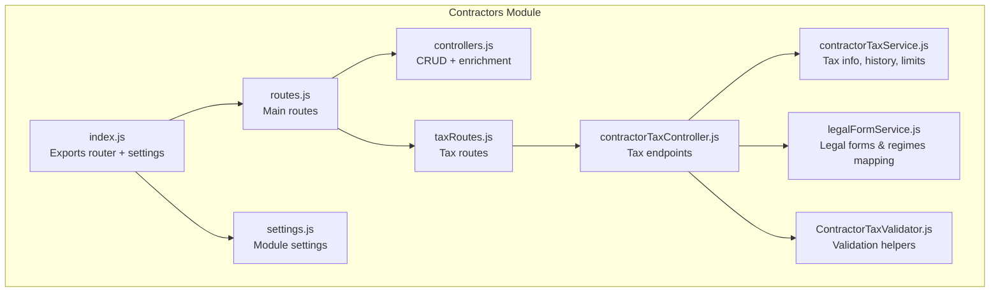
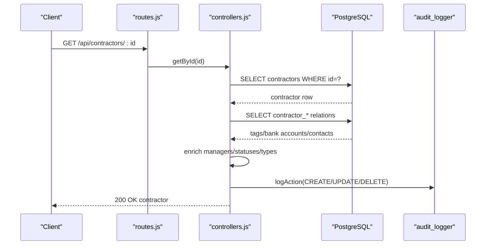
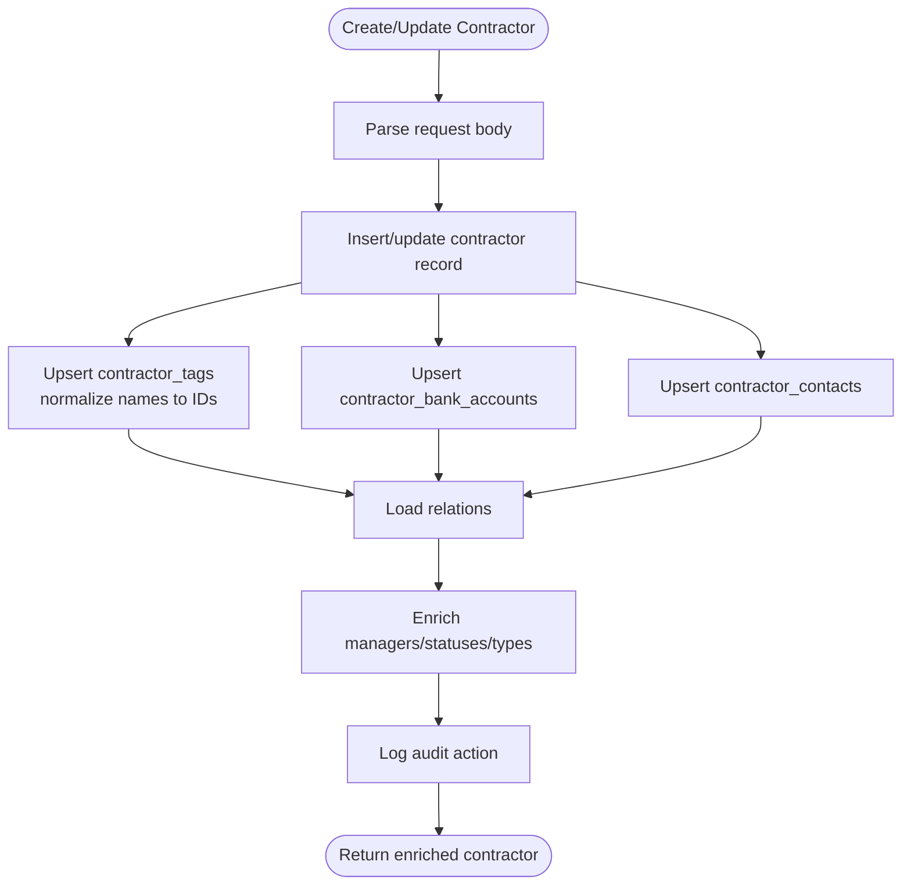
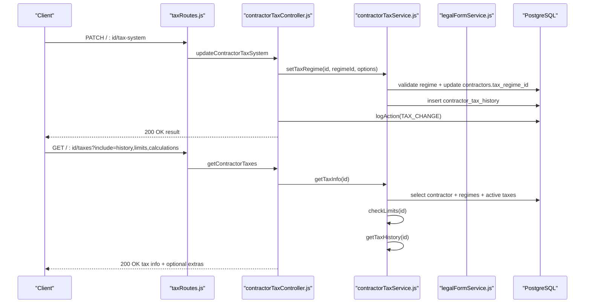
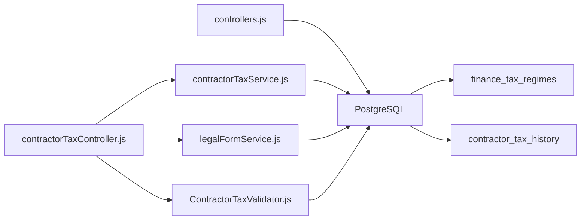

# Contractors Module

<cite>
**Referenced Files in This Document**
- [index.js](file://backend/modules/contractors/index.js)
- [routes.js](file://backend/modules/contractors/routes.js)
- [controllers.js](file://backend/modules/contractors/controllers.js)
- [taxRoutes.js](file://backend/modules/contractors/taxRoutes.js)
- [contractorTaxController.js](file://backend/modules/contractors/controllers/contractorTaxController.js)
- [contractorTaxService.js](file://backend/modules/contractors/services/contractorTaxService.js)
- [legalFormService.js](file://backend/modules/contractors/services/legalFormService.js)
- [ContractorTaxValidator.js](file://backend/modules/contractors/validators/ContractorTaxValidator.js)
- [settings.js](file://backend/modules/contractors/settings.js)
- [104_add_tax_regime_to_contractors.sql](file://backend/migrations/104_add_tax_regime_to_contractors.sql)
- [111_contractor_tax_history.sql](file://backend/migrations/111_contractor_tax_history.sql)
- [119_extend_contractors_for_individuals_and_foreign.sql](file://backend/migrations/119_extend_contractors_for_individuals_and_foreign.sql)
- [CONTRACTORS_BADGES.md](file://docs/modules/CONTRACTORS_BADGES.md)
</cite>

## Table of Contents
1. [Introduction](#introduction)
2. [Project Structure](#project-structure)
3. [Core Components](#core-components)
4. [Architecture Overview](#architecture-overview)
5. [Detailed Component Analysis](#detailed-component-analysis)
6. [Dependency Analysis](#dependency-analysis)
7. [Performance Considerations](#performance-considerations)
8. [Troubleshooting Guide](#troubleshooting-guide)
9. [Conclusion](#conclusion)
10. [Appendices](#appendices)

## Introduction
The Contractors module manages client and vendor records, relationship tracking, and business categorization. It integrates with the Finance module to support tax compliance, including tax regime selection, historical tracking, and automated tax regime validation. It also supports badge and classification systems for visual organization and provides enrichment capabilities for automatic data population.

## Project Structure
The module follows a layered backend structure with routes delegating to controllers, which orchestrate service-layer logic and database interactions. Tax-specific endpoints are mounted under a dedicated taxRoutes subrouter.

**Diagram sources**
- [routes.js:1-25](file://backend/modules/contractors/routes.js#L1-L25)
- [taxRoutes.js:1-22](file://backend/modules/contractors/taxRoutes.js#L1-L22)
- [controllers.js:1-563](file://backend/modules/contractors/controllers.js#L1-L563)
- [contractorTaxController.js:1-254](file://backend/modules/contractors/controllers/contractorTaxController.js#L1-L254)
- [contractorTaxService.js:1-311](file://backend/modules/contractors/services/contractorTaxService.js#L1-L311)
- [legalFormService.js:1-157](file://backend/modules/contractors/services/legalFormService.js#L1-L157)
- [ContractorTaxValidator.js:1-172](file://backend/modules/contractors/validators/ContractorTaxValidator.js#L1-L172)
- [index.js:1-14](file://backend/modules/contractors/index.js#L1-L13)
- [settings.js:1-28](file://backend/modules/contractors/settings.js#L1-L27)

**Section sources**
- [index.js:1-14](file://backend/modules/contractors/index.js#L1-L13)
- [routes.js:1-25](file://backend/modules/contractors/routes.js#L1-L25)
- [settings.js:1-28](file://backend/modules/contractors/settings.js#L1-L27)

## Core Components
- Controllers: Provide CRUD endpoints for contractors, enrichment of managers/statuses/types, and bulk updates. They also handle audit logging for create/update/delete and contractor tax actions.
- Tax Controllers: Expose endpoints to fetch tax info, calculate tax burden, update tax system, check limits, and retrieve legal forms and tax regime mappings.
- Services:
  - contractorTaxService: Transforms contractor tax info, sets tax regimes, retrieves history, checks limits, and generates optimization suggestions.
  - legalFormService: Loads legal forms and builds mappings of legal forms to applicable tax regimes.
- Validator: Validates tax regime changes against legal form applicability and regime limits.
- Settings: Defines display, feature flags, enrichment provider, and defaults for the module.

**Section sources**
- [controllers.js:1-563](file://backend/modules/contractors/controllers.js#L1-L563)
- [contractorTaxController.js:1-254](file://backend/modules/contractors/controllers/contractorTaxController.js#L1-L254)
- [contractorTaxService.js:1-311](file://backend/modules/contractors/services/contractorTaxService.js#L1-L311)
- [legalFormService.js:1-157](file://backend/modules/contractors/services/legalFormService.js#L1-L157)
- [ContractorTaxValidator.js:1-172](file://backend/modules/contractors/validators/ContractorTaxValidator.js#L1-L172)
- [settings.js:1-28](file://backend/modules/contractors/settings.js#L1-L27)

## Architecture Overview
The module exposes REST endpoints grouped by functionality:
- General contractor CRUD and enrichment
- Tax information, calculations, and regime management
- Legal forms and tax regime mappings

**Diagram sources**
- [routes.js:11-19](file://backend/modules/contractors/routes.js#L11-L19)
- [controllers.js:177-193](file://backend/modules/contractors/controllers.js#L177-L193)
- [index.js:9-12](file://backend/modules/contractors/index.js#L9-L12)

**Section sources**
- [routes.js:1-25](file://backend/modules/contractors/routes.js#L1-L25)
- [controllers.js:138-193](file://backend/modules/contractors/controllers.js#L138-L193)

## Detailed Component Analysis

### Contractor Management and Enrichment
- Data model extensions include personal/passport fields and SWIFT codes for bank accounts, enabling support for individuals and foreign entities.
- Enrichment pipeline:
  - Managers: Resolved via a user role filter and cached mapping.
  - Statuses: Resolved via contractor_status lookup with fallback capitalization.
  - Types: Resolved via relationship_type lookup.
- Tags: Stored as names in contractor_tags; defined_tags provide color and module scoping. On create/update, tags are normalized and inserted with conflict handling.

**Diagram sources**
- [controllers.js:199-307](file://backend/modules/contractors/controllers.js#L199-L307)
- [controllers.js:313-430](file://backend/modules/contractors/controllers.js#L313-L430)
- [controllers.js:17-27](file://backend/modules/contractors/controllers.js#L17-L27)

**Section sources**
- [controllers.js:17-27](file://backend/modules/contractors/controllers.js#L17-L27)
- [controllers.js:199-307](file://backend/modules/contractors/controllers.js#L199-L307)
- [controllers.js:313-430](file://backend/modules/contractors/controllers.js#L313-L430)
- [119_extend_contractors_for_individuals_and_foreign.sql:6-25](file://backend/migrations/119_extend_contractors_for_individuals_and_foreign.sql#L6-L25)

### Tax Compliance System
- Tax regime linkage: contractors.tax_regime_id references finance_tax_regimes.
- History tracking: contractor_tax_history captures regime changes with metadata and timestamps.
- Validation: ContractorTaxValidator ensures legal form applicability and regime limits.
- Tax info retrieval: contractorTaxService aggregates active taxes, limits, and history for a contractor.
- Optimization suggestions: Provides actionable recommendations based on contractor attributes.

**Diagram sources**
- [taxRoutes.js:10-16](file://backend/modules/contractors/taxRoutes.js#L10-L16)
- [contractorTaxController.js:66-110](file://backend/modules/contractors/controllers/contractorTaxController.js#L66-L110)
- [contractorTaxController.js:16-60](file://backend/modules/contractors/controllers/contractorTaxController.js#L16-L60)
- [contractorTaxService.js:77-134](file://backend/modules/contractors/services/contractorTaxService.js#L77-L134)
- [contractorTaxService.js:141-143](file://backend/modules/contractors/services/contractorTaxService.js#L141-L143)
- [contractorTaxService.js:187-236](file://backend/modules/contractors/services/contractorTaxService.js#L187-L236)

**Section sources**
- [contractorTaxController.js:16-110](file://backend/modules/contractors/controllers/contractorTaxController.js#L16-L110)
- [contractorTaxController.js:116-157](file://backend/modules/contractors/controllers/contractorTaxController.js#L116-L157)
- [contractorTaxService.js:77-134](file://backend/modules/contractors/services/contractorTaxService.js#L77-L134)
- [contractorTaxService.js:187-236](file://backend/modules/contractors/services/contractorTaxService.js#L187-L236)
- [ContractorTaxValidator.js:16-55](file://backend/modules/contractors/validators/ContractorTaxValidator.js#L16-L55)
- [104_add_tax_regime_to_contractors.sql:4-8](file://backend/migrations/104_add_tax_regime_to_contractors.sql#L4-L8)
- [111_contractor_tax_history.sql:10-23](file://backend/migrations/111_contractor_tax_history.sql#L10-L23)

### Legal Forms and Tax Regimes
- legalFormService loads legal forms and computes available tax regimes per form based on applies_to_legal_forms arrays in finance_tax_regimes.
- It returns structured mappings suitable for UI selection and validation.

**Section sources**
- [legalFormService.js:69-109](file://backend/modules/contractors/services/legalFormService.js#L69-L109)

### Badges and Classification
- Tags: Rendered as soft pill-shaped badges; stored as names in contractor_tags with color resolution from defined_tags.
- Relationship Type: Solid badge with module-defined color from relationship_type.
- Status: Soft badge with colored dot from statuses.
- Overflow handling: A "+N" tag appears when more than three tags are present.

**Section sources**
- [CONTRACTORS_BADGES.md:1-108](file://docs/modules/CONTRACTORS_BADGES.md#L1-L107)

### Practical Examples

#### Contractor Onboarding Workflow
- Create a contractor with basic details and optional tags, bank accounts, and contacts.
- The system enriches managers/statuses/types and persists relations atomically.
- Audit logs capture the creation event.

**Section sources**
- [controllers.js:199-307](file://backend/modules/contractors/controllers.js#L199-L307)

#### Tax Calculation Workflow
- Calculate tax burden for a contractor over a specified period (year+quarter or year+month).
- Endpoint returns computed results based on active taxes derived from the contractor’s tax regime.

**Section sources**
- [contractorTaxController.js:116-157](file://backend/modules/contractors/controllers/contractorTaxController.js#L116-L157)
- [contractorTaxService.js:141-143](file://backend/modules/contractors/services/contractorTaxService.js#L141-L143)

#### Data Enrichment Process
- Managers/statuses/types are resolved via lightweight lookups and cached mappings.
- Tags are normalized to defined_tags entries, supporting dynamic tag creation and conflict-free insertion.

**Section sources**
- [controllers.js:33-43](file://backend/modules/contractors/controllers.js#L33-L43)
- [controllers.js:77-85](file://backend/modules/contractors/controllers.js#L77-L85)
- [controllers.js:107-118](file://backend/modules/contractors/controllers.js#L107-L118)
- [controllers.js:240-266](file://backend/modules/contractors/controllers.js#L240-L266)

### Integration Notes
- Legal Cases: Contractors serve as parties; the module’s contractor records can be referenced by case-related entities.
- Finance: Tax regime selection and active taxes derive from finance_tax_regimes; contractor_tax_history supports audit trails for tax changes.
- Projects: Contractors can be linked to project expenses and revenues; tax regime affects tax obligations tied to project finances.

[No sources needed since this section provides general integration guidance]

## Dependency Analysis
- Controllers depend on:
  - Database access for contractor and relation tables.
  - Enrichment helpers for managers/statuses/types.
  - Audit logging for lifecycle events.
- Tax controllers depend on:
  - contractorTaxService for transformations and validations.
  - legalFormService for legal form and regime mappings.
  - ContractorTaxValidator for regime change checks.
- Database schema:
  - contractors links to finance_tax_regimes via tax_regime_id.
  - contractor_tax_history tracks regime changes with foreign keys and indexes.

**Diagram sources**
- [controllers.js:1-563](file://backend/modules/contractors/controllers.js#L1-L563)
- [contractorTaxController.js:1-254](file://backend/modules/contractors/controllers/contractorTaxController.js#L1-L254)
- [contractorTaxService.js:1-311](file://backend/modules/contractors/services/contractorTaxService.js#L1-L311)
- [legalFormService.js:1-157](file://backend/modules/contractors/services/legalFormService.js#L1-L157)
- [ContractorTaxValidator.js:1-172](file://backend/modules/contractors/validators/ContractorTaxValidator.js#L1-L172)
- [104_add_tax_regime_to_contractors.sql:4-8](file://backend/migrations/104_add_tax_regime_to_contractors.sql#L4-L8)
- [111_contractor_tax_history.sql:10-23](file://backend/migrations/111_contractor_tax_history.sql#L10-L23)

**Section sources**
- [controllers.js:1-563](file://backend/modules/contractors/controllers.js#L1-L563)
- [contractorTaxService.js:1-311](file://backend/modules/contractors/services/contractorTaxService.js#L1-L311)
- [legalFormService.js:1-157](file://backend/modules/contractors/services/legalFormService.js#L1-L157)
- [ContractorTaxValidator.js:1-172](file://backend/modules/contractors/validators/ContractorTaxValidator.js#L1-L172)
- [104_add_tax_regime_to_contractors.sql:4-8](file://backend/migrations/104_add_tax_regime_to_contractors.sql#L4-L8)
- [111_contractor_tax_history.sql:10-23](file://backend/migrations/111_contractor_tax_history.sql#L10-L23)

## Performance Considerations
- Indexing: contractors.tax_regime_id and contractor_tax_history indices improve lookup performance for regime queries and history scans.
- Bulk operations: bulkUpdate uses a transaction and prepared clauses to minimize round-trips.
- Enrichment caching: Manager/status/type mappings are loaded once and reused across lists.

**Section sources**
- [104_add_tax_regime_to_contractors.sql:7-8](file://backend/migrations/104_add_tax_regime_to_contractors.sql#L7-L8)
- [111_contractor_tax_history.sql:41-55](file://backend/migrations/111_contractor_tax_history.sql#L41-L55)
- [controllers.js:464-538](file://backend/modules/contractors/controllers.js#L464-L538)

## Troubleshooting Guide
- Not found errors: Ensure contractor IDs exist before fetching tax info or updating tax systems.
- Validation failures: When changing tax regimes, verify legal form applicability and regime limits; warnings indicate potential non-compliance.
- Audit logs: Use contractor/:id/activity to review lifecycle and tax change actions.

**Section sources**
- [contractorTaxController.js:52-59](file://backend/modules/contractors/controllers/contractorTaxController.js#L52-L59)
- [contractorTaxController.js:106-109](file://backend/modules/contractors/controllers/contractorTaxController.js#L106-L109)
- [controllers.js:540-560](file://backend/modules/contractors/controllers.js#L540-L560)

## Conclusion
The Contractors module provides robust contractor lifecycle management with integrated tax compliance, enrichment, and classification. Its modular design cleanly separates concerns across routes, controllers, services, and validators, while database migrations formalize tax regime linkage and history tracking.

## Appendices

### Module Settings Reference
- Display: itemsPerPage, defaultSort, showInactive
- Features: enableRating, enableTags, enableCategories, enableQuickActions, enableEnrichment, enableStatistics
- Enrichment: provider, autoEnrichOnCreate
- Defaults: status, type

**Section sources**
- [settings.js:6-26](file://backend/modules/contractors/settings.js#L6-L26)