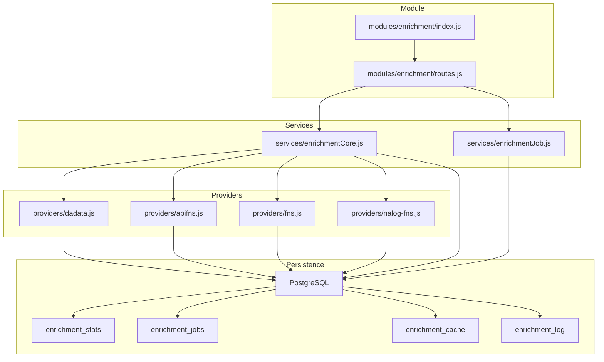
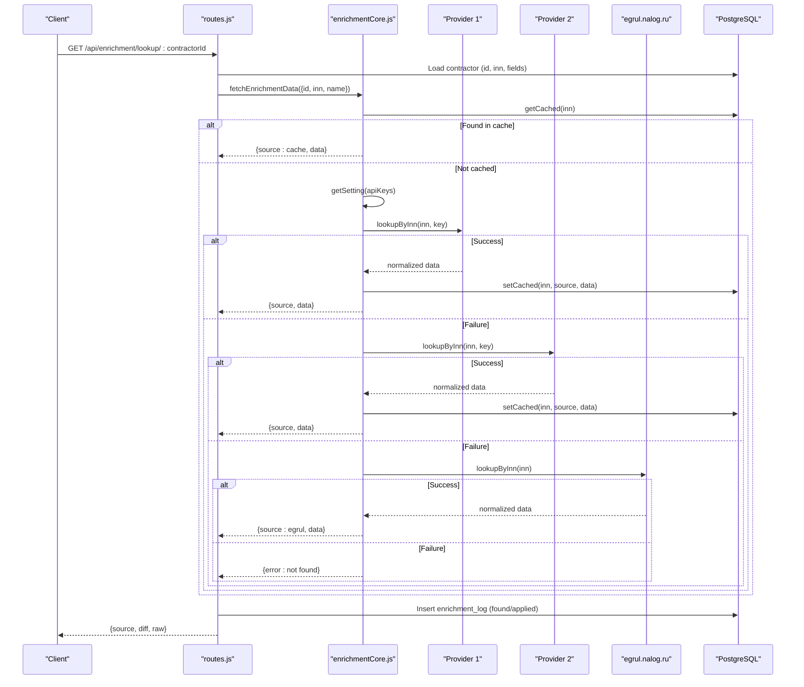
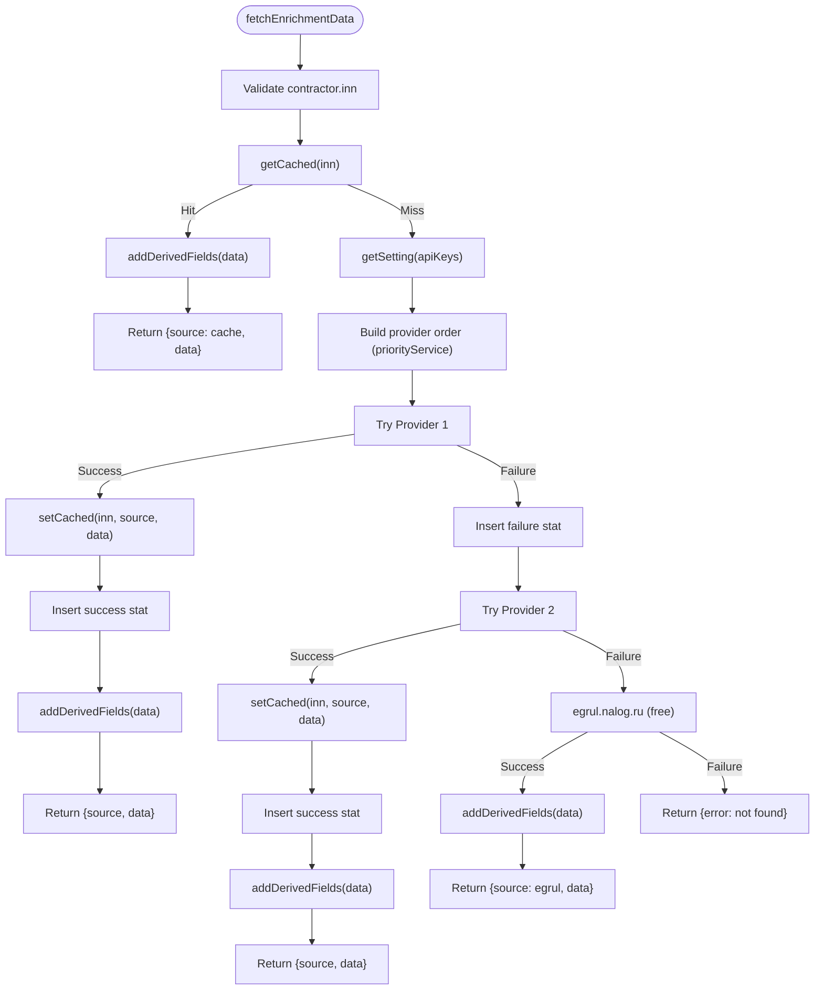
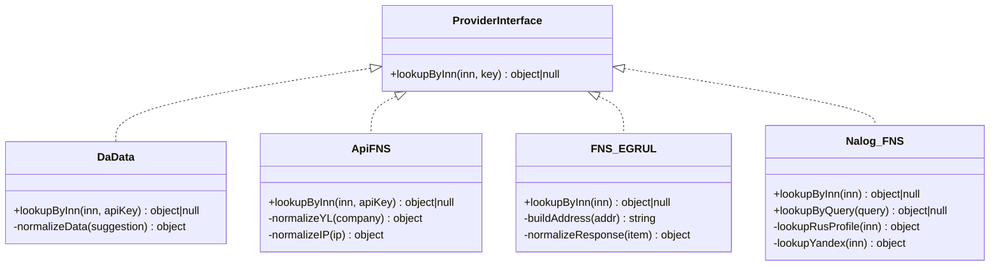
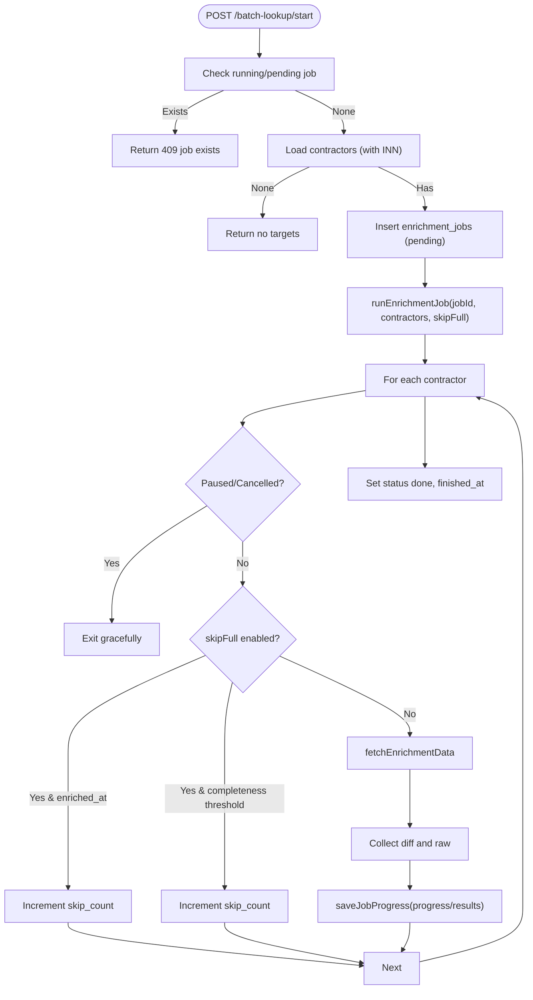
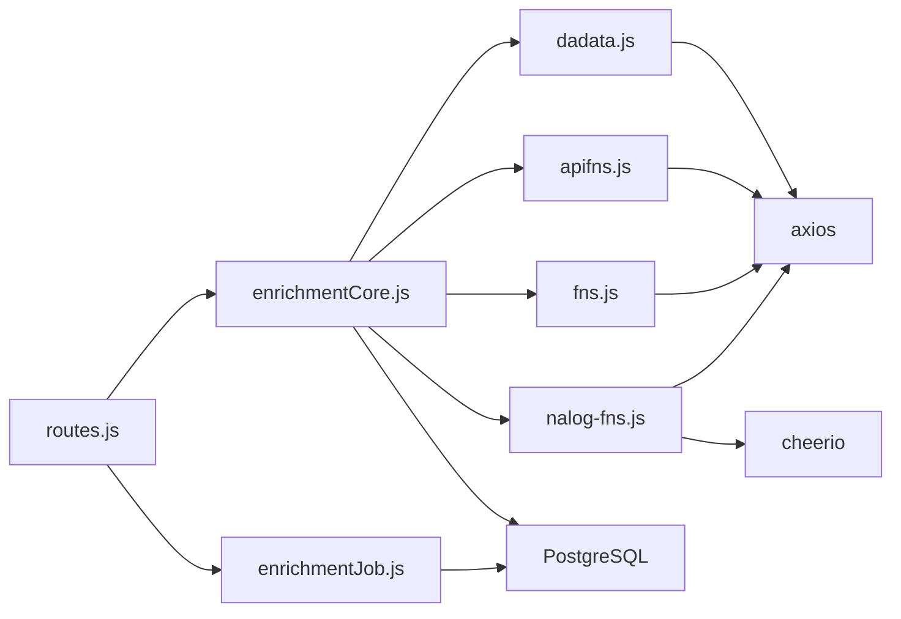

# Data Enrichment System

<cite>
**Referenced Files in This Document**
- [index.js](file://backend/modules/enrichment/index.js)
- [routes.js](file://backend/modules/enrichment/routes.js)
- [enrichmentCore.js](file://backend/modules/enrichment/services/enrichmentCore.js)
- [enrichmentJob.js](file://backend/modules/enrichment/services/enrichmentJob.js)
- [dadata.js](file://backend/modules/enrichment/services/providers/dadata.js)
- [apifns.js](file://backend/modules/enrichment/services/providers/apifns.js)
- [fns.js](file://backend/modules/enrichment/services/providers/fns.js)
- [nalog-fns.js](file://backend/modules/enrichment/services/providers/nalog-fns.js)
- [64_create_enrichment_stats_table.sql](file://backend/migrations/64_create_enrichment_stats_table.sql)
- [54_create_enrichment_jobs_table.md](file://backend/migrations/54_create_enrichment_jobs_table.md)
- [db-structure.json](file://backend/config/db-structure.json)
</cite>

## Table of Contents
1. [Introduction](#introduction)
2. [Project Structure](#project-structure)
3. [Core Components](#core-components)
4. [Architecture Overview](#architecture-overview)
5. [Detailed Component Analysis](#detailed-component-analysis)
6. [Dependency Analysis](#dependency-analysis)
7. [Performance Considerations](#performance-considerations)
8. [Troubleshooting Guide](#troubleshooting-guide)
9. [Conclusion](#conclusion)
10. [Appendices](#appendices)

## Introduction
This document describes the contractor data enrichment system that automatically populates contractor records using external data providers. It covers integration with FNS (Federal Tax Service), DaData, and Nalog-FNS (web scraping) providers, job scheduling for batch enrichment, validation and conflict resolution, the enrichment drawer interface, lookup workflows, manual enrichment options, practical examples, quality assurance measures, statistics tracking, provider reliability metrics, and fallback strategies for failed lookups.

## Project Structure
The enrichment module is organized around:
- Module entry and settings
- HTTP routes for enrichment operations
- Core orchestration and field mapping
- Provider implementations
- Batch job scheduler and persistence
- Database schema for jobs and statistics

**Diagram sources**
- [index.js:1-32](file://backend/modules/enrichment/index.js#L1-L31)
- [routes.js:1-387](file://backend/modules/enrichment/routes.js#L1-L386)
- [enrichmentCore.js:1-441](file://backend/modules/enrichment/services/enrichmentCore.js#L1-L428)
- [enrichmentJob.js:1-154](file://backend/modules/enrichment/services/enrichmentJob.js#L1-L153)
- [dadata.js:1-79](file://backend/modules/enrichment/services/providers/dadata.js#L1-L78)
- [apifns.js:1-205](file://backend/modules/enrichment/services/providers/apifns.js#L1-L204)
- [fns.js:1-149](file://backend/modules/enrichment/services/providers/fns.js#L1-L148)
- [nalog-fns.js:1-257](file://backend/modules/enrichment/services/providers/nalog-fns.js#L1-L256)

**Section sources**
- [index.js:1-32](file://backend/modules/enrichment/index.js#L1-L31)
- [routes.js:1-387](file://backend/modules/enrichment/routes.js#L1-L386)

## Core Components
- Module settings and API prefix
- Routes for single and batch enrichment operations
- Core enrichment orchestrator with provider selection and derived fields
- Provider implementations for DaData, api-fns.ru, FNS EGRUL, and Nalog-FNS web scraping
- Batch job scheduler with pause/resume/cancel/reset controls
- Statistics and logging tables for monitoring and QA

**Section sources**
- [index.js:8-31](file://backend/modules/enrichment/index.js#L8-L31)
- [routes.js:15-387](file://backend/modules/enrichment/routes.js#L15-L386)
- [enrichmentCore.js:156-441](file://backend/modules/enrichment/services/enrichmentCore.js#L156-L428)
- [enrichmentJob.js:18-154](file://backend/modules/enrichment/services/enrichmentJob.js#L18-L153)

## Architecture Overview
The system integrates three primary providers with a fallback to a free official source. It caches results to avoid repeated external requests, computes derived business fields, and persists logs and statistics for quality assurance.

**Diagram sources**
- [routes.js:66-128](file://backend/modules/enrichment/routes.js#L66-L128)
- [enrichmentCore.js:183-309](file://backend/modules/enrichment/services/enrichmentCore.js#L183-L309)
- [dadata.js:55-76](file://backend/modules/enrichment/services/providers/dadata.js#L55-L76)
- [apifns.js:168-202](file://backend/modules/enrichment/services/providers/apifns.js#L168-L202)
- [fns.js:88-146](file://backend/modules/enrichment/services/providers/fns.js#L88-L146)
- [nalog-fns.js:178-193](file://backend/modules/enrichment/services/providers/nalog-fns.js#L178-L193)

## Detailed Component Analysis

### Enrichment Core Orchestration
Responsibilities:
- Provider order selection via module settings
- Caching and TTL-based reuse
- Derived business fields computation (status, legal entity type, legal form, tax regime)
- Field mapping and safe application to contractor records
- Logging and statistics insertion

Key behaviors:
- Priority service configured in module settings; supports switching between providers
- Cache avoids redundant external calls
- Derived fields include status, legalEntityType/legalForm, and taxRegimeId resolved against active tax regimes
- applyEnrichment respects existing business fields (e.g., manager) and writes detailed logs

**Diagram sources**
- [enrichmentCore.js:216-309](file://backend/modules/enrichment/services/enrichmentCore.js#L216-L309)
- [enrichmentCore.js:71-154](file://backend/modules/enrichment/services/enrichmentCore.js#L71-L154)
- [enrichmentCore.js:183-209](file://backend/modules/enrichment/services/enrichmentCore.js#L183-L209)

**Section sources**
- [enrichmentCore.js:15-309](file://backend/modules/enrichment/services/enrichmentCore.js#L15-L309)
- [enrichmentCore.js:314-441](file://backend/modules/enrichment/services/enrichmentCore.js#L314-L428)

### Provider Implementations
- DaData: Party search by INN with normalization to unified fields
- api-fns.ru: Official EGRUL-like data with phone/email/website extraction and OKVED parsing
- FNS EGRUL: Free official Russian registry lookup with token-based polling
- Nalog-FNS: Web scraping via RusProfile and Yandex fallbacks (no API key)

**Diagram sources**
- [dadata.js:55-76](file://backend/modules/enrichment/services/providers/dadata.js#L55-L76)
- [apifns.js:168-202](file://backend/modules/enrichment/services/providers/apifns.js#L168-L202)
- [fns.js:88-146](file://backend/modules/enrichment/services/providers/fns.js#L88-L146)
- [nalog-fns.js:178-254](file://backend/modules/enrichment/services/providers/nalog-fns.js#L178-L254)

**Section sources**
- [dadata.js:1-79](file://backend/modules/enrichment/services/providers/dadata.js#L1-L78)
- [apifns.js:1-205](file://backend/modules/enrichment/services/providers/apifns.js#L1-L204)
- [fns.js:1-149](file://backend/modules/enrichment/services/providers/fns.js#L1-L148)
- [nalog-fns.js:1-257](file://backend/modules/enrichment/services/providers/nalog-fns.js#L1-L256)

### Batch Enrichment Scheduler
Responsibilities:
- Start, pause, resume, finish, and reset batch jobs
- Skip already-enriched or sufficiently complete contractors
- Periodic progress persistence and result aggregation
- Controlled throttling to avoid rate limits

**Diagram sources**
- [routes.js:156-274](file://backend/modules/enrichment/routes.js#L156-L274)
- [enrichmentJob.js:46-151](file://backend/modules/enrichment/services/enrichmentJob.js#L46-L151)

**Section sources**
- [routes.js:156-323](file://backend/modules/enrichment/routes.js#L156-L323)
- [enrichmentJob.js:18-154](file://backend/modules/enrichment/services/enrichmentJob.js#L18-L153)

### Data Validation and Conflict Resolution
- Validation:
  - INN presence and format checks before enrichment
  - Exact INN match verification for api-fns.ru and RusProfile responses
- Conflict resolution:
  - Business fields are not overwritten if already present (e.g., manager)
  - Derived fields computed from normalized data and tax regime rules
  - Logs capture before/after state for auditability

**Section sources**
- [routes.js:42-64](file://backend/modules/enrichment/routes.js#L42-L64)
- [apifns.js:184-198](file://backend/modules/enrichment/services/providers/apifns.js#L184-L198)
- [nalog-fns.js:141-147](file://backend/modules/enrichment/services/providers/nalog-fns.js#L141-L147)
- [enrichmentCore.js:379-438](file://backend/modules/enrichment/services/enrichmentCore.js#L379-L428)

### Enrichment Drawer and Manual Enrichment
- Drawer interface allows selecting fields to apply and reviewing diffs
- Manual apply endpoint accepts selected fields and persists changes
- Logs record who applied changes and when

**Section sources**
- [routes.js:130-154](file://backend/modules/enrichment/routes.js#L130-L154)
- [routes.js:372-383](file://backend/modules/enrichment/routes.js#L372-L383)
- [enrichmentCore.js:379-438](file://backend/modules/enrichment/services/enrichmentCore.js#L379-L428)

### Practical Examples
- Single contractor lookup by ID:
  - Request: GET /api/enrichment/lookup/:contractorId
  - Response: source, diff (field-by-field comparison), raw data
- Manual enrichment:
  - Request: POST /api/enrichment/apply/:contractorId with fields and data
  - Response: success and counts of updated fields
- Batch enrichment:
  - Start: POST /api/enrichment/batch-lookup/start with optional contractor IDs
  - Monitor: GET /api/enrichment/batch-lookup/status/:jobId
  - Apply: POST /api/enrichment/batch-apply with items
  - Pause/Continue/Finish/Reset as needed

**Section sources**
- [routes.js:66-128](file://backend/modules/enrichment/routes.js#L66-L128)
- [routes.js:130-154](file://backend/modules/enrichment/routes.js#L130-L154)
- [routes.js:156-274](file://backend/modules/enrichment/routes.js#L156-L274)
- [routes.js:325-370](file://backend/modules/enrichment/routes.js#L325-L370)

### Quality Assurance Measures
- Enrichment log captures applied changes with before/after snapshots
- Statistics table tracks provider success/failure rates and error messages
- Daily summary view enables trend analysis
- Cache reduces load and ensures repeatable results

**Section sources**
- [enrichmentCore.js:430-435](file://backend/modules/enrichment/services/enrichmentCore.js#L428)
- [64_create_enrichment_stats_table.sql:1-35](file://backend/migrations/64_create_enrichment_stats_table.sql#L1-L34)

## Dependency Analysis
External dependencies:
- HTTP clients for provider APIs
- Cheerio for HTML parsing in Nalog-FNS
- PostgreSQL for persistence of jobs, stats, cache, and logs

Internal dependencies:
- Routes depend on core enrichment and job services
- Core depends on providers and module settings loader
- Providers encapsulate normalization and error handling

**Diagram sources**
- [routes.js:1-14](file://backend/modules/enrichment/routes.js#L1-L14)
- [enrichmentCore.js:9-14](file://backend/modules/enrichment/services/enrichmentCore.js#L9-L14)
- [dadata.js](file://backend/modules/enrichment/services/providers/dadata.js#L8)
- [apifns.js](file://backend/modules/enrichment/services/providers/apifns.js#L8)
- [fns.js](file://backend/modules/enrichment/services/providers/fns.js#L10)
- [nalog-fns.js:6-7](file://backend/modules/enrichment/services/providers/nalog-fns.js#L6-L7)

**Section sources**
- [routes.js:1-14](file://backend/modules/enrichment/routes.js#L1-L14)
- [enrichmentCore.js:9-14](file://backend/modules/enrichment/services/enrichmentCore.js#L9-L14)

## Performance Considerations
- Provider ordering prioritizes paid services with API keys when available
- Caching prevents repeated external calls and reduces latency
- Batch jobs throttle requests with small delays to avoid rate limits
- Indexes on enrichment_jobs and enrichment_stats improve query performance
- Derived fields reduce downstream processing overhead

[No sources needed since this section provides general guidance]

## Troubleshooting Guide
Common issues and resolutions:
- Empty search query: Route returns 400 with a clear error message
- Invalid INN format: Route returns 400 with validation error
- No API keys configured: Providers throw descriptive errors instructing to configure keys
- Provider failures: Errors recorded in enrichment_stats; fallback to next provider or free source
- Batch job conflicts: Starting a new job while another is running returns 409 with existing job info
- Paused jobs: Continue endpoint resumes from where it left off

**Section sources**
- [routes.js:20-34](file://backend/modules/enrichment/routes.js#L20-L34)
- [routes.js:42-64](file://backend/modules/enrichment/routes.js#L42-L64)
- [dadata.js:55-57](file://backend/modules/enrichment/services/providers/dadata.js#L55-L57)
- [apifns.js:168-170](file://backend/modules/enrichment/services/providers/apifns.js#L168-L170)
- [routes.js:156-209](file://backend/modules/enrichment/routes.js#L156-L209)
- [routes.js:238-274](file://backend/modules/enrichment/routes.js#L238-L274)

## Conclusion
The contractor enrichment system provides robust, configurable, and auditable data augmentation through multiple external providers with intelligent fallbacks. Its batch capabilities, caching, and comprehensive logging support scalable maintenance of contractor profiles. The statistics and logs enable continuous monitoring of provider reliability and system health.

[No sources needed since this section summarizes without analyzing specific files]

## Appendices

### Database Schema References
- Contractors table includes enrichment metadata and business fields
- Jobs table stores batch progress and results
- Statistics table tracks provider usage and outcomes
- Cache and log tables support operational insights

**Section sources**
- [db-structure.json:233-516](file://backend/config/db-structure.json#L233-L516)
- [54_create_enrichment_jobs_table.md:1-20](file://backend/migrations/54_create_enrichment_jobs_table.md#L1-L19)
- [64_create_enrichment_stats_table.sql:1-35](file://backend/migrations/64_create_enrichment_stats_table.sql#L1-L34)