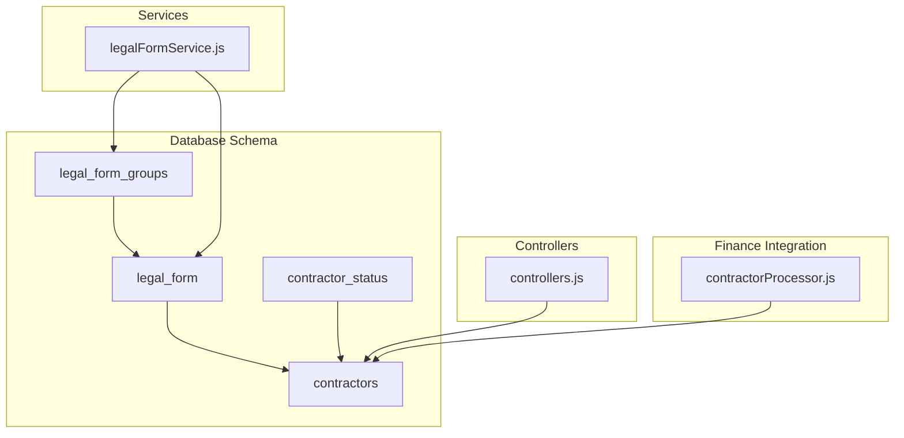
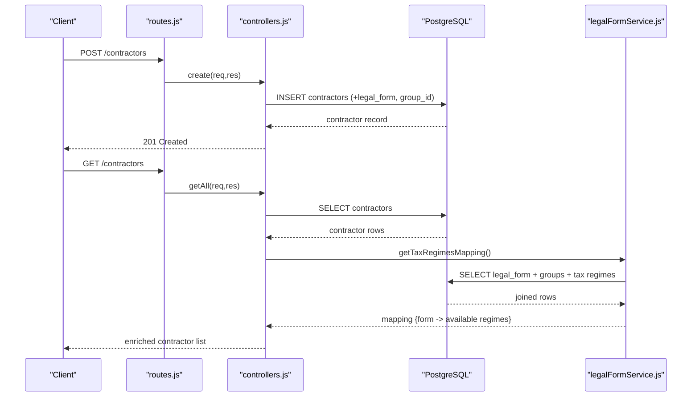
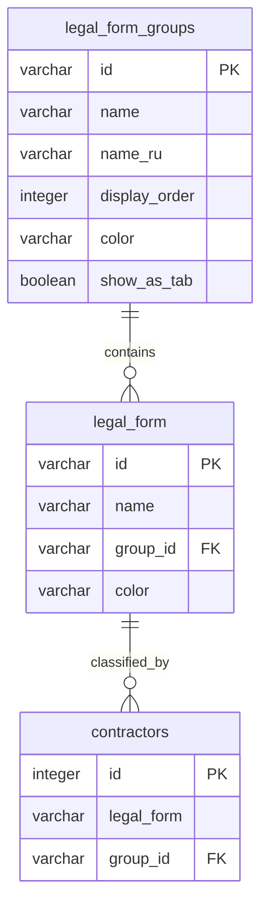
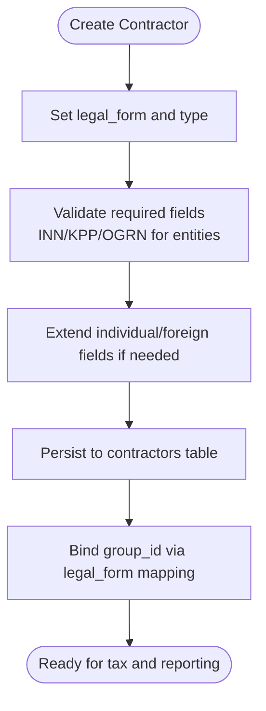
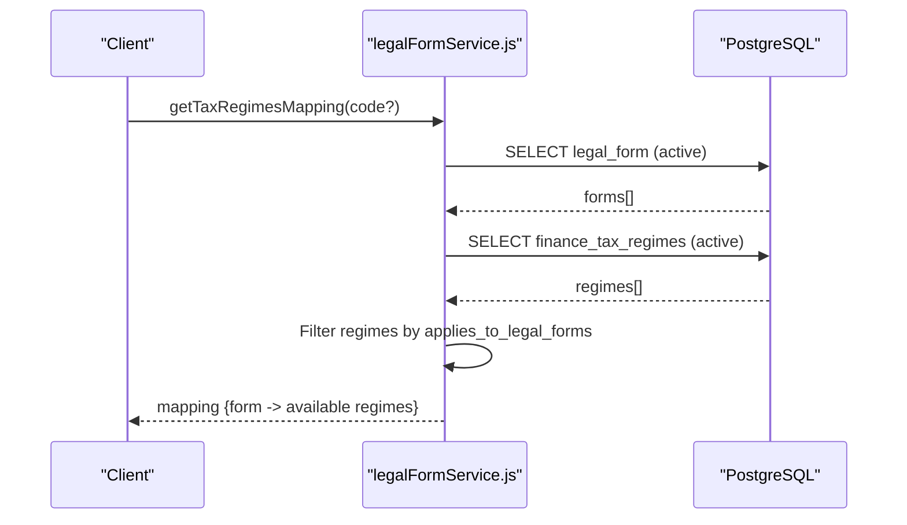
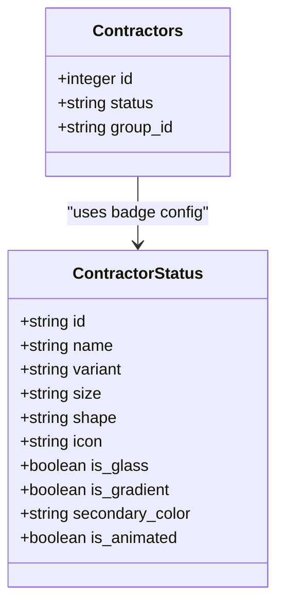
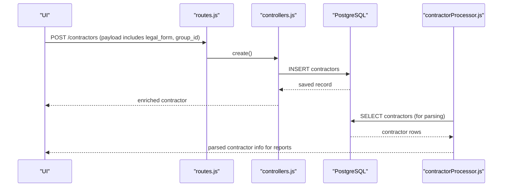
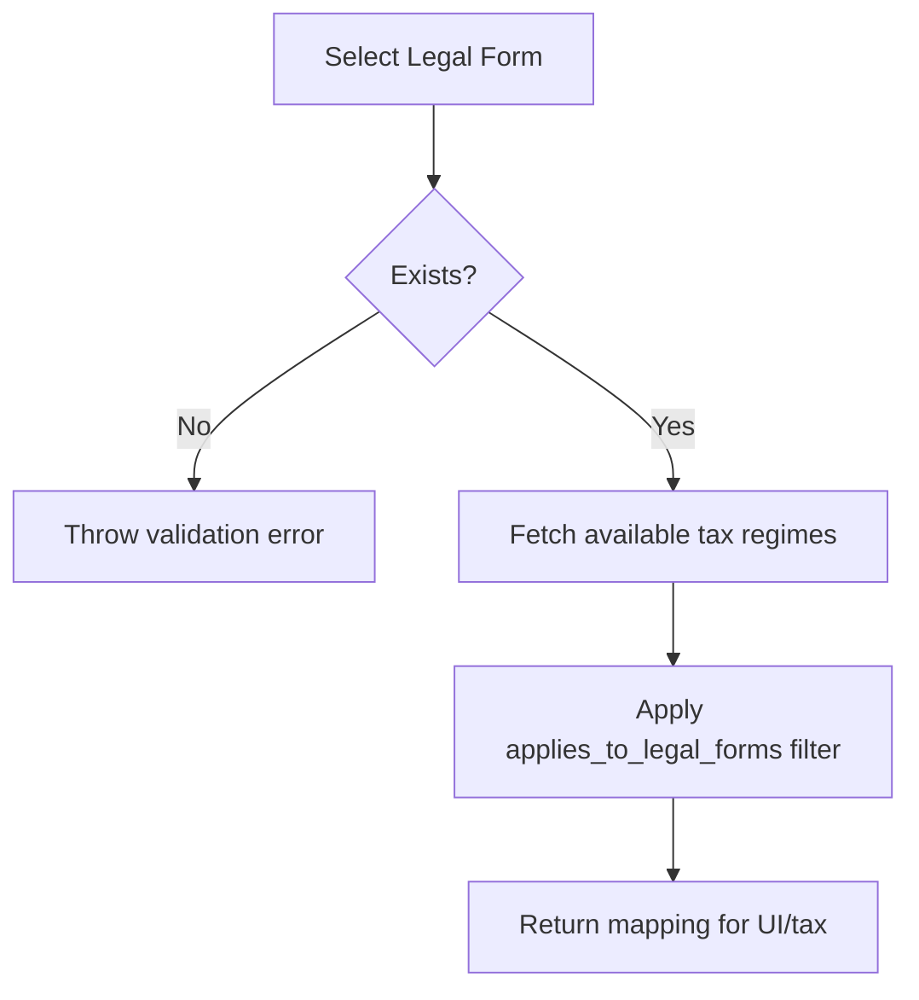

# Legal Form Classification

<cite>
**Referenced Files in This Document**
- [legalFormService.js](file://backend/modules/contractors/services/legalFormService.js)
- [67_create_legal_form_groups.sql](file://backend/migrations/67_create_legal_form_groups.sql)
- [67b_insert_legal_forms.sql](file://backend/migrations/67b_insert_legal_forms.sql)
- [115_add_color_to_legal_forms.sql](file://backend/migrations/115_add_color_to_legal_forms.sql)
- [117_add_group_id_to_contractors.sql](file://backend/migrations/117_add_group_id_to_contractors.sql)
- [119_extend_contractors_for_individuals_and_foreign.sql](file://backend/migrations/119_extend_contractors_for_individuals_and_foreign.sql)
- [120_add_badge_style_columns.md](file://backend/migrations/120_add_badge_style_columns.md)
- [121_add_advanced_badge_styling.sql](file://backend/migrations/121_add_advanced_badge_styling.sql)
- [02_create_contractors_table.md](file://backend/migrations/02_create_contractors_table.md)
- [controllers.js](file://backend/modules/contractors/controllers.js)
- [routes.js](file://backend/modules/contractors/routes.js)
- [contractorTaxController.js](file://backend/modules/contractors/controllers/contractorTaxController.js)
- [contractorTaxService.js](file://backend/modules/contractors/services/contractorTaxService.js)
- [ContractorTaxValidator.js](file://backend/modules/contractors/validators/ContractorTaxValidator.js)
- [contractorProcessor.js](file://backend/modules/finance/statementHelpers/contractorProcessor.js)
- [FINANCE_BULK_EDIT.md](file://docs/modules/finance/FINANCE_BULK_EDIT.md)
- [CONTRACTORS_BADGES.md](file://docs/modules/CONTRACTORS_BADGES.md)
</cite>

## Table of Contents
1. [Introduction](#introduction)
2. [Project Structure](#project-structure)
3. [Core Components](#core-components)
4. [Architecture Overview](#architecture-overview)
5. [Detailed Component Analysis](#detailed-component-analysis)
6. [Dependency Analysis](#dependency-analysis)
7. [Performance Considerations](#performance-considerations)
8. [Troubleshooting Guide](#troubleshooting-guide)
9. [Conclusion](#conclusion)
10. [Appendices](#appendices)

## Introduction
This document describes the legal form classification system used to categorize contractors (clients, partners, employees) by their legal structure and group them for UI filtering and reporting. It covers contractor types (LLC, Corporation, Individual, etc.), classification logic, legal form groups, registration requirements, compliance obligations, and the badge system for visual contractor categorization and status indicators. It also documents integration with contractor creation, tax compliance, and reporting features, along with validation, lookup mechanisms, and regulatory update pathways.

## Project Structure
The legal form classification spans database schema, service layer, API routes, and UI integration points:
- Database schema defines legal forms, groups, contractor records, and badge styling columns.
- Services provide lookup, mapping, and taxonomy operations.
- Controllers handle contractor lifecycle and enrich data for UI consumption.
- Finance integration parses contractor data from statements and aligns with legal forms.
- Documentation outlines badge styling and bulk editing capabilities.

**Diagram sources**
- [67_create_legal_form_groups.sql:1-62](file://backend/migrations/67_create_legal_form_groups.sql#L1-L61)
- [67b_insert_legal_forms.sql:1-31](file://backend/migrations/67b_insert_legal_forms.sql#L1-L30)
- [117_add_group_id_to_contractors.sql:1-22](file://backend/migrations/117_add_group_id_to_contractors.sql#L1-L21)
- [120_add_badge_style_columns.md:1-96](file://backend/migrations/120_add_badge_style_columns.md#L1-L96)
- [legalFormService.js:1-157](file://backend/modules/contractors/services/legalFormService.js#L1-L157)
- [controllers.js:1-563](file://backend/modules/contractors/controllers.js#L1-L563)
- [contractorProcessor.js](file://backend/modules/finance/statementHelpers/contractorProcessor.js)

**Section sources**
- [67_create_legal_form_groups.sql:1-62](file://backend/migrations/67_create_legal_form_groups.sql#L1-L61)
- [67b_insert_legal_forms.sql:1-31](file://backend/migrations/67b_insert_legal_forms.sql#L1-L30)
- [117_add_group_id_to_contractors.sql:1-22](file://backend/migrations/117_add_group_id_to_contractors.sql#L1-L21)
- [120_add_badge_style_columns.md:1-96](file://backend/migrations/120_add_badge_style_columns.md#L1-L96)
- [legalFormService.js:1-157](file://backend/modules/contractors/services/legalFormService.js#L1-L157)
- [controllers.js:1-563](file://backend/modules/contractors/controllers.js#L1-L563)
- [contractorProcessor.js](file://backend/modules/finance/statementHelpers/contractorProcessor.js)

## Core Components
- Legal form groups: Logical tabs for filtering contractors (e.g., Legal Entities, Individual Entrepreneurs, Private Individuals, Foreign Organizations).
- Legal forms: Codes and names representing legal structures (e.g., LLC, Corporation, Individual Entrepreneur, Self-employed, Foreign Organization).
- Contractor records: Contain legal_form and optional group_id to bind to a group tab.
- Badge styling: Variant, size, shape, and advanced styles (icon, gradient, animation) for contractor status and related UI badges.
- Tax regime mapping: Association of legal forms to applicable tax regimes via a mapping service.

**Section sources**
- [67_create_legal_form_groups.sql:1-62](file://backend/migrations/67_create_legal_form_groups.sql#L1-L61)
- [67b_insert_legal_forms.sql:1-31](file://backend/migrations/67b_insert_legal_forms.sql#L1-L30)
- [117_add_group_id_to_contractors.sql:1-22](file://backend/migrations/117_add_group_id_to_contractors.sql#L1-L21)
- [120_add_badge_style_columns.md:1-96](file://backend/migrations/120_add_badge_style_columns.md#L1-L96)
- [121_add_advanced_badge_styling.sql:1-66](file://backend/migrations/121_add_advanced_badge_styling.sql#L1-L65)
- [legalFormService.js:69-109](file://backend/modules/contractors/services/legalFormService.js#L69-L109)

## Architecture Overview
The system integrates contractor creation, classification, and reporting:
- Creation endpoint persists contractor data including legal_form and optional group_id.
- Lookup services resolve legal forms and build mappings to tax regimes.
- Finance processors parse contractor identifiers from statements and align with legal forms.
- UI badges reflect contractor status and group membership with configurable styles.

**Diagram sources**
- [routes.js:1-25](file://backend/modules/contractors/routes.js#L1-L25)
- [controllers.js:199-307](file://backend/modules/contractors/controllers.js#L199-L307)
- [legalFormService.js:69-109](file://backend/modules/contractors/services/legalFormService.js#L69-L109)

## Detailed Component Analysis

### Legal Form Groups and Forms
- Groups define logical tabs and ordering for contractor filtering. Each group has a unique id, display order, and optional tab visibility flag.
- Forms are inserted under appropriate groups and include a color for UI badges.
- Contractors can be explicitly bound to a group via group_id, ensuring consistent tab display.

**Diagram sources**
- [67_create_legal_form_groups.sql:4-14](file://backend/migrations/67_create_legal_form_groups.sql#L4-L14)
- [67b_insert_legal_forms.sql:6-31](file://backend/migrations/67b_insert_legal_forms.sql#L6-L30)
- [117_add_group_id_to_contractors.sql:5-21](file://backend/migrations/117_add_group_id_to_contractors.sql#L5-L21)

**Section sources**
- [67_create_legal_form_groups.sql:1-62](file://backend/migrations/67_create_legal_form_groups.sql#L1-L61)
- [67b_insert_legal_forms.sql:1-31](file://backend/migrations/67b_insert_legal_forms.sql#L1-L30)
- [115_add_color_to_legal_forms.sql:1-10](file://backend/migrations/115_add_color_to_legal_forms.sql#L1-L9)
- [117_add_group_id_to_contractors.sql:1-22](file://backend/migrations/117_add_group_id_to_contractors.sql#L1-L21)

### Contractor Types and Registration Requirements
- Contractor records include fields for legal identification (INN, KPP, OGRN), legal address, and registration date.
- Extended fields support individuals and foreign organizations (e.g., passport details, registration address, OKATO/OKPO).
- The legal_form field links to the legal_form table, while group_id binds to legal_form_groups for UI grouping.

**Diagram sources**
- [02_create_contractors_table.md:9-27](file://backend/migrations/02_create_contractors_table.md#L9-L27)
- [119_extend_contractors_for_individuals_and_foreign.sql:6-16](file://backend/migrations/119_extend_contractors_for_individuals_and_foreign.sql#L6-L16)
- [117_add_group_id_to_contractors.sql:17-21](file://backend/migrations/117_add_group_id_to_contractors.sql#L17-L21)

**Section sources**
- [02_create_contractors_table.md:1-86](file://backend/migrations/02_create_contractors_table.md#L1-L85)
- [119_extend_contractors_for_individuals_and_foreign.sql:1-28](file://backend/migrations/119_extend_contractors_for_individuals_and_foreign.sql#L1-L27)
- [117_add_group_id_to_contractors.sql:1-22](file://backend/migrations/117_add_group_id_to_contractors.sql#L1-L21)

### Tax Compliance and Regime Mapping
- The legalFormService builds a mapping of legal forms to available tax regimes using the finance_tax_regimes table.
- The mapping considers whether a regime applies to specific legal forms via a filter mechanism.
- The service returns either a single form mapping or a full dictionary keyed by form code.

**Diagram sources**
- [legalFormService.js:69-109](file://backend/modules/contractors/services/legalFormService.js#L69-L109)

**Section sources**
- [legalFormService.js:69-109](file://backend/modules/contractors/services/legalFormService.js#L69-L109)

### Badge System for Visual Categorization
- Badge styling columns are standardized across status-related tables, enabling consistent contractor status presentation.
- Advanced styling supports icons, glassmorphism, gradients, secondary colors, and animations.
- Contractor status badges integrate with contractor records and can be customized per module.

**Diagram sources**
- [120_add_badge_style_columns.md:14-42](file://backend/migrations/120_add_badge_style_columns.md#L14-L42)
- [121_add_advanced_badge_styling.sql:25-31](file://backend/migrations/121_add_advanced_badge_styling.sql#L25-L31)

**Section sources**
- [120_add_badge_style_columns.md:1-96](file://backend/migrations/120_add_badge_style_columns.md#L1-L96)
- [121_add_advanced_badge_styling.sql:1-66](file://backend/migrations/121_add_advanced_badge_styling.sql#L1-L65)
- [CONTRACTORS_BADGES.md](file://docs/modules/CONTRACTORS_BADGES.md)

### Integration with Contractor Creation and Reporting
- The contractor controller persists legal_form and group_id during create/update operations.
- Enrichment layers enrich managers, statuses, and types for UI rendering.
- Finance contractorProcessor extracts contractor identifiers from statements and aligns with legal forms for reporting.

**Diagram sources**
- [routes.js:11-22](file://backend/modules/contractors/routes.js#L11-L22)
- [controllers.js:199-307](file://backend/modules/contractors/controllers.js#L199-L307)
- [contractorProcessor.js](file://backend/modules/finance/statementHelpers/contractorProcessor.js)

**Section sources**
- [controllers.js:199-307](file://backend/modules/contractors/controllers.js#L199-L307)
- [contractorProcessor.js](file://backend/modules/finance/statementHelpers/contractorProcessor.js)

### Validation, Lookup Mechanisms, and Regulatory Updates
- Validation ensures legal_form existence and regime availability before updates.
- Lookup mechanisms fetch forms by code and build mappings for UI and tax compliance.
- Regulatory updates are supported by adding new groups, forms, and updating mappings without schema changes.

**Diagram sources**
- [legalFormService.js:117-150](file://backend/modules/contractors/services/legalFormService.js#L117-L150)

**Section sources**
- [legalFormService.js:117-150](file://backend/modules/contractors/services/legalFormService.js#L117-L150)

## Dependency Analysis
- Controllers depend on database queries and enrichment utilities to assemble contractor records.
- Services encapsulate legal form and tax regime logic, decoupling UI concerns.
- Finance integration depends on contractor records and legal form taxonomy for accurate parsing and reporting.

**Diagram sources**
- [controllers.js:1-563](file://backend/modules/contractors/controllers.js#L1-L563)
- [legalFormService.js:1-157](file://backend/modules/contractors/services/legalFormService.js#L1-L157)
- [contractorProcessor.js](file://backend/modules/finance/statementHelpers/contractorProcessor.js)

**Section sources**
- [controllers.js:1-563](file://backend/modules/contractors/controllers.js#L1-L563)
- [legalFormService.js:1-157](file://backend/modules/contractors/services/legalFormService.js#L1-L157)
- [contractorProcessor.js](file://backend/modules/finance/statementHelpers/contractorProcessor.js)

## Performance Considerations
- Index on legal_form(group_id) improves filtering and grouping performance.
- Batch updates leverage transactions to minimize round-trips during bulk operations.
- Enrichment layers avoid N+1 queries by preloading mappings and relations.

[No sources needed since this section provides general guidance]

## Troubleshooting Guide
- Legal form not found: Verify the legal_form code exists and is active; confirm group_id alignment.
- Tax regime mismatch: Ensure applies_to_legal_forms includes the selected legal form; rebuild mapping after schema updates.
- Badge styling not applied: Confirm variant, size, and shape values are valid; check advanced styling columns presence.
- Contractor not grouped: Ensure group_id is set or derived from legal_form; verify legal_form_groups entries.

**Section sources**
- [legalFormService.js:117-150](file://backend/modules/contractors/services/legalFormService.js#L117-L150)
- [120_add_badge_style_columns.md:91-96](file://backend/migrations/120_add_badge_style_columns.md#L91-L96)
- [121_add_advanced_badge_styling.sql:1-66](file://backend/migrations/121_add_advanced_badge_styling.sql#L1-L65)

## Conclusion
The legal form classification system organizes contractors by legal structure and group, enabling efficient filtering, tax compliance, and reporting. The service layer provides robust lookup and mapping capabilities, while the database schema and migration history support extensibility and regulatory updates. The badge system offers flexible, module-wide styling for contractor status and related UI elements.

[No sources needed since this section summarizes without analyzing specific files]

## Appendices

### Examples of Legal Form Selection and Classification Workflows
- Selecting a legal form during contractor creation sets legal_form and group_id for consistent UI grouping.
- Bulk editing allows changing legal_form, tax_regime_id, and group_id across multiple contractors atomically.
- Finance parsing leverages contractor records to extract identifiers and align with legal forms for reporting.

**Section sources**
- [controllers.js:199-307](file://backend/modules/contractors/controllers.js#L199-L307)
- [controllers.js:464-538](file://backend/modules/contractors/controllers.js#L464-L538)
- [contractorProcessor.js](file://backend/modules/finance/statementHelpers/contractorProcessor.js)

### Badge Styling Configuration Reference
- Variant options: solid, soft, outline, ghost.
- Size options: xs, sm, md, lg.
- Shape options: square, rounded, pill, left-pill, right-pill, top-pill, bottom-pill, bubble, stadium.
- Advanced styling: icon, is_glass, is_gradient, secondary_color, is_animated.

**Section sources**
- [120_add_badge_style_columns.md:91-96](file://backend/migrations/120_add_badge_style_columns.md#L91-L96)
- [121_add_advanced_badge_styling.sql:1-66](file://backend/migrations/121_add_advanced_badge_styling.sql#L1-L65)

### Integration with Tax Compliance and Reporting
- Tax regime mapping ties legal forms to applicable regimes for compliance workflows.
- Contractor tax controller and validator coordinate tax-related operations.
- Finance bulk edit and contractor processor integrate legal forms into financial reporting.

**Section sources**
- [legalFormService.js:69-109](file://backend/modules/contractors/services/legalFormService.js#L69-L109)
- [contractorTaxController.js](file://backend/modules/contractors/controllers/contractorTaxController.js)
- [contractorTaxService.js](file://backend/modules/contractors/services/contractorTaxService.js)
- [ContractorTaxValidator.js](file://backend/modules/contractors/validators/ContractorTaxValidator.js)
- [FINANCE_BULK_EDIT.md](file://docs/modules/finance/FINANCE_BULK_EDIT.md)