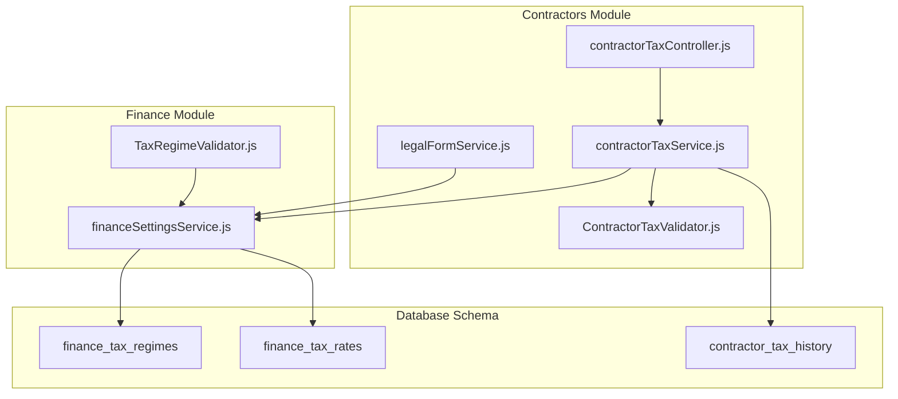
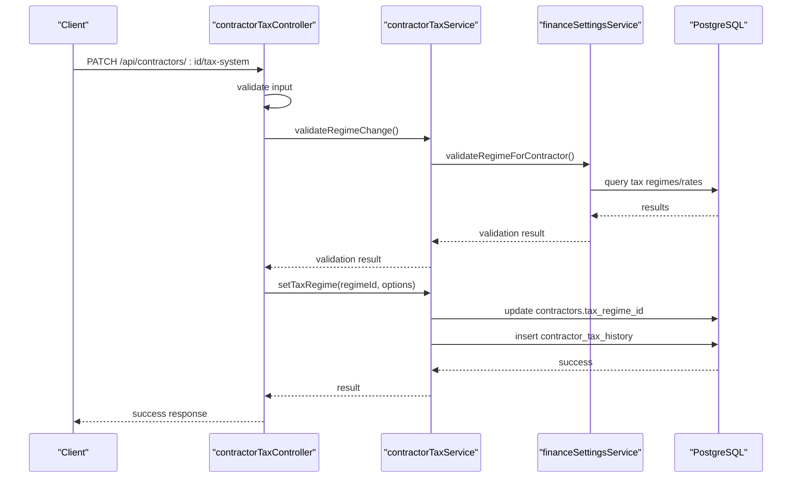
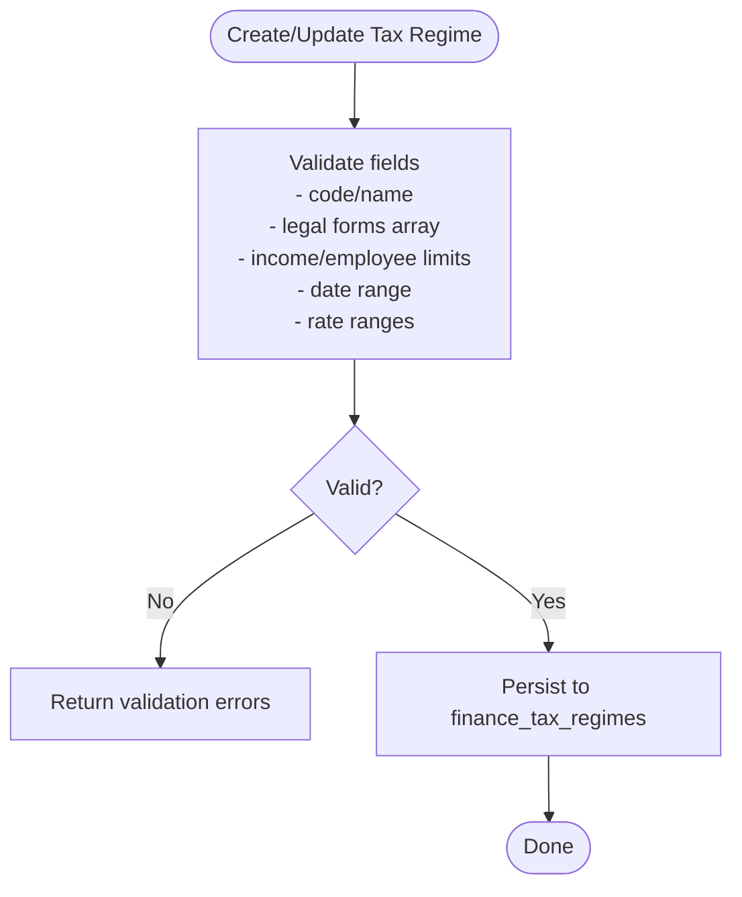
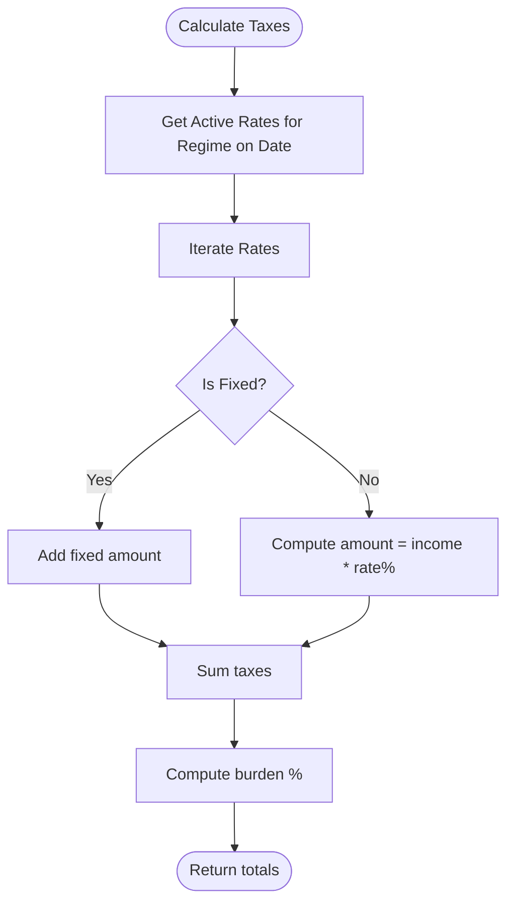
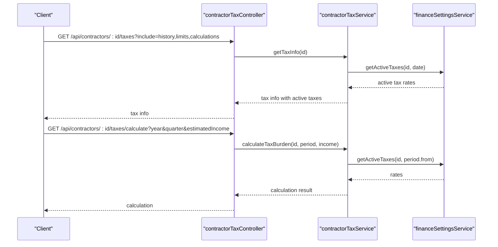
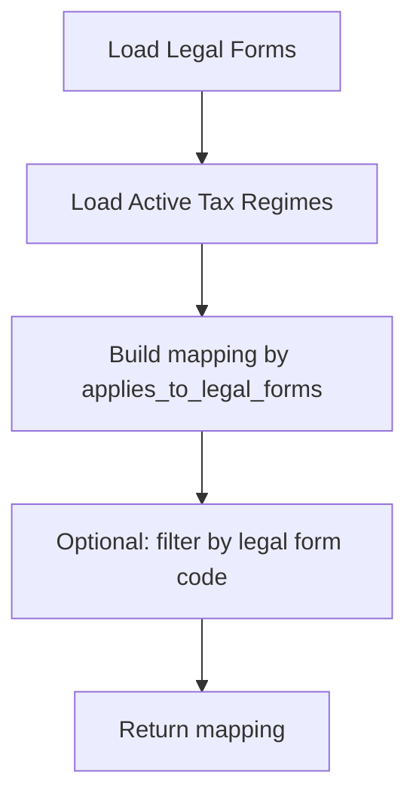
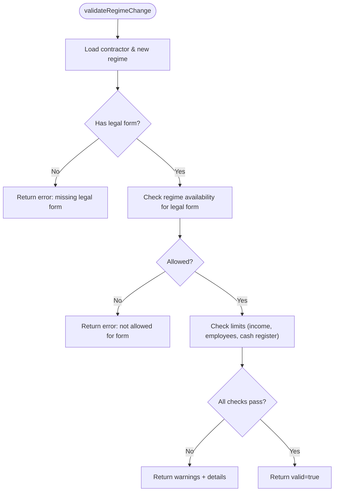
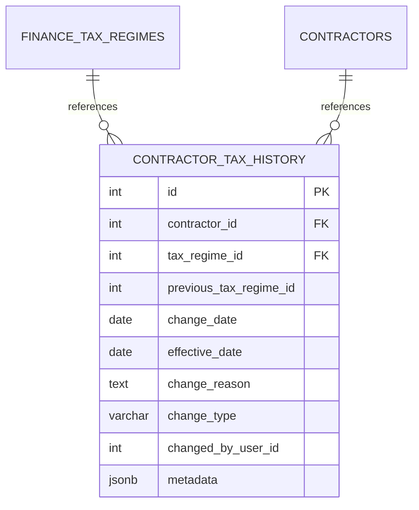
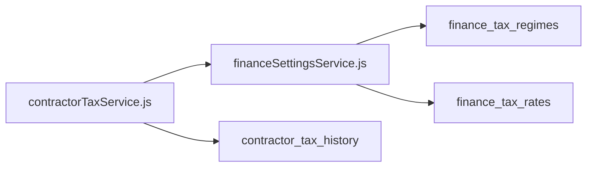
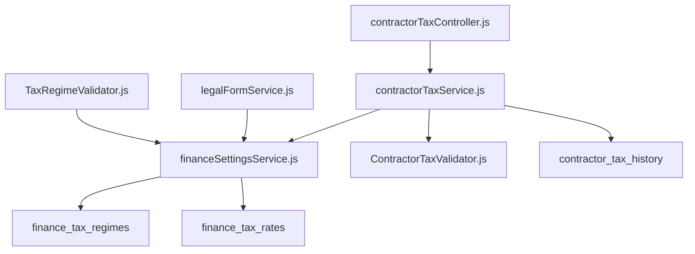

# Tax Compliance System

<cite>
**Referenced Files in This Document**
- [contractorTaxController.js](file://backend/modules/contractors/controllers/contractorTaxController.js)
- [contractorTaxService.js](file://backend/modules/contractors/services/contractorTaxService.js)
- [ContractorTaxValidator.js](file://backend/modules/contractors/validators/ContractorTaxValidator.js)
- [legalFormService.js](file://backend/modules/contractors/services/legalFormService.js)
- [financeSettingsService.js](file://backend/modules/finance/services/financeSettingsService.js)
- [TaxRegimeValidator.js](file://backend/modules/finance/validators/TaxRegimeValidator.js)
- [70_finance_tax_settings.sql](file://backend/migrations/70_finance_tax_settings.sql)
- [111_contractor_tax_history.sql](file://backend/migrations/111_contractor_tax_history.sql)
- [72_tax_rates_effective_dates.sql](file://backend/migrations/72_tax_rates_effective_dates.sql)
- [finance_tax.test.js](file://backend/tests/finance_tax.test.js)
</cite>

## Table of Contents
1. [Introduction](#introduction)
2. [Project Structure](#project-structure)
3. [Core Components](#core-components)
4. [Architecture Overview](#architecture-overview)
5. [Detailed Component Analysis](#detailed-component-analysis)
6. [Dependency Analysis](#dependency-analysis)
7. [Performance Considerations](#performance-considerations)
8. [Troubleshooting Guide](#troubleshooting-guide)
9. [Conclusion](#conclusion)
10. [Appendices](#appendices)

## Introduction
This document describes the tax compliance system within the Titan CRM platform. It focuses on tax calculation algorithms, VAT handling, regulatory reporting support, tax regime selection, rate application with effective dates, and contractor tax validation. It also covers integration points with the finance module for tax reporting and payment processing, along with tax history tracking, audit trails, and compliance documentation requirements.

## Project Structure
The tax compliance system spans three primary areas:
- Contractors module: endpoint orchestration, contractor tax operations, and validation
- Finance module: tax regimes, tax rates, and calculation services
- Database migrations: schema for tax regimes, rates, contractor tax history, and effective date management

**Diagram sources**
- [contractorTaxController.js:1-254](file://backend/modules/contractors/controllers/contractorTaxController.js#L1-L254)
- [contractorTaxService.js:1-311](file://backend/modules/contractors/services/contractorTaxService.js#L1-L311)
- [legalFormService.js:1-157](file://backend/modules/contractors/services/legalFormService.js#L1-L157)
- [financeSettingsService.js:1-960](file://backend/modules/finance/services/financeSettingsService.js#L1-L745)
- [TaxRegimeValidator.js:1-148](file://backend/modules/finance/validators/TaxRegimeValidator.js#L1-L138)
- [70_finance_tax_settings.sql:1-355](file://backend/migrations/70_finance_tax_settings.sql#L1-L354)
- [111_contractor_tax_history.sql:1-103](file://backend/migrations/111_contractor_tax_history.sql#L1-L103)

**Section sources**
- [contractorTaxController.js:1-254](file://backend/modules/contractors/controllers/contractorTaxController.js#L1-L254)
- [contractorTaxService.js:1-311](file://backend/modules/contractors/services/contractorTaxService.js#L1-L311)
- [legalFormService.js:1-157](file://backend/modules/contractors/services/legalFormService.js#L1-L157)
- [financeSettingsService.js:1-960](file://backend/modules/finance/services/financeSettingsService.js#L1-L745)
- [TaxRegimeValidator.js:1-148](file://backend/modules/finance/validators/TaxRegimeValidator.js#L1-L138)
- [70_finance_tax_settings.sql:1-355](file://backend/migrations/70_finance_tax_settings.sql#L1-L354)
- [111_contractor_tax_history.sql:1-103](file://backend/migrations/111_contractor_tax_history.sql#L1-L103)

## Core Components
- Tax regime management: creation, validation, and filtering by legal form and effective dates
- Tax rate management: active rates per regime, historical rates, and effective date ranges
- Contractor tax operations: regime assignment, tax calculation, limits checking, and optimization suggestions
- Legal form mapping: available regimes per legal form
- Audit and history: contractor tax history with change type, reason, and metadata
- Validation pipeline: contractor regime change validation and input sanitization

**Section sources**
- [financeSettingsService.js:69-475](file://backend/modules/finance/services/financeSettingsService.js#L69-L475)
- [contractorTaxService.js:13-311](file://backend/modules/contractors/services/contractorTaxService.js#L13-L311)
- [ContractorTaxValidator.js:16-172](file://backend/modules/contractors/validators/ContractorTaxValidator.js#L16-L172)
- [legalFormService.js:69-150](file://backend/modules/contractors/services/legalFormService.js#L69-L150)
- [111_contractor_tax_history.sql:10-56](file://backend/migrations/111_contractor_tax_history.sql#L10-L56)

## Architecture Overview
The system follows a layered architecture:
- Controllers accept requests and delegate to services
- Services encapsulate business logic and interact with the database via shared DB utilities
- Validators enforce data correctness and eligibility rules
- Migrations define schema and constraints for tax regimes, rates, and history

**Diagram sources**
- [contractorTaxController.js:66-110](file://backend/modules/contractors/controllers/contractorTaxController.js#L66-L110)
- [contractorTaxService.js:77-134](file://backend/modules/contractors/services/contractorTaxService.js#L77-L134)
- [financeSettingsService.js:425-475](file://backend/modules/finance/services/financeSettingsService.js#L425-L475)

## Detailed Component Analysis

### Tax Regime Management
- Creation and validation: ensures unique codes, valid ranges, and logical constraints
- Filtering by legal form and effective dates: supports historical applicability
- Limits enforcement: income and employee thresholds per regime

**Diagram sources**
- [TaxRegimeValidator.js:14-55](file://backend/modules/finance/validators/TaxRegimeValidator.js#L14-L55)
- [financeSettingsService.js:89-131](file://backend/modules/finance/services/financeSettingsService.js#L89-L131)

**Section sources**
- [TaxRegimeValidator.js:1-148](file://backend/modules/finance/validators/TaxRegimeValidator.js#L1-L138)
- [financeSettingsService.js:69-195](file://backend/modules/finance/services/financeSettingsService.js#L69-L195)
- [70_finance_tax_settings.sql:10-31](file://backend/migrations/70_finance_tax_settings.sql#L10-L31)

### Tax Rate Management and Effective Dates
- Active rates retrieval: filters by regime and effective date boundaries
- Historical rates: maintains effective_from/effective_to for rate changes over time
- Multi-region support: rates per regime per region via legal forms and regime applicability

**Diagram sources**
- [financeSettingsService.js:599-631](file://backend/modules/finance/services/financeSettingsService.js#L599-L631)
- [72_tax_rates_effective_dates.sql:79-124](file://backend/migrations/72_tax_rates_effective_dates.sql#L79-L124)

**Section sources**
- [financeSettingsService.js:564-631](file://backend/modules/finance/services/financeSettingsService.js#L564-L631)
- [72_tax_rates_effective_dates.sql:79-124](file://backend/migrations/72_tax_rates_effective_dates.sql#L79-L124)

### Contractor Tax Operations
- Tax info aggregation: regime, active taxes, limits, and history
- Tax calculation: configurable periods (quarter/month/year)
- Limits checking: income, employees, and online cash register requirements
- Optimization suggestions: regime recommendations based on thresholds

**Diagram sources**
- [contractorTaxController.js:16-157](file://backend/modules/contractors/controllers/contractorTaxController.js#L16-L157)
- [contractorTaxService.js:141-143](file://backend/modules/contractors/services/contractorTaxService.js#L141-L143)
- [financeSettingsService.js:599-631](file://backend/modules/finance/services/financeSettingsService.js#L599-L631)

**Section sources**
- [contractorTaxController.js:16-190](file://backend/modules/contractors/controllers/contractorTaxController.js#L16-L190)
- [contractorTaxService.js:13-66](file://backend/modules/contractors/services/contractorTaxService.js#L13-L66)
- [contractorTaxService.js:187-236](file://backend/modules/contractors/services/contractorTaxService.js#L187-L236)
- [contractorTaxService.js:243-302](file://backend/modules/contractors/services/contractorTaxService.js#L243-L302)

### Legal Form Mapping and Tax Regime Availability
- Builds mapping of legal forms to available tax regimes
- Supports filtering by active only and optional single form lookup
- Validates regime applicability per legal form

**Diagram sources**
- [legalFormService.js:69-109](file://backend/modules/contractors/services/legalFormService.js#L69-L109)
- [financeSettingsService.js:411-417](file://backend/modules/finance/services/financeSettingsService.js#L411-L417)

**Section sources**
- [legalFormService.js:28-109](file://backend/modules/contractors/services/legalFormService.js#L28-L109)
- [financeSettingsService.js:411-417](file://backend/modules/finance/services/financeSettingsService.js#L411-L417)

### Contractor Tax Validator Logic
- Validates regime change eligibility against legal form and limits
- Checks effective date applicability and required online cash register
- Provides warnings and structured validation results

**Diagram sources**
- [ContractorTaxValidator.js:16-55](file://backend/modules/contractors/validators/ContractorTaxValidator.js#L16-L55)
- [ContractorTaxValidator.js:63-122](file://backend/modules/contractors/validators/ContractorTaxValidator.js#L63-L122)

**Section sources**
- [ContractorTaxValidator.js:16-172](file://backend/modules/contractors/validators/ContractorTaxValidator.js#L16-L172)

### Tax History Tracking and Audit Trails
- Stores every tax regime change with effective date, reason, and actor
- Supports multiple change types (manual, automatic, system, optimization)
- Enables compliance reporting and audits

**Diagram sources**
- [111_contractor_tax_history.sql:10-36](file://backend/migrations/111_contractor_tax_history.sql#L10-L36)

**Section sources**
- [contractorTaxController.js:89-103](file://backend/modules/contractors/controllers/contractorTaxController.js#L89-L103)
- [contractorTaxService.js:111-124](file://backend/modules/contractors/services/contractorTaxService.js#L111-L124)
- [111_contractor_tax_history.sql:10-56](file://backend/migrations/111_contractor_tax_history.sql#L10-L56)

### Practical Examples

#### Example: Multi-Region Tax Handling
- Legal form mapping determines available regimes per jurisdiction
- Effective dates ensure correct rates apply during specific periods
- Example scenario: OSN regime with VAT historical rates applied per region

**Section sources**
- [legalFormService.js:69-109](file://backend/modules/contractors/services/legalFormService.js#L69-L109)
- [financeSettingsService.js:518-556](file://backend/modules/finance/services/financeSettingsService.js#L518-L556)
- [72_tax_rates_effective_dates.sql:79-124](file://backend/migrations/72_tax_rates_effective_dates.sql#L79-L124)

#### Example: Tax Calculation Workflow
- Request: calculate taxes for a contractor for the last quarter with estimated income
- Steps: determine active taxes for the regime on the period start date, compute amounts, sum totals, and derive burden percentage

**Section sources**
- [contractorTaxController.js:116-157](file://backend/modules/contractors/controllers/contractorTaxController.js#L116-L157)
- [financeSettingsService.js:599-631](file://backend/modules/finance/services/financeSettingsService.js#L599-L631)

#### Example: Regulatory Reporting Requirements
- Use contractor tax history to generate audit trails
- Combine active taxes with effective dates for reporting periods
- Export tax regime changes with reasons and actors for compliance

**Section sources**
- [contractorTaxService.js:150-180](file://backend/modules/contractors/services/contractorTaxService.js#L150-L180)
- [financeSettingsService.js:518-556](file://backend/modules/finance/services/financeSettingsService.js#L518-L556)

### Integration with Financial Modules
- Tax regimes and rates are managed in the finance module
- Contractor tax operations depend on finance settings service for active tax determination
- Payments and invoices integrate with tax obligations via shared contractor references

**Diagram sources**
- [contractorTaxService.js:34-41](file://backend/modules/contractors/services/contractorTaxService.js#L34-L41)
- [financeSettingsService.js:564-589](file://backend/modules/finance/services/financeSettingsService.js#L564-L589)
- [70_finance_tax_settings.sql:10-82](file://backend/migrations/70_finance_tax_settings.sql#L10-L82)

**Section sources**
- [financeSettingsService.js:564-589](file://backend/modules/finance/services/financeSettingsService.js#L564-L589)
- [70_finance_tax_settings.sql:1-355](file://backend/migrations/70_finance_tax_settings.sql#L1-L354)

## Dependency Analysis
- Controllers depend on services for business logic
- Services depend on finance settings service for regime/rate queries
- Validators depend on DB utilities and finance settings service
- Migrations define schema dependencies and constraints

**Diagram sources**
- [contractorTaxController.js:6-10](file://backend/modules/contractors/controllers/contractorTaxController.js#L6-L10)
- [contractorTaxService.js:6-8](file://backend/modules/contractors/services/contractorTaxService.js#L6-L8)
- [financeSettingsService.js:6-7](file://backend/modules/finance/services/financeSettingsService.js#L6-L7)

**Section sources**
- [contractorTaxController.js:6-10](file://backend/modules/contractors/controllers/contractorTaxController.js#L6-L10)
- [contractorTaxService.js:6-8](file://backend/modules/contractors/services/contractorTaxService.js#L6-L8)
- [financeSettingsService.js:6-7](file://backend/modules/finance/services/financeSettingsService.js#L6-L7)

## Performance Considerations
- Indexes on tax regimes and rates improve lookup performance
- Effective date filtering reduces rate scanning to applicable windows
- Batch operations on contractor tax history benefit from appropriate indexing
- Consider caching frequently accessed legal form to regime mappings

## Troubleshooting Guide
Common issues and resolutions:
- Contractor not found: verify contractor ID and existence in the database
- Invalid legal form: ensure legal form code matches existing entries
- Regime not allowed: confirm regime’s applies_to_legal_forms includes the contractor’s legal form
- Limits exceeded: review income/employee thresholds and required online cash register status
- Historical rates mismatch: ensure effective_from/effective_to boundaries align with the calculation date

**Section sources**
- [contractorTaxService.js:24-26](file://backend/modules/contractors/services/contractorTaxService.js#L24-L26)
- [ContractorTaxValidator.js:17-25](file://backend/modules/contractors/validators/ContractorTaxValidator.js#L17-L25)
- [financeSettingsService.js:442-450](file://backend/modules/finance/services/financeSettingsService.js#L442-L450)
- [financeSettingsService.js:452-472](file://backend/modules/finance/services/financeSettingsService.js#L452-L472)

## Conclusion
The tax compliance system integrates contractor tax operations with robust regime and rate management, ensuring accurate tax calculations, historical tracking, and regulatory adherence. The modular design enables clear separation of concerns, while migrations maintain schema integrity across evolving tax regulations.

## Appendices

### API Endpoints Overview
- GET /api/contractors/:id/taxes
- PATCH /api/contractors/:id/tax-system
- GET /api/contractors/:id/taxes/calculate
- GET /api/contractors/:id/taxes/history
- GET /api/contractors/:id/taxes/limits-check
- GET /api/contractors/legal-forms
- GET /api/contractors/legal-forms/:code/tax-regimes
- GET /api/contractors/:id/taxes/optimization-suggestions

**Section sources**
- [contractorTaxController.js:16-243](file://backend/modules/contractors/controllers/contractorTaxController.js#L16-L243)

### Test Coverage
- Finance tax tests validate tax regime and rate behaviors
- Contractor tax controller tests cover CRUD and calculation endpoints

**Section sources**
- [finance_tax.test.js](file://backend/tests/finance_tax.test.js)