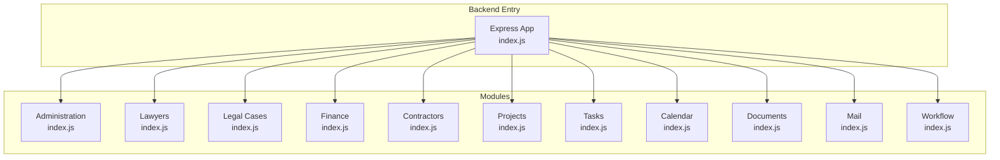
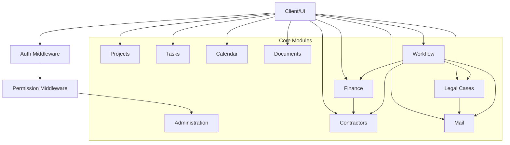
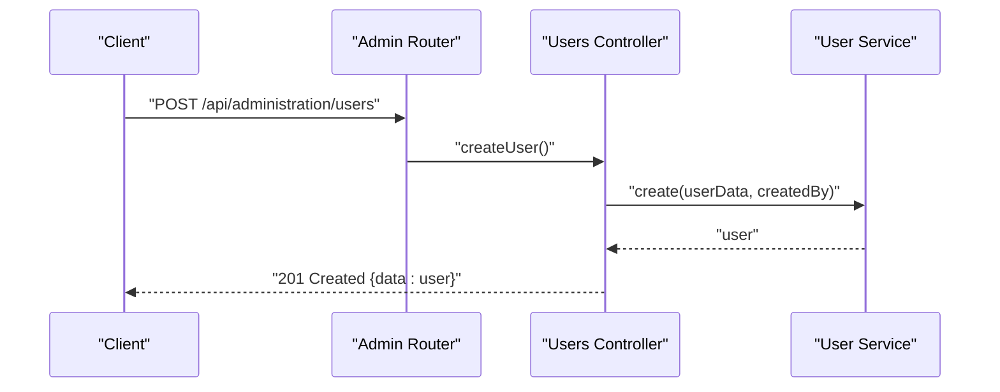
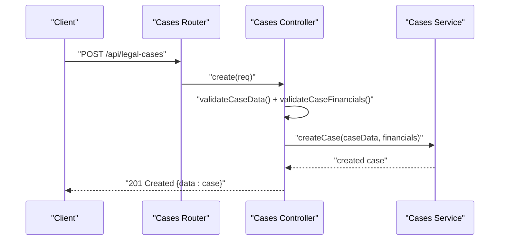
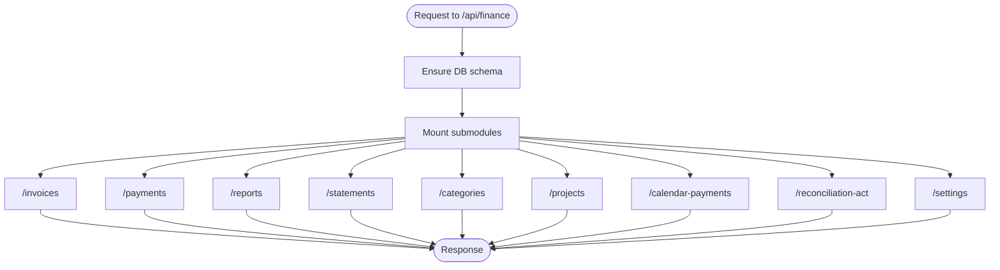
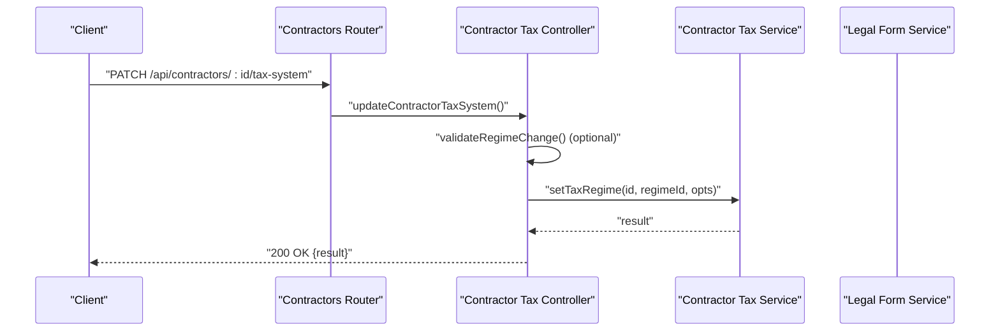
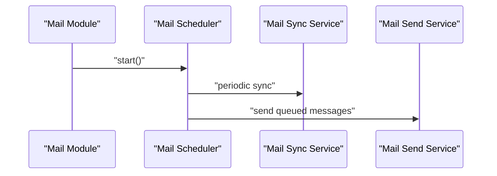
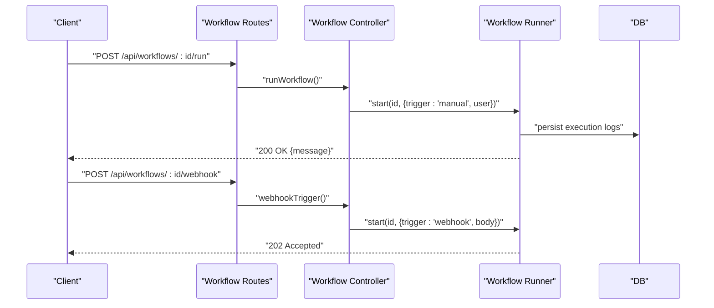
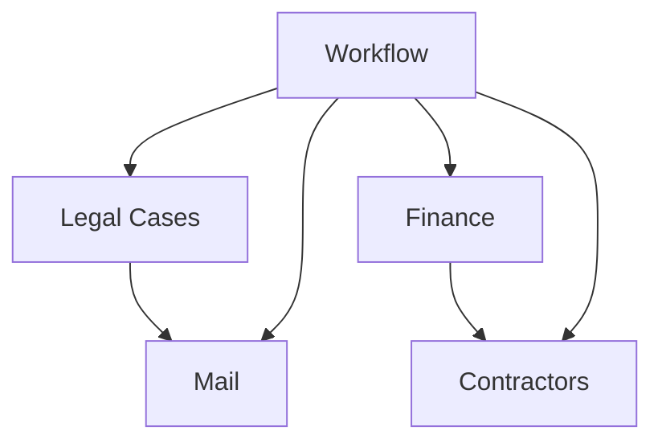

# Core Modules

<cite>
**Referenced Files in This Document**
- [backend/modules/administration/index.js](file://backend/modules/administration/index.js)
- [backend/modules/administration/controllers/users.js](file://backend/modules/administration/controllers/users.js)
- [backend/modules/legal_cases/index.js](file://backend/modules/legal_cases/index.js)
- [backend/modules/legal_cases/controllers/cases.js](file://backend/modules/legal_cases/controllers/cases.js)
- [backend/modules/finance/index.js](file://backend/modules/finance/index.js)
- [backend/modules/finance/invoices/index.js](file://backend/modules/finance/invoices/index.js)
- [backend/modules/contractors/index.js](file://backend/modules/contractors/index.js)
- [backend/modules/contractors/controllers/contractorTaxController.js](file://backend/modules/contractors/controllers/contractorTaxController.js)
- [backend/modules/projects/index.js](file://backend/modules/projects/index.js)
- [backend/modules/tasks/index.js](file://backend/modules/tasks/index.js)
- [backend/modules/calendar/index.js](file://backend/modules/calendar/index.js)
- [backend/modules/documents/index.js](file://backend/modules/documents/index.js)
- [backend/modules/mail/index.js](file://backend/modules/mail/index.js)
- [backend/modules/workflow/index.js](file://backend/modules/workflow/index.js)
- [backend/modules/workflow/workflowController.js](file://backend/modules/workflow/workflowController.js)
- [backend/modules/workflow/workflowRoutes.js](file://backend/modules/workflow/workflowRoutes.js)
</cite>

## Table of Contents
1. [Introduction](#introduction)
2. [Project Structure](#project-structure)
3. [Core Components](#core-components)
4. [Architecture Overview](#architecture-overview)
5. [Detailed Component Analysis](#detailed-component-analysis)
6. [Dependency Analysis](#dependency-analysis)
7. [Performance Considerations](#performance-considerations)
8. [Troubleshooting Guide](#troubleshooting-guide)
9. [Conclusion](#conclusion)
10. [Appendices](#appendices)

## Introduction
This document describes Titan CRM’s core business modules and how they collaborate. It focuses on module boundaries, inter-module communication, shared services, and integration patterns. Practical usage examples and customization options are included to help administrators and developers operate and extend the system effectively.

## Project Structure
Each module follows a consistent Express-based structure:
- A main module entry exports a router, settings, and optional services.
- Routes delegate to controllers.
- Controllers coordinate services and return standardized responses.
- Shared utilities (logging, error handling, response helpers) are reused across modules.

**Diagram sources**
- [backend/modules/administration/index.js:1-34](file://backend/modules/administration/index.js#L1-L33)
- [backend/modules/legal_cases/index.js:1-14](file://backend/modules/legal_cases/index.js#L1-L13)
- [backend/modules/finance/index.js:1-55](file://backend/modules/finance/index.js#L1-L55)
- [backend/modules/contractors/index.js:1-14](file://backend/modules/contractors/index.js#L1-L13)
- [backend/modules/projects/index.js:1-14](file://backend/modules/projects/index.js#L1-L13)
- [backend/modules/tasks/index.js:1-14](file://backend/modules/tasks/index.js#L1-L13)
- [backend/modules/calendar/index.js:1-14](file://backend/modules/calendar/index.js#L1-L13)
- [backend/modules/documents/index.js:1-14](file://backend/modules/documents/index.js#L1-L13)
- [backend/modules/mail/index.js:1-30](file://backend/modules/mail/index.js#L1-L29)
- [backend/modules/workflow/index.js:1-21](file://backend/modules/workflow/index.js#L1-L20)

**Section sources**
- [backend/modules/administration/index.js:1-34](file://backend/modules/administration/index.js#L1-L33)
- [backend/modules/legal_cases/index.js:1-14](file://backend/modules/legal_cases/index.js#L1-L13)
- [backend/modules/finance/index.js:1-55](file://backend/modules/finance/index.js#L1-L55)
- [backend/modules/contractors/index.js:1-14](file://backend/modules/contractors/index.js#L1-L13)
- [backend/modules/projects/index.js:1-14](file://backend/modules/projects/index.js#L1-L13)
- [backend/modules/tasks/index.js:1-14](file://backend/modules/tasks/index.js#L1-L13)
- [backend/modules/calendar/index.js:1-14](file://backend/modules/calendar/index.js#L1-L13)
- [backend/modules/documents/index.js:1-14](file://backend/modules/documents/index.js#L1-L13)
- [backend/modules/mail/index.js:1-30](file://backend/modules/mail/index.js#L1-L29)
- [backend/modules/workflow/index.js:1-21](file://backend/modules/workflow/index.js#L1-L20)

## Core Components
This section outlines each core module’s responsibilities, boundaries, and representative APIs.

- Administration
  - Responsibilities: User lifecycle, roles, permissions, organizational structure, company settings.
  - Boundaries: Self-contained under /api/administration with dedicated routers per domain.
  - Representative controller: [users controller:1-132](file://backend/modules/administration/controllers/users.js#L1-L131)

- Lawyers
  - Responsibilities: Legal professionals management, profile aggregation from users and employees, performance tracking, ratings, and specializations.
  - Boundaries: /api/lawyers with CRUD endpoints and data mapping helpers.
  - Representative controller: [lawyers controller:1-231](file://backend/modules/lawyers/controllers.js#L1-L231)

- Legal Cases
  - Responsibilities: Case lifecycle, notes, updates, document attachments, automated updates.
  - Boundaries: /api/legal-cases with CRUD and specialized endpoints for updates and viewing.
  - Representative controller: [cases controller:1-299](file://backend/modules/legal_cases/controllers/cases.js#L1-L299)

- Finance
  - Responsibilities: Invoicing, payments, financial reporting, reconciliation, categories, statements, calendar payments, projects.
  - Boundaries: Central router initializes schema and mounts submodules (/projects, /calendar-payments, /reconciliation-act, /invoices, /payments, /categories, /statements, /reports, /settings).
  - Representative route: [invoices routes:1-40](file://backend/modules/finance/invoices/index.js#L1-L39)

- Contractors
  - Responsibilities: Client/vendor management, tax regime selection, tax calculations, legal form mapping, audit logging.
  - Boundaries: /api/contractors with tax and legal form endpoints.
  - Representative controller: [contractor tax controller:1-254](file://backend/modules/contractors/controllers/contractorTaxController.js#L1-L254)

- Projects and Tasks
  - Responsibilities: Project management, timelines, task tracking.
  - Boundaries: /api/projects and /api/tasks exported by respective module entries.

- Calendar
  - Responsibilities: Event scheduling, reminders, status styling.
  - Boundaries: /api/calendar exported by module entry.

- Documents
  - Responsibilities: File management, version control, sharing links.
  - Boundaries: /api/documents exported by module entry.

- Mail
  - Responsibilities: Email integration, IMAP synchronization, filtering, sending, scheduling.
  - Boundaries: /api/mail with scheduler auto-start and service exports.
  - Representative module: [mail module:1-30](file://backend/modules/mail/index.js#L1-L29)

- Workflow
  - Responsibilities: Business process automation, registry, scheduler, execution history, manual/webhook triggers, approvals.
  - Boundaries: /api/workflows with permission-protected endpoints and webhook support.
  - Representative controller: [workflow controller:1-539](file://backend/modules/workflow/workflowController.js#L1-L538)
  - Representative routes: [workflow routes:1-32](file://backend/modules/workflow/workflowRoutes.js#L1-L31)

**Section sources**
- [backend/modules/administration/index.js:1-34](file://backend/modules/administration/index.js#L1-L33)
- [backend/modules/administration/controllers/users.js:1-132](file://backend/modules/administration/controllers/users.js#L1-L131)
- [backend/modules/legal_cases/index.js:1-14](file://backend/modules/legal_cases/index.js#L1-L13)
- [backend/modules/legal_cases/controllers/cases.js:1-299](file://backend/modules/legal_cases/controllers/cases.js#L1-L299)
- [backend/modules/finance/index.js:1-55](file://backend/modules/finance/index.js#L1-L55)
- [backend/modules/finance/invoices/index.js:1-40](file://backend/modules/finance/invoices/index.js#L1-L39)
- [backend/modules/contractors/index.js:1-14](file://backend/modules/contractors/index.js#L1-L13)
- [backend/modules/contractors/controllers/contractorTaxController.js:1-254](file://backend/modules/contractors/controllers/contractorTaxController.js#L1-L254)
- [backend/modules/projects/index.js:1-14](file://backend/modules/projects/index.js#L1-L13)
- [backend/modules/tasks/index.js:1-14](file://backend/modules/tasks/index.js#L1-L13)
- [backend/modules/calendar/index.js:1-14](file://backend/modules/calendar/index.js#L1-L13)
- [backend/modules/documents/index.js:1-14](file://backend/modules/documents/index.js#L1-L13)
- [backend/modules/mail/index.js:1-30](file://backend/modules/mail/index.js#L1-L29)
- [backend/modules/workflow/index.js:1-21](file://backend/modules/workflow/index.js#L1-L20)
- [backend/modules/workflow/workflowController.js:1-539](file://backend/modules/workflow/workflowController.js#L1-L538)
- [backend/modules/workflow/workflowRoutes.js:1-32](file://backend/modules/workflow/workflowRoutes.js#L1-L31)

## Architecture Overview
Modules are mounted at distinct base paths and communicate primarily via:
- Internal database transactions and shared schema initialization.
- Cross-module triggers executed by the Workflow engine.
- Shared services (e.g., mail, scheduler) invoked by multiple modules.

**Diagram sources**
- [backend/modules/administration/index.js:1-34](file://backend/modules/administration/index.js#L1-L33)
- [backend/modules/legal_cases/index.js:1-14](file://backend/modules/legal_cases/index.js#L1-L13)
- [backend/modules/finance/index.js:1-55](file://backend/modules/finance/index.js#L1-L55)
- [backend/modules/contractors/index.js:1-14](file://backend/modules/contractors/index.js#L1-L13)
- [backend/modules/projects/index.js:1-14](file://backend/modules/projects/index.js#L1-L13)
- [backend/modules/tasks/index.js:1-14](file://backend/modules/tasks/index.js#L1-L13)
- [backend/modules/calendar/index.js:1-14](file://backend/modules/calendar/index.js#L1-L13)
- [backend/modules/documents/index.js:1-14](file://backend/modules/documents/index.js#L1-L13)
- [backend/modules/mail/index.js:1-30](file://backend/modules/mail/index.js#L1-L29)
- [backend/modules/workflow/index.js:1-21](file://backend/modules/workflow/index.js#L1-L20)

## Detailed Component Analysis

### Administration Module
- Purpose: Manage users, roles, permissions, employees, organizational units, and company settings.
- Key endpoints (examples):
  - POST /api/administration/users
  - GET /api/administration/users/:id
  - PATCH /api/administration/users/:id
  - DELETE /api/administration/users/:id
  - POST /api/administration/users/:id/change-password
  - POST /api/administration/users/:id/block | unblock
  - GET /api/administration/users
  - GET /api/administration/roles, /permissions, /employees, /org, /company
- Representative controller: [users controller:1-132](file://backend/modules/administration/controllers/users.js#L1-L131)

**Diagram sources**
- [backend/modules/administration/index.js:1-34](file://backend/modules/administration/index.js#L1-L33)
- [backend/modules/administration/controllers/users.js:1-132](file://backend/modules/administration/controllers/users.js#L1-L131)

**Section sources**
- [backend/modules/administration/index.js:1-34](file://backend/modules/administration/index.js#L1-L33)
- [backend/modules/administration/controllers/users.js:1-132](file://backend/modules/administration/controllers/users.js#L1-L131)

### Legal Cases Module
- Purpose: Full lifecycle for legal matters including case records, notes, documents, and automated updates.
- Key endpoints (examples):
  - GET /api/legal-cases
  - GET /api/legal-cases/:id
  - POST /api/legal-cases
  - PUT /api/legal-cases/:id
  - DELETE /api/legal-cases/:id
  - GET /api/legal-cases/:id/updates/unviewed
  - POST /api/legal-cases/:id/updates/mark-viewed
  - DELETE /api/legal-cases/:id/updates/:updateId
  - DELETE /api/legal-cases/:id/updates
- Representative controller: [cases controller:1-299](file://backend/modules/legal_cases/controllers/cases.js#L1-L299)

**Diagram sources**
- [backend/modules/legal_cases/controllers/cases.js:1-299](file://backend/modules/legal_cases/controllers/cases.js#L1-L299)

**Section sources**
- [backend/modules/legal_cases/index.js:1-14](file://backend/modules/legal_cases/index.js#L1-L13)
- [backend/modules/legal_cases/controllers/cases.js:1-299](file://backend/modules/legal_cases/controllers/cases.js#L1-L299)

### Finance Module
- Purpose: Invoicing, payments, financial reporting, reconciliation, categories, statements, calendar payments, projects.
- Key characteristics:
  - Schema initialization middleware ensures DB schema readiness before requests.
  - Submodules mounted under /api/finance: /projects, /calendar-payments, /reconciliation-act, /invoices, /payments, /categories, /statements, /reports, /settings.
- Representative route: [invoices routes:1-40](file://backend/modules/finance/invoices/index.js#L1-L39)

**Diagram sources**
- [backend/modules/finance/index.js:1-55](file://backend/modules/finance/index.js#L1-L55)

**Section sources**
- [backend/modules/finance/index.js:1-55](file://backend/modules/finance/index.js#L1-L55)
- [backend/modules/finance/invoices/index.js:1-40](file://backend/modules/finance/invoices/index.js#L1-L39)

### Contractors Module
- Purpose: Client/vendor management with tax compliance, legal form mapping, and audit logging.
- Key endpoints (examples):
  - GET /api/contractors/:id/taxes
  - PATCH /api/contractors/:id/tax-system
  - GET /api/contractors/:id/taxes/calculate
  - GET /api/contractors/:id/taxes/history
  - GET /api/contractors/:id/taxes/limits-check
  - GET /api/contractors/legal-forms
  - GET /api/contractors/legal-forms/:code/tax-regimes
  - GET /api/contractors/:id/taxes/optimization-suggestions
- Representative controller: [contractor tax controller:1-254](file://backend/modules/contractors/controllers/contractorTaxController.js#L1-L254)

**Diagram sources**
- [backend/modules/contractors/controllers/contractorTaxController.js:1-254](file://backend/modules/contractors/controllers/contractorTaxController.js#L1-L254)

**Section sources**
- [backend/modules/contractors/index.js:1-14](file://backend/modules/contractors/index.js#L1-L13)
- [backend/modules/contractors/controllers/contractorTaxController.js:1-254](file://backend/modules/contractors/controllers/contractorTaxController.js#L1-L254)

### Projects and Tasks Module
- Purpose: Project management and task tracking.
- Boundaries: Exported under /api/projects and /api/tasks respectively.

**Section sources**
- [backend/modules/projects/index.js:1-14](file://backend/modules/projects/index.js#L1-L13)
- [backend/modules/tasks/index.js:1-14](file://backend/modules/tasks/index.js#L1-L13)

### Calendar Module
- Purpose: Event scheduling and reminders.
- Boundaries: Exported under /api/calendar.

**Section sources**
- [backend/modules/calendar/index.js:1-14](file://backend/modules/calendar/index.js#L1-L13)

### Documents Module
- Purpose: File management and version control.
- Boundaries: Exported under /api/documents.

**Section sources**
- [backend/modules/documents/index.js:1-14](file://backend/modules/documents/index.js#L1-L13)

### Mail Module
- Purpose: Email integration, IMAP synchronization, filtering, sending, scheduling.
- Notable behavior: Scheduler starts automatically on module load.
- Boundaries: Exported under /api/mail with service exports.

**Diagram sources**
- [backend/modules/mail/index.js:1-30](file://backend/modules/mail/index.js#L1-L29)

**Section sources**
- [backend/modules/mail/index.js:1-30](file://backend/modules/mail/index.js#L1-L29)

### Workflow Module
- Purpose: Business process automation with registry, scheduler, execution history, manual/webhook triggers, and approvals.
- Representative endpoints (examples):
  - GET /api/workflows
  - POST /api/workflows
  - GET /api/workflows/:id
  - PUT /api/workflows/:id
  - DELETE /api/workflows/:id
  - POST /api/workflows/:id/run
  - POST /api/workflows/:id/validate
  - GET /api/workflows/:id/history
  - GET /api/workflows/:id/history/:execId
  - POST /api/workflows/:id/history/:execId/retry
  - POST /api/workflows/:id/history/:execId/approve
  - DELETE /api/workflows/:id/history
  - DELETE /api/workflows/:id/history/:execId
  - POST /api/workflows/:id/webhook (public)
  - GET /api/workflows/registry/actions
- Representative controller: [workflow controller:1-539](file://backend/modules/workflow/workflowController.js#L1-L538)
- Representative routes: [workflow routes:1-32](file://backend/modules/workflow/workflowRoutes.js#L1-L31)

**Diagram sources**
- [backend/modules/workflow/workflowController.js:1-539](file://backend/modules/workflow/workflowController.js#L1-L538)
- [backend/modules/workflow/workflowRoutes.js:1-32](file://backend/modules/workflow/workflowRoutes.js#L1-L31)

**Section sources**
- [backend/modules/workflow/index.js:1-21](file://backend/modules/workflow/index.js#L1-L20)
- [backend/modules/workflow/workflowController.js:1-539](file://backend/modules/workflow/workflowController.js#L1-L538)
- [backend/modules/workflow/workflowRoutes.js:1-32](file://backend/modules/workflow/workflowRoutes.js#L1-L31)

## Dependency Analysis
- Module coupling:
  - Finance depends on Contractors for client/vendor financial data and tax regimes.
  - Legal Cases integrates with Mail for automated updates and document ingestion.
  - Workflow orchestrates cross-module actions (e.g., updating case status, attaching documents, sending emails).
- Shared services:
  - Mail module provides IMAP sync, filtering, and sending services used by Legal Cases and potentially others.
  - Audit logging is used by Contractors for tax regime changes.
- External integrations:
  - Mail module includes IMAP synchronization and filter engine.
  - Workflow module registers actions from other modules and schedules executions.

**Diagram sources**
- [backend/modules/finance/index.js:1-55](file://backend/modules/finance/index.js#L1-L55)
- [backend/modules/contractors/controllers/contractorTaxController.js:1-254](file://backend/modules/contractors/controllers/contractorTaxController.js#L1-L254)
- [backend/modules/legal_cases/controllers/cases.js:1-299](file://backend/modules/legal_cases/controllers/cases.js#L1-L299)
- [backend/modules/mail/index.js:1-30](file://backend/modules/mail/index.js#L1-L29)
- [backend/modules/workflow/index.js:1-21](file://backend/modules/workflow/index.js#L1-L20)

**Section sources**
- [backend/modules/finance/index.js:1-55](file://backend/modules/finance/index.js#L1-L55)
- [backend/modules/contractors/controllers/contractorTaxController.js:1-254](file://backend/modules/contractors/controllers/contractorTaxController.js#L1-L254)
- [backend/modules/legal_cases/controllers/cases.js:1-299](file://backend/modules/legal_cases/controllers/cases.js#L1-L299)
- [backend/modules/mail/index.js:1-30](file://backend/modules/mail/index.js#L1-L29)
- [backend/modules/workflow/index.js:1-21](file://backend/modules/workflow/index.js#L1-L20)

## Performance Considerations
- Use pagination and filters in user listings and case queries to reduce payload sizes.
- Prefer batch operations where available (e.g., bulk invoice updates) to minimize round-trips.
- Offload heavy tasks (e.g., mail sync, workflow execution) to asynchronous workers or schedulers already present in modules.
- Ensure schema initialization middleware runs efficiently; avoid unnecessary repeated checks.

## Troubleshooting Guide
- Authentication and permissions:
  - Workflow routes apply auth and permission middleware; verify headers and permissions for protected endpoints.
- Mail synchronization:
  - Confirm scheduler is running and IMAP credentials are valid; inspect module logs for sync errors.
- Workflow execution:
  - Use execution history endpoints to inspect logs and summaries; retry or approve paused executions as needed.
- Case updates:
  - For private notes, ensure the required user ID header is provided; otherwise, requests may be rejected.

**Section sources**
- [backend/modules/workflow/workflowRoutes.js:1-32](file://backend/modules/workflow/workflowRoutes.js#L1-L31)
- [backend/modules/mail/index.js:1-30](file://backend/modules/mail/index.js#L1-L29)
- [backend/modules/workflow/workflowController.js:1-539](file://backend/modules/workflow/workflowController.js#L1-L538)
- [backend/modules/legal_cases/controllers/cases.js:1-299](file://backend/modules/legal_cases/controllers/cases.js#L1-L299)

## Conclusion
Titan CRM’s modules are organized around clear boundaries with shared services and a robust Workflow engine enabling cross-module automation. Administrators can manage users and roles, track legal cases, handle financial operations, manage contractors with tax compliance, and orchestrate processes through workflows. Mail integration and scheduling enhance operational efficiency. For customization, leverage module settings, workflow registry actions, and controller endpoints documented above.

## Appendices
- Practical examples
  - Administration: Create a user via POST /api/administration/users; update via PATCH /api/administration/users/:id.
  - Legal Cases: Create a case via POST /api/legal-cases; mark updates as viewed via POST /api/legal-cases/:id/updates/mark-viewed.
  - Finance: Create an invoice via POST /api/finance/invoices; recalculate status via POST /api/finance/invoices/:id/recalculate-status.
  - Contractors: Change tax system via PATCH /api/contractors/:id/tax-system; calculate taxes via GET /api/contractors/:id/taxes/calculate.
  - Workflow: Trigger manually via POST /api/workflows/:id/run; expose webhook via POST /api/workflows/:id/webhook.