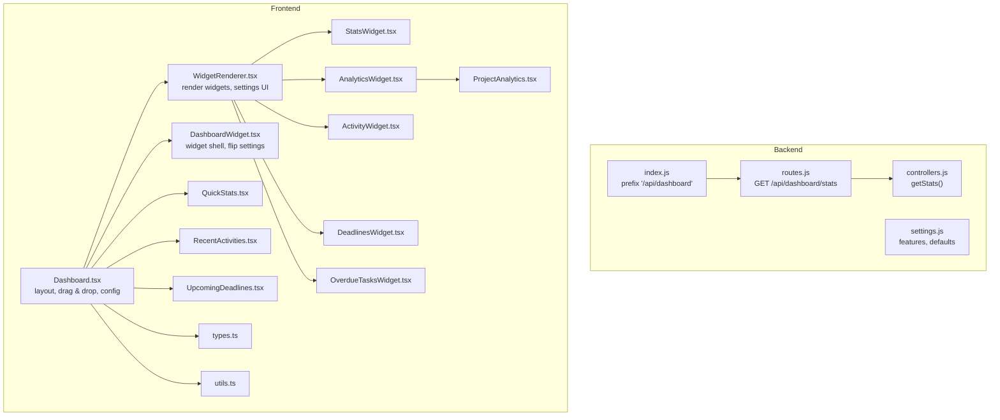
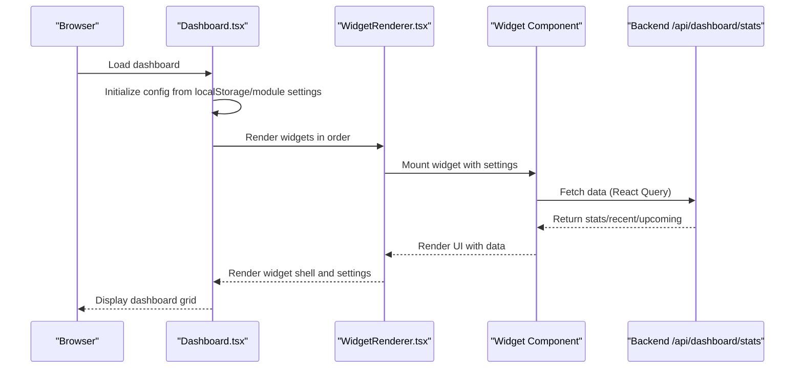
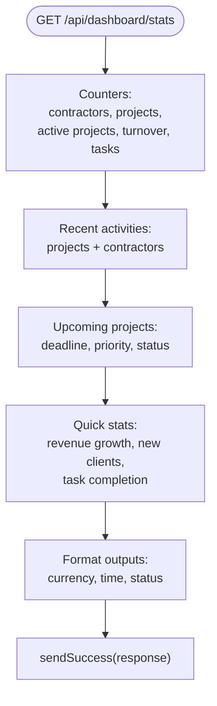
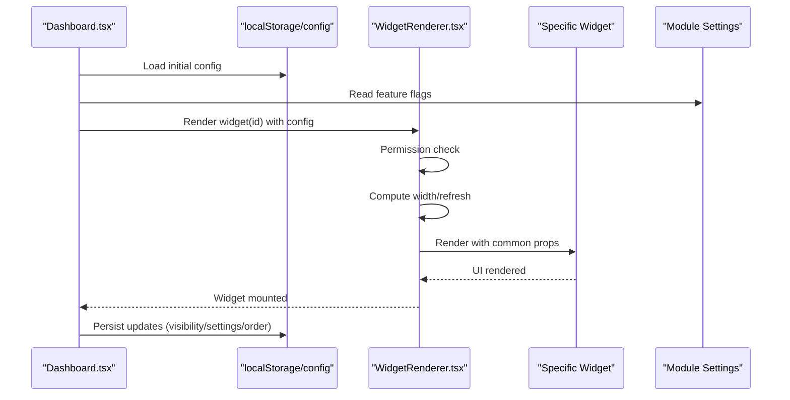
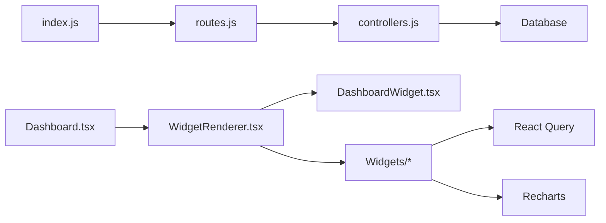

# Dashboard Module

<cite>
**Referenced Files in This Document**
- [backend/modules/dashboard/index.js](file://backend/modules/dashboard/index.js)
- [backend/modules/dashboard/routes.js](file://backend/modules/dashboard/routes.js)
- [backend/modules/dashboard/controllers.js](file://backend/modules/dashboard/controllers.js)
- [backend/modules/dashboard/settings.js](file://backend/modules/dashboard/settings.js)
- [docs/api/DASHBOARD.md](file://docs/api/DASHBOARD.md)
- [frontend/src/modules/dashboard/pages/Dashboard.tsx](file://frontend/src/modules/dashboard/pages/Dashboard.tsx)
- [frontend/src/modules/dashboard/components/WidgetRenderer.tsx](file://frontend/src/modules/dashboard/components/WidgetRenderer.tsx)
- [frontend/src/modules/dashboard/components/DashboardWidget.tsx](file://frontend/src/modules/dashboard/components/DashboardWidget.tsx)
- [frontend/src/modules/dashboard/components/widgets/StatsWidget.tsx](file://frontend/src/modules/dashboard/components/widgets/StatsWidget.tsx)
- [frontend/src/modules/dashboard/components/widgets/AnalyticsWidget.tsx](file://frontend/src/modules/dashboard/components/widgets/AnalyticsWidget.tsx)
- [frontend/src/modules/dashboard/components/widgets/ActivityWidget.tsx](file://frontend/src/modules/dashboard/components/widgets/ActivityWidget.tsx)
- [frontend/src/modules/dashboard/components/widgets/DeadlinesWidget.tsx](file://frontend/src/modules/dashboard/components/widgets/DeadlinesWidget.tsx)
- [frontend/src/modules/dashboard/components/widgets/OverdueTasksWidget.tsx](file://frontend/src/modules/dashboard/components/widgets/OverdueTasksWidget.tsx)
- [frontend/src/modules/dashboard/components/ProjectAnalytics.tsx](file://frontend/src/modules/dashboard/components/ProjectAnalytics.tsx)
- [frontend/src/modules/dashboard/components/QuickStats.tsx](file://frontend/src/modules/dashboard/components/QuickStats.tsx)
- [frontend/src/modules/dashboard/components/RecentActivities.tsx](file://frontend/src/modules/dashboard/components/RecentActivities.tsx)
- [frontend/src/modules/dashboard/components/UpcomingDeadlines.tsx](file://frontend/src/modules/dashboard/components/UpcomingDeadlines.tsx)
- [frontend/src/modules/dashboard/types.ts](file://frontend/src/modules/dashboard/types.ts)
- [frontend/src/modules/dashboard/utils.ts](file://frontend/src/modules/dashboard/utils.ts)
</cite>

## Table of Contents
1. [Introduction](#introduction)
2. [Project Structure](#project-structure)
3. [Core Components](#core-components)
4. [Architecture Overview](#architecture-overview)
5. [Detailed Component Analysis](#detailed-component-analysis)
6. [Dependency Analysis](#dependency-analysis)
7. [Performance Considerations](#performance-considerations)
8. [Troubleshooting Guide](#troubleshooting-guide)
9. [Conclusion](#conclusion)
10. [Appendices](#appendices)

## Introduction
The Dashboard module provides a customizable, real-time overview of key business metrics and operational highlights. It offers:
- A widget-based layout system allowing users to arrange, resize, and configure dashboard blocks.
- Real-time statistics via periodic data refreshes and permission-aware rendering.
- Analytics integration with charts for revenue trends and project profitability.
- Quick stats, recent activity feeds, and priority indicators for immediate insights.
- Personalization through user preferences persisted locally and module-level feature toggles.

## Project Structure
The Dashboard module spans backend and frontend:
- Backend: Express router exposing a single endpoint to fetch dashboard statistics.
- Frontend: A page orchestrating a draggable, configurable grid of widgets backed by React Query for caching and refresh.

**Diagram sources**
- [backend/modules/dashboard/index.js:1-14](file://backend/modules/dashboard/index.js#L1-L13)
- [backend/modules/dashboard/routes.js:1-13](file://backend/modules/dashboard/routes.js#L1-L12)
- [backend/modules/dashboard/controllers.js:1-206](file://backend/modules/dashboard/controllers.js#L1-L205)
- [backend/modules/dashboard/settings.js:1-24](file://backend/modules/dashboard/settings.js#L1-L23)
- [frontend/src/modules/dashboard/pages/Dashboard.tsx:1-130](file://frontend/src/modules/dashboard/pages/Dashboard.tsx#L1-L130)
- [frontend/src/modules/dashboard/components/WidgetRenderer.tsx:1-218](file://frontend/src/modules/dashboard/components/WidgetRenderer.tsx#L1-L218)
- [frontend/src/modules/dashboard/components/DashboardWidget.tsx:1-137](file://frontend/src/modules/dashboard/components/DashboardWidget.tsx#L1-L131)
- [frontend/src/modules/dashboard/components/widgets/StatsWidget.tsx:1-80](file://frontend/src/modules/dashboard/components/widgets/StatsWidget.tsx#L1-L79)
- [frontend/src/modules/dashboard/components/widgets/AnalyticsWidget.tsx:1-35](file://frontend/src/modules/dashboard/components/widgets/AnalyticsWidget.tsx#L1-L34)
- [frontend/src/modules/dashboard/components/widgets/ActivityWidget.tsx:1-75](file://frontend/src/modules/dashboard/components/widgets/ActivityWidget.tsx#L1-L68)
- [frontend/src/modules/dashboard/components/widgets/DeadlinesWidget.tsx:1-75](file://frontend/src/modules/dashboard/components/widgets/DeadlinesWidget.tsx#L1-L73)
- [frontend/src/modules/dashboard/components/widgets/OverdueTasksWidget.tsx:1-69](file://frontend/src/modules/dashboard/components/widgets/OverdueTasksWidget.tsx#L1-L68)
- [frontend/src/modules/dashboard/components/ProjectAnalytics.tsx:1-145](file://frontend/src/modules/dashboard/components/ProjectAnalytics.tsx#L1-L144)
- [frontend/src/modules/dashboard/components/QuickStats.tsx:1-43](file://frontend/src/modules/dashboard/components/QuickStats.tsx#L1-L43)
- [frontend/src/modules/dashboard/components/RecentActivities.tsx:1-54](file://frontend/src/modules/dashboard/components/RecentActivities.tsx#L1-L54)
- [frontend/src/modules/dashboard/components/UpcomingDeadlines.tsx:1-85](file://frontend/src/modules/dashboard/components/UpcomingDeadlines.tsx#L1-L85)
- [frontend/src/modules/dashboard/types.ts:1-36](file://frontend/src/modules/dashboard/types.ts#L1-L35)
- [frontend/src/modules/dashboard/utils.ts:1-32](file://frontend/src/modules/dashboard/utils.ts#L1-L31)

**Section sources**
- [backend/modules/dashboard/index.js:1-14](file://backend/modules/dashboard/index.js#L1-L13)
- [backend/modules/dashboard/routes.js:1-13](file://backend/modules/dashboard/routes.js#L1-L12)
- [frontend/src/modules/dashboard/pages/Dashboard.tsx:1-130](file://frontend/src/modules/dashboard/pages/Dashboard.tsx#L1-L130)

## Core Components
- Backend API
  - Endpoint: GET /api/dashboard/stats returns aggregated stats, recent activities, upcoming projects, and quick stats.
  - Controllers implement normalization and formatting helpers for statuses, priorities, time, and currency.
  - Settings define default refresh interval and feature flags.

- Frontend Dashboard Page
  - Maintains a persistent configuration in local storage with visibility, sizes, ordering, and per-widget settings.
  - Integrates drag-and-drop reordering and permission checks before rendering widgets.
  - Uses module settings to hide disabled features globally.

- Widget System
  - WidgetRenderer selects and renders a widget variant based on id, applies responsive sizing, and exposes per-widget settings UI.
  - DashboardWidget provides a consistent shell with flip-to-settings UI, drag handles, and optional “Show all” links.
  - Individual widgets encapsulate data fetching, filtering, and presentation.

- Analytics and Quick Stats
  - AnalyticsWidget fetches projects and renders ProjectAnalytics with area and bar charts.
  - StatsWidget displays four summary cards with trends and periodic refresh.
  - QuickStats presents three quick metrics.

**Section sources**
- [backend/modules/dashboard/controllers.js:82-195](file://backend/modules/dashboard/controllers.js#L82-L195)
- [backend/modules/dashboard/settings.js:5-24](file://backend/modules/dashboard/settings.js#L5-L23)
- [frontend/src/modules/dashboard/pages/Dashboard.tsx:29-129](file://frontend/src/modules/dashboard/pages/Dashboard.tsx#L29-L129)
- [frontend/src/modules/dashboard/components/WidgetRenderer.tsx:53-217](file://frontend/src/modules/dashboard/components/WidgetRenderer.tsx#L53-L217)
- [frontend/src/modules/dashboard/components/DashboardWidget.tsx:20-136](file://frontend/src/modules/dashboard/components/DashboardWidget.tsx#L20-L131)
- [frontend/src/modules/dashboard/components/widgets/AnalyticsWidget.tsx:14-34](file://frontend/src/modules/dashboard/components/widgets/AnalyticsWidget.tsx#L14-L34)
- [frontend/src/modules/dashboard/components/widgets/StatsWidget.tsx:15-79](file://frontend/src/modules/dashboard/components/widgets/StatsWidget.tsx#L15-L79)
- [frontend/src/modules/dashboard/components/QuickStats.tsx:9-42](file://frontend/src/modules/dashboard/components/QuickStats.tsx#L9-L42)

## Architecture Overview
The dashboard follows a modular backend API pattern and a flexible frontend widget renderer.

**Diagram sources**
- [frontend/src/modules/dashboard/pages/Dashboard.tsx:29-129](file://frontend/src/modules/dashboard/pages/Dashboard.tsx#L29-L129)
- [frontend/src/modules/dashboard/components/WidgetRenderer.tsx:53-217](file://frontend/src/modules/dashboard/components/WidgetRenderer.tsx#L53-L217)
- [backend/modules/dashboard/routes.js:9-10](file://backend/modules/dashboard/routes.js#L9-L10)
- [backend/modules/dashboard/controllers.js:86-195](file://backend/modules/dashboard/controllers.js#L86-L195)

## Detailed Component Analysis

### Backend: Dashboard API
- Endpoint: GET /api/dashboard/stats
  - Aggregates contractor counts, project totals, active projects, turnover, and task counts.
  - Builds recent activities combining projects and contractors with human-friendly timestamps.
  - Lists upcoming projects with formatted deadlines and localized priority/status.
  - Computes quick stats including revenue growth (mock), new clients, and task completion percentage.
- Helpers
  - normalizeProjectStatus, formatTime, formatDate, formatCurrency, getPriorityName.
- Settings
  - Default refresh interval and feature flags for statistics, recent activities, upcoming projects, quick stats, and charts.

**Diagram sources**
- [backend/modules/dashboard/controllers.js:86-195](file://backend/modules/dashboard/controllers.js#L86-L195)

**Section sources**
- [docs/api/DASHBOARD.md:11-50](file://docs/api/DASHBOARD.md#L11-L50)
- [backend/modules/dashboard/controllers.js:82-195](file://backend/modules/dashboard/controllers.js#L82-L195)
- [backend/modules/dashboard/settings.js:5-24](file://backend/modules/dashboard/settings.js#L5-L23)

### Frontend: Dashboard Page and Widget Rendering
- Dashboard Page
  - Loads and persists a configuration object with:
    - visible: per-widget visibility
    - settings: size, view, compact, refresh frequency, item limits/ranges
    - order: drag-and-drop ordering
  - Integrates module settings to disable features globally.
  - Provides actions to toggle visibility and update settings.
- WidgetRenderer
  - Applies permission checks per widget.
  - Computes responsive widths based on size setting.
  - Renders per-widget settings UI (size, refresh, compact, limit/period).
  - Delegates to specific widget components with common props and refresh intervals.
- DashboardWidget
  - Provides a flip animation to reveal settings.
  - Includes drag handle, settings button, and optional “Show all” link.

**Diagram sources**
- [frontend/src/modules/dashboard/pages/Dashboard.tsx:29-129](file://frontend/src/modules/dashboard/pages/Dashboard.tsx#L29-L129)
- [frontend/src/modules/dashboard/components/WidgetRenderer.tsx:53-217](file://frontend/src/modules/dashboard/components/WidgetRenderer.tsx#L53-L217)
- [frontend/src/modules/dashboard/components/DashboardWidget.tsx:20-136](file://frontend/src/modules/dashboard/components/DashboardWidget.tsx#L20-L131)

**Section sources**
- [frontend/src/modules/dashboard/pages/Dashboard.tsx:29-129](file://frontend/src/modules/dashboard/pages/Dashboard.tsx#L29-L129)
- [frontend/src/modules/dashboard/components/WidgetRenderer.tsx:53-217](file://frontend/src/modules/dashboard/components/WidgetRenderer.tsx#L53-L217)
- [frontend/src/modules/dashboard/components/DashboardWidget.tsx:20-136](file://frontend/src/modules/dashboard/components/DashboardWidget.tsx#L20-L131)

### Widget Variants and Analytics

#### StatsWidget
- Fetches dashboard stats via React Query with optional periodic refresh.
- Renders four summary cards with icons, values, and trends.

**Section sources**
- [frontend/src/modules/dashboard/components/widgets/StatsWidget.tsx:15-79](file://frontend/src/modules/dashboard/components/widgets/StatsWidget.tsx#L15-L79)

#### AnalyticsWidget and ProjectAnalytics
- AnalyticsWidget fetches projects and renders ProjectAnalytics.
- ProjectAnalytics visualizes:
  - Revenue trend area chart (mock data).
  - Profitability bar chart of top projects by budget and usage.

**Section sources**
- [frontend/src/modules/dashboard/components/widgets/AnalyticsWidget.tsx:14-34](file://frontend/src/modules/dashboard/components/widgets/AnalyticsWidget.tsx#L14-L34)
- [frontend/src/modules/dashboard/components/ProjectAnalytics.tsx:44-144](file://frontend/src/modules/dashboard/components/ProjectAnalytics.tsx#L44-L144)

#### ActivityWidget
- Fetches projects and lists recent updates with timestamps.
- Supports compact mode and configurable item limit.

**Section sources**
- [frontend/src/modules/dashboard/components/widgets/ActivityWidget.tsx:19-74](file://frontend/src/modules/dashboard/components/widgets/ActivityWidget.tsx#L19-L68)

#### DeadlinesWidget
- Filters projects by upcoming deadlines within a week and sorts by proximity.
- Supports compact mode and configurable item limit.

**Section sources**
- [frontend/src/modules/dashboard/components/widgets/DeadlinesWidget.tsx:18-74](file://frontend/src/modules/dashboard/components/widgets/DeadlinesWidget.tsx#L18-L73)
- [frontend/src/modules/dashboard/utils.ts:4-31](file://frontend/src/modules/dashboard/utils.ts#L4-L31)

#### OverdueTasksWidget
- Filters tasks overdue relative to current time and excludes completed ones.
- Supports compact mode and configurable item limit.

**Section sources**
- [frontend/src/modules/dashboard/components/widgets/OverdueTasksWidget.tsx:17-68](file://frontend/src/modules/dashboard/components/widgets/OverdueTasksWidget.tsx#L17-L68)
- [frontend/src/modules/dashboard/utils.ts:4-31](file://frontend/src/modules/dashboard/utils.ts#L4-L31)

#### QuickStats and RecentActivities
- QuickStats displays three quick metrics with trend indicators.
- RecentActivities shows recent events with status badges and click-to-project behavior.

**Section sources**
- [frontend/src/modules/dashboard/components/QuickStats.tsx:9-42](file://frontend/src/modules/dashboard/components/QuickStats.tsx#L9-L42)
- [frontend/src/modules/dashboard/components/RecentActivities.tsx:18-53](file://frontend/src/modules/dashboard/components/RecentActivities.tsx#L18-L53)

#### UpcomingDeadlines
- Parses deadlines from multiple formats and filters upcoming deadlines within seven days.
- Sorts by overdue-first, then upcoming, and limits results.

**Section sources**
- [frontend/src/modules/dashboard/components/UpcomingDeadlines.tsx:36-84](file://frontend/src/modules/dashboard/components/UpcomingDeadlines.tsx#L36-L84)

### Types and Utilities
- types.ts defines the dashboard configuration shape and entity interfaces.
- utils.ts provides deadline parsing and status classification helpers used across widgets.

**Section sources**
- [frontend/src/modules/dashboard/types.ts:1-36](file://frontend/src/modules/dashboard/types.ts#L1-L35)
- [frontend/src/modules/dashboard/utils.ts:4-31](file://frontend/src/modules/dashboard/utils.ts#L4-L31)

## Dependency Analysis
- Backend
  - index.js exports router and settings with a base prefix.
  - routes.js binds GET /stats to controllers.getStats.
  - controllers.js depends on database queries and response helpers; exposes helpers for tests.
- Frontend
  - Dashboard.tsx depends on module settings, local storage, drag-and-drop, and permissions.
  - WidgetRenderer depends on permissions, translation, and per-widget components.
  - Widgets depend on React Query for data fetching and Recharts for analytics visualization.

**Diagram sources**
- [backend/modules/dashboard/index.js:6-13](file://backend/modules/dashboard/index.js#L6-L13)
- [backend/modules/dashboard/routes.js:7-10](file://backend/modules/dashboard/routes.js#L7-L10)
- [backend/modules/dashboard/controllers.js:6-8](file://backend/modules/dashboard/controllers.js#L6-L8)
- [frontend/src/modules/dashboard/pages/Dashboard.tsx:32-122](file://frontend/src/modules/dashboard/pages/Dashboard.tsx#L32-L122)
- [frontend/src/modules/dashboard/components/WidgetRenderer.tsx:28-34](file://frontend/src/modules/dashboard/components/WidgetRenderer.tsx#L28-L34)

**Section sources**
- [backend/modules/dashboard/index.js:6-13](file://backend/modules/dashboard/index.js#L6-L13)
- [backend/modules/dashboard/routes.js:7-10](file://backend/modules/dashboard/routes.js#L7-L10)
- [frontend/src/modules/dashboard/pages/Dashboard.tsx:32-122](file://frontend/src/modules/dashboard/pages/Dashboard.tsx#L32-L122)

## Performance Considerations
- Periodic refresh
  - Widgets support a refresh interval setting that translates to React Query refetchInterval. Configure per-widget to balance freshness and performance.
- Local persistence
  - The dashboard configuration is stored in local storage to avoid repeated network requests during layout changes.
- Permissions and visibility
  - Widgets are hidden if disabled globally by module settings or if the user lacks required permissions, reducing unnecessary rendering.
- Data fetching
  - React Query caches responses and supports background refetching. Use appropriate query keys and intervals to minimize redundant loads.
- Rendering
  - DashboardWidget’s flip animation and responsive sizing are lightweight; keep widget content optimized (e.g., limit list sizes and avoid heavy computations in render).

[No sources needed since this section provides general guidance]

## Troubleshooting Guide
- No data displayed in widgets
  - Verify the backend endpoint responds and that the frontend is calling the correct path (/api/dashboard/stats).
  - Check module settings to ensure features are enabled.
- Widgets not appearing
  - Confirm visibility flags in the configuration and module-level feature toggles.
  - Ensure the user has required permissions for the widget type.
- Incorrect deadlines or overdue calculations
  - Validate deadline parsing logic and date comparisons in widgets/utilities.
- Analytics charts not rendering
  - Ensure projects data is fetched and passed to ProjectAnalytics; confirm Recharts dependencies are present.

**Section sources**
- [docs/api/DASHBOARD.md:11-50](file://docs/api/DASHBOARD.md#L11-L50)
- [frontend/src/modules/dashboard/pages/Dashboard.tsx:109-114](file://frontend/src/modules/dashboard/pages/Dashboard.tsx#L109-L114)
- [frontend/src/modules/dashboard/utils.ts:4-31](file://frontend/src/modules/dashboard/utils.ts#L4-L31)

## Conclusion
The Dashboard module combines a robust backend API with a flexible, permission-aware, and personalized frontend widget system. It enables teams to monitor KPIs, track trends, and stay informed on upcoming deadlines and overdue tasks, all while maintaining a clean separation of concerns and strong extensibility for future enhancements.

[No sources needed since this section summarizes without analyzing specific files]

## Appendices

### Practical Examples

- Setup a basic dashboard
  - Enable features in module settings and load the Dashboard page.
  - Drag widgets to reorder and adjust sizes via the settings panel.
  - Toggle visibility to show/hide sections like statistics or analytics.

- Configure a widget
  - Open a widget’s settings panel and choose:
    - Size: 1/3, 1/2, 2/3, or Full width.
    - Refresh: Never, 1 min, 5 min, or 15 min.
    - Compact: Toggle compact view.
    - Limit/Period: Adjust item count or analytics period for supported widgets.

- Integrate analytics
  - Ensure the Analytics widget is enabled and visible.
  - Provide project data so ProjectAnalytics can render revenue and profitability visuals.

- Personalize layout
  - Use the drag-and-drop reordering to prioritize frequently accessed widgets.
  - Save preferences locally; they persist across sessions.

[No sources needed since this section provides general guidance]