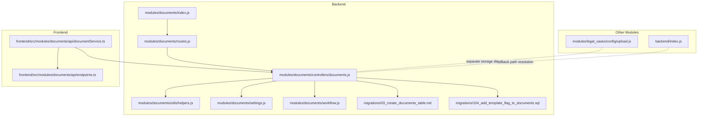
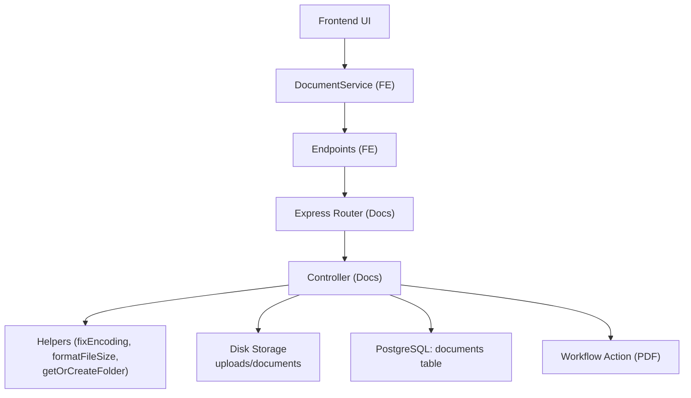
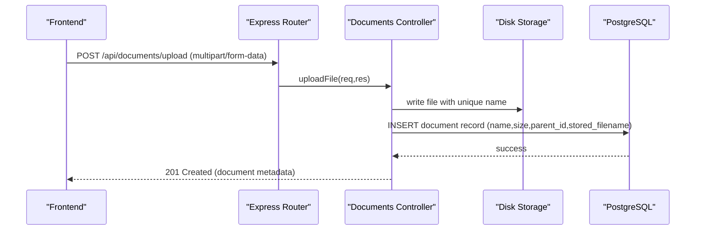
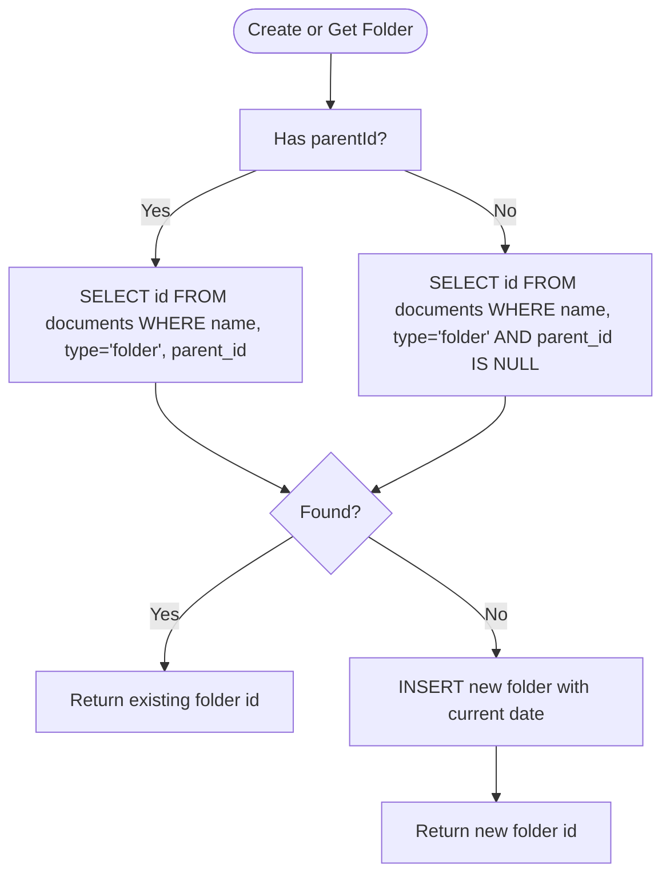
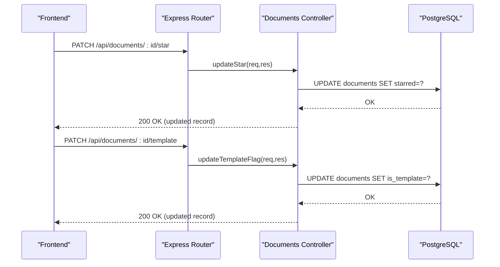
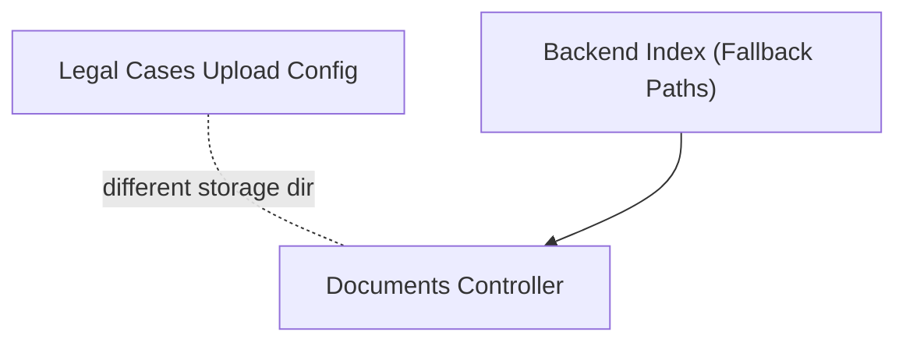
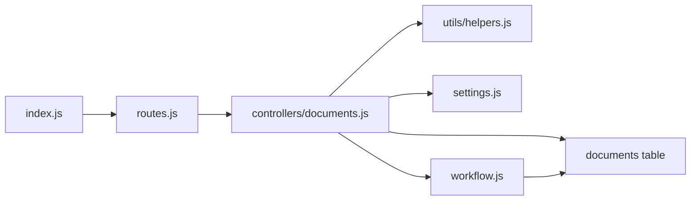

# Documents Module

> 📄 **Синхронизировано** с [docs/modules/documents.md](../../docs/modules/documents.md) — актуальная компактная спецификация модуля (рус.). Ниже — подробный англоязычный разбор с исходниками и диаграммами.

<cite>
**Referenced Files in This Document**
- [backend/modules/documents/index.js](file://backend/modules/documents/index.js)
- [backend/modules/documents/routes.js](file://backend/modules/documents/routes.js)
- [backend/modules/documents/controllers/documents.js](file://backend/modules/documents/controllers/documents.js)
- [backend/modules/documents/utils/helpers.js](file://backend/modules/documents/utils/helpers.js)
- [backend/modules/documents/settings.js](file://backend/modules/documents/settings.js)
- [backend/modules/documents/workflow.js](file://backend/modules/documents/workflow.js)
- [backend/migrations/03_create_documents_table.md](file://backend/migrations/03_create_documents_table.md)
- [backend/migrations/104_add_template_flag_to_documents.sql](file://backend/migrations/104_add_template_flag_to_documents.sql)
- [backend/modules/legal_cases/config/upload.js](file://backend/modules/legal_cases/config/upload.js)
- [backend/index.js](file://backend/index.js)
- [frontend/src/modules/documents/api/documentService.ts](file://frontend/src/modules/documents/api/documentService.ts)
- [frontend/src/modules/documents/api/endpoints.ts](file://frontend/src/modules/documents/api/endpoints.ts)
</cite>

## Table of Contents
1. [Introduction](#introduction)
2. [Project Structure](#project-structure)
3. [Core Components](#core-components)
4. [Architecture Overview](#architecture-overview)
5. [Detailed Component Analysis](#detailed-component-analysis)
6. [Dependency Analysis](#dependency-analysis)
7. [Performance Considerations](#performance-considerations)
8. [Troubleshooting Guide](#troubleshooting-guide)
9. [Conclusion](#conclusion)
10. [Appendices](#appendices)

## Introduction
The Documents module provides a complete file management system for the CRM, enabling users to upload, organize, share, and manage documents and folders. It supports hierarchical folder organization, basic metadata (favorites, templates), and integrates with workflows to generate PDFs programmatically. The module also exposes endpoints for sharing and downloading files, and includes utilities for encoding normalization and folder creation.

## Project Structure
The Documents module is organized into a standard Express-based backend with a controller, routes, settings, utilities, and workflow actions. Frontend integration is handled via a service that consumes the backend endpoints.

**Diagram sources**
- [backend/modules/documents/index.js:1-14](file://backend/modules/documents/index.js#L1-L13)
- [backend/modules/documents/routes.js:1-15](file://backend/modules/documents/routes.js#L1-L14)
- [backend/modules/documents/controllers/documents.js:1-275](file://backend/modules/documents/controllers/documents.js#L1-L275)
- [backend/modules/documents/utils/helpers.js:1-79](file://backend/modules/documents/utils/helpers.js#L1-L79)
- [backend/modules/documents/settings.js:1-28](file://backend/modules/documents/settings.js#L1-L28)
- [backend/modules/documents/workflow.js:1-113](file://backend/modules/documents/workflow.js#L1-L110)
- [backend/migrations/03_create_documents_table.md:1-38](file://backend/migrations/03_create_documents_table.md#L1-L38)
- [backend/migrations/104_add_template_flag_to_documents.sql:1-7](file://backend/migrations/104_add_template_flag_to_documents.sql#L1-L6)
- [backend/modules/legal_cases/config/upload.js:1-54](file://backend/modules/legal_cases/config/upload.js#L1-L53)
- [backend/index.js:60-80](file://backend/index.js#L39)
- [frontend/src/modules/documents/api/documentService.ts:1-58](file://frontend/src/modules/documents/api/documentService.ts#L1-L58)
- [frontend/src/modules/documents/api/endpoints.ts:1-6](file://frontend/src/modules/documents/api/endpoints.ts#L1-L6)

**Section sources**
- [backend/modules/documents/index.js:1-14](file://backend/modules/documents/index.js#L1-L13)
- [backend/modules/documents/routes.js:1-15](file://backend/modules/documents/routes.js#L1-L14)
- [backend/modules/documents/controllers/documents.js:1-275](file://backend/modules/documents/controllers/documents.js#L1-L275)
- [backend/modules/documents/utils/helpers.js:1-79](file://backend/modules/documents/utils/helpers.js#L1-L79)
- [backend/modules/documents/settings.js:1-28](file://backend/modules/documents/settings.js#L1-L28)
- [backend/modules/documents/workflow.js:1-113](file://backend/modules/documents/workflow.js#L1-L110)
- [backend/migrations/03_create_documents_table.md:1-38](file://backend/migrations/03_create_documents_table.md#L1-L38)
- [backend/migrations/104_add_template_flag_to_documents.sql:1-7](file://backend/migrations/104_add_template_flag_to_documents.sql#L1-L6)
- [backend/modules/legal_cases/config/upload.js:1-54](file://backend/modules/legal_cases/config/upload.js#L1-L53)
- [backend/index.js:60-80](file://backend/index.js#L39)
- [frontend/src/modules/documents/api/documentService.ts:1-58](file://frontend/src/modules/documents/api/documentService.ts#L1-L58)
- [frontend/src/modules/documents/api/endpoints.ts:1-6](file://frontend/src/modules/documents/api/endpoints.ts#L1-L6)

## Core Components
- Module entry and routing: Exposes the Express router and module prefix for API endpoints.
- Routes: Mounts the documents controller under the module prefix.
- Controller: Implements CRUD-like operations for documents and folders, file upload/download, starring, templating, deletion, and sharing.
- Utilities: Provides encoding normalization, file size formatting, and folder creation helpers.
- Settings: Defines UI defaults, feature flags, and upload constraints.
- Workflow: Adds a PDF generation action that can optionally persist generated PDFs into the Documents module.

Key capabilities:
- Folder hierarchy via parent_id with self-referential foreign key.
- File storage on disk with randomized filenames and optional stored_filename mirroring for easy access.
- Metadata flags: starred and is_template.
- Sharing via generated URLs using the configured API base URL.

**Section sources**
- [backend/modules/documents/index.js:1-14](file://backend/modules/documents/index.js#L1-L13)
- [backend/modules/documents/routes.js:1-15](file://backend/modules/documents/routes.js#L1-L14)
- [backend/modules/documents/controllers/documents.js:56-275](file://backend/modules/documents/controllers/documents.js#L56-L275)
- [backend/modules/documents/utils/helpers.js:31-79](file://backend/modules/documents/utils/helpers.js#L31-L79)
- [backend/modules/documents/settings.js:5-28](file://backend/modules/documents/settings.js#L5-L28)
- [backend/modules/documents/workflow.js:15-113](file://backend/modules/documents/workflow.js#L15-L110)

## Architecture Overview
The module follows a layered architecture:
- Presentation: Frontend service calls backend endpoints.
- Routing: Express router delegates to controller functions.
- Controller: Handles requests, interacts with storage and database, and returns standardized responses.
- Persistence: Uses a relational table for documents and folders with optional foreign keys and indexes.
- Utilities: Shared helpers for encoding, formatting, and folder creation.
- Workflows: Optional PDF generation action integrated into the workflow engine.

**Diagram sources**
- [frontend/src/modules/documents/api/documentService.ts:1-58](file://frontend/src/modules/documents/api/documentService.ts#L1-L58)
- [frontend/src/modules/documents/api/endpoints.ts:1-6](file://frontend/src/modules/documents/api/endpoints.ts#L1-L6)
- [backend/modules/documents/routes.js:1-15](file://backend/modules/documents/routes.js#L1-L14)
- [backend/modules/documents/controllers/documents.js:1-275](file://backend/modules/documents/controllers/documents.js#L1-L275)
- [backend/modules/documents/utils/helpers.js:1-79](file://backend/modules/documents/utils/helpers.js#L1-L79)
- [backend/modules/documents/workflow.js:1-113](file://backend/modules/documents/workflow.js#L1-L110)

## Detailed Component Analysis

### File Management and Storage
- Upload handling:
  - Uses Multer with disk storage targeting a dedicated directory.
  - Generates unique filenames and preserves original names in the database.
  - Applies a 100 MB file size limit and accepts all types by default.
  - On successful upload, persists metadata (name, size, date, parent_id, stored_filename) to the database.
  - On error, attempts to clean up the temporary file on disk.
- Download handling:
  - Validates existence and type (rejects folders).
  - Supports ASCII and non-ASCII filenames with appropriate headers for streaming.
- Deletion:
  - Bulk delete by IDs.
- Sharing:
  - Constructs a shareable URL using the configured API base URL.

**Diagram sources**
- [backend/modules/documents/controllers/documents.js:93-139](file://backend/modules/documents/controllers/documents.js#L93-L139)
- [backend/modules/documents/routes.js:267](file://backend/modules/documents/routes.js#L14)
- [backend/modules/documents/settings.js:20-23](file://backend/modules/documents/settings.js#L20-L23)

**Section sources**
- [backend/modules/documents/controllers/documents.js:18-54](file://backend/modules/documents/controllers/documents.js#L18-L54)
- [backend/modules/documents/controllers/documents.js:93-139](file://backend/modules/documents/controllers/documents.js#L93-L139)
- [backend/modules/documents/controllers/documents.js:188-226](file://backend/modules/documents/controllers/documents.js#L188-L226)
- [backend/modules/documents/controllers/documents.js:232-250](file://backend/modules/documents/controllers/documents.js#L232-L250)
- [backend/modules/documents/settings.js:20-23](file://backend/modules/documents/settings.js#L20-L23)

### Folder Organization and Hierarchy
- Folders are represented as records with type set to folder and optional parent_id.
- Self-referential foreign key constraint enables hierarchical organization.
- Helper utility can create or reuse a folder by name and parent.

**Diagram sources**
- [backend/modules/documents/utils/helpers.js:50-72](file://backend/modules/documents/utils/helpers.js#L50-L72)
- [backend/migrations/03_create_documents_table.md:18-22](file://backend/migrations/03_create_documents_table.md#L18-L22)

**Section sources**
- [backend/modules/documents/utils/helpers.js:50-72](file://backend/modules/documents/utils/helpers.js#L50-L72)
- [backend/migrations/03_create_documents_table.md:18-22](file://backend/migrations/03_create_documents_table.md#L18-L22)

### Metadata and Flags
- Starred flag: Toggle favorite status per document.
- Template flag: Mark documents as templates for workflow automation.
- Stored filename: Mirrors the on-disk filename for efficient lookup.

**Diagram sources**
- [backend/modules/documents/controllers/documents.js:145-167](file://backend/modules/documents/controllers/documents.js#L145-L167)
- [backend/migrations/104_add_template_flag_to_documents.sql:4-6](file://backend/migrations/104_add_template_flag_to_documents.sql#L4-L6)

**Section sources**
- [backend/modules/documents/controllers/documents.js:145-167](file://backend/modules/documents/controllers/documents.js#L145-L167)
- [backend/migrations/104_add_template_flag_to_documents.sql:4-6](file://backend/migrations/104_add_template_flag_to_documents.sql#L4-L6)

### Version Control and Change History
- Current implementation does not include explicit version control or revision tracking for documents.
- No separate audit trail or change history table is present for the documents module.
- The workflow action can generate and optionally store PDFs, but this is not a document versioning mechanism.

Recommendation:
- Introduce a document_versions table with foreign key to documents.id, storing previous content hashes, timestamps, and user IDs to enable true versioning and diffing.

**Section sources**
- [backend/migrations/03_create_documents_table.md:1-38](file://backend/migrations/03_create_documents_table.md#L1-L38)
- [backend/modules/documents/workflow.js:70-95](file://backend/modules/documents/workflow.js#L70-L95)

### Search and Retrieval
- Basic listing and filtering:
  - List all documents ordered by date.
  - Frontend service supports fetching by parentId for hierarchical browsing.
- No full-text search or metadata indexing is implemented in the backend for the documents module.
- Recommendations:
  - Add indexes on frequently queried columns (e.g., name, type, parent_id).
  - Consider PostgreSQL full-text search capabilities for richer queries.

**Section sources**
- [backend/modules/documents/controllers/documents.js:60-63](file://backend/modules/documents/controllers/documents.js#L60-L63)
- [frontend/src/modules/documents/api/documentService.ts:10-21](file://frontend/src/modules/documents/api/documentService.ts#L10-L21)

### Integration with Other Modules
- Legal Cases module uses its own upload configuration and storage directory, separate from the Documents module.
- Backend index includes fallback logic to serve files from the legacy documents directory if needed.
- The Documents module does not currently expose a generic “attach to entity” endpoint; integration would require extending the controller to accept target entity references.

**Diagram sources**
- [backend/modules/legal_cases/config/upload.js:1-54](file://backend/modules/legal_cases/config/upload.js#L1-L53)
- [backend/index.js:67-72](file://backend/index.js#L39)
- [backend/modules/documents/controllers/documents.js:18-22](file://backend/modules/documents/controllers/documents.js#L18-L22)

**Section sources**
- [backend/modules/legal_cases/config/upload.js:1-54](file://backend/modules/legal_cases/config/upload.js#L1-L53)
- [backend/index.js:67-72](file://backend/index.js#L39)

### Practical Examples

#### Example 1: Document Upload Workflow
- Frontend composes multipart/form-data with file and optional parentId.
- Backend validates upload, writes to disk, and inserts a record with stored_filename.
- On success, returns the created document metadata.

**Section sources**
- [frontend/src/modules/documents/api/documentService.ts:28-36](file://frontend/src/modules/documents/api/documentService.ts#L28-L36)
- [backend/modules/documents/controllers/documents.js:93-139](file://backend/modules/documents/controllers/documents.js#L93-L139)

#### Example 2: Version Comparison (Proposed)
- Store previous versions in a document_versions table with content hash and timestamp.
- Compare two versions by hashing stored content and presenting differences.

[No sources needed since this section proposes a future enhancement]

#### Example 3: Document Search Scenario
- Use parentId query parameter to browse nested folders.
- Extend with name filtering and pagination for large datasets.

**Section sources**
- [frontend/src/modules/documents/api/documentService.ts:10-16](file://frontend/src/modules/documents/api/documentService.ts#L10-L16)

## Dependency Analysis
- Internal dependencies:
  - index.js depends on routes.js and settings.js.
  - routes.js depends on the controller.
  - controller depends on helpers, settings, database, and filesystem.
  - workflow depends on helpers and database.
- External dependencies:
  - Multer for file uploads.
  - pdfmake for PDF generation in workflow.
- Database schema:
  - documents table with self-referential parent_id and indexes.
  - Additional columns added by migration for template support.

**Diagram sources**
- [backend/modules/documents/index.js:6-12](file://backend/modules/documents/index.js#L6-L12)
- [backend/modules/documents/routes.js:9](file://backend/modules/documents/routes.js#L9)
- [backend/modules/documents/controllers/documents.js:12-16](file://backend/modules/documents/controllers/documents.js#L12-L16)
- [backend/modules/documents/workflow.js:1-3](file://backend/modules/documents/workflow.js#L1-L3)
- [backend/migrations/03_create_documents_table.md:8-22](file://backend/migrations/03_create_documents_table.md#L8-L22)

**Section sources**
- [backend/modules/documents/index.js:6-12](file://backend/modules/documents/index.js#L6-L12)
- [backend/modules/documents/routes.js:9](file://backend/modules/documents/routes.js#L9)
- [backend/modules/documents/controllers/documents.js:12-16](file://backend/modules/documents/controllers/documents.js#L12-L16)
- [backend/modules/documents/workflow.js:1-3](file://backend/modules/documents/workflow.js#L1-L3)
- [backend/migrations/03_create_documents_table.md:8-22](file://backend/migrations/03_create_documents_table.md#L8-L22)

## Performance Considerations
- File size limits: Enforced at the upload level to prevent oversized payloads.
- Disk I/O: Unique filenames reduce collisions; ensure adequate disk space and consider retention policies.
- Database queries: Add indexes on parent_id and name for improved folder traversal and search performance.
- Streaming downloads: Non-ASCII filenames are streamed to avoid header encoding issues.

[No sources needed since this section provides general guidance]

## Troubleshooting Guide
- Upload failures:
  - Validate file size and type constraints.
  - Check disk permissions and available space.
  - Inspect error logs for Multer-specific errors.
- Download failures:
  - Confirm the record exists and is not a folder.
  - Verify stored_filename and physical file presence.
- Encoding issues:
  - Utilize the built-in encoding fix utility for non-ASCII filenames.
- Sharing failures:
  - Ensure API_URL environment variable is configured.

**Section sources**
- [backend/modules/documents/controllers/documents.js:115-139](file://backend/modules/documents/controllers/documents.js#L115-L139)
- [backend/modules/documents/controllers/documents.js:205-207](file://backend/modules/documents/controllers/documents.js#L205-L207)
- [backend/modules/documents/utils/helpers.js:8-29](file://backend/modules/documents/utils/helpers.js#L8-L29)
- [backend/modules/documents/controllers/documents.js:241-246](file://backend/modules/documents/controllers/documents.js#L241-L246)

## Conclusion
The Documents module offers a robust foundation for file management with folder hierarchy, flexible upload/download, and workflow-driven PDF generation. While it currently lacks explicit version control and advanced search, the modular design allows for straightforward enhancements such as a versioning table, metadata indexing, and cross-module attachment APIs.

## Appendices

### API Endpoints Overview
- GET /api/documents/ — List all documents
- POST /api/documents/folder — Create a folder
- POST /api/documents/upload — Upload a file
- PATCH /api/documents/:id/star — Toggle starred
- PATCH /api/documents/:id/template — Toggle template flag
- POST /api/documents/delete — Delete documents by IDs
- GET /api/documents/download/:id — Download a file
- GET /api/documents/share/:id — Generate shareable URL

**Section sources**
- [backend/modules/documents/controllers/documents.js:265-272](file://backend/modules/documents/controllers/documents.js#L265-L272)

### Database Schema Highlights
- documents table supports both files and folders with hierarchical parent_id.
- Optional foreign key and index improve referential integrity and query performance.
- Additional columns for template flag and stored filename enhance workflow integration.

**Section sources**
- [backend/migrations/03_create_documents_table.md:8-22](file://backend/migrations/03_create_documents_table.md#L8-L22)
- [backend/migrations/104_add_template_flag_to_documents.sql:4-6](file://backend/migrations/104_add_template_flag_to_documents.sql#L4-L6)