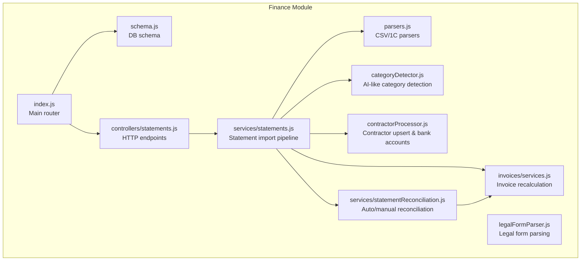
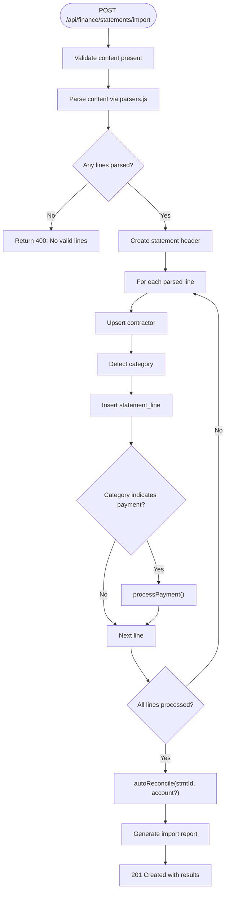
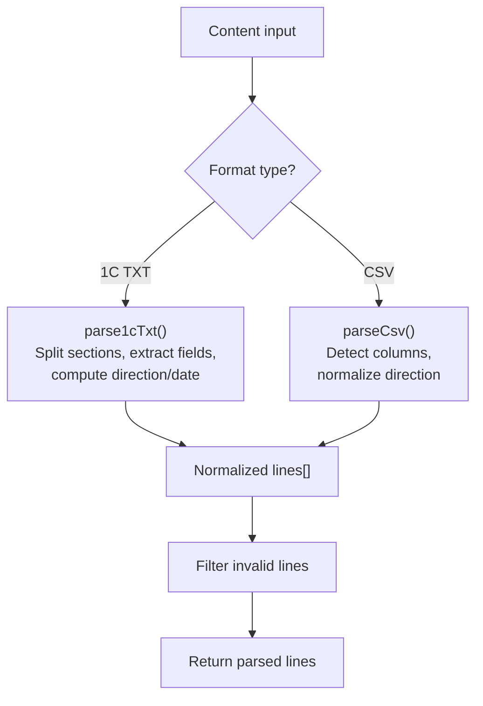
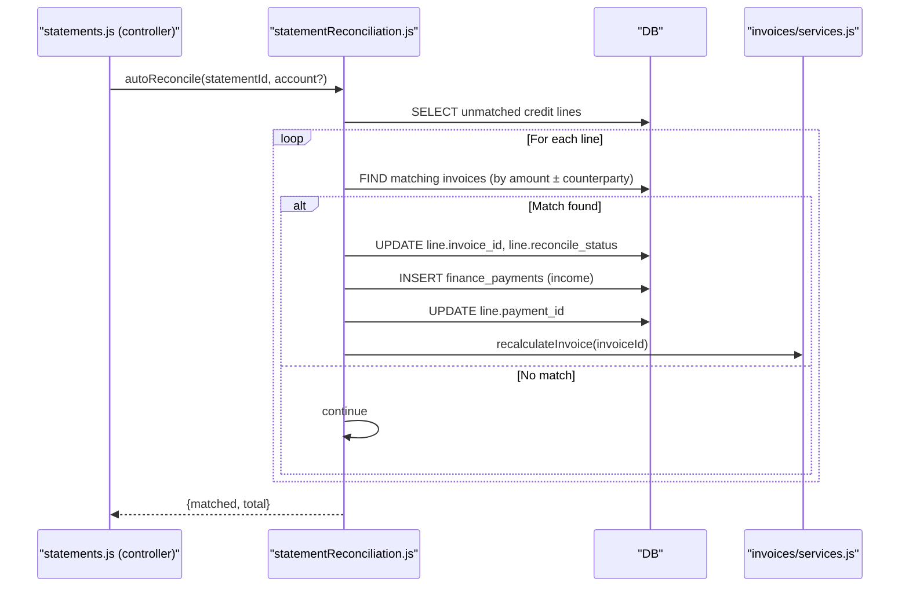
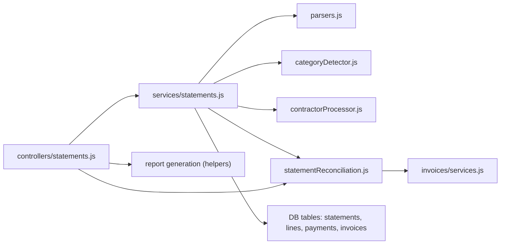

# Bank Statements Processing

<cite>
**Referenced Files in This Document**
- [controllers/statements.js](file://backend/modules/finance/controllers/statements.js)
- [services/statements.js](file://backend/modules/finance/services/statements.js)
- [parsers.js](file://backend/modules/finance/parsers.js)
- [services/statementReconciliation.js](file://backend/modules/finance/services/statementReconciliation.js)
- [statementHelpers/categoryDetector.js](file://backend/modules/finance/statementHelpers/categoryDetector.js)
- [statementHelpers/contractorProcessor.js](file://backend/modules/finance/statementHelpers/contractorProcessor.js)
- [statementHelpers/legalFormParser.js](file://backend/modules/finance/statementHelpers/legalFormParser.js)
- [schema.js](file://backend/modules/finance/schema.js)
- [index.js](file://backend/modules/finance/index.js)
- [utils.js](file://backend/modules/finance/utils.js)
- [reconciliation.js](file://backend/modules/finance/reconciliation.js)
- [STATEMENTS_IMPORT_GUIDE.md](file://docs/backend/STATEMENTS_IMPORT_GUIDE.md)
- [test-import-statement.js](file://backend/tests/test-import-statement.js)
</cite>

## Table of Contents
1. [Introduction](#introduction)
2. [Project Structure](#project-structure)
3. [Core Components](#core-components)
4. [Architecture Overview](#architecture-overview)
5. [Detailed Component Analysis](#detailed-component-analysis)
6. [Dependency Analysis](#dependency-analysis)
7. [Performance Considerations](#performance-considerations)
8. [Troubleshooting Guide](#troubleshooting-guide)
9. [Conclusion](#conclusion)
10. [Appendices](#appendices)

## Introduction
This document explains the Bank Statement Processing module in the Titan CRM backend. It covers supported file formats, parsing algorithms, validation, reconciliation workflows, category assignment, contractor identification, and integration with payments and invoices. It also documents the statement processing API endpoints, helper utilities, and practical examples.

## Project Structure
The Finance module organizes statement processing under dedicated controllers, services, parsers, and helpers. The module initializes database schemas and exposes routes via a central router.



**Diagram sources**
- [index.js:1-55](file://backend/modules/finance/index.js#L1-L55)
- [schema.js:142-196](file://backend/modules/finance/schema.js#L142-L196)
- [parsers.js:1-251](file://backend/modules/finance/parsers.js#L1-L207)
- [statementHelpers/categoryDetector.js:1-69](file://backend/modules/finance/statementHelpers/categoryDetector.js#L1-L68)
- [statementHelpers/contractorProcessor.js:1-193](file://backend/modules/finance/statementHelpers/contractorProcessor.js#L1-L192)
- [statementHelpers/legalFormParser.js:1-84](file://backend/modules/finance/statementHelpers/legalFormParser.js#L1-L83)
- [services/statements.js:1-342](file://backend/modules/finance/services/statements.js#L1-L92)
- [services/statementReconciliation.js:1-363](file://backend/modules/finance/services/statementReconciliation.js#L1-L116)

**Section sources**
- [index.js:1-55](file://backend/modules/finance/index.js#L1-L55)
- [schema.js:142-196](file://backend/modules/finance/schema.js#L142-L196)

## Core Components
- Controllers: Expose HTTP endpoints for importing statements, retrieving lines, reconciling, assigning lines manually, and deleting statements.
- Services: Implement the core business logic for parsing, creating statements, processing lines, detecting categories, upserting contractors, and reconciliation.
- Parsers: Parse 1C ClientBank Exchange (.txt) and CSV formats into normalized line objects.
- Helpers: Detect categories, process contractors and legal forms, and generate import reports.
- Schema: Defines tables for statements, statement lines, payments, invoices, and categories.

**Section sources**
- [controllers/statements.js:1-207](file://backend/modules/finance/controllers/statements/index.js#L1-L22)
- [services/statements.js:1-342](file://backend/modules/finance/services/statements.js#L1-L92)
- [parsers.js:1-251](file://backend/modules/finance/parsers.js#L1-L207)
- [statementHelpers/categoryDetector.js:1-69](file://backend/modules/finance/statementHelpers/categoryDetector.js#L1-L68)
- [statementHelpers/contractorProcessor.js:1-193](file://backend/modules/finance/statementHelpers/contractorProcessor.js#L1-L192)
- [statementHelpers/legalFormParser.js:1-84](file://backend/modules/finance/statementHelpers/legalFormParser.js#L1-L83)
- [schema.js:142-196](file://backend/modules/finance/schema.js#L142-L196)

## Architecture Overview
The system supports two import modes:
- API import: POST /api/finance/statements/import parses content, creates statement records, processes lines, reconciles automatically, and generates a report.
- Direct script import: Uses backend scripts to bypass the server for batch processing.

```mermaid
sequenceDiagram
participant Client as "Client"
participant Ctrl as "statements.js (controller)"
participant Svc as "statements.js (service)"
participant Par as "parsers.js"
participant Cat as "categoryDetector.js"
participant Cp as "contractorProcessor.js"
participant Rec as "statementReconciliation.js"
participant DB as "DB"
Client->>Ctrl : POST /api/finance/statements/import
Ctrl->>Par : parseStatementContent(content, importType)
Par-->>Ctrl : parsedLines[]
Ctrl->>Svc : createStatement(stmtMeta, userId)
Svc->>DB : INSERT finance_bank_statements
loop For each parsed line
Ctrl->>Svc : processStatementLine(line, stmtId, userId)
Svc->>Cp : upsertContractor(line)
Cp->>DB : UPSERT contractors + bank accounts
Svc->>Cat : detectCategory(purpose, direction, counterparty)
Svc->>DB : INSERT finance_statement_lines
alt Category indicates payment creation
Svc->>Svc : processPayment(line, contractorId, lineId, userId)
Svc->>DB : INSERT/Link finance_payments
end
end
Ctrl->>Rec : autoReconcile(stmtId, account?)
Rec->>DB : MATCH invoices + INSERT payments
Rec->>Svc : recalculateInvoice(invoiceId)
Svc-->>Ctrl : import report
Ctrl-->>Client : 201 Created with results
```

**Diagram sources**
- [controllers/statements.js:45-150](file://backend/modules/finance/controllers/statements/index.js#L1-L22)
- [services/statements.js:138-319](file://backend/modules/finance/services/statements.js#L92)
- [parsers.js:84-248](file://backend/modules/finance/parsers.js#L84-L207)
- [statementHelpers/categoryDetector.js:13-64](file://backend/modules/finance/statementHelpers/categoryDetector.js#L13-L64)
- [statementHelpers/contractorProcessor.js:32-187](file://backend/modules/finance/statementHelpers/contractorProcessor.js#L32-L187)
- [services/statementReconciliation.js:16-109](file://backend/modules/finance/services/statementReconciliation.js#L16-L109)

## Detailed Component Analysis

### Statement Import Workflow
- Endpoint: POST /api/finance/statements/import
- Behavior:
  - Validates presence of content.
  - Parses content using CSV or 1C TXT parser.
  - Creates a statement header record.
  - Processes each line to upsert contractor, detect category, insert statement line, and optionally create/link payments.
  - Runs automatic reconciliation against invoices.
  - Generates an import report with counts and warnings.



**Diagram sources**
- [controllers/statements.js:45-150](file://backend/modules/finance/controllers/statements/index.js#L1-L22)
- [services/statements.js:138-319](file://backend/modules/finance/services/statements.js#L92)
- [parsers.js:84-248](file://backend/modules/finance/parsers.js#L84-L207)
- [services/statementReconciliation.js:16-109](file://backend/modules/finance/services/statementReconciliation.js#L16-L109)

**Section sources**
- [controllers/statements.js:45-150](file://backend/modules/finance/controllers/statements/index.js#L1-L22)
- [services/statements.js:65-129](file://backend/modules/finance/services/statements.js#L65-L92)
- [parsers.js:84-248](file://backend/modules/finance/parsers.js#L84-L207)

### File Format Support and Parsing
- Supported formats:
  - 1C ClientBank Exchange (.txt): Parses structured sections, extracts payer/recipients, amounts, dates, purpose, and reference. Normalizes direction and computes VAT info from purpose.
  - CSV: Flexible column detection for date, amount, direction, counterparty, purpose, and reference.
- Validation:
  - Filters invalid lines missing date or amount.
  - Extracts VAT patterns from purpose for credit entries.



**Diagram sources**
- [parsers.js:84-248](file://backend/modules/finance/parsers.js#L84-L207)

**Section sources**
- [parsers.js:84-248](file://backend/modules/finance/parsers.js#L84-L207)

### Data Validation and Duplicate Prevention
- Payment uniqueness:
  - Checks existing payments by amount, payment_date, contractor_id (nullable), and kind (income/expense).
  - Prevents duplicate creation; links existing payment to the statement line.
- VAT extraction:
  - Detects VAT rate and amount from purpose text patterns; marks zero-VAT cases explicitly.
- Contractor validation:
  - Warns on potential name conflicts when INN differs.
  - Updates contractor fields only when missing or beneficial.

**Section sources**
- [services/statements.js:204-319](file://backend/modules/finance/services/statements.js#L92)
- [parsers.js:49-77](file://backend/modules/finance/parsers.js#L49-L77)
- [statementHelpers/contractorProcessor.js:53-127](file://backend/modules/finance/statementHelpers/contractorProcessor.js#L53-L127)

### Statement Reconciliation
- Automatic reconciliation:
  - Matches credit lines to outstanding invoices by amount and optional counterparty.
  - Creates income payments and links both line and invoice.
  - Updates statement status to reconciled when no unmatched lines remain.
- Manual reconciliation:
  - Assign line to an invoice or category; creates payments accordingly.
  - Handles unlinking, re-linking, and updating payments when invoice changes.



**Diagram sources**
- [services/statementReconciliation.js:16-109](file://backend/modules/finance/services/statementReconciliation.js#L16-L109)

**Section sources**
- [services/statementReconciliation.js:16-109](file://backend/modules/finance/services/statementReconciliation.js#L16-L109)
- [controllers/statements.js:156-162](file://backend/modules/finance/controllers/statements/index.js#L1-L22)

### Category Detection and Assignment
- Categories are inferred from purpose text and direction:
  - Income: “payment for services”, “advance”, “prepayment” → client income; otherwise other income.
  - Expenses: Taxes, salary, rent, purchases, other; special handling for revaluation/currency differences.
- Integration:
  - Automatically sets category_id on statement lines during import.
  - Manual override via PUT /api/finance/statements/lines/:lineId allows setting category or unlinking.

**Section sources**
- [statementHelpers/categoryDetector.js:13-64](file://backend/modules/finance/statementHelpers/categoryDetector.js#L13-L64)
- [services/statements.js:156-158](file://backend/modules/finance/services/statements.js#L92)
- [controllers/statements.js:168-187](file://backend/modules/finance/controllers/statements/index.js#L1-L22)

### Contractor Identification and Legal Form Parsing
- Legal form detection:
  - Recognizes IP, LLC/OOO, self-employed, and government entities from full names.
- Name normalization:
  - Shortens legal entity names to standardized abbreviations.
- Type detection:
  - Determines individual vs company based on legal form and INN length.
- Upsert logic:
  - Searches by INN first; falls back to name matching.
  - Updates KPP/full name/legal form only when missing.
  - Adds bank accounts per contractor with deduplication.

**Section sources**
- [statementHelpers/legalFormParser.js:11-77](file://backend/modules/finance/statementHelpers/legalFormParser.js#L11-L77)
- [statementHelpers/contractorProcessor.js:32-187](file://backend/modules/finance/statementHelpers/contractorProcessor.js#L32-L187)

### Statement Processing API Endpoints
- GET /api/finance/statements
- GET /api/finance/statements/:id/lines
- POST /api/finance/statements/import
- POST /api/finance/statements/:id/reconcile
- PUT /api/finance/statements/lines/:lineId
- DELETE /api/finance/statements/:id

Response helpers and async handler are used across endpoints for consistent error handling and status codes.

**Section sources**
- [controllers/statements.js:198-207](file://backend/modules/finance/controllers/statements/index.js#L1-L22)

### Integration with Payments and Invoices
- Payments:
  - Created when category indicates income/expense and amount > 0.
  - Deduplicated by amount, date, contractor, and kind.
  - Linked to statement lines and optionally to invoices.
- Invoices:
  - Recalculated after payment creation or unlinking to update status and balances.
  - Automatic linking via purpose text containing invoice identifiers.

**Section sources**
- [services/statements.js:204-319](file://backend/modules/finance/services/statements.js#L92)
- [services/statementReconciliation.js:292-355](file://backend/modules/finance/services/statementReconciliation.js#L116)

## Dependency Analysis


**Diagram sources**
- [controllers/statements.js:198-207](file://backend/modules/finance/controllers/statements/index.js#L1-L22)
- [services/statements.js:1-342](file://backend/modules/finance/services/statements.js#L1-L92)
- [parsers.js:1-251](file://backend/modules/finance/parsers.js#L1-L207)
- [statementHelpers/categoryDetector.js:1-69](file://backend/modules/finance/statementHelpers/categoryDetector.js#L1-L68)
- [statementHelpers/contractorProcessor.js:1-193](file://backend/modules/finance/statementHelpers/contractorProcessor.js#L1-L192)
- [services/statementReconciliation.js:1-363](file://backend/modules/finance/services/statementReconciliation.js#L1-L116)

**Section sources**
- [index.js:19-39](file://backend/modules/finance/index.js#L19-L39)
- [schema.js:142-196](file://backend/modules/finance/schema.js#L142-L196)

## Performance Considerations
- Batch processing: Prefer direct script import for large volumes to avoid server overhead.
- Indexing: Unique constraint on payments prevents duplicates and speeds up conflict checks.
- Matching: Automatic reconciliation filters unmatched credit lines and limits invoice search scope.
- Logging: Extensive logging aids performance diagnostics and operational monitoring.

[No sources needed since this section provides general guidance]

## Troubleshooting Guide
Common issues and resolutions:
- “No valid lines parsed from file”: Verify 1C TXT contains proper sections and correct encoding; ensure CSV headers match expectations.
- “Duplicate payment skipped”: Expected behavior; review import report for duplicates.
- “Unique constraint violation”: Remove duplicates manually or rerun after cleanup.
- Reconciliation not matching: Confirm invoice due amounts and counterparties; use manual assignment endpoint to force matches.

Operational checks:
- Verify statement totals and statuses in finance_bank_statements.
- Count duplicates in finance_payments grouped by amount, date, contractor, kind.
- Review payment statistics by kind.

**Section sources**
- [STATEMENTS_IMPORT_GUIDE.md:163-188](file://docs/backend/STATEMENTS_IMPORT_GUIDE.md#L163-L188)
- [STATEMENTS_IMPORT_GUIDE.md:125-157](file://docs/backend/STATEMENTS_IMPORT_GUIDE.md#L125-L157)

## Conclusion
The Bank Statement Processing module provides robust import, parsing, validation, reconciliation, and categorization capabilities. It integrates seamlessly with contractors, payments, and invoices, ensuring accurate financial tracking and minimal manual intervention. The modular design and clear APIs facilitate extensibility and maintenance.

[No sources needed since this section summarizes without analyzing specific files]

## Appendices

### Practical Examples

- Example: Import CSV with automatic invoice linking
  - Send POST to /api/finance/statements/import with CSV content and account number.
  - System detects payments, creates payments, links invoices, and reconciles automatically.
  - Reference: [controllers/statements.js:45-150](file://backend/modules/finance/controllers/statements/index.js#L1-L22), [services/statements.js:138-319](file://backend/modules/finance/services/statements.js#L92)

- Example: Manual reconciliation
  - Call POST /api/finance/statements/:id/reconcile to auto-match.
  - Or PUT /api/finance/statements/lines/:lineId to assign invoice or category.
  - Reference: [controllers/statements.js:156-187](file://backend/modules/finance/controllers/statements/index.js#L1-L22), [services/statementReconciliation.js:16-109](file://backend/modules/finance/services/statementReconciliation.js#L16-L109)

- Example: Contractor creation and bank account addition
  - During line processing, contractor is upserted and bank account recorded if provided.
  - Reference: [statementHelpers/contractorProcessor.js:32-187](file://backend/modules/finance/statementHelpers/contractorProcessor.js#L32-L187)

- Example: Category assignment scenarios
  - Purpose keywords drive category selection; manual override available.
  - Reference: [statementHelpers/categoryDetector.js:13-64](file://backend/modules/finance/statementHelpers/categoryDetector.js#L13-L64), [controllers/statements.js:168-187](file://backend/modules/finance/controllers/statements/index.js#L1-L22)

- Example: Reconciliation act for a contractor
  - GET /api/finance/reconciliation-act/:contractorId to view invoices and payments.
  - Reference: [reconciliation.js:11-79](file://backend/modules/finance/reconciliation.js#L11-L78)

- Example: Test-driven import verification
  - Automated test validates duplicate prevention, invoice linking, and status recalculation.
  - Reference: [test-import-statement.js:1-88](file://backend/tests/test-import-statement.js#L1-L87)