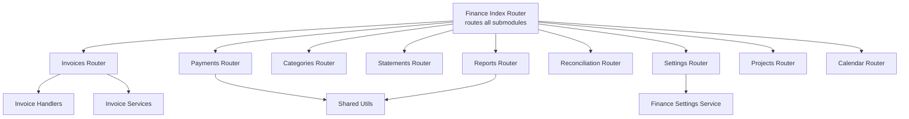
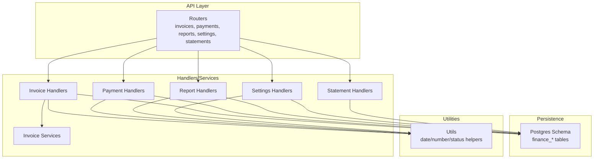
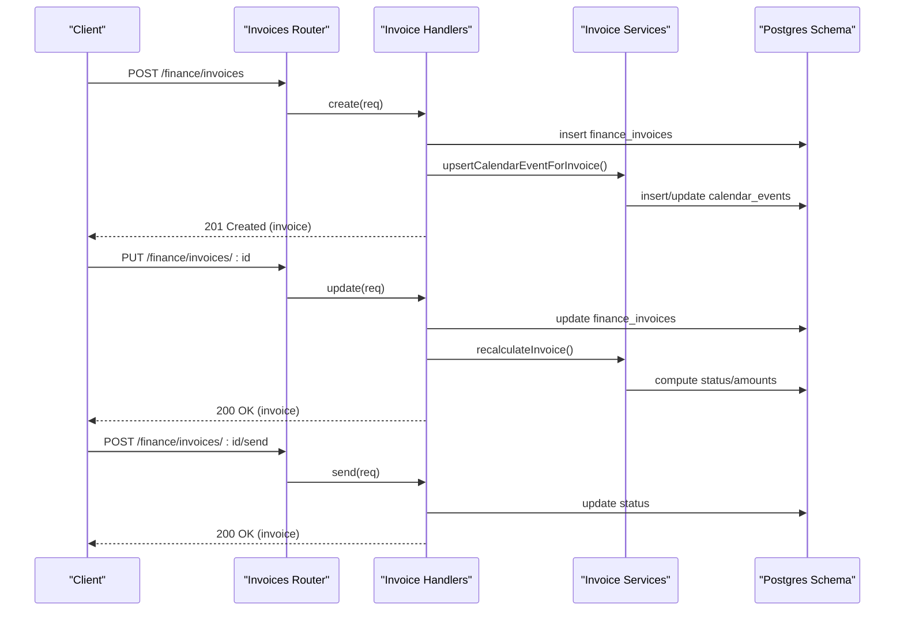
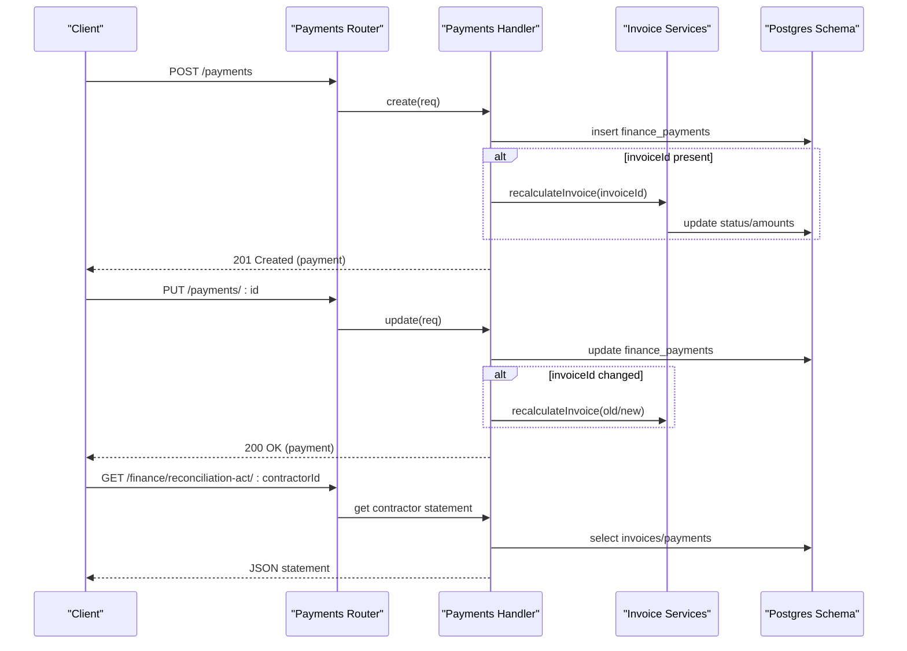
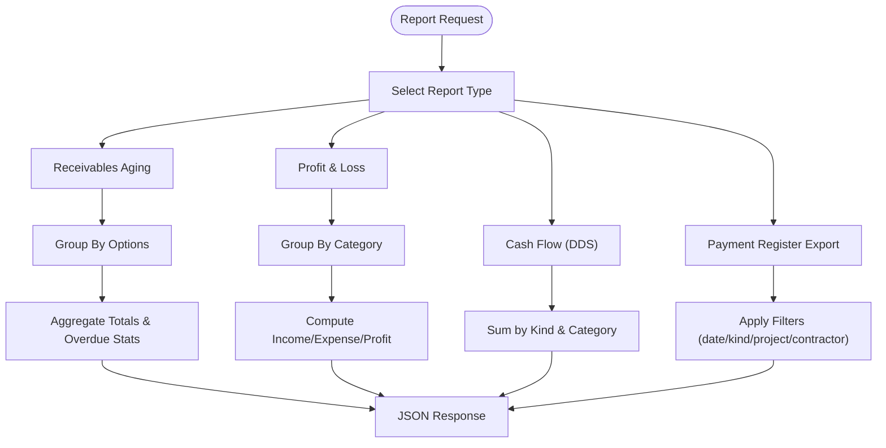
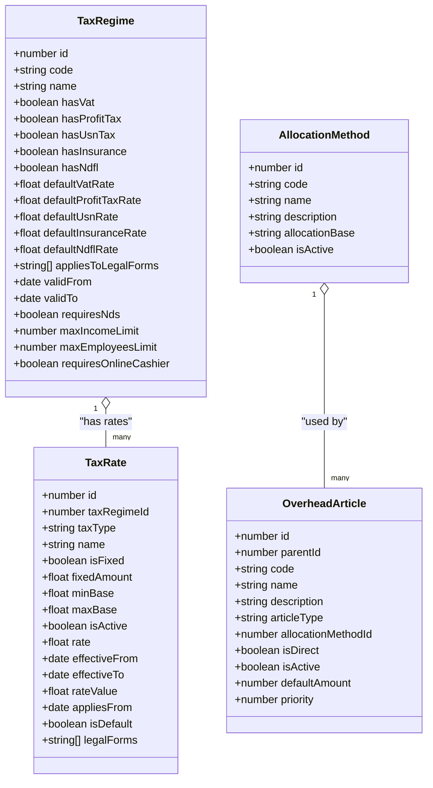
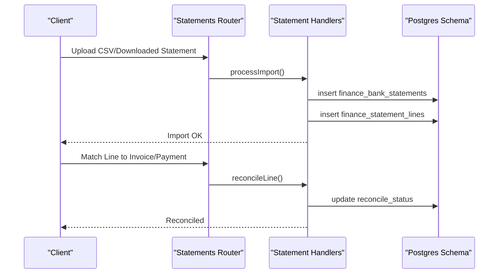
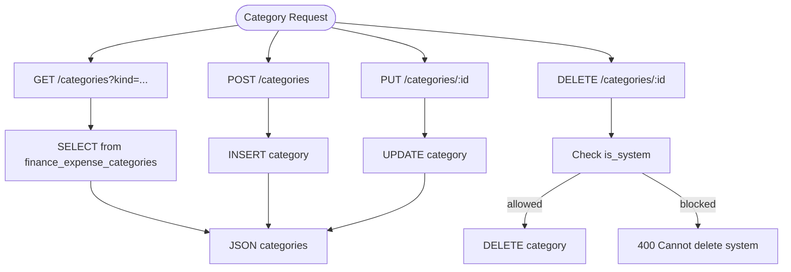
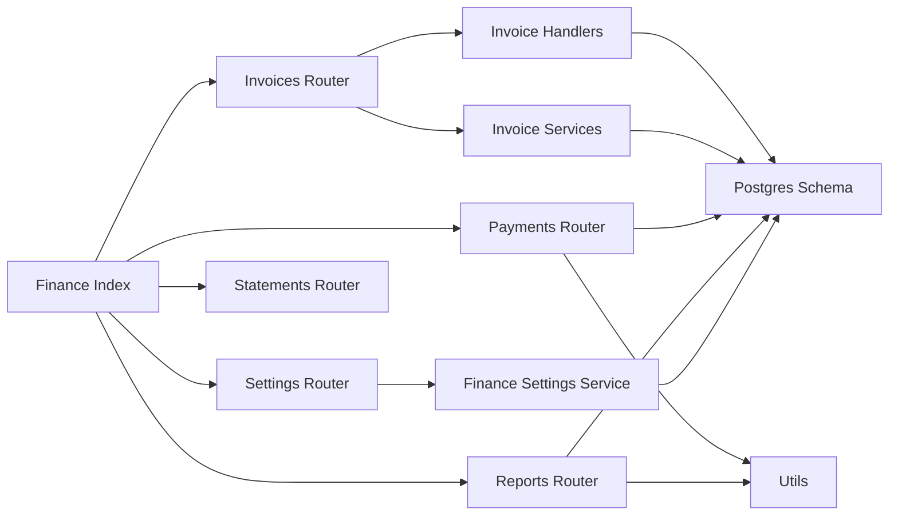
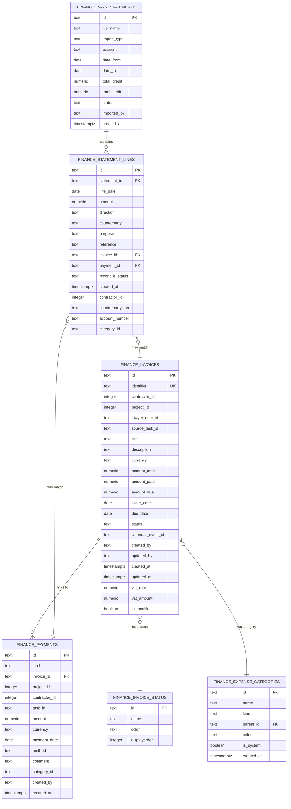

# Finance Module

<cite>
**Referenced Files in This Document**
- [index.js](file://backend/modules/finance/index.js)
- [schema.js](file://backend/modules/finance/schema.js)
- [invoices/index.js](file://backend/modules/finance/invoices/index.js)
- [invoices/handlers.js](file://backend/modules/finance/invoices/handlers.js)
- [invoices/services.js](file://backend/modules/finance/invoices/services.js)
- [payments.js](file://backend/modules/finance/payments.js)
- [reconciliation.js](file://backend/modules/finance/reconciliation.js)
- [reports.js](file://backend/modules/finance/reports.js)
- [categories.js](file://backend/modules/finance/categories.js)
- [settings.js](file://backend/modules/finance/settings.js)
- [statements.js](file://backend/modules/finance/statements.js)
- [utils.js](file://backend/modules/finance/utils.js)
- [financeSettingsService.js](file://backend/modules/finance/services/financeSettingsService.js)
</cite>

## Table of Contents
1. [Introduction](#introduction)
2. [Project Structure](#project-structure)
3. [Core Components](#core-components)
4. [Architecture Overview](#architecture-overview)
5. [Detailed Component Analysis](#detailed-component-analysis)
6. [Dependency Analysis](#dependency-analysis)
7. [Performance Considerations](#performance-considerations)
8. [Troubleshooting Guide](#troubleshooting-guide)
9. [Conclusion](#conclusion)
10. [Appendices](#appendices)

## Introduction
The Finance module provides end-to-end financial management for the CRM, covering:
- Invoicing lifecycle: creation, approval workflows, payment tracking, and status management
- Payment processing: bank statement import, reconciliation, and cash flow tracking
- Financial reporting: receivables, profit & loss, cash flow, and register exports
- Tax compliance: VAT handling, tax regimes, rates, and regulatory reporting
- Integrations: contractor management, project tracking, and accounting systems

## Project Structure
The Finance module is organized around domain-focused submodules under backend/modules/finance:
- Submodule routers: invoices, payments, categories, statements, reports, reconciliation, settings, projects, calendar, workflow
- Shared utilities: date parsing, number conversion, and invoice status computation
- Schema initialization and migration support for finance-related tables
- Controllers and services for settings and statement reconciliation

**Diagram sources**
- [index.js:1-55](file://backend/modules/finance/index.js#L1-L55)
- [invoices/index.js:1-40](file://backend/modules/finance/invoices/index.js#L1-L39)
- [payments.js:1-340](file://backend/modules/finance/payments.js#L1-L7)
- [reports.js:1-221](file://backend/modules/finance/reports.js#L1-L221)
- [settings.js:1-55](file://backend/modules/finance/settings.js#L1-L54)
- [statements.js:1-17](file://backend/modules/finance/statements.js#L1-L16)
- [utils.js:1-102](file://backend/modules/finance/utils.js#L1-L102)
- [financeSettingsService.js:1-800](file://backend/modules/finance/services/financeSettingsService.js#L1-L745)

**Section sources**
- [index.js:1-55](file://backend/modules/finance/index.js#L1-L55)

## Core Components
- Invoice Management: CRUD, status automation, document generation, and calendar reminders
- Payment Processing: creation, linking/unlinking from invoices, bulk updates, and automatic invoice recalculation
- Statement Import and Reconciliation: bank statement header and line records, category mapping, contractor identification, and reconciliation actions
- Financial Reporting: receivables aging, P&L, cash flow (DDS), and payment register exports
- Tax Compliance: tax regimes, tax rates, historical rates, allocation methods, overhead articles, and contractor-specific tax validation
- Category Management: income/expense categories with hierarchical structure and filtering
- Settings API: endpoints for tax regimes, rates, allocation methods, overhead articles, and defaults

**Section sources**
- [invoices/index.js:1-40](file://backend/modules/finance/invoices/index.js#L1-L39)
- [invoices/handlers.js:1-571](file://backend/modules/finance/invoices/handlers.js#L1-L481)
- [payments.js:1-340](file://backend/modules/finance/payments.js#L1-L7)
- [reconciliation.js:1-79](file://backend/modules/finance/reconciliation.js#L1-L78)
- [reports.js:1-221](file://backend/modules/finance/reports.js#L1-L221)
- [categories.js:1-86](file://backend/modules/finance/categories.js#L1-L86)
- [settings.js:1-55](file://backend/modules/finance/settings.js#L1-L54)
- [financeSettingsService.js:1-800](file://backend/modules/finance/services/financeSettingsService.js#L1-L745)

## Architecture Overview
The Finance module follows a layered architecture:
- Router layer: exposes REST endpoints for each submodule
- Handler/service layer: encapsulates business logic and orchestrates database queries
- Persistence layer: Postgres tables initialized via schema.js with strong typing and constraints
- Utilities: shared helpers for dates, numbers, and invoice status derivation

**Diagram sources**
- [index.js:1-55](file://backend/modules/finance/index.js#L1-L55)
- [invoices/handlers.js:1-571](file://backend/modules/finance/invoices/handlers.js#L1-L481)
- [invoices/services.js:1-239](file://backend/modules/finance/invoices/services.js#L1-L239)
- [payments.js:1-340](file://backend/modules/finance/payments.js#L1-L7)
- [reports.js:1-221](file://backend/modules/finance/reports.js#L1-L221)
- [settings.js:1-55](file://backend/modules/finance/settings.js#L1-L54)
- [statements.js:1-17](file://backend/modules/finance/statements.js#L1-L16)
- [utils.js:1-102](file://backend/modules/finance/utils.js#L1-L102)
- [schema.js:1-201](file://backend/modules/finance/schema.js#L1-L200)

## Detailed Component Analysis

### Invoicing System
The invoicing system supports full lifecycle management:
- Creation with automatic numbering, initial status, VAT fields, and optional calendar reminder
- Updates with manual override and automatic status recalculation
- Sending (status update) and document generation (invoice factura/act)
- Bulk updates and deletion with cascade handling
- Status automation based on amounts paid and due date

**Diagram sources**
- [invoices/index.js:18-31](file://backend/modules/finance/invoices/index.js#L18-L31)
- [invoices/handlers.js:62-142](file://backend/modules/finance/invoices/handlers.js#L62-L142)
- [invoices/handlers.js:148-284](file://backend/modules/finance/invoices/handlers.js#L148-L284)
- [invoices/handlers.js:286-330](file://backend/modules/finance/invoices/handlers.js#L286-L330)
- [invoices/services.js:83-133](file://backend/modules/finance/invoices/services.js#L83-L133)

Practical examples:
- Creating an invoice with VAT and generating an act after full payment
- Bulk updating statuses for overdue invoices
- Recalculating status after manual payment adjustments

**Section sources**
- [invoices/index.js:1-40](file://backend/modules/finance/invoices/index.js#L1-L39)
- [invoices/handlers.js:1-571](file://backend/modules/finance/invoices/handlers.js#L1-L481)
- [invoices/services.js:1-239](file://backend/modules/finance/invoices/services.js#L1-L239)
- [utils.js:42-93](file://backend/modules/finance/utils.js#L42-L93)

### Payment Processing and Reconciliation
Payments are linked to invoices and projects, tracked by categories, and automatically recalculate invoice balances. Reconciliation endpoints produce contractor-specific statements.

**Diagram sources**
- [payments.js:77-132](file://backend/modules/finance/payments.js#L7)
- [payments.js:134-204](file://backend/modules/finance/payments.js#L7)
- [payments.js:206-266](file://backend/modules/finance/payments.js#L7)
- [reconciliation.js:11-76](file://backend/modules/finance/reconciliation.js#L11-L76)
- [invoices/services.js:83-133](file://backend/modules/finance/invoices/services.js#L83-L133)

Practical examples:
- Linking incoming bank transfers to invoices via reconciliation
- Unlinking payments from invoices and resetting reconciliation status
- Generating contractor statements for external reporting

**Section sources**
- [payments.js:1-340](file://backend/modules/finance/payments.js#L1-L7)
- [reconciliation.js:1-79](file://backend/modules/finance/reconciliation.js#L1-L78)

### Financial Reporting
The module provides several built-in reports:
- Receivables aging grouped by contractor/project
- Profit & Loss by category with income/expense totals
- Cash flow (DDS) summary by category kind
- Payment register export with filters

**Diagram sources**
- [reports.js:10-91](file://backend/modules/finance/reports.js#L10-L91)
- [reports.js:93-146](file://backend/modules/finance/reports.js#L93-L146)
- [reports.js:148-175](file://backend/modules/finance/reports.js#L148-L175)
- [reports.js:177-218](file://backend/modules/finance/reports.js#L177-L218)

Practical examples:
- Exporting a P&L report filtered by project and date range
- Generating a receivables aging report grouped by contractor
- Producing a cash flow summary for board review

**Section sources**
- [reports.js:1-221](file://backend/modules/finance/reports.js#L1-L221)

### Tax Compliance System
The tax system manages regimes, rates, and contractor eligibility:
- Tax regimes with flags for VAT, profit tax, USN, insurance, NDFL, validity periods, and limits
- Tax rates per regime with fixed or percentage-based calculation, effective dates, and legal forms
- Validation of contractor eligibility against regime constraints
- Allocation methods and overhead articles for cost distribution
- Historical rate tracking per regime

**Diagram sources**
- [financeSettingsService.js:69-195](file://backend/modules/finance/services/financeSettingsService.js#L69-L195)
- [financeSettingsService.js:229-359](file://backend/modules/finance/services/financeSettingsService.js#L229-L359)
- [financeSettingsService.js:636-689](file://backend/modules/finance/services/financeSettingsService.js#L636-L689)
- [financeSettingsService.js:694-800](file://backend/modules/finance/services/financeSettingsService.js#L694-L745)

Practical examples:
- Validating a contractor’s eligibility for a tax regime based on legal form and thresholds
- Calculating tax burden for a contractor over a period
- Managing historical tax rates for regulatory audits

**Section sources**
- [settings.js:11-52](file://backend/modules/finance/settings.js#L11-L52)
- [financeSettingsService.js:1-800](file://backend/modules/finance/services/financeSettingsService.js#L1-L745)

### Bank Statement Import and Reconciliation
Statement import creates headers and lines with optional contractor and category inference. Lines can be matched to invoices or payments and reconciled.

**Diagram sources**
- [statements.js:1-17](file://backend/modules/finance/statements.js#L1-L16)
- [schema.js:142-196](file://backend/modules/finance/schema.js#L142-L196)

Note: The statement import pipeline is exposed via the statements router and leverages the schema-defined tables for headers and lines.

**Section sources**
- [schema.js:142-196](file://backend/modules/finance/schema.js#L142-L196)
- [statements.js:1-17](file://backend/modules/finance/statements.js#L1-L16)

### Category Management
Categories classify income and expenses with hierarchical support and filtering by kind.

**Diagram sources**
- [categories.js:9-83](file://backend/modules/finance/categories.js#L9-L83)
- [schema.js:104-128](file://backend/modules/finance/schema.js#L104-L128)

**Section sources**
- [categories.js:1-86](file://backend/modules/finance/categories.js#L1-L86)
- [schema.js:104-128](file://backend/modules/finance/schema.js#L104-L128)

## Dependency Analysis
- Router dependencies: Each submodule router depends on handlers/services and the shared schema initializer
- Business logic dependencies: Handlers depend on services and utils; services depend on db queries and utils
- Tax settings dependencies: Settings handlers depend on financeSettingsService for regime/rate operations
- Data model dependencies: All modules rely on schema.js for table definitions and migrations

**Diagram sources**
- [index.js:1-55](file://backend/modules/finance/index.js#L1-L55)
- [invoices/handlers.js:1-571](file://backend/modules/finance/invoices/handlers.js#L1-L481)
- [invoices/services.js:1-239](file://backend/modules/finance/invoices/services.js#L1-L239)
- [payments.js:1-340](file://backend/modules/finance/payments.js#L1-L7)
- [reports.js:1-221](file://backend/modules/finance/reports.js#L1-L221)
- [settings.js:1-55](file://backend/modules/finance/settings.js#L1-L54)
- [financeSettingsService.js:1-800](file://backend/modules/finance/services/financeSettingsService.js#L1-L745)
- [schema.js:1-201](file://backend/modules/finance/schema.js#L1-L200)

**Section sources**
- [index.js:1-55](file://backend/modules/finance/index.js#L1-L55)
- [schema.js:1-201](file://backend/modules/finance/schema.js#L1-L200)

## Performance Considerations
- Use filtered queries with indexed columns (e.g., payment_date, invoice_id, contractor_id)
- Batch operations for bulk updates to minimize round-trips
- Denormalized derived fields (amount_due, status) reduce runtime computations
- Prefer server-side aggregation for reports to avoid large client-side processing
- Cache frequently accessed tax regimes and rates where appropriate

## Troubleshooting Guide
Common issues and resolutions:
- Invoice status not updating: Trigger manual recalculation endpoint or ensure payment updates occur after invoice creation
- Payment unlinking fails: Verify the payment exists and that reconciliation lines are cleared
- Report discrepancies: Confirm date filters and grouping keys; ensure categories are properly assigned
- Tax regime validation errors: Check contractor legal form, income/employee thresholds, and regime validity dates

Operational checks:
- Validate schema readiness via ensureSchema middleware
- Inspect logs for handler errors and service exceptions
- Confirm unique constraints for identifiers and payment linkage

**Section sources**
- [invoices/handlers.js:336-347](file://backend/modules/finance/invoices/handlers.js#L336-L347)
- [payments.js:229-266](file://backend/modules/finance/payments.js#L7)
- [reports.js:10-221](file://backend/modules/finance/reports.js#L10-L221)
- [financeSettingsService.js:424-475](file://backend/modules/finance/services/financeSettingsService.js#L424-L475)

## Conclusion
The Finance module offers a robust foundation for managing invoices, payments, statements, reporting, and tax compliance. Its modular design, strong schema, and utility functions enable scalable financial operations integrated with contractor and project tracking.

## Appendices

### Data Model Overview
Key tables and relationships:
- finance_invoices: invoice lifecycle and derived fields
- finance_payments: income/expense entries linked to invoices/projects/tasks
- finance_expense_categories: income/expense classification
- finance_bank_statements and finance_statement_lines: statement import and reconciliation
- finance_invoice_status: predefined statuses
- finance_tax_regimes and finance_tax_rates: tax configuration and history
- finance_invoice_documents: generated documents tied to invoices

**Diagram sources**
- [schema.js:12-197](file://backend/modules/finance/schema.js#L12-L197)