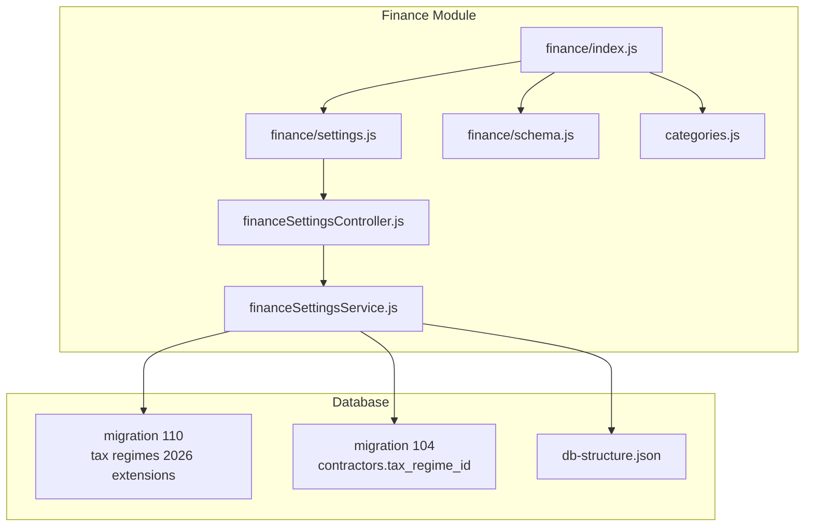
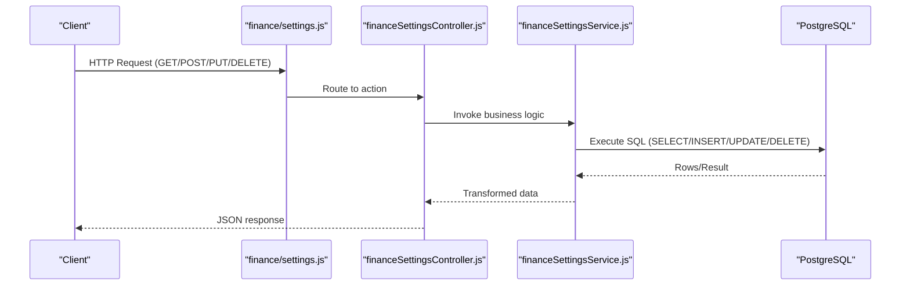
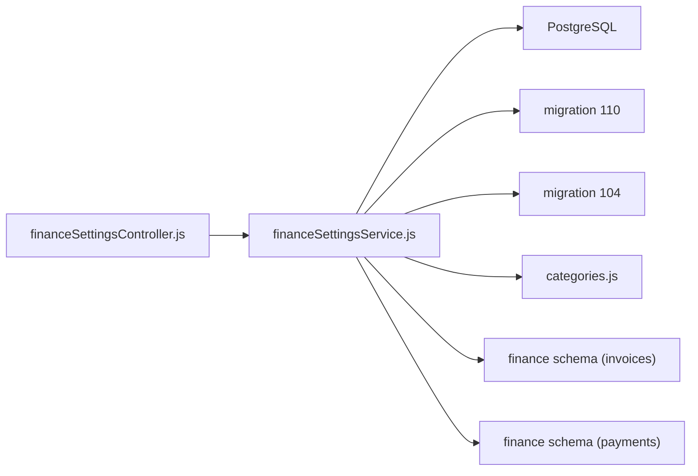

# Finance Settings & Configuration

<cite>
**Referenced Files in This Document**
- [finance/settings.js](file://backend/modules/finance/settings.js)
- [financeSettingsController.js](file://backend/modules/finance/controllers/financeSettingsController.js)
- [financeSettingsService.js](file://backend/modules/finance/services/financeSettingsService.js)
- [finance/index.js](file://backend/modules/finance/index.js)
- [finance/schema.js](file://backend/modules/finance/schema.js)
- [categories.js](file://backend/modules/finance/categories.js)
- [FINANCE.md](file://docs/api/FINANCE.md)
- [110_tax_regimes_2026_extensions.sql](file://backend/migrations/110_tax_regimes_2026_extensions.sql)
- [104_add_tax_regime_to_contractors.sql](file://backend/migrations/104_add_tax_regime_to_contractors.sql)
- [db-structure.json](file://backend/config/db-structure.json)
</cite>

## Table of Contents
1. [Introduction](#introduction)
2. [Project Structure](#project-structure)
3. [Core Components](#core-components)
4. [Architecture Overview](#architecture-overview)
5. [Detailed Component Analysis](#detailed-component-analysis)
6. [Dependency Analysis](#dependency-analysis)
7. [Performance Considerations](#performance-considerations)
8. [Troubleshooting Guide](#troubleshooting-guide)
9. [Conclusion](#conclusion)
10. [Appendices](#appendices)

## Introduction
This document explains Finance Settings and Configuration in the Titan CRM finance module. It covers:
- Financial categories management (custom category creation, hierarchy, defaults)
- Tax regimes and rates configuration with 2026 enhancements
- Overhead articles and allocation methods
- Defaults settings for the finance module
- Practical examples and API endpoints
- Integration with invoices, payments, and contractor tax regimes

## Project Structure
The finance module exposes a dedicated settings router under the main finance router. Settings endpoints are organized by functional domains: tax regimes, tax rates, allocation methods, overhead articles, and defaults. The module also initializes database schema and integrates with categories and invoices/payments.

**Diagram sources**
- [finance/index.js:1-55](file://backend/modules/finance/index.js#L1-L55)
- [finance/settings.js:1-55](file://backend/modules/finance/settings.js#L1-L54)
- [financeSettingsController.js:1-496](file://backend/modules/finance/controllers/financeSettingsController.js#L1-L68)
- [financeSettingsService.js:1-960](file://backend/modules/finance/services/financeSettingsService.js#L1-L745)
- [finance/schema.js:1-201](file://backend/modules/finance/schema.js#L1-L200)
- [110_tax_regimes_2026_extensions.sql:1-153](file://backend/migrations/110_tax_regimes_2026_extensions.sql#L1-L153)
- [104_add_tax_regime_to_contractors.sql:1-12](file://backend/migrations/104_add_tax_regime_to_contractors.sql#L1-L11)
- [db-structure.json:1-800](file://backend/config/db-structure.json#L1-L800)

**Section sources**
- [finance/index.js:1-55](file://backend/modules/finance/index.js#L1-L55)
- [finance/settings.js:1-55](file://backend/modules/finance/settings.js#L1-L54)

## Core Components
- Settings Router: Defines endpoints for tax regimes, tax rates, allocation methods, overhead articles, and defaults.
- Controller: Implements request handling, validation, and response formatting.
- Service: Encapsulates business logic, data transformations, and database queries.
- Schema Initialization: Ensures finance-related tables exist and are extended per migrations.
- Categories Router: Manages income/expense categories used by payments/invoices.
- API Docs: Reference for finance endpoints and payloads.

**Section sources**
- [finance/settings.js:1-55](file://backend/modules/finance/settings.js#L1-L54)
- [financeSettingsController.js:1-496](file://backend/modules/finance/controllers/financeSettingsController.js#L1-L68)
- [financeSettingsService.js:1-960](file://backend/modules/finance/services/financeSettingsService.js#L1-L745)
- [finance/schema.js:1-201](file://backend/modules/finance/schema.js#L1-L200)
- [categories.js:1-86](file://backend/modules/finance/categories.js#L1-L86)
- [FINANCE.md:1-429](file://docs/api/FINANCE.md#L1-L428)

## Architecture Overview
The settings subsystem follows a layered architecture:
- Router binds HTTP endpoints to controller actions.
- Controller delegates to service layer for domain logic.
- Service interacts with PostgreSQL via database queries and transforms data.
- Migrations define schema extensions for tax regimes and rates (2026 features).
- Integration points: contractor tax regime linkage, categories for payments/invoices.

**Diagram sources**
- [finance/settings.js:1-55](file://backend/modules/finance/settings.js#L1-L54)
- [financeSettingsController.js:1-496](file://backend/modules/finance/controllers/financeSettingsController.js#L1-L68)
- [financeSettingsService.js:1-960](file://backend/modules/finance/services/financeSettingsService.js#L1-L745)

## Detailed Component Analysis

### Tax Regimes Management
Endpoints:
- GET /api/module-settings/finance/tax-regimes
- GET /api/module-settings/finance/tax-regimes/:id
- POST /api/module-settings/finance/tax-regimes
- PUT /api/module-settings/finance/tax-regimes/:id
- DELETE /api/module-settings/finance/tax-regimes/:id
- GET /api/module-settings/finance/tax-regimes/available
- PUT /api/module-settings/finance/tax-regimes/:id/legal-forms

Key capabilities:
- Retrieve all regimes or a specific regime by ID.
- Create/update/delete regimes with flags for taxes (VAT, profit tax, USN, insurance, NDFL).
- New 2026 fields: applies_to_legal_forms, valid_from, valid_to, requires_nds, max_income_limit, max_employees_limit, requires_online_cashier.
- Get available regimes filtered by legal form and optional tax rates.
- Update allowed legal forms for a regime.

Validation and error handling:
- Not-found responses for missing resources.
- Validation errors for malformed requests.
- Transformations normalize booleans and numeric fields.

Integration:
- Contractors linked to tax regimes via tax_regime_id for automatic VAT calculation.
- Active taxes for a contractor on a given date are derived from active rates in the assigned regime.

**Section sources**
- [finance/settings.js:10-21](file://backend/modules/finance/settings.js#L10-L21)
- [financeSettingsController.js:13-97](file://backend/modules/finance/controllers/financeSettingsController.js#L13-L68)
- [financeSettingsController.js:103-162](file://backend/modules/finance/controllers/financeSettingsController.js#L68)
- [financeSettingsService.js:69-195](file://backend/modules/finance/services/financeSettingsService.js#L69-L195)
- [financeSettingsService.js:365-475](file://backend/modules/finance/services/financeSettingsService.js#L365-L475)
- [104_add_tax_regime_to_contractors.sql:1-12](file://backend/migrations/104_add_tax_regime_to_contractors.sql#L1-L11)
- [110_tax_regimes_2026_extensions.sql:6-50](file://backend/migrations/110_tax_regimes_2026_extensions.sql#L6-L50)

### Tax Rates Management
Endpoints:
- GET /api/module-settings/finance/tax-rates
- GET /api/module-settings/finance/tax-rates/:id
- POST /api/module-settings/finance/tax-rates
- PUT /api/module-settings/finance/tax-rates/:id
- DELETE /api/module-settings/finance/tax-rates/:id
- GET /api/module-settings/finance/tax-rates/history

Key capabilities:
- List rates optionally filtered by tax regime.
- Create/update/delete rates with fields: tax_type, rate, is_fixed, fixed_amount, min_base, max_base, effective_from/to, is_active, rate_value, applies_from, is_default, legal_forms.
- History endpoint groups rates by tax_type and supports filtering by tax_type and regimeId.

Validation and error handling:
- Not-found responses for missing rates.
- Validation errors for invalid payloads.
- Transformations normalize dates and booleans.

**Section sources**
- [finance/settings.js:22-31](file://backend/modules/finance/settings.js#L22-L31)
- [financeSettingsController.js:224-310](file://backend/modules/finance/controllers/financeSettingsController.js#L68)
- [financeSettingsService.js:229-359](file://backend/modules/finance/services/financeSettingsService.js#L229-L359)
- [financeSettingsService.js:518-556](file://backend/modules/finance/services/financeSettingsService.js#L518-L556)
- [110_tax_regimes_2026_extensions.sql:52-82](file://backend/migrations/110_tax_regimes_2026_extensions.sql#L52-L82)

### Allocation Methods
Endpoints:
- GET /api/module-settings/finance/allocation-methods
- POST /api/module-settings/finance/allocation-methods
- DELETE /api/module-settings/finance/allocation-methods/:id

Purpose:
- Manage allocation methods used by overhead articles (e.g., direct cost, headcount, revenue).

**Section sources**
- [finance/settings.js:33-38](file://backend/modules/finance/settings.js#L33-L38)
- [financeSettingsController.js:316-360](file://backend/modules/finance/controllers/financeSettingsController.js#L68)
- [financeSettingsService.js:636-689](file://backend/modules/finance/services/financeSettingsService.js#L636-L689)

### Overhead Articles
Endpoints:
- GET /api/module-settings/finance/overhead-articles
- POST /api/module-settings/finance/overhead-articles
- PUT /api/module-settings/finance/overhead-articles/:id
- DELETE /api/module-settings/finance/overhead-articles/:id

Purpose:
- Define overhead articles with hierarchy (parent_id), allocation method, direct flag, activity, default amount, and priority.

**Section sources**
- [finance/settings.js:40-47](file://backend/modules/finance/settings.js#L40-L47)
- [financeSettingsController.js:366-430](file://backend/modules/finance/controllers/financeSettingsController.js#L68)
- [financeSettingsService.js:691-800](file://backend/modules/finance/services/financeSettingsService.js#L691-L745)

### Defaults Settings
Endpoints:
- GET /api/module-settings/finance/defaults
- PUT /api/module-settings/finance/defaults

Purpose:
- Retrieve and update module-wide defaults for finance settings.

**Section sources**
- [finance/settings.js:48-53](file://backend/modules/finance/settings.js#L48-L53)
- [financeSettingsController.js:436-465](file://backend/modules/finance/controllers/financeSettingsController.js#L68)
- [financeSettingsService.js:1-20](file://backend/modules/finance/services/financeSettingsService.js#L1-L20)

### Financial Categories Management
Endpoints:
- GET /api/finance/categories
- POST /api/finance/categories
- PUT /api/finance/categories/:id
- DELETE /api/finance/categories/:id

Purpose:
- Create and manage income/expense categories used by payments and invoices.
- Supports hierarchy via parent_id and system categories.

Integration:
- Payments and invoices reference categories (e.g., category_id on payments, predefined system categories).

**Section sources**
- [categories.js:1-86](file://backend/modules/finance/categories.js#L1-L86)
- [FINANCE.md:259-320](file://docs/api/FINANCE.md#L259-L320)
- [finance/schema.js:104-128](file://backend/modules/finance/schema.js#L104-L128)

### Currency Configuration and Multi-Currency Support
Observations:
- Invoices and payments include a currency field with default RUB.
- No explicit currency exchange rate configuration endpoints were identified in the settings router.
- Multi-currency support appears to be present at the entity level (currency stored per record) but lacks centralized exchange rate management APIs in the settings module.

Implications:
- Use currency-aware calculations at the application level when mixing currencies.
- Consider extending settings to include exchange rate provider configuration and historical rates if needed.

**Section sources**
- [finance/schema.js:22-61](file://backend/modules/finance/schema.js#L22-L61)
- [FINANCE.md:13-107](file://docs/api/FINANCE.md#L13-L107)

### Numbering System Configuration
Observations:
- Invoices include an identifier field and type (e.g., outgoing).
- Payments include a number column (payment_number_to_payments.sql).
- No explicit numbering scheme configuration endpoints were identified in the settings router.

Recommendation:
- Introduce numbering series configuration for invoices, receipts, and financial documents to ensure uniqueness and compliance.

**Section sources**
- [finance/schema.js:22-44](file://backend/modules/finance/schema.js#L22-L44)
- [FINANCE.md:178-255](file://docs/api/FINANCE.md#L178-L255)

### System-Wide Finance Settings
Module-level settings include features and display preferences. These are exposed via the finance module index and can be used by the frontend to enable/disable features and set defaults.

**Section sources**
- [finance/index.js:43-54](file://backend/modules/finance/index.js#L43-L54)

## Dependency Analysis
- Controller depends on Service for business logic.
- Service depends on PostgreSQL via database queries and performs data transformations.
- Migrations extend tax regimes and rates with 2026 fields and indexes.
- Categories and invoices/payments depend on categories for classification.
- Contractors link to tax regimes for automatic tax computation.

**Diagram sources**
- [financeSettingsController.js:1-496](file://backend/modules/finance/controllers/financeSettingsController.js#L1-L68)
- [financeSettingsService.js:1-960](file://backend/modules/finance/services/financeSettingsService.js#L1-L745)
- [110_tax_regimes_2026_extensions.sql:1-153](file://backend/migrations/110_tax_regimes_2026_extensions.sql#L1-L153)
- [104_add_tax_regime_to_contractors.sql:1-12](file://backend/migrations/104_add_tax_regime_to_contractors.sql#L1-L11)
- [categories.js:1-86](file://backend/modules/finance/categories.js#L1-L86)
- [finance/schema.js:1-201](file://backend/modules/finance/schema.js#L1-L200)

**Section sources**
- [financeSettingsController.js:1-496](file://backend/modules/finance/controllers/financeSettingsController.js#L1-L68)
- [financeSettingsService.js:1-960](file://backend/modules/finance/services/financeSettingsService.js#L1-L745)
- [110_tax_regimes_2026_extensions.sql:1-153](file://backend/migrations/110_tax_regimes_2026_extensions.sql#L1-L153)
- [104_add_tax_regime_to_contractors.sql:1-12](file://backend/migrations/104_add_tax_regime_to_contractors.sql#L1-L11)
- [categories.js:1-86](file://backend/modules/finance/categories.js#L1-L86)
- [finance/schema.js:1-201](file://backend/modules/finance/schema.js#L1-L200)

## Performance Considerations
- Indexes on arrays and date ranges for tax regimes and rates improve filtering performance.
- Prefer batch operations for category updates and tax rate changes.
- Use pagination for large lists of tax regimes/rates and overhead articles.
- Cache frequently accessed tax regime/rate combinations for contractor validation.

## Troubleshooting Guide
Common issues and resolutions:
- Not found errors when retrieving tax regimes/rates by ID.
  - Verify IDs and existence in the database.
- Validation errors on create/update.
  - Ensure required fields are provided and types match expectations (booleans, numeric, dates).
- Contractor regime validation failures.
  - Confirm contractor’s legal_form matches applies_to_legal_forms and income/employee counts are within limits.
- Allocation method deletion failures.
  - Ensure the method is not referenced by overhead articles.

**Section sources**
- [financeSettingsController.js:16-24](file://backend/modules/finance/controllers/financeSettingsController.js#L16-L24)
- [financeSettingsController.js:29-44](file://backend/modules/finance/controllers/financeSettingsController.js#L29-L44)
- [financeSettingsController.js:224-237](file://backend/modules/finance/controllers/financeSettingsController.js#L68)
- [financeSettingsController.js:242-257](file://backend/modules/finance/controllers/financeSettingsController.js#L68)
- [financeSettingsService.js:425-475](file://backend/modules/finance/services/financeSettingsService.js#L425-L475)

## Conclusion
The Finance Settings module provides robust configuration for tax regimes and rates (including 2026 enhancements), allocation methods, overhead articles, and defaults. It integrates with categories and contractor tax regimes to support automated tax computations. While currency and numbering configuration are not exposed via dedicated settings endpoints, they are present at the entity level. Extending the settings module to include exchange rate configuration and numbering series would further strengthen compliance and operational control.

## Appendices

### Settings API Endpoints Summary
- Tax Regimes
  - GET /api/module-settings/finance/tax-regimes
  - GET /api/module-settings/finance/tax-regimes/:id
  - POST /api/module-settings/finance/tax-regimes
  - PUT /api/module-settings/finance/tax-regimes/:id
  - DELETE /api/module-settings/finance/tax-regimes/:id
  - GET /api/module-settings/finance/tax-regimes/available
  - PUT /api/module-settings/finance/tax-regimes/:id/legal-forms
- Tax Rates
  - GET /api/module-settings/finance/tax-rates
  - GET /api/module-settings/finance/tax-rates/:id
  - POST /api/module-settings/finance/tax-rates
  - PUT /api/module-settings/finance/tax-rates/:id
  - DELETE /api/module-settings/finance/tax-rates/:id
  - GET /api/module-settings/finance/tax-rates/history
- Allocation Methods
  - GET /api/module-settings/finance/allocation-methods
  - POST /api/module-settings/finance/allocation-methods
  - DELETE /api/module-settings/finance/allocation-methods/:id
- Overhead Articles
  - GET /api/module-settings/finance/overhead-articles
  - POST /api/module-settings/finance/overhead-articles
  - PUT /api/module-settings/finance/overhead-articles/:id
  - DELETE /api/module-settings/finance/overhead-articles/:id
- Defaults
  - GET /api/module-settings/finance/defaults
  - PUT /api/module-settings/finance/defaults

**Section sources**
- [finance/settings.js:10-53](file://backend/modules/finance/settings.js#L10-L53)

### Practical Examples

- Category Setup
  - Create a new expense category with a parent and color.
  - Update category name or hierarchy.
  - Delete non-system categories.

- Currency Configuration
  - Set currency per invoice/payment (RUB by default).
  - Extend to include exchange rate provider configuration and historical rates if needed.

- Numbering Scheme Management
  - Configure numbering series for invoices and receipts.
  - Enforce uniqueness and prefixes.

[No sources needed since this section provides general guidance]