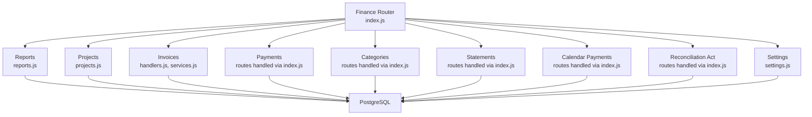
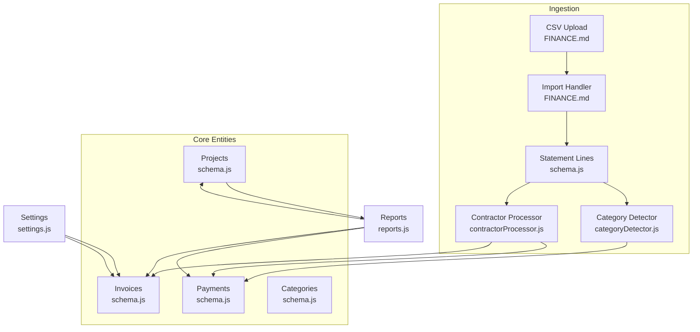
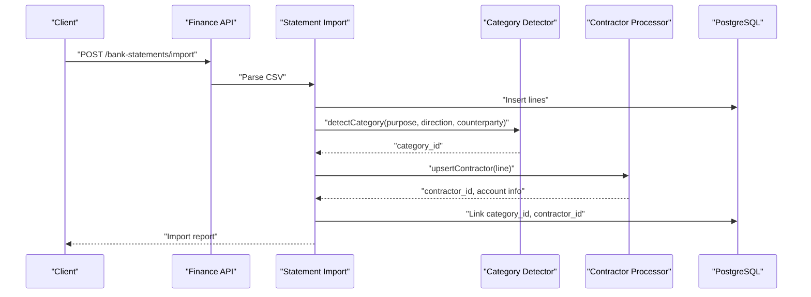
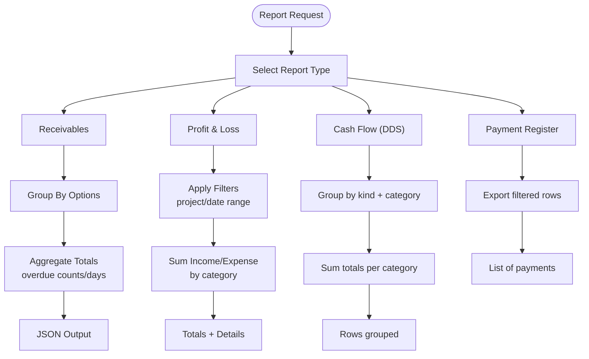
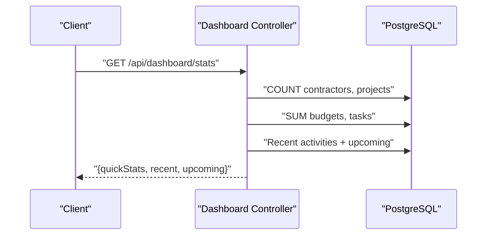
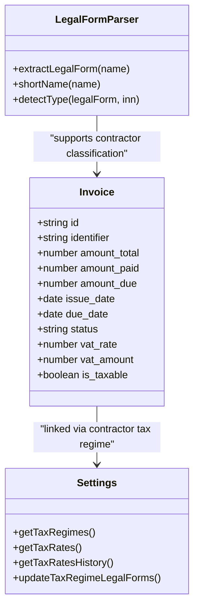
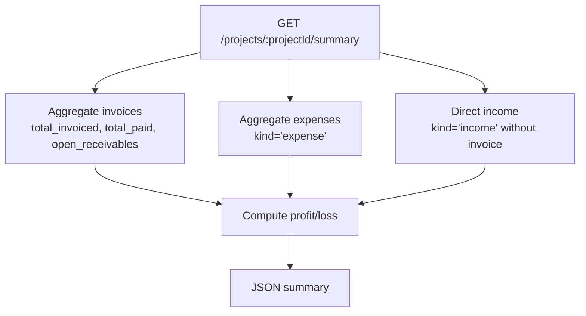
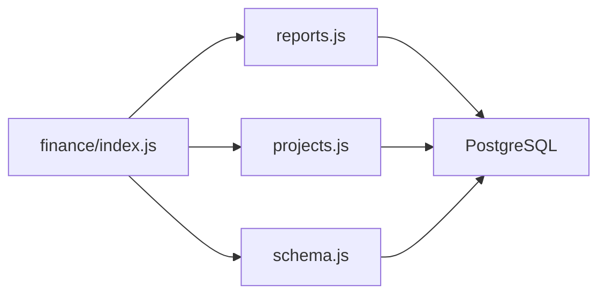

# Financial Reporting

<cite>
**Referenced Files in This Document**
- [index.js](file://backend/modules/finance/index.js)
- [schema.js](file://backend/modules/finance/schema.js)
- [reports.js](file://backend/modules/finance/reports.js)
- [projects.js](file://backend/modules/finance/projects.js)
- [controllers.js](file://backend/modules/dashboard/controllers.js)
- [handlers.js](file://backend/modules/finance/invoices/handlers.js)
- [services.js](file://backend/modules/finance/invoices/services.js)
- [settings.js](file://backend/modules/finance/settings.js)
- [categoryDetector.js](file://backend/modules/finance/statementHelpers/categoryDetector.js)
- [contractorProcessor.js](file://backend/modules/finance/statementHelpers/contractorProcessor.js)
- [legalFormParser.js](file://backend/modules/finance/statementHelpers/legalFormParser.js)
- [reportGenerator.js](file://backend/modules/finance/statementHelpers/reportGenerator.js)
- [FINANCE.md](file://docs/api/FINANCE.md)
</cite>

## Table of Contents
1. [Introduction](#introduction)
2. [Project Structure](#project-structure)
3. [Core Components](#core-components)
4. [Architecture Overview](#architecture-overview)
5. [Detailed Component Analysis](#detailed-component-analysis)
6. [Dependency Analysis](#dependency-analysis)
7. [Performance Considerations](#performance-considerations)
8. [Troubleshooting Guide](#troubleshooting-guide)
9. [Conclusion](#conclusion)
10. [Appendices](#appendices)

## Introduction
This document explains the Financial Reporting capabilities of the system with a focus on revenue and expense tracking, automated categorization, reporting filters, dashboards with KPIs, trend analysis, comparative reporting, tax reporting with VAT calculations and regulatory compliance, project-based financial tracking, and integration patterns. It also documents the reporting API endpoints, data aggregation patterns, and how the system integrates with accounting and tax preparation workflows.

## Project Structure
The Finance module is organized around core entities (invoices, payments, categories, statements), reporting endpoints, project financial summaries, and statement import helpers. The module exposes a unified router that mounts submodules for invoices, payments, categories, statements, reports, projects, calendar, reconciliation, and settings.

**Diagram sources**
- [index.js:1-55](file://backend/modules/finance/index.js#L1-L55)
- [reports.js:1-221](file://backend/modules/finance/reports.js#L1-L221)
- [projects.js:1-91](file://backend/modules/finance/projects.js#L1-L90)
- [settings.js:1-55](file://backend/modules/finance/settings.js#L1-L54)

**Section sources**
- [index.js:1-55](file://backend/modules/finance/index.js#L1-L55)

## Core Components
- Revenue and expense tracking: Invoices and Payments tables, with derived statuses and currency support. Automated status calculation and calendar event synchronization.
- Automated categorization: Category detection logic for statement lines and contractor processing with legal form parsing.
- Reporting filters: Reports endpoints with grouping and filtering by date range, project, contractor, and kind.
- Tax reporting: VAT fields on invoices, tax regimes and rates settings, and contractor tax regime linkage.
- Project-based tracking: Project summaries aggregating invoiced amounts, paid amounts, expenses, and profitability.
- Dashboards: KPIs and quick stats exposed via the dashboard controller.

**Section sources**
- [schema.js:22-61](file://backend/modules/finance/schema.js#L22-L61)
- [schema.js:104-128](file://backend/modules/finance/schema.js#L104-L128)
- [reports.js:10-91](file://backend/modules/finance/reports.js#L10-L91)
- [reports.js:93-146](file://backend/modules/finance/reports.js#L93-L146)
- [reports.js:148-175](file://backend/modules/finance/reports.js#L148-L175)
- [reports.js:177-218](file://backend/modules/finance/reports.js#L177-L218)
- [projects.js:10-40](file://backend/modules/finance/projects.js#L10-L40)
- [projects.js:42-88](file://backend/modules/finance/projects.js#L42-L88)
- [handlers.js:62-142](file://backend/modules/finance/invoices/handlers.js#L62-L142)
- [services.js:83-133](file://backend/modules/finance/invoices/services.js#L83-L133)
- [controllers.js:86-195](file://backend/modules/dashboard/controllers.js#L86-L195)

## Architecture Overview
The Finance module orchestrates financial data ingestion, categorization, and reporting. Statement imports leverage contractor processing and category detection to populate payments and categories. Reports aggregate data across payments, invoices, and projects to produce P&L, cash flow, receivables, and register views. Settings manage tax regimes and rates, enabling VAT-aware workflows.

**Diagram sources**
- [FINANCE.md:350-413](file://docs/api/FINANCE.md#L350-L413)
- [schema.js:142-197](file://backend/modules/finance/schema.js#L142-L197)
- [categoryDetector.js:13-64](file://backend/modules/finance/statementHelpers/categoryDetector.js#L13-L64)
- [contractorProcessor.js:32-187](file://backend/modules/finance/statementHelpers/contractorProcessor.js#L32-L187)
- [reports.js:10-218](file://backend/modules/finance/reports.js#L10-L218)
- [settings.js:13-52](file://backend/modules/finance/settings.js#L13-L52)

## Detailed Component Analysis

### Revenue and Expense Tracking with Automated Categorization
- Invoices and Payments capture transactional data with currency and derived statuses. Status updates are automatic but can be overridden.
- Statement import populates statement lines and attempts to match payments and invoices, while categorizing lines automatically.
- Contractor processing enriches counterparties and bank accounts, aiding accurate categorization and reconciliation.

**Diagram sources**
- [FINANCE.md:350-413](file://docs/api/FINANCE.md#L350-L413)
- [categoryDetector.js:13-64](file://backend/modules/finance/statementHelpers/categoryDetector.js#L13-L64)
- [contractorProcessor.js:32-187](file://backend/modules/finance/statementHelpers/contractorProcessor.js#L32-L187)
- [schema.js:160-197](file://backend/modules/finance/schema.js#L160-L197)

**Section sources**
- [handlers.js:62-142](file://backend/modules/finance/invoices/handlers.js#L62-L142)
- [services.js:83-133](file://backend/modules/finance/invoices/services.js#L83-L133)
- [schema.js:22-61](file://backend/modules/finance/schema.js#L22-L61)
- [schema.js:142-197](file://backend/modules/finance/schema.js#L142-L197)
- [categoryDetector.js:13-64](file://backend/modules/finance/statementHelpers/categoryDetector.js#L13-L64)
- [contractorProcessor.js:32-187](file://backend/modules/finance/statementHelpers/contractorProcessor.js#L32-L187)

### Reporting Filters and Comparative Analysis
- Receivables report groups by contractor, project, or combined contractor-project, computes overdue metrics, and supports grouping controls.
- Profit & Loss aggregates income and expense by category and optionally filtered by project and date range.
- Cash Flow (DDS) groups totals by category kind and color for visual dashboards.
- Payment Register exports filtered payment records with joins to invoices, projects, and categories for external reconciliation.

**Diagram sources**
- [reports.js:10-91](file://backend/modules/finance/reports.js#L10-L91)
- [reports.js:93-146](file://backend/modules/finance/reports.js#L93-L146)
- [reports.js:148-175](file://backend/modules/finance/reports.js#L148-L175)
- [reports.js:177-218](file://backend/modules/finance/reports.js#L177-L218)

**Section sources**
- [reports.js:10-218](file://backend/modules/finance/reports.js#L10-L218)

### Financial Dashboards with KPIs and Trend Analysis
- Dashboard controller provides quick stats such as revenue growth indicator, new clients, and task completion percentage, along with recent activities and upcoming projects.
- These KPIs can be extended to include financial metrics (e.g., revenue vs. expenses, variance, trends) by leveraging reports endpoints and aggregations.

**Diagram sources**
- [controllers.js:86-195](file://backend/modules/dashboard/controllers.js#L86-L195)

**Section sources**
- [controllers.js:86-195](file://backend/modules/dashboard/controllers.js#L86-L195)

### Tax Reporting with VAT Calculations and Regulatory Compliance
- Invoices include VAT rate, VAT amount, and taxable flag, enabling VAT-aware billing and document generation.
- Tax regimes and rates are configurable via settings endpoints, supporting compliance with varying tax regimes and effective-date-driven rate history.
- Legal form parsing and contractor processing assist in correct categorization and tax classification during statement imports.

**Diagram sources**
- [handlers.js:69-104](file://backend/modules/finance/invoices/handlers.js#L69-L104)
- [settings.js:13-52](file://backend/modules/finance/settings.js#L13-L52)
- [legalFormParser.js:11-83](file://backend/modules/finance/statementHelpers/legalFormParser.js#L11-L83)

**Section sources**
- [handlers.js:69-104](file://backend/modules/finance/invoices/handlers.js#L69-L104)
- [settings.js:13-52](file://backend/modules/finance/settings.js#L13-L52)
- [legalFormParser.js:11-83](file://backend/modules/finance/statementHelpers/legalFormParser.js#L11-L83)

### Project-Based Financial Tracking and Profitability
- Project summaries compute total invoiced, total paid (including direct income), total expenses, open receivables, and profit/loss.
- Project lists aggregate per-project financials for portfolio-level reporting.

**Diagram sources**
- [projects.js:42-88](file://backend/modules/finance/projects.js#L42-L88)
- [projects.js:10-40](file://backend/modules/finance/projects.js#L10-L40)

**Section sources**
- [projects.js:10-88](file://backend/modules/finance/projects.js#L10-L88)

### Practical Examples

- Report Generation
  - Receivables: Group by contractor-project, filter overdue, export grouped totals and invoice details.
  - Profit & Loss: Filter by date range and project, group by category, export totals and payment breakdown.
  - Cash Flow: Filter by date range, group by category kind, export categorized totals.
  - Payment Register: Filter by kind, project, contractor, date range, export detailed list.

- Dashboard Creation
  - Use dashboard quick stats and recent activities to build a front-end dashboard panel.
  - Extend with report endpoints for revenue vs. expense charts and project profitability heatmaps.

- Compliance Reporting Scenarios
  - VAT reporting: Use invoice-level VAT fields and tax regime settings to generate VAT-compliant documents and registers.
  - Statement import: Leverage contractor processing and category detection to auto-categorize transactions and reduce manual work.

**Section sources**
- [reports.js:10-218](file://backend/modules/finance/reports.js#L10-L218)
- [controllers.js:86-195](file://backend/modules/dashboard/controllers.js#L86-L195)
- [handlers.js:353-466](file://backend/modules/finance/invoices/handlers.js#L353-L466)
- [settings.js:13-52](file://backend/modules/finance/settings.js#L13-L52)

## Dependency Analysis
- Module routing: The Finance router ensures schema initialization and mounts submodules for invoices, payments, categories, statements, reports, projects, calendar, reconciliation, and settings.
- Data model: Invoices, payments, categories, statements, and projects define the core financial data model with foreign keys and constraints.
- Helpers: Category detector and contractor processor depend on statement lines and contractor data to enrich payments and categories.

**Diagram sources**
- [index.js:19-39](file://backend/modules/finance/index.js#L19-L39)
- [schema.js:9-197](file://backend/modules/finance/schema.js#L9-L197)

**Section sources**
- [index.js:19-39](file://backend/modules/finance/index.js#L19-L39)
- [schema.js:9-197](file://backend/modules/finance/schema.js#L9-L197)

## Performance Considerations
- Prefer indexed columns for frequent filters (e.g., payment_date, project_id, contractor_id, invoice_id).
- Use server-side pagination and date-range filters for large datasets in reports and registers.
- Batch operations for bulk updates and reconciliation to minimize round-trips.
- Cache frequently accessed tax regimes and rates where appropriate.

## Troubleshooting Guide
- Invoice status anomalies: Use the status recalculation endpoint to recompute status based on payments and due dates.
- Missing categories after import: Verify category detection rules and ensure purpose text contains expected keywords.
- Contractor mismatches: Review contractor processing warnings and confirm legal forms and tax regimes align with expected classifications.

**Section sources**
- [handlers.js:336-347](file://backend/modules/finance/invoices/handlers.js#L336-L347)
- [categoryDetector.js:13-64](file://backend/modules/finance/statementHelpers/categoryDetector.js#L13-L64)
- [contractorProcessor.js:40-43](file://backend/modules/finance/statementHelpers/contractorProcessor.js#L40-L43)

## Conclusion
The Finance module provides robust financial reporting, automated categorization, tax-aware workflows, and project-based profitability insights. Its modular design, clear API surface, and helper utilities enable scalable reporting, compliance-ready operations, and seamless integration with accounting systems.

## Appendices

### Reporting API Endpoints
- Invoices
  - GET /invoices, GET /invoices/:id, POST /invoices, PUT /invoices/:id, POST /invoices/:id/send, POST /invoices/:id/recalculate-status, POST /invoices/:id/generate-document
- Payments
  - GET /payments, POST /payments, PUT /payments/:id, DELETE /payments/:id
- Expense Categories
  - GET /expense-categories, POST /expense-categories, PUT /expense-categories/:id, DELETE /expense-categories/:id
- Bank Statements
  - GET /bank-statements, POST /bank-statements/import, GET /bank-statements/:id, POST /bank-statements/:id/reconcile
- Reports
  - GET /reports/receivables, GET /reports/pl, GET /reports/dds, GET /reports/register
- Projects
  - GET /projects, GET /projects/:projectId/summary
- Settings
  - GET/POST/PUT/DELETE tax regimes and rates, allocation methods, overhead articles, defaults

**Section sources**
- [FINANCE.md:13-429](file://docs/api/FINANCE.md#L13-L428)
- [reports.js:10-218](file://backend/modules/finance/reports.js#L10-L218)
- [projects.js:10-88](file://backend/modules/finance/projects.js#L10-L88)
- [settings.js:13-52](file://backend/modules/finance/settings.js#L13-L52)