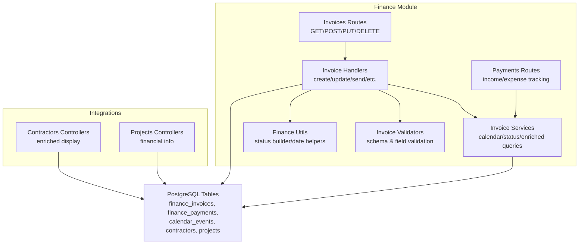
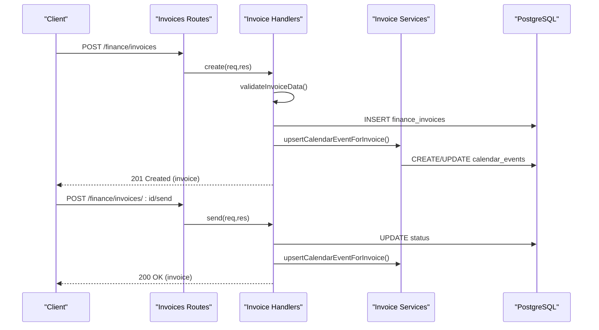
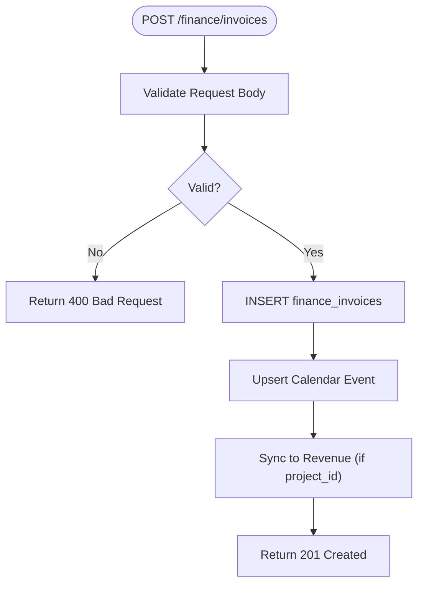
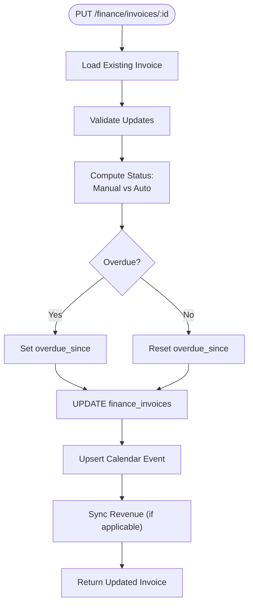
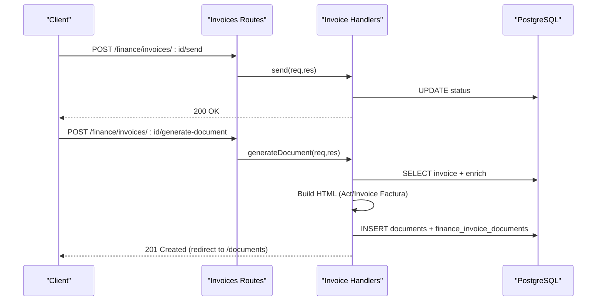
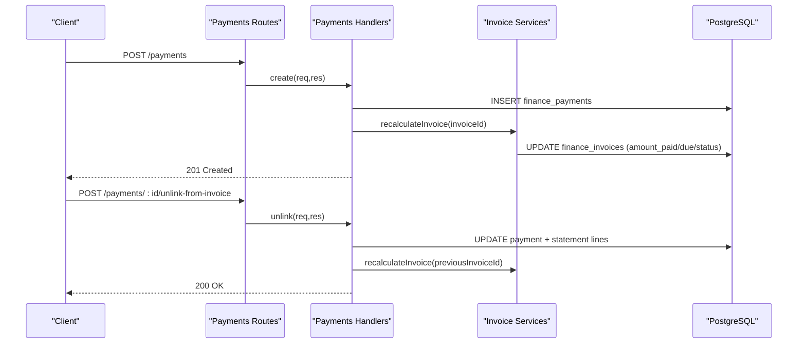
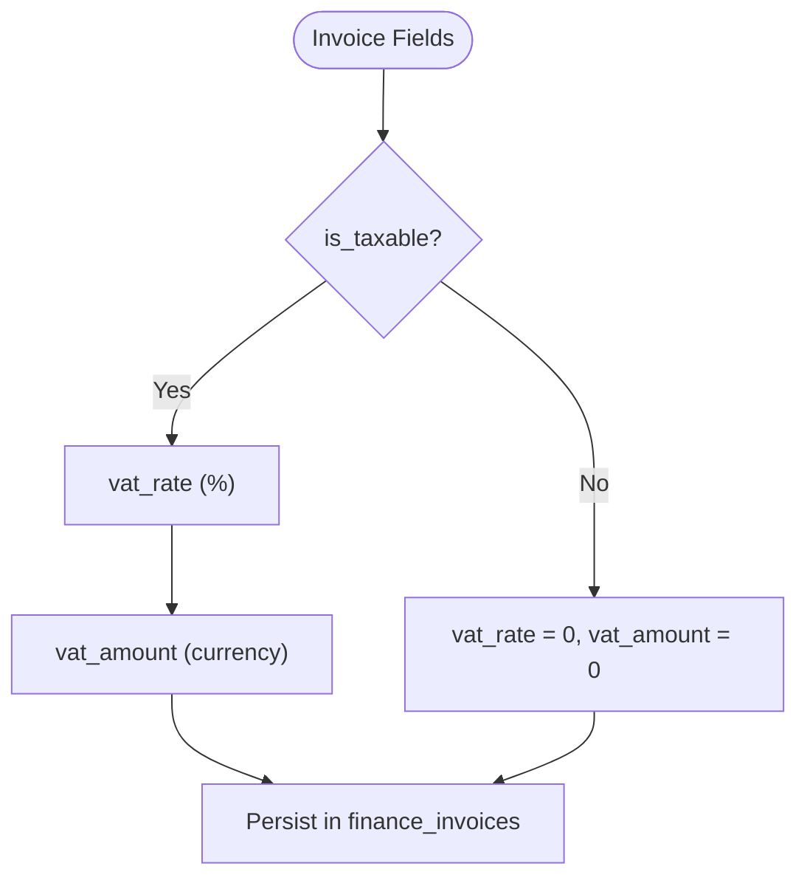
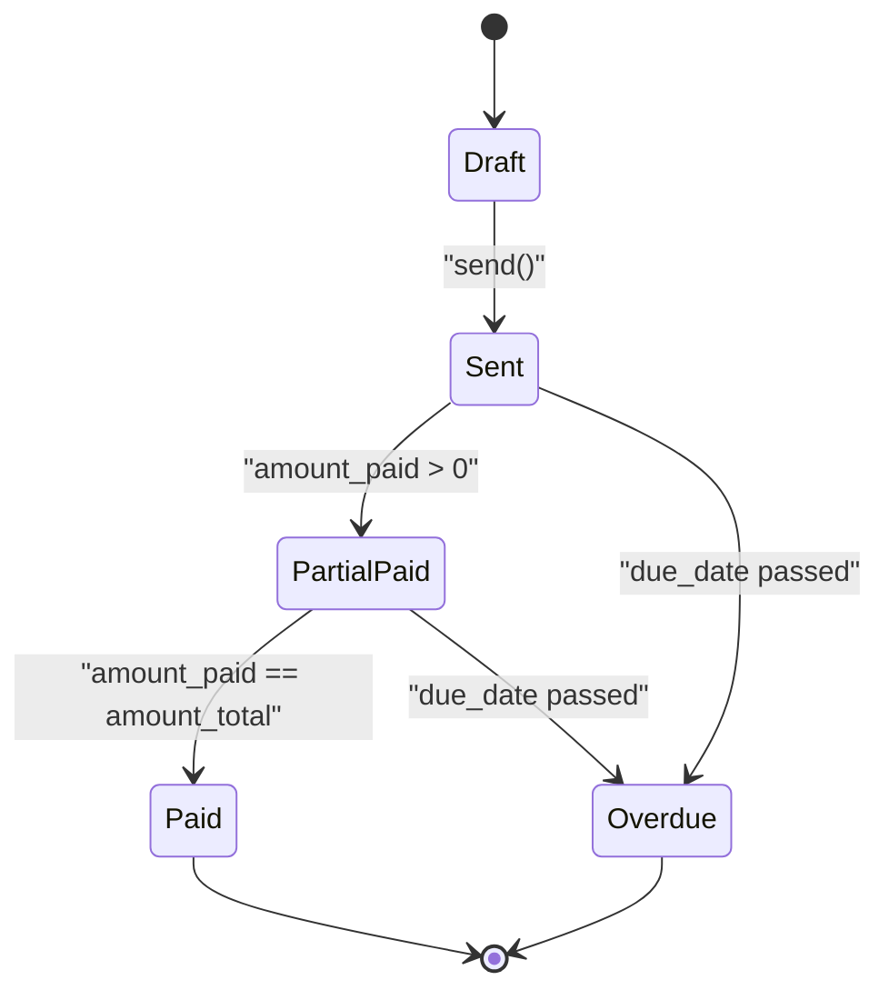
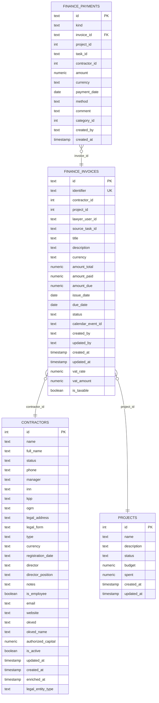
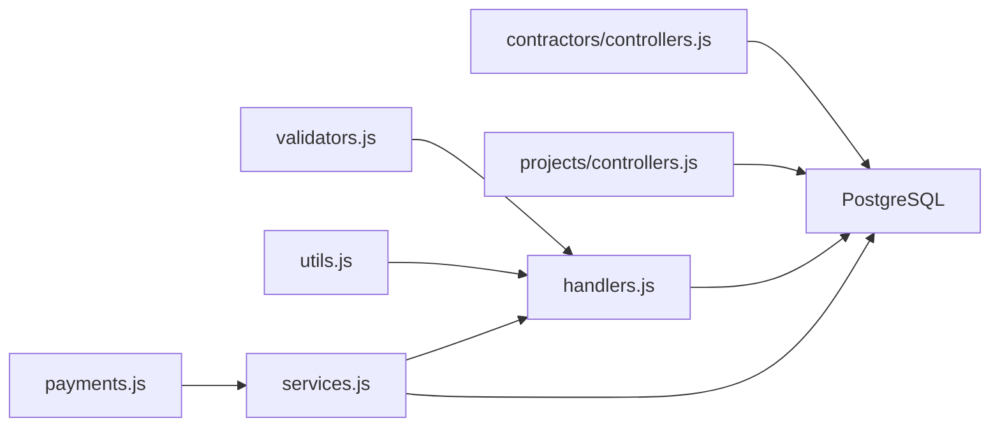

# Invoicing System

<cite>
**Referenced Files in This Document**
- [index.js](file://backend/modules/finance/invoices/index.js)
- [handlers.js](file://backend/modules/finance/invoices/handlers.js)
- [services.js](file://backend/modules/finance/invoices/services.js)
- [validators.js](file://backend/modules/finance/invoices/validators.js)
- [utils.js](file://backend/modules/finance/utils.js)
- [payments.js](file://backend/modules/finance/payments.js)
- [controllers.js](file://backend/modules/contractors/controllers.js)
- [controllers.js](file://backend/modules/projects/controllers.js)
- [FINANCE.md](file://docs/api/FINANCE.md)
- [112_add_vat_to_invoices.sql](file://backend/migrations/112_add_vat_to_invoices.sql)
- [db-structure.json](file://backend/config/db-structure.json)
</cite>

## Table of Contents
1. [Introduction](#introduction)
2. [Project Structure](#project-structure)
3. [Core Components](#core-components)
4. [Architecture Overview](#architecture-overview)
5. [Detailed Component Analysis](#detailed-component-analysis)
6. [Dependency Analysis](#dependency-analysis)
7. [Performance Considerations](#performance-considerations)
8. [Troubleshooting Guide](#troubleshooting-guide)
9. [Conclusion](#conclusion)
10. [Appendices](#appendices)

## Introduction
This document describes the Invoicing System within the Titan CRM platform. It covers invoice creation workflows, templates and documents generation, line item management, tax calculations, approval processes, status tracking, lifecycle management from draft to payment reconciliation, validation rules, currency handling, and international invoicing support. It also documents the invoice API endpoints, data models, and integration patterns with contractor management and project tracking systems.

## Project Structure
The invoicing capability is implemented as part of the Finance module. The key components are:
- Routes and handlers for invoice CRUD, sending, status recalculation, and document generation
- Validation layer ensuring data integrity
- Business logic services for calendar reminders, status recalculation, and enriched queries
- Payment integration for reconciliation and status updates
- Integration with contractor and project modules for enriched display and financial tracking

**Diagram sources**
- [index.js:1-40](file://backend/modules/finance/invoices/index.js#L1-L39)
- [handlers.js:1-571](file://backend/modules/finance/invoices/handlers.js#L1-L481)
- [services.js:1-239](file://backend/modules/finance/invoices/services.js#L1-L239)
- [validators.js:1-119](file://backend/modules/finance/invoices/validators.js#L1-L119)
- [utils.js:1-102](file://backend/modules/finance/utils.js#L1-L102)
- [payments.js:1-340](file://backend/modules/finance/payments.js#L1-L7)
- [controllers.js:1-563](file://backend/modules/contractors/controllers.js#L1-L563)
- [controllers.js:1-200](file://backend/modules/projects/controllers.js#L1-L200)

**Section sources**
- [index.js:1-40](file://backend/modules/finance/invoices/index.js#L1-L39)
- [handlers.js:1-571](file://backend/modules/finance/invoices/handlers.js#L1-L481)
- [services.js:1-239](file://backend/modules/finance/invoices/services.js#L1-L239)
- [validators.js:1-119](file://backend/modules/finance/invoices/validators.js#L1-L119)
- [utils.js:1-102](file://backend/modules/finance/utils.js#L1-L102)
- [payments.js:1-340](file://backend/modules/finance/payments.js#L1-L7)
- [controllers.js:1-563](file://backend/modules/contractors/controllers.js#L1-L563)
- [controllers.js:1-200](file://backend/modules/projects/controllers.js#L1-L200)

## Core Components
- Invoice Routes: Expose endpoints for listing, retrieving, creating, updating, sending, recalculating status, generating documents, and bulk updates.
- Invoice Handlers: Implement business logic for invoice creation, updates, sending, document generation, deletion, and bulk operations. They coordinate validation, persistence, calendar events, and revenue synchronization.
- Invoice Services: Provide calendar event upsert, invoice recalculation based on payments, and enriched queries with contractor/project/lawyer/task details.
- Validators: Enforce required fields, numeric ranges, dates, and optional fields like VAT and taxability.
- Finance Utils: Provide date parsing, numeric conversion, overdue checks, and status computation.
- Payments Integration: Track income/expense payments, link to invoices, and trigger status recalculation.
- Integrations: Contractor and project controllers enrich display data for invoices.

**Section sources**
- [index.js:10-39](file://backend/modules/finance/invoices/index.js#L10-L39)
- [handlers.js:31-142](file://backend/modules/finance/invoices/handlers.js#L31-L142)
- [services.js:15-133](file://backend/modules/finance/invoices/services.js#L15-L133)
- [validators.js:13-104](file://backend/modules/finance/invoices/validators.js#L13-L104)
- [utils.js:5-101](file://backend/modules/finance/utils.js#L5-L101)
- [payments.js:13-132](file://backend/modules/finance/payments.js#L7)

## Architecture Overview
The invoicing system follows a layered architecture:
- Presentation Layer: Express routes define the API surface.
- Application Layer: Handlers orchestrate validation, persistence, and integrations.
- Domain Layer: Services encapsulate business rules (status, calendar, recalculation).
- Persistence Layer: PostgreSQL tables store invoices, payments, and related entities.
- Integration Layer: Contractors and Projects modules enrich invoice data.

**Diagram sources**
- [index.js:18-28](file://backend/modules/finance/invoices/index.js#L18-L28)
- [handlers.js:62-142](file://backend/modules/finance/invoices/handlers.js#L62-L142)
- [services.js:15-76](file://backend/modules/finance/invoices/services.js#L15-L76)

**Section sources**
- [handlers.js:62-142](file://backend/modules/finance/invoices/handlers.js#L62-L142)
- [services.js:15-76](file://backend/modules/finance/invoices/services.js#L15-L76)

## Detailed Component Analysis

### Invoice Creation Workflow
- Endpoint: POST /finance/invoices
- Validation: Ensures title, amount_total, issue_date, due_date, and optional fields conform to schema.
- Persistence: Inserts a new invoice with computed totals and defaults.
- Calendar: Optionally creates or updates a calendar reminder for the due date.
- Revenue Sync: If linked to a project, synchronizes invoice to revenue records.

**Diagram sources**
- [handlers.js:62-120](file://backend/modules/finance/invoices/handlers.js#L62-L120)
- [validators.js:13-104](file://backend/modules/finance/invoices/validators.js#L13-L104)
- [services.js:15-76](file://backend/modules/finance/invoices/services.js#L15-L76)

**Section sources**
- [handlers.js:62-120](file://backend/modules/finance/invoices/handlers.js#L62-L120)
- [validators.js:13-104](file://backend/modules/finance/invoices/validators.js#L13-L104)

### Invoice Update and Status Management
- Endpoint: PUT /finance/invoices/:id
- Logic:
  - Manual status override: If status is explicitly provided and not a payment change, use manual status.
  - Automatic status: Otherwise compute status based on amount_paid, amount_total, and due_date.
  - Recalculate overdue_since when status changes to overdue or back to paid/partial_sent.
  - Update calendar event status accordingly.
  - Optional revenue sync on payment changes.

**Diagram sources**
- [handlers.js:148-284](file://backend/modules/finance/invoices/handlers.js#L148-L284)
- [services.js:83-133](file://backend/modules/finance/invoices/services.js#L83-L133)
- [utils.js:42-71](file://backend/modules/finance/utils.js#L42-L71)

**Section sources**
- [handlers.js:148-284](file://backend/modules/finance/invoices/handlers.js#L148-L284)
- [services.js:83-133](file://backend/modules/finance/invoices/services.js#L83-L133)
- [utils.js:42-71](file://backend/modules/finance/utils.js#L42-L71)

### Invoice Sending and Document Generation
- Send: Endpoint POST /finance/invoices/:id/send sets status to sent (or keeps paid if already paid).
- Document Generation: Endpoint POST /finance/invoices/:id/generate-document produces HTML documents (Act or Invoice Factura) for paid invoices and stores them as documents.

**Diagram sources**
- [index.js:24-31](file://backend/modules/finance/invoices/index.js#L24-L31)
- [handlers.js:290-466](file://backend/modules/finance/invoices/handlers.js#L290-L466)

**Section sources**
- [handlers.js:290-466](file://backend/modules/finance/invoices/handlers.js#L290-L466)

### Payment Tracking and Reconciliation
- Payments endpoint: POST /payments links payments to invoices and triggers status recalculation.
- Unlinking: POST /payments/:id/unlink-from-invoice detaches a payment from an invoice and resets reconciliation status.
- Bulk updates: Support for mass updates to payments with recalculation per affected invoice.

**Diagram sources**
- [payments.js:77-132](file://backend/modules/finance/payments.js#L7)
- [payments.js:229-266](file://backend/modules/finance/payments.js#L7)
- [services.js:83-133](file://backend/modules/finance/invoices/services.js#L83-L133)

**Section sources**
- [payments.js:77-132](file://backend/modules/finance/payments.js#L7)
- [payments.js:229-266](file://backend/modules/finance/payments.js#L7)
- [services.js:83-133](file://backend/modules/finance/invoices/services.js#L83-L133)

### Tax Calculations and VAT Support
- Schema: Columns vat_rate, vat_amount, is_taxable were added to support VAT.
- Validation: VAT-related fields are optional and normalized via validators.
- Computation: Status logic focuses on amounts and due dates; VAT fields are persisted for reporting and document generation.

**Diagram sources**
- [112_add_vat_to_invoices.sql:4-14](file://backend/migrations/112_add_vat_to_invoices.sql#L4-L14)
- [validators.js:87-94](file://backend/modules/finance/invoices/validators.js#L87-L94)
- [handlers.js:69-103](file://backend/modules/finance/invoices/handlers.js#L69-L103)

**Section sources**
- [112_add_vat_to_invoices.sql:4-14](file://backend/migrations/112_add_vat_to_invoices.sql#L4-L14)
- [validators.js:87-94](file://backend/modules/finance/invoices/validators.js#L87-L94)
- [handlers.js:69-103](file://backend/modules/finance/invoices/handlers.js#L69-L103)

### Approval Processes and Multi-Level Workflows
- Current behavior: Invoices support manual status overrides and automatic status computation based on amounts and due dates. There is no explicit multi-level approval workflow in the invoicing handlers.
- Recommendation: Integrate with the Workflow module to define approval steps (draft → submitted → approved → sent) with conditional transitions and notifications.

[No sources needed since this section provides general guidance]

### Invoice Lifecycle Management
- Draft → Sent → Partially Paid → Paid or Overdue
- Status derived from amount_paid/amount_total and due_date; overdue flag tracked separately.
- Calendar reminders synchronized with status changes.

**Diagram sources**
- [utils.js:42-71](file://backend/modules/finance/utils.js#L42-L71)
- [services.js:106-118](file://backend/modules/finance/invoices/services.js#L106-L118)

**Section sources**
- [utils.js:42-71](file://backend/modules/finance/utils.js#L42-L71)
- [services.js:106-118](file://backend/modules/finance/invoices/services.js#L106-L118)

### Data Models and API Endpoints
- Invoices table fields include identifiers, contractor/project/lawyer/task linkage, amounts, dates, status, currency, and VAT fields.
- Payments table tracks income/expense, linking to invoices, projects, tasks, and contractors.
- API endpoints documented in FINANCE.md cover listing, retrieval, creation, updates, sending, status recalculation, document generation, and payments.

**Diagram sources**
- [db-structure.json:1170-1368](file://backend/config/db-structure.json#L1170-L1368)
- [db-structure.json:713-800](file://backend/config/db-structure.json#L713-L800)

**Section sources**
- [FINANCE.md:13-175](file://docs/api/FINANCE.md#L13-L175)
- [db-structure.json:1170-1368](file://backend/config/db-structure.json#L1170-L1368)

### Practical Examples

- Example 1: Create an invoice and send it
  - POST /finance/invoices with title, amountTotal, issueDate, dueDate, contractorId, projectId, currency, status=draft
  - POST /finance/invoices/:id/send to set status to sent
  - Expected outcome: Invoice status becomes sent; calendar reminder created

- Example 2: Record partial payment and reconcile
  - POST /payments with kind=income, invoiceId, amount, paymentDate
  - Expected outcome: Invoice amount_paid increases, status recalculated to partial_paid or overdue

- Example 3: Generate an invoice document
  - POST /finance/invoices/:id/generate-document with documentType=invoice_factura
  - Expected outcome: HTML document stored and linked to the invoice

**Section sources**
- [handlers.js:62-142](file://backend/modules/finance/invoices/handlers.js#L62-L142)
- [handlers.js:290-330](file://backend/modules/finance/invoices/handlers.js#L290-L330)
- [handlers.js:353-466](file://backend/modules/finance/invoices/handlers.js#L353-L466)
- [payments.js:77-132](file://backend/modules/finance/payments.js#L7)

## Dependency Analysis
- Handlers depend on validators, utils, and services.
- Services depend on database queries and calendar/upsert logic.
- Payments route depends on invoice services for recalculation.
- Integrations with contractors and projects enrich display fields.

**Diagram sources**
- [handlers.js:13-20](file://backend/modules/finance/invoices/handlers.js#L13-L20)
- [services.js:6-8](file://backend/modules/finance/invoices/services.js#L6-L8)
- [payments.js:9-10](file://backend/modules/finance/payments.js#L7)
- [controllers.js:1-10](file://backend/modules/contractors/controllers.js#L1-L10)
- [controllers.js:1-8](file://backend/modules/projects/controllers.js#L1-L8)

**Section sources**
- [handlers.js:13-20](file://backend/modules/finance/invoices/handlers.js#L13-L20)
- [services.js:6-8](file://backend/modules/finance/invoices/services.js#L6-L8)
- [payments.js:9-10](file://backend/modules/finance/payments.js#L7)
- [controllers.js:1-10](file://backend/modules/contractors/controllers.js#L1-L10)
- [controllers.js:1-8](file://backend/modules/projects/controllers.js#L1-L8)

## Performance Considerations
- Prefer batch operations for bulk updates to minimize round-trips.
- Use indexed columns (status, contractor_id, project_id, due_date) for filtering and sorting.
- Limit payload sizes for document generation to reduce memory usage.
- Offload heavy computations (e.g., document generation) to background jobs if needed.

[No sources needed since this section provides general guidance]

## Troubleshooting Guide
- Validation errors: Ensure required fields (title, amount_total, issue_date, due_date) are present and formatted correctly.
- Status anomalies: Use POST /finance/invoices/:id/recalculate-status to recompute status based on payments.
- Payment unlinking: Use POST /payments/:id/unlink-from-invoice to detach payments and reset reconciliation status.
- Calendar sync issues: Verify calendar_event_id and due_date alignment.

**Section sources**
- [validators.js:13-104](file://backend/modules/finance/invoices/validators.js#L13-L104)
- [handlers.js:336-347](file://backend/modules/finance/invoices/handlers.js#L336-L347)
- [payments.js:229-266](file://backend/modules/finance/payments.js#L7)
- [services.js:15-76](file://backend/modules/finance/invoices/services.js#L15-L76)

## Conclusion
The Invoicing System provides robust invoice lifecycle management with strong validation, payment reconciliation, and document generation capabilities. While current approval workflows rely on manual status changes, integrating with the Workflow module would enable formal multi-level approvals. The system’s modular design supports future enhancements for advanced tax regimes, international invoicing, and automated approval processes.

## Appendices

### API Endpoints Reference
- Invoices
  - GET /finance/invoices
  - GET /finance/invoices/:id
  - POST /finance/invoices
  - PUT /finance/invoices/:id
  - POST /finance/invoices/:id/send
  - POST /finance/invoices/:id/recalculate-status
  - POST /finance/invoices/:id/generate-document
  - DELETE /finance/invoices/:id
  - POST /finance/invoices/bulk-update

- Payments
  - GET /payments
  - POST /payments
  - PUT /payments/:id
  - DELETE /payments/:id
  - POST /payments/:id/unlink-from-invoice
  - POST /payments/bulk-update

**Section sources**
- [FINANCE.md:13-175](file://docs/api/FINANCE.md#L13-L175)
- [payments.js:12-339](file://backend/modules/finance/payments.js#L7)