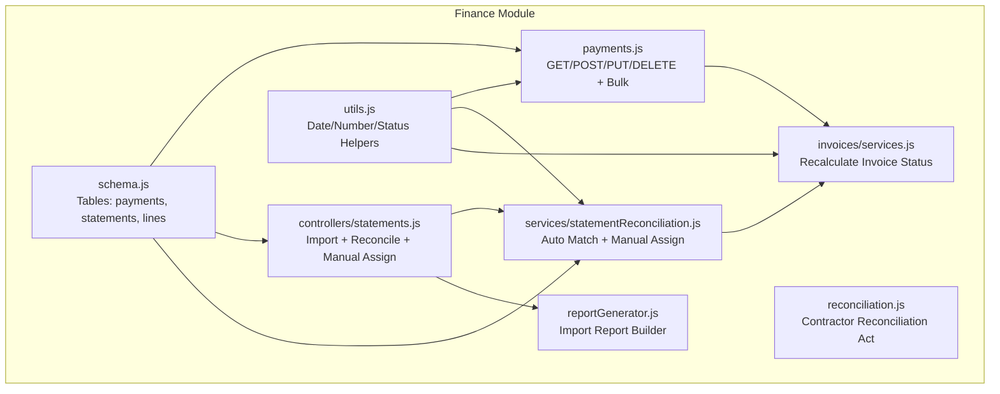
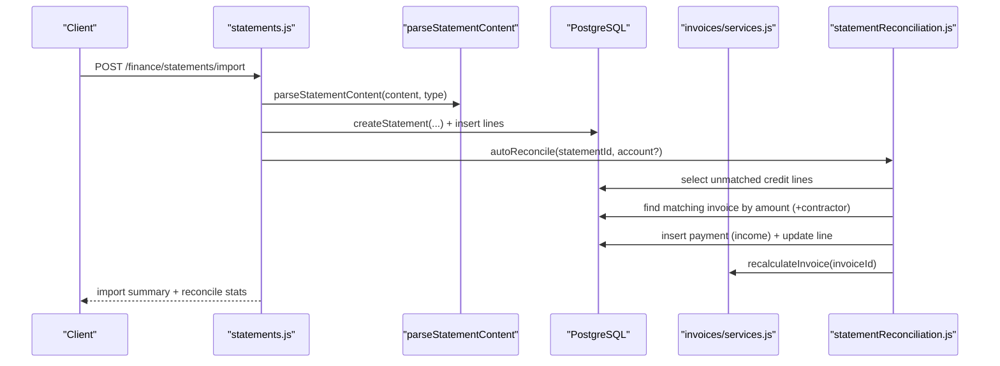
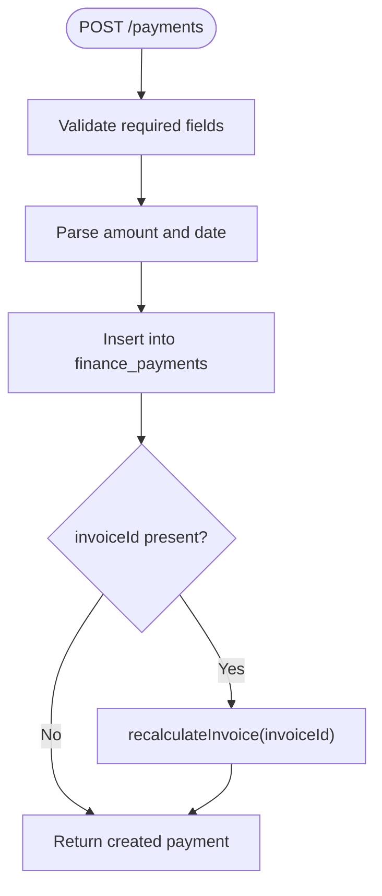
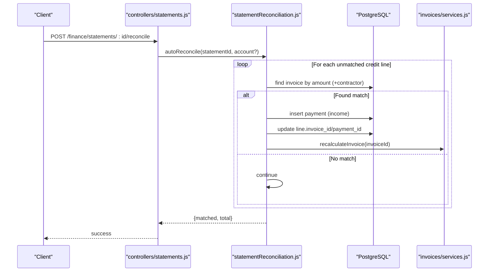
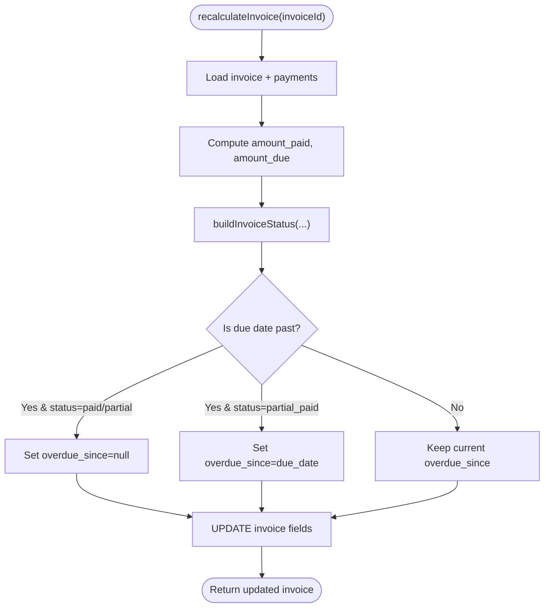
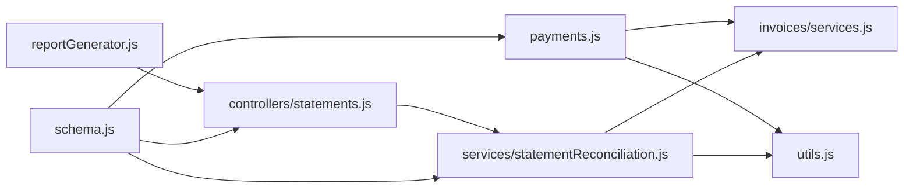
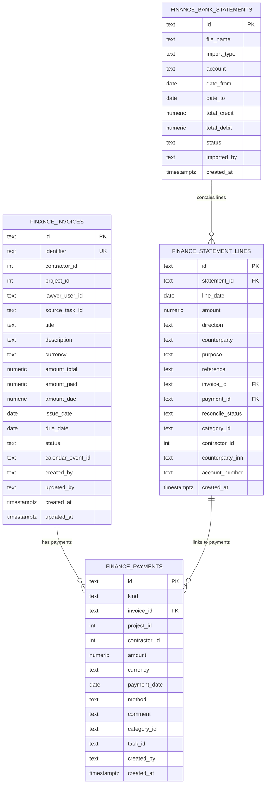

# Payment Processing

<cite>
**Referenced Files in This Document**
- [payments.js](file://backend/modules/finance/payments.js)
- [reconciliation.js](file://backend/modules/finance/reconciliation.js)
- [controllers/statements.js](file://backend/modules/finance/controllers/statements.js)
- [services/statementReconciliation.js](file://backend/modules/finance/services/statementReconciliation.js)
- [invoices/services.js](file://backend/modules/finance/invoices/services.js)
- [utils.js](file://backend/modules/finance/utils.js)
- [schema.js](file://backend/modules/finance/schema.js)
- [add_payment_number_to_payments.sql](file://backend/migrations/add_payment_number_to_payments.sql)
- [69_add_finance_payments_unique_constraint.sql](file://backend/migrations/69_add_finance_payments_unique_constraint.sql)
- [69a_remove_duplicate_payments.sql](file://backend/migrations/69a_remove_duplicate_payments.sql)
- [FINANCE.md](file://docs/api/FINANCE.md)
- [reportGenerator.js](file://backend/modules/finance/statementHelpers/reportGenerator.js)
</cite>

## Table of Contents
1. [Introduction](#introduction)
2. [Project Structure](#project-structure)
3. [Core Components](#core-components)
4. [Architecture Overview](#architecture-overview)
5. [Detailed Component Analysis](#detailed-component-analysis)
6. [Dependency Analysis](#dependency-analysis)
7. [Performance Considerations](#performance-considerations)
8. [Troubleshooting Guide](#troubleshooting-guide)
9. [Conclusion](#conclusion)
10. [Appendices](#appendices)

## Introduction
This document describes the Payment Processing system in the Titan CRM finance module. It covers payment creation and modification workflows, payment method handling, amount processing, and currency defaults. It explains reconciliation processes including automatic matching against invoices and manual adjustments, along with tracking mechanisms for overdue payments, partial payments, and payment history. It also documents validation rules, duplicate prevention, and integration with bank statement imports and invoice systems.

## Project Structure
The payment processing functionality spans several modules:
- Payments API endpoints and bulk operations
- Statement import pipeline and reconciliation services
- Invoice recalculation and overdue tracking
- Shared utilities for date parsing, numeric conversion, and status computation
- Database schema and migrations for payments, statements, and related entities

**Diagram sources**
- [payments.js:1-340](file://backend/modules/finance/payments.js#L1-L7)
- [reconciliation.js:1-79](file://backend/modules/finance/reconciliation.js#L1-L78)
- [controllers/statements.js:1-207](file://backend/modules/finance/controllers/statements/index.js#L1-L22)
- [services/statementReconciliation.js:1-363](file://backend/modules/finance/services/statementReconciliation.js#L1-L116)
- [invoices/services.js:1-239](file://backend/modules/finance/invoices/services.js#L1-L239)
- [utils.js:1-102](file://backend/modules/finance/utils.js#L1-L102)
- [schema.js:1-201](file://backend/modules/finance/schema.js#L1-L200)
- [reportGenerator.js:1-121](file://backend/modules/finance/statementHelpers/reportGenerator.js#L1-L120)

**Section sources**
- [payments.js:1-340](file://backend/modules/finance/payments.js#L1-L7)
- [controllers/statements.js:1-207](file://backend/modules/finance/controllers/statements/index.js#L1-L22)
- [services/statementReconciliation.js:1-363](file://backend/modules/finance/services/statementReconciliation.js#L1-L116)
- [invoices/services.js:1-239](file://backend/modules/finance/invoices/services.js#L1-L239)
- [utils.js:1-102](file://backend/modules/finance/utils.js#L1-L102)
- [schema.js:1-201](file://backend/modules/finance/schema.js#L1-L200)

## Core Components
- Payments API: CRUD operations for payments, including bulk updates and unlinking from invoices.
- Statement Import and Reconciliation: Automated matching of bank statement lines to invoices and creation of payments; manual assignment support.
- Invoice Recalculation: Computes amounts paid/due and derived status, including overdue detection.
- Utilities: Robust date parsing, numeric normalization, overdue checks, and status derivation.
- Schema and Migrations: Defines payment, statement, and line tables; enforces uniqueness and adds payment_number indexing.

Key capabilities:
- Payment creation with amount normalization and date parsing
- Automatic reconciliation by amount (+optional contractor match) with payment creation
- Manual reconciliation via line assignment with invoice or category
- Overdue detection based on due date and status computation
- Duplicate prevention via unique index on amount/date/contractor/kind

**Section sources**
- [payments.js:77-132](file://backend/modules/finance/payments.js#L7)
- [services/statementReconciliation.js:16-109](file://backend/modules/finance/services/statementReconciliation.js#L16-L109)
- [invoices/services.js:83-133](file://backend/modules/finance/invoices/services.js#L83-L133)
- [utils.js:5-71](file://backend/modules/finance/utils.js#L5-L71)
- [schema.js:47-175](file://backend/modules/finance/schema.js#L47-L175)
- [69_add_finance_payments_unique_constraint.sql:1-10](file://backend/migrations/69_add_finance_payments_unique_constraint.sql#L1-L9)

## Architecture Overview
The system integrates payments, statements, and invoices through explicit database relations and service orchestration. Payments are linked to invoices and optionally to projects/tasks/contractors/categories. Statement lines can be auto-matched to invoices and automatically generate income payments. Manual reconciliation allows assigning invoices or categories to lines and creating/updating payments accordingly.

**Diagram sources**
- [controllers/statements.js:45-150](file://backend/modules/finance/controllers/statements/index.js#L1-L22)
- [services/statementReconciliation.js:16-109](file://backend/modules/finance/services/statementReconciliation.js#L16-L109)
- [invoices/services.js:83-133](file://backend/modules/finance/invoices/services.js#L83-L133)

## Detailed Component Analysis

### Payments API
Endpoints:
- GET /payments: List payments with filters (kind, invoiceId, projectId, contractorId, taskId, date range)
- POST /payments: Create a payment with amount, currency, paymentDate, method, comment, category
- PUT /payments/:id: Update payment fields; recalculates affected invoices
- DELETE /payments/:id: Delete payment and recalculate invoice
- POST /payments/:id/unlink-from-invoice: Unlink payment from invoice and reset line reconciliation status
- POST /bulk-update: Batch update allowed fields across multiple payments

Validation and processing:
- Required fields: kind, amount, paymentDate
- Amount normalized via numeric converter; date normalized via date parser
- Currency defaults to RUB if not provided
- On update/delete, invoice recalculation ensures status and balances reflect changes

**Diagram sources**
- [payments.js:77-132](file://backend/modules/finance/payments.js#L7)
- [invoices/services.js:83-133](file://backend/modules/finance/invoices/services.js#L83-L133)
- [utils.js:5-31](file://backend/modules/finance/utils.js#L5-L31)

**Section sources**
- [payments.js:12-132](file://backend/modules/finance/payments.js#L7)
- [payments.js:134-227](file://backend/modules/finance/payments.js#L7)
- [payments.js:229-266](file://backend/modules/finance/payments.js#L7)
- [payments.js:268-337](file://backend/modules/finance/payments.js#L7)
- [FINANCE.md:178-255](file://docs/api/FINANCE.md#L178-L255)

### Statement Import and Reconciliation
Statement import pipeline:
- Accepts content and import type; parses lines
- Creates statement header and inserts lines
- Counts totals and generates import report
- Runs auto-reconciliation against invoices

Automatic reconciliation:
- Filters unmatched credit lines
- Matches by exact amount due (and optional contractor name match)
- Creates income payments and links lines to payments
- Updates statement status to reconciled when all lines matched

Manual reconciliation:
- Assign line to an invoice or category
- Creates payment if needed; updates line reconcile_status
- Supports unlinking invoice from line and removing auto-created payment

**Diagram sources**
- [controllers/statements.js:156-162](file://backend/modules/finance/controllers/statements/index.js#L1-L22)
- [services/statementReconciliation.js:16-109](file://backend/modules/finance/services/statementReconciliation.js#L16-L109)
- [invoices/services.js:83-133](file://backend/modules/finance/invoices/services.js#L83-L133)

**Section sources**
- [controllers/statements.js:45-150](file://backend/modules/finance/controllers/statements/index.js#L1-L22)
- [services/statementReconciliation.js:16-109](file://backend/modules/finance/services/statementReconciliation.js#L16-L109)
- [services/statementReconciliation.js:118-282](file://backend/modules/finance/services/statementReconciliation.js#L116)
- [reportGenerator.js:12-100](file://backend/modules/finance/statementHelpers/reportGenerator.js#L12-L100)

### Invoice Recalculation and Overdue Tracking
Invoice recalculation:
- Aggregates payments linked to an invoice (kind = income)
- Computes amount_paid, amount_due, and derived status
- Sets overdue_since when status becomes overdue and due date is in the past
- Resets overdue_since for paid/partial_sent/sent statuses

Status computation considers:
- Full payment regardless of due date
- Partial payment with overdue check
- Draft preservation
- Overdue only for sent invoices whose due date is in the past

**Diagram sources**
- [invoices/services.js:83-133](file://backend/modules/finance/invoices/services.js#L83-L133)
- [utils.js:42-71](file://backend/modules/finance/utils.js#L42-L71)
- [utils.js:33-40](file://backend/modules/finance/utils.js#L33-L40)

**Section sources**
- [invoices/services.js:83-133](file://backend/modules/finance/invoices/services.js#L83-L133)
- [utils.js:42-71](file://backend/modules/finance/utils.js#L42-L71)
- [utils.js:33-40](file://backend/modules/finance/utils.js#L33-L40)

### Payment Validation Rules and Duplicate Prevention
Duplicate prevention:
- Unique index on (amount, payment_date, contractor_id, kind) to prevent duplicates
- Pre-migration cleanup removes existing duplicates, keeping the earliest by created_at

Additional safeguards:
- Required fields enforced on create
- Numeric normalization prevents invalid amounts
- Date normalization ensures consistent storage

**Section sources**
- [69_add_finance_payments_unique_constraint.sql:1-10](file://backend/migrations/69_add_finance_payments_unique_constraint.sql#L1-L9)
- [69a_remove_duplicate_payments.sql:1-48](file://backend/migrations/69a_remove_duplicate_payments.sql#L1-L47)
- [payments.js:94-96](file://backend/modules/finance/payments.js#L7)
- [utils.js:28-31](file://backend/modules/finance/utils.js#L28-L31)

### Payment Modification Workflows
- Update payment: selective field updates with normalization; recalculates old/new invoices when invoice linkage changes
- Delete payment: removes record and recalculates associated invoice
- Unlink from invoice: clears invoice_id and resets line reconciliation status; removes auto-generated payment if present
- Bulk update: batch updates allowed fields across multiple payments; triggers invoice recalculation per affected invoice

**Section sources**
- [payments.js:134-204](file://backend/modules/finance/payments.js#L7)
- [payments.js:206-227](file://backend/modules/finance/payments.js#L7)
- [payments.js:229-266](file://backend/modules/finance/payments.js#L7)
- [payments.js:268-337](file://backend/modules/finance/payments.js#L7)

### Payment Tracking: Overdue Detection, Partial Payments, History
- Overdue detection: overdue_since set when invoice status transitions to overdue and due date is in the past; cleared for paid/partial_sent/sent
- Partial payments: tracked via amount_paid vs amount_total; status reflects partial_paid when applicable
- Payment history: payments endpoint supports filtering by date range, invoice, project, contractor, and task; includes joins to related entities

**Section sources**
- [invoices/services.js:106-118](file://backend/modules/finance/invoices/services.js#L106-L118)
- [payments.js:13-75](file://backend/modules/finance/payments.js#L7)
- [FINANCE.md:180-211](file://docs/api/FINANCE.md#L180-L211)

### Currency Handling and Amount Processing
- Currency defaults to RUB if not provided during payment creation
- Amount normalization converts inputs to finite numbers; invalid values fall back to zero
- Date normalization accepts multiple formats and standardizes to date-only strings

**Section sources**
- [payments.js:113-115](file://backend/modules/finance/payments.js#L7)
- [utils.js:28-31](file://backend/modules/finance/utils.js#L28-L31)
- [utils.js:5-26](file://backend/modules/finance/utils.js#L5-L26)

### Payment Number Field and Indexing
- payment_number column added to payments for tracking bank reference numbers
- Index on payment_number enables fast lookups
- Existing payments backfilled from statement line references when available

**Section sources**
- [add_payment_number_to_payments.sql:1-19](file://backend/migrations/add_payment_number_to_payments.sql#L1-L18)

## Dependency Analysis
The following diagram shows key dependencies among components:

**Diagram sources**
- [payments.js:1-340](file://backend/modules/finance/payments.js#L1-L7)
- [controllers/statements.js:1-207](file://backend/modules/finance/controllers/statements/index.js#L1-L22)
- [services/statementReconciliation.js:1-363](file://backend/modules/finance/services/statementReconciliation.js#L1-L116)
- [invoices/services.js:1-239](file://backend/modules/finance/invoices/services.js#L1-L239)
- [utils.js:1-102](file://backend/modules/finance/utils.js#L1-L102)
- [reportGenerator.js:1-121](file://backend/modules/finance/statementHelpers/reportGenerator.js#L1-L120)
- [schema.js:1-201](file://backend/modules/finance/schema.js#L1-L200)

**Section sources**
- [payments.js:1-340](file://backend/modules/finance/payments.js#L1-L7)
- [controllers/statements.js:1-207](file://backend/modules/finance/controllers/statements/index.js#L1-L22)
- [services/statementReconciliation.js:1-363](file://backend/modules/finance/services/statementReconciliation.js#L1-L116)
- [invoices/services.js:1-239](file://backend/modules/finance/invoices/services.js#L1-L239)
- [utils.js:1-102](file://backend/modules/finance/utils.js#L1-L102)
- [reportGenerator.js:1-121](file://backend/modules/finance/statementHelpers/reportGenerator.js#L1-L120)
- [schema.js:1-201](file://backend/modules/finance/schema.js#L1-L200)

## Performance Considerations
- Auto-reconciliation loops through unmatched credit lines; consider batching and indexing on reconcile_status and amount_due for scalability.
- Unique index on payments prevents duplicates but may slow down high-volume imports; ensure statement parsing deduplicates early.
- Recalculation of invoices after payment changes is essential for correctness; batch updates reduce redundant recalculations.
- Payment_number index improves lookup performance for bank-reference-based searches.

## Troubleshooting Guide
Common issues and resolutions:
- Payment creation fails with validation errors: ensure kind, amount, and paymentDate are provided; verify amount is numeric and date is parseable.
- Duplicate payment errors: check the unique index constraints; review import logic to avoid reprocessing the same bank lines.
- Reconciliation does not match: verify amount precision and contractor name similarity; use manual assignment to force linking.
- Overdue flag not updating: confirm due_date is in the past and invoice status transitions to overdue; note that paid/partial_sent/sent reset overdue_since.
- Payment unlinking not reflected: ensure statement line reconcile_status is reset to unmatched after unlinking.

**Section sources**
- [payments.js:94-96](file://backend/modules/finance/payments.js#L7)
- [69_add_finance_payments_unique_constraint.sql:1-10](file://backend/migrations/69_add_finance_payments_unique_constraint.sql#L1-L9)
- [services/statementReconciliation.js:16-109](file://backend/modules/finance/services/statementReconciliation.js#L16-L109)
- [invoices/services.js:106-118](file://backend/modules/finance/invoices/services.js#L106-L118)
- [payments.js:229-266](file://backend/modules/finance/payments.js#L7)

## Conclusion
The Payment Processing system provides robust workflows for creating, modifying, and tracking payments, integrating seamlessly with bank statement imports and invoice systems. Automatic reconciliation accelerates matching while manual assignment ensures flexibility. Strong validation and duplicate prevention maintain data integrity, and overdue tracking supports financial oversight.

## Appendices

### API Endpoints Summary
- Payments
  - GET /payments
  - POST /payments
  - PUT /payments/:id
  - DELETE /payments/:id
  - POST /payments/:id/unlink-from-invoice
  - POST /payments/bulk-update
- Statements
  - POST /bank-statements/import
  - POST /bank-statements/:id/reconcile
  - PUT /bank-statements/lines/:lineId
  - GET /bank-statements/:id
- Reconciliation Act
  - GET /finance/reconciliation-act/:contractorId

**Section sources**
- [FINANCE.md:178-413](file://docs/api/FINANCE.md#L178-L413)

### Data Models Overview

**Diagram sources**
- [schema.js:22-175](file://backend/modules/finance/schema.js#L22-L175)