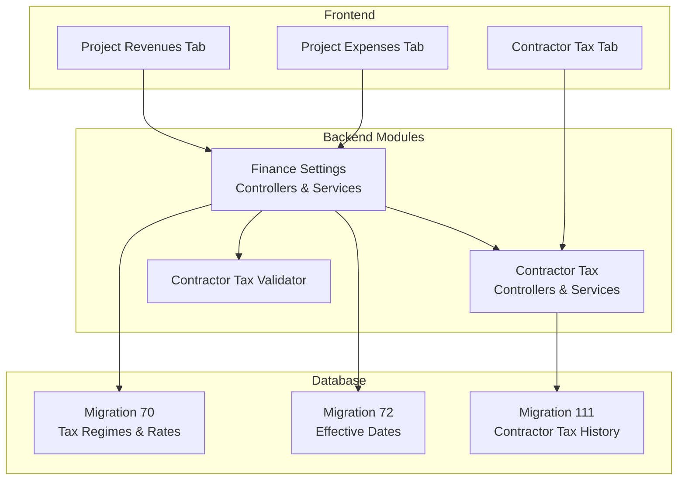
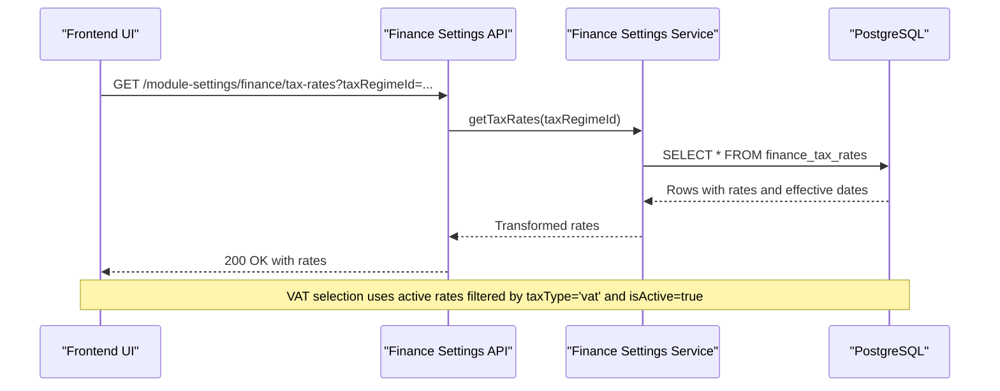
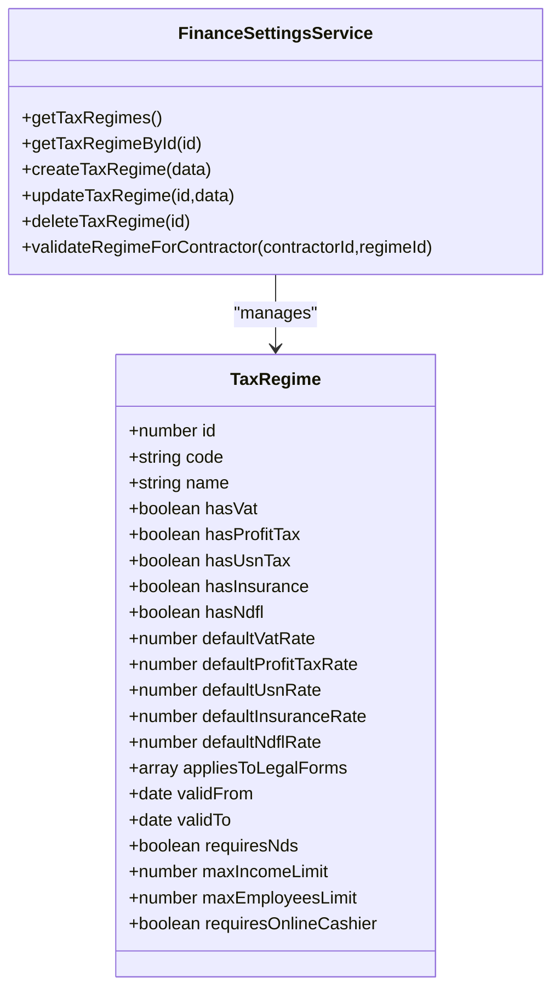
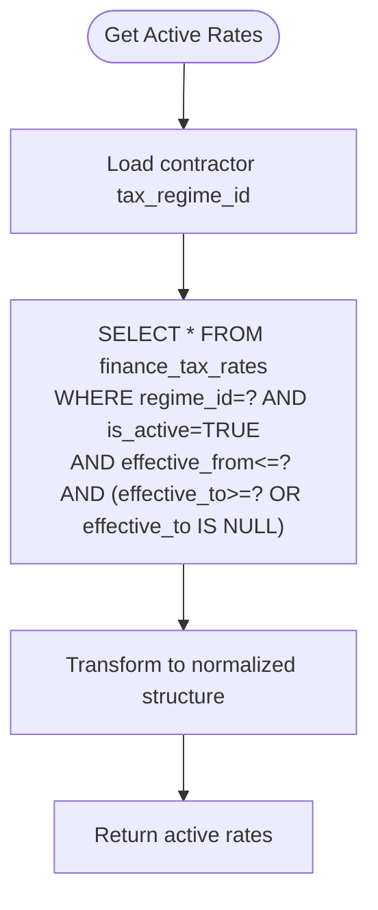
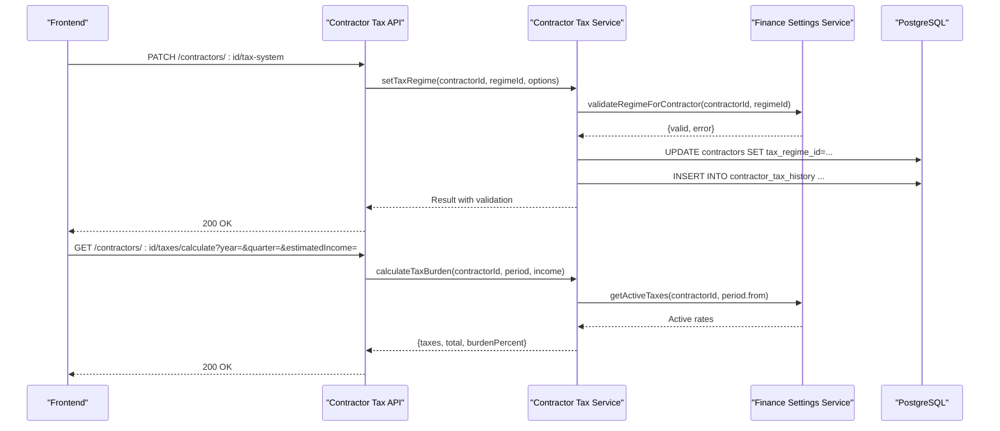
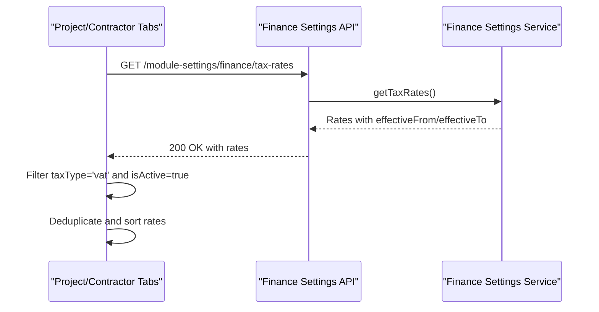
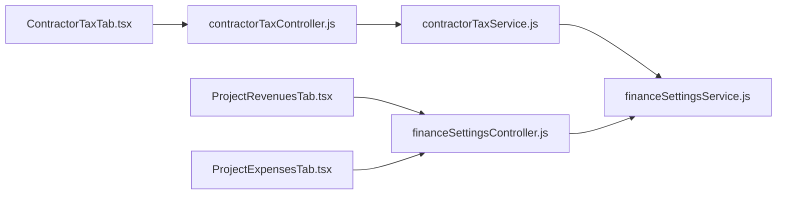

# Tax Compliance System

<cite>
**Referenced Files in This Document**
- [financeSettingsController.js](file://backend/modules/finance/controllers/financeSettingsController.js)
- [financeSettingsService.js](file://backend/modules/finance/services/financeSettingsService.js)
- [contractorTaxController.js](file://backend/modules/contractors/controllers/contractorTaxController.js)
- [contractorTaxService.js](file://backend/modules/contractors/services/contractorTaxService.js)
- [ContractorTaxValidator.js](file://backend/modules/contractors/validators/ContractorTaxValidator.js)
- [routes.js](file://backend/modules/contractors/routes.js)
- [schema.js](file://backend/modules/finance/schema.js)
- [FINANCE.md](file://docs/api/FINANCE.md)
- [70_finance_tax_settings.sql](file://backend/migrations/70_finance_tax_settings.sql)
- [72_tax_rates_effective_dates.sql](file://backend/migrations/72_tax_rates_effective_dates.sql)
- [111_contractor_tax_history.sql](file://backend/migrations/111_contractor_tax_history.sql)
- [ProjectRevenuesTab.tsx](file://frontend/coverage/src/modules/projects/components/tabs/ProjectRevenuesTab.tsx.html)
- [ProjectExpensesTab.tsx](file://frontend/coverage/src/modules/projects/components/tabs/ProjectExpensesTab.tsx.html)
- [ContractorTaxTab.tsx](file://frontend/src/modules/contractors/components/tabs/ContractorTaxTab.tsx)
</cite>

## Table of Contents
1. [Introduction](#introduction)
2. [Project Structure](#project-structure)
3. [Core Components](#core-components)
4. [Architecture Overview](#architecture-overview)
5. [Detailed Component Analysis](#detailed-component-analysis)
6. [Dependency Analysis](#dependency-analysis)
7. [Performance Considerations](#performance-considerations)
8. [Troubleshooting Guide](#troubleshooting-guide)
9. [Conclusion](#conclusion)
10. [Appendices](#appendices)

## Introduction
This document describes the Tax Compliance System within the Titan CRM platform. It covers VAT calculation workflows, tax jurisdiction handling, multi-region compliance, tax rate configuration with effective date tracking, regulatory updates, tax reporting requirements, contractor management integration for tax withholding and reporting, and practical examples of tax calculation scenarios. It also documents tax settings API endpoints, compliance validation rules, and integration points with external tax systems and regulatory databases.

## Project Structure
The Tax Compliance System spans backend modules for tax settings and contractor tax management, database migrations defining tax regimes and rates, and frontend components that consume tax data for VAT selection and tax rate configuration.

**Diagram sources**
- [financeSettingsController.js:1-496](file://backend/modules/finance/controllers/financeSettingsController.js#L1-L68)
- [financeSettingsService.js:1-800](file://backend/modules/finance/services/financeSettingsService.js#L1-L745)
- [contractorTaxController.js:1-254](file://backend/modules/contractors/controllers/contractorTaxController.js#L1-L254)
- [contractorTaxService.js:1-311](file://backend/modules/contractors/services/contractorTaxService.js#L1-L311)
- [ContractorTaxValidator.js:1-200](file://backend/modules/contractors/validators/ContractorTaxValidator.js#L1-L185)
- [70_finance_tax_settings.sql:1-355](file://backend/migrations/70_finance_tax_settings.sql#L1-L354)
- [72_tax_rates_effective_dates.sql:1-125](file://backend/migrations/72_tax_rates_effective_dates.sql#L1-L124)
- [111_contractor_tax_history.sql:1-103](file://backend/migrations/111_contractor_tax_history.sql#L1-L103)
- [ProjectRevenuesTab.tsx:533-547](file://frontend/coverage/src/modules/projects/components/tabs/ProjectRevenuesTab.tsx.html#L533-L547)
- [ProjectExpensesTab.tsx:591-606](file://frontend/coverage/src/modules/projects/components/tabs/ProjectExpensesTab.tsx.html#L591-L606)
- [ContractorTaxTab.tsx:1-120](file://frontend/src/modules/contractors/components/tabs/ContractorTaxTab.tsx#L1-L120)

**Section sources**
- [financeSettingsController.js:1-496](file://backend/modules/finance/controllers/financeSettingsController.js#L1-L68)
- [financeSettingsService.js:1-800](file://backend/modules/finance/services/financeSettingsService.js#L1-L745)
- [contractorTaxController.js:1-254](file://backend/modules/contractors/controllers/contractorTaxController.js#L1-L254)
- [contractorTaxService.js:1-311](file://backend/modules/contractors/services/contractorTaxService.js#L1-L311)
- [70_finance_tax_settings.sql:1-355](file://backend/migrations/70_finance_tax_settings.sql#L1-L354)
- [72_tax_rates_effective_dates.sql:1-125](file://backend/migrations/72_tax_rates_effective_dates.sql#L1-L124)
- [111_contractor_tax_history.sql:1-103](file://backend/migrations/111_contractor_tax_history.sql#L1-L103)

## Core Components
- Tax Regime Management: Defines tax regimes (e.g., OSN, USN) with default rates and eligibility criteria.
- Tax Rate Management: Maintains tax rates per regime with effective dates and historical tracking.
- Contractor Tax Information: Stores contractor tax regime assignments, validates regime changes against limits, and tracks history.
- Tax Calculation Engine: Computes tax burden for contractors over periods using active rates.
- Frontend Tax UI: Loads global tax rates for VAT selection and displays contractor tax information.

Key capabilities:
- Multi-region compliance via regime-specific rules and effective date handling.
- Rate variations with historical tracking and future-effective rates.
- Contractor tax regime validation against income/employee thresholds and online cash register requirements.
- Automated tax calculation for quarters/months with configurable estimation.

**Section sources**
- [financeSettingsService.js:69-195](file://backend/modules/finance/services/financeSettingsService.js#L69-L195)
- [financeSettingsService.js:232-359](file://backend/modules/finance/services/financeSettingsService.js#L232-L359)
- [contractorTaxService.js:68-134](file://backend/modules/contractors/services/contractorTaxService.js#L68-L134)
- [contractorTaxService.js:187-236](file://backend/modules/contractors/services/contractorTaxService.js#L187-L236)
- [contractorTaxService.js:599-631](file://backend/modules/contractors/services/contractorTaxService.js#L312)
- [ProjectRevenuesTab.tsx:533-547](file://frontend/coverage/src/modules/projects/components/tabs/ProjectRevenuesTab.tsx.html#L533-L547)
- [ProjectExpensesTab.tsx:591-606](file://frontend/coverage/src/modules/projects/components/tabs/ProjectExpensesTab.tsx.html#L591-L606)

## Architecture Overview
The system integrates backend controllers and services with database migrations that define tax regimes, rates, and contractor history. Frontend components consume tax data for UI decisions and contractor tax tabs display tax information and optimization suggestions.

**Diagram sources**
- [financeSettingsController.js:224-237](file://backend/modules/finance/controllers/financeSettingsController.js#L68)
- [financeSettingsService.js:232-246](file://backend/modules/finance/services/financeSettingsService.js#L232-L246)
- [72_tax_rates_effective_dates.sql:25-42](file://backend/migrations/72_tax_rates_effective_dates.sql#L25-L42)

**Section sources**
- [financeSettingsController.js:224-237](file://backend/modules/finance/controllers/financeSettingsController.js#L68)
- [financeSettingsService.js:232-246](file://backend/modules/finance/services/financeSettingsService.js#L232-L246)
- [72_tax_rates_effective_dates.sql:25-42](file://backend/migrations/72_tax_rates_effective_dates.sql#L25-L42)

## Detailed Component Analysis

### Tax Regime Management
- Purpose: Define tax regimes (OSN, USN, ESKH) with default rates and eligibility constraints.
- Key features:
  - Active flag, default rates per tax type, and validity period.
  - Eligibility checks by legal form, income threshold, employee count, and online cash register requirement.
  - Validation for contractor regime assignment.

**Diagram sources**
- [financeSettingsService.js:69-195](file://backend/modules/finance/services/financeSettingsService.js#L69-L195)
- [financeSettingsService.js:420-475](file://backend/modules/finance/services/financeSettingsService.js#L420-L475)

**Section sources**
- [financeSettingsService.js:69-195](file://backend/modules/finance/services/financeSettingsService.js#L69-L195)
- [financeSettingsService.js:420-475](file://backend/modules/finance/services/financeSettingsService.js#L420-L475)
- [70_finance_tax_settings.sql:10-31](file://backend/migrations/70_finance_tax_settings.sql#L10-L31)

### Tax Rate Configuration with Effective Dates
- Purpose: Manage tax rates per regime with effective-from/effective-to dates and historical tracking.
- Key features:
  - Active rate lookup on a given date.
  - Historical rate view grouped by tax type.
  - Legacy rate normalization and default effective dates.

**Diagram sources**
- [financeSettingsService.js:564-589](file://backend/modules/finance/services/financeSettingsService.js#L564-L589)
- [72_tax_rates_effective_dates.sql:48-77](file://backend/migrations/72_tax_rates_effective_dates.sql#L48-L77)

**Section sources**
- [financeSettingsService.js:564-589](file://backend/modules/finance/services/financeSettingsService.js#L564-L589)
- [financeSettingsService.js:518-556](file://backend/modules/finance/services/financeSettingsService.js#L518-L556)
- [72_tax_rates_effective_dates.sql:1-125](file://backend/migrations/72_tax_rates_effective_dates.sql#L1-L124)

### Contractor Tax Management and Validation
- Purpose: Assign tax regimes to contractors, validate against limits, compute tax burden, and track changes.
- Key features:
  - Set tax regime with reason and effective date.
  - Check limits (income, employees, online cash register).
  - Calculate tax burden for a period with estimated income.
  - Store regime change history with audit metadata.

**Diagram sources**
- [contractorTaxController.js:66-110](file://backend/modules/contractors/controllers/contractorTaxController.js#L66-L110)
- [contractorTaxController.js:116-157](file://backend/modules/contractors/controllers/contractorTaxController.js#L116-L157)
- [contractorTaxService.js:77-134](file://backend/modules/contractors/services/contractorTaxService.js#L77-L134)
- [contractorTaxService.js:599-631](file://backend/modules/contractors/services/contractorTaxService.js#L312)
- [financeSettingsService.js:420-475](file://backend/modules/finance/services/financeSettingsService.js#L420-L475)

**Section sources**
- [contractorTaxController.js:66-110](file://backend/modules/contractors/controllers/contractorTaxController.js#L66-L110)
- [contractorTaxController.js:116-157](file://backend/modules/contractors/controllers/contractorTaxController.js#L116-L157)
- [contractorTaxService.js:77-134](file://backend/modules/contractors/services/contractorTaxService.js#L77-L134)
- [contractorTaxService.js:599-631](file://backend/modules/contractors/services/contractorTaxService.js#L312)
- [ContractorTaxValidator.js:42-140](file://backend/modules/contractors/validators/ContractorTaxValidator.js#L42-L140)
- [111_contractor_tax_history.sql:10-23](file://backend/migrations/111_contractor_tax_history.sql#L10-L23)

### Frontend Tax Integration
- Purpose: Provide VAT rate selection and contractor tax information UI.
- Key features:
  - Load global VAT rates for UI dropdowns.
  - Display contractor tax regime, active taxes, limits, and history.
  - Show tax optimization suggestions.

**Diagram sources**
- [ProjectRevenuesTab.tsx:533-547](file://frontend/coverage/src/modules/projects/components/tabs/ProjectRevenuesTab.tsx.html#L533-L547)
- [ProjectExpensesTab.tsx:591-606](file://frontend/coverage/src/modules/projects/components/tabs/ProjectExpensesTab.tsx.html#L591-L606)
- [financeSettingsController.js:224-237](file://backend/modules/finance/controllers/financeSettingsController.js#L68)
- [financeSettingsService.js:232-246](file://backend/modules/finance/services/financeSettingsService.js#L232-L246)

**Section sources**
- [ProjectRevenuesTab.tsx:533-547](file://frontend/coverage/src/modules/projects/components/tabs/ProjectRevenuesTab.tsx.html#L533-L547)
- [ProjectExpensesTab.tsx:591-606](file://frontend/coverage/src/modules/projects/components/tabs/ProjectExpensesTab.tsx.html#L591-L606)
- [ContractorTaxTab.tsx:1-120](file://frontend/src/modules/contractors/components/tabs/ContractorTaxTab.tsx#L1-L120)

## Dependency Analysis
- Controllers depend on services for business logic.
- Services depend on database queries and transformations.
- Contractor tax service depends on finance settings service for regime validation and active tax retrieval.
- Frontend components depend on API endpoints for tax data.

**Diagram sources**
- [contractorTaxController.js:1-254](file://backend/modules/contractors/controllers/contractorTaxController.js#L1-L254)
- [contractorTaxService.js:1-311](file://backend/modules/contractors/services/contractorTaxService.js#L1-L311)
- [financeSettingsController.js:1-496](file://backend/modules/finance/controllers/financeSettingsController.js#L1-L68)
- [financeSettingsService.js:1-800](file://backend/modules/finance/services/financeSettingsService.js#L1-L745)
- [ProjectRevenuesTab.tsx:533-547](file://frontend/coverage/src/modules/projects/components/tabs/ProjectRevenuesTab.tsx.html#L533-L547)
- [ProjectExpensesTab.tsx:591-606](file://frontend/coverage/src/modules/projects/components/tabs/ProjectExpensesTab.tsx.html#L591-L606)
- [ContractorTaxTab.tsx:1-120](file://frontend/src/modules/contractors/components/tabs/ContractorTaxTab.tsx#L1-L120)

**Section sources**
- [contractorTaxController.js:1-254](file://backend/modules/contractors/controllers/contractorTaxController.js#L1-L254)
- [contractorTaxService.js:1-311](file://backend/modules/contractors/services/contractorTaxService.js#L1-L311)
- [financeSettingsController.js:1-496](file://backend/modules/finance/controllers/financeSettingsController.js#L1-L68)
- [financeSettingsService.js:1-800](file://backend/modules/finance/services/financeSettingsService.js#L1-L745)

## Performance Considerations
- Indexes on tax regimes and rates support fast filtering by code, active status, and type.
- Effective date queries leverage indexes to avoid scanning inactive rates.
- Views and functions (e.g., v_current_tax_rates, get_tax_rate_on_date) encapsulate date-based lookups for performance.
- Contractor tax history indexing supports efficient audits and reporting.

[No sources needed since this section provides general guidance]

## Troubleshooting Guide
Common issues and resolutions:
- Tax regime not available for contractor:
  - Cause: Income/employee limits exceeded or invalid legal form.
  - Resolution: Review regime eligibility and contractor data; adjust income/employee counts or legal form.
- No active VAT rates returned:
  - Cause: No active rates effective on the selected date.
  - Resolution: Verify effective_from/effective_to dates and activate appropriate rates.
- Tax calculation returns zero:
  - Cause: Missing or inactive tax rates for the regime.
  - Resolution: Ensure rates exist and are marked active for the calculation period.
- Audit logging missing:
  - Cause: Missing audit entries for regime changes.
  - Resolution: Confirm contractor_tax_history insert/update logic and audit middleware.

**Section sources**
- [ContractorTaxValidator.js:63-122](file://backend/modules/contractors/validators/ContractorTaxValidator.js#L63-L122)
- [financeSettingsService.js:518-556](file://backend/modules/finance/services/financeSettingsService.js#L518-L556)
- [contractorTaxController.js:89-103](file://backend/modules/contractors/controllers/contractorTaxController.js#L89-L103)
- [111_contractor_tax_history.sql:80-94](file://backend/migrations/111_contractor_tax_history.sql#L80-L94)

## Conclusion
The Tax Compliance System provides robust tax regime and rate management with effective date handling, contractor tax validation, and automated calculation. Its modular backend and database-first design enable multi-region compliance and historical tracking, while frontend components deliver practical tax configuration and reporting support.

[No sources needed since this section summarizes without analyzing specific files]

## Appendices

### Tax Settings API Endpoints
- Tax Regimes
  - GET /module-settings/finance/tax-regimes
  - GET /module-settings/finance/tax-regimes/:id
  - POST /module-settings/finance/tax-regimes
  - PUT /module-settings/finance/tax-regimes/:id
  - DELETE /module-settings/finance/tax-regimes/:id
  - GET /module-settings/finance/tax-regimes/available?legalForm=&date=&includeRates=
  - PUT /module-settings/finance/tax-regimes/:id/legal-forms
- Tax Rates
  - GET /module-settings/finance/tax-rates
  - GET /module-settings/finance/tax-rates/:id
  - POST /module-settings/finance/tax-rates
  - PUT /module-settings/finance/tax-rates/:id
  - DELETE /module-settings/finance/tax-rates/:id
  - GET /module-settings/finance/tax-rates/history?taxType=&regimeId=
- Allocation Methods
  - GET /module-settings/finance/allocation-methods
  - POST /module-settings/finance/allocation-methods
  - DELETE /module-settings/finance/allocation-methods/:id
- Overhead Articles
  - GET /module-settings/finance/overhead-articles
  - POST /module-settings/finance/overhead-articles
  - PUT /module-settings/finance/overhead-articles/:id
  - DELETE /module-settings/finance/overhead-articles/:id
- Defaults Settings
  - GET /module-settings/finance/defaults
  - PUT /module-settings/finance/defaults

**Section sources**
- [financeSettingsController.js:13-496](file://backend/modules/finance/controllers/financeSettingsController.js#L13-L68)

### Contractor Tax API Endpoints
- GET /contractors/:id/taxes?include=history,limits,calculations
- PATCH /contractors/:id/tax-system
- GET /contractors/:id/taxes/calculate?year=&quarter=&estimatedIncome=
- GET /contractors/:id/taxes/history
- GET /contractors/:id/taxes/limits-check
- GET /contractors/legal-forms
- GET /contractors/legal-forms/:code/tax-regimes?date=
- GET /contractors/:id/taxes/optimization-suggestions

**Section sources**
- [contractorTaxController.js:13-254](file://backend/modules/contractors/controllers/contractorTaxController.js#L13-L254)

### Practical Examples

- Example: VAT calculation for a contractor in the last quarter
  - Steps:
    - Determine quarter start/end dates.
    - Call contractor tax calculation endpoint with estimated income.
    - Sum taxes across active rates and compute burden percentage.
  - Expected outcome: List of taxes with amounts and total burden percent.

- Example: Rate configuration with effective dates
  - Steps:
    - Create or update a rate with effective_from/effective_to.
    - Use historical endpoint to review rate changes.
  - Expected outcome: Accurate rate application per date range.

- Example: Contractor tax regime assignment
  - Steps:
    - Validate regime against contractor limits.
    - Apply regime with effective date and reason.
    - Audit change in contractor_tax_history.
  - Expected outcome: Successful assignment with validation results.

**Section sources**
- [contractorTaxController.js:116-157](file://backend/modules/contractors/controllers/contractorTaxController.js#L116-L157)
- [financeSettingsService.js:518-556](file://backend/modules/finance/services/financeSettingsService.js#L518-L556)
- [contractorTaxService.js:77-134](file://backend/modules/contractors/services/contractorTaxService.js#L77-L134)
- [111_contractor_tax_history.sql:80-94](file://backend/migrations/111_contractor_tax_history.sql#L80-L94)

### Compliance Validation Rules
- Legal form eligibility: Regime must include contractor’s legal form.
- Income threshold: Annual income must not exceed regime’s max_income_limit.
- Employee threshold: Employee count must not exceed regime’s max_employees_limit.
- Online cash register requirement: Required for specific regimes.
- Validity period: Regime must be active on the requested date.

**Section sources**
- [financeSettingsService.js:420-475](file://backend/modules/finance/services/financeSettingsService.js#L420-L475)
- [ContractorTaxValidator.js:63-122](file://backend/modules/contractors/validators/ContractorTaxValidator.js#L63-L122)

### Integration with External Systems
- Regulatory databases: Use effective_from/effective_to to align with regulatory changes.
- Tax systems: Integrate active rates and regime rules to compute withholdings and filings.
- Reporting: Export tax rates history and contractor tax burden reports for submissions.

[No sources needed since this section provides general guidance]