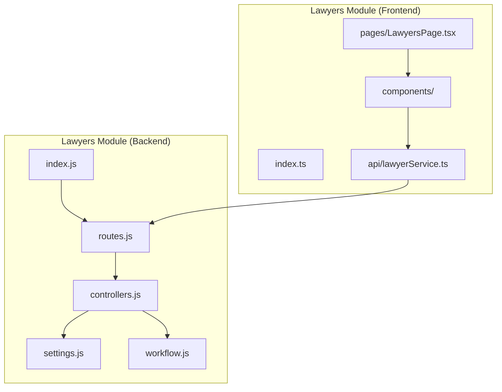
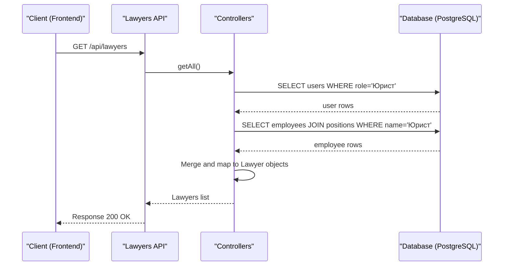

# Lawyers Module

<cite>
**Referenced Files in This Document**
- [backend/modules/lawyers/index.js](file://backend/modules/lawyers/index.js)
- [backend/modules/lawyers/routes.js](file://backend/modules/lawyers/routes.js)
- [backend/modules/lawyers/controllers.js](file://backend/modules/lawyers/controllers.js)
- [backend/modules/lawyers/settings.js](file://backend/modules/lawyers/settings.js)
- [backend/modules/lawyers/workflow.js](file://backend/modules/lawyers/workflow.js)
- [frontend/src/modules/lawyers/index.ts](file://frontend/src/modules/lawyers/index.ts)
- [frontend/src/modules/lawyers/api/lawyerService.ts](file://frontend/src/modules/lawyers/api/lawyerService.ts)
- [frontend/src/modules/lawyers/pages/LawyersPage.tsx](file://frontend/src/modules/lawyers/pages/LawyersPage.tsx)
</cite>

## Table of Contents
1. [Introduction](#introduction)
2. [Project Structure](#project-structure)
3. [Core Components](#core-components)
4. [Architecture Overview](#architecture-overview)
5. [Detailed Component Analysis](#detailed-component-analysis)
6. [Dependency Analysis](#dependency-analysis)
7. [Performance Considerations](#performance-considerations)
8. [Troubleshooting Guide](#troubleshooting-guide)
9. [Conclusion](#conclusion)

## Introduction
The Lawyers module manages the legal professionals within Titan CRM. It consolidates data from both the Users system (for authentication and roles) and the Employees system (for HR and organizational structure). The module tracks lawyer specializations, ratings, hourly rates, and their association with legal cases. It provides a centralized interface for viewing lawyer performance metrics, managing their profiles, and overseeing the cases they handle.

## Project Structure
The Lawyers module follows the standard modular structure for both backend and frontend:

### Backend
- `index.js`: Module entry point and route registration.
- `routes.js`: API endpoint definitions.
- `controllers.js`: Request handlers for lawyer CRUD operations.
- `settings.js`: Module-specific configuration and feature flags.
- `workflow.js`: Business logic for lawyer-related processes.

### Frontend
- `index.ts`: Public API for the module.
- `api/`: API client and service definitions.
- `components/`: UI components for lawyers and their associated cases.
- `hooks/`: React hooks for lawyer data fetching and state management.
- `pages/`: Main Lawyers management page.
- `types/`: TypeScript definitions for lawyers and related entities.

## Core Components
The Lawyers module consists of several key components:

### Lawyer Profile Management
Handles the unified view of a lawyer, combining user account data with employee details.
- **Attributes**: Name, contact info, status, specializations, rating, hourly rate.
- **Data Sourcing**: Aggregates from `users` and `employees` tables.

### Case Association (Frontend Integration)
Although legal cases are primarily managed in the `legal_cases` module, the `lawyers` frontend module provides comprehensive views for cases assigned to specific lawyers.
- **Cases List**: Filterable list of cases managed by the lawyer.
- **Case Analytics**: Performance metrics and case outcome statistics.

### Performance Metrics (Currently Stubbed)
Tracks lawyer productivity and success rates.
- **Active Cases Count**: Number of cases currently assigned.
- **Won Cases Count**: Number of cases with a positive outcome.
- **Rating**: Dynamic performance-based score.

## Architecture Overview
The module implements a standard three-tier architecture, integrating with the shared User and Employee systems.

## Detailed Component Analysis

### Backend Controllers
The `controllers.js` file handles the core logic for retrieving and managing lawyer data:
- `getAll`: Aggregates legal professionals from both `users` and `employees` tables, ensuring no duplicates for linked accounts.
- `getById`: Retrieves detailed profile information for a specific lawyer.
- `create/update`: Manages lawyer-specific metadata like specializations and ratings stored in the `users` table.
- `mapToLawyer`: Normalizes data from different sources into a consistent Lawyer object.

### Frontend Integration
The frontend module provides a rich set of components for interacting with lawyer data:
- `LawyersPage`: The primary dashboard for lawyer management.
- `LawyerSheet`: A slide-over panel for viewing and editing lawyer details.
- `CasesList`: Integrated view of cases, leveraging the `legal_cases` backend APIs but presented within the lawyer context.

## Dependency Analysis
The Lawyers module depends on several core systems:
- **Database**: PostgreSQL for persistence.
- **Shared Utils**: `errorHandler`, `responseHelpers`, and `db.js`.
- **User Module**: For authentication and basic profile data.
- **Administration Module**: For employee and position data.
- **Legal Cases Module**: For associating lawyers with cases (primarily on the frontend).

## Performance Considerations
- **Data Aggregation**: Merging `users` and `employees` can be resource-intensive for large datasets; pagination and indexing on roles/positions are used.
- **Frontend Hydration**: Loading case lists within the lawyers module uses standard TanStack Query caching to minimize repeated API calls.

## Troubleshooting Guide
- **Duplicate Lawyers**: Ensure that employees are properly linked to their user accounts via `user_id` to prevent them from appearing twice in the list.
- **Missing Specializations**: Specializations are stored as a comma-separated string in the DB and converted to an array in the `mapToLawyer` helper.
- **Hardcoded Stats**: Note that `activeCasesCount` and `wonCasesCount` currently use stubbed values and are planned for real-time calculation in future updates.

## Conclusion
The Lawyers module provides a vital link between the people and the processes in Titan CRM. By unifying HR data with operational case management, it enables effective resource allocation and performance tracking for legal teams.
