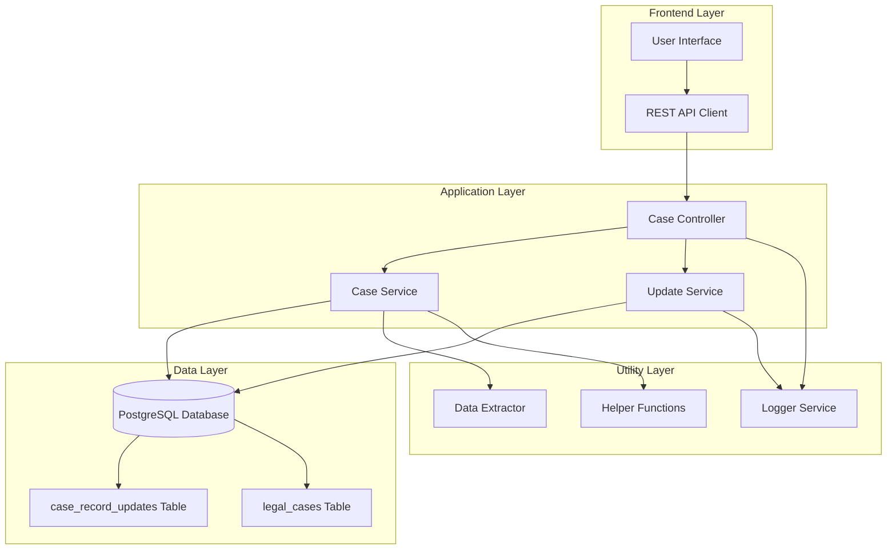
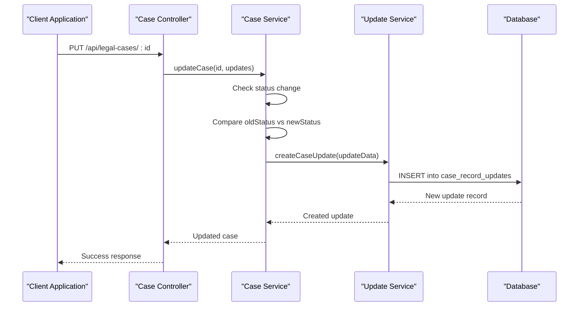
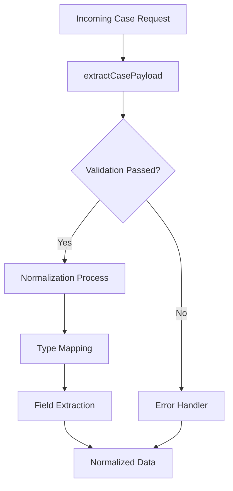
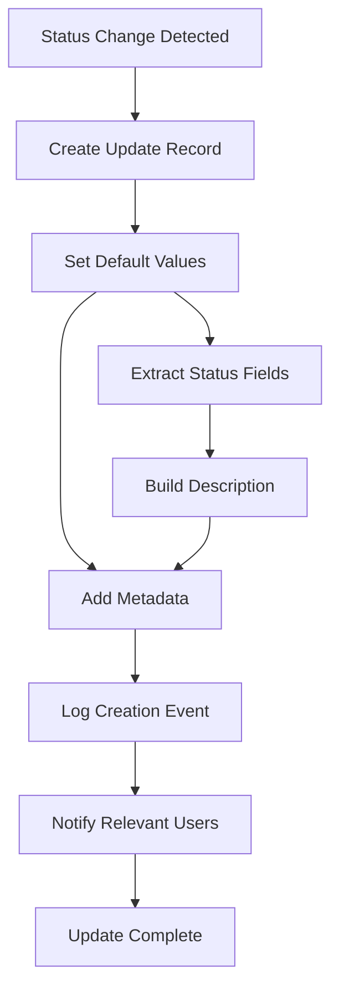

# Automated Case Updates System

<cite>
**Referenced Files in This Document**
- [CASE_UPDATES_SYSTEM.md](file://docs/CASE_UPDATES_SYSTEM.md)
- [CASE_UPDATES_IMPLEMENTATION.md](file://docs/CASE_UPDATES_IMPLEMENTATION.md)
- [CASE_UPDATES_API.md](file://docs/CASE_UPDATES_API.md)
- [add-case-record-updates.js](file://backend/migrations/add-case-record-updates.js)
- [fix-case-updates-lawyer-id-type.js](file://backend/migrations/fix-case-updates-lawyer-id-type.js)
- [fix-case-updates-viewed-by-type.js](file://backend/migrations/fix-case-updates-viewed-by-type.js)
- [updates.js](file://backend/modules/legal_cases/services/updates.js)
- [cases.js](file://backend/modules/legal_cases/services/cases.js)
- [cases.js](file://backend/modules/legal_cases/controllers/cases.js)
- [extractors.js](file://backend/modules/legal_cases/utils/extractors.js)
- [helpers.js](file://backend/modules/legal_cases/utils/helpers.js)
- [test-case-updates.js](file://scratch/test-case-updates.js)
- [test-auto-updates.js](file://scratch/test-auto-updates.js)
</cite>

## Table of Contents
1. [Introduction](#introduction)
2. [System Architecture](#system-architecture)
3. [Core Components](#core-components)
4. [Trigger Mechanisms](#trigger-mechanisms)
5. [Data Extraction and Normalization](#data-extraction-and-normalization)
6. [Update Pipeline](#update-pipeline)
7. [Audit Trail System](#audit-trail-system)
8. [External System Integration](#external-system-integration)
9. [Practical Examples](#practical-examples)
10. [Performance Considerations](#performance-considerations)
11. [Troubleshooting Guide](#troubleshooting-guide)
12. [Conclusion](#conclusion)

## Introduction

The Automated Case Updates System is a comprehensive solution designed to track and manage changes to legal cases within the Titan CRM platform. This system automatically detects case modifications, creates audit trails, and provides real-time visibility into case status changes for legal professionals.

The system operates as a background monitoring mechanism that triggers updates whenever case data changes, ensuring that all stakeholders have access to current case information while maintaining complete auditability of all modifications.

## System Architecture

The Automated Case Updates System follows a modular architecture with clear separation of concerns across multiple layers:

**Diagram sources**
- [cases.js:1-299](file://backend/modules/legal_cases/controllers/cases.js#L1-L299)
- [cases.js:1-686](file://backend/modules/legal_cases/services/cases.js#L1-L686)
- [updates.js:1-179](file://backend/modules/legal_cases/services/updates.js#L1-L178)

The architecture consists of four primary layers:

1. **Frontend Layer**: Handles user interactions and API communication
2. **Application Layer**: Manages business logic and controller orchestration
3. **Data Layer**: Stores case information and update history
4. **Utility Layer**: Provides data extraction, normalization, and logging capabilities

## Core Components

### Case Management Module

The core case management functionality is implemented in the legal_cases module, which handles all case-related operations including creation, updates, and deletion.

**Section sources**
- [cases.js:1-686](file://backend/modules/legal_cases/services/cases.js#L1-L686)
- [cases.js:1-299](file://backend/modules/legal_cases/controllers/cases.js#L1-L299)

### Update Tracking Service

The update tracking service manages the lifecycle of case updates, from creation to deletion, with comprehensive audit capabilities.

**Section sources**
- [updates.js:1-179](file://backend/modules/legal_cases/services/updates.js#L1-L178)

### Data Extraction Utilities

The system includes sophisticated data extraction mechanisms that normalize and validate case data before processing.

**Section sources**
- [extractors.js:1-61](file://backend/modules/legal_cases/utils/extractors.js#L1-L61)
- [helpers.js:1-56](file://backend/modules/legal_cases/utils/helpers.js#L1-L55)

## Trigger Mechanisms

The system employs multiple trigger mechanisms to detect and respond to case modifications:

### Automatic Status Change Triggers

The primary trigger mechanism monitors status field changes in case records:

**Diagram sources**
- [cases.js:322-362](file://backend/modules/legal_cases/services/cases.js#L322-L362)
- [updates.js:93-122](file://backend/modules/legal_cases/services/updates.js#L93-L122)

### Manual Trigger Mechanisms

Administrative actions can also trigger update creation:

- Bulk update operations
- System maintenance procedures  
- Import/export operations
- Data synchronization processes

**Section sources**
- [cases.js:322-362](file://backend/modules/legal_cases/services/cases.js#L322-L362)

## Data Extraction and Normalization

The system implements comprehensive data extraction and normalization processes to ensure data consistency and quality:

### Data Extraction Pipeline

**Diagram sources**
- [extractors.js:12-56](file://backend/modules/legal_cases/utils/extractors.js#L12-L56)

### Data Normalization Process

The system normalizes case data through multiple validation stages:

1. **Field Extraction**: Extracts relevant fields from request payload
2. **Type Validation**: Ensures data types match expected formats
3. **Format Standardization**: Converts data to standardized formats
4. **Relationship Resolution**: Handles foreign key relationships
5. **Default Value Assignment**: Applies appropriate defaults for missing values

**Section sources**
- [extractors.js:12-56](file://backend/modules/legal_cases/utils/extractors.js#L12-L56)
- [helpers.js:20-31](file://backend/modules/legal_cases/utils/helpers.js#L20-L31)

## Update Pipeline

The update pipeline processes case modifications through a series of coordinated steps:

### Update Creation Workflow

**Diagram sources**
- [cases.js:338-344](file://backend/modules/legal_cases/services/cases.js#L338-L344)
- [updates.js:93-122](file://backend/modules/legal_cases/services/updates.js#L93-L122)

### Update Processing Steps

1. **Detection**: Monitor case modification operations
2. **Extraction**: Extract relevant change information
3. **Normalization**: Standardize update data format
4. **Storage**: Persist update records in database
5. **Notification**: Alert relevant stakeholders
6. **Audit**: Log all update activities

**Section sources**
- [cases.js:322-362](file://backend/modules/legal_cases/services/cases.js#L322-L362)
- [updates.js:93-122](file://backend/modules/legal_cases/services/updates.js#L93-L122)

## Audit Trail System

The system maintains comprehensive audit trails for all case modifications:

### Audit Trail Structure

| Field | Type | Description |
|-------|------|-------------|
| id | UUID | Unique identifier for the update |
| case_id | VARCHAR | Reference to the affected case |
| lawyer_id | VARCHAR | ID of the lawyer associated with the case |
| update_type | VARCHAR | Type of update (case_update, case_note, document_added) |
| title | VARCHAR | Brief title describing the update |
| description | TEXT | Detailed description of the change |
| is_viewed | BOOLEAN | Whether the update has been viewed |
| viewed_at | TIMESTAMP | Timestamp when the update was viewed |
| viewed_by | VARCHAR | ID of the user who viewed the update |
| created_at | TIMESTAMP | Timestamp when the update was created |
| updated_at | TIMESTAMP | Timestamp when the update was last modified |

### Audit Logging Features

The system provides comprehensive logging capabilities:

- **Automatic Creation Logging**: Records all new update creations
- **View Tracking**: Monitors who viewed updates and when
- **Modification History**: Tracks all update modifications
- **Deletion Audits**: Logs all update deletions
- **Error Tracking**: Records all system errors and exceptions

**Section sources**
- [add-case-record-updates.js:12-28](file://backend/migrations/add-case-record-updates.js#L12-L28)
- [updates.js:111-121](file://backend/modules/legal_cases/services/updates.js#L111-L121)

## External System Integration

The system integrates with external systems through well-defined APIs and protocols:

### API Integration Points

The system exposes RESTful APIs for external system integration:

| Endpoint | Method | Description |
|----------|--------|-------------|
| `/api/legal-cases/:id/updates/unviewed` | GET | Retrieve unviewed updates for a case |
| `/api/legal-cases/:id/updates/mark-viewed` | POST | Mark all updates as viewed |
| `/api/legal-cases/:id/updates/:updateId` | DELETE | Delete a specific update |
| `/api/legal-cases/:id/updates` | DELETE | Delete all updates for a case |

### Integration Protocols

External systems can integrate through:

- **REST API**: Standard HTTP requests with JSON payloads
- **Webhooks**: Real-time notifications for case updates
- **Batch Processing**: Scheduled data synchronization
- **Direct Database Access**: Controlled access for authorized systems

**Section sources**
- [cases.js:184-293](file://backend/modules/legal_cases/controllers/cases.js#L184-L293)
- [CASE_UPDATES_API.md:1-160](file://docs/CASE_UPDATES_API.md#L1-L159)

## Practical Examples

### Example 1: Status Change Trigger

When a case status changes from "pending" to "active", the system automatically creates an update record:

**Trigger Condition**: Status field comparison reveals change
**Action**: Create case_update record with descriptive title and timestamp
**Output**: Update appears in unviewed updates list for relevant users

### Example 2: Manual Update Creation

Administrative users can manually create updates for special circumstances:

**Trigger Condition**: Administrative action requiring documentation
**Action**: Direct API call to create update with specified parameters
**Output**: Update stored with user attribution and timestamp

### Example 3: Bulk Update Processing

System maintenance operations may trigger bulk updates:

**Trigger Condition**: Scheduled maintenance or data import
**Action**: Batch processing of multiple case updates
**Output**: Consolidated audit trail with processing statistics

**Section sources**
- [test-auto-updates.js:1-128](file://scratch/test-auto-updates.js#L1-L127)
- [test-case-updates.js:1-102](file://scratch/test-case-updates.js#L1-L101)

## Performance Considerations

The system is designed with several performance optimization strategies:

### Database Optimization

- **Index Management**: Strategic indexing on frequently queried columns
- **Connection Pooling**: Efficient database connection management
- **Query Optimization**: Optimized queries for update retrieval and filtering
- **Transaction Management**: Proper transaction boundaries to prevent deadlocks

### Caching Strategies

- **Schema Caching**: Cached database schema information to reduce overhead
- **Result Caching**: Temporary caching of frequently accessed update lists
- **Configuration Caching**: Cached system configurations to minimize disk I/O

### Scalability Features

- **Asynchronous Processing**: Non-blocking operations for update creation
- **Batch Operations**: Efficient batch processing for bulk updates
- **Load Distribution**: Distributed processing across multiple system components

## Troubleshooting Guide

### Common Issues and Solutions

**Issue**: Updates not appearing in unviewed list
**Solution**: Verify database connectivity and check for proper status field changes

**Issue**: View tracking not working correctly  
**Solution**: Ensure proper user ID header is passed with requests

**Issue**: Performance degradation with large datasets
**Solution**: Review database indexes and optimize query patterns

**Issue**: Data type inconsistencies in updates
**Solution**: Validate data extraction and normalization processes

### Diagnostic Tools

The system includes built-in diagnostic capabilities:

- **Log Analysis**: Comprehensive logging for troubleshooting
- **Health Checks**: System health monitoring and alerts
- **Performance Metrics**: Real-time performance monitoring
- **Error Reporting**: Structured error reporting and categorization

**Section sources**
- [test-case-updates.js:94-99](file://scratch/test-case-updates.js#L94-L99)
- [test-auto-updates.js:120-125](file://scratch/test-auto-updates.js#L120-L125)

## Conclusion

The Automated Case Updates System provides a robust, scalable solution for tracking and managing case modifications within the Titan CRM platform. Through its comprehensive trigger mechanisms, data extraction processes, and audit trail capabilities, the system ensures complete visibility into case changes while maintaining data integrity and system performance.

The modular architecture supports easy integration with external systems and provides extensible capabilities for future enhancements. The system's emphasis on auditability, performance optimization, and user experience makes it well-suited for enterprise legal case management environments.

Key strengths of the system include its automatic trigger detection, comprehensive audit capabilities, flexible API design, and robust error handling mechanisms. These features combine to create a reliable foundation for legal case management operations.