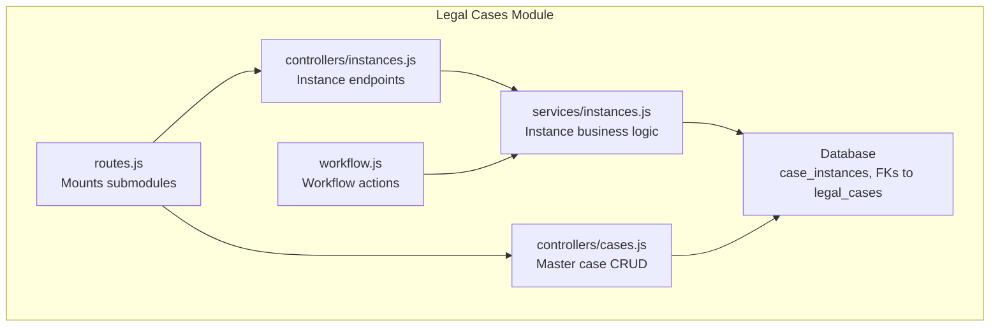
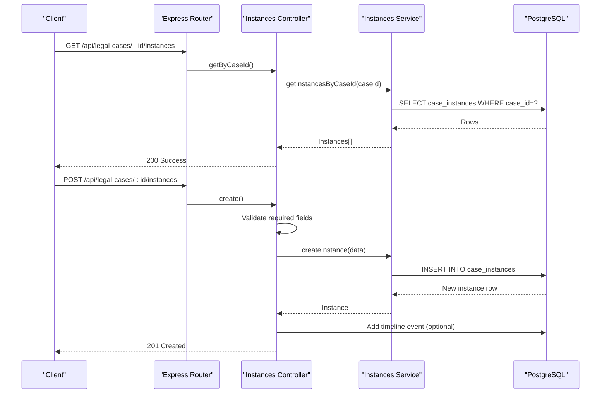
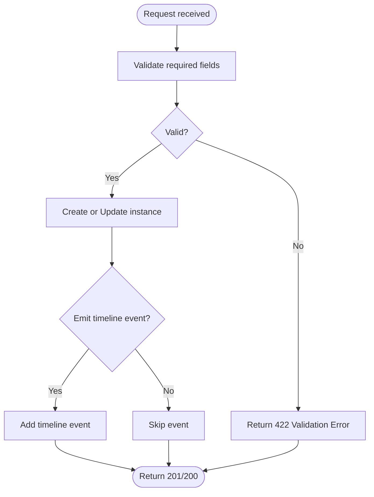
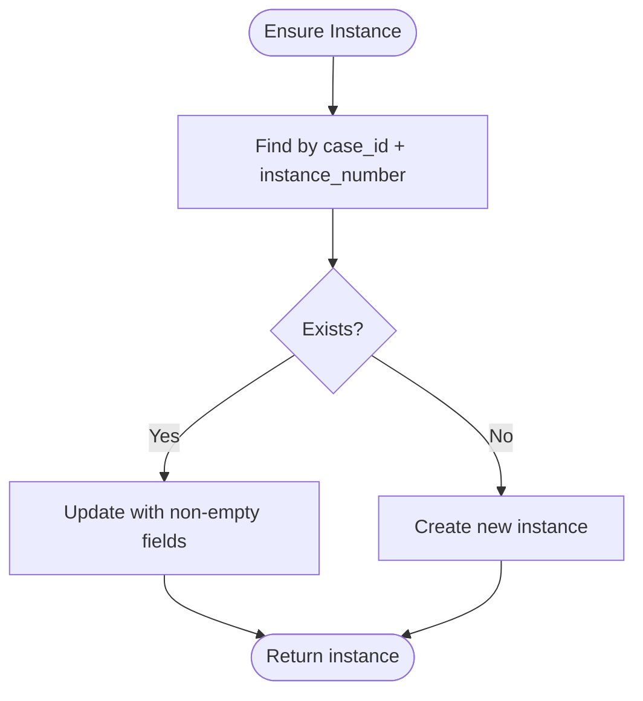
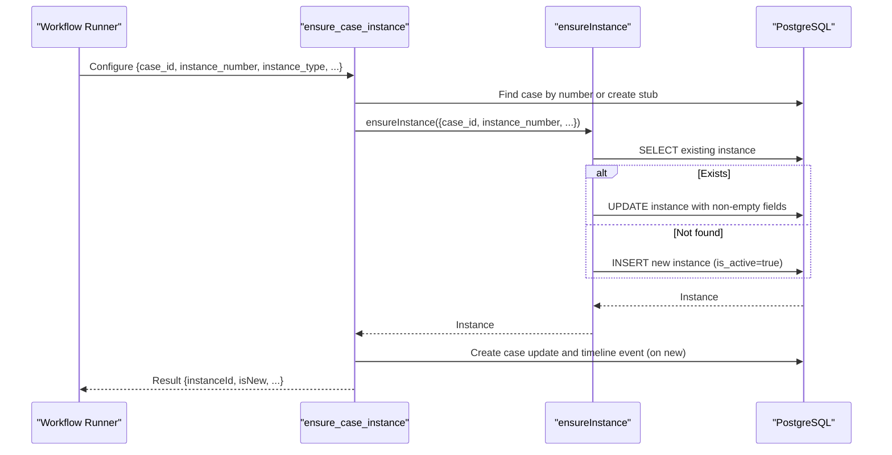
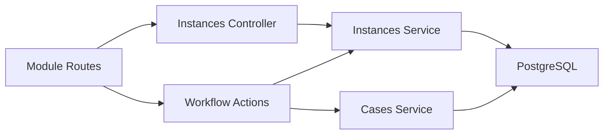

# Case Instance Management

<cite>
**Referenced Files in This Document**
- [instances.js](file://backend/modules/legal_cases/controllers/instances.js)
- [instances.js](file://backend/modules/legal_cases/services/instances.js)
- [routes.js](file://backend/modules/legal_cases/routes.js)
- [index.js](file://backend/modules/legal_cases/index.js)
- [200_case_instances_and_relations.sql](file://backend/migrations/200_case_instances_and_relations.sql)
- [cases.js](file://backend/modules/legal_cases/services/cases.js)
- [workflow.js](file://backend/modules/legal_cases/workflow.js)
- [LEGAL_CASES.md](file://docs/api/LEGAL_CASES.md)
</cite>

## Table of Contents
1. [Introduction](#introduction)
2. [Project Structure](#project-structure)
3. [Core Components](#core-components)
4. [Architecture Overview](#architecture-overview)
5. [Detailed Component Analysis](#detailed-component-analysis)
6. [Dependency Analysis](#dependency-analysis)
7. [Performance Considerations](#performance-considerations)
8. [Troubleshooting Guide](#troubleshooting-guide)
9. [Conclusion](#conclusion)
10. [Appendices](#appendices)

## Introduction
This document explains case instance management within the legal cases module. It defines what case instances are, how they relate to master cases, and how they are created, modified, and deleted. It also covers property inheritance, instance-specific data management, workflow automation, and integration with the broader case management system. Practical usage scenarios, data propagation rules, lifecycle management, and the API endpoints/data structures used for instance operations are documented.

## Project Structure
The legal cases module organizes instance-related functionality under dedicated controller, service, and workflow layers. Routing is centralized and exposes both master case endpoints and instance endpoints.

**Diagram sources**
- [routes.js:1-20](file://backend/modules/legal_cases/routes.js#L1-L20)
- [instances.js:1-123](file://backend/modules/legal_cases/controllers/instances.js#L1-L122)
- [instances.js:1-160](file://backend/modules/legal_cases/services/instances.js#L1-L159)
- [workflow.js:1-583](file://backend/modules/legal_cases/workflow.js#L1-L582)
- [200_case_instances_and_relations.sql:1-41](file://backend/migrations/200_case_instances_and_relations.sql#L1-L40)

**Section sources**
- [routes.js:1-20](file://backend/modules/legal_cases/routes.js#L1-L20)
- [index.js:1-14](file://backend/modules/legal_cases/index.js#L1-L13)

## Core Components
- Instance Controller: Exposes REST endpoints for listing, creating, updating, and deleting case instances. It validates required fields and integrates timeline events.
- Instance Service: Implements data access and business rules for instances, including activation constraints and the ensure-instance pattern used by workflows.
- Database Schema: Defines the case_instances table with foreign keys to legal_cases and optional foreign keys on related entities (documents, events, notes) to associate items with specific instances.
- Workflow Integration: Provides actions to ensure an instance exists for a case and to add timeline events linked to instances.

Key responsibilities:
- Enforce single active instance per case when marking an instance as active.
- Support instance creation with required fields (instance number/type) and optional metadata (court, judge, status).
- Allow updates that propagate to timeline when status or identifiers change.
- Enable workflow-driven creation/update of instances and linking of documents/events/notes to instances.

**Section sources**
- [instances.js:1-123](file://backend/modules/legal_cases/controllers/instances.js#L1-L122)
- [instances.js:1-160](file://backend/modules/legal_cases/services/instances.js#L1-L159)
- [200_case_instances_and_relations.sql:1-41](file://backend/migrations/200_case_instances_and_relations.sql#L1-L40)
- [workflow.js:1-583](file://backend/modules/legal_cases/workflow.js#L1-L582)

## Architecture Overview
The instance management architecture connects HTTP endpoints, business logic, and database constraints. Workflows can programmatically ensure instances exist and link related artifacts to them.

**Diagram sources**
- [instances.js:1-123](file://backend/modules/legal_cases/controllers/instances.js#L1-L122)
- [instances.js:1-160](file://backend/modules/legal_cases/services/instances.js#L1-L159)

## Detailed Component Analysis

### Instance Controller
Responsibilities:
- List instances for a given case.
- Create a new instance with validation for required fields.
- Update an existing instance and optionally emit timeline events on changes.
- Delete an instance.

Behavior highlights:
- Required fields enforced: instance number and instance type.
- On creation, a timeline event is added describing the new instance and its identifier.
- On update, timeline events are added when status or identifiers change.

**Diagram sources**
- [instances.js:23-67](file://backend/modules/legal_cases/controllers/instances.js#L23-L67)
- [instances.js:73-97](file://backend/modules/legal_cases/controllers/instances.js#L73-L97)

**Section sources**
- [instances.js:19-121](file://backend/modules/legal_cases/controllers/instances.js#L19-L121)

### Instance Service
Responsibilities:
- Retrieve instances by case or by ID.
- Create instances with automatic deactivation of other instances for the same case when the new one is set as active.
- Update instances with selective field updates and deactivation of others when activating.
- Delete instances.
- Ensure an instance exists (find or create) used by workflow actions.

Business rules:
- Single active instance per case: setting is_active=true on one instance deactivates all others for the same case.
- COALESCE-based updates prevent unintentional field resets.
- ensureInstance finds by case_id and instance_number; if missing, creates; otherwise updates only non-empty fields.

**Diagram sources**
- [instances.js:129-150](file://backend/modules/legal_cases/services/instances.js#L129-L150)

**Section sources**
- [instances.js:14-123](file://backend/modules/legal_cases/services/instances.js#L14-L123)

### Database Schema and Relationships
The migration defines the case_instances table and adds optional instance_id foreign keys to related entities to enable instance-scoped documents, events, and notes.

Key schema elements:
- Primary key id and foreign key case_id referencing legal_cases.
- Fields: instance_type, instance_number, court_name, judge, status, is_active, timestamps.
- Optional instance_id on case_documents, case_events, case_notes to link items to a specific instance.

Indexing supports efficient filtering by case and instance.

**Section sources**
- [200_case_instances_and_relations.sql:6-34](file://backend/migrations/200_case_instances_and_relations.sql#L6-L34)

### Workflow Automation
Workflow actions integrate with instances:
- ensure_case_instance: Ensures an instance exists for a case (creating a stub case if needed), sets it as active, and emits updates and timeline events when appropriate.
- add_timeline_event: Adds timeline entries optionally linked to an instance.
- attach_document_to_case: Links documents to a case and optionally to an instance.

**Diagram sources**
- [workflow.js:13-112](file://backend/modules/legal_cases/workflow.js#L13-L112)
- [instances.js:129-150](file://backend/modules/legal_cases/services/instances.js#L129-L150)

**Section sources**
- [workflow.js:13-112](file://backend/modules/legal_cases/workflow.js#L13-L112)

### API Endpoints and Data Structures

#### Instance Endpoints
- GET /api/legal-cases/:id/instances
  - Purpose: List all instances for a case.
  - Response: Array of instance objects ordered by creation date ascending.
- POST /api/legal-cases/:id/instances
  - Purpose: Create a new instance for a case.
  - Request body: Requires instance_number and instance_type; optional fields include court_name, judge, status, is_active.
  - Response: Created instance object.
- PATCH /api/legal-cases/instances/:instanceId
  - Purpose: Update an instance.
  - Request body: Selective fields; setting is_active=true activates the instance and deactivates others for the same case.
  - Response: Updated instance object; emits timeline event if status or identifiers change.
- DELETE /api/legal-cases/instances/:instanceId
  - Purpose: Delete an instance.
  - Response: Success message.

#### Instance Data Model
- id: Unique identifier for the instance.
- case_id: Foreign key to the master case.
- instance_type: Type of instance (e.g., first, appeal, cassation, supervision).
- instance_number: Unique identifier for the instance within the case.
- court_name: Name of the court.
- judge: Name of the judge.
- status: Internal status of the instance.
- is_active: Boolean indicating if this is the currently active instance for the case.
- creation_date, updated_at: Timestamps.

Integration with related entities:
- case_documents, case_events, case_notes can optionally link to a specific instance via instance_id, enabling instance-scoped organization.

**Section sources**
- [instances.js:19-121](file://backend/modules/legal_cases/controllers/instances.js#L19-L121)
- [200_case_instances_and_relations.sql:6-34](file://backend/migrations/200_case_instances_and_relations.sql#L6-L34)

## Dependency Analysis
The module exhibits clear separation of concerns:
- Controller depends on Services for business logic.
- Services depend on the database layer for persistence.
- Workflow actions depend on Services to ensure instances and on the cases service for timeline updates.
- Routes mount controllers and expose endpoints under the legal cases prefix.

**Diagram sources**
- [instances.js:1-123](file://backend/modules/legal_cases/controllers/instances.js#L1-L122)
- [instances.js:1-160](file://backend/modules/legal_cases/services/instances.js#L1-L159)
- [workflow.js:1-583](file://backend/modules/legal_cases/workflow.js#L1-L582)
- [routes.js:1-20](file://backend/modules/legal_cases/routes.js#L1-L20)

**Section sources**
- [routes.js:9-17](file://backend/modules/legal_cases/routes.js#L9-L17)
- [index.js:6-13](file://backend/modules/legal_cases/index.js#L6-L13)

## Performance Considerations
- Indexes on case_instances(case_id) and related tables’ instance_id fields support fast filtering and joins.
- COALESCE-based updates minimize unnecessary writes.
- Single active instance constraint ensures predictable queries and avoids ambiguity in active instance selection.

[No sources needed since this section provides general guidance]

## Troubleshooting Guide
Common issues and resolutions:
- Validation failures on create:
  - Ensure instance_number and instance_type are provided; otherwise, the endpoint returns a validation error.
- Activation conflicts:
  - Setting is_active=true on an instance automatically deactivates others for the same case. If none were previously active, this is expected behavior.
- Update without changes:
  - PATCH requests that do not modify status or identifiers will not emit timeline events.
- Timeline event creation failures:
  - Controller/service logs warnings if timeline event creation fails after instance operations; verify case existence and event payload.

**Section sources**
- [instances.js:40-46](file://backend/modules/legal_cases/controllers/instances.js#L40-L46)
- [instances.js:40-46](file://backend/modules/legal_cases/services/instances.js#L40-L46)
- [instances.js:82-94](file://backend/modules/legal_cases/controllers/instances.js#L82-L94)

## Conclusion
Case instances provide a structured way to track procedural stages within a master legal case. The system enforces single active instance semantics, supports instance-scoped documents and events, and integrates tightly with workflows. The APIs and services offer robust mechanisms for creation, modification, and deletion while maintaining data integrity and enabling automation.

[No sources needed since this section summarizes without analyzing specific files]

## Appendices

### Practical Usage Scenarios
- Scenario 1: First Instance Creation
  - Use POST /api/legal-cases/:id/instances with instance_number and instance_type set to first. The system creates the instance and marks it active (deactivating any prior active instances).
- Scenario 2: Adding an Appeal Instance
  - Create a new instance with instance_type set to appeal and a unique instance_number. If this becomes the active instance, previous ones are deactivated.
- Scenario 3: Updating Instance Status
  - PATCH /api/legal-cases/instances/:instanceId with status to reflect procedural progress. A timeline event is emitted describing the change.
- Scenario 4: Workflow-Driven Instance Management
  - Use ensure_case_instance to guarantee an instance exists for a case (including auto-creating a stub case if needed), then attach documents and add timeline events scoped to the instance.

**Section sources**
- [instances.js:33-67](file://backend/modules/legal_cases/controllers/instances.js#L33-L67)
- [instances.js:75-97](file://backend/modules/legal_cases/controllers/instances.js#L75-L97)
- [workflow.js:13-112](file://backend/modules/legal_cases/workflow.js#L13-L112)

### Data Propagation Rules
- Master case fields are not automatically copied to instances; instances maintain their own identifiers and metadata.
- Documents, events, and notes can be associated with a specific instance via instance_id, enabling instance-scoped organization.
- Timeline events can be linked to instances to capture stage-specific activity.

**Section sources**
- [200_case_instances_and_relations.sql:21-28](file://backend/migrations/200_case_instances_and_relations.sql#L21-L28)
- [workflow.js:301-353](file://backend/modules/legal_cases/workflow.js#L301-L353)

### Instance Lifecycle Management
- Creation: Validate required fields, insert record, optionally emit timeline event.
- Activation: Setting is_active=true deactivates other instances for the same case.
- Modification: Update selective fields; emit timeline events on status or identifier changes.
- Deletion: Remove instance; related items remain unless explicitly re-associated.

**Section sources**
- [instances.js:37-67](file://backend/modules/legal_cases/services/instances.js#L37-L67)
- [instances.js:75-113](file://backend/modules/legal_cases/services/instances.js#L75-L113)
- [instances.js:120-123](file://backend/modules/legal_cases/services/instances.js#L120-L123)