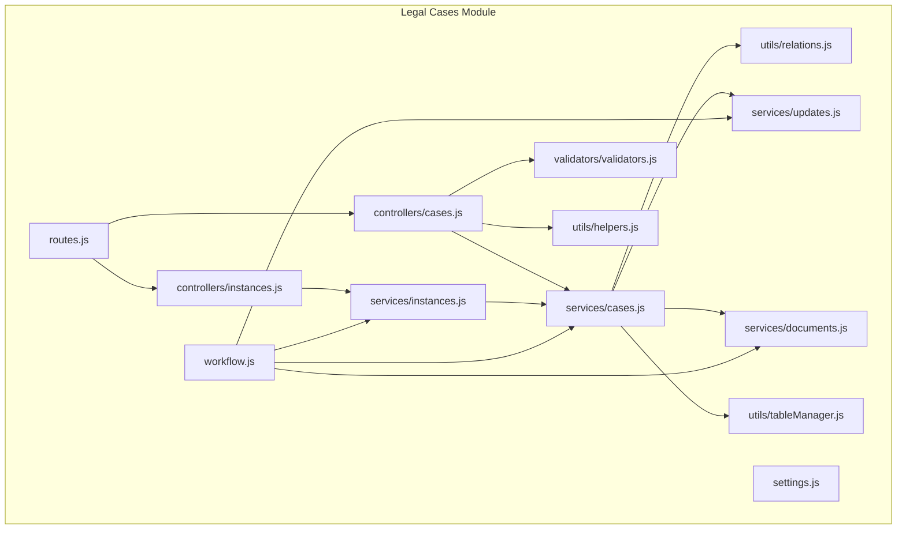
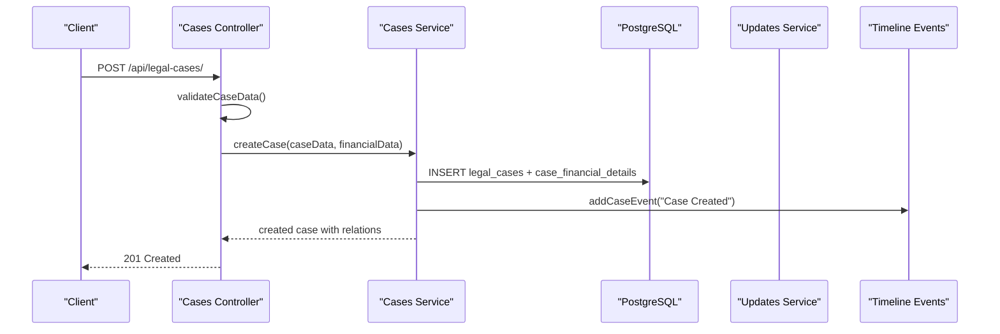
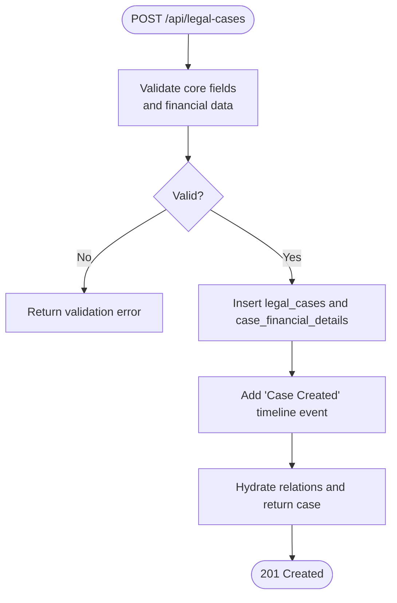
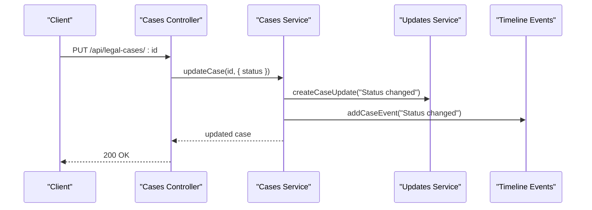
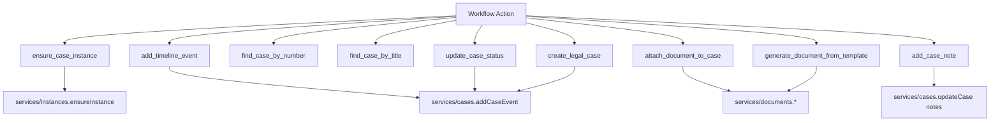
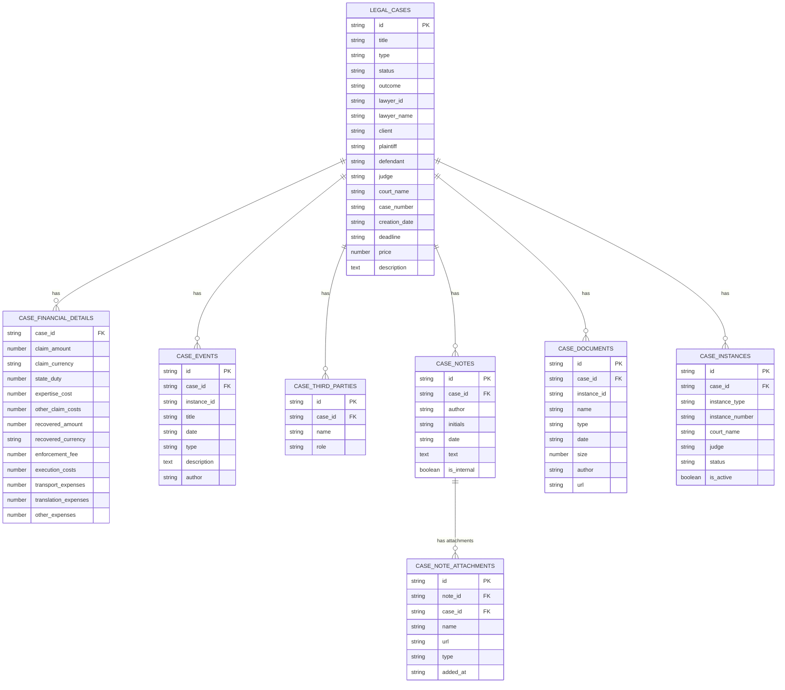
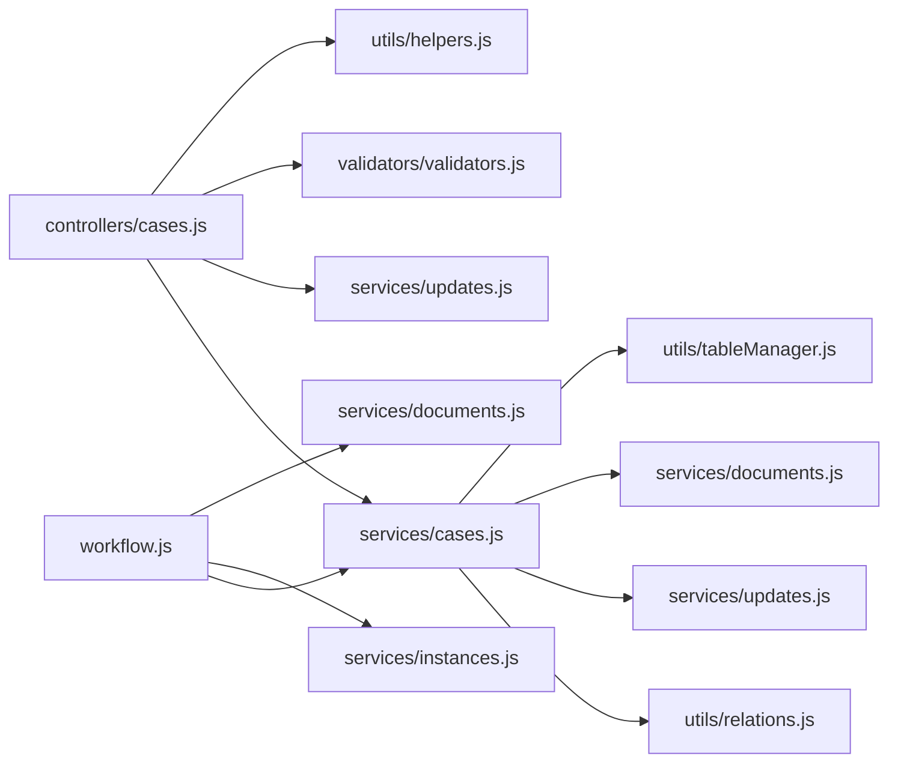

# Case Lifecycle Management

<cite>
**Referenced Files in This Document**
- [README.md](file://backend/modules/legal_cases/README.md)
- [index.js](file://backend/modules/legal_cases/index.js)
- [routes.js](file://backend/modules/legal_cases/routes.js)
- [cases.js](file://backend/modules/legal_cases/controllers/cases.js)
- [instances.js](file://backend/modules/legal_cases/controllers/instances.js)
- [cases.js](file://backend/modules/legal_cases/services/cases.js)
- [instances.js](file://backend/modules/legal_cases/services/instances.js)
- [documents.js](file://backend/modules/legal_cases/services/documents.js)
- [updates.js](file://backend/modules/legal_cases/services/updates.js)
- [relations.js](file://backend/modules/legal_cases/utils/relations.js)
- [tableManager.js](file://backend/modules/legal_cases/utils/tableManager.js)
- [helpers.js](file://backend/modules/legal_cases/utils/helpers.js)
- [validators.js](file://backend/modules/legal_cases/validators/validators.js)
- [workflow.js](file://backend/modules/legal_cases/workflow.js)
- [settings.js](file://backend/modules/legal_cases/settings.js)
</cite>

## Table of Contents
1. [Introduction](#introduction)
2. [Project Structure](#project-structure)
3. [Core Components](#core-components)
4. [Architecture Overview](#architecture-overview)
5. [Detailed Component Analysis](#detailed-component-analysis)
6. [Dependency Analysis](#dependency-analysis)
7. [Performance Considerations](#performance-considerations)
8. [Troubleshooting Guide](#troubleshooting-guide)
9. [Conclusion](#conclusion)
10. [Appendices](#appendices)

## Introduction
This document describes the Case Lifecycle Management system within the Titan CRM legal cases module. It covers the complete lifecycle from case creation to closure, including initial setup, required fields validation, default status assignments, status tracking and transitions, workflow automation, closure and archival procedures, and relationships with related entities such as contractors, tasks, and calendar events. Practical examples illustrate workflows, status change scenarios, and automated triggers. Code examples are referenced via precise file paths and line ranges.

## Project Structure
The legal cases module follows a layered architecture:
- Controllers handle HTTP requests and responses.
- Services encapsulate business logic and interact with the database.
- Utilities provide helpers for normalization, extraction, relations hydration, and table management.
- Validators enforce required fields and data types.
- Workflow actions integrate with the broader workflow engine to automate case-related tasks.
- Settings define module behavior and defaults.

**Diagram sources**
- [routes.js:1-20](file://backend/modules/legal_cases/routes.js#L1-L20)
- [cases.js:1-299](file://backend/modules/legal_cases/controllers/cases.js#L1-L299)
- [instances.js:1-160](file://backend/modules/legal_cases/controllers/instances.js#L1-L122)
- [cases.js:1-686](file://backend/modules/legal_cases/services/cases.js#L1-L686)
- [instances.js:1-160](file://backend/modules/legal_cases/services/instances.js#L1-L159)
- [documents.js:1-182](file://backend/modules/legal_cases/services/documents.js#L1-L181)
- [updates.js:1-179](file://backend/modules/legal_cases/services/updates.js#L1-L178)
- [relations.js:1-127](file://backend/modules/legal_cases/utils/relations.js#L1-L126)
- [tableManager.js:1-69](file://backend/modules/legal_cases/utils/tableManager.js#L1-L68)
- [helpers.js:1-56](file://backend/modules/legal_cases/utils/helpers.js#L1-L55)
- [validators.js:1-160](file://backend/modules/legal_cases/validators/validators.js#L1-L159)
- [workflow.js:1-583](file://backend/modules/legal_cases/workflow.js#L1-L582)
- [settings.js:1-27](file://backend/modules/legal_cases/settings.js#L1-L26)

**Section sources**
- [README.md:1-299](file://backend/modules/legal_cases/README.md#L1-L298)
- [index.js:1-14](file://backend/modules/legal_cases/index.js#L1-L13)
- [routes.js:1-20](file://backend/modules/legal_cases/routes.js#L1-L20)

## Core Components
- Controllers: Expose CRUD endpoints for cases and instances, manage validation, and delegate to services.
- Services: Implement business logic for case creation/update/delete, timeline events, notes, documents, and updates.
- Utilities: Normalize fields, hydrate relations, ensure support tables, and provide helpers.
- Validators: Enforce required fields and sanitize numeric/text values.
- Workflow: Provide reusable actions to search cases, ensure instances, add timeline events, attach documents, create cases, update status, generate documents, and add notes.
- Settings: Define display defaults, enabled features, and default status/priority.

Key responsibilities:
- Case creation validates required fields and persists core and financial data, creates automatic creation events, and hydrates related entities.
- Status transitions trigger notifications and timeline entries.
- Workflow automations integrate with documents, instances, and updates.

**Section sources**
- [cases.js:1-299](file://backend/modules/legal_cases/controllers/cases.js#L1-L299)
- [cases.js:1-686](file://backend/modules/legal_cases/services/cases.js#L1-L686)
- [validators.js:1-160](file://backend/modules/legal_cases/validators/validators.js#L1-L159)
- [workflow.js:1-583](file://backend/modules/legal_cases/workflow.js#L1-L582)
- [settings.js:1-27](file://backend/modules/legal_cases/settings.js#L1-L26)

## Architecture Overview
The system separates concerns across layers:
- HTTP layer (controllers) validates inputs and delegates to services.
- Business logic (services) interacts with the database and emits notifications and timeline events.
- Utilities encapsulate normalization, relation hydration, and dynamic column handling.
- Workflow integrates with services to automate common case operations.

**Diagram sources**
- [cases.js:57-106](file://backend/modules/legal_cases/controllers/cases.js#L57-L106)
- [cases.js:164-266](file://backend/modules/legal_cases/services/cases.js#L164-L266)
- [updates.js:93-122](file://backend/modules/legal_cases/services/updates.js#L93-L122)

## Detailed Component Analysis

### Case Creation Process
- Required fields validation ensures title, type, status, lawyer_id, case_number, and creation_date are present and sanitized.
- Financial data is validated separately and persisted into a dedicated table.
- On successful creation, an automatic timeline event is added and the hydrated case is returned.

**Diagram sources**
- [cases.js:57-106](file://backend/modules/legal_cases/controllers/cases.js#L57-L106)
- [validators.js:12-97](file://backend/modules/legal_cases/validators/validators.js#L12-L97)
- [cases.js:164-266](file://backend/modules/legal_cases/services/cases.js#L164-L266)

**Section sources**
- [cases.js:57-106](file://backend/modules/legal_cases/controllers/cases.js#L57-L106)
- [validators.js:12-97](file://backend/modules/legal_cases/validators/validators.js#L12-L97)
- [cases.js:164-266](file://backend/modules/legal_cases/services/cases.js#L164-L266)

### Status Tracking and Transitions
- Status changes trigger:
  - A case update notification with old/new labels.
  - A timeline event reflecting the status change.
- The system maps internal status keys to localized labels for notifications.

**Diagram sources**
- [cases.js:112-162](file://backend/modules/legal_cases/controllers/cases.js#L112-L162)
- [cases.js:322-362](file://backend/modules/legal_cases/services/cases.js#L322-L362)
- [updates.js:93-122](file://backend/modules/legal_cases/services/updates.js#L93-L122)

**Section sources**
- [cases.js:322-362](file://backend/modules/legal_cases/services/cases.js#L322-L362)
- [updates.js:93-122](file://backend/modules/legal_cases/services/updates.js#L93-L122)

### Workflow Automation
The workflow module provides actions to:
- Ensure a case instance exists or create a stub case by number.
- Add timeline events to a case.
- Find cases by number or title with optional status filtering.
- Attach documents to a case from the documents module.
- Create new legal cases programmatically.
- Update case status.
- Generate documents from templates and attach them to cases.
- Add notes to cases.

**Diagram sources**
- [workflow.js:11-583](file://backend/modules/legal_cases/workflow.js#L11-L582)
- [instances.js:129-150](file://backend/modules/legal_cases/services/instances.js#L129-L150)
- [cases.js:655-676](file://backend/modules/legal_cases/services/cases.js#L655-L676)
- [documents.js:1-182](file://backend/modules/legal_cases/services/documents.js#L1-L181)

**Section sources**
- [workflow.js:11-583](file://backend/modules/legal_cases/workflow.js#L11-L582)

### Case Closure and Archive Procedures
- Closure is represented by status transitions to terminal states (e.g., done, archived).
- The system does not define a dedicated “close case” endpoint; closure is achieved by updating the status and adding appropriate timeline events and notes.
- Archival is supported by status values and can be combined with document and note archival practices.

Practical steps:
- Transition status to a terminal value (e.g., done or archived).
- Add a timeline event documenting closure.
- Optionally add a note summarizing outcomes and next steps.
- Use workflow actions to automate closure-related tasks.

**Section sources**
- [cases.js:322-362](file://backend/modules/legal_cases/services/cases.js#L322-L362)
- [workflow.js:388-415](file://backend/modules/legal_cases/workflow.js#L388-L415)

### Relationship with Related Entities
- Contractors: Linked via contractor_id during creation; searchable by title/number.
- Tasks: Not directly exposed in the cited files; integration would occur via cross-module references or workflow triggers.
- Calendar events: The module supports timeline events; calendar integration would require additional mapping of events to calendar entries.

**Diagram sources**
- [cases.js:164-266](file://backend/modules/legal_cases/services/cases.js#L164-L266)
- [relations.js:87-119](file://backend/modules/legal_cases/utils/relations.js#L87-L119)
- [instances.js:14-67](file://backend/modules/legal_cases/services/instances.js#L14-L67)

**Section sources**
- [relations.js:87-119](file://backend/modules/legal_cases/utils/relations.js#L87-L119)
- [cases.js:164-266](file://backend/modules/legal_cases/services/cases.js#L164-L266)

### Practical Examples

#### Example 1: Creating a Case
- Endpoint: POST /api/legal-cases/
- Required fields: title, type, status, lawyer_id, case_number, creation_date.
- Financial data: claimAmount, recoveredAmount, and related fields are validated and persisted.
- Outcome: Automatic timeline event “Case Created.”

References:
- [cases.js:57-106](file://backend/modules/legal_cases/controllers/cases.js#L57-L106)
- [validators.js:12-97](file://backend/modules/legal_cases/validators/validators.js#L12-L97)
- [cases.js:164-266](file://backend/modules/legal_cases/services/cases.js#L164-L266)

#### Example 2: Updating Case Status
- Endpoint: PUT /api/legal-cases/:id
- Trigger: Notification and timeline event on status change.
- Outcome: Updated case with hydrated relations.

References:
- [cases.js:112-162](file://backend/modules/legal_cases/controllers/cases.js#L112-L162)
- [cases.js:322-362](file://backend/modules/legal_cases/services/cases.js#L322-L362)

#### Example 3: Workflow Automation
- Ensure instance: [workflow.js:13-112](file://backend/modules/legal_cases/workflow.js#L13-L112)
- Add timeline event: [workflow.js:114-151](file://backend/modules/legal_cases/workflow.js#L114-L151)
- Attach document: [workflow.js:248-354](file://backend/modules/legal_cases/workflow.js#L248-L354)
- Generate document from template: [workflow.js:417-533](file://backend/modules/legal_cases/workflow.js#L417-L533)

#### Example 4: Finding Cases
- By number: [workflow.js:153-220](file://backend/modules/legal_cases/workflow.js#L153-L220)
- By title: [workflow.js:222-246](file://backend/modules/legal_cases/workflow.js#L222-L246)

## Dependency Analysis
- Controllers depend on validators and services; they also call utility helpers to ensure support tables and extract payloads.
- Services depend on database queries, relation hydration, and update/notification services.
- Workflow actions depend on services and database to orchestrate case operations.

**Diagram sources**
- [cases.js:1-299](file://backend/modules/legal_cases/controllers/cases.js#L1-L299)
- [cases.js:1-686](file://backend/modules/legal_cases/services/cases.js#L1-L686)
- [updates.js:1-179](file://backend/modules/legal_cases/services/updates.js#L1-L178)
- [validators.js:1-160](file://backend/modules/legal_cases/validators/validators.js#L1-L159)
- [helpers.js:1-56](file://backend/modules/legal_cases/utils/helpers.js#L1-L55)
- [relations.js:1-127](file://backend/modules/legal_cases/utils/relations.js#L1-L126)
- [tableManager.js:1-69](file://backend/modules/legal_cases/utils/tableManager.js#L1-L68)
- [workflow.js:1-583](file://backend/modules/legal_cases/workflow.js#L1-L582)

**Section sources**
- [cases.js:1-299](file://backend/modules/legal_cases/controllers/cases.js#L1-L299)
- [cases.js:1-686](file://backend/modules/legal_cases/services/cases.js#L1-L686)
- [workflow.js:1-583](file://backend/modules/legal_cases/workflow.js#L1-L582)

## Performance Considerations
- Batch operations: When updating notes or documents, the current implementation deletes and reinserts; consider optimizing for large batches to reduce I/O.
- Indexes: Ensure database indexes exist on frequently queried columns (e.g., case_number, status, lawyer_id).
- Hydration: Relation hydration loads multiple child tables; paginate or limit where feasible.
- Asynchronous file deletion: Used for attachments and documents; keep asynchronous cleanup to avoid blocking requests.

## Troubleshooting Guide
Common issues and resolutions:
- Validation failures on creation: Ensure required fields are present and properly formatted; check validator outputs for specific errors.
- Missing internal notes column: The system dynamically detects is_internal or isinternal; if absent, adjust schema or rely on fallback behavior.
- Timeline event creation errors: Verify case existence and author values; ensure addCaseEvent is called after updates.
- Workflow action errors: Validate inputs (e.g., case_id, title, doc_name) and confirm database records exist before linking.

**Section sources**
- [validators.js:12-97](file://backend/modules/legal_cases/validators/validators.js#L12-L97)
- [relations.js:17-42](file://backend/modules/legal_cases/utils/relations.js#L17-L42)
- [cases.js:322-362](file://backend/modules/legal_cases/services/cases.js#L322-L362)
- [workflow.js:248-354](file://backend/modules/legal_cases/workflow.js#L248-L354)

## Conclusion
The Case Lifecycle Management system provides a robust, modular foundation for managing legal cases. It enforces required fields, tracks status changes, integrates with timeline and notifications, and exposes workflow actions to automate common tasks. The architecture cleanly separates concerns, enabling maintainability and extensibility. For closure and archival, leverage status transitions and workflow actions to document outcomes and streamline administrative tasks.

## Appendices

### API Endpoints Summary
- Get all cases: GET /api/legal-cases/
- Get case by ID: GET /api/legal-cases/:id
- Create case: POST /api/legal-cases/
- Update case: PUT /api/legal-cases/:id
- Delete case: DELETE /api/legal-cases/:id
- Get unviewed updates: GET /api/legal-cases/:id/updates/unviewed
- Mark updates viewed: POST /api/legal-cases/:id/updates/mark-viewed
- Delete update: DELETE /api/legal-cases/:id/updates/:updateId
- Delete all updates: DELETE /api/legal-cases/:id/updates

**Section sources**
- [README.md:61-81](file://backend/modules/legal_cases/README.md#L61-L81)
- [cases.js:287-296](file://backend/modules/legal_cases/controllers/cases.js#L287-L296)

### Default Settings
- Display defaults: items per page, sort order, default view, show closed.
- Features: document tracking, reminders, reporting, hearing schedule, costs tracking, third parties, notes, attachments.
- Defaults: priority, status.

**Section sources**
- [settings.js:1-27](file://backend/modules/legal_cases/settings.js#L1-L26)