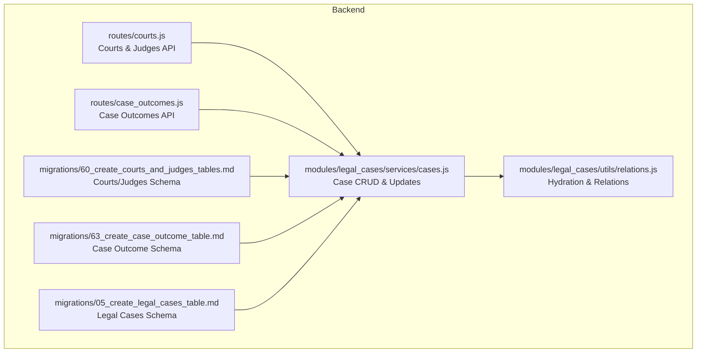
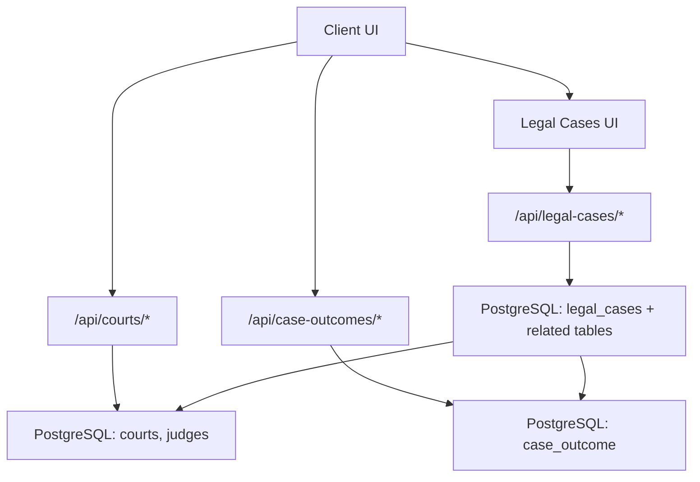
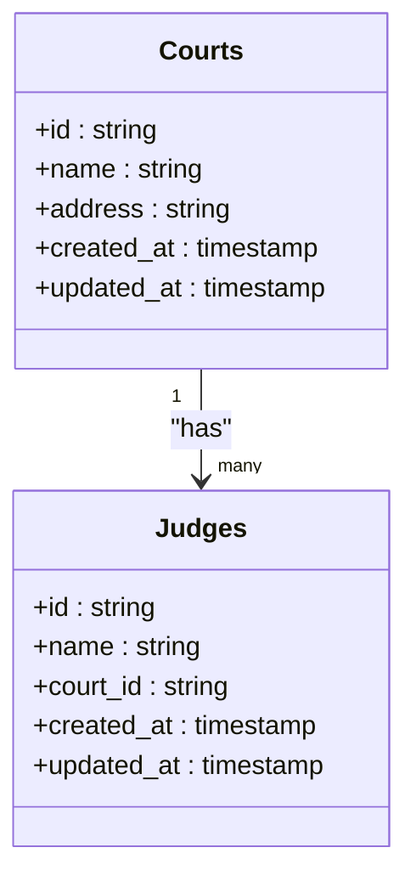
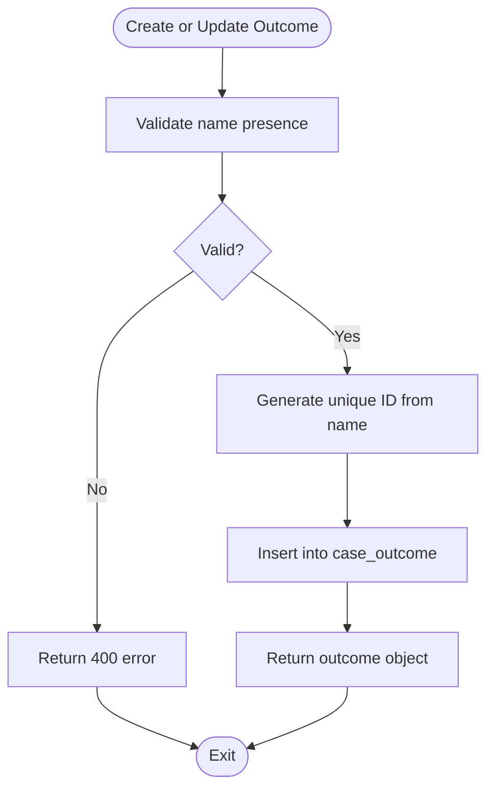
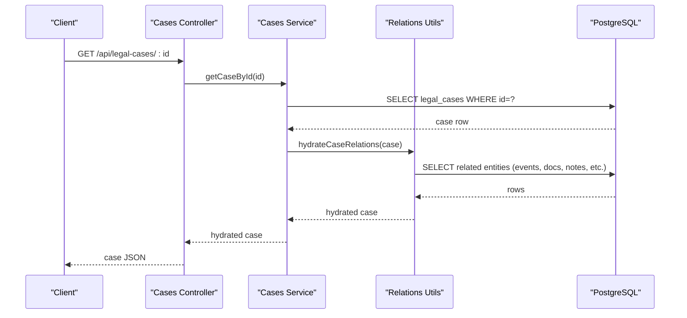
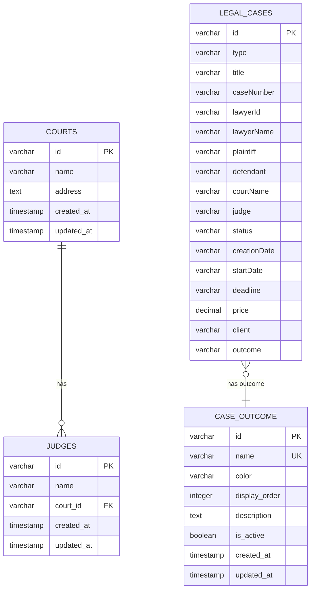
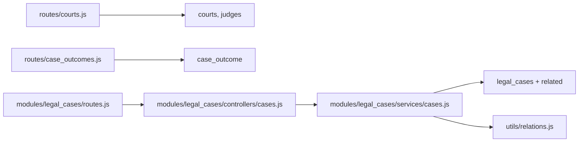

# Court Integration and Management

<cite>
**Referenced Files in This Document**
- [courts.js](file://backend/modules/legal_cases/controllers/courts.js)
- [case_outcomes.js](file://backend/modules/legal_cases/controllers/caseOutcomes.js)
- [cases.js](file://backend/modules/legal_cases/services/cases.js)
- [helpers.js](file://backend/modules/legal_cases/utils/helpers.js)
- [relations.js](file://backend/modules/legal_cases/utils/relations.js)
- [cases controller](file://backend/modules/legal_cases/controllers/cases.js)
- [routes.js](file://backend/modules/legal_cases/routes.js)
- [60_create_courts_and_judges_tables.md](file://backend/migrations/60_create_courts_and_judges_tables.md)
- [63_create_case_outcome_table.md](file://backend/migrations/63_create_case_outcome_table.md)
- [63_create_case_outcome_table.sql](file://backend/migrations/63_create_case_outcome_table.sql)
- [05_create_legal_cases_table.md](file://backend/migrations/05_create_legal_cases_table.md)
- [61_add_missing_legal_cases_columns.md](file://backend/migrations/61_add_missing_legal_cases_columns.md)
- [db-structure.json](file://backend/config/db-structure.json)
- [courts-judges-integration.md](file://docs/courts-judges-integration.md)
- [seed_all.sql](file://backend/seeds/seed_all.sql)
</cite>

## Table of Contents
1. [Introduction](#introduction)
2. [Project Structure](#project-structure)
3. [Core Components](#core-components)
4. [Architecture Overview](#architecture-overview)
5. [Detailed Component Analysis](#detailed-component-analysis)
6. [Dependency Analysis](#dependency-analysis)
7. [Performance Considerations](#performance-considerations)
8. [Troubleshooting Guide](#troubleshooting-guide)
9. [Conclusion](#conclusion)
10. [Appendices](#appendices)

## Introduction
This document describes the court integration and management capabilities implemented in the system. It covers:
- Court and judge management with data synchronization and lookup mechanisms
- Relationship mapping between courts, judges, and legal cases
- Integration with external court databases and how case information is linked to judicial entities
- Case outcome tracking system and how verdicts and decisions are recorded and managed
- Practical examples of court data integration, case assignment to courts, and outcome recording workflows
- Data models for courts, judges, and their relationships with legal cases

## Project Structure
The court integration spans backend routes, database migrations, and legal case services. Courts and judges are exposed via dedicated API endpoints, while case outcomes are managed through a configurable outcomes table. Legal case records maintain references to courts and outcomes.

**Diagram sources**
- [courts.js:1-114](file://backend/modules/legal_cases/controllers/courts.js#L1-L114)
- [case_outcomes.js:1-174](file://backend/modules/legal_cases/controllers/caseOutcomes.js#L1-L170)
- [cases.js:1-686](file://backend/modules/legal_cases/services/cases.js#L1-L686)
- [relations.js:1-127](file://backend/modules/legal_cases/utils/relations.js#L1-L126)
- [60_create_courts_and_judges_tables.md:1-47](file://backend/migrations/60_create_courts_and_judges_tables.md#L1-L46)
- [63_create_case_outcome_table.md:1-33](file://backend/migrations/63_create_case_outcome_table.md#L1-L32)
- [05_create_legal_cases_table.md:1-130](file://backend/migrations/05_create_legal_cases_table.md#L1-L130)

**Section sources**
- [courts.js:1-114](file://backend/modules/legal_cases/controllers/courts.js#L1-L114)
- [case_outcomes.js:1-174](file://backend/modules/legal_cases/controllers/caseOutcomes.js#L1-L170)
- [cases.js:1-686](file://backend/modules/legal_cases/services/cases.js#L1-L686)
- [relations.js:1-127](file://backend/modules/legal_cases/utils/relations.js#L1-L126)
- [60_create_courts_and_judges_tables.md:1-47](file://backend/migrations/60_create_courts_and_judges_tables.md#L1-L46)
- [63_create_case_outcome_table.md:1-33](file://backend/migrations/63_create_case_outcome_table.md#L1-L32)
- [05_create_legal_cases_table.md:1-130](file://backend/migrations/05_create_legal_cases_table.md#L1-L130)

## Core Components
- Courts and Judges API: Provides endpoints to list, create, update, and delete courts and judges, including judge-to-court relationships.
- Case Outcomes API: Manages customizable outcomes (e.g., won, lost, partial) with color and ordering attributes.
- Legal Cases Services: Handles creation, updates, and deletion of legal cases, including hydration of related data (events, documents, notes, third parties).
- Database Migrations: Define schema for courts, judges, case outcomes, and legal cases with appropriate constraints and defaults.

Key responsibilities:
- Data synchronization: Courts and judges are fetched from the database and exposed via REST endpoints.
- Lookup mechanisms: Frontend components fetch dynamic lists from the API instead of relying on hardcoded data.
- Relationship mapping: Legal cases reference courts and outcomes; judges are linked to courts.
- Outcome tracking: Case outcomes are stored in a separate table and can be customized via settings.

**Section sources**
- [courts.js:9-111](file://backend/modules/legal_cases/controllers/courts.js#L9-L111)
- [case_outcomes.js:33-171](file://backend/modules/legal_cases/controllers/caseOutcomes.js#L33-L170)
- [cases.js:112-156](file://backend/modules/legal_cases/services/cases.js#L112-L156)
- [relations.js:87-119](file://backend/modules/legal_cases/utils/relations.js#L87-L119)
- [60_create_courts_and_judges_tables.md:13-46](file://backend/migrations/60_create_courts_and_judges_tables.md#L13-L46)
- [63_create_case_outcome_table.md:8-26](file://backend/migrations/63_create_case_outcome_table.md#L8-L26)
- [05_create_legal_cases_table.md:7-25](file://backend/migrations/05_create_legal_cases_table.md#L7-L25)

## Architecture Overview
The system integrates courts and judges with legal cases through:
- API-driven data loading for dynamic lists
- Foreign key relationships between tables
- Case outcome management decoupled from case records
- Case update and timeline events triggered by status changes

**Diagram sources**
- [courts.js:9-111](file://backend/modules/legal_cases/controllers/courts.js#L9-L111)
- [case_outcomes.js:33-171](file://backend/modules/legal_cases/controllers/caseOutcomes.js#L33-L170)
- [cases.js:112-156](file://backend/modules/legal_cases/services/cases.js#L112-L156)
- [05_create_legal_cases_table.md:7-25](file://backend/migrations/05_create_legal_cases_table.md#L7-L25)

## Detailed Component Analysis

### Courts and Judges Management
Courts and judges are modeled with a one-to-many relationship. The API supports:
- Listing all courts and judges
- Creating, updating, and deleting courts and judges
- Fetching a single judge with associated court name via a join

**Diagram sources**
- [60_create_courts_and_judges_tables.md:14-30](file://backend/migrations/60_create_courts_and_judges_tables.md#L14-L30)
- [courts.js:10-111](file://backend/modules/legal_cases/controllers/courts.js#L10-L111)

Practical example: Loading judges and courts in the frontend was migrated from hardcoded data to API-driven lists.

**Section sources**
- [courts.js:9-111](file://backend/modules/legal_cases/controllers/courts.js#L9-L111)
- [60_create_courts_and_judges_tables.md:1-47](file://backend/migrations/60_create_courts_and_judges_tables.md#L1-L46)
- [courts-judges-integration.md:58-81](file://docs/courts-judges-integration.md#L58-L81)

### Case Outcome Tracking System
Case outcomes are stored in a dedicated table with attributes for customization (color, order, description) and activation state. The API supports:
- Retrieving all outcomes with ordering
- Getting a specific outcome by ID
- Creating, updating, and deleting outcomes
- Reordering outcomes via a dedicated endpoint

**Diagram sources**
- [case_outcomes.js:55-81](file://backend/modules/legal_cases/controllers/caseOutcomes.js#L55-L81)
- [63_create_case_outcome_table.md:8-26](file://backend/migrations/63_create_case_outcome_table.md#L8-L26)

**Section sources**
- [case_outcomes.js:33-171](file://backend/modules/legal_cases/controllers/caseOutcomes.js#L33-L170)
- [63_create_case_outcome_table.md:1-33](file://backend/migrations/63_create_case_outcome_table.md#L1-L32)
- [63_create_case_outcome_table.sql:1-23](file://backend/migrations/63_create_case_outcome_table.sql#L1-L22)
- [seed_all.sql:79-84](file://backend/seeds/seed_all.sql#L79-L84)

### Legal Cases and Relationship Mapping
Legal cases maintain references to courts and outcomes. The service layer:
- Hydrates related entities (events, documents, notes, third parties)
- Normalizes core fields and financial details
- Triggers timeline events and case updates upon status changes

**Diagram sources**
- [cases controller:22-51](file://backend/modules/legal_cases/controllers/cases.js#L22-L51)
- [cases.js:146-156](file://backend/modules/legal_cases/services/cases.js#L146-L156)
- [relations.js:87-119](file://backend/modules/legal_cases/utils/relations.js#L87-L119)

**Section sources**
- [cases.js:112-156](file://backend/modules/legal_cases/services/cases.js#L112-L156)
- [relations.js:87-119](file://backend/modules/legal_cases/utils/relations.js#L87-L119)
- [helpers.js:32-55](file://backend/modules/legal_cases/utils/helpers.js#L32-L55)
- [05_create_legal_cases_table.md:7-25](file://backend/migrations/05_create_legal_cases_table.md#L7-L25)
- [61_add_missing_legal_cases_columns.md:6-26](file://backend/migrations/61_add_missing_legal_cases_columns.md#L6-L26)

### Data Models and Synchronization
- Courts and judges schema define primary keys, timestamps, and foreign keys.
- Case outcomes schema defines unique names, color, display order, and activation flag.
- Legal cases schema includes fields for type, title, parties, court and judge identifiers, status, deadlines, pricing, and outcome references.

**Diagram sources**
- [60_create_courts_and_judges_tables.md:14-30](file://backend/migrations/60_create_courts_and_judges_tables.md#L14-L30)
- [63_create_case_outcome_table.md:8-18](file://backend/migrations/63_create_case_outcome_table.md#L8-L18)
- [05_create_legal_cases_table.md:7-25](file://backend/migrations/05_create_legal_cases_table.md#L7-L25)

**Section sources**
- [60_create_courts_and_judges_tables.md:1-47](file://backend/migrations/60_create_courts_and_judges_tables.md#L1-L46)
- [63_create_case_outcome_table.md:1-33](file://backend/migrations/63_create_case_outcome_table.md#L1-L32)
- [05_create_legal_cases_table.md:1-130](file://backend/migrations/05_create_legal_cases_table.md#L1-L130)
- [db-structure.json:1-2399](file://backend/config/db-structure.json#L1-L2399)

## Dependency Analysis
- Routes depend on database queries and response helpers.
- Legal cases service depends on relation hydration utilities and normalization helpers.
- Courts and judges API depends on the courts and judges tables.
- Case outcomes API depends on the case_outcome table.
- Legal cases schema depends on related tables for events, documents, notes, and financial details.

**Diagram sources**
- [courts.js:1-114](file://backend/modules/legal_cases/controllers/courts.js#L1-L114)
- [case_outcomes.js:1-174](file://backend/modules/legal_cases/controllers/caseOutcomes.js#L1-L170)
- [cases.js:1-686](file://backend/modules/legal_cases/services/cases.js#L1-L686)
- [relations.js:1-127](file://backend/modules/legal_cases/utils/relations.js#L1-L126)
- [cases controller:1-299](file://backend/modules/legal_cases/controllers/cases.js#L1-L299)
- [routes.js:1-20](file://backend/modules/legal_cases/routes.js#L1-L20)

**Section sources**
- [courts.js:1-114](file://backend/modules/legal_cases/controllers/courts.js#L1-L114)
- [case_outcomes.js:1-174](file://backend/modules/legal_cases/controllers/caseOutcomes.js#L1-L170)
- [cases.js:1-686](file://backend/modules/legal_cases/services/cases.js#L1-L686)
- [relations.js:1-127](file://backend/modules/legal_cases/utils/relations.js#L1-L126)
- [cases controller:1-299](file://backend/modules/legal_cases/controllers/cases.js#L1-L299)
- [routes.js:1-20](file://backend/modules/legal_cases/routes.js#L1-L20)

## Performance Considerations
- Use database indexes on frequently queried columns (IDs, names, foreign keys).
- Batch operations for reordering outcomes to minimize round-trips.
- Normalize and cache column names for dynamic note internal flags to avoid repeated schema checks.
- Paginate large lists of courts and outcomes when UI requires it.

## Troubleshooting Guide
Common issues and resolutions:
- Not found responses: Ensure IDs exist in the courts, judges, or outcomes tables before querying.
- Validation failures: Verify required fields (e.g., outcome name) before creating or updating outcomes.
- Authorization for private notes: Provide the required user ID header when saving internal notes.
- Schema mismatches: Confirm that legal cases include the client and outcome columns as per migration 61.

**Section sources**
- [courts.js:27-32](file://backend/modules/legal_cases/controllers/courts.js#L27-L32)
- [case_outcomes.js:42-53](file://backend/modules/legal_cases/controllers/caseOutcomes.js#L42-L53)
- [cases controller:142-150](file://backend/modules/legal_cases/controllers/cases.js#L142-L150)
- [61_add_missing_legal_cases_columns.md:6-26](file://backend/migrations/61_add_missing_legal_cases_columns.md#L6-L26)

## Conclusion
The court integration and management system provides robust APIs for managing courts and judges, linking them to legal cases, and tracking outcomes. The modular design enables extensibility, while migrations and seeding ensure consistent data models. The legal cases service centralizes hydration and updates, supporting a comprehensive case lifecycle.

## Appendices

### Practical Examples

- Court data integration
  - Load courts and judges dynamically in the UI by calling the courts API endpoints.
  - Replace hardcoded data with API-driven lists as documented in the integration guide.

- Case assignment to courts
  - When creating or updating a case, populate the court name and judge fields.
  - Legal cases service hydrates related entities and maintains referential integrity.

- Outcome recording workflows
  - Use the outcomes API to create, reorder, and manage outcomes.
  - Assign outcomes to cases via the legal cases service; outcomes are stored separately for customization.

**Section sources**
- [courts-judges-integration.md:58-81](file://docs/courts-judges-integration.md#L58-L81)
- [cases.js:164-266](file://backend/modules/legal_cases/services/cases.js#L164-L266)
- [case_outcomes.js:55-171](file://backend/modules/legal_cases/controllers/caseOutcomes.js#L55-L170)