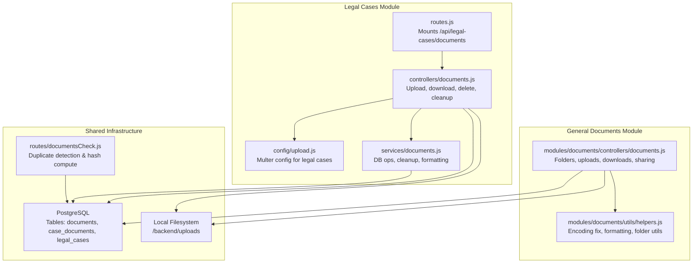
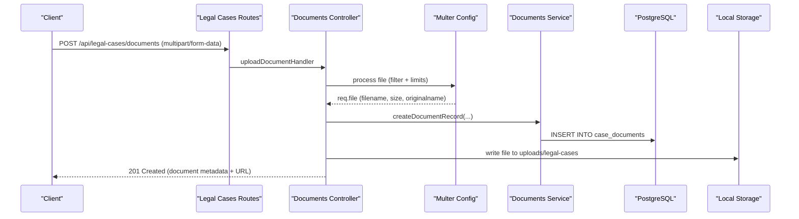
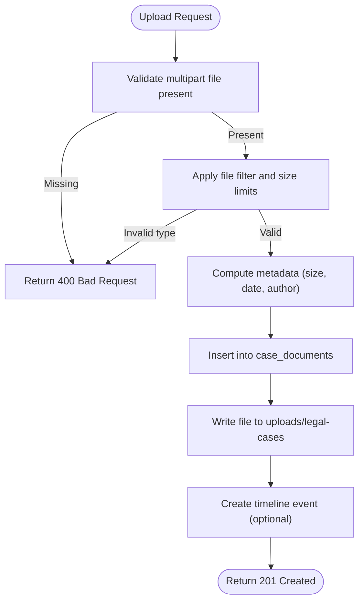
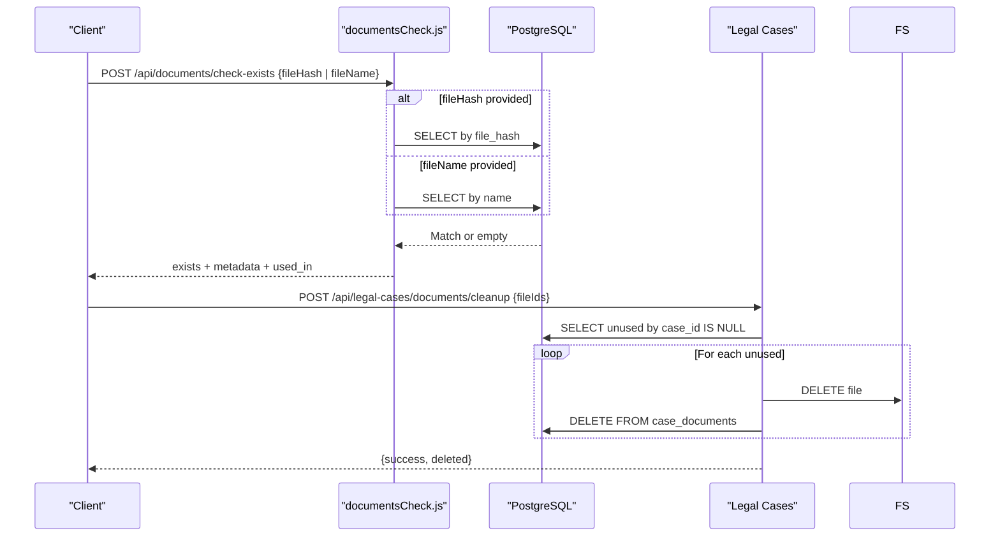
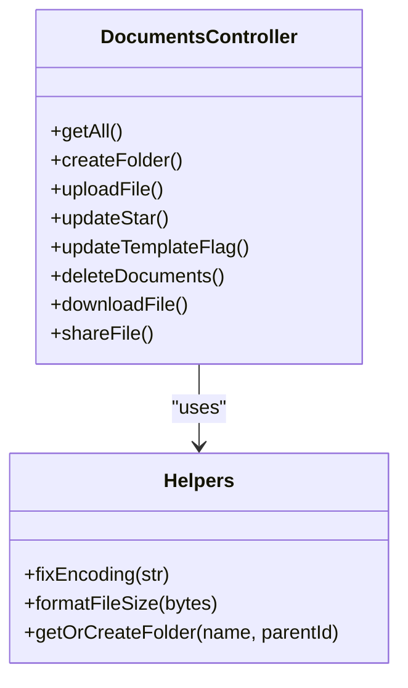
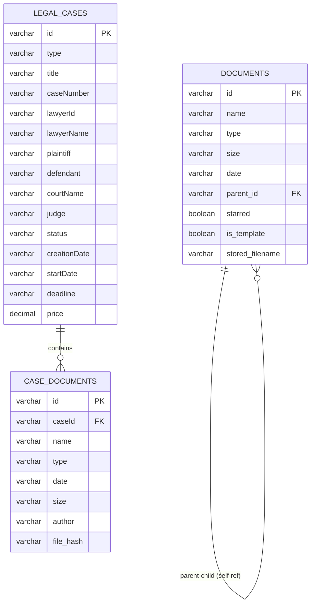
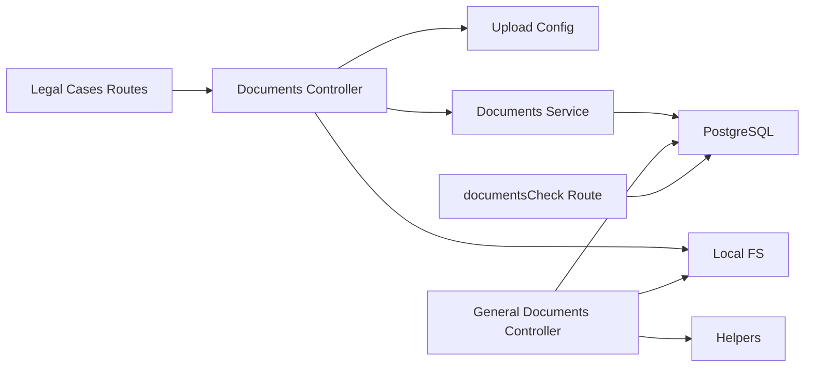

# Document Attachment System

<cite>
**Referenced Files in This Document**
- [upload.js](file://backend/modules/legal_cases/config/upload.js)
- [documents.js](file://backend/modules/legal_cases/controllers/documents.js)
- [documents.js](file://backend/modules/legal_cases/services/documents.js)
- [routes.js](file://backend/modules/legal_cases/routes.js)
- [documents.js](file://backend/modules/documents/controllers/documents.js)
- [helpers.js](file://backend/modules/documents/utils/helpers.js)
- [documentsCheck.js](file://backend/modules/legal_cases/controllers/documents.js)
- [03_create_documents_table.md](file://backend/migrations/03_create_documents_table.md)
- [05_create_legal_cases_table.md](file://backend/migrations/05_create_legal_cases_table.md)
- [39_add_stored_filename_to_documents.md](file://backend/migrations/39_add_stored_filename_to_documents.md)
- [add_file_hash_to_case_documents.sql](file://backend/migrations/add_file_hash_to_case_documents.sql)
- [104_add_template_flag_to_documents.sql](file://backend/migrations/104_add_template_flag_to_documents.sql)
- [108_add_updated_at_to_legal_cases.sql](file://backend/migrations/108_add_updated_at_to_legal_cases.sql)
</cite>

## Table of Contents
1. [Introduction](#introduction)
2. [Project Structure](#project-structure)
3. [Core Components](#core-components)
4. [Architecture Overview](#architecture-overview)
5. [Detailed Component Analysis](#detailed-component-analysis)
6. [Dependency Analysis](#dependency-analysis)
7. [Performance Considerations](#performance-considerations)
8. [Troubleshooting Guide](#troubleshooting-guide)
9. [Conclusion](#conclusion)

## Introduction
This document describes the document attachment system for legal cases within the platform. It covers file upload handling, supported formats, size limits, security validation, categorization and metadata management, version control and audit trails, retrieval and download, and integration with local storage. Practical workflows for single uploads, batch cleanup, and organizing documents within case contexts are included.

## Project Structure
The document attachment system spans two primary modules:
- Legal Cases module: specialized case document management with timeline integration and duplicate detection via file hashing
- General Documents module: generic document and folder management with template support and sharing

**Diagram sources**
- [routes.js:1-20](file://backend/modules/legal_cases/routes.js#L1-L20)
- [upload.js:1-54](file://backend/modules/legal_cases/config/upload.js#L1-L53)
- [documents.js:1-180](file://backend/modules/legal_cases/controllers/documents.js#L1-L179)
- [documents.js:1-182](file://backend/modules/legal_cases/services/documents.js#L1-L181)
- [documents.js:1-275](file://backend/modules/documents/controllers/documents.js#L1-L275)
- [helpers.js:1-79](file://backend/modules/documents/utils/helpers.js#L1-L79)
- [documentsCheck.js:1-134](file://backend/modules/legal_cases/controllers/documents.js#L1-L134)

**Section sources**
- [routes.js:1-20](file://backend/modules/legal_cases/routes.js#L1-L20)
- [upload.js:1-54](file://backend/modules/legal_cases/config/upload.js#L1-L53)
- [documents.js:1-180](file://backend/modules/legal_cases/controllers/documents.js#L1-L179)
- [documents.js:1-182](file://backend/modules/legal_cases/services/documents.js#L1-L181)
- [documents.js:1-275](file://backend/modules/documents/controllers/documents.js#L1-L275)
- [helpers.js:1-79](file://backend/modules/documents/utils/helpers.js#L1-L79)
- [documentsCheck.js:1-134](file://backend/modules/legal_cases/controllers/documents.js#L1-L134)

## Core Components
- Legal Cases Document Upload Pipeline: Multer-based upload with strict file type filtering and 50 MB size limit, storing files on the local filesystem under a dedicated legal-cases directory. Records are persisted to the case_documents table with metadata and a URL pointing to the stored file.
- Duplicate Detection and Cleanup: A hash-based duplicate detection mechanism for case documents, plus a cleanup endpoint to remove orphaned temporary files.
- General Document Management: Folder hierarchy, file uploads with 100 MB limit, download with proper encoding handling, and sharing links.
- Metadata and Categorization: Documents include name, type, size, date, author, and optional case association. Templates and starring flags are supported in the general documents module.

**Section sources**
- [upload.js:28-51](file://backend/modules/legal_cases/config/upload.js#L28-L51)
- [documents.js:47-113](file://backend/modules/legal_cases/controllers/documents.js#L47-L113)
- [documents.js:17-139](file://backend/modules/legal_cases/services/documents.js#L17-L139)
- [documents.js:24-54](file://backend/modules/documents/controllers/documents.js#L24-L54)
- [documents.js:188-226](file://backend/modules/documents/controllers/documents.js#L188-L226)
- [104_add_template_flag_to_documents.sql:1-7](file://backend/migrations/104_add_template_flag_to_documents.sql#L1-L6)

## Architecture Overview
The system integrates Express routers, Multer for file handling, PostgreSQL for metadata, and the local filesystem for storage. Legal cases documents are tightly coupled with case timelines and include duplicate detection via file hashes.

**Diagram sources**
- [routes.js:15-17](file://backend/modules/legal_cases/routes.js#L15-L17)
- [documents.js:47-113](file://backend/modules/legal_cases/controllers/documents.js#L47-L113)
- [upload.js:44-51](file://backend/modules/legal_cases/config/upload.js#L44-L51)
- [documents.js:37-56](file://backend/modules/legal_cases/services/documents.js#L37-L56)

## Detailed Component Analysis

### Legal Cases Document Upload Pipeline
- File handling: Multer disk storage with a custom destination and filename generator. Files are saved under a legal-cases subdirectory with unique names.
- Validation: Allowed file extensions are explicitly enumerated; uploads exceeding 50 MB are rejected.
- Metadata capture: The controller extracts user-provided metadata (name, type, case_id, instance_id) and augments it with computed fields (size, date, author).
- Persistence: A record is inserted into case_documents with a URL pointing to the stored file.
- Timeline integration: On successful upload, a timeline event is created for the associated case.

**Diagram sources**
- [documents.js:47-113](file://backend/modules/legal_cases/controllers/documents.js#L47-L113)
- [upload.js:28-51](file://backend/modules/legal_cases/config/upload.js#L28-L51)
- [documents.js:37-56](file://backend/modules/legal_cases/services/documents.js#L37-L56)

**Section sources**
- [upload.js:10-51](file://backend/modules/legal_cases/config/upload.js#L10-L51)
- [documents.js:47-113](file://backend/modules/legal_cases/controllers/documents.js#L47-L113)
- [documents.js:37-56](file://backend/modules/legal_cases/services/documents.js#L37-L56)

### Duplicate Detection and Cleanup
- Duplicate detection: A SHA-256 file hash is stored per case document to detect duplicates. A dedicated route checks existence by hash or filename and returns usage context.
- Cleanup: An endpoint removes unused temporary documents (those not yet associated with a case) by deleting physical files and DB records.

**Diagram sources**
- [documentsCheck.js:27-100](file://backend/modules/legal_cases/controllers/documents.js#L27-L100)
- [documents.js:108-139](file://backend/modules/legal_cases/services/documents.js#L108-L139)
- [add_file_hash_to_case_documents.sql:1-14](file://backend/migrations/add_file_hash_to_case_documents.sql#L1-L13)

**Section sources**
- [documentsCheck.js:27-100](file://backend/modules/legal_cases/controllers/documents.js#L27-L100)
- [documents.js:108-139](file://backend/modules/legal_cases/services/documents.js#L108-L139)
- [add_file_hash_to_case_documents.sql:1-14](file://backend/migrations/add_file_hash_to_case_documents.sql#L1-L13)

### General Document Management (Folders, Templates, Sharing)
- Folders: Create hierarchical folder structures with parent-child relationships.
- Uploads: Multer configuration with 100 MB limit; stores original filename in a separate stored_filename column for safe retrieval.
- Downloads: Handles both ASCII and non-ASCII filenames with proper Content-Disposition headers.
- Templates: Flags documents as templates for workflow automation.
- Sharing: Generates shareable URLs using the configured API base URL.

**Diagram sources**
- [documents.js:60-272](file://backend/modules/documents/controllers/documents.js#L60-L272)
- [helpers.js:8-78](file://backend/modules/documents/utils/helpers.js#L8-L78)

**Section sources**
- [documents.js:24-54](file://backend/modules/documents/controllers/documents.js#L24-L54)
- [documents.js:69-87](file://backend/modules/documents/controllers/documents.js#L69-L87)
- [documents.js:93-139](file://backend/modules/documents/controllers/documents.js#L93-L139)
- [documents.js:188-226](file://backend/modules/documents/controllers/documents.js#L188-L226)
- [documents.js:232-250](file://backend/modules/documents/controllers/documents.js#L232-L250)
- [helpers.js:8-78](file://backend/modules/documents/utils/helpers.js#L8-L78)
- [39_add_stored_filename_to_documents.md:1-21](file://backend/migrations/39_add_stored_filename_to_documents.md#L1-L20)
- [104_add_template_flag_to_documents.sql:1-7](file://backend/migrations/104_add_template_flag_to_documents.sql#L1-L6)

### Data Model and Schema
The system uses two primary tables for document storage:
- documents: Stores generic documents and folders with optional parent-child hierarchy, size, starred flag, and template flag.
- case_documents: Stores case-specific documents with foreign key to legal_cases, plus author, date, and file hash for deduplication.

**Diagram sources**
- [05_create_legal_cases_table.md:84-94](file://backend/migrations/05_create_legal_cases_table.md#L84-L94)
- [03_create_documents_table.md:8-22](file://backend/migrations/03_create_documents_table.md#L8-L22)
- [add_file_hash_to_case_documents.sql:4-5](file://backend/migrations/add_file_hash_to_case_documents.sql#L4-L5)
- [104_add_template_flag_to_documents.sql:4-6](file://backend/migrations/104_add_template_flag_to_documents.sql#L4-L6)
- [39_add_stored_filename_to_documents.md:8-8](file://backend/migrations/39_add_stored_filename_to_documents.md#L8)

**Section sources**
- [05_create_legal_cases_table.md:84-94](file://backend/migrations/05_create_legal_cases_table.md#L84-L94)
- [03_create_documents_table.md:8-22](file://backend/migrations/03_create_documents_table.md#L8-L22)
- [add_file_hash_to_case_documents.sql:1-14](file://backend/migrations/add_file_hash_to_case_documents.sql#L1-L13)
- [104_add_template_flag_to_documents.sql:1-7](file://backend/migrations/104_add_template_flag_to_documents.sql#L1-L6)
- [39_add_stored_filename_to_documents.md:1-21](file://backend/migrations/39_add_stored_filename_to_documents.md#L1-L20)

## Dependency Analysis
- Controllers depend on Multer configuration for upload processing and on services for database operations.
- Services encapsulate all database interactions and file system operations, minimizing controller complexity.
- Routes mount controllers and expose endpoints for upload, download, deletion, and cleanup.
- Duplicate detection relies on a dedicated route and the presence of file_hash in case_documents.
- General documents module depends on helpers for encoding normalization and file size formatting.

**Diagram sources**
- [routes.js:15-17](file://backend/modules/legal_cases/routes.js#L15-L17)
- [documents.js:10-25](file://backend/modules/legal_cases/controllers/documents.js#L10-L25)
- [upload.js:44-51](file://backend/modules/legal_cases/config/upload.js#L44-L51)
- [documents.js:6-9](file://backend/modules/legal_cases/services/documents.js#L6-L9)
- [documents.js:12-16](file://backend/modules/documents/controllers/documents.js#L12-L16)
- [helpers.js:1-2](file://backend/modules/documents/utils/helpers.js#L1-L2)
- [documentsCheck.js:1-134](file://backend/modules/legal_cases/controllers/documents.js#L1-L134)

**Section sources**
- [routes.js:1-20](file://backend/modules/legal_cases/routes.js#L1-L20)
- [documents.js:1-26](file://backend/modules/legal_cases/controllers/documents.js#L1-L26)
- [documents.js:1-10](file://backend/modules/legal_cases/services/documents.js#L1-L10)
- [documents.js:1-17](file://backend/modules/documents/controllers/documents.js#L1-L17)
- [helpers.js:1-2](file://backend/modules/documents/utils/helpers.js#L1-L2)
- [documentsCheck.js:1-134](file://backend/modules/legal_cases/controllers/documents.js#L1-L134)

## Performance Considerations
- File size limits: Legal cases module enforces 50 MB; general documents module enforces 100 MB. These caps reduce memory pressure during upload processing.
- Local storage: Files are stored on disk; ensure adequate disk space and consider offloading to cloud storage for scalability.
- Indexing: The case_documents table includes a file_hash index to accelerate duplicate detection.
- Cleanup: Use the cleanup endpoint to remove orphaned temporary files and reduce storage bloat.
- Encoding: Filename encoding normalization prevents corruption and improves compatibility with various clients.

[No sources needed since this section provides general guidance]

## Troubleshooting Guide
- Upload fails with invalid file type: Verify the file extension matches the allowed list in the legal cases upload configuration.
- Upload exceeds size limit: Reduce file size or adjust limits in the upload configuration.
- Download returns 404: Confirm the stored filename exists in the database and corresponds to a file on disk.
- Duplicate detection not working: Ensure the file_hash column exists and is populated; recompute hash if necessary.
- Share link not generated: Check that the API_URL environment variable is configured correctly.

**Section sources**
- [upload.js:28-51](file://backend/modules/legal_cases/config/upload.js#L28-L51)
- [documents.js:119-128](file://backend/modules/legal_cases/controllers/documents.js#L119-L128)
- [documentsCheck.js:243-246](file://backend/modules/legal_cases/controllers/documents.js#L1-L179)
- [add_file_hash_to_case_documents.sql:1-14](file://backend/migrations/add_file_hash_to_case_documents.sql#L1-L13)

## Conclusion
The document attachment system provides robust, case-focused document management with strong validation, metadata handling, and duplicate detection. Legal cases documents integrate seamlessly with case timelines and storage, while the general documents module supports flexible folder structures, templates, and sharing. Together, these components enable efficient document organization, retrieval, and lifecycle management within legal case contexts.