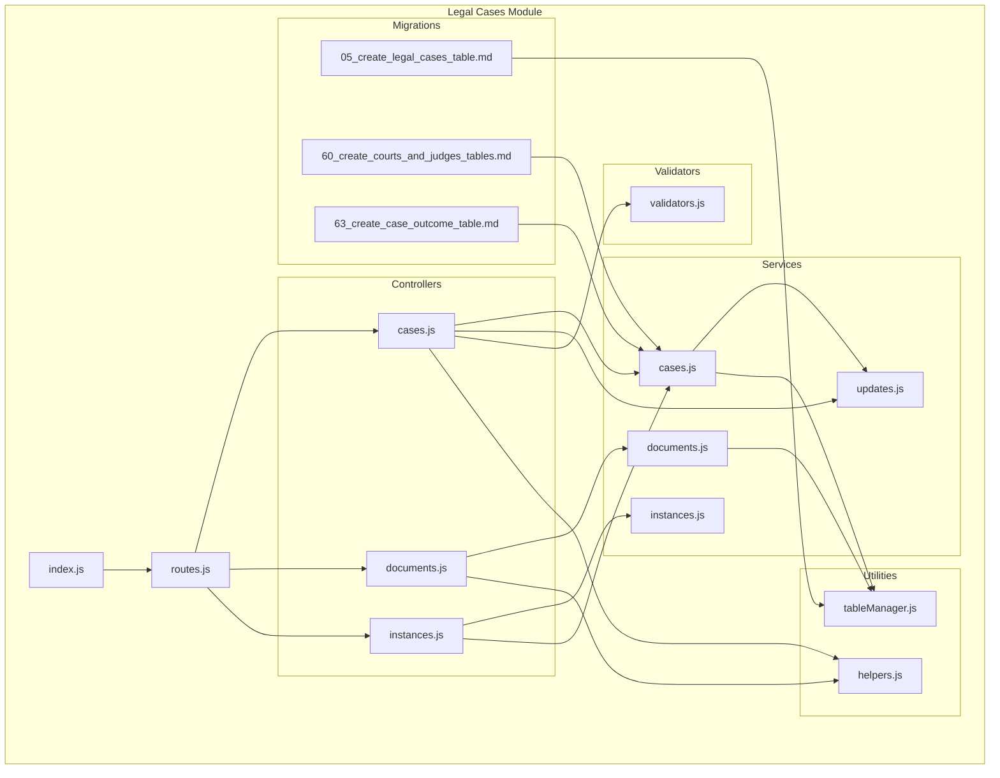
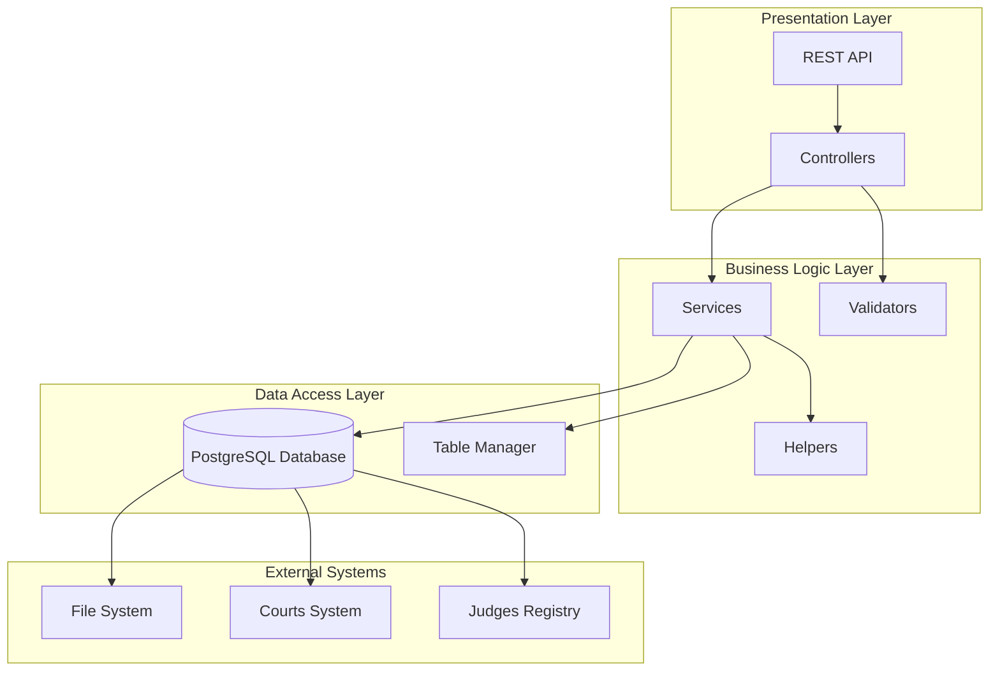
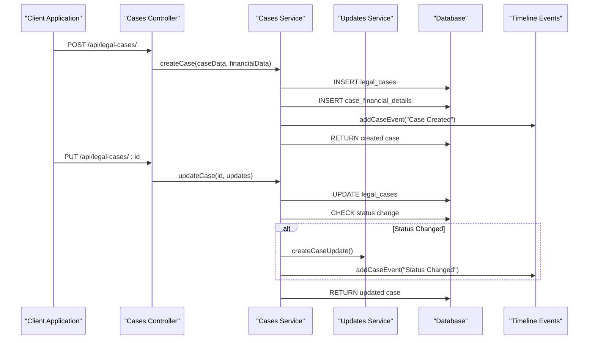
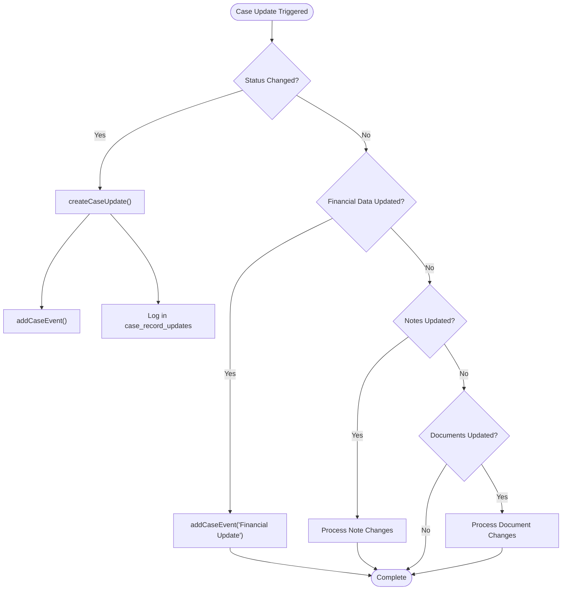
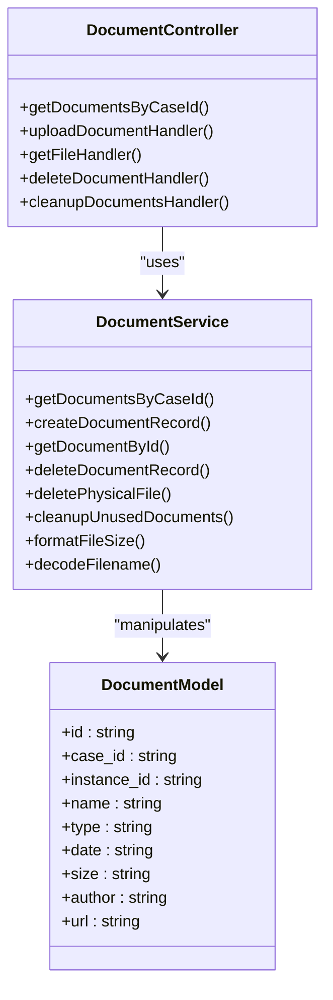
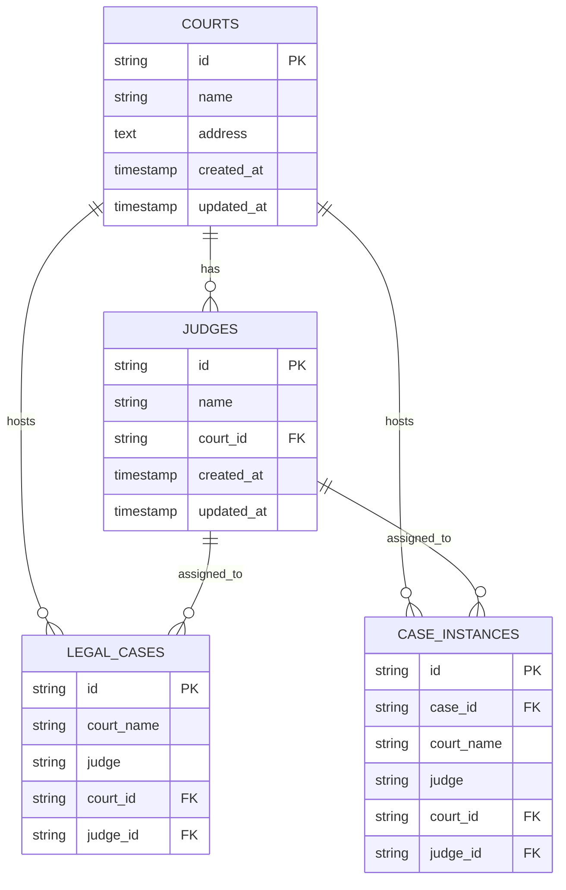
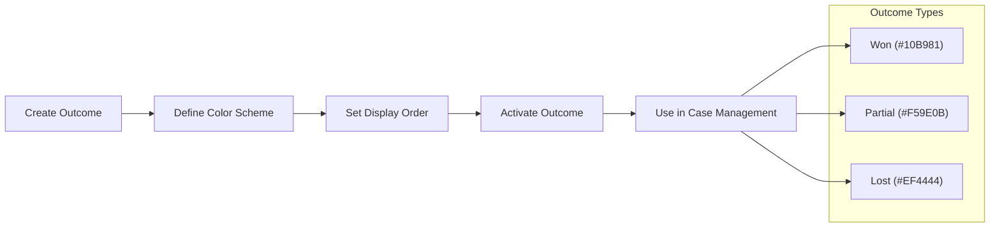
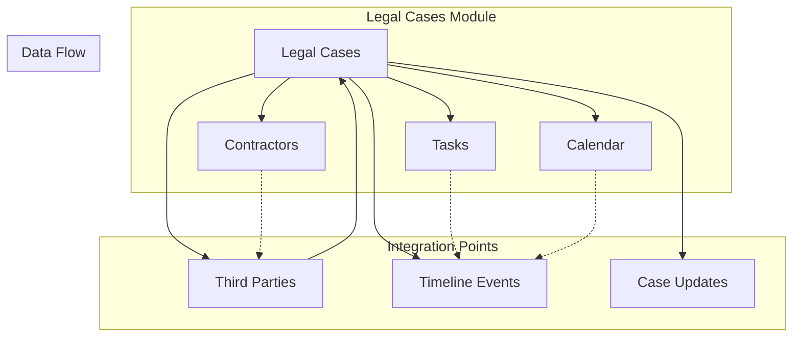
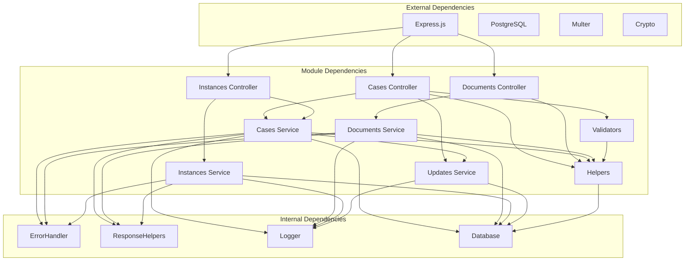

# Legal Cases Module

> 📄 **Синхронизировано** с [docs/modules/legal_cases.md](../../../docs/modules/legal_cases.md) — актуальная компактная спецификация модуля (рус.). Ниже — подробный англоязычный разбор с исходниками и диаграммами.

<cite>
**Referenced Files in This Document**
- [index.js](file://backend/modules/legal_cases/index.js)
- [routes.js](file://backend/modules/legal_cases/routes.js)
- [cases.js](file://backend/modules/legal_cases/controllers/cases.js)
- [documents.js](file://backend/modules/legal_cases/controllers/documents.js)
- [instances.js](file://backend/modules/legal_cases/controllers/instances.js)
- [cases.js](file://backend/modules/legal_cases/services/cases.js)
- [documents.js](file://backend/modules/legal_cases/services/documents.js)
- [instances.js](file://backend/modules/legal_cases/services/instances.js)
- [updates.js](file://backend/modules/legal_cases/services/updates.js)
- [helpers.js](file://backend/modules/legal_cases/utils/helpers.js)
- [tableManager.js](file://backend/modules/legal_cases/utils/tableManager.js)
- [validators.js](file://backend/modules/legal_cases/validators/validators.js)
- [05_create_legal_cases_table.md](file://backend/migrations/05_create_legal_cases_table.md)
- [60_create_courts_and_judges_tables.md](file://backend/migrations/60_create_courts_and_judges_tables.md)
- [63_create_case_outcome_table.md](file://backend/migrations/63_create_case_outcome_table.md)
</cite>

## Table of Contents
1. [Introduction](#introduction)
2. [Project Structure](#project-structure)
3. [Core Components](#core-components)
4. [Architecture Overview](#architecture-overview)
5. [Detailed Component Analysis](#detailed-component-analysis)
6. [Dependency Analysis](#dependency-analysis)
7. [Performance Considerations](#performance-considerations)
8. [Troubleshooting Guide](#troubleshooting-guide)
9. [Conclusion](#conclusion)
10. [Appendices](#appendices)

## Introduction
The Legal Cases module provides a comprehensive system for managing legal matters within the CRM. It supports the full lifecycle of a legal case from creation to closure, including status tracking, automated updates, document management, and integration with external systems such as courts and judges. The module also maintains timelines, handles private/internal notes, manages third-party participants, and tracks case outcomes.

## Project Structure
The Legal Cases module follows a layered architecture with clear separation of concerns:
- Controllers handle HTTP requests and responses
- Services encapsulate business logic and data operations
- Utilities provide helper functions and table management
- Validators ensure data integrity
- Routes define the API endpoints
- Migrations establish the underlying database schema

**Diagram sources**
- [index.js:1-14](file://backend/modules/legal_cases/index.js#L1-L13)
- [routes.js:1-20](file://backend/modules/legal_cases/routes.js#L1-L20)
- [cases.js:1-299](file://backend/modules/legal_cases/controllers/cases.js#L1-L299)
- [documents.js:1-180](file://backend/modules/legal_cases/controllers/documents.js#L1-L179)
- [instances.js:1-123](file://backend/modules/legal_cases/controllers/instances.js#L1-L122)
- [cases.js:1-686](file://backend/modules/legal_cases/services/cases.js#L1-L686)
- [documents.js:1-182](file://backend/modules/legal_cases/services/documents.js#L1-L181)
- [instances.js:1-160](file://backend/modules/legal_cases/services/instances.js#L1-L159)
- [updates.js:1-179](file://backend/modules/legal_cases/services/updates.js#L1-L178)
- [helpers.js:1-56](file://backend/modules/legal_cases/utils/helpers.js#L1-L55)
- [tableManager.js:1-69](file://backend/modules/legal_cases/utils/tableManager.js#L1-L68)
- [validators.js:1-160](file://backend/modules/legal_cases/validators/validators.js#L1-L159)
- [05_create_legal_cases_table.md:1-130](file://backend/migrations/05_create_legal_cases_table.md#L1-L130)
- [60_create_courts_and_judges_tables.md:1-47](file://backend/migrations/60_create_courts_and_judges_tables.md#L1-L46)
- [63_create_case_outcome_table.md:1-33](file://backend/migrations/63_create_case_outcome_table.md#L1-L32)

**Section sources**
- [index.js:1-14](file://backend/modules/legal_cases/index.js#L1-L13)
- [routes.js:1-20](file://backend/modules/legal_cases/routes.js#L1-L20)

## Core Components
The Legal Cases module consists of several interconnected components that work together to provide a complete case management solution:

### Controllers
- **Cases Controller**: Handles CRUD operations for legal cases, status updates, and update management
- **Documents Controller**: Manages document uploads, downloads, and cleanup operations
- **Instances Controller**: Controls case instances (first instance, appeal, cassation, supervisory review)

### Services
- **Cases Service**: Implements business logic for case creation, updates, deletion, and timeline events
- **Documents Service**: Provides document storage, retrieval, and file system operations
- **Instances Service**: Manages case instance lifecycle and active instance tracking
- **Updates Service**: Handles automated case updates and audit trail management

### Supporting Components
- **Helpers**: Utility functions for data extraction, normalization, and relation hydration
- **Table Manager**: Ensures database support tables exist and are properly structured
- **Validators**: Data validation for case creation, updates, and financial information

**Section sources**
- [cases.js:1-299](file://backend/modules/legal_cases/controllers/cases.js#L1-L299)
- [documents.js:1-180](file://backend/modules/legal_cases/controllers/documents.js#L1-L179)
- [instances.js:1-123](file://backend/modules/legal_cases/controllers/instances.js#L1-L122)
- [cases.js:1-686](file://backend/modules/legal_cases/services/cases.js#L1-L686)
- [documents.js:1-182](file://backend/modules/legal_cases/services/documents.js#L1-L181)
- [instances.js:1-160](file://backend/modules/legal_cases/services/instances.js#L1-L159)
- [updates.js:1-179](file://backend/modules/legal_cases/services/updates.js#L1-L178)
- [helpers.js:1-56](file://backend/modules/legal_cases/utils/helpers.js#L1-L55)
- [tableManager.js:1-69](file://backend/modules/legal_cases/utils/tableManager.js#L1-L68)
- [validators.js:1-160](file://backend/modules/legal_cases/validators/validators.js#L1-L159)

## Architecture Overview
The Legal Cases module implements a layered architecture with clear separation between presentation, business logic, and data access layers. The system uses PostgreSQL as the primary database with supporting tables for events, third parties, expenses, and recovered items.

**Diagram sources**
- [cases.js:1-299](file://backend/modules/legal_cases/controllers/cases.js#L1-L299)
- [cases.js:1-686](file://backend/modules/legal_cases/services/cases.js#L1-L686)
- [tableManager.js:1-69](file://backend/modules/legal_cases/utils/tableManager.js#L1-L68)

## Detailed Component Analysis

### Case Lifecycle Management System
The case lifecycle encompasses creation, status tracking, updates, and eventual closure. The system automatically generates timeline events and audit trails for significant changes.

**Diagram sources**
- [cases.js:158-266](file://backend/modules/legal_cases/services/cases.js#L158-L266)
- [cases.js:322-362](file://backend/modules/legal_cases/services/cases.js#L322-L362)
- [updates.js:88-122](file://backend/modules/legal_cases/services/updates.js#L88-L122)

The case lifecycle includes automatic status change notifications and timeline events. When a case status changes, the system creates both an audit update and a timeline event for visibility.

**Section sources**
- [cases.js:158-266](file://backend/modules/legal_cases/services/cases.js#L158-L266)
- [cases.js:322-362](file://backend/modules/legal_cases/services/cases.js#L322-L362)
- [cases.js:252-262](file://backend/modules/legal_cases/services/cases.js#L252-L262)

### Automated Case Updates System
The automated updates system monitors case changes and generates notifications for stakeholders. Updates are stored in a dedicated table with audit capabilities.

**Diagram sources**
- [cases.js:322-403](file://backend/modules/legal_cases/services/cases.js#L322-L403)
- [updates.js:88-122](file://backend/modules/legal_cases/services/updates.js#L88-L122)

The system maintains an audit trail through the `case_record_updates` table, tracking who viewed updates and when. Private/internal notes are supported with separate column handling.

**Section sources**
- [updates.js:14-86](file://backend/modules/legal_cases/services/updates.js#L14-L86)
- [updates.js:129-179](file://backend/modules/legal_cases/services/updates.js#L129-L178)

### Document Attachment Capabilities
The document management system supports file uploads, version control, and categorization with robust cleanup mechanisms.

**Diagram sources**
- [documents.js:1-180](file://backend/modules/legal_cases/controllers/documents.js#L1-L179)
- [documents.js:1-182](file://backend/modules/legal_cases/services/documents.js#L1-L181)

Document management includes automatic cleanup of unused files, proper file size formatting, and support for various document types. The system handles file uploads with proper encoding and maintains audit trails through timeline events.

**Section sources**
- [documents.js:1-180](file://backend/modules/legal_cases/controllers/documents.js#L1-L179)
- [documents.js:1-182](file://backend/modules/legal_cases/services/documents.js#L1-L181)

### Integration with Court Systems and Judges
The module integrates with external court and judge systems through dedicated tables and relationships.

**Diagram sources**
- [60_create_courts_and_judges_tables.md:14-30](file://backend/migrations/60_create_courts_and_judges_tables.md#L14-L30)
- [cases.js:168-179](file://backend/modules/legal_cases/services/cases.js#L168-L179)

The integration supports multiple case instances per case, allowing tracking across different court levels (first instance, appeal, cassation, supervisory review).

**Section sources**
- [60_create_courts_and_judges_tables.md:1-47](file://backend/migrations/60_create_courts_and_judges_tables.md#L1-L46)
- [instances.js:37-67](file://backend/modules/legal_cases/services/instances.js#L37-L67)

### Case Outcome Tracking
The module supports customizable case outcomes with color coding and status management.

**Diagram sources**
- [63_create_case_outcome_table.md:9-26](file://backend/migrations/63_create_case_outcome_table.md#L9-L26)

**Section sources**
- [63_create_case_outcome_table.md:1-33](file://backend/migrations/63_create_case_outcome_table.md#L1-L32)

### Relationship with Other Modules
The Legal Cases module integrates with several other modules within the CRM:

The integration supports:
- Third-party participants linked to cases
- Timeline synchronization with tasks and calendar events
- Automatic update propagation to related modules
- Shared contractor relationships for case participants

**Section sources**
- [cases.js:199-220](file://backend/modules/legal_cases/services/cases.js#L199-L220)
- [instances.js:14-20](file://backend/modules/legal_cases/services/instances.js#L14-L20)

## Dependency Analysis
The Legal Cases module has well-defined dependencies that support maintainability and scalability:

**Diagram sources**
- [cases.js:1-299](file://backend/modules/legal_cases/controllers/cases.js#L1-L299)
- [documents.js:1-180](file://backend/modules/legal_cases/controllers/documents.js#L1-L179)
- [instances.js:1-123](file://backend/modules/legal_cases/controllers/instances.js#L1-L122)
- [cases.js:1-686](file://backend/modules/legal_cases/services/cases.js#L1-L686)
- [documents.js:1-182](file://backend/modules/legal_cases/services/documents.js#L1-L181)
- [instances.js:1-160](file://backend/modules/legal_cases/services/instances.js#L1-L159)
- [updates.js:1-179](file://backend/modules/legal_cases/services/updates.js#L1-L178)
- [helpers.js:1-56](file://backend/modules/legal_cases/utils/helpers.js#L1-L55)
- [validators.js:1-160](file://backend/modules/legal_cases/validators/validators.js#L1-L159)

**Section sources**
- [cases.js:1-299](file://backend/modules/legal_cases/controllers/cases.js#L1-L299)
- [documents.js:1-180](file://backend/modules/legal_cases/controllers/documents.js#L1-L179)
- [instances.js:1-123](file://backend/modules/legal_cases/controllers/instances.js#L1-L122)

## Performance Considerations
The Legal Cases module implements several performance optimizations:

- **Lazy Table Creation**: Support tables are created on-demand to minimize startup overhead
- **Efficient Queries**: Batch operations for document cleanup and update marking
- **Asynchronous File Operations**: Non-blocking file deletion and upload processing
- **Connection Pooling**: Database connections are managed efficiently through the central database module
- **Caching Strategies**: Internal caching for frequently accessed table structures

## Troubleshooting Guide
Common issues and their resolutions:

### Case Creation Failures
- **Issue**: Missing required fields during case creation
- **Solution**: Verify that title, type, status, lawyer_id, case_number, and creation_date are provided
- **Prevention**: Use the validation service before attempting case creation

### Document Upload Issues
- **Issue**: File upload failures or missing files after upload
- **Solution**: Check file permissions in the uploads directory and ensure proper MIME type handling
- **Debugging**: Review file size formatting and decoding processes

### Update System Problems
- **Issue**: Updates not appearing in the audit trail
- **Solution**: Verify that case_record_updates table exists and is properly populated
- **Monitoring**: Check for proper logging of update creation and viewing activities

### Database Schema Issues
- **Issue**: Missing support tables for case operations
- **Solution**: Call the ensureLegalCaseSupportTables function to create missing tables
- **Prevention**: Run database migrations to ensure all required tables are present

**Section sources**
- [validators.js:12-97](file://backend/modules/legal_cases/validators/validators.js#L12-L97)
- [tableManager.js:14-64](file://backend/modules/legal_cases/utils/tableManager.js#L14-L64)
- [documents.js:85-101](file://backend/modules/legal_cases/services/documents.js#L85-L101)

## Conclusion
The Legal Cases module provides a robust, scalable solution for managing legal matters within the CRM. Its comprehensive feature set includes full case lifecycle management, automated update systems, document management, and integration capabilities with external systems. The modular architecture ensures maintainability while the database-first approach guarantees data integrity and auditability.

Key strengths of the module include:
- Complete case lifecycle support from creation to closure
- Automated audit trails and timeline management
- Comprehensive document management with cleanup capabilities
- Integration with court systems and judge registries
- Support for multiple case instances and outcomes
- Privacy controls for internal notes and documents

The module is designed for extensibility, allowing for future enhancements such as additional case types, custom workflows, and expanded integration capabilities.

## Appendices

### API Endpoint Reference
The Legal Cases module exposes the following REST API endpoints:

**Cases Endpoints:**
- `GET /api/legal-cases/` - Retrieve all cases
- `GET /api/legal-cases/:id` - Get specific case with unviewed updates
- `POST /api/legal-cases/` - Create new case
- `PUT /api/legal-cases/:id` - Update existing case
- `DELETE /api/legal-cases/:id` - Delete case
- `GET /api/legal-cases/:id/updates/unviewed` - Get unviewed updates
- `POST /api/legal-cases/:id/updates/mark-viewed` - Mark updates as viewed
- `DELETE /api/legal-cases/:id/updates/:updateId` - Delete specific update
- `DELETE /api/legal-cases/:id/updates` - Delete all updates

**Documents Endpoints:**
- `GET /api/legal-cases/documents/case/:caseId` - Get documents by case
- `POST /api/legal-cases/documents` - Upload document
- `GET /api/legal-cases/documents/files/:filename` - Download file
- `DELETE /api/legal-cases/documents/:id` - Delete document
- `POST /api/legal-cases/documents/cleanup` - Cleanup unused documents

**Instances Endpoints:**
- `GET /api/legal-cases/:id/instances` - Get case instances
- `POST /api/legal-cases/:id/instances` - Create instance
- `PATCH /api/legal-cases/instances/:instanceId` - Update instance
- `DELETE /api/legal-cases/instances/:instanceId` - Delete instance

### Data Model Overview
The Legal Cases module uses a normalized relational database design with the following key tables:

- **legal_cases**: Core case information
- **case_financial_details**: Financial tracking for cases
- **case_events**: Timeline and activity tracking
- **case_documents**: Document metadata and references
- **case_notes**: Case notes and internal communications
- **case_third_parties**: Third-party participants
- **case_instances**: Multi-instance case tracking
- **case_record_updates**: Audit trail and notifications
- **courts**: Court information integration
- **judges**: Judge registry integration
- **case_outcome**: Case result categorization

**Section sources**
- [05_create_legal_cases_table.md:8-130](file://backend/migrations/05_create_legal_cases_table.md#L8-L130)
- [60_create_courts_and_judges_tables.md:14-30](file://backend/migrations/60_create_courts_and_judges_tables.md#L14-L30)
- [63_create_case_outcome_table.md:9-18](file://backend/migrations/63_create_case_outcome_table.md#L9-L18)