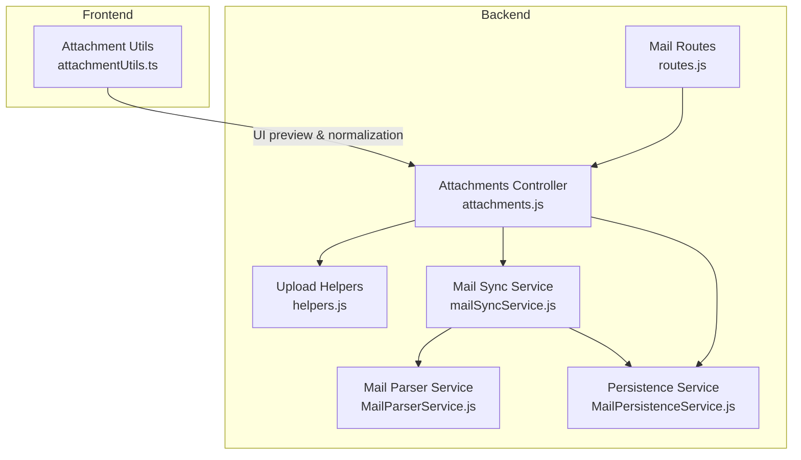
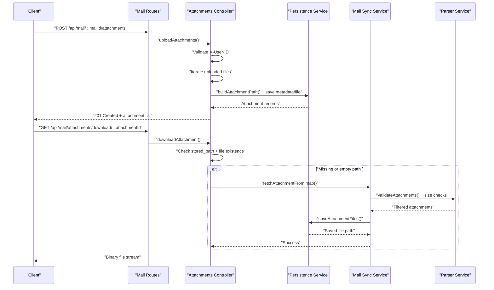
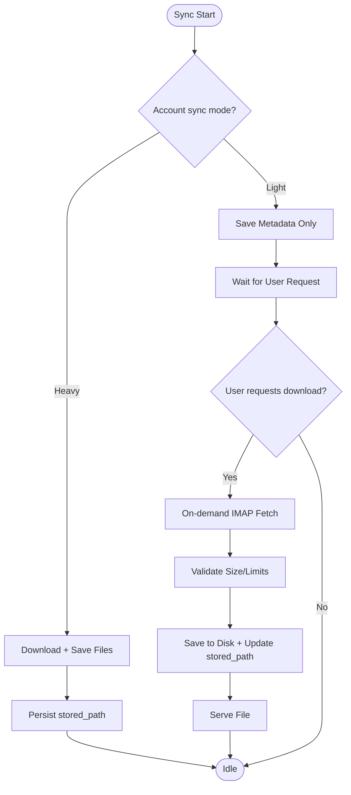
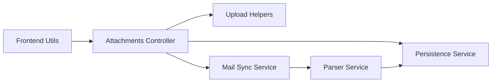

# Attachment Handling

<cite>
**Referenced Files in This Document**
- [attachments.js](file://backend/modules/mail/controllers/attachments.js)
- [routes.js](file://backend/modules/mail/routes.js)
- [helpers.js](file://backend/modules/mail/utils/helpers.js)
- [MailPersistenceService.js](file://backend/modules/mail/services/persistence/MailPersistenceService.js)
- [mailSyncService.js](file://backend/modules/mail/services/mailSyncService.js)
- [MailParserService.js](file://backend/modules/mail/services/parser/MailParserService.js)
- [attachmentUtils.ts](file://frontend/src/modules/mail/utils/attachmentUtils.ts)
- [upload.js](file://backend/modules/legal_cases/config/upload.js)
- [LIGHT_MODE_ATTACHMENTS.md](file://docs/LIGHT_MODE_ATTACHMENTS.md)
</cite>

## Table of Contents
1. [Introduction](#introduction)
2. [Project Structure](#project-structure)
3. [Core Components](#core-components)
4. [Architecture Overview](#architecture-overview)
5. [Detailed Component Analysis](#detailed-component-analysis)
6. [Dependency Analysis](#dependency-analysis)
7. [Performance Considerations](#performance-considerations)
8. [Security Measures](#security-measures)
9. [Practical Examples](#practical-examples)
10. [Troubleshooting Guide](#troubleshooting-guide)
11. [Conclusion](#conclusion)

## Introduction
This document provides comprehensive documentation for the system's attachment handling capabilities across both the Mail module and other modules supporting file uploads. It covers:
- File upload mechanisms and supported file types
- Size limitations and validation
- Storage integration with the local file system
- Preview functionality and download workflows
- Security validations and access control
- The end-to-end processing pipeline from upload to display
- Practical examples and troubleshooting guidance

## Project Structure
Attachment handling spans backend controllers, services, persistence, and frontend utilities, with additional upload configuration for specific modules.

**Diagram sources**
- [routes.js:62-79](file://backend/modules/mail/routes.js#L62-L79)
- [attachments.js:15-61](file://backend/modules/mail/controllers/attachments.js#L15-L61)
- [helpers.js:184-287](file://backend/modules/mail/utils/helpers.js#L184-L287)
- [MailParserService.js:1-244](file://backend/modules/mail/services/parser/MailParserService.js#L1-L243)
- [MailPersistenceService.js:1-625](file://backend/modules/mail/services/persistence/MailPersistenceService.js#L1-L624)
- [mailSyncService.js:1-800](file://backend/modules/mail/services/mailSyncService.js#L1-L478)
- [attachmentUtils.ts:1-63](file://frontend/src/modules/mail/utils/attachmentUtils.ts#L1-L62)

**Section sources**
- [routes.js:62-79](file://backend/modules/mail/routes.js#L62-L79)
- [attachments.js:15-61](file://backend/modules/mail/controllers/attachments.js#L15-L61)
- [helpers.js:184-287](file://backend/modules/mail/utils/helpers.js#L184-L287)
- [MailPersistenceService.js:350-444](file://backend/modules/mail/services/persistence/MailPersistenceService.js#L350-L444)
- [mailSyncService.js:540-627](file://backend/modules/mail/services/mailSyncService.js#L478)
- [MailParserService.js:220-240](file://backend/modules/mail/services/parser/MailParserService.js#L220-L240)
- [attachmentUtils.ts:16-48](file://frontend/src/modules/mail/utils/attachmentUtils.ts#L16-L48)

## Core Components
- Backend Mail Attachments Controller: Handles upload, retrieval, download, and deletion of attachments for emails.
- Upload Helpers: Provides upload middleware, path building, and safe file naming.
- Mail Sync Service: Orchestrates IMAP synchronization, including on-demand attachment fetching for light mode.
- Persistence Service: Manages database operations for mail and attachments, including metadata-only saving and file persistence.
- Parser Service: Validates and filters attachments, enforces size limits, and determines displayability.
- Frontend Attachment Utilities: Provides file type icons, preview capability detection, and normalization of attachment data.

**Section sources**
- [attachments.js:15-216](file://backend/modules/mail/controllers/attachments.js#L15-L215)
- [helpers.js:184-287](file://backend/modules/mail/utils/helpers.js#L184-L287)
- [mailSyncService.js:732-800](file://backend/modules/mail/services/mailSyncService.js#L478)
- [MailPersistenceService.js:350-444](file://backend/modules/mail/services/persistence/MailPersistenceService.js#L350-L444)
- [MailParserService.js:220-240](file://backend/modules/mail/services/parser/MailParserService.js#L220-L240)
- [attachmentUtils.ts:16-48](file://frontend/src/modules/mail/utils/attachmentUtils.ts#L16-L48)

## Architecture Overview
The system supports two synchronization modes for attachments:
- Heavy mode: Downloads and persists all attachments during synchronization.
- Light mode: Persists only metadata (filename, MIME type, size) without downloading files; on-demand fetch occurs upon user request.

**Diagram sources**
- [routes.js:64-77](file://backend/modules/mail/routes.js#L64-L77)
- [attachments.js:15-61](file://backend/modules/mail/controllers/attachments.js#L15-L61)
- [attachments.js:108-178](file://backend/modules/mail/controllers/attachments.js#L108-L178)
- [MailPersistenceService.js:350-444](file://backend/modules/mail/services/persistence/MailPersistenceService.js#L350-L444)
- [mailSyncService.js:732-800](file://backend/modules/mail/services/mailSyncService.js#L478)
- [MailParserService.js:220-240](file://backend/modules/mail/services/parser/MailParserService.js#L220-L240)

## Detailed Component Analysis

### Upload Mechanism and Supported Types
- Mail module upload endpoint accepts multiple files via multipart/form-data and validates the presence of files and user identity.
- Upload middleware uses multer with a 25 MB file size limit and stores temporary files under a structured path.
- After upload, files are moved to a structured storage path and persisted with metadata (filename, MIME type, size) and a generated stored path.

Supported file types in the Mail module are primarily determined by the MIME type and filename extension. The Mail module does not enforce a strict allowlist at the upload level; filtering and validation occur later in the pipeline.

**Section sources**
- [routes.js:64-73](file://backend/modules/mail/routes.js#L64-L73)
- [attachments.js:15-61](file://backend/modules/mail/controllers/attachments.js#L15-L61)
- [helpers.js:277-287](file://backend/modules/mail/utils/helpers.js#L277-L287)
- [helpers.js:196-254](file://backend/modules/mail/utils/helpers.js#L196-L254)

### Legal Cases Upload Configuration
- Dedicated upload configuration restricts file types to PDF, DOC/DOCX, XLS/XLSX, PNG, JPG/JPEG, TXT, ZIP, RAR.
- Enforces a 50 MB file size limit.

**Section sources**
- [upload.js:28-51](file://backend/modules/legal_cases/config/upload.js#L28-L51)

### Storage Integration and Path Management
- Structured storage path: {accountId}/{folderId}/{mailId}/{uuid}_{originalName.ext} with optional original name preservation.
- Path template customization is supported via configuration.
- Absolute paths are resolved from stored paths for file operations.

**Section sources**
- [helpers.js:196-254](file://backend/modules/mail/utils/helpers.js#L196-L254)
- [helpers.js:256-259](file://backend/modules/mail/utils/helpers.js#L256-L259)

### Preview Functionality
- Frontend utilities determine file icons based on MIME type or extension.
- Preview capability is detected for images and PDFs.
- Normalization ensures consistent attachment shape across API responses.

**Section sources**
- [attachmentUtils.ts:16-48](file://frontend/src/modules/mail/utils/attachmentUtils.ts#L16-L48)

### Download Workflows
- Download endpoint validates user identity and attachment ownership.
- If stored path is empty or file is missing, triggers on-demand fetch from IMAP (light mode).
- Returns binary stream with appropriate Content-Disposition headers.

**Section sources**
- [routes.js:76-77](file://backend/modules/mail/routes.js#L76-L77)
- [attachments.js:108-178](file://backend/modules/mail/controllers/attachments.js#L108-L178)

### Deletion Workflow
- Deletes attachment record and removes physical file if present.

**Section sources**
- [attachments.js:182-206](file://backend/modules/mail/controllers/attachments.js#L182-L206)

### Processing Pipeline: Heavy vs Light Mode
- Heavy mode: During synchronization, attachments are downloaded and saved to disk, then metadata is persisted with stored path.
- Light mode: Only metadata is saved initially; files are fetched on demand and cached locally.

**Diagram sources**
- [mailSyncService.js:540-627](file://backend/modules/mail/services/mailSyncService.js#L478)
- [MailPersistenceService.js:350-444](file://backend/modules/mail/services/persistence/MailPersistenceService.js#L350-L444)
- [LIGHT_MODE_ATTACHMENTS.md:14-52](file://docs/LIGHT_MODE_ATTACHMENTS.md#L14-L52)

**Section sources**
- [LIGHT_MODE_ATTACHMENTS.md:14-52](file://docs/LIGHT_MODE_ATTACHMENTS.md#L14-L52)
- [mailSyncService.js:540-627](file://backend/modules/mail/services/mailSyncService.js#L478)
- [MailPersistenceService.js:350-444](file://backend/modules/mail/services/persistence/MailPersistenceService.js#L350-L444)

## Dependency Analysis
- Controllers depend on helpers for upload middleware and path resolution.
- Persistence service encapsulates database and filesystem operations for attachments.
- Sync service orchestrates IMAP operations and delegates parsing/validation to the parser service.
- Frontend utilities depend on normalized attachment data from the backend.

**Diagram sources**
- [attachments.js:15-61](file://backend/modules/mail/controllers/attachments.js#L15-L61)
- [helpers.js:184-287](file://backend/modules/mail/utils/helpers.js#L184-L287)
- [MailPersistenceService.js:350-444](file://backend/modules/mail/services/persistence/MailPersistenceService.js#L350-L444)
- [mailSyncService.js:732-800](file://backend/modules/mail/services/mailSyncService.js#L478)
- [MailParserService.js:220-240](file://backend/modules/mail/services/parser/MailParserService.js#L220-L240)
- [attachmentUtils.ts:16-48](file://frontend/src/modules/mail/utils/attachmentUtils.ts#L16-L48)

**Section sources**
- [attachments.js:15-61](file://backend/modules/mail/controllers/attachments.js#L15-L61)
- [MailPersistenceService.js:350-444](file://backend/modules/mail/services/persistence/MailPersistenceService.js#L350-L444)
- [mailSyncService.js:732-800](file://backend/modules/mail/services/mailSyncService.js#L478)
- [MailParserService.js:220-240](file://backend/modules/mail/services/parser/MailParserService.js#L220-L240)
- [attachmentUtils.ts:16-48](file://frontend/src/modules/mail/utils/attachmentUtils.ts#L16-L48)

## Performance Considerations
- Light mode reduces initial bandwidth and storage usage by deferring attachment downloads until requested.
- On-demand fetch occurs once per attachment; subsequent downloads serve from local cache.
- Heavy mode trades bandwidth/storage for instant access.
- Parser service enforces size limits to avoid oversized attachments during processing.
- IMAP timeouts and dynamic folder sync timeouts help manage long-running operations.

**Section sources**
- [LIGHT_MODE_ATTACHMENTS.md:257-273](file://docs/LIGHT_MODE_ATTACHMENTS.md#L257-L273)
- [MailParserService.js:220-240](file://backend/modules/mail/services/parser/MailParserService.js#L220-L240)
- [mailSyncService.js:150-208](file://backend/modules/mail/services/mailSyncService.js#L150-L208)

## Security Measures
- Access control: All attachment endpoints require a valid X-User-ID header; requests without it are rejected.
- IMAP credentials: Stored encrypted in the mail accounts table; on-demand IMAP operations use stored credentials.
- Path sanitization: Helpers resolve attachment paths safely to prevent directory traversal.
- File type validation: Legal cases module enforces a strict allowlist and size limit; Mail module relies on parser validation and size thresholds.
- Content-Disposition: Download responses use safe filenames and UTF-8 encoding to mitigate header injection risks.

**Section sources**
- [routes.js:12-19](file://backend/modules/mail/routes.js#L12-L19)
- [attachments.js:15-61](file://backend/modules/mail/controllers/attachments.js#L15-L61)
- [attachments.js:108-178](file://backend/modules/mail/controllers/attachments.js#L108-L178)
- [helpers.js:256-259](file://backend/modules/mail/utils/helpers.js#L256-L259)
- [upload.js:28-51](file://backend/modules/legal_cases/config/upload.js#L28-L51)
- [LIGHT_MODE_ATTACHMENTS.md:337-343](file://docs/LIGHT_MODE_ATTACHMENTS.md#L337-L343)

## Practical Examples

### Upload a File to an Email
- Endpoint: POST /api/mail/:mailId/attachments
- Headers: X-User-ID
- Body: multipart/form-data with files[]
- Behavior: Temporary files are moved to structured storage; metadata is persisted; has_attachments flag is updated.

**Section sources**
- [routes.js:64-73](file://backend/modules/mail/routes.js#L64-L73)
- [attachments.js:15-61](file://backend/modules/mail/controllers/attachments.js#L15-L61)

### Preview Rendering
- Determine icon and preview capability based on MIME type or extension.
- Normalize attachment data for consistent UI consumption.

**Section sources**
- [attachmentUtils.ts:16-48](file://frontend/src/modules/mail/utils/attachmentUtils.ts#L16-L48)

### Download an Attachment
- Endpoint: GET /api/mail/attachments/download/:attachmentId
- Headers: X-User-ID
- Behavior: If stored_path is empty or file missing, fetch from IMAP on demand; otherwise serve cached file.

**Section sources**
- [routes.js:76-77](file://backend/modules/mail/routes.js#L76-L77)
- [attachments.js:108-178](file://backend/modules/mail/controllers/attachments.js#L108-L178)

## Troubleshooting Guide
Common issues and resolutions:
- File not found after IMAP fetch: Verify IMAP credentials and retry sync; check logs for AttachmentFetch entries.
- Attachment not found in message: Confirm the email still exists on the server; re-sync the folder.
- Cannot fetch attachment: Ensure the email has a valid IMAP UID; re-sync the affected folder.
- Slow first-time download: Expected for light mode on-demand fetch; subsequent downloads are instant.

Logs to monitor:
- Attachment fetch attempts and successes
- Attachment download events and failures
- Sync progress and errors

**Section sources**
- [LIGHT_MODE_ATTACHMENTS.md:229-256](file://docs/LIGHT_MODE_ATTACHMENTS.md#L229-L256)

## Conclusion
The attachment handling system provides flexible synchronization modes, robust storage integration, and secure access controls. The Mail module supports on-demand fetching for efficient bandwidth usage, while dedicated upload configurations enforce type and size constraints in specialized modules. Together, these components deliver a scalable and maintainable solution for managing attachments across the platform.