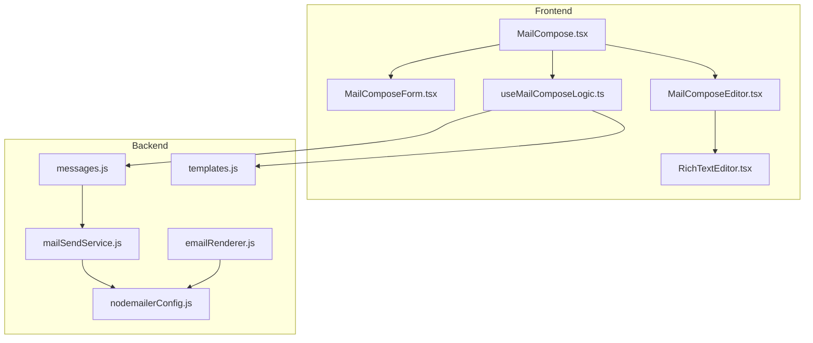
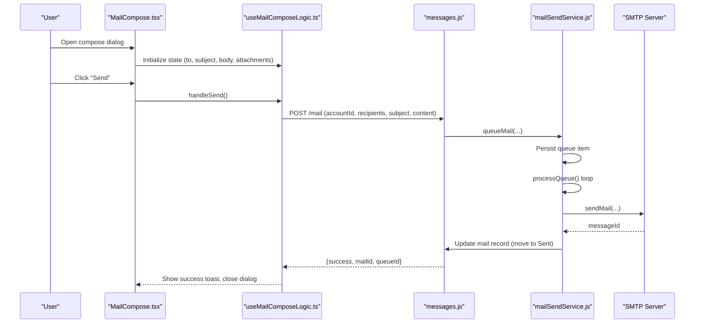
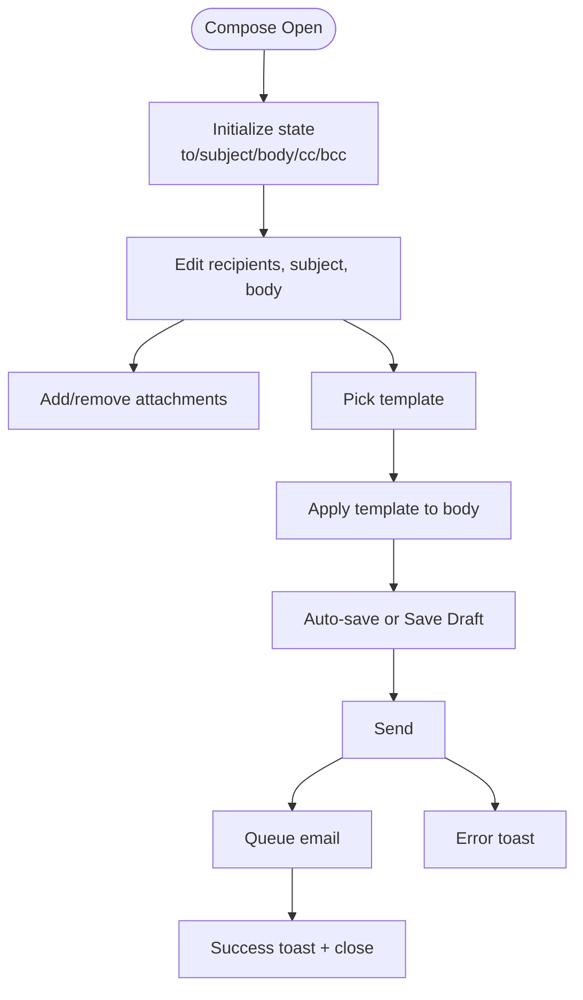
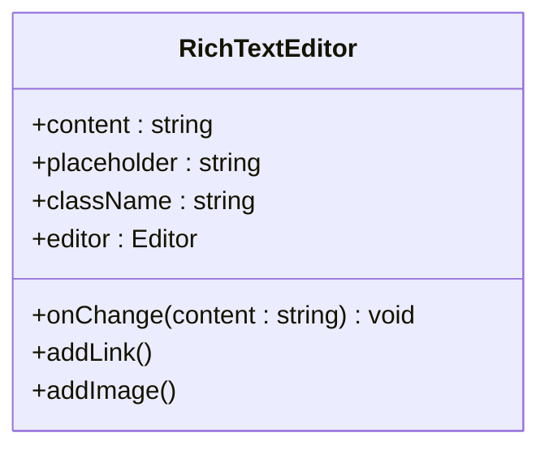
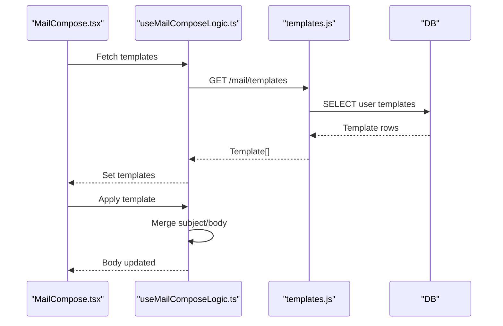
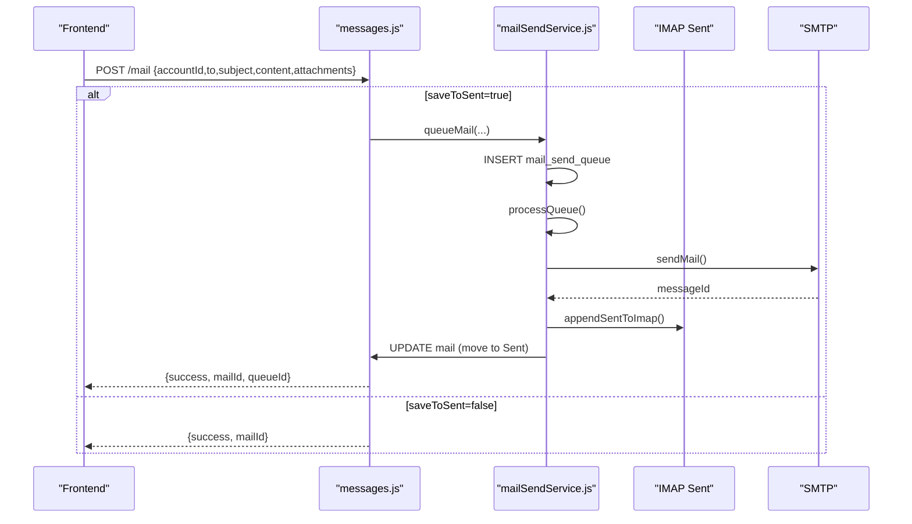
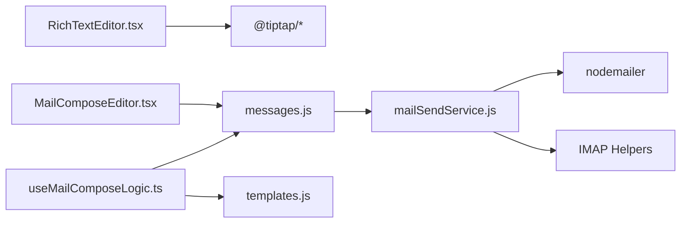

# Email Composition

<cite>
**Referenced Files in This Document**
- [MailCompose.tsx](file://frontend/src/modules/mail/components/MailCompose.tsx)
- [MailComposeForm.tsx](file://frontend/src/modules/mail/components/MailComposeForm.tsx)
- [MailComposeEditor.tsx](file://frontend/src/modules/mail/components/MailComposeEditor.tsx)
- [RichTextEditor.tsx](file://frontend/src/modules/mail/components/RichTextEditor.tsx)
- [useMailComposeLogic.ts](file://frontend/src/modules/mail/hooks/logic/useMailComposeLogic.ts)
- [mailSendService.js](file://backend/modules/mail/services/mailSendService.js)
- [messages.js](file://backend/modules/mail/controllers/messages.js)
- [templates.js](file://backend/modules/mail/controllers/templates.js)
- [nodemailerConfig.js](file://backend/modules/mail/utils/nodemailerConfig.js)
- [emailRenderer.js](file://backend/modules/mail/utils/emailRenderer.js)
</cite>

## Table of Contents
1. [Introduction](#introduction)
2. [Project Structure](#project-structure)
3. [Core Components](#core-components)
4. [Architecture Overview](#architecture-overview)
5. [Detailed Component Analysis](#detailed-component-analysis)
6. [Dependency Analysis](#dependency-analysis)
7. [Performance Considerations](#performance-considerations)
8. [Troubleshooting Guide](#troubleshooting-guide)
9. [Conclusion](#conclusion)
10. [Appendices](#appendices)

## Introduction
This document explains the email composition functionality end-to-end. It covers the rich text editor, formatting toolbar, recipient management, subject handling, message body composition, attachments, templates, and the backend SMTP send pipeline with delivery confirmation and error handling. It also outlines template rendering for standard responses and transactional emails, and provides practical examples of composing and sending emails, applying templates, and managing drafts.

## Project Structure
The email composition feature spans the frontend React modules and the backend Node.js mail module:
- Frontend: compose UI, rich text editor, and logic hook
- Backend: send service, controller endpoints, and utilities

**Diagram sources**
- [MailCompose.tsx:50-179](file://frontend/src/modules/mail/components/MailCompose.tsx#L50-L179)
- [MailComposeForm.tsx:21-122](file://frontend/src/modules/mail/components/MailComposeForm.tsx#L21-L122)
- [MailComposeEditor.tsx:78-219](file://frontend/src/modules/mail/components/MailComposeEditor.tsx#L78-L219)
- [RichTextEditor.tsx:30-171](file://frontend/src/modules/mail/components/RichTextEditor.tsx#L30-L171)
- [useMailComposeLogic.ts:53-292](file://frontend/src/modules/mail/hooks/logic/useMailComposeLogic.ts#L53-L292)
- [messages.js:247-307](file://backend/modules/mail/controllers/messages.js#L109)
- [templates.js:5-74](file://backend/modules/mail/controllers/templates.js#L5-L73)
- [mailSendService.js:21-388](file://backend/modules/mail/services/mailSendService.js#L21-L387)
- [nodemailerConfig.js:6-17](file://backend/modules/mail/utils/nodemailerConfig.js#L6-L17)
- [emailRenderer.js:21-28](file://backend/modules/mail/utils/emailRenderer.js#L21-L28)

**Section sources**
- [MailCompose.tsx:50-179](file://frontend/src/modules/mail/components/MailCompose.tsx#L50-L179)
- [MailComposeForm.tsx:21-122](file://frontend/src/modules/mail/components/MailComposeForm.tsx#L21-L122)
- [MailComposeEditor.tsx:78-219](file://frontend/src/modules/mail/components/MailComposeEditor.tsx#L78-L219)
- [RichTextEditor.tsx:30-171](file://frontend/src/modules/mail/components/RichTextEditor.tsx#L30-L171)
- [useMailComposeLogic.ts:53-292](file://frontend/src/modules/mail/hooks/logic/useMailComposeLogic.ts#L53-L292)
- [messages.js:247-307](file://backend/modules/mail/controllers/messages.js#L109)
- [templates.js:5-74](file://backend/modules/mail/controllers/templates.js#L5-L73)
- [mailSendService.js:21-388](file://backend/modules/mail/services/mailSendService.js#L21-L387)
- [nodemailerConfig.js:6-17](file://backend/modules/mail/utils/nodemailerConfig.js#L6-L17)
- [emailRenderer.js:21-28](file://backend/modules/mail/utils/emailRenderer.js#L21-L28)

## Core Components
- Compose dialog/page container with header, scrollable body, and action bar
- Recipient form with To/CC/BCC fields and advanced toggle
- Rich text editor with formatting toolbar (bold, italic, underline, alignment, lists, links, images)
- Message editor supporting HTML mode and plain text mode, with attachments and progress
- Template picker dialog and template CRUD endpoints
- Draft management with auto-save and manual save
- Send workflow invoking backend controller and queueing via send service

**Section sources**
- [MailCompose.tsx:50-179](file://frontend/src/modules/mail/components/MailCompose.tsx#L50-L179)
- [MailComposeForm.tsx:21-122](file://frontend/src/modules/mail/components/MailComposeForm.tsx#L21-L122)
- [MailComposeEditor.tsx:78-219](file://frontend/src/modules/mail/components/MailComposeEditor.tsx#L78-L219)
- [RichTextEditor.tsx:30-171](file://frontend/src/modules/mail/components/RichTextEditor.tsx#L30-L171)
- [useMailComposeLogic.ts:53-292](file://frontend/src/modules/mail/hooks/logic/useMailComposeLogic.ts#L53-L292)

## Architecture Overview
The compose flow integrates frontend logic with backend endpoints and services:
- Frontend collects recipients, subject, body, and attachments
- Templates are fetched and applied to the body
- Drafts are saved to backend and auto-saved periodically
- Send triggers a controller endpoint that queues the email via the send service
- The send service uses SMTP transport and appends to IMAP Sent when configured

**Diagram sources**
- [MailCompose.tsx:128-139](file://frontend/src/modules/mail/components/MailCompose.tsx#L128-L139)
- [useMailComposeLogic.ts:198-247](file://frontend/src/modules/mail/hooks/logic/useMailComposeLogic.ts#L198-L247)
- [messages.js:247-307](file://backend/modules/mail/controllers/messages.js#L109)
- [mailSendService.js:89-123](file://backend/modules/mail/services/mailSendService.js#L89-L123)
- [mailSendService.js:128-238](file://backend/modules/mail/services/mailSendService.js#L128-L238)

## Detailed Component Analysis

### Compose UI and Logic
- Container manages visibility, minimization, and action buttons
- Form handles To/CC/BCC and subject with validation
- Editor toggles HTML/plain modes and manages attachments
- Logic orchestrates templates, drafts, send, and close confirmation

**Diagram sources**
- [MailCompose.tsx:50-179](file://frontend/src/modules/mail/components/MailCompose.tsx#L50-L179)
- [MailComposeForm.tsx:21-122](file://frontend/src/modules/mail/components/MailComposeForm.tsx#L21-L122)
- [MailComposeEditor.tsx:78-219](file://frontend/src/modules/mail/components/MailComposeEditor.tsx#L78-L219)
- [useMailComposeLogic.ts:53-292](file://frontend/src/modules/mail/hooks/logic/useMailComposeLogic.ts#L53-L292)

**Section sources**
- [MailCompose.tsx:50-179](file://frontend/src/modules/mail/components/MailCompose.tsx#L50-L179)
- [MailComposeForm.tsx:21-122](file://frontend/src/modules/mail/components/MailComposeForm.tsx#L21-L122)
- [MailComposeEditor.tsx:78-219](file://frontend/src/modules/mail/components/MailComposeEditor.tsx#L78-L219)
- [useMailComposeLogic.ts:53-292](file://frontend/src/modules/mail/hooks/logic/useMailComposeLogic.ts#L53-L292)

### Rich Text Editor
- Uses TipTap with StarterKit, underline, link, text align, and image extensions
- Provides a toolbar with formatting actions and image/link insertion prompts
- Emits HTML content on change for seamless integration with backend

**Diagram sources**
- [RichTextEditor.tsx:30-171](file://frontend/src/modules/mail/components/RichTextEditor.tsx#L30-L171)

**Section sources**
- [RichTextEditor.tsx:30-171](file://frontend/src/modules/mail/components/RichTextEditor.tsx#L30-L171)

### Template Management
- Templates are user-scoped and persisted in the database
- Frontend fetches templates and applies selected template content to the body
- Supports creating, updating, and deleting templates

**Diagram sources**
- [useMailComposeLogic.ts:158-178](file://frontend/src/modules/mail/hooks/logic/useMailComposeLogic.ts#L158-L178)
- [templates.js:5-16](file://backend/modules/mail/controllers/templates.js#L5-L16)

**Section sources**
- [useMailComposeLogic.ts:158-178](file://frontend/src/modules/mail/hooks/logic/useMailComposeLogic.ts#L158-L178)
- [templates.js:5-74](file://backend/modules/mail/controllers/templates.js#L5-L73)

### Send Workflow and Delivery Confirmation
- Frontend sends recipients, subject, and content to the backend
- Backend validates and inserts a draft or queues the email
- Send service processes the queue, performs SMTP delivery, and appends to IMAP Sent if configured
- Delivery status is reflected in the mail record and queue entries

**Diagram sources**
- [messages.js:247-307](file://backend/modules/mail/controllers/messages.js#L109)
- [mailSendService.js:37-84](file://backend/modules/mail/services/mailSendService.js#L37-L84)
- [mailSendService.js:89-123](file://backend/modules/mail/services/mailSendService.js#L89-L123)
- [mailSendService.js:128-238](file://backend/modules/mail/services/mailSendService.js#L128-L238)

**Section sources**
- [messages.js:247-307](file://backend/modules/mail/controllers/messages.js#L109)
- [mailSendService.js:21-388](file://backend/modules/mail/services/mailSendService.js#L21-L387)

### Practical Examples

- Composing a new email
  - Open the compose dialog, fill To/Subject, switch to HTML mode, add formatting and attachments, click Send
  - The backend queues the email and returns success

- Replying to an email
  - Pass reply metadata to the compose dialog; the logic prepends a quoted reply block to the body

- Applying a template
  - Open the template dialog, select a template, and merge its subject/content into the editor

- Saving a draft
  - Auto-save every 30 seconds when there are changes; manually save Drafts as needed

- Sending workflow
  - Validate recipients/subject/body, attach files, submit to backend, observe success toast and close

**Section sources**
- [MailCompose.tsx:67-71](file://frontend/src/modules/mail/components/MailCompose.tsx#L67-L71)
- [useMailComposeLogic.ts:65-71](file://frontend/src/modules/mail/hooks/logic/useMailComposeLogic.ts#L65-L71)
- [useMailComposeLogic.ts:107-141](file://frontend/src/modules/mail/hooks/logic/useMailComposeLogic.ts#L107-L141)
- [useMailComposeLogic.ts:198-247](file://frontend/src/modules/mail/hooks/logic/useMailComposeLogic.ts#L198-L247)

## Dependency Analysis
- Frontend depends on TipTap for rich editing and Sonner for notifications
- Compose logic depends on API endpoints for templates and mail operations
- Backend controllers depend on the send service for queuing and SMTP transport
- Send service depends on nodemailer and IMAP utilities for delivery and Sent synchronization

**Diagram sources**
- [RichTextEditor.tsx:30-55](file://frontend/src/modules/mail/components/RichTextEditor.tsx#L30-L55)
- [MailComposeEditor.tsx:78-83](file://frontend/src/modules/mail/components/MailComposeEditor.tsx#L78-L83)
- [useMailComposeLogic.ts:53-60](file://frontend/src/modules/mail/hooks/logic/useMailComposeLogic.ts#L53-L60)
- [messages.js:247-307](file://backend/modules/mail/controllers/messages.js#L109)
- [templates.js:5-16](file://backend/modules/mail/controllers/templates.js#L5-L16)
- [mailSendService.js:160-171](file://backend/modules/mail/services/mailSendService.js#L160-L171)

**Section sources**
- [RichTextEditor.tsx:30-55](file://frontend/src/modules/mail/components/RichTextEditor.tsx#L30-L55)
- [MailComposeEditor.tsx:78-83](file://frontend/src/modules/mail/components/MailComposeEditor.tsx#L78-L83)
- [useMailComposeLogic.ts:53-60](file://frontend/src/modules/mail/hooks/logic/useMailComposeLogic.ts#L53-L60)
- [messages.js:247-307](file://backend/modules/mail/controllers/messages.js#L109)
- [templates.js:5-16](file://backend/modules/mail/controllers/templates.js#L5-L16)
- [mailSendService.js:160-171](file://backend/modules/mail/services/mailSendService.js#L160-L171)

## Performance Considerations
- Queue batching: the send service processes a bounded batch per iteration to avoid overload
- Retry scheduling: exponential-like delays prevent thundering herds and reduce rate-limit risk
- IMAP append is asynchronous to keep send latency low
- Frontend auto-save throttles frequent writes to backend

[No sources needed since this section provides general guidance]

## Troubleshooting Guide
Common issues and remedies:
- Account not selected before send
  - Ensure an email account is chosen; otherwise, the send operation is blocked
- Missing recipients/subject/body
  - Validation prevents sending empty content; fill required fields
- Upload failures
  - Attachment upload uses a temporary draft mail; if it fails, check network and backend storage
- Send failures
  - Errors bubble up with details; review SMTP credentials and server settings
- IMAP Sent append failures
  - Append to IMAP is best-effort; failures are logged and do not block send completion

**Section sources**
- [useMailComposeLogic.ts:198-247](file://frontend/src/modules/mail/hooks/logic/useMailComposeLogic.ts#L198-L247)
- [MailComposeEditor.tsx:138-144](file://frontend/src/modules/mail/components/MailComposeEditor.tsx#L138-L144)
- [mailSendService.js:302-346](file://backend/modules/mail/services/mailSendService.js#L302-L346)

## Conclusion
The email composition feature combines a modern rich text editor with robust backend SMTP integration. It supports templates, attachments, drafts, and reliable delivery with retry logic and IMAP synchronization. The modular design enables easy extension for autocomplete, signatures, and advanced formatting.

## Appendices

### Backend SMTP and Transactional Emails
- System/transactional emails use a global nodemailer transporter configured via environment variables
- Email templates are React components rendered to HTML using react-email

**Section sources**
- [nodemailerConfig.js:6-17](file://backend/modules/mail/utils/nodemailerConfig.js#L6-L17)
- [emailRenderer.js:21-28](file://backend/modules/mail/utils/emailRenderer.js#L21-L28)