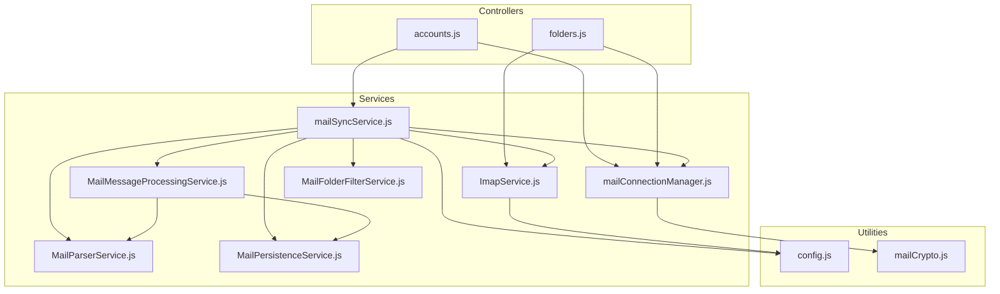
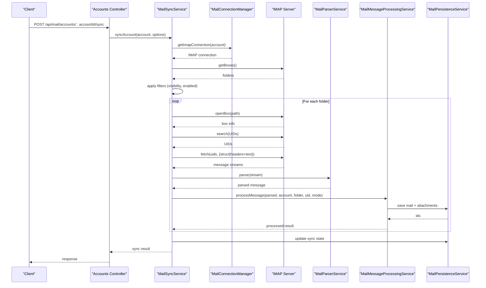
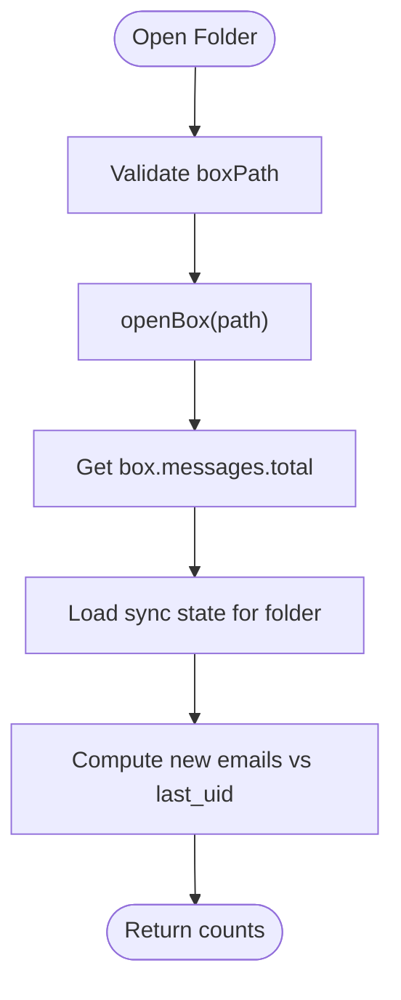
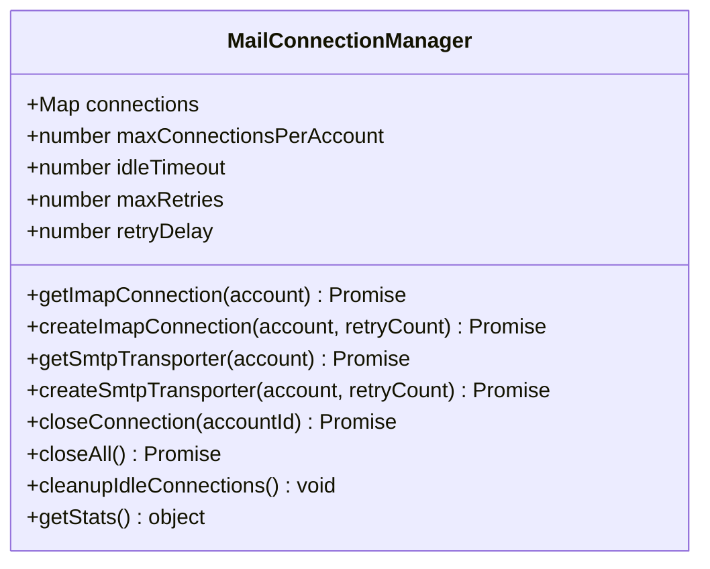
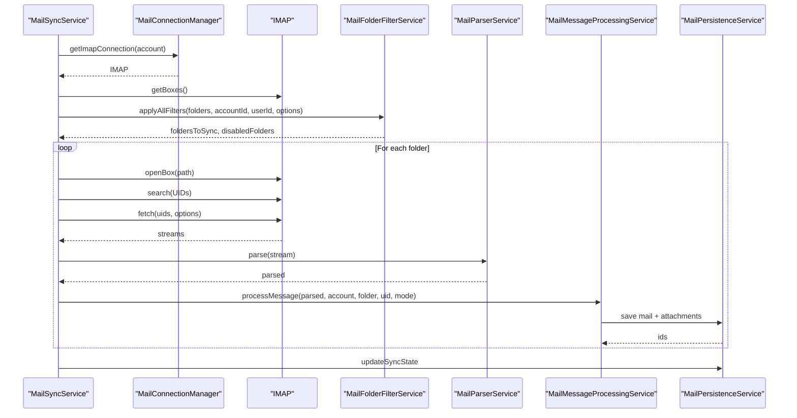
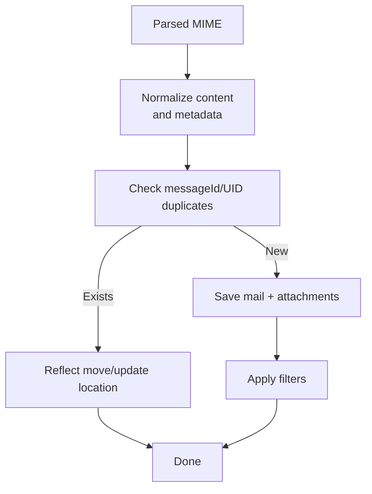
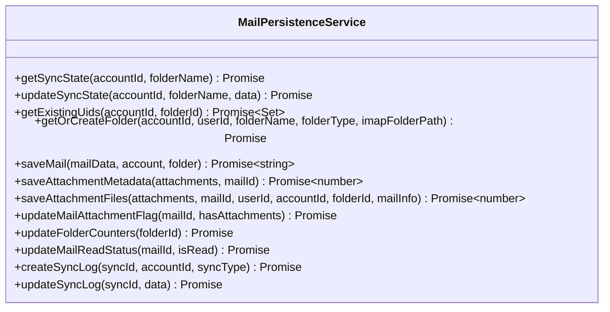
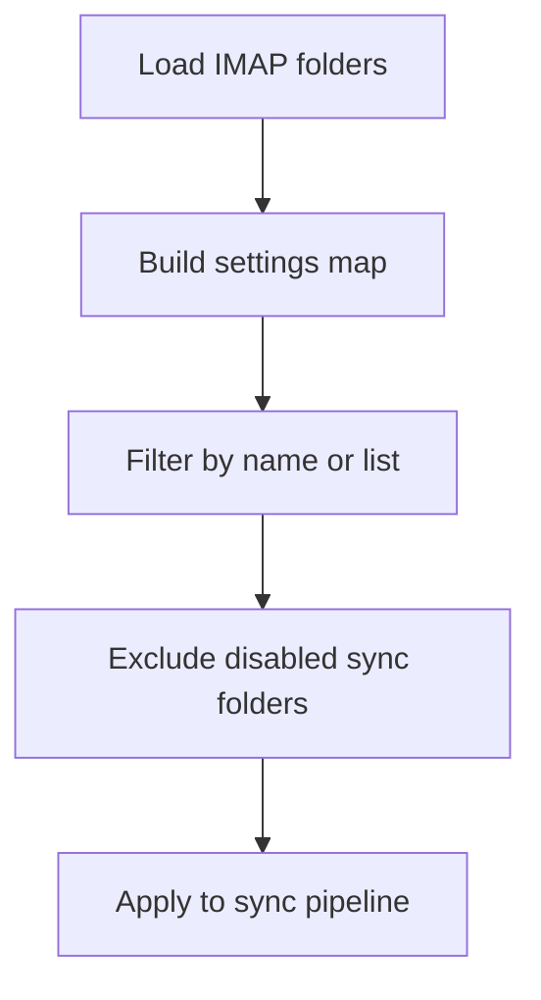
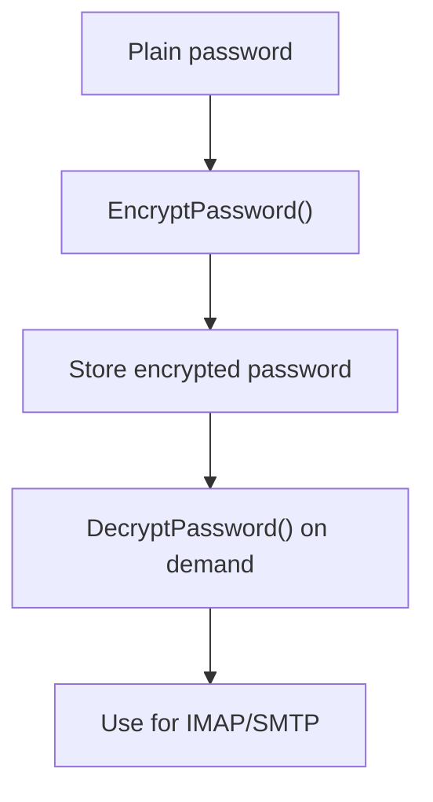
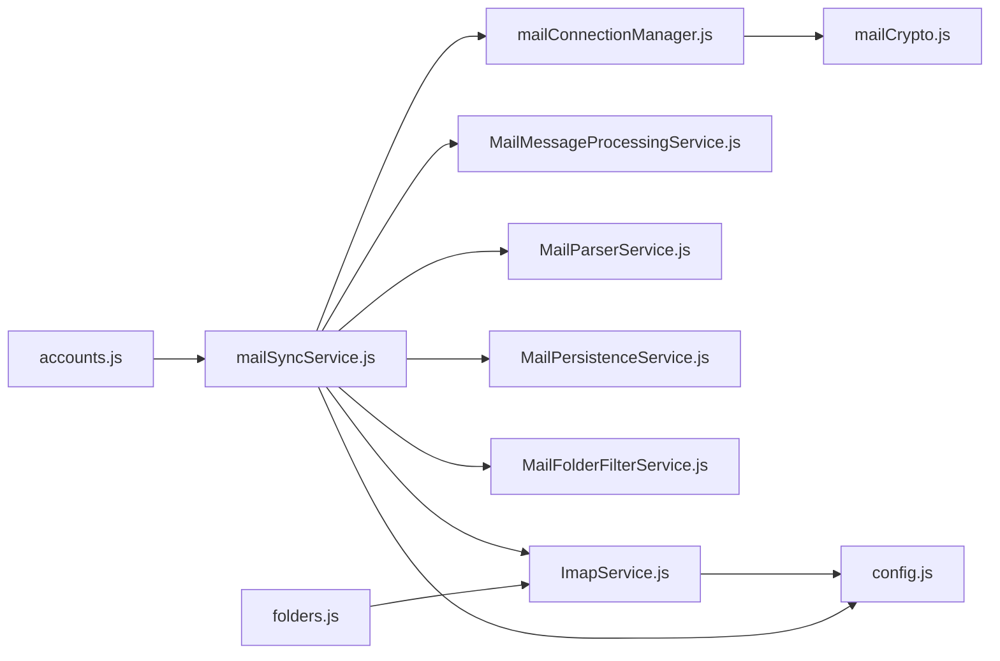

# Email Integration

<cite>
**Referenced Files in This Document**
- [index.js](file://backend/modules/mail/index.js)
- [mailConnectionManager.js](file://backend/modules/mail/services/mailConnectionManager.js)
- [ImapService.js](file://backend/modules/mail/services/imap/ImapService.js)
- [mailSyncService.js](file://backend/modules/mail/services/mailSyncService.js)
- [MailMessageProcessingService.js](file://backend/modules/mail/services/MailMessageProcessingService.js)
- [MailParserService.js](file://backend/modules/mail/services/parser/MailParserService.js)
- [MailPersistenceService.js](file://backend/modules/mail/services/persistence/MailPersistenceService.js)
- [MailFolderFilterService.js](file://backend/modules/mail/services/MailFolderFilterService.js)
- [mailCrypto.js](file://backend/modules/mail/utils/mailCrypto.js)
- [config.js](file://backend/modules/mail/config.js)
- [accounts.js](file://backend/modules/mail/controllers/accounts.js)
- [folders.js](file://backend/modules/mail/controllers/folders.js)
</cite>

## Table of Contents
1. [Introduction](#introduction)
2. [Project Structure](#project-structure)
3. [Core Components](#core-components)
4. [Architecture Overview](#architecture-overview)
5. [Detailed Component Analysis](#detailed-component-analysis)
6. [Dependency Analysis](#dependency-analysis)
7. [Performance Considerations](#performance-considerations)
8. [Troubleshooting Guide](#troubleshooting-guide)
9. [Conclusion](#conclusion)

## Introduction
This document explains the email integration functionality in the Titan CRM backend. It covers IMAP service implementation, connection management, mailbox access, message retrieval, folder synchronization, and real-time synchronization. It also documents practical examples for setting up email accounts, validating connections, and handling errors, along with security considerations for encrypted connections, credential storage, and authentication methods.

## Project Structure
The email module is organized around a modular architecture:
- Controllers expose REST endpoints for account and folder management
- Services encapsulate IMAP operations, message parsing, persistence, filtering, and scheduling
- Utilities handle cryptographic operations and configuration
- A connection manager pools and reuses IMAP/SMTP connections

**Diagram sources**
- [index.js:13-29](file://backend/modules/mail/index.js#L13-L29)
- [mailConnectionManager.js:14-320](file://backend/modules/mail/services/mailConnectionManager.js#L14-L319)
- [ImapService.js:10-248](file://backend/modules/mail/services/imap/ImapService.js#L10-L247)
- [mailSyncService.js:33-627](file://backend/modules/mail/services/mailSyncService.js#L33-L478)
- [MailMessageProcessingService.js:10-336](file://backend/modules/mail/services/MailMessageProcessingService.js#L10-L335)
- [MailParserService.js:9-244](file://backend/modules/mail/services/parser/MailParserService.js#L9-L243)
- [MailPersistenceService.js:13-625](file://backend/modules/mail/services/persistence/MailPersistenceService.js#L13-L624)
- [MailFolderFilterService.js:9-120](file://backend/modules/mail/services/MailFolderFilterService.js#L9-L119)
- [mailCrypto.js:6-126](file://backend/modules/mail/utils/mailCrypto.js#L6-L125)
- [config.js:6-71](file://backend/modules/mail/config.js#L6-L70)

**Section sources**
- [index.js:13-29](file://backend/modules/mail/index.js#L13-L29)

## Core Components
- MailConnectionManager: Manages pooled IMAP and SMTP connections, handles retries, timeouts, and idle cleanup
- ImapService: Provides IMAP operations such as listing folders, counting emails, opening boxes, and fetching messages
- MailSyncService: Orchestrates end-to-end synchronization, including folder filtering, incremental/full sync, and progress reporting
- MailMessageProcessingService: Processes individual messages, deduplicates, extracts content, and manages attachments
- MailParserService: Parses MIME messages and normalizes content and metadata
- MailPersistenceService: Persists messages, attachments, folder metadata, and sync state to the database
- MailFolderFilterService: Applies visibility and sync enablement filters based on user preferences
- mailCrypto: Encrypts and decrypts passwords using AES-256-CBC with environment-driven keys
- config: Centralizes timeouts, limits, and modes for sync and attachments

**Section sources**
- [mailConnectionManager.js:14-320](file://backend/modules/mail/services/mailConnectionManager.js#L14-L319)
- [ImapService.js:10-248](file://backend/modules/mail/services/imap/ImapService.js#L10-L247)
- [mailSyncService.js:33-627](file://backend/modules/mail/services/mailSyncService.js#L33-L478)
- [MailMessageProcessingService.js:10-336](file://backend/modules/mail/services/MailMessageProcessingService.js#L10-L335)
- [MailParserService.js:9-244](file://backend/modules/mail/services/parser/MailParserService.js#L9-L243)
- [MailPersistenceService.js:13-625](file://backend/modules/mail/services/persistence/MailPersistenceService.js#L13-L624)
- [MailFolderFilterService.js:9-120](file://backend/modules/mail/services/MailFolderFilterService.js#L9-L119)
- [mailCrypto.js:6-126](file://backend/modules/mail/utils/mailCrypto.js#L6-L125)
- [config.js:6-71](file://backend/modules/mail/config.js#L6-L70)

## Architecture Overview
The email integration follows a layered architecture:
- Controllers accept requests and delegate to services
- Services coordinate IMAP operations via ImapService and MailConnectionManager
- MailPersistenceService persists data to the database
- MailMessageProcessingService and MailParserService handle content extraction and normalization
- MailFolderFilterService applies user-defined visibility and sync rules
- mailSyncService orchestrates the entire pipeline with timeouts and progress notifications

**Diagram sources**
- [accounts.js:431-479](file://backend/modules/mail/controllers/accounts.js#L431-L479)
- [mailSyncService.js:77-278](file://backend/modules/mail/services/mailSyncService.js#L77-L278)
- [mailConnectionManager.js:31-142](file://backend/modules/mail/services/mailConnectionManager.js#L31-L142)
- [ImapService.js:19-83](file://backend/modules/mail/services/imap/ImapService.js#L19-L83)
- [MailParserService.js:84-166](file://backend/modules/mail/services/parser/MailParserService.js#L84-L166)
- [MailMessageProcessingService.js:113-224](file://backend/modules/mail/services/MailMessageProcessingService.js#L113-L224)
- [MailPersistenceService.js:209-256](file://backend/modules/mail/services/persistence/MailPersistenceService.js#L209-L256)

## Detailed Component Analysis

### IMAP Service Implementation
ImapService encapsulates IMAP operations:
- getFolders: Recursively lists IMAP folders and constructs hierarchical paths
- countFolderEmails: Opens each folder and counts total/new emails, using persisted sync state to compute new messages
- openBox: Safely opens a folder with strict path validation
- fetchMessagesByUid: Searches UIDs within a given range
- withTimeout: Wraps promises with configurable timeouts
- getFetchStream: Returns a streaming fetch interface for efficient memory usage

**Diagram sources**
- [ImapService.js:203-214](file://backend/modules/mail/services/imap/ImapService.js#L203-L214)
- [ImapService.js:88-179](file://backend/modules/mail/services/imap/ImapService.js#L88-L179)

**Section sources**
- [ImapService.js:10-248](file://backend/modules/mail/services/imap/ImapService.js#L10-L247)

### Mail Connection Manager
The connection manager maintains a pool of IMAP and SMTP connections per account:
- getImapConnection: Returns an existing ready connection or creates a new one with retry logic
- getSmtpTransporter: Creates and verifies an SMTP transporter with retry logic
- closeConnection/closeAll: Gracefully closes connections and clears the pool
- cleanupIdleConnections: Periodic cleanup of stale connections
- getStats: Reports pool statistics

**Diagram sources**
- [mailConnectionManager.js:14-320](file://backend/modules/mail/services/mailConnectionManager.js#L14-L319)

**Section sources**
- [mailConnectionManager.js:14-320](file://backend/modules/mail/services/mailConnectionManager.js#L14-L319)

### Mail Sync Orchestration
MailSyncService coordinates the entire sync pipeline:
- syncAccount: Connects to IMAP, loads folders, applies filters, counts emails, and iterates folders with dynamic timeouts
- syncFolder: Determines incremental vs full sync based on last_uid, searches UIDs, and fetches messages
- fetchMessages: Optimizes by fetching attributes first, skipping existing UIDs, and downloading content conditionally (light/heavy modes)
- Progress and notifications: Emits WebSocket events for started, counting, progress, and completion
- Persistence: Updates sync state, mail counters, and logs

**Diagram sources**
- [mailSyncService.js:77-446](file://backend/modules/mail/services/mailSyncService.js#L77-L446)
- [MailFolderFilterService.js:98-116](file://backend/modules/mail/services/MailFolderFilterService.js#L98-L116)
- [MailMessageProcessingService.js:113-224](file://backend/modules/mail/services/MailMessageProcessingService.js#L113-L224)
- [MailPersistenceService.js:38-65](file://backend/modules/mail/services/persistence/MailPersistenceService.js#L38-L65)

**Section sources**
- [mailSyncService.js:33-627](file://backend/modules/mail/services/mailSyncService.js#L33-L478)

### Message Parsing and Processing
- MailParserService: Extracts text/html content, normalizes dates, validates attachments, and determines folder types
- MailMessageProcessingService: Deduplicates by messageId and UID, normalizes sender and subject, extracts readable content, and processes attachments in light/heavy modes

**Diagram sources**
- [MailParserService.js:84-166](file://backend/modules/mail/services/parser/MailParserService.js#L84-L166)
- [MailMessageProcessingService.js:113-224](file://backend/modules/mail/services/MailMessageProcessingService.js#L113-L224)

**Section sources**
- [MailParserService.js:9-244](file://backend/modules/mail/services/parser/MailParserService.js#L9-L243)
- [MailMessageProcessingService.js:10-336](file://backend/modules/mail/services/MailMessageProcessingService.js#L10-L335)

### Persistence Layer
- MailPersistenceService: Handles sync state, existing UID lookup, folder creation/upsert, mail insertion, attachment metadata/file storage, read status updates, and folder counter recalculation

**Diagram sources**
- [MailPersistenceService.js:13-625](file://backend/modules/mail/services/persistence/MailPersistenceService.js#L13-L624)

**Section sources**
- [MailPersistenceService.js:13-625](file://backend/modules/mail/services/persistence/MailPersistenceService.js#L13-L624)

### Folder Filtering and Management
- MailFolderFilterService: Builds a settings map from DB, filters by name or explicit list, and excludes disabled sync folders
- Folders controller: Exposes endpoints to list, sync, create, update, delete, clear, and mark read folders; supports IMAP folder discovery and physical renaming

**Diagram sources**
- [MailFolderFilterService.js:98-116](file://backend/modules/mail/services/MailFolderFilterService.js#L98-L116)
- [folders.js:96-183](file://backend/modules/mail/controllers/folders.js#L96-L183)

**Section sources**
- [MailFolderFilterService.js:9-120](file://backend/modules/mail/services/MailFolderFilterService.js#L9-L119)
- [folders.js:17-707](file://backend/modules/mail/controllers/folders.js#L17-L707)

### Security and Credential Storage
- mailCrypto: Implements AES-256-CBC encryption/decryption with environment-driven keys and backward-compatible fallbacks
- Controllers: Encrypt credentials on create/update; test endpoints validate SMTP connectivity; IMAP/SMTP TLS options configurable

**Diagram sources**
- [mailCrypto.js:41-112](file://backend/modules/mail/utils/mailCrypto.js#L41-L112)
- [accounts.js:67-114](file://backend/modules/mail/controllers/accounts.js#L67-L114)
- [accounts.js:189-240](file://backend/modules/mail/controllers/accounts.js#L189-L240)

**Section sources**
- [mailCrypto.js:6-126](file://backend/modules/mail/utils/mailCrypto.js#L6-L125)
- [accounts.js:67-240](file://backend/modules/mail/controllers/accounts.js#L67-L240)

## Dependency Analysis
- Controllers depend on services and utilities for orchestration and validation
- Services depend on each other to implement the pipeline: MailSyncService depends on ImapService, MailParserService, MailMessageProcessingService, MailPersistenceService, and MailFolderFilterService
- MailConnectionManager depends on mailCrypto for credential decryption and external libraries for IMAP/SMTP
- Configuration centralizes timeouts and limits for robust operation

**Diagram sources**
- [accounts.js:431-479](file://backend/modules/mail/controllers/accounts.js#L431-L479)
- [folders.js:96-183](file://backend/modules/mail/controllers/folders.js#L96-L183)
- [mailSyncService.js:33-627](file://backend/modules/mail/services/mailSyncService.js#L33-L478)
- [mailConnectionManager.js:14-320](file://backend/modules/mail/services/mailConnectionManager.js#L14-L319)
- [mailCrypto.js:6-126](file://backend/modules/mail/utils/mailCrypto.js#L6-L125)
- [config.js:6-71](file://backend/modules/mail/config.js#L6-L70)

**Section sources**
- [mailSyncService.js:33-627](file://backend/modules/mail/services/mailSyncService.js#L33-L478)
- [mailConnectionManager.js:14-320](file://backend/modules/mail/services/mailConnectionManager.js#L14-L319)

## Performance Considerations
- Connection pooling and reuse reduce handshake overhead and improve throughput
- Dynamic timeouts scale with message volume to prevent premature failures
- Fetch optimization downloads only required parts (headers/text in light mode) and skips existing UIDs
- Streaming fetch minimizes memory footprint during large downloads
- Batch operations and atomic updates reduce DB contention

[No sources needed since this section provides general guidance]

## Troubleshooting Guide
Common issues and resolutions:
- Authentication failures: Verify login/password and provider-specific app passwords; use test endpoints to validate SMTP/IMAP connectivity
- Timeouts: Adjust MAIL_IMAP_CONNECT_TIMEOUT, MAIL_IMAP_FOLDERS_TIMEOUT, and per-operation timeouts in config
- Duplicate folders: Use cleanup endpoint to merge duplicates and update references
- Large attachments: Ensure attachment size limits and path templates are configured appropriately
- Idle connections: Monitor pool stats and adjust idle timeout to balance resource usage

**Section sources**
- [accounts.js:189-240](file://backend/modules/mail/controllers/accounts.js#L189-L240)
- [config.js:6-71](file://backend/modules/mail/config.js#L6-L70)
- [folders.js:35-94](file://backend/modules/mail/controllers/folders.js#L35-L94)

## Conclusion
The email integration provides a robust, scalable solution for IMAP-based email synchronization. It emphasizes secure credential handling, efficient connection pooling, intelligent message processing, and flexible filtering. The modular design enables maintainability and extensibility, while configuration-driven timeouts and modes support diverse environments and workloads.