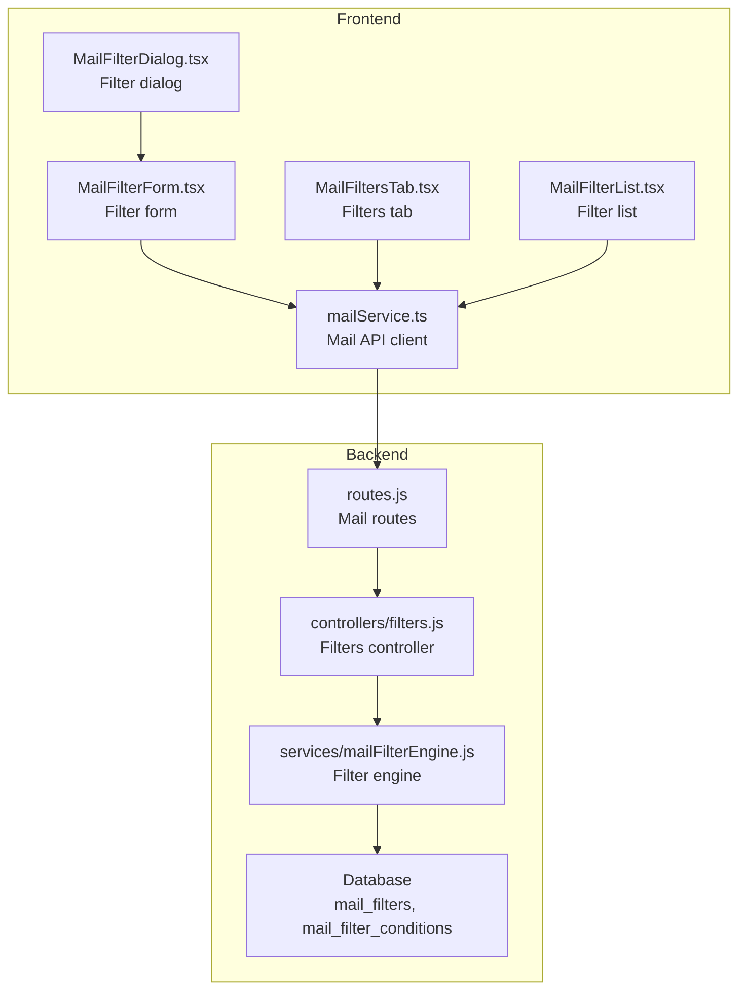
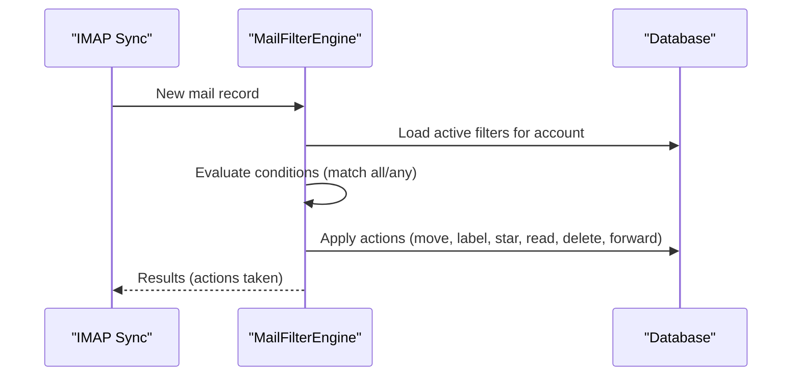
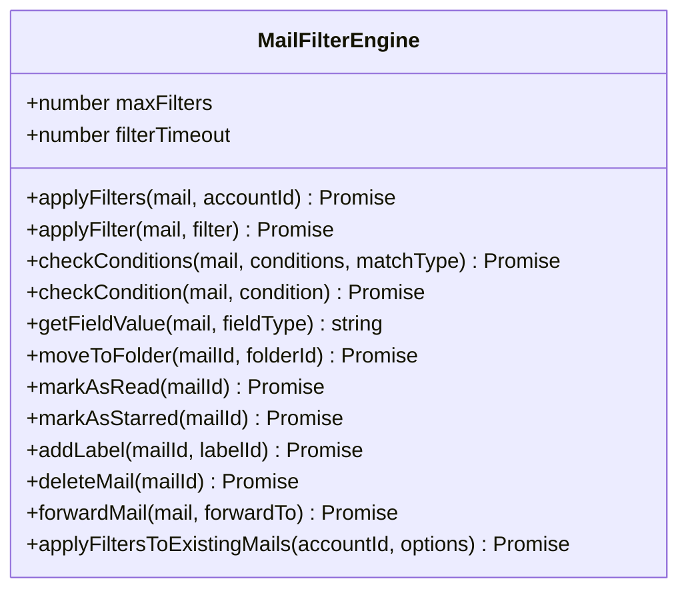
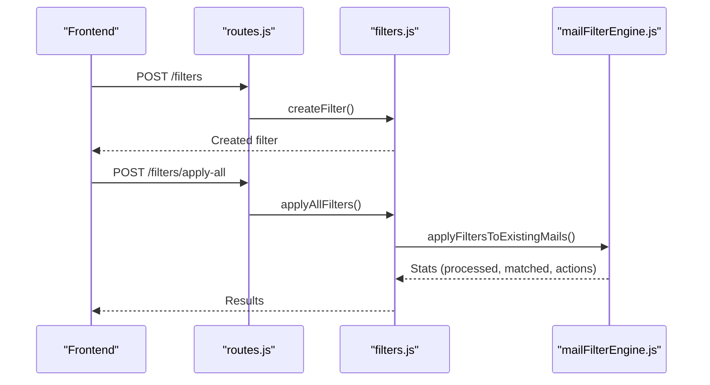
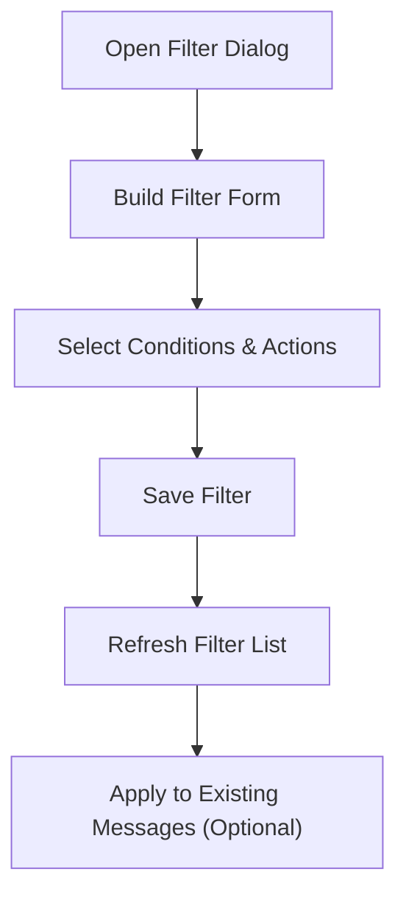
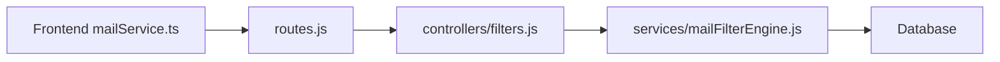

# Filtering and Organization

<cite>
**Referenced Files in This Document**
- [mailFilterEngine.js](file://backend/modules/mail/services/mailFilterEngine.js)
- [filters.js](file://backend/modules/mail/controllers/filters.js)
- [routes.js](file://backend/modules/mail/routes.js)
- [104_add_missing_mail_filter_columns.sql](file://backend/migrations/104_add_missing_mail_filter_columns.sql)
- [MailFilterDialog.tsx](file://frontend/src/modules/mail/components/dialogs/MailFilterDialog.tsx)
- [MailFilterForm.tsx](file://frontend/src/modules/mail/components/MailFilterForm.tsx)
- [MailFiltersTab.tsx](file://frontend/src/modules/mail/components/MailFiltersTab.tsx)
- [MailFilterList.tsx](file://frontend/src/modules/mail/components/MailFilterList.tsx)
- [mailService.ts](file://frontend/src/modules/mail/api/mailService.ts)
</cite>

## Table of Contents
1. [Introduction](#introduction)
2. [Project Structure](#project-structure)
3. [Core Components](#core-components)
4. [Architecture Overview](#architecture-overview)
5. [Detailed Component Analysis](#detailed-component-analysis)
6. [Dependency Analysis](#dependency-analysis)
7. [Performance Considerations](#performance-considerations)
8. [Troubleshooting Guide](#troubleshooting-guide)
9. [Conclusion](#conclusion)
10. [Appendices](#appendices)

## Introduction
This document explains the email filtering and organization system, focusing on the rule-based filter engine that automatically sorts, labels, forwards, and deletes incoming and existing messages. It covers filter creation and management via the backend API and the frontend filter form interface, the execution workflow, categorization and priority handling, automated routing, performance optimization for large mail volumes, and debugging/troubleshooting techniques.

## Project Structure
The filtering system spans backend services and controllers, database schema for filters and conditions, and frontend components for creating and managing filters.

**Diagram sources**
- [routes.js:47-54](file://backend/modules/mail/routes.js#L47-L54)
- [filters.js:12-26](file://backend/modules/mail/controllers/filters.js#L12-L26)
- [mailFilterEngine.js:35-88](file://backend/modules/mail/services/mailFilterEngine.js#L35-L88)

**Section sources**
- [routes.js:47-54](file://backend/modules/mail/routes.js#L47-L54)
- [filters.js:12-26](file://backend/modules/mail/controllers/filters.js#L12-L26)
- [mailFilterEngine.js:35-88](file://backend/modules/mail/services/mailFilterEngine.js#L35-L88)

## Core Components
- Filter Engine: Applies active filters to new or existing messages, evaluates conditions, and executes actions (move, mark read/star, add label, delete, forward).
- Controllers: Provide CRUD and application endpoints for filters and batch application.
- Routes: Expose endpoints for filter management and execution.
- Database Schema: Stores filters, conditions, and supporting columns for advanced actions (delete, forward, label).
- Frontend Form: Provides a guided UI to create and edit filters with conditions and actions.

Key capabilities:
- Conditions: from, to, subject, body, has_attachment, size, date; operators include contains, equals, starts_with, ends_with, not_contains, regex, plus numeric/date comparisons.
- Actions: move_to_folder, mark_as_read, mark_as_starred, add_label, delete, forward.
- Execution modes: per-message on arrival and batch application to existing messages.

**Section sources**
- [mailFilterEngine.js:5-30](file://backend/modules/mail/services/mailFilterEngine.js#L5-L30)
- [mailFilterEngine.js:139-186](file://backend/modules/mail/services/mailFilterEngine.js#L139-L186)
- [mailFilterEngine.js:194-278](file://backend/modules/mail/services/mailFilterEngine.js#L194-L278)
- [104_add_missing_mail_filter_columns.sql:5-25](file://backend/migrations/104_add_missing_mail_filter_columns.sql#L5-L25)

## Architecture Overview
The filter engine integrates with the mail processing pipeline to automatically organize messages upon arrival or retroactively on demand.

**Diagram sources**
- [mailFilterEngine.js:48-88](file://backend/modules/mail/services/mailFilterEngine.js#L48-L88)
- [mailFilterEngine.js:139-186](file://backend/modules/mail/services/mailFilterEngine.js#L139-L186)

## Detailed Component Analysis

### Backend Filter Engine
The engine loads active filters ordered by display order, checks conditions against mail fields, and applies configured actions. It supports:
- Condition evaluation with logical grouping (all/any).
- Field extraction for sender, recipient, subject, body, reply-to, list-id.
- Specialized checks for attachments, size, and date.
- Action execution with logging and error handling.

**Diagram sources**
- [mailFilterEngine.js:35-589](file://backend/modules/mail/services/mailFilterEngine.js#L35-L589)

**Section sources**
- [mailFilterEngine.js:35-88](file://backend/modules/mail/services/mailFilterEngine.js#L35-L88)
- [mailFilterEngine.js:139-186](file://backend/modules/mail/services/mailFilterEngine.js#L139-L186)
- [mailFilterEngine.js:194-278](file://backend/modules/mail/services/mailFilterEngine.js#L194-L278)
- [mailFilterEngine.js:369-532](file://backend/modules/mail/services/mailFilterEngine.js#L369-L532)

### Controllers and Routes
Endpoints expose filter CRUD and application:
- GET /filters/:accountId lists user filters for an account.
- POST /filters creates a filter with match type and actions.
- PUT /filters/:filterId updates filter fields.
- DELETE /filters/:filterId removes a filter.
- POST /filters/:filterId/apply applies a single filter to recent messages.
- POST /filters/apply-all applies all filters to existing messages.

**Diagram sources**
- [routes.js:49-54](file://backend/modules/mail/routes.js#L49-L54)
- [filters.js:30-52](file://backend/modules/mail/controllers/filters.js#L30-L52)
- [filters.js:162-185](file://backend/modules/mail/controllers/filters.js#L162-L185)
- [mailFilterEngine.js:537-583](file://backend/modules/mail/services/mailFilterEngine.js#L537-L583)

**Section sources**
- [routes.js:49-54](file://backend/modules/mail/routes.js#L49-L54)
- [filters.js:12-26](file://backend/modules/mail/controllers/filters.js#L12-L26)
- [filters.js:30-52](file://backend/modules/mail/controllers/filters.js#L30-L52)
- [filters.js:56-91](file://backend/modules/mail/controllers/filters.js#L56-L91)
- [filters.js:95-111](file://backend/modules/mail/controllers/filters.js#L95-L111)
- [filters.js:115-158](file://backend/modules/mail/controllers/filters.js#L115-L158)
- [filters.js:162-185](file://backend/modules/mail/controllers/filters.js#L162-L185)

### Database Schema and Columns
Advanced filter actions rely on additional columns:
- delete_mail: boolean to delete matching messages.
- forward_to: optional email address to forward matching messages.
- apply_label_id: optional label to attach to matching messages.

Indexes support performance for forward_to and label lookups.

**Section sources**
- [104_add_missing_mail_filter_columns.sql:5-25](file://backend/migrations/104_add_missing_mail_filter_columns.sql#L5-L25)

### Frontend Filter Form Interface
The frontend provides:
- Dialog-based filter creation/editing with form controls.
- Filter list and tabbed interface for management.
- API integration to persist filters and trigger application.

**Diagram sources**
- [MailFilterDialog.tsx](file://frontend/src/modules/mail/components/dialogs/MailFilterDialog.tsx)
- [MailFilterForm.tsx](file://frontend/src/modules/mail/components/MailFilterForm.tsx)
- [MailFiltersTab.tsx](file://frontend/src/modules/mail/components/MailFiltersTab.tsx)
- [MailFilterList.tsx](file://frontend/src/modules/mail/components/MailFilterList.tsx)
- [mailService.ts](file://frontend/src/modules/mail/api/mailService.ts)

**Section sources**
- [MailFilterDialog.tsx](file://frontend/src/modules/mail/components/dialogs/MailFilterDialog.tsx)
- [MailFilterForm.tsx](file://frontend/src/modules/mail/components/MailFilterForm.tsx)
- [MailFiltersTab.tsx](file://frontend/src/modules/mail/components/MailFiltersTab.tsx)
- [MailFilterList.tsx](file://frontend/src/modules/mail/components/MailFilterList.tsx)
- [mailService.ts](file://frontend/src/modules/mail/api/mailService.ts)

## Dependency Analysis
Filter execution depends on:
- Controllers invoking the filter engine.
- Engine querying filters and conditions from the database.
- Engine performing actions via SQL updates and queue inserts.
- Frontend communicating with routes via API service.

**Diagram sources**
- [routes.js:47-54](file://backend/modules/mail/routes.js#L47-L54)
- [filters.js:12-26](file://backend/modules/mail/controllers/filters.js#L12-L26)
- [mailFilterEngine.js:93-116](file://backend/modules/mail/services/mailFilterEngine.js#L93-L116)

**Section sources**
- [routes.js:47-54](file://backend/modules/mail/routes.js#L47-L54)
- [filters.js:12-26](file://backend/modules/mail/controllers/filters.js#L12-L26)
- [mailFilterEngine.js:93-116](file://backend/modules/mail/services/mailFilterEngine.js#L93-L116)

## Performance Considerations
- Limit active filters: The engine enforces a maximum number of filters to process per account and applies a per-filter timeout to avoid long-running evaluations.
- Batch processing limits: When applying filters to existing messages, limits can be set to control volume and prevent overload.
- Indexes: Database indexes on forward_to and label_id improve lookup performance for advanced actions.
- Efficient condition checks: String normalization and operator-specific checks minimize overhead during evaluation.
- Queue-based forwarding: Forwarding uses a send queue to offload immediate processing.

Recommendations:
- Keep filter counts reasonable and order by importance to reduce unnecessary evaluations.
- Use regex judiciously; prefer simpler operators when possible.
- Monitor logs for slow or failing conditions and refine rules accordingly.

**Section sources**
- [mailFilterEngine.js:37-41](file://backend/modules/mail/services/mailFilterEngine.js#L37-L41)
- [mailFilterEngine.js:537-583](file://backend/modules/mail/services/mailFilterEngine.js#L537-L583)
- [104_add_missing_mail_filter_columns.sql:16-20](file://backend/migrations/104_add_missing_mail_filter_columns.sql#L16-L20)

## Troubleshooting Guide
Common issues and resolutions:
- Filter not applied:
  - Verify the filter is active and ordered correctly.
  - Confirm conditions match expected field values (case-insensitive string checks).
  - Check for regex errors; invalid patterns cause condition checks to fail.
- Action not executed:
  - Moving to folder requires a valid destination folder ID.
  - Adding a label requires a valid label ID present in the labels table.
  - Deleting moves to the trash folder; ensure a trash folder exists.
  - Forwarding requires a valid email address and inserts into the send queue.
- Performance problems:
  - Reduce filter count or complexity.
  - Use "apply once" to stop further processing after first match.
  - Limit batch runs to smaller sets while testing.
- Debugging tips:
  - Inspect engine logs for per-filter errors.
  - Use dry-run mode to preview actions without executing them.
  - Validate conditions incrementally and test with a small subset of messages.

**Section sources**
- [mailFilterEngine.js:74-76](file://backend/modules/mail/services/mailFilterEngine.js#L74-L76)
- [mailFilterEngine.js:369-388](file://backend/modules/mail/services/mailFilterEngine.js#L369-L388)
- [mailFilterEngine.js:439-460](file://backend/modules/mail/services/mailFilterEngine.js#L439-L460)
- [mailFilterEngine.js:465-487](file://backend/modules/mail/services/mailFilterEngine.js#L465-L487)
- [mailFilterEngine.js:492-532](file://backend/modules/mail/services/mailFilterEngine.js#L492-L532)

## Conclusion
The filtering and organization system provides a robust, extensible framework for automating email processing. With rule-based conditions, flexible actions, and a user-friendly frontend form, administrators can efficiently sort, label, forward, and delete messages. Proper indexing, cautious use of regex, and batch processing limits help maintain performance at scale.

## Appendices

### Practical Examples
- Example 1: Auto-sort newsletters
  - Condition: subject contains “newsletter”
  - Action: move to “Newsletter” folder
- Example 2: Flag high-priority items
  - Condition: sender in allowlist
  - Action: mark as starred and add “Priority” label
- Example 3: Archive old receipts
  - Condition: subject contains “receipt”, date older than 30 days
  - Action: move to “Archive” folder
- Example 4: Delete spam
  - Condition: body contains “click here now”
  - Action: delete (move to trash)
- Example 5: Forward support tickets
  - Condition: subject contains “ticket”
  - Action: forward to support@example.com

### Rule Configuration Tips
- Start simple: Use basic contains/equals conditions before adding regex.
- Group by intent: Separate filters for sorting vs. labeling vs. forwarding.
- Test incrementally: Use dry-run to preview outcomes before applying to many messages.
- Use “apply once” to prevent cascading unintended actions.